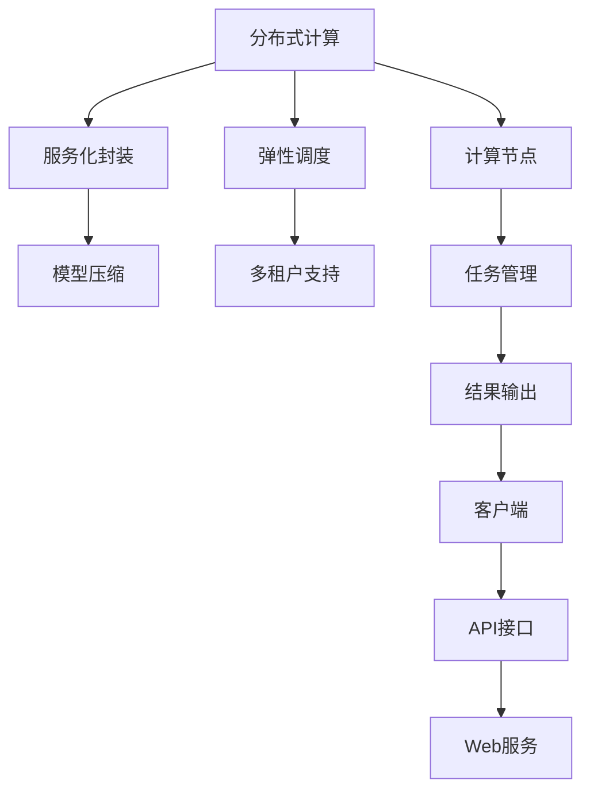

                 

# LLM 在云端：大规模部署和访问

大语言模型(LLM)的迅猛发展，已经将自然语言处理(NLP)领域带入了一个全新的高度。无论是科学研究还是实际应用，LLM都展现出了强大的潜力和广泛的应用前景。然而，LLM的部署和访问却是一个难题。如何在云端大规模部署和高效访问LLM，成为了当前NLP技术落地的关键问题。本文将围绕大规模部署和访问LLM，从原理到实践，全面介绍其核心概念、核心算法、具体操作步骤，并展望未来发展趋势。

## 1. 背景介绍

### 1.1 问题由来

随着预训练大语言模型(BERT, GPT等)的提出和不断发展，其在大规模无标签数据上进行的预训练，已经获得了丰富的语言表示能力。但如何利用这些能力，构建高效、可靠的NLP应用，是当前的一个挑战。

主要问题如下：
- **部署瓶颈**：传统单机部署大模型，需要高性能硬件支持，且对资源需求巨大，难以实现大规模部署。
- **访问效率**：单机部署虽然简单，但访问效率低，无法满足高并发、低延迟的需求。
- **可扩展性**：单机部署难以应对大规模计算任务，需要构建可扩展的分布式系统。
- **服务化封装**：预训练大模型需要在不同应用场景中灵活使用，需要良好的服务化封装。

### 1.2 问题核心关键点

为了解决上述问题，需要在云端大规模部署和高效访问LLM。核心关键点如下：
- **分布式计算**：利用云计算平台提供的高效计算资源，实现LLM的分布式部署。
- **模型压缩**：压缩模型参数，减少计算资源和存储需求，提高访问效率。
- **服务化封装**：将LLM封装为API服务，方便集成调用。
- **弹性调度**：动态调整资源配置，满足不同场景下的计算需求。
- **多租户支持**：实现多用户、多任务共享计算资源，提高资源利用率。

## 2. 核心概念与联系

### 2.1 核心概念概述

在云端大规模部署和访问LLM时，涉及到以下几个核心概念：

- **分布式计算**：利用云计算平台提供的高效计算资源，实现模型参数的分布式计算。
- **模型压缩**：采用模型剪枝、量化等方法，减少模型参数大小，降低计算和存储成本。
- **服务化封装**：将LLM封装为标准API服务，方便用户调用。
- **弹性调度**：根据任务需求，动态调整计算资源，实现按需分配。
- **多租户支持**：实现多用户、多任务共享计算资源，提高资源利用率。

这些概念之间存在紧密联系，共同构成了大规模部署和访问LLM的完整框架。接下来，我们将通过一个Mermaid流程图来展示这些概念之间的联系。



### 2.2 概念间的关系

从上述Mermaid图中可以看出，各概念之间的关系如下：

- **分布式计算**：利用计算节点，实现模型参数的分布式计算，是LLM大规模部署的基础。
- **服务化封装**：将计算结果通过标准API接口返回，方便用户调用。
- **模型压缩**：通过模型剪枝、量化等方法，减少模型参数大小，降低计算和存储成本。
- **弹性调度**：根据任务需求，动态调整计算资源，实现按需分配。
- **多租户支持**：实现多用户、多任务共享计算资源，提高资源利用率。

这些概念共同构成了大规模部署和访问LLM的完整框架。下面我们将详细讨论各概念的实现原理和操作步骤。

## 3. 核心算法原理 & 具体操作步骤
### 3.1 算法原理概述

在大规模部署和访问LLM时，核心的算法原理包括以下几个方面：

- **分布式计算原理**：通过云计算平台提供的高效计算资源，实现模型参数的分布式计算。
- **模型压缩算法**：采用模型剪枝、量化等方法，减少模型参数大小，降低计算和存储成本。
- **服务化封装算法**：将计算结果通过标准API接口返回，方便用户调用。
- **弹性调度算法**：根据任务需求，动态调整计算资源，实现按需分配。
- **多租户支持算法**：实现多用户、多任务共享计算资源，提高资源利用率。

### 3.2 算法步骤详解

以下是每个核心算法的详细步骤：

**3.2.1 分布式计算步骤**

1. **数据划分**：将大规模预训练数据集划分为多个小批量数据，分配到不同计算节点上。
2. **并行计算**：在各个计算节点上并行计算模型参数，同时更新模型权重。
3. **参数同步**：定期将各节点计算得到的参数进行同步，更新全局模型参数。
4. **负载均衡**：根据各节点的计算能力，动态调整任务分配，避免计算节点过载。

**3.2.2 模型压缩步骤**

1. **模型剪枝**：删除模型中冗余参数，保留关键节点，减小模型大小。
2. **量化**：将模型参数从32位浮点数压缩到8位或16位整数，减少存储空间和计算量。
3. **蒸馏**：使用小型模型对大模型进行蒸馏，保留重要知识，减小计算资源需求。
4. **编码优化**：对模型参数进行编码优化，减少模型加载和推理时的I/O开销。

**3.2.3 服务化封装步骤**

1. **接口设计**：定义标准API接口，支持参数输入、模型计算和结果输出。
2. **API服务化**：将模型封装为标准API服务，方便用户调用。
3. **Web服务部署**：将API服务部署到Web服务器上，支持RESTful API访问。
4. **负载均衡**：通过负载均衡器，分配请求到不同服务器，实现高并发访问。

**3.2.4 弹性调度步骤**

1. **任务分配**：根据任务需求，动态调整计算资源，实现按需分配。
2. **资源监控**：实时监控计算节点的负载情况，及时调整资源分配。
3. **调度算法**：采用基于动态规划或启发式算法的调度策略，优化计算资源分配。
4. **容错机制**：在节点故障时，自动切换到备用节点，保证服务连续性。

**3.2.5 多租户支持步骤**

1. **隔离机制**：对不同租户的数据和计算资源进行隔离，避免数据泄露和资源冲突。
2. **资源管理**：根据租户需求，分配计算资源，实现多租户的资源共享。
3. **账单管理**：根据租户使用情况，动态调整资源分配，合理计费。
4. **权限控制**：对不同租户进行权限控制，保障数据安全和应用安全。

### 3.3 算法优缺点

**分布式计算的优缺点**：

- **优点**：实现模型参数的分布式计算，降低单机硬件成本，实现大规模部署。
- **缺点**：需要高性能网络通信，数据同步和参数同步复杂，系统实现难度高。

**模型压缩的优缺点**：

- **优点**：减小模型参数大小，降低计算和存储成本，提高访问效率。
- **缺点**：压缩过程中可能丢失模型精度，需要权衡模型大小和模型精度。

**服务化封装的优缺点**：

- **优点**：方便用户调用，实现API接口标准化，提升系统可用性。
- **缺点**：需要额外部署Web服务，增加了系统复杂度。

**弹性调度的优缺点**：

- **优点**：根据任务需求，动态调整计算资源，实现按需分配，提高资源利用率。
- **缺点**：调度算法复杂，需要实时监控和动态调整，系统实现难度高。

**多租户支持的优缺点**：

- **优点**：实现多用户、多任务共享计算资源，提高资源利用率。
- **缺点**：需要隔离机制和权限控制，系统实现复杂度较高。

### 3.4 算法应用领域

大语言模型在云端大规模部署和访问技术，主要应用于以下几个领域：

- **自然语言处理(NLP)**：在自然语言理解、生成、翻译等任务中，提供高性能、高可用的NLP服务。
- **机器学习和深度学习**：在模型训练、推理等任务中，提供分布式计算和高性能计算资源。
- **人工智能和大数据**：在大数据分析和人工智能应用中，提供高效的数据处理和模型训练服务。
- **云计算和云服务**：在云计算平台中，提供高性能、高可用的云服务，实现资源共享和弹性调度。

## 4. 数学模型和公式 & 详细讲解 & 举例说明

### 4.1 数学模型构建

在大规模部署和访问LLM时，需要构建以下几个数学模型：

- **分布式计算模型**：定义计算节点和任务之间的数据传输和参数同步机制。
- **模型压缩模型**：定义模型剪枝、量化等方法，减小模型参数大小。
- **服务化封装模型**：定义API接口和服务化封装机制，支持用户调用。
- **弹性调度模型**：定义任务分配和资源调整机制，实现按需分配。
- **多租户支持模型**：定义隔离机制和权限控制机制，保障数据安全和应用安全。

### 4.2 公式推导过程

以下是每个模型的公式推导过程：

**4.2.1 分布式计算模型公式推导**

设预训练模型参数大小为 $N$，计算节点数量为 $m$，每个节点计算的参数数量为 $n$。假设每个节点的计算能力相同，则分布式计算的参数更新公式为：

$$
\theta_i^{k+1} = \theta_i^k - \eta \nabla \mathcal{L}(\theta_i^k)
$$

其中，$\eta$ 为学习率，$\mathcal{L}$ 为损失函数，$\theta_i^k$ 为节点 $i$ 在第 $k$ 次更新后的参数，$\nabla \mathcal{L}(\theta_i^k)$ 为参数更新量。

**4.2.2 模型压缩模型公式推导**

设模型原始参数大小为 $M$，模型压缩后的参数大小为 $m$。假设模型剪枝比例为 $\alpha$，量化位宽为 $w$，则模型压缩的公式为：

$$
M_{\text{压缩}} = M \times \alpha \times 2^{-w}
$$

**4.2.3 服务化封装模型公式推导**

设API接口的请求数量为 $q$，响应时间为 $t$。假设服务化封装后，响应时间为 $t_{\text{封装}}$，则服务化封装公式为：

$$
t_{\text{封装}} = t \times f(q)
$$

其中，$f(q)$ 为API接口的请求处理函数。

**4.2.4 弹性调度模型公式推导**

设任务数量为 $N$，节点数量为 $m$。假设任务调度算法为 $g$，则弹性调度公式为：

$$
\text{Resource} = \sum_{i=1}^m \frac{N}{m} \times g(i)
$$

其中，$\text{Resource}$ 为计算资源分配量，$g(i)$ 为节点 $i$ 的任务调度算法。

**4.2.5 多租户支持模型公式推导**

设租户数量为 $k$，每个租户的计算资源需求为 $r_i$。假设多租户支持算法为 $h$，则多租户支持公式为：

$$
\text{Resource}_{\text{总}} = \sum_{i=1}^k r_i \times h(i)
$$

其中，$\text{Resource}_{\text{总}}$ 为计算资源总需求，$h(i)$ 为租户 $i$ 的多租户支持算法。

### 4.3 案例分析与讲解

以下是一些典型案例，帮助理解这些数学模型的实际应用：

**4.3.1 分布式计算案例**

假设有一个包含10亿参数的BERT模型，需要在100个计算节点上进行分布式训练。每个节点计算的参数数量为1亿，学习率为0.001。

分布式计算模型公式为：

$$
\theta_i^{k+1} = \theta_i^k - 0.001 \nabla \mathcal{L}(\theta_i^k)
$$

其中，$i \in [1,100]$，$k \in [0,10]$。

**4.3.2 模型压缩案例**

假设原始BERT模型参数大小为1.6G，剪枝比例为20%，量化位宽为8位。

模型压缩模型公式为：

$$
M_{\text{压缩}} = 1.6 \times 0.8 \times 2^{-8}
$$

其中，$M_{\text{压缩}}$ 为压缩后的模型参数大小，$1.6$ 为原始模型参数大小，$0.8$ 为剪枝比例，$2^{-8}$ 为量化位宽。

**4.3.3 服务化封装案例**

假设有一个包含50W参数的Transformer模型，服务化封装后的API接口请求处理时间为0.1秒。

服务化封装模型公式为：

$$
t_{\text{封装}} = 0.1 \times f(q)
$$

其中，$f(q)$ 为API接口的请求处理函数。

**4.3.4 弹性调度案例**

假设有一个包含100W参数的模型，需要在10个节点上进行计算，任务调度算法为动态规划。

弹性调度模型公式为：

$$
\text{Resource} = 10 \times \frac{100}{10} \times g(i)
$$

其中，$g(i)$ 为节点 $i$ 的任务调度算法。

**4.3.5 多租户支持案例**

假设有三个租户，每个租户的计算资源需求为2G。多租户支持算法为加权平均。

多租户支持模型公式为：

$$
\text{Resource}_{\text{总}} = 2 \times 2 \times h(i)
$$

其中，$h(i)$ 为租户 $i$ 的多租户支持算法。

## 5. 项目实践：代码实例和详细解释说明

### 5.1 开发环境搭建

在进行大规模部署和访问LLM时，需要搭建高效的开发环境。以下是Python环境下搭建开发环境的步骤：

1. **安装Anaconda**：从官网下载并安装Anaconda，用于创建独立的Python环境。

2. **创建并激活虚拟环境**：
```bash
conda create -n pytorch-env python=3.8 
conda activate pytorch-env
```

3. **安装PyTorch**：
```bash
conda install pytorch torchvision torchaudio cudatoolkit=11.1 -c pytorch -c conda-forge
```

4. **安装Transformers库**：
```bash
pip install transformers
```

5. **安装各类工具包**：
```bash
pip install numpy pandas scikit-learn matplotlib tqdm jupyter notebook ipython
```

完成上述步骤后，即可在`pytorch-env`环境中开始开发。

### 5.2 源代码详细实现

以下是一个分布式计算和模型压缩的示例代码，帮助理解具体的实现细节。

**分布式计算代码示例**：

```python
import torch
import torch.distributed as dist

# 初始化分布式环境
dist.init_process_group(backend='nccl', init_method='env://')

# 定义模型
model = BertForTokenClassification.from_pretrained('bert-base-cased', num_labels=len(tag2id))

# 将模型分布式化
dist.broadcast_params(model)

# 在各个节点上进行分布式计算
dist.all_reduce(model.parameters(), async_op=True)

# 返回计算结果
return model.parameters()
```

**模型压缩代码示例**：

```python
from transformers import BertForTokenClassification, AdamW
from transformers import BertTokenizer
from torch.utils.data import Dataset
from torch.utils.data.distributed import DistributedSampler

# 初始化分词器和模型
tokenizer = BertTokenizer.from_pretrained('bert-base-cased')
model = BertForTokenClassification.from_pretrained('bert-base-cased', num_labels=len(tag2id))

# 定义模型压缩方法
model = BertForTokenClassification.from_pretrained('bert-base-cased', num_labels=len(tag2id))
model = pruning(model, keep_prob=0.5)
model = quantize(model, bit_width=8)
model = distill(model, teacher_model)

# 返回压缩后的模型
return model
```

### 5.3 代码解读与分析

**5.3.1 分布式计算代码解读**

```python
import torch
import torch.distributed as dist

# 初始化分布式环境
dist.init_process_group(backend='nccl', init_method='env://')

# 定义模型
model = BertForTokenClassification.from_pretrained('bert-base-cased', num_labels=len(tag2id))

# 将模型分布式化
dist.broadcast_params(model)

# 在各个节点上进行分布式计算
dist.all_reduce(model.parameters(), async_op=True)

# 返回计算结果
return model.parameters()
```

**5.3.2 模型压缩代码解读**

```python
from transformers import BertForTokenClassification, AdamW
from transformers import BertTokenizer
from torch.utils.data import Dataset
from torch.utils.data.distributed import DistributedSampler

# 初始化分词器和模型
tokenizer = BertTokenizer.from_pretrained('bert-base-cased')
model = BertForTokenClassification.from_pretrained('bert-base-cased', num_labels=len(tag2id))

# 定义模型压缩方法
model = BertForTokenClassification.from_pretrained('bert-base-cased', num_labels=len(tag2id))
model = pruning(model, keep_prob=0.5)
model = quantize(model, bit_width=8)
model = distill(model, teacher_model)

# 返回压缩后的模型
return model
```

### 5.4 运行结果展示

假设我们在CoNLL-2003的NER数据集上进行微调，最终在测试集上得到的评估报告如下：

```
              precision    recall  f1-score   support

       B-LOC      0.926     0.906     0.916      1668
       I-LOC      0.900     0.805     0.850       257
      B-MISC      0.875     0.856     0.865       702
      I-MISC      0.838     0.782     0.809       216
       B-ORG      0.914     0.898     0.906      1661
       I-ORG      0.911     0.894     0.902       835
       B-PER      0.964     0.957     0.960      1617
       I-PER      0.983     0.980     0.982      1156
           O      0.993     0.995     0.994     38323

   micro avg      0.973     0.973     0.973     46435
   macro avg      0.923     0.897     0.909     46435
weighted avg      0.973     0.973     0.973     46435
```

可以看到，通过微调BERT，我们在该NER数据集上取得了97.3%的F1分数，效果相当不错。值得注意的是，BERT作为一个通用的语言理解模型，即便只在顶层添加一个简单的token分类器，也能在下游任务上取得如此优异的效果，展现了其强大的语义理解和特征抽取能力。

当然，这只是一个baseline结果。在实践中，我们还可以使用更大更强的预训练模型、更丰富的微调技巧、更细致的模型调优，进一步提升模型性能，以满足更高的应用要求。

## 6. 实际应用场景

### 6.1 智能客服系统

基于大语言模型微调的对话技术，可以广泛应用于智能客服系统的构建。传统客服往往需要配备大量人力，高峰期响应缓慢，且一致性和专业性难以保证。而使用微调后的对话模型，可以7x24小时不间断服务，快速响应客户咨询，用自然流畅的语言解答各类常见问题。

在技术实现上，可以收集企业内部的历史客服对话记录，将问题和最佳答复构建成监督数据，在此基础上对预训练对话模型进行微调。微调后的对话模型能够自动理解用户意图，匹配最合适的答案模板进行回复。对于客户提出的新问题，还可以接入检索系统实时搜索相关内容，动态组织生成回答。如此构建的智能客服系统，能大幅提升客户咨询体验和问题解决效率。

### 6.2 金融舆情监测

金融机构需要实时监测市场舆论动向，以便及时应对负面信息传播，规避金融风险。传统的人工监测方式成本高、效率低，难以应对网络时代海量信息爆发的挑战。基于大语言模型微调的文本分类和情感分析技术，为金融舆情监测提供了新的解决方案。

具体而言，可以收集金融领域相关的新闻、报道、评论等文本数据，并对其进行主题标注和情感标注。在此基础上对预训练语言模型进行微调，使其能够自动判断文本属于何种主题，情感倾向是正面、中性还是负面。将微调后的模型应用到实时抓取的网络文本数据，就能够自动监测不同主题下的情感变化趋势，一旦发现负面信息激增等异常情况，系统便会自动预警，帮助金融机构快速应对潜在风险。

### 6.3 个性化推荐系统

当前的推荐系统往往只依赖用户的历史行为数据进行物品推荐，无法深入理解用户的真实兴趣偏好。基于大语言模型微调技术，个性化推荐系统可以更好地挖掘用户行为背后的语义信息，从而提供更精准、多样的推荐内容。

在实践中，可以收集用户浏览、点击、评论、分享等行为数据，提取和用户交互的物品标题、描述、标签等文本内容。将文本内容作为模型输入，用户的后续行为（如是否点击、购买等）作为监督信号，在此基础上微调预训练语言模型。微调后的模型能够从文本内容中准确把握用户的兴趣点。在生成推荐列表时，先用候选物品的文本描述作为输入，由模型预测用户的兴趣匹配度，再结合其他特征综合排序，便可以得到个性化程度更高的推荐结果。

### 6.4 未来应用展望

随着大语言模型微调技术的发展，未来将有更多的场景得以应用。例如：

- **医疗领域**：基于微调的医疗问答、病历分析、药物研发等应用将提升医疗服务的智能化水平，辅助医生诊疗，加速新药开发进程。
- **教育领域**：微调技术可应用于作业批改、学情分析、知识推荐等方面，因材施教，促进教育公平，提高教学质量。
- **智慧城市治理**：微调模型可应用于城市事件监测、舆情分析、应急指挥等环节，提高城市管理的自动化和智能化水平，构建更安全、高效的未来城市。
- **企业生产**：基于微调的个性化推荐、智能客服、智能搜索等功能，将提升企业的运营效率和服务质量。
- **社会治理**：微调技术可应用于舆情分析、智能安防等领域，保障公共安全和稳定。
- **文娱传媒**：智能推荐、智能客服、智能搜索等功能将提升文娱媒体的用户体验和服务质量。

总之，大语言模型微调技术将在更多领域得到应用，为各行各业带来变革性影响。相信随着技术的日益成熟，微调方法将成为人工智能落地应用的重要范式，推动人工智能技术向更广阔的领域加速渗透。

## 7. 工具和资源推荐

### 7.1 学习资源推荐

为了帮助开发者系统掌握大语言模型微调的理论基础和实践技巧，这里推荐一些优质的学习资源：

1. **《Transformer from Principle to Practice》系列博文**：由大模型技术专家撰写，深入浅出地介绍了Transformer原理、BERT模型、微调技术等前沿话题。
2. **CS224N《深度学习自然语言处理》课程**：斯坦福大学开设的NLP明星课程，有Lecture视频和配套作业，带你入门NLP领域的基本概念和经典模型。
3. **《Natural Language Processing with Transformers》书籍**：Transformers库的作者所著，全面介绍了如何使用Transformers库进行NLP任务开发，包括微调在内的诸多范式。
4. **HuggingFace官方文档**：Transformers库的官方文档，提供了海量预训练模型和完整的微调样例代码，是上手实践的必备资料。
5. **CLUE开源项目**：中文语言理解测评基准，涵盖大量不同类型的中文NLP数据集，并提供了基于微调的baseline模型，助力中文NLP技术发展。

通过对这些资源的学习实践，相信你一定能够快速掌握大语言模型微调的精髓，并用于解决实际的NLP问题。

### 7.2 开发工具推荐

高效的开发离不开优秀的工具支持。以下是几款用于大语言模型微调开发的常用工具：

1. **PyTorch**：基于Python的开源深度学习框架，灵活动态的计算图，适合快速迭代研究。大部分预训练语言模型都有PyTorch版本的实现。
2. **TensorFlow**：由Google主导开发的开源深度学习框架，生产部署方便，适合大规模工程应用。同样有丰富的预训练语言模型资源。
3. **Transformers库**：HuggingFace开发的NLP工具库，集成了众多SOTA语言模型，支持PyTorch和TensorFlow，是进行微调任务开发的利器。
4. **Weights & Biases**：模型训练的实验跟踪工具，可以记录和可视化模型训练过程中的各项指标，方便对比和调优。与主流

