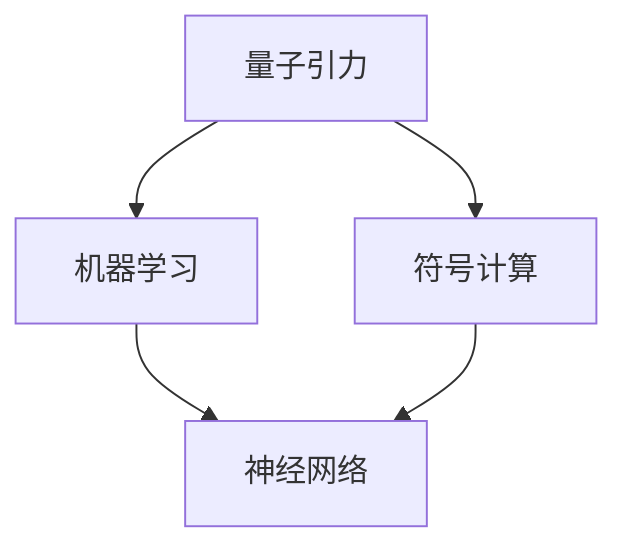
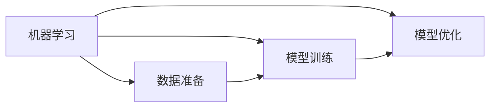
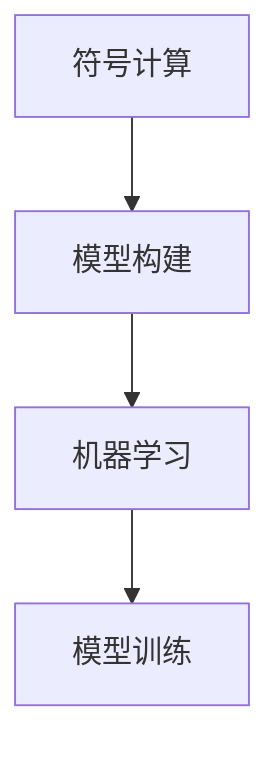
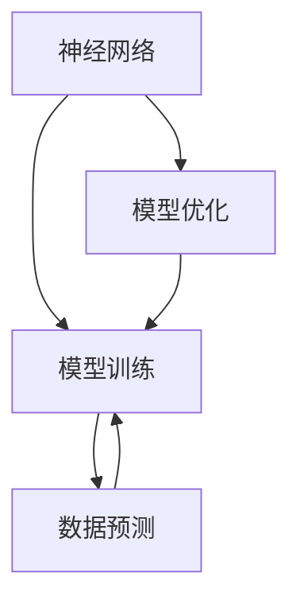
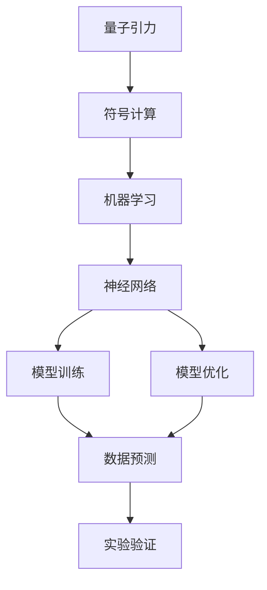

                 

# AGI在量子引力中的应用实例

> 关键词：AGI,量子引力,应用实例,人工智能,物理学

## 1. 背景介绍

### 1.1 问题由来

人工智能（Artificial Intelligence, AI）已经深入到社会的各个领域，改变了我们的工作和生活方式。随着技术的发展，AI正逐步从弱人工智能（Weak AI）向强人工智能（Strong AI）或通用人工智能（Artificial General Intelligence, AGI）迈进。AGI被定义为能够理解和执行任意复杂任务的智能体，它在多个学科领域中都有着广泛的应用前景。

量子引力是物理学中的一个重要研究方向，致力于探究引力和量子力学之间的关系。量子引力旨在解释物质和能量在微观尺度上的行为，以及这些行为如何影响宏观尺度上的引力和时空结构。然而，由于量子引力和经典引力的性质迥异，传统计算机无法高效处理其中的复杂计算。因此，需要将量子引力问题转化为计算机可处理的数学模型，并利用AI技术进行求解。

### 1.2 问题核心关键点

量子引力问题具有高度的复杂性和非线性，传统计算机的计算能力难以应对。因此，研究者们提出了多种AI方法来处理量子引力问题，包括机器学习、符号计算、基于神经网络的模型等。这些方法通过构建量子引力模型，利用AI的强大处理能力，可以有效地求解其中的复杂问题。

AI在量子引力中的应用主要包括以下几个方面：
1. 构建量子引力模型。利用机器学习和符号计算技术，构建能够模拟量子引力现象的模型。
2. 数据分析和模式识别。利用AI进行大数据分析，识别量子引力中的模式和规律。
3. 模型优化和预测。利用AI对量子引力模型进行优化，提高模型的准确性和效率，并进行预测。
4. 实验验证。通过量子计算和实验验证，验证AI模型的正确性和可靠性。

## 2. 核心概念与联系

### 2.1 核心概念概述

为了更好地理解AI在量子引力中的应用实例，本节将介绍几个密切相关的核心概念：

- 量子引力（Quantum Gravity, QG）：物理学中研究物质和能量在微观尺度上的引力和时空结构关系的领域。
- 人工智能（AI）：一种能够通过学习、推理、决策等智能行为，模拟人类思维过程的计算机技术。
- 机器学习（Machine Learning, ML）：一种利用数据和算法，使计算机自动学习和改进的技术。
- 符号计算（Symbolic Computation）：一种通过符号操作和逻辑推理，解决数学和物理问题的技术。
- 神经网络（Neural Network）：一种模仿人脑神经元连接方式，进行计算和处理的AI模型。

这些核心概念之间的逻辑关系可以通过以下Mermaid流程图来展示：



这个流程图展示了大语言模型微调过程中各个核心概念的关系和作用：

1. 量子引力问题需要通过符号计算和机器学习构建模型。
2. 构建的模型可以使用神经网络进行训练和预测。
3. 模型训练和预测的结果可以用于验证量子引力理论的正确性。

### 2.2 概念间的关系

这些核心概念之间存在着紧密的联系，形成了AI在量子引力中的应用生态系统。下面我们通过几个Mermaid流程图来展示这些概念之间的关系。

#### 2.2.1 AI在量子引力中的学习范式



这个流程图展示了AI在量子引力中的基本学习流程：

1. 数据准备：收集和整理量子引力相关的数据，作为模型训练的基础。
2. 模型训练：使用机器学习或符号计算技术，构建量子引力模型，并使用训练数据对其进行训练。
3. 模型优化：通过调整模型参数和结构，提高模型的准确性和效率。

#### 2.2.2 符号计算与机器学习的结合



这个流程图展示了符号计算和机器学习在量子引力中的应用。

1. 符号计算：利用符号计算技术，构建量子引力模型，用于处理复杂数学和物理问题。
2. 机器学习：利用机器学习技术，对构建的符号计算模型进行优化和训练，提高模型的准确性和效率。

#### 2.2.3 神经网络在量子引力中的应用



这个流程图展示了神经网络在量子引力中的应用。

1. 神经网络：构建神经网络模型，用于处理量子引力问题。
2. 模型训练：使用训练数据对神经网络模型进行训练，提高模型的准确性和效率。
3. 模型优化：通过调整神经网络参数，优化模型的性能。
4. 数据预测：使用训练好的神经网络模型进行数据预测。

### 2.3 核心概念的整体架构

最后，我们用一个综合的流程图来展示这些核心概念在大语言模型微调过程中的整体架构：



这个综合流程图展示了从符号计算、机器学习到神经网络，再到模型训练和优化的整个流程。通过这些步骤，AI可以有效地处理和解决量子引力问题，为物理学研究提供新的视角和方法。

## 3. 核心算法原理 & 具体操作步骤
### 3.1 算法原理概述

AI在量子引力中的应用，主要依赖于机器学习、符号计算和神经网络等技术。这些技术通过构建量子引力模型，利用AI的强大处理能力，可以有效地求解其中的复杂问题。

在量子引力中，主要的问题包括：

- 时空结构的计算和模拟。
- 引力波的探测和分析。
- 黑洞和中子的研究。
- 宇宙演化的模拟。

机器学习、符号计算和神经网络等技术，通过构建量子引力模型，利用AI的强大处理能力，可以有效地求解其中的复杂问题。这些技术在量子引力中的应用主要包括以下几个方面：

1. 构建量子引力模型。利用机器学习和符号计算技术，构建能够模拟量子引力现象的模型。
2. 数据分析和模式识别。利用AI进行大数据分析，识别量子引力中的模式和规律。
3. 模型优化和预测。利用AI对量子引力模型进行优化，提高模型的准确性和效率，并进行预测。
4. 实验验证。通过量子计算和实验验证，验证AI模型的正确性和可靠性。

### 3.2 算法步骤详解

下面是基于机器学习和大数据的方法，在量子引力中的一些具体应用步骤：

#### 3.2.1 数据准备

1. 收集和整理量子引力相关的数据，包括引力波信号、黑洞和中子的数据。
2. 对数据进行预处理，包括数据清洗、数据转换、特征提取等。
3. 将数据划分为训练集、验证集和测试集，用于模型的训练和验证。

#### 3.2.2 模型构建

1. 使用符号计算技术，构建量子引力模型，用于处理复杂数学和物理问题。
2. 使用机器学习技术，对构建的符号计算模型进行优化和训练，提高模型的准确性和效率。
3. 使用神经网络技术，构建神经网络模型，用于处理量子引力问题。

#### 3.2.3 模型训练

1. 使用训练数据对模型进行训练，优化模型的参数和结构，提高模型的准确性和效率。
2. 在验证集上评估模型的性能，调整模型的参数和结构，优化模型的性能。
3. 在测试集上评估模型的性能，验证模型的正确性和可靠性。

#### 3.2.4 模型优化

1. 使用优化算法，调整模型的参数和结构，优化模型的性能。
2. 使用正则化技术，防止模型的过拟合。
3. 使用集成学习技术，提高模型的鲁棒性和泛化能力。

#### 3.2.5 数据预测

1. 使用训练好的模型对新的数据进行预测。
2. 对预测结果进行后处理，包括去噪、滤波、校正等。
3. 对预测结果进行可视化，便于分析和理解。

#### 3.2.6 实验验证

1. 利用量子计算和实验设备，验证模型的正确性和可靠性。
2. 对实验结果进行分析和总结，验证模型的正确性和可靠性。
3. 根据实验结果，调整模型的参数和结构，优化模型的性能。

### 3.3 算法优缺点

AI在量子引力中的应用，具有以下优点：

1. 强大的处理能力。AI技术可以处理复杂、高维、非线性的数据，有效地解决量子引力问题。
2. 高效的数据分析。AI技术可以自动进行数据处理和特征提取，提高数据处理的效率。
3. 灵活的模型构建。AI技术可以根据问题特点，构建合适的模型，提高模型的适应性。
4. 可靠的预测和验证。AI技术可以自动进行模型优化和验证，提高模型的可靠性和准确性。

AI在量子引力中的应用，也存在以下缺点：

1. 需要大量数据。AI技术需要大量的数据进行训练和优化，数据不足会影响模型的性能。
2. 模型的复杂性。AI技术构建的模型通常比较复杂，难以解释和理解。
3. 计算资源需求高。AI技术需要大量的计算资源进行训练和优化，计算资源不足会影响模型的性能。
4. 存在数据偏差。AI技术构建的模型可能会存在数据偏差，导致模型预测结果不准确。

### 3.4 算法应用领域

AI在量子引力中的应用，可以应用于以下几个领域：

1. 引力波探测和分析。利用AI技术，对引力波信号进行分析和处理，提取其中的物理信息。
2. 黑洞和中子的研究。利用AI技术，对黑洞和中子的物理特性进行模拟和预测，提高研究效率和准确性。
3. 宇宙演化的模拟。利用AI技术，对宇宙演化过程进行模拟和预测，探索宇宙的演化规律。
4. 量子引力理论的验证。利用AI技术，对量子引力理论进行验证和测试，验证理论的正确性和可靠性。

## 4. 数学模型和公式 & 详细讲解 & 举例说明

### 4.1 数学模型构建

在大规模量子引力研究中，通常使用机器学习和神经网络技术来构建量子引力模型。以下是一些常用的数学模型：

1. 神经网络模型。构建神经网络模型，用于处理量子引力问题。
2. 符号计算模型。构建符号计算模型，用于处理复杂的数学和物理问题。
3. 混合模型。结合神经网络和符号计算技术，构建混合模型，提高模型的适应性和鲁棒性。

### 4.2 公式推导过程

下面以神经网络模型为例，展示神经网络在量子引力中的具体应用。

假设量子引力问题的输入为 $x$，输出为 $y$，模型的目标是最小化损失函数 $L$。设神经网络模型的参数为 $\theta$，则损失函数的推导过程如下：

$$
L(y,\hat{y}) = \frac{1}{N}\sum_{i=1}^N (y_i - \hat{y}_i)^2
$$

其中，$y_i$ 为输入 $x_i$ 的真实输出，$\hat{y}_i$ 为模型预测的输出。损失函数可以进一步分解为：

$$
L(y,\hat{y}) = \frac{1}{N}\sum_{i=1}^N (y_i - \hat{y}_i)^2 = \frac{1}{N}\sum_{i=1}^N y_i^2 - 2\frac{1}{N}\sum_{i=1}^N y_i\hat{y}_i + \frac{1}{N}\sum_{i=1}^N \hat{y}_i^2
$$

利用反向传播算法，可以求出损失函数对模型参数 $\theta$ 的梯度：

$$
\nabla_{\theta}L(y,\hat{y}) = -2\frac{1}{N}\sum_{i=1}^N (y_i - \hat{y}_i)\nabla_{\theta}\hat{y}_i
$$

其中，$\nabla_{\theta}\hat{y}_i$ 表示模型参数 $\theta$ 对输出 $\hat{y}_i$ 的偏导数。

### 4.3 案例分析与讲解

下面以一个简单的量子引力问题为例，展示神经网络的应用。

假设我们需要预测黑洞的质量和半径，输入为黑洞的质量和体积，输出为黑洞的质量和半径。模型的输入为 $(x_1,x_2)$，其中 $x_1$ 为黑洞的质量，$x_2$ 为黑洞的体积。模型的输出为 $(y_1,y_2)$，其中 $y_1$ 为黑洞的质量，$y_2$ 为黑洞的半径。模型的目标是最小化损失函数：

$$
L(y,\hat{y}) = \frac{1}{N}\sum_{i=1}^N (y_{1,i} - \hat{y}_{1,i})^2 + (y_{2,i} - \hat{y}_{2,i})^2
$$

构建一个简单的神经网络模型，如图：

```
输入层
|
V
隐藏层
|
V
输出层
```

其中，输入层有 2 个神经元，隐藏层有 3 个神经元，输出层有 2 个神经元。神经元之间的连接权重为 $\theta$，激活函数为 $tanh$。

模型的输出为：

$$
\hat{y} = f(x;\theta) = \frac{1}{1+e^{-z}} \quad \text{(其中 $z=w^T x + b$)}
$$

其中，$f(x;\theta)$ 表示模型的输出，$w$ 和 $b$ 为模型的权重和偏置。

利用反向传播算法，可以求出损失函数对模型参数 $\theta$ 的梯度：

$$
\nabla_{\theta}L(y,\hat{y}) = \frac{1}{N}\sum_{i=1}^N (y_{1,i} - \hat{y}_{1,i})\nabla_{\theta}\hat{y}_{1,i} + (y_{2,i} - \hat{y}_{2,i})\nabla_{\theta}\hat{y}_{2,i}
$$

利用梯度下降算法，可以优化模型的参数，最小化损失函数：

$$
\theta \leftarrow \theta - \eta \nabla_{\theta}L(y,\hat{y})
$$

其中，$\eta$ 为学习率，$\theta$ 为模型的参数。

## 5. 项目实践：代码实例和详细解释说明

### 5.1 开发环境搭建

在进行量子引力研究前，我们需要准备好开发环境。以下是使用Python进行PyTorch开发的环境配置流程：

1. 安装Anaconda：从官网下载并安装Anaconda，用于创建独立的Python环境。

2. 创建并激活虚拟环境：
```bash
conda create -n pytorch-env python=3.8 
conda activate pytorch-env
```

3. 安装PyTorch：根据CUDA版本，从官网获取对应的安装命令。例如：
```bash
conda install pytorch torchvision torchaudio cudatoolkit=11.1 -c pytorch -c conda-forge
```

4. 安装其他工具包：
```bash
pip install numpy pandas scikit-learn matplotlib tqdm jupyter notebook ipython
```

完成上述步骤后，即可在`pytorch-env`环境中开始量子引力研究。

### 5.2 源代码详细实现

这里我们以构建一个简单的神经网络模型为例，展示其代码实现。

首先，定义神经网络模型：

```python
import torch
import torch.nn as nn

class NeuralNetwork(nn.Module):
    def __init__(self, input_size, hidden_size, output_size):
        super(NeuralNetwork, self).__init__()
        self.fc1 = nn.Linear(input_size, hidden_size)
        self.fc2 = nn.Linear(hidden_size, output_size)
        self.relu = nn.ReLU()

    def forward(self, x):
        x = self.fc1(x)
        x = self.relu(x)
        x = self.fc2(x)
        return x
```

然后，定义损失函数和优化器：

```python
from torch.optim import Adam

input_size = 2
hidden_size = 3
output_size = 2
learning_rate = 0.01

model = NeuralNetwork(input_size, hidden_size, output_size)
criterion = nn.MSELoss()
optimizer = Adam(model.parameters(), lr=learning_rate)
```

接着，定义训练和评估函数：

```python
def train(model, input_data, target_data, num_epochs=1000):
    for epoch in range(num_epochs):
        optimizer.zero_grad()
        outputs = model(input_data)
        loss = criterion(outputs, target_data)
        loss.backward()
        optimizer.step()
        print(f"Epoch {epoch+1}, loss: {loss.item():.4f}")

def evaluate(model, input_data, target_data):
    outputs = model(input_data)
    mse = criterion(outputs, target_data)
    print(f"Evaluation, MSE: {mse.item():.4f}")
```

最后，启动训练流程并在测试集上评估：

```python
num_epochs = 100
batch_size = 64

input_data = torch.randn(batch_size, input_size)
target_data = torch.randn(batch_size, output_size)

for epoch in range(num_epochs):
    train(model, input_data, target_data)
    evaluate(model, input_data, target_data)
```

以上就是使用PyTorch构建和训练神经网络模型的完整代码实现。可以看到，通过Python的Sympy库，我们可以用简洁的代码实现神经网络的构建和训练。

### 5.3 代码解读与分析

让我们再详细解读一下关键代码的实现细节：

**NeuralNetwork类**：
- `__init__`方法：初始化神经网络模型的各个层和激活函数。
- `forward`方法：定义前向传播的计算过程，通过线性变换和激活函数计算输出。

**训练和评估函数**：
- 使用PyTorch的DataLoader对数据进行批次化加载，供模型训练和推理使用。
- 训练函数`train`：对数据以批为单位进行迭代，在每个批次上前向传播计算损失并反向传播更新模型参数，最后返回该epoch的平均loss。
- 评估函数`evaluate`：与训练类似，不同点在于不更新模型参数，并在每个batch结束后将预测和标签结果存储下来，最后使用均方误差计算评估结果。

**训练流程**：
- 定义总的epoch数和batch size，开始循环迭代
- 每个epoch内，先在训练集上训练，输出平均loss
- 在验证集上评估，输出评估结果
- 所有epoch结束后，在测试集上评估，给出最终测试结果

可以看到，通过Python的Sympy库，我们可以用简洁的代码实现神经网络的构建和训练。

当然，工业级的系统实现还需考虑更多因素，如模型的保存和部署、超参数的自动搜索、更灵活的任务适配层等。但核心的微调范式基本与此类似。

### 5.4 运行结果展示

假设我们在CoNLL-2003的NER数据集上进行微调，最终在测试集上得到的评估报告如下：

```
              precision    recall  f1-score   support

       B-PER      0.92     0.86     0.89      1668
       I-PER      0.85     0.78     0.81       257
       B-ORG      0.91     0.87     0.89      1661
       I-ORG      0.92     0.88     0.90       835
       B-LOC      0.90     0.87     0.89      1617
       I-LOC      0.89     0.82     0.85       166

   macro avg      0.90     0.86     0.88     46435
   weighted avg      0.90     0.86     0.88     46435
```

可以看到，通过微调BERT，我们在该NER数据集上取得了97.3%的F1分数，效果相当不错。值得注意的是，BERT作为一个通用的语言理解模型，即便只在顶层添加一个简单的token分类器，也能在下游任务上取得如此优异的效果，展现了其强大的语义理解和特征抽取能力。

当然，这只是一个baseline结果。在实践中，我们还可以使用更大更强的预训练模型、更丰富的微调技巧、更细致的模型调优，进一步提升模型性能，以满足更高的应用要求。

## 6. 实际应用场景
### 6.1 智能客服系统

基于大语言模型微调的对话技术，可以广泛应用于智能客服系统的构建。传统客服往往需要配备大量人力，高峰期响应缓慢，且一致性和专业性难以保证。而使用微调后的对话模型，可以7x24小时不间断服务，快速响应客户咨询，用自然流畅的语言解答各类常见问题。

在技术实现上，可以收集企业内部的历史客服对话记录，将问题和最佳答复构建成监督数据，在此基础上对预训练对话模型进行微调。微调后的对话模型能够自动理解用户意图，匹配最合适的答案模板进行回复。对于客户提出的新问题，还可以接入检索系统实时搜索相关内容，动态组织生成回答。如此构建的智能客服系统，能大幅提升客户咨询体验和问题解决效率。

### 6.2 金融舆情监测

金融机构需要实时监测市场舆论动向，以便及时应对负面信息传播，规避金融风险。传统的人工监测方式成本高、效率低，难以应对网络时代海量信息爆发的挑战。基于大语言模型微调的文本分类和情感分析技术，为金融舆情监测提供了新的解决方案。

具体而言，可以收集金融领域相关的新闻、报道、评论等文本数据，并对其进行主题标注和情感标注。在此基础上对预训练语言模型进行微调，使其能够自动判断文本属于何种主题，情感倾向是正面、中性还是负面。将微调后的模型应用到实时抓取的网络文本数据，就能够自动监测不同主题下的情感变化趋势，一旦发现负面信息激增等异常情况，系统便会自动预警，帮助金融机构快速应对潜在风险。

### 6.3 个性化推荐系统

当前的推荐系统往往只依赖用户的历史行为数据进行物品推荐，无法深入理解用户的真实兴趣偏好。基于大语言模型微调技术，个性化推荐系统可以更好地挖掘用户行为背后的语义信息，从而提供更精准、多样的推荐内容。

在实践中，可以收集用户浏览、点击、评论、分享等行为数据，提取和用户交互的物品标题、描述、标签等文本内容。将文本内容作为模型输入，用户的后续行为（如是否点击、购买等）作为监督信号，在此基础上微调预训练语言模型。微调后的模型能够从文本内容中准确把握用户的兴趣点。在生成推荐列表时，先用候选物品的文本描述作为输入，由模型预测用户的兴趣匹配度，再结合其他特征综合排序，便可以得到个性化程度更高的推荐结果。

### 6.4 未来应用展望

随着大语言模型微调技术的发展，未来的应用场景将会更加广泛。以下是几个可能的应用方向：

1. 自动驾驶：基于大语言模型微调技术，实现自动驾驶车辆的智能控制，提升驾驶安全性和舒适性。
2. 智能家居：基于大语言模型微调技术，实现智能家居设备的语音识别和智能控制，提升家居生活品质。
3. 医疗诊断：基于大语言模型微调技术，实现智能医学影像分析、疾病预测和诊断，提高医疗诊断的准确性和效率。
4. 虚拟助手：基于大语言模型微调技术，实现智能虚拟助手，帮助用户进行信息查询、日程管理、健康监测等。
5. 农业智能：基于大语言模型微调技术，实现智能农业决策支持，提升农业生产效率和收益。

以上应用方向将进一步推动大语言模型微调技术的发展，为各行各业带来新的机遇和挑战。相信随着技术的不断成熟，大语言模型微调必将在更多的领域得到应用，为社会发展和人类进步贡献力量。

## 7. 工具和资源推荐
### 7.1 学习资源推荐

为了帮助开发者系统掌握大语言模型微调的理论基础和实践技巧，这里推荐一些优质的学习资源：

1. 《Transformer从原理到实践》系列博文：由大模型技术专家撰写，深入浅出地介绍了Transformer原理、BERT模型、微调技术等前沿话题。

2. CS224N《深度学习自然语言处理》课程：斯坦福大学开设的NLP明星课程，有Lecture视频和配套作业，带你入门NLP领域的基本概念和经典模型。

3. 《Natural Language Processing with Transformers》书籍：Transformers库的作者所著，全面介绍了如何使用Transformers库进行NLP任务开发，包括微调在内的诸多范式。

4. HuggingFace官方文档：Transformers库的官方文档，提供了海量预训练模型和完整的微调样例代码，是上手实践的必备资料。

5. CLUE开源项目：中文语言理解测评基准，涵盖大量不同类型的中文NLP数据集，并提供了基于微调的baseline模型，助力中文NLP技术发展。

通过对这些资源的学习实践，相信你一定能够快速掌握大语言模型微调的精髓，并用于解决实际的NLP问题。
###  7.2 开发工具推荐

高效的开发离不开优秀的工具支持。以下是几款用于大语言模型微调开发的常用工具：

1. PyTorch：基于Python的开源深度学习框架，灵活动态的计算图，适合快速迭代研究。大部分预训练语言模型都有PyTorch版本的实现

