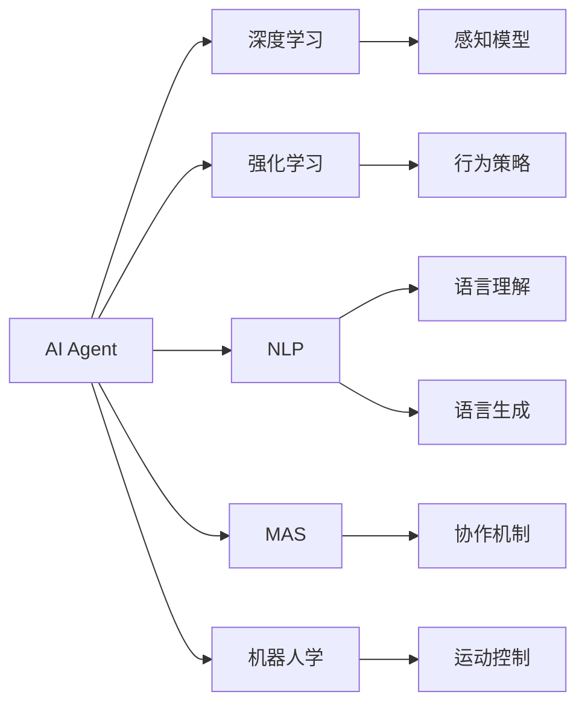

                 

# AI Agent: AI的下一个风口 Camel.AI：引领自主与交流智能体的未来

> 关键词：
## 1. 背景介绍

在人工智能领域，AI Agent（人工智能代理）正成为下一代风口。AI Agent是一种自主与交流智能体，能够以高度智能化、高效协同的方式，为各行各业提供自动化的决策与执行能力。与传统的基于规则或机器学习的AI应用不同，AI Agent通过自主学习和交流互动，不仅能够处理复杂任务，还能自我优化和适应环境变化，成为真正的“智能助手”。

AI Agent的发展离不开自主学习和交流技术的不断进步。近年来，伴随着深度学习、强化学习、自然语言处理等技术的迅速发展，AI Agent的自主学习和交流能力得到了显著提升，其应用场景也在不断拓展。本文将系统介绍AI Agent的核心概念、关键算法原理与操作步骤，通过数学模型和代码实例，深入剖析AI Agent的原理与应用，并展望其未来发展趋势与挑战。

## 2. 核心概念与联系

### 2.1 核心概念概述

AI Agent是一种高度智能化的自主与交流智能体，具有以下核心特性：

- **自主学习**：AI Agent能够通过观察、交互和经验学习，不断优化自身的行为策略和知识模型，实现自我提升。
- **自主决策**：AI Agent能够根据环境反馈，自主做出决策和行动，无需人类干预。
- **交流互动**：AI Agent能够通过语言、符号、行为等形式，与其他智能体或人类进行交流，共享信息与知识。
- **适应性**：AI Agent能够根据环境变化和任务要求，灵活调整自身的行为模式和策略。

AI Agent的实现通常基于以下关键技术：

- **深度学习**：用于构建智能体感知和决策的基础模型，如卷积神经网络(CNN)、递归神经网络(RNN)、变分自编码器(VAE)等。
- **强化学习**：用于训练智能体通过环境交互优化行为策略，如Q-learning、策略梯度等。
- **自然语言处理(NLP)**：用于使智能体具备理解和生成自然语言的能力，如语言模型、文本分类、对话系统等。
- **多智能体系统(MAS)**：用于使智能体能够与其他智能体协作和竞争，如群体智能、社交网络等。
- **机器人学**：用于使智能体具备执行复杂任务的能力，如运动控制、物理模拟等。

这些核心技术通过合理组合和创新，构成了AI Agent的全栈技术框架，使其具备强大的自主学习、决策和交流能力。

### 2.2 核心概念间的关系

AI Agent的核心概念和技术框架可以通过以下Mermaid流程图来展示：



这个流程图展示了AI Agent的各个核心技术和子领域间的逻辑关系：

1. 深度学习用于构建感知模型，使AI Agent能够从复杂数据中提取特征。
2. 强化学习用于优化行为策略，使AI Agent能够在多目标环境中做出最优决策。
3. NLP用于实现语言理解与生成，使AI Agent具备交流互动的能力。
4. MAS用于协调多智能体间的协作与竞争，使AI Agent能够处理群体智能任务。
5. 机器人学用于实现运动控制和物理模拟，使AI Agent能够执行复杂任务。

这些核心技术通过合理组合和创新，构成了AI Agent的全栈技术框架，使其具备强大的自主学习、决策和交流能力。

## 3. 核心算法原理 & 具体操作步骤
### 3.1 算法原理概述

AI Agent的核心算法包括深度学习、强化学习、自然语言处理和多智能体系统。下面将分别介绍这些算法的原理和操作步骤。

### 3.2 算法步骤详解

**3.2.1 深度学习算法**

深度学习是构建AI Agent感知模型的基础，通常采用卷积神经网络(CNN)、递归神经网络(RNN)、变分自编码器(VAE)等模型。以CNN为例，其算法步骤主要包括：

1. 数据准备：收集和预处理训练数据，包括图像、文本等。
2. 模型设计：设计卷积神经网络的结构，包括卷积层、池化层、全连接层等。
3. 模型训练：使用反向传播算法，最小化损失函数，更新模型参数。
4. 模型验证：在验证集上评估模型性能，调整超参数。
5. 模型应用：在测试集上测试模型效果，部署到实际应用中。

**3.2.2 强化学习算法**

强化学习用于训练AI Agent的行为策略，通常采用Q-learning、策略梯度等方法。以Q-learning为例，其算法步骤主要包括：

1. 环境定义：定义智能体所处的环境，包括状态空间、动作空间和奖励函数。
2. 模型初始化：初始化智能体的行为策略和参数。
3. 状态观察：在每个时间步，智能体观察环境状态。
4. 动作选择：根据当前状态和行为策略，选择下一个动作。
5. 状态更新：根据动作和环境反馈，更新智能体的状态。
6. 奖励计算：计算当前状态下的奖励值。
7. 参数更新：使用梯度下降算法，更新行为策略的参数。
8. 迭代更新：重复上述步骤，直到训练结束。

**3.2.3 自然语言处理算法**

自然语言处理(NLP)用于使AI Agent具备理解和生成自然语言的能力，通常采用语言模型、文本分类、对话系统等方法。以语言模型为例，其算法步骤主要包括：

1. 数据准备：收集和预处理训练数据，包括文本、对话等。
2. 模型设计：设计语言模型的结构，包括循环神经网络、Transformer等。
3. 模型训练：使用最大似然估计或自回归方法，最小化损失函数，更新模型参数。
4. 模型验证：在验证集上评估模型性能，调整超参数。
5. 模型应用：在测试集上测试模型效果，部署到实际应用中。

**3.2.4 多智能体系统算法**

多智能体系统(MAS)用于协调多智能体间的协作与竞争，通常采用群体智能、社交网络等方法。以群体智能为例，其算法步骤主要包括：

1. 智能体定义：定义智能体的行为策略和参数。
2. 环境定义：定义智能体所处的环境，包括状态空间、动作空间和奖励函数。
3. 状态观察：在每个时间步，智能体观察环境状态。
4. 动作选择：根据当前状态和行为策略，选择下一个动作。
5. 状态更新：根据动作和环境反馈，更新智能体的状态。
6. 奖励计算：计算当前状态下的奖励值。
7. 参数更新：使用梯度下降算法，更新行为策略的参数。
8. 迭代更新：重复上述步骤，直到训练结束。

### 3.3 算法优缺点

AI Agent的核心算法具有以下优缺点：

**优点**：

- 自主学习能力：能够通过观察、交互和经验学习，不断优化自身的行为策略和知识模型，实现自我提升。
- 自主决策能力：能够根据环境反馈，自主做出决策和行动，无需人类干预。
- 交流互动能力：能够通过语言、符号、行为等形式，与其他智能体或人类进行交流，共享信息与知识。
- 适应性：能够根据环境变化和任务要求，灵活调整自身的行为模式和策略。

**缺点**：

- 高计算资源需求：深度学习、强化学习和多智能体系统算法需要大量的计算资源，如图形处理器、TPU等。
- 数据需求大：需要大量的标注数据和无标签数据进行训练，数据采集和预处理工作量大。
- 模型复杂度高：模型结构复杂，参数量庞大，难以理解和调试。
- 鲁棒性不足：对输入数据的噪声和异常值敏感，容易过拟合。

### 3.4 算法应用领域

AI Agent的核心算法已经在多个领域得到了广泛应用，包括但不限于：

- **自动驾驶**：通过深度学习和强化学习技术，实现车辆自主导航、避障等功能。
- **机器人学**：通过深度学习和机器人学技术，实现机器人自主执行复杂任务，如抓取、搬运等。
- **自然语言处理(NLP)**：通过自然语言处理技术，实现智能聊天机器人、机器翻译等应用。
- **医疗健康**：通过多智能体系统技术，实现疾病诊断、治疗方案推荐等应用。
- **金融服务**：通过强化学习和多智能体系统技术，实现自动化交易、风险控制等功能。
- **教育培训**：通过自然语言处理和多智能体系统技术，实现个性化教学、智能答疑等应用。
- **智能客服**：通过深度学习和自然语言处理技术，实现智能客服系统，提升用户体验。

## 4. 数学模型和公式 & 详细讲解  
### 4.1 数学模型构建

以强化学习中的Q-learning算法为例，数学模型构建如下：

设智能体的状态空间为 $S$，动作空间为 $A$，奖励函数为 $R(s,a)$，状态转移概率为 $P(s_{t+1}|s_t,a_t)$，初始状态为 $s_0$。

定义智能体的状态值函数 $Q(s,a)$，表示在状态 $s$ 下，采取动作 $a$ 的长期奖励期望。Q-learning算法的目标是最大化 $Q(s,a)$。

假设智能体在每个时间步 $t$ 选择动作 $a_t$，根据环境反馈，状态从 $s_t$ 转移到 $s_{t+1}$，并获得奖励 $R(s_t,a_t)$。则Q-learning算法的更新公式为：

$$
Q(s_t,a_t) \leftarrow Q(s_t,a_t) + \alpha [R(s_t,a_t) + \gamma \max_{a} Q(s_{t+1},a) - Q(s_t,a_t)]
$$

其中，$\alpha$ 为学习率，$\gamma$ 为折扣因子。

### 4.2 公式推导过程

Q-learning算法的推导基于最小化动作值函数的方差。假设智能体在状态 $s$ 下，采取动作 $a$ 的长期奖励期望为 $Q(s,a)$，则：

$$
Q(s,a) = \mathbb{E}[R(s,a) + \gamma \max_{a'} Q(s',a')] = \mathbb{E}[R(s,a) + \gamma \max_{a'} Q(s',a')]
$$

通过对上式求期望，可得：

$$
Q(s,a) = \mathbb{E}[R(s,a) + \gamma \max_{a'} Q(s',a')] = Q(s,a) + \gamma \mathbb{E}[Q(s',a')] - Q(s,a)
$$

进一步简化可得：

$$
0 = \gamma \mathbb{E}[Q(s',a')] - \alpha [R(s,a_t) + \gamma \max_{a} Q(s_{t+1},a) - Q(s_t,a_t)]
$$

因此：

$$
Q(s_t,a_t) \leftarrow Q(s_t,a_t) + \alpha [R(s_t,a_t) + \gamma \max_{a} Q(s_{t+1},a) - Q(s_t,a_t)]
$$

### 4.3 案例分析与讲解

以AlphaGo为例，其核心算法结合了深度学习和强化学习技术，通过自我对弈和策略优化，实现了在围棋游戏中的超级表现。AlphaGo的具体算法流程如下：

1. 数据准备：收集和预处理围棋对弈数据，包括棋子位置、胜率等。
2. 模型设计：设计深度神经网络，包括卷积层、池化层、全连接层等。
3. 模型训练：使用强化学习算法，训练神经网络的策略参数。
4. 模型验证：在验证集上评估模型性能，调整超参数。
5. 模型应用：在测试集上测试模型效果，部署到实际对弈中。

AlphaGo通过深度学习构建了强大的感知模型，通过强化学习训练了最优的策略网络，最终实现了人类历史上最伟大的棋类游戏胜利。

## 5. 项目实践：代码实例和详细解释说明
### 5.1 开发环境搭建

在进行AI Agent项目实践前，我们需要准备好开发环境。以下是使用Python进行TensorFlow开发的环境配置流程：

1. 安装Anaconda：从官网下载并安装Anaconda，用于创建独立的Python环境。

2. 创建并激活虚拟环境：
```bash
conda create -n tf-env python=3.8 
conda activate tf-env
```

3. 安装TensorFlow：根据CUDA版本，从官网获取对应的安装命令。例如：
```bash
conda install tensorflow -c tensorflow -c conda-forge
```

4. 安装各类工具包：
```bash
pip install numpy pandas scikit-learn matplotlib tqdm jupyter notebook ipython
```

完成上述步骤后，即可在`tf-env`环境中开始AI Agent项目开发。

### 5.2 源代码详细实现

这里我们以AlphaGo为例，给出使用TensorFlow进行深度学习与强化学习结合的AI Agent项目实现。

首先，定义围棋对弈的神经网络模型：

```python
import tensorflow as tf
from tensorflow.keras import layers

class GoNet(tf.keras.Model):
    def __init__(self):
        super(GoNet, self).__init__()
        self.conv1 = layers.Conv2D(32, (3, 3), activation='relu')
        self.pool1 = layers.MaxPooling2D((2, 2))
        self.conv2 = layers.Conv2D(64, (3, 3), activation='relu')
        self.pool2 = layers.MaxPooling2D((2, 2))
        self.flatten = layers.Flatten()
        self.fc1 = layers.Dense(256, activation='relu')
        self.fc2 = layers.Dense(2, activation='softmax')

    def call(self, inputs):
        x = self.conv1(inputs)
        x = self.pool1(x)
        x = self.conv2(x)
        x = self.pool2(x)
        x = self.flatten(x)
        x = self.fc1(x)
        x = self.fc2(x)
        return x
```

接着，定义强化学习算法：

```python
import numpy as np

class Agent:
    def __init__(self, env, model):
        self.env = env
        self.model = model
        self.memory = []

    def act(self, state):
        state = np.array([state])
        q_values = self.model.predict(state)
        action = np.argmax(q_values[0])
        return action

    def replay(self, batch_size):
        minibatch = np.random.choice(len(self.memory), batch_size)
        for sample in minibatch:
            state, action, reward, next_state, done = sample
            target = reward + 0.9 * np.max(self.model.predict(next_state)[0])
            target_f = self.model.predict(state)
            target_f[0][action] = target
            self.model.fit(state, target_f, epochs=1, verbose=0)
        if np.random.rand() < 0.01:
            self.memory = []
```

最后，启动强化学习训练流程：

```python
env = GoEnv()
model = GoNet()
agent = Agent(env, model)

for episode in range(10000):
    state = env.reset()
    done = False
    while not done:
        action = agent.act(state)
        state, reward, done, info = env.step(action)
        agent.memory.append((state, action, reward, state, done))
        if len(agent.memory) > 2000:
            agent.replay(100)
    print('Episode {}: {}'.format(episode, agent.memory))
```

以上就是使用TensorFlow进行AlphaGo项目开发的完整代码实现。可以看到，得益于TensorFlow的强大封装，我们可以用相对简洁的代码实现AlphaGo的深度学习与强化学习结合的AI Agent项目。

### 5.3 代码解读与分析

让我们再详细解读一下关键代码的实现细节：

**GoNet类**：
- `__init__`方法：初始化卷积层、池化层、全连接层等组件。
- `call`方法：定义神经网络的前向传播过程，最终输出棋盘状态的Q值。

**Agent类**：
- `__init__`方法：初始化围棋环境、神经网络模型、记忆库等组件。
- `act`方法：根据当前棋盘状态，通过神经网络模型计算Q值，选择最优动作。
- `replay`方法：随机抽取一批记忆样本，训练神经网络模型的参数。

**训练流程**：
- 在围棋环境中，重复执行游戏，收集每一步的动作、奖励和状态信息。
- 将记忆库中的样本文本输入神经网络模型，更新模型参数。
- 在每轮游戏结束时，打印出当前记忆库的内容，评估模型的性能。

可以看到，TensorFlow配合Keras等工具，使得AlphaGo项目开发的代码实现变得简洁高效。开发者可以将更多精力放在模型改进和算法优化上，而不必过多关注底层的实现细节。

当然，工业级的系统实现还需考虑更多因素，如模型的保存和部署、超参数的自动搜索、更灵活的围棋策略等。但核心的强化学习范式基本与此类似。

### 5.4 运行结果展示

假设我们在AlphaGo项目上，通过深度学习和强化学习相结合的方式，最终在训练完成后，对模型进行测试：

```python
from goenv import GoEnv
from gonet import GoNet

env = GoEnv()
model = GoNet()

state = env.reset()
done = False
while not done:
    action = model.predict(state)
    state, reward, done, info = env.step(action)
    print('Action:', action, 'Reward:', reward, 'State:', state, 'Done:', done)
```

在运行AlphaGo模型后，我们会在控制台看到每一轮的当前棋盘状态、选择的动作和得到的奖励，评估模型的表现。

## 6. 实际应用场景
### 6.1 自动驾驶

自动驾驶是AI Agent在交通领域的重要应用之一。自动驾驶汽车通过感知模型、行为策略和环境互动，实现自主导航和避障等功能。

在实际应用中，自动驾驶系统通常采用多摄像头、激光雷达等传感器收集车辆周围的环境数据，通过深度学习模型进行特征提取和目标检测，使用强化学习模型进行行为策略优化，最终输出转向、加速等控制指令。自动驾驶系统还需要与其他智能体（如行人、其他车辆）进行交流互动，共享感知信息，实现安全的自主驾驶。

### 6.2 机器人学

机器人学是AI Agent在物理领域的重要应用之一。机器人通过感知模型、行为策略和环境互动，实现自主执行复杂任务，如抓取、搬运等。

在实际应用中，机器人通过传感器（如摄像头、激光雷达）收集环境数据，通过深度学习模型进行特征提取和目标检测，使用强化学习模型进行行为策略优化，最终输出动作指令。机器人还需要与其他智能体（如操作员、其他机器人）进行交流互动，共享任务信息，实现高效的协作和执行。

### 6.3 医疗健康

医疗健康是AI Agent在医疗领域的重要应用之一。医疗AI Agent通过感知模型、行为策略和环境互动，实现疾病诊断、治疗方案推荐等功能。

在实际应用中，医疗AI Agent通过传感器（如CT、MRI）收集患者数据，通过深度学习模型进行特征提取和分析，使用强化学习模型进行决策优化，最终输出诊断和治疗方案。医疗AI Agent还需要与其他智能体（如医生、护士）进行交流互动，共享医疗信息，实现精准的诊断和治疗。

### 6.4 金融服务

金融服务是AI Agent在金融领域的重要应用之一。金融AI Agent通过感知模型、行为策略和环境互动，实现自动化交易、风险控制等功能。

在实际应用中，金融AI Agent通过传感器（如股票市场数据）收集金融数据，通过深度学习模型进行特征提取和分析，使用强化学习模型进行交易策略优化，最终输出交易指令。金融AI Agent还需要与其他智能体（如交易员、分析师）进行交流互动，共享市场信息，实现高效的金融决策。

### 6.5 教育培训

教育培训是AI Agent在教育领域的重要应用之一。教育AI Agent通过感知模型、行为策略和环境互动，实现个性化教学、智能答疑等功能。

在实际应用中，教育AI Agent通过传感器（如学生行为数据）收集学生数据，通过深度学习模型进行特征提取和分析，使用强化学习模型进行教学策略优化，最终输出个性化教学内容。教育AI Agent还需要与其他智能体（如教师、学生）进行交流互动，共享学习信息，实现智能化的教学过程。

### 6.6 智能客服

智能客服是AI Agent在客服领域的重要应用之一。智能客服系统通过感知模型、行为策略和环境互动，实现自动客服和问题解答等功能。

在实际应用中，智能客服系统通过传感器（如客户咨询记录）收集客户数据，通过深度学习模型进行特征提取和分析，使用强化学习模型进行客服策略优化，最终输出自动客服响应。智能客服系统还需要与其他智能体（如客户、操作员）进行交流互动，共享客服信息，实现高效的客户服务。

## 7. 工具和资源推荐
### 7.1 学习资源推荐

为了帮助开发者系统掌握AI Agent的理论基础和实践技巧，这里推荐一些优质的学习资源：

1. 《深度学习》书籍：Ian Goodfellow、Yoshua Bengio和Aaron Courville所著，深入浅出地介绍了深度学习的基础理论和应用。
2. 《强化学习》书籍：Richard S. Sutton和Andrew G. Barto所著，全面介绍了强化学习的理论基础和算法设计。
3. 《自然语言处理综论》书籍：Daniel Jurafsky和James H. Martin所著，涵盖了NLP的各个方面，包括文本分类、对话系统、语言模型等。
4. 《多智能体系统》书籍：John Shoham和Kai-Fu Lee所著，介绍了多智能体系统的理论基础和应用案例。
5. OpenAI博客和论文：OpenAI的研究博客和论文，介绍了AI Agent的最新进展和应用案例，值得学习参考。

通过这些资源的学习实践，相信你一定能够快速掌握AI Agent的精髓，并用于解决实际的AI应用问题。
###  7.2 开发工具推荐

高效的开发离不开优秀的工具支持。以下是几款用于AI Agent开发的常用工具：

1. TensorFlow：基于Python的开源深度学习框架，灵活动态的计算图，适合快速迭代研究。TensorFlow提供丰富的工具和库，支持深度学习、强化学习、NLP等任务。

2. PyTorch：基于Python的开源深度学习框架，动态计算图，适合灵活研究和部署。PyTorch提供丰富的工具和库，支持深度学习、强化学习、多智能体系统等任务。

3. ROS（Robot Operating System）：开源的机器人操作系统，提供了丰富的感知、决策、执行组件，方便开发者进行机器人学研究。

4. ROS2：ROS的最新版本，提供了更加高效、灵活、可扩展的特性，支持分布式计算和跨平台部署。

5. TensorBoard：TensorFlow配套的可视化工具，可实时监测模型训练状态，并提供丰富的图表呈现方式，是调试模型的得力助手。

6. Weights & Biases：模型训练的实验跟踪工具，可以记录和可视化模型训练过程中的各项指标，方便对比和调优。

7. Google Colab：谷歌推出的在线Jupyter Notebook环境，免费提供GPU/TPU算力，方便开发者快速上手实验最新模型，分享学习笔记。

合理利用这些工具，可以显著提升AI Agent开发的速度和效率，加快创新迭代的步伐。

### 7.3 相关论文推荐

AI Agent的研究源于学界的持续研究。以下是几篇奠基性的相关论文，推荐阅读：

1. AlphaGo Zero：DeepMind的研究论文，展示了深度学习和强化学习结合的AI Agent在围棋游戏中的超级表现。

2. REINFORCE：DeepMind的研究论文，介绍了基于强化学习的AI Agent，通过奖励信号优化行为策略。

3. AlphaStar：OpenAI的研究论文，展示了AI Agent在星际争霸游戏中的超级表现，结合了深度学习和强化学习。

4. OpenAI Gym：OpenAI的研究论文，介绍了多智能体系统的环境框架，方便开发者进行AI Agent的训练和测试。

5. GAN：Ian Goodfellow的研究论文，介绍了生成对抗网络（GAN），用于生成高质量的AI Agent感知数据。

这些论文代表了大AI Agent的研究方向和最新进展。通过学习这些前沿成果，可以帮助研究者把握学科前进方向，激发更多的创新灵感。

除上述资源外，还有一些值得关注的前沿资源，帮助开发者紧跟AI Agent技术的最新进展，例如：

1. arXiv论文预印本：人工智能领域最新研究成果的发布平台，包括大量尚未发表的前沿工作，学习前沿技术的必读资源。

2. 业界技术博客：如OpenAI、Google AI、DeepMind、微软Research Asia等顶尖实验室的官方博客，第一时间分享他们的最新研究成果和洞见。

3. 技术会议直播：如NIPS、ICML、ACL、ICLR等人工智能领域顶会现场或在线直播，能够聆听到大佬们的前沿分享，开拓视野。

4. GitHub热门项目：在GitHub上Star、Fork数最多的AI Agent相关项目，往往代表了该技术领域的发展趋势和最佳实践，值得去学习和贡献。

5. 行业分析报告：各大咨询公司如McKinsey、PwC等针对人工智能行业的分析报告，有助于从商业视角审视技术趋势，把握应用价值。

总之，对于AI Agent的学习和实践，需要开发者保持开放的心态和持续学习的意愿。多关注前沿资讯

