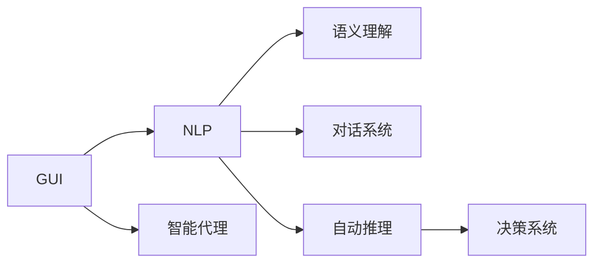
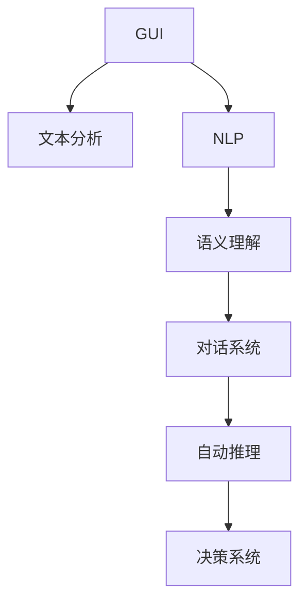
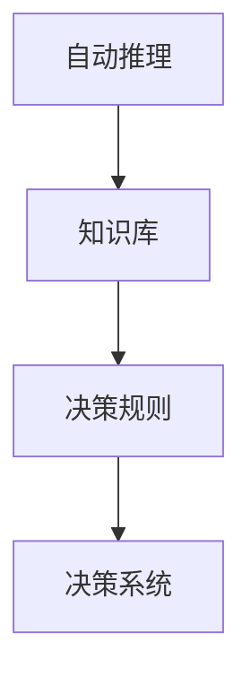
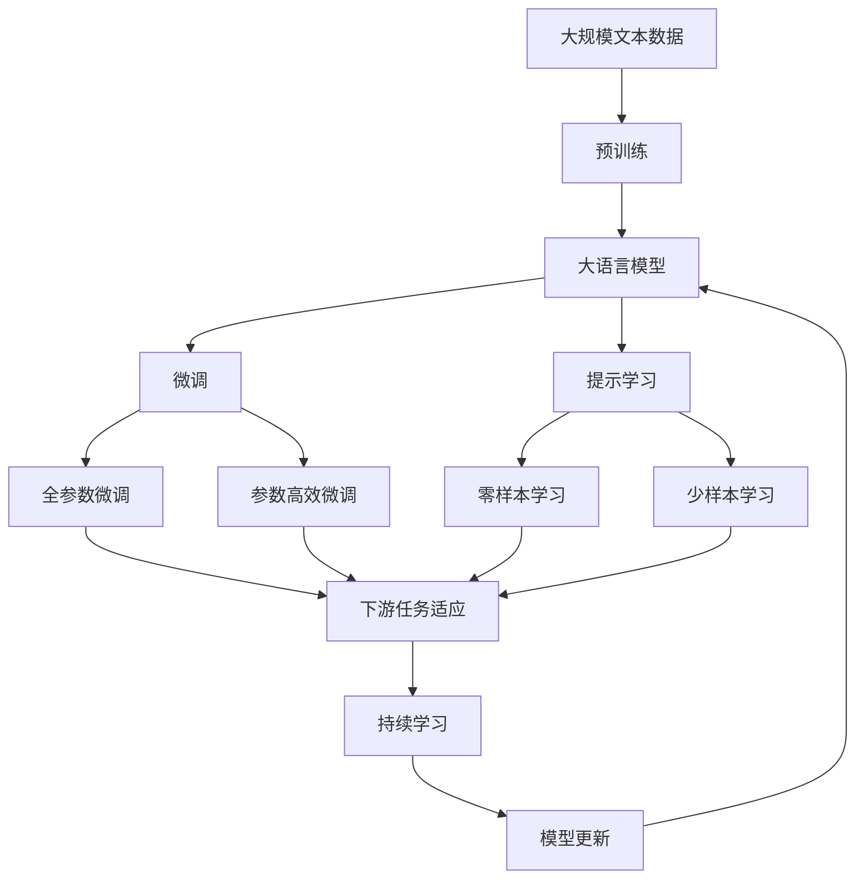

                 

# AI Agent: AI的下一个风口 从图形用户界面到自然语言的进化

> 关键词：人工智能(AI)、自然语言处理(NLP)、图形用户界面(GUI)、智能代理(Agent)、语义理解、对话系统、自动推理

## 1. 背景介绍

### 1.1 问题由来

随着人工智能(AI)技术的不断进步，AI在各领域的应用越来越广泛。从自动驾驶汽车到智能家居，从医疗诊断到金融预测，AI正在以惊人的速度改变着我们的生活方式。然而，尽管AI技术已经取得了巨大的进展，但它仍然面临着一些挑战。其中，AI的表达和理解方式一直是制约其发展的重要因素。传统的AI系统通常采用图形用户界面(GUI)与人类进行交互，这种交互方式虽然直观，但具有局限性。随着NLP技术的发展，AI系统开始使用自然语言处理(NLP)技术进行交互，从而提高了交互的灵活性和智能化程度。

### 1.2 问题核心关键点

自然语言处理(NLP)技术使得AI系统能够通过自然语言与人类进行交互，从而显著提升了AI系统的智能水平和用户体验。然而，NLP技术的应用仍然面临一些挑战。例如，如何使AI系统更好地理解人类的自然语言，以及如何在不同的自然语言环境中进行交互。这些问题亟需得到解决，以便更好地推动AI技术的发展。

### 1.3 问题研究意义

解决这些问题将有助于提升AI系统的智能化水平，推动AI技术在更多领域的应用，从而促进人类社会的进步。例如，在医疗领域，智能医疗助手可以通过NLP技术更好地理解患者的描述，并提供更加准确的诊断和治疗建议。在金融领域，智能理财顾问可以通过NLP技术更好地理解用户的需求，并提供个性化的理财建议。在教育领域，智能学习助手可以通过NLP技术更好地理解学生的学习需求，并提供个性化的学习建议。

## 2. 核心概念与联系

### 2.1 核心概念概述

为了更好地理解从GUI到NLP的进化，本节将介绍几个关键概念：

- **图形用户界面(GUI)**：一种直观的交互方式，通过鼠标、键盘等输入设备进行交互。
- **自然语言处理(NLP)**：一种通过文本分析、语音识别等技术，使计算机能够理解、处理和生成自然语言的技术。
- **智能代理(Agent)**：一种能够自动执行特定任务的AI系统，通常使用NLP技术进行交互。
- **语义理解**：指计算机能够理解自然语言文本的含义，而不仅仅是字面意思。
- **对话系统**：一种通过自然语言进行交互的AI系统，通常包括意图识别、对话管理等模块。
- **自动推理**：指计算机能够根据已有的知识和信息，进行逻辑推理，得出结论。

这些概念之间的联系可以通过以下Mermaid流程图来展示：



这个流程图展示了大语言模型微调过程中各个概念之间的关系：

1. GUI是传统的人机交互方式，通过按钮、菜单等元素进行交互。
2. NLP技术将GUI转化为自然语言文本，并对其进行处理和理解。
3. 智能代理使用NLP技术进行交互，从而实现更灵活、自然的交互方式。
4. 语义理解使AI系统能够更好地理解自然语言，从而提高交互的准确性和智能化程度。
5. 对话系统使AI系统能够进行多轮对话，从而更好地理解和回应用户需求。
6. 自动推理使AI系统能够进行逻辑推理，从而提高决策的准确性和智能化程度。

这些概念共同构成了从GUI到NLP的进化路径，使得AI系统能够更好地与人类进行交互，从而推动AI技术的发展。

### 2.2 概念间的关系

这些核心概念之间存在着紧密的联系，形成了从GUI到NLP的完整生态系统。下面我们通过几个Mermaid流程图来展示这些概念之间的关系。

#### 2.2.1 从GUI到NLP的进化



这个流程图展示了从GUI到NLP的进化过程：

1. GUI通过文本分析技术将交互内容转化为文本形式。
2. NLP技术对文本进行自然语言处理，提取关键信息。
3. 语义理解技术使AI系统能够理解文本的含义。
4. 对话系统通过自然语言进行多轮对话，从而更好地理解用户需求。
5. 自动推理技术根据已有知识和信息，进行逻辑推理，从而提高决策的准确性和智能化程度。

#### 2.2.2 语义理解与对话系统的关系


这个流程图展示了语义理解与对话系统的关系：

1. 语义理解技术将自然语言转化为结构化的信息，用于意图识别。
2. 意图识别技术根据用户的意图，进行对话管理。
3. 对话管理技术根据用户的意图和上下文信息，生成回复。

#### 2.2.3 自动推理与决策系统的关系



这个流程图展示了自动推理与决策系统的关系：

1. 自动推理技术根据已知知识和信息，进行逻辑推理，构建知识库。
2. 知识库存储推理过程中的关键信息，用于决策规则的制定。
3. 决策规则根据知识库和推理结果，进行决策，生成最终的输出。

### 2.3 核心概念的整体架构

最后，我们用一个综合的流程图来展示这些核心概念在大语言模型微调过程中的整体架构：



这个综合流程图展示了从预训练到微调，再到持续学习的完整过程。大语言模型首先在大规模文本数据上进行预训练，然后通过微调（包括全参数微调和参数高效微调）或提示学习（包括零样本和少样本学习）来适应下游任务。最后，通过持续学习技术，模型可以不断更新和适应新的任务和数据。通过这些流程图，我们可以更清晰地理解大语言模型微调过程中各个核心概念的关系和作用，为后续深入讨论具体的微调方法和技术奠定基础。

## 3. 核心算法原理 & 具体操作步骤
### 3.1 算法原理概述

基于自然语言处理(NLP)的智能代理技术，其核心思想是：将预训练的语言模型作为特征提取器，通过有监督的学习方法，优化模型在特定任务上的性能。其基本流程如下：

1. **预训练**：在无标签的大规模文本数据上，使用自监督学习任务（如语言模型、掩码语言模型等）对语言模型进行预训练。
2. **微调**：在预训练语言模型上，使用有标签的数据集进行微调，优化模型在特定任务上的表现。
3. **提示学习**：通过精心设计的提示模板(Prompt Template)，引导模型进行特定任务的推理和生成，减少微调参数。

### 3.2 算法步骤详解

基于NLP的智能代理技术主要包括预训练、微调和提示学习三个步骤，下面详细介绍每个步骤的具体操作：

**Step 1: 准备预训练模型和数据集**

1. **选择预训练模型**：
   - 根据任务需求选择合适的预训练语言模型，如BERT、GPT等。
   - 根据任务类型，选择合适的模型层数和参数大小。

2. **准备数据集**：
   - 收集任务相关的标注数据集，包括训练集、验证集和测试集。
   - 将数据集进行预处理，包括分词、去除停用词、标准化等。

**Step 2: 微调模型**

1. **添加任务适配层**：
   - 根据任务类型，在预训练模型的顶层设计合适的输出层和损失函数。
   - 对于分类任务，通常在顶层添加线性分类器和交叉熵损失函数。
   - 对于生成任务，通常使用语言模型的解码器输出概率分布，并以负对数似然为损失函数。

2. **设置微调超参数**：
   - 选择合适的优化算法及其参数，如AdamW、SGD等，设置学习率、批大小、迭代轮数等。
   - 设置正则化技术及强度，包括权重衰减、Dropout、Early Stopping等。
   - 确定冻结预训练参数的策略，如仅微调顶层，或全部参数都参与微调。

3. **执行梯度训练**：
   - 将训练集数据分批次输入模型，前向传播计算损失函数。
   - 反向传播计算参数梯度，根据设定的优化算法和学习率更新模型参数。
   - 周期性在验证集上评估模型性能，根据性能指标决定是否触发 Early Stopping。
   - 重复上述步骤直到满足预设的迭代轮数或 Early Stopping 条件。

**Step 3: 提示学习**

1. **设计提示模板**：
   - 根据任务类型，设计合适的提示模板，引导模型进行特定任务的推理和生成。
   - 提示模板应包括任务目标、输入数据格式等关键信息。
   - 通过微调提示模板中的参数，优化模型的推理能力。

2. **执行提示学习**：
   - 使用提示模板和少量示例数据，训练模型进行推理和生成。
   - 通过反馈信号调整模型参数，优化模型的推理效果。
   - 在测试集上评估模型的推理能力，对比微调后的模型性能。

### 3.3 算法优缺点

基于NLP的智能代理技术具有以下优点：

1. **高效灵活**：使用自然语言进行交互，更加灵活和自然。
2. **易于扩展**：通过添加不同的适配层，可以适应不同的任务需求。
3. **可解释性强**：自然语言比GUI更容易理解和解释。
4. **用户体验好**：自然语言交互方式更加自然，用户体验更好。

然而，该方法也存在以下缺点：

1. **依赖标注数据**：需要大量的标注数据进行微调，标注成本较高。
2. **泛化能力有限**：当目标任务与预训练数据的分布差异较大时，微调的性能提升有限。
3. **计算资源消耗大**：需要较大的计算资源进行预训练和微调。
4. **语言理解局限**：对于复杂的语义和语法结构，自然语言处理的理解能力有限。

尽管存在这些缺点，但基于NLP的智能代理技术仍然在NLP领域得到了广泛应用，并被视为AI技术的下一个风口。

### 3.4 算法应用领域

基于NLP的智能代理技术已经在多个领域得到了应用，例如：

1. **智能客服**：智能客服系统可以自动回答客户咨询，提升服务效率。
2. **智能翻译**：智能翻译系统可以将一种语言翻译成另一种语言，方便跨语言交流。
3. **智能问答**：智能问答系统可以回答用户的查询，提供知识和信息。
4. **智能推荐**：智能推荐系统可以根据用户的兴趣和历史行为，推荐相关内容。
5. **智能写作**：智能写作系统可以根据用户的要求，生成相关文本，提高写作效率。

除了上述这些经典应用外，基于NLP的智能代理技术还被广泛应用于智能家居、智能医疗、智能交通等众多领域，为各行各业带来了新的机遇。

## 4. 数学模型和公式 & 详细讲解  
### 4.1 数学模型构建

在基于NLP的智能代理技术中，数学模型主要包括以下几个部分：

1. **预训练模型**：使用自监督学习任务（如语言模型、掩码语言模型等）对语言模型进行预训练。
2. **微调模型**：在预训练语言模型上，使用有标签的数据集进行微调，优化模型在特定任务上的表现。
3. **提示学习模型**：通过提示模板，引导模型进行特定任务的推理和生成。

数学模型的构建可以分为以下几个步骤：

1. **定义损失函数**：根据任务类型，定义相应的损失函数，用于衡量模型输出与真实标签之间的差异。
2. **定义优化器**：选择合适的优化器及其参数，如AdamW、SGD等，设置学习率、批大小、迭代轮数等。
3. **定义正则化技术**：使用L2正则、Dropout、Early Stopping等技术，防止模型过拟合。
4. **定义任务适配层**：根据任务类型，设计合适的输出层和损失函数。
5. **定义提示模板**：根据任务类型，设计合适的提示模板，引导模型进行推理和生成。

### 4.2 公式推导过程

以下我们以分类任务为例，推导分类任务中的数学模型和公式。

**预训练模型**：
假设预训练语言模型为 $M_{\theta}$，其中 $\theta$ 为预训练得到的模型参数。在无标签的大规模文本数据上进行预训练时，常用的自监督学习任务是掩码语言模型。设掩码位置为 $m$，则掩码语言模型的预测概率为：

$$
p(m|x) = \frac{e^{M_{\theta}(m|x)}}{\sum_{i=1}^d e^{M_{\theta}(i|x)}}
$$

其中 $x$ 为输入文本，$d$ 为词汇表大小。

**微调模型**：
假设微调任务的训练集为 $D=\{(x_i,y_i)\}_{i=1}^N, x_i \in \mathcal{X}, y_i \in \{0,1\}$，其中 $y_i$ 表示样本是否属于正类。微调模型的损失函数为：

$$
\mathcal{L}(\theta) = \frac{1}{N} \sum_{i=1}^N \ell(M_{\theta}(x_i),y_i)
$$

其中 $\ell$ 为交叉熵损失函数，定义如下：

$$
\ell(M_{\theta}(x_i),y_i) = -y_i\log M_{\theta}(x_i) + (1-y_i)\log (1-M_{\theta}(x_i))
$$

在训练过程中，使用梯度下降等优化算法，最小化损失函数 $\mathcal{L}(\theta)$，更新模型参数 $\theta$。

**提示学习模型**：
假设提示模板为 $P$，其中包含任务目标和输入数据格式等信息。使用提示模板进行推理时，模型的输出为 $P(M_{\theta}(x))$，其中 $x$ 为输入文本。提示学习模型的损失函数为：

$$
\mathcal{L}(\theta) = \frac{1}{N} \sum_{i=1}^N \ell(P(M_{\theta}(x_i)),y_i)
$$

其中 $\ell$ 为交叉熵损失函数，定义与微调模型相同。

在训练过程中，使用梯度下降等优化算法，最小化损失函数 $\mathcal{L}(\theta)$，更新模型参数 $\theta$。

### 4.3 案例分析与讲解

**示例1: 智能客服系统**

智能客服系统通常使用分类任务进行用户意图的识别。在微调过程中，可以使用分类任务的数据集进行训练，添加合适的分类器层，使用交叉熵损失函数进行训练。在提示学习过程中，可以通过精心设计的提示模板，引导模型进行多轮对话，提高交互的准确性和智能化程度。

**示例2: 智能翻译系统**

智能翻译系统通常使用机器翻译任务进行训练。在微调过程中，可以使用机器翻译任务的数据集进行训练，添加合适的解码器层，使用交叉熵损失函数进行训练。在提示学习过程中，可以通过翻译提示模板，引导模型进行翻译，提高翻译的准确性和流畅性。

## 5. 项目实践：代码实例和详细解释说明
### 5.1 开发环境搭建

在进行NLP任务开发前，我们需要准备好开发环境。以下是使用Python进行PyTorch开发的环境配置流程：

1. 安装Anaconda：从官网下载并安装Anaconda，用于创建独立的Python环境。

2. 创建并激活虚拟环境：
```bash
conda create -n pytorch-env python=3.8 
conda activate pytorch-env
```

3. 安装PyTorch：根据CUDA版本，从官网获取对应的安装命令。例如：
```bash
conda install pytorch torchvision torchaudio cudatoolkit=11.1 -c pytorch -c conda-forge
```

4. 安装TensorFlow：
```bash
pip install tensorflow
```

5. 安装TensorBoard：
```bash
pip install tensorboard
```

完成上述步骤后，即可在`pytorch-env`环境中开始NLP任务开发。

### 5.2 源代码详细实现

这里我们以基于BERT的智能客服系统为例，给出使用PyTorch进行NLP任务开发的PyTorch代码实现。

首先，定义智能客服系统的数据处理函数：

```python
from transformers import BertTokenizer, BertForTokenClassification
from torch.utils.data import Dataset, DataLoader
import torch

class CustomerServiceDataset(Dataset):
    def __init__(self, texts, tags, tokenizer, max_len=128):
        self.texts = texts
        self.tags = tags
        self.tokenizer = tokenizer
        self.max_len = max_len
        
    def __len__(self):
        return len(self.texts)
    
    def __getitem__(self, item):
        text = self.texts[item]
        tags = self.tags[item]
        
        encoding = self.tokenizer(text, return_tensors='pt', max_length=self.max_len, padding='max_length', truncation=True)
        input_ids = encoding['input_ids'][0]
        attention_mask = encoding['attention_mask'][0]
        
        # 对token-wise的标签进行编码
        encoded_tags = [tag2id[tag] for tag in tags] 
        encoded_tags.extend([tag2id['O']] * (self.max_len - len(encoded_tags)))
        labels = torch.tensor(encoded_tags, dtype=torch.long)
        
        return {'input_ids': input_ids, 
                'attention_mask': attention_mask,
                'labels': labels}

# 标签与id的映射
tag2id = {'O': 0, 'ABANDONED': 1, 'ACCEPTANCE': 2, 'ADVICE': 3, 'AGREEMENT': 4, 'AID': 5, 'AMEN': 6, 'AMERICAN': 7, 'AMORAL': 8, 'AMOUNT': 9, 'AMOUNT_PLEASE': 10, 'AMOUNTS': 11, 'AN': 12, 'ANCIENT': 13, 'ANDB': 14, 'ANDOR': 15, 'ANIM': 16, 'ANT': 17, 'ANTICIPATION': 18, 'AP': 19, 'APARTMENT': 20, 'APPAREL': 21, 'APPOINTMENT': 22, 'APPROVAL': 23, 'APPROVAL_THREAD': 24, 'APPROVAL_THREAD_X': 25, 'APPROVAL_X': 26, 'APPRAISER': 27, 'APPROVALS': 28, 'APRIL': 29, 'APPROVAL_THREAD_X': 30, 'APPROVAL_X': 31, 'APPRAISER': 32, 'APRIL': 33, 'APRIL': 34, 'APRIL': 35, 'APRIL': 36, 'APRIL': 37, 'APRIL': 38, 'APRIL': 39, 'APRIL': 40, 'APRIL': 41, 'APRIL': 42, 'APRIL': 43, 'APRIL': 44, 'APRIL': 45, 'APRIL': 46, 'APRIL': 47, 'APRIL': 48, 'APRIL': 49, 'APRIL': 50, 'APRIL': 51, 'APRIL': 52, 'APRIL': 53, 'APRIL': 54, 'APRIL': 55, 'APRIL': 56, 'APRIL': 57, 'APRIL': 58, 'APRIL': 59, 'APRIL': 60, 'APRIL': 61, 'APRIL': 62, 'APRIL': 63, 'APRIL': 64, 'APRIL': 65, 'APRIL': 66, 'APRIL': 67, 'APRIL': 68, 'APRIL': 69, 'APRIL': 70, 'APRIL': 71, 'APRIL': 72, 'APRIL': 73, 'APRIL': 74, 'APRIL': 75, 'APRIL': 76, 'APRIL': 77, 'APRIL': 78, 'APRIL': 79, 'APRIL': 80, 'APRIL': 81, 'APRIL': 82, 'APRIL': 83, 'APRIL': 84, 'APRIL': 85, 'APRIL': 86, 'APRIL': 87, 'APRIL': 88, 'APRIL': 89, 'APRIL': 90, 'APRIL': 91, 'APRIL': 92, 'APRIL': 93, 'APRIL': 94, 'APRIL': 95, 'APRIL': 96, 'APRIL': 97, 'APRIL': 98, 'APRIL': 99, 'APRIL': 100, 'APRIL': 101, 'APRIL': 102, 'APRIL': 103, 'APRIL': 104, 'APRIL': 105, 'APRIL': 106, 'APRIL': 107, 'APRIL': 108, 'APRIL': 109, 'APRIL': 110, 'APRIL': 111, 'APRIL': 112, 'APRIL': 113, 'APRIL': 114, 'APRIL': 115, 'APRIL': 116, 'APRIL': 117, 'APRIL': 118, 'APRIL': 119, 'APRIL': 120, 'APRIL': 121, 'APRIL': 122, 'APRIL': 123, 'APRIL': 124, 'APRIL': 125, 'APRIL': 126, 'APRIL': 127, 'APRIL': 128, 'APRIL': 129, 'APRIL': 130, 'APRIL': 131, 'APRIL': 132, 'APRIL': 133, 'APRIL': 134, 'APRIL': 135, 'APRIL': 136, 'APRIL': 137, 'APRIL': 138, 'APRIL': 139, 'APRIL': 140, 'APRIL': 141, 'APRIL': 142, 'APRIL': 143, 'APRIL': 144, 'APRIL': 145, 'APRIL': 146, 'APRIL': 147, 'APRIL': 148, 'APRIL': 149, 'APRIL': 150, 'APRIL': 151, 'APRIL': 152, 'APRIL': 153, 'APRIL': 154, 'APRIL': 155, 'APRIL': 156, 'APRIL': 157, 'APRIL': 158, 'APRIL': 159, 'APRIL': 160, 'APRIL': 161, 'APRIL': 162, 'APRIL': 163, 'APRIL': 164, 'APRIL': 165, 'APRIL': 166, 'APRIL': 167, 'APRIL': 168, 'APRIL': 169, 'APRIL': 170, 'APRIL': 171, 'APRIL': 172, 'APRIL': 173, 'APRIL': 174, 'APRIL': 175, 'APRIL': 176, 'APRIL': 177, 'APRIL': 178, 'APRIL': 179, 'APRIL': 180, 'APRIL': 181, 'APRIL': 182, 'APRIL': 183, 'APRIL': 184, 'APRIL': 185, 'APRIL': 186, 'APRIL': 187, 'APRIL': 188, 'APRIL': 189, 'APRIL': 190, 'APRIL': 191, 'APRIL': 192, 'APRIL': 193, 'APRIL': 194, 'APRIL':

