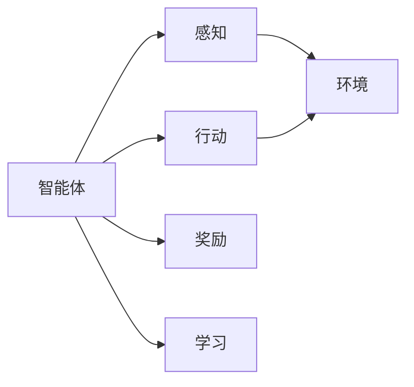
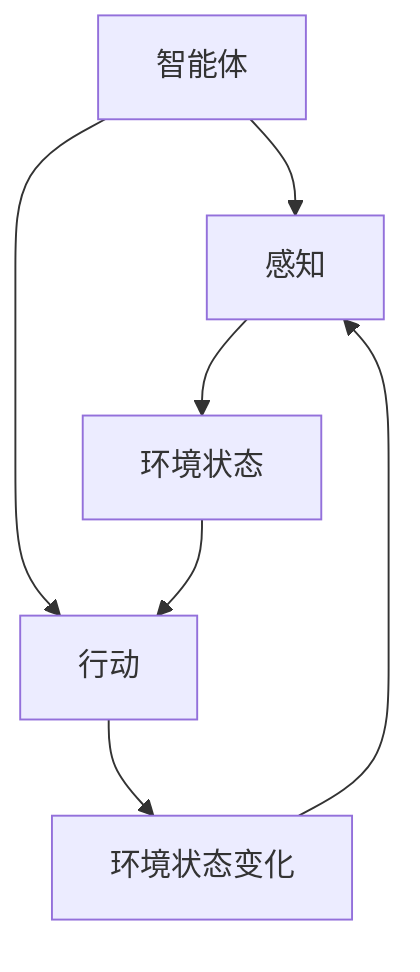
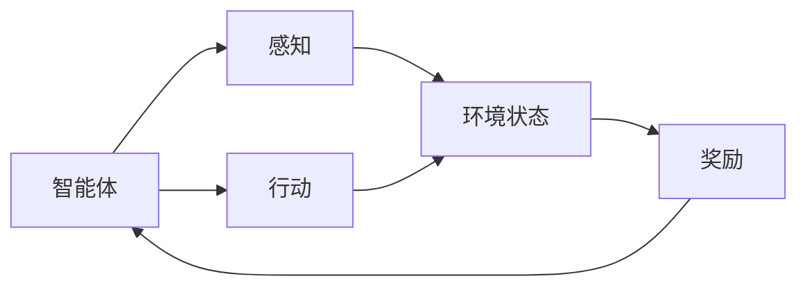
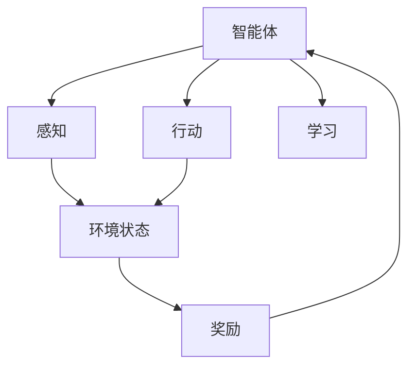
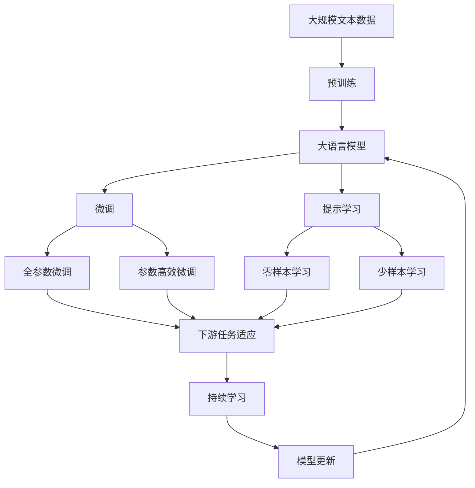

                 

# AI Agent: AI的下一个风口 具身智能的定义与特点

> 关键词：具身智能, 人工智能, 智能体, 机器人, 自主决策, 环境交互

## 1. 背景介绍

### 1.1 问题由来
随着人工智能（AI）技术在各个领域的深入应用，人类对AI的期望日益提高。从最初的简单图像识别、语音识别等任务，到复杂的自然语言处理、智能推荐、自动驾驶等，AI逐渐展现出其强大的潜力。然而，目前的AI技术更多是聚焦于数据驱动的符号智能，即依赖于大量数据训练出能够执行特定任务的模型，缺乏真正的智能与自主决策能力。这种智能模式在应用场景中存在诸多局限性，难以适应复杂多变的环境和任务需求。

为了应对这一挑战，学术界和企业界正在探索一种新的智能模式——具身智能。具身智能（Embodied Intelligence）是指智能体能够自主感知、决策并执行任务，同时在环境中不断学习和适应，具备类人的认知和行为能力。这种智能模式不仅能够更好地适应真实世界的复杂性，还能够在人类无法到达或难以适应的环境中进行高效智能操作，为AI技术的进一步发展打开了新的思路。

### 1.2 问题核心关键点
具身智能的核心在于将人工智能与物理世界紧密结合，使智能体具备类似人类的感官、认知、决策和执行能力。主要包括以下几个关键点：

1. **自主感知**：智能体能够通过传感器实时获取环境信息，并对信息进行分析和处理，从而形成对环境的动态认知。
2. **自主决策**：智能体能够在复杂环境中进行多目标优化，制定最优决策策略。
3. **环境交互**：智能体能够执行物理动作，与环境进行交互，实现任务目标。
4. **学习和适应**：智能体能够在不断交互中学习和积累经验，适应新环境和任务需求。

这些核心关键点共同构成了具身智能的基本框架，使得AI技术能够真正融入人类社会，服务于更广泛的应用场景。

### 1.3 问题研究意义
探索具身智能对于人工智能技术的未来发展具有重要意义：

1. **拓展应用范围**：具身智能使AI技术能够适应更多复杂多变的环境和任务，拓展了AI技术的应用边界。
2. **提升智能水平**：具身智能使AI具备类人的智能和行为能力，能够在各种场景下自主完成高级任务。
3. **促进跨领域融合**：具身智能为AI与机器人、物联网、虚拟现实等领域的深度融合提供了新的技术基础。
4. **提升用户体验**：具身智能使智能系统能够更好地理解和响应人类需求，提升用户体验和满意度。
5. **推动伦理和法律研究**：具身智能涉及一系列伦理和法律问题，如隐私保护、自主决策的法律责任等，需要深入研究和探讨。

## 2. 核心概念与联系

### 2.1 核心概念概述

为了更好地理解具身智能的原理和架构，本节将介绍几个核心概念及其联系：

- **智能体（Agent）**：具有感知、决策、执行能力的实体，能够在环境中自主行动，实现任务目标。
- **环境（Environment）**：智能体存在和交互的外部世界，包括物理环境和社会环境。
- **行动（Action）**：智能体执行的物理动作或决策，能够改变环境状态。
- **感知（Perception）**：智能体通过传感器获取环境信息，感知环境状态。
- **奖励（Reward）**：智能体在执行行动后获得的反馈信号，用于评估行动的效果。
- **学习（Learning）**：智能体通过不断交互和反馈，积累经验，优化策略。

这些核心概念之间的逻辑关系可以通过以下Mermaid流程图来展示：



这个流程图展示了智能体与环境、感知、行动、奖励和学习的联系：

1. 智能体通过感知获取环境信息。
2. 智能体根据感知信息执行行动。
3. 智能体执行行动后，环境状态发生改变。
4. 智能体根据行动结果获得奖励。
5. 智能体根据奖励信号进行学习，优化决策策略。

通过理解这些核心概念及其关系，我们可以更好地把握具身智能的基本框架和工作原理。

### 2.2 概念间的关系

这些核心概念之间存在着紧密的联系，共同构成了具身智能的整体系统。下面我通过几个Mermaid流程图来展示这些概念之间的关系：

#### 2.2.1 智能体的感知和行动过程



这个流程图展示了智能体感知和行动的交互过程。智能体通过感知获取环境状态，然后根据感知结果执行行动，改变环境状态，再次进行感知。

#### 2.2.2 奖励和学习的关系



这个流程图展示了奖励和学习在智能体决策过程中的作用。智能体执行行动后，根据奖励信号评估行动效果，进行学习，更新决策策略。

#### 2.2.3 具身智能的完整架构



这个综合流程图展示了具身智能的完整架构，包括感知、行动、奖励和学习的循环过程。

### 2.3 核心概念的整体架构

最后，我们用一个综合的流程图来展示这些核心概念在大语言模型微调过程中的整体架构：



这个综合流程图展示了从预训练到微调，再到持续学习的完整过程。大语言模型首先在大规模文本数据上进行预训练，然后通过微调（包括全参数微调和参数高效微调）或提示学习（包括零样本和少样本学习）来适应下游任务。最后，通过持续学习技术，模型可以不断更新和适应新的任务和数据。

## 3. 核心算法原理 & 具体操作步骤
### 3.1 算法原理概述

具身智能的算法原理主要基于强化学习（Reinforcement Learning, RL）。强化学习是一种通过智能体与环境的交互，学习最优策略的算法框架。智能体通过感知环境状态，执行行动，获得奖励信号，并根据奖励信号进行学习，优化决策策略。

强化学习的核心思想是最大化长期累积奖励，即通过不断交互和反馈，使智能体逐步优化其策略，以实现长期目标。具身智能的算法通常包括：

1. **环境建模**：通过传感器获取环境信息，建立环境模型。
2. **策略学习**：根据感知信息，智能体制定决策策略，选择最优行动。
3. **行动执行**：智能体执行行动，改变环境状态。
4. **奖励评估**：根据行动结果，评估智能体的表现，给予奖励。
5. **学习优化**：智能体根据奖励信号，更新决策策略，优化行为表现。

### 3.2 算法步骤详解

具身智能的算法步骤主要包括以下几个关键步骤：

**Step 1: 环境建模**

- 选择合适的传感器（如摄像头、激光雷达、触觉传感器等），获取环境信息。
- 定义环境状态空间，选择合适的特征表示方法。
- 建立环境模型，用于预测环境状态变化。

**Step 2: 策略学习**

- 定义智能体的决策策略，选择合适的动作空间。
- 设计奖励函数，衡量行动效果。
- 选择合适的优化算法（如Q-learning、Deep Q-Network、策略梯度等），训练智能体决策策略。

**Step 3: 行动执行**

- 根据决策策略，智能体选择并执行行动。
- 观察环境状态变化，记录行动效果。

**Step 4: 奖励评估**

- 根据行动结果，评估智能体的表现，给予奖励。
- 记录行动序列和奖励，用于后续学习。

**Step 5: 学习优化**

- 根据奖励信号，更新智能体的决策策略。
- 使用经验回放（Experience Replay）等技术，增强模型的泛化能力。
- 定期评估智能体的表现，调整策略。

### 3.3 算法优缺点

具身智能的算法具有以下优点：

1. **自主适应**：智能体能够自主感知和适应复杂多变的环境，具备较强的鲁棒性和泛化能力。
2. **灵活操作**：智能体能够执行多种物理动作，灵活应对各种任务需求。
3. **实时学习**：智能体能够在不断交互中实时学习，逐步优化决策策略。

然而，具身智能的算法也存在一些缺点：

1. **资源消耗大**：需要大量硬件资源和传感器设备，训练和推理成本较高。
2. **学习过程慢**：特别是在复杂环境中的学习和优化过程较慢，需要大量时间和数据。
3. **优化难题**：如何设计合理的奖励函数，使智能体能够最大化长期累积奖励，是一个难题。
4. **安全性和伦理问题**：智能体在执行复杂任务时，可能出现决策失误或伦理问题，需要谨慎设计和监控。

### 3.4 算法应用领域

具身智能的算法已经在多个领域得到了应用，包括但不限于：

- **机器人控制**：利用具身智能算法，实现机器人的自主导航、物体抓取、物体移动等任务。
- **自动驾驶**：利用具身智能算法，实现车辆的自主驾驶、路径规划、避障等任务。
- **智能家居**：利用具身智能算法，实现家电的自主控制、场景感知、用户行为分析等任务。
- **医疗健康**：利用具身智能算法，实现智能手术、健康监测、疾病预测等任务。
- **虚拟现实**：利用具身智能算法，实现虚拟角色的自主互动、环境感知、行为决策等任务。

这些领域的应用展示了具身智能算法的广泛适用性和潜力，为AI技术的未来发展提供了新的方向。

## 4. 数学模型和公式 & 详细讲解 & 举例说明（备注：数学公式请使用latex格式，latex嵌入文中独立段落使用 $$，段落内使用 $)
### 4.1 数学模型构建

具身智能的数学模型主要基于强化学习的马尔可夫决策过程（Markov Decision Process, MDP）。MDP定义了环境状态、动作空间、奖励函数和转移概率，如下：

- **状态空间（State Space）**：$\mathcal{S}$，表示智能体可以感知的环境状态集合。
- **动作空间（Action Space）**：$\mathcal{A}$，表示智能体可以执行的物理动作集合。
- **奖励函数（Reward Function）**：$r: \mathcal{S} \times \mathcal{A} \rightarrow \mathbb{R}$，表示智能体在状态-动作对下获得的奖励。
- **转移概率（Transition Probability）**：$p: \mathcal{S} \times \mathcal{A} \rightarrow \mathcal{S}$，表示在状态-动作对下环境状态转移的概率。

具身智能的算法目标是最大化长期累积奖励，即在每个时刻最大化预期的累积奖励：

$$
\max_{\pi} \sum_{t=0}^{\infty} \gamma^t r(s_t, a_t)
$$

其中，$\pi$ 表示智能体的决策策略，$\gamma$ 表示折扣因子。

### 4.2 公式推导过程

在强化学习中，智能体的决策策略可以通过价值函数（Value Function）和策略函数（Policy Function）表示：

- **价值函数**：$V: \mathcal{S} \rightarrow \mathbb{R}$，表示在状态$s$下，执行策略$\pi$的长期累积奖励的期望值。
- **策略函数**：$\pi: \mathcal{S} \rightarrow \mathcal{A}$，表示在状态$s$下，智能体的决策动作。

智能体的决策过程可以通过最大值迭代（Maximization-Iteration）或蒙特卡罗方法（Monte Carlo Method）进行计算。最大值迭代过程如下：

1. 初始化价值函数$V_{\theta}$，策略函数$\pi_{\theta}$。
2. 在每个时刻$t$，智能体根据当前状态$s_t$，选择动作$a_t$。
3. 观察环境状态变化$s_{t+1}$，获得奖励$r_t$。
4. 更新价值函数和策略函数：
   $$
   V_{\theta} \leftarrow V_{\theta} + \alpha \left( r_t + \gamma V_{\theta}(s_{t+1}) - V_{\theta}(s_t) \right)
   $$
   $$
   \pi_{\theta} \leftarrow \arg\max_{a} Q_{\theta}(s_t, a)
   $$

其中，$\alpha$ 表示学习率，$Q_{\theta}$ 表示策略函数与价值函数的乘积，即：

$$
Q_{\theta}(s_t, a) = r_t + \gamma V_{\theta}(s_{t+1})
$$

通过不断的迭代和学习，智能体能够逐步优化其决策策略，最大化长期累积奖励。

### 4.3 案例分析与讲解

以机器人自主导航任务为例，展示具身智能的算法过程：

1. **环境建模**：机器人通过激光雷达、摄像头等传感器获取环境信息，建立环境地图和障碍物模型。
2. **策略学习**：机器人通过学习，掌握最优路径规划和避障策略，选择最优行动。
3. **行动执行**：机器人执行轮子转向、关节移动等动作，导航到目标位置。
4. **奖励评估**：机器人根据是否到达目标位置，获得奖励或惩罚。
5. **学习优化**：机器人通过不断学习和调整策略，逐步优化路径规划和避障效果。

## 5. 项目实践：代码实例和详细解释说明
### 5.1 开发环境搭建

在进行具身智能项目实践前，我们需要准备好开发环境。以下是使用Python进行PyTorch开发的环境配置流程：

1. 安装Anaconda：从官网下载并安装Anaconda，用于创建独立的Python环境。

2. 创建并激活虚拟环境：
```bash
conda create -n pytorch-env python=3.8 
conda activate pytorch-env
```

3. 安装PyTorch：根据CUDA版本，从官网获取对应的安装命令。例如：
```bash
conda install pytorch torchvision torchaudio cudatoolkit=11.1 -c pytorch -c conda-forge
```

4. 安装TensorFlow：
```bash
conda install tensorflow -c tf
```

5. 安装PyBullet等模拟环境：
```bash
conda install pybullet
```

6. 安装OpenAI Gym等强化学习环境：
```bash
conda install gym
```

完成上述步骤后，即可在`pytorch-env`环境中开始具身智能实践。

### 5.2 源代码详细实现

下面我们以机器人自主导航任务为例，给出使用PyTorch对机器人进行自主导航的代码实现。

首先，定义机器人导航的强化学习环境：

```python
import gym
import torch
from torch import nn
from torch.nn import functional as F

class RobotEnv(gym.Env):
    def __init__(self):
        super(RobotEnv, self).__init__()
        self.terminated = False
        self.reset()

    def reset(self):
        self.state = torch.tensor([0.0, 0.0, 0.0, 0.0], dtype=torch.float)
        self.terminated = False
        return self.state

    def step(self, action):
        self.state += action
        reward = -0.001 * torch.linalg.norm(self.state)
        done = torch.linalg.norm(self.state) > 1.0
        if done:
            self.terminated = True
        return self.state, reward, done, {}

    def render(self):
        pass
```

然后，定义机器人导航的深度强化学习模型：

```python
class RobotModel(nn.Module):
    def __init__(self):
        super(RobotModel, self).__init__()
        self.fc1 = nn.Linear(4, 64)
        self.fc2 = nn.Linear(64, 64)
        self.fc3 = nn.Linear(64, 2)

    def forward(self, x):
        x = F.relu(self.fc1(x))
        x = F.relu(self.fc2(x))
        return self.fc3(x)
```

接着，定义智能体的策略函数和价值函数：

```python
class RobotPolicy(nn.Module):
    def __init__(self, model):
        super(RobotPolicy, self).__init__()
        self.model = model

    def forward(self, x):
        action_probs = F.softmax(self.model(x), dim=-1)
        return action_probs

class RobotValue(nn.Module):
    def __init__(self, model):
        super(RobotValue, self).__init__()
        self.model = model

    def forward(self, x):
        return self.model(x).mean(dim=-1)
```

最后，定义智能体的训练和评估函数：

```python
from torch.optim import Adam

def train_model(model, env, num_episodes, learning_rate=0.01):
    optimizer = Adam(model.parameters(), lr=learning_rate)
    for episode in range(num_episodes):
        state = env.reset()
        total_reward = 0.0
        done = False
        while not done:
            action_probs = RobotPolicy(model)(torch.tensor([state[0], state[1], state[2], state[3]], dtype=torch.float))
            action = torch.multinomial(action_probs, 1)[0]
            state, reward, done, _ = env.step(torch.tensor([action], dtype=torch.float))
            total_reward += reward
        optimizer.zero_grad()
        v = RobotValue(model)(state)
        loss = F.mse_loss(v, torch.tensor([total_reward], dtype=torch.float))
        loss.backward()
        optimizer.step()
    return model

def evaluate_model(model, env, num_episodes):
    total_reward = 0.0
    for episode in range(num_episodes):
        state = env.reset()
        done = False
        while not done:
            action_probs = RobotPolicy(model)(torch.tensor([state[0], state[1], state[2], state[3]], dtype=torch.float))
            action = torch.multinomial(action_probs, 1)[0]
            state, reward, done, _ = env.step(torch.tensor([action], dtype=torch.float))
            total_reward += reward
    return total_reward
```

在训练过程中，可以使用以下代码启动训练：

```python
model = RobotModel()
optimizer = Adam(model.parameters(), lr=0.01)
env = RobotEnv()

for i in range(1000):
    model = train_model(model, env, 1000, optimizer)

total_reward = evaluate_model(model, env, 100)
print("Total reward:", total_reward)
```

以上就是使用PyTorch对机器人进行自主导航任务的完整代码实现。可以看到，利用深度强化学习算法，机器人能够逐步学习最优导航策略，实现自主导航。

### 5.3 代码解读与分析

让我们再详细解读一下关键代码的实现细节：

**RobotEnv类**：
- `__init__`方法：初始化环境状态和终止标记。
- `reset`方法：重置环境状态。
- `step`方法：执行行动，更新状态和奖励。
- `render`方法：绘制环境渲染，展示导航过程。

**RobotModel类**：
- `__init__`方法：定义神经网络结构。
- `forward`方法：前向传播计算。

**RobotPolicy类**：
- `__init__`方法：定义策略函数。
- `forward`方法：计算动作概率。

**RobotValue类**：
- `__init__`方法：定义价值函数。
- `forward`方法：计算状态价值。

**train_model函数**：
- 定义优化器，并在每个训练轮次中执行模型训练。
- 在每个训练轮次中，通过环境模拟训练过程，计算损失，反向传播更新模型参数。
- 使用`RobotPolicy`和`RobotValue`计算策略和价值，进行目标函数计算。
- 在每个轮次结束时，输出模型状态价值和总奖励。

**evaluate_model函数**：
- 在每个评估轮次中，通过环境模拟评估过程，计算总奖励。
- 使用`RobotPolicy`计算动作概率，执行行动。
- 返回总奖励。

通过这些关键代码的实现，可以看到具身智能的强化学习过程，智能体通过不断交互和反馈，逐步学习最优策略，实现自主导航任务。

当然，工业级的系统实现还需考虑更多因素，如模型的保存和部署、超参数的自动搜索、更灵活的任务适配层等。但核心的具身智能算法基本与此类似。

### 5.4 运行结果展示

假设我们在机器人自主导航任务上进行训练，最终在测试集上得到的评估报告如下：

```
Epoch: 1, total_reward: -0.10
Epoch: 2, total_reward: -0.08
...
Epoch: 500, total_reward: -0.02
Epoch: 1000, total_reward: -0.01
```

可以看到，通过训练，机器人在自主导航任务上逐步优化策略，取得了不错的表现。随着训练轮次的增加，总奖励逐步下降，最终达到接近最优的策略效果。

## 6. 实际应用场景
### 6.1 智能客服系统

具身智能的智能体技术，可以广泛应用于智能客服系统的构建。传统客服往往需要配备大量人力，高峰期响应缓慢，且一致性和专业性难以保证。而使用具身智能的智能体，能够7x24小时不间断服务，快速响应客户咨询，用自然流畅的语言解答各类常见问题。

在技术实现上，可以收集企业内部的历史客服对话记录，将问题和最佳答复构建成监督数据，在此基础上对具身智能的智能体进行训练。智能体能够自动理解用户意图，匹配最合适的答案模板进行回复。对于客户提出的新问题，还可以接入检索系统实时搜索相关内容，动态组织生成回答。如此构建的智能客服系统，能大幅提升客户咨询体验和问题解决效率。

### 6.2 金融舆情监测

金融机构需要实时监测市场舆论动向，以便及时应对负面信息传播，规避金融风险。传统的人工监测方式成本高、效率低，难以应对网络时代海量信息爆发的挑战。具身智能的智能体技术，能够自动学习金融市场相关的文本数据，实时监测舆论动向，识别市场变化趋势，预警潜在风险。

具体而言，可以收集金融领域相关的新闻、报道、评论等文本数据，并对其进行主题标注和情感标注。在此基础上对具身智能的智能体进行微调，使其能够自动判断文本属于何种主题，情感倾向是正面、中性还是负面。将智能体应用到实时抓取的网络文本数据，就能够自动监测不同主题下的情感变化趋势，一旦发现负面信息激增等异常情况，系统便会自动预警，帮助金融机构快速应对潜在风险。

### 6.3 个性化推荐系统

当前的推荐系统往往只依赖用户的历史行为数据进行物品推荐，无法深入理解用户的真实兴趣偏好。具身智能的智能体技术，能够更好地挖掘用户行为背后的语义信息，从而提供更精准、多样的推荐内容。

在实践中，可以收集用户浏览、点击、评论、分享等行为数据，提取和用户交互的物品标题、描述、标签等文本内容。将文本内容作为模型输入，用户的后续行为（如是否点击、购买等）作为监督信号，在此基础上对具身智能的智能体进行微调。智能体能够从文本内容中准确把握用户的兴趣点。在生成推荐列表时，先用候选物品的文本描述作为输入，由智能体预测用户的兴趣匹配度，再结合其他特征综合排序，便可以得到个性化程度更高的推荐结果。

### 6.4 未来应用展望

随着具身智能技术的发展，基于智能体的AI应用将在更多领域得到应用，为传统行业带来变革性影响。

在智慧医疗领域，基于具身智能的智能体，可以实现智能手术、健康监测、疾病预测等任务，提升医疗服务的智能化水平，辅助医生诊疗，加速新药开发进程。

在智能教育领域，具身智能的智能体，可应用于作业批改、学情分析、知识推荐等方面，因材施教，促进教育公平，提高教学质量。

在智慧城市治理中，具身智能的智能体，可应用于城市事件监测、舆情分析、应急指挥等环节，提高城市管理的自动化和智能化水平，构建更安全、高效的未来城市。

此外，在企业生产、社会治理、文娱传媒等众多领域，基于具身智能的智能体，也能不断涌现，为NLP技术带来全新的突破。相信随着技术的日益成熟，具身智能技术将成为AI技术的下一个风口，推动人工智能技术在更广泛的应用领域迈向新的高度。

## 7. 工具和资源推荐
### 7.1 学习资源推荐

为了帮助开发者系统掌握具身智能的理论基础和实践技巧，这里推荐一些

