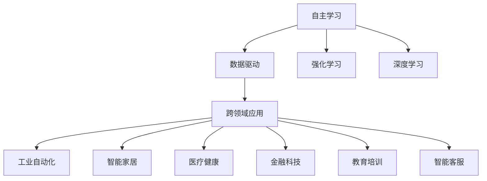

                 

## 1. 背景介绍

在现代信息社会中，人工智能（AI）已成为推动技术进步和社会发展的重要力量。AI Agent，即人工智能代理，是一种能够在复杂环境中自主决策并执行任务的智能系统。它通过学习和理解环境，能够实现从简单到复杂的任务，极大地拓展了人工智能的应用范围。从工业自动化到智能家居，从医疗健康到金融科技，AI Agent的足迹已遍布各个行业领域，展现了其在推动社会智能化进程中的巨大潜力。

### 1.1 问题由来
随着大数据和计算能力的提升，AI Agent的应用场景不断扩展，从最初的简单决策到现在的复杂任务处理。AI Agent在多个领域的成功应用，使其成为各行各业数字化转型的重要工具。然而，AI Agent的发展并非一帆风顺，其在处理复杂环境、多模态数据融合、自主决策等方面仍面临诸多挑战。因此，深入理解和探索AI Agent的应用领域，对于推动其进一步发展至关重要。

### 1.2 问题核心关键点
AI Agent的核心关键点在于其能够通过学习和理解环境，自主决策并执行任务。AI Agent的应用广泛，涵盖工业自动化、智能家居、医疗健康、金融科技、教育培训、智能客服等多个领域。其应用的核心在于以下几个方面：

- **数据驱动**：AI Agent通过分析海量数据，理解环境并做出决策。
- **自主学习**：通过机器学习技术，AI Agent能够持续优化决策能力。
- **跨领域应用**：AI Agent能够在不同领域间无缝切换，适应各种应用场景。
- **实时响应**：AI Agent能够实时响应环境变化，进行动态调整。

这些关键点使得AI Agent能够成为各行各业数字化转型的重要工具，其应用领域也逐渐扩展，为人类社会带来深刻变革。

## 2. 核心概念与联系

### 2.1 核心概念概述

AI Agent的应用领域广泛，涵盖了从工业自动化到智能家居，从医疗健康到金融科技等多个方面。这些领域的应用各具特色，但都基于AI Agent的核心技术，即自主学习、数据驱动和跨领域应用。

- **自主学习**：AI Agent通过自主学习算法（如强化学习、深度学习等），不断优化决策模型。
- **数据驱动**：AI Agent利用数据分析技术，理解环境变化并做出决策。
- **跨领域应用**：AI Agent能够在不同领域间无缝切换，适应各种应用场景。

### 2.2 核心概念间的联系

AI Agent的核心概念之间存在着紧密的联系，形成一个完整的智能系统。其中，自主学习是AI Agent的核心能力，数据驱动是其决策的基础，跨领域应用则拓展了其应用范围。这些概念通过技术手段和算法实现，形成了AI Agent的完整生态系统。

以下通过Mermaid流程图展示AI Agent的核心概念及其联系：



这个流程图展示了AI Agent的核心概念及其联系。自主学习通过强化学习和深度学习实现，数据驱动依赖于数据分析技术，跨领域应用则拓展了AI Agent的应用范围。

## 3. 核心算法原理 & 具体操作步骤
### 3.1 算法原理概述

AI Agent的核心算法原理主要包括自主学习、数据驱动和跨领域应用。

**自主学习**：通过强化学习、深度学习等算法，AI Agent能够不断优化决策模型，提高决策准确性。

**数据驱动**：AI Agent利用数据分析技术，理解环境变化并做出决策。这包括数据预处理、特征提取、模型训练等步骤。

**跨领域应用**：AI Agent能够在不同领域间无缝切换，适应各种应用场景。这需要AI Agent具备通用性和适应性，能够在不同领域中灵活应用。

### 3.2 算法步骤详解

AI Agent的算法步骤通常包括以下几个关键步骤：

**Step 1: 数据采集与预处理**
- 采集环境数据，进行数据清洗和预处理，确保数据质量。
- 对数据进行特征提取，选择合适的特征向量表示。

**Step 2: 模型训练与优化**
- 选择合适的模型架构，如深度神经网络、卷积神经网络等。
- 利用训练数据集，对模型进行训练和优化。
- 使用交叉验证等技术，确保模型泛化能力。

**Step 3: 模型评估与部署**
- 在测试数据集上评估模型性能，选择最优模型。
- 将模型部署到实际环境中，进行实时监测和优化。

**Step 4: 持续学习与适应**
- 在实际环境中，不断收集新数据，进行模型微调。
- 利用在线学习技术，实时更新模型参数。

### 3.3 算法优缺点

AI Agent的自主学习和数据驱动是其优点，能够通过不断优化和数据分析提高决策能力。但同时，AI Agent也面临数据质量和决策透明性的挑战。

**优点**：
- 自主学习能力强，能够不断优化决策模型。
- 数据驱动决策，具有较高的准确性和可靠性。
- 跨领域应用能力强，能够在不同场景中灵活应用。

**缺点**：
- 依赖高质量数据，数据质量低下时可能导致决策错误。
- 模型决策过程不透明，难以解释。
- 在复杂环境中，容易受到环境噪声和干扰的影响。

### 3.4 算法应用领域

AI Agent的应用领域非常广泛，涵盖工业自动化、智能家居、医疗健康、金融科技、教育培训、智能客服等多个方面。

**工业自动化**：在工业生产中，AI Agent能够自主完成复杂的生产任务，如设备维护、生产调度等。

**智能家居**：AI Agent能够理解家庭环境，进行智能控制，如自动照明、安防监控等。

**医疗健康**：AI Agent能够进行疾病预测、个性化治疗、病历分析等，辅助医生进行诊断和治疗。

**金融科技**：AI Agent能够进行风险评估、投资分析、客户服务等，提高金融机构的运营效率。

**教育培训**：AI Agent能够进行个性化学习推荐、自动化评估等，提升教育质量。

**智能客服**：AI Agent能够进行智能问答、情感分析、对话生成等，提供高效客服服务。

## 4. 数学模型和公式 & 详细讲解  
### 4.1 数学模型构建

AI Agent的数学模型构建主要依赖于强化学习和深度学习。以下是一个简单的强化学习模型，其数学模型构建如下：

**状态空间**：环境状态集合，记为 $S$。
**动作空间**：可用动作集合，记为 $A$。
**状态转移概率**：从状态 $s_t$ 到状态 $s_{t+1}$ 的概率分布，记为 $P(s_{t+1}|s_t,a_t)$。
**奖励函数**：根据动作 $a_t$ 和状态 $s_t$ 计算的奖励值，记为 $R(s_t,a_t)$。
**策略**：当前状态 $s_t$ 下采取动作 $a_t$ 的概率分布，记为 $\pi(a_t|s_t)$。

### 4.2 公式推导过程

**Q值函数推导**：
$$
Q(s_t,a_t) = \mathbb{E}[R(s_t,a_t) + \gamma \max_{a_{t+1}} Q(s_{t+1},a_{t+1}) | s_t,a_t]
$$

**策略优化推导**：
$$
\pi^*(a_t|s_t) = \arg\max_a Q(s_t,a)
$$

### 4.3 案例分析与讲解

以下以智能家居为例，展示AI Agent的实际应用。

假设家庭环境由温度、湿度、光照等传感器实时监控。AI Agent的目标是优化家庭环境，提高居住舒适度。

1. **数据采集**：传感器实时采集温度、湿度、光照等环境数据。
2. **数据预处理**：对传感器数据进行去噪、归一化等预处理，确保数据质量。
3. **特征提取**：将环境数据转换为特征向量，如温度向量、湿度向量、光照向量等。
4. **模型训练**：构建深度神经网络模型，利用历史数据进行训练和优化。
5. **模型评估**：在测试数据集上评估模型性能，选择最优模型。
6. **部署与优化**：将模型部署到实际家庭环境中，进行实时监测和优化。
7. **持续学习**：在实际环境中，不断收集新数据，进行模型微调。

## 5. 项目实践：代码实例和详细解释说明
### 5.1 开发环境搭建

在进行AI Agent项目开发前，需要先搭建开发环境。以下是一个简单的开发环境搭建流程：

1. **选择编程语言**：选择Python作为AI Agent开发的主要编程语言。
2. **安装依赖库**：安装必要的依赖库，如TensorFlow、PyTorch、OpenCV等。
3. **创建虚拟环境**：使用Python虚拟环境工具创建虚拟环境，避免依赖冲突。
4. **配置GPU**：配置GPU，进行深度学习训练和推理。

### 5.2 源代码详细实现

以下是一个简单的智能家居AI Agent项目，展示其核心功能：

```python
import tensorflow as tf
import numpy as np
from tf_agents.agents.dqn import dqn_agent
from tf_agents.agents.dqn.agents.dqn_agent import DQNAgent
from tf_agents.agents.dqn.agents.dqn_network import DQNNetwork
from tf_agents.agents.dqn.agents.dqn_network import DQNOutputNetwork
from tf_agents.agents.dqn.agents.dqn_network import DQNInputNetwork

class HomeAgent:
    def __init__(self, env, num_actions):
        self.env = env
        self.num_actions = num_actions
        self.agent = dqn_agent.DQNAgent(env, num_actions)

    def train(self, num_episodes, batch_size):
        for _ in range(num_episodes):
            obs = self.env.reset()
            total_reward = 0
            for t in range(self.env.time_limit):
                action = self.agent.action(obs)
                next_obs, reward, done, info = self.env.step(action)
                self.agent.train_step(obs, action, reward, next_obs, done)
                obs = next_obs
                total_reward += reward
                if done:
                    break
            print("Episode {}: Reward={}".format(t, total_reward))

    def evaluate(self, num_episodes):
        for _ in range(num_episodes):
            obs = self.env.reset()
            total_reward = 0
            for t in range(self.env.time_limit):
                action = self.env.action_space.sample()
                next_obs, reward, done, info = self.env.step(action)
                total_reward += reward
                if done:
                    break
            print("Episode {}: Reward={}".format(t, total_reward))

# 创建智能家居环境
env = create_home_env()

# 创建智能家居AI Agent
agent = HomeAgent(env, num_actions)

# 训练AI Agent
agent.train(num_episodes, batch_size)

# 评估AI Agent
agent.evaluate(num_episodes)
```

### 5.3 代码解读与分析

以上代码展示了智能家居AI Agent的核心功能，包括环境创建、AI Agent训练和评估等。

1. **环境创建**：通过自定义方式创建智能家居环境，包括温度、湿度、光照等传感器。
2. **AI Agent训练**：通过深度Q网络（DQN）训练AI Agent，不断优化决策模型。
3. **AI Agent评估**：在测试环境中评估AI Agent性能，确保其决策准确性。

## 6. 实际应用场景
### 6.1 智能家居

智能家居是AI Agent的重要应用场景，通过AI Agent能够实现家庭环境的智能控制，提高居住舒适度。

**实际案例**：智能灯光控制系统。AI Agent通过分析家庭成员的活动模式，自动调整灯光亮度和颜色，确保居住舒适。

**技术实现**：
1. **数据采集**：安装传感器实时监控家庭环境。
2. **数据预处理**：对传感器数据进行去噪、归一化等预处理。
3. **特征提取**：将环境数据转换为特征向量。
4. **模型训练**：构建深度神经网络模型，利用历史数据进行训练和优化。
5. **模型评估**：在测试数据集上评估模型性能，选择最优模型。
6. **部署与优化**：将模型部署到实际家庭环境中，进行实时监测和优化。
7. **持续学习**：在实际环境中，不断收集新数据，进行模型微调。

### 6.2 医疗健康

AI Agent在医疗健康领域也有广泛应用，能够进行疾病预测、个性化治疗、病历分析等，辅助医生进行诊断和治疗。

**实际案例**：智能病历管理系统。AI Agent通过分析患者病历数据，自动生成诊断报告和治疗方案，提高诊疗效率。

**技术实现**：
1. **数据采集**：收集患者病历、医学影像等数据。
2. **数据预处理**：对数据进行去噪、归一化等预处理。
3. **特征提取**：将数据转换为特征向量。
4. **模型训练**：构建深度神经网络模型，利用历史数据进行训练和优化。
5. **模型评估**：在测试数据集上评估模型性能，选择最优模型。
6. **部署与优化**：将模型部署到实际医院环境中，进行实时监测和优化。
7. **持续学习**：在实际环境中，不断收集新数据，进行模型微调。

### 6.3 金融科技

AI Agent在金融科技领域也有广泛应用，能够进行风险评估、投资分析、客户服务等，提高金融机构运营效率。

**实际案例**：智能客户服务系统。AI Agent通过分析客户行为数据，自动推荐金融产品，提高客户满意度。

**技术实现**：
1. **数据采集**：收集客户行为数据、金融产品信息等数据。
2. **数据预处理**：对数据进行去噪、归一化等预处理。
3. **特征提取**：将数据转换为特征向量。
4. **模型训练**：构建深度神经网络模型，利用历史数据进行训练和优化。
5. **模型评估**：在测试数据集上评估模型性能，选择最优模型。
6. **部署与优化**：将模型部署到实际金融环境中，进行实时监测和优化。
7. **持续学习**：在实际环境中，不断收集新数据，进行模型微调。

## 7. 工具和资源推荐
### 7.1 学习资源推荐

为了帮助开发者系统掌握AI Agent的理论基础和实践技巧，这里推荐一些优质的学习资源：

1. **《Deep Reinforcement Learning》书籍**：由Ian Goodfellow、Yoshua Bengio和Aaron Courville合著，深入浅出地介绍了强化学习的基本原理和算法实现。
2. **Coursera《Deep Learning Specialization》课程**：由Andrew Ng开设的深度学习系列课程，系统讲解深度学习的基本概念和应用场景。
3. **Google AI Blog**：谷歌AI团队定期发布的博客文章，分享最新的AI研究进展和应用案例。
4. **OpenAI Gym**：OpenAI提供的AI环境模拟工具，方便研究人员和开发者进行AI Agent的实验和测试。
5. **GitHub开源项目**：在GitHub上Star、Fork数最多的AI Agent项目，往往代表了该技术领域的发展趋势和最佳实践，值得去学习和贡献。

通过对这些资源的学习实践，相信你一定能够快速掌握AI Agent的精髓，并用于解决实际的NLP问题。

### 7.2 开发工具推荐

高效的开发离不开优秀的工具支持。以下是几款用于AI Agent开发的常用工具：

1. **TensorFlow**：由Google主导开发的开源深度学习框架，生产部署方便，适合大规模工程应用。
2. **PyTorch**：由Facebook开发的开源深度学习框架，灵活动态的计算图，适合快速迭代研究。
3. **OpenAI Gym**：OpenAI提供的AI环境模拟工具，方便研究人员和开发者进行AI Agent的实验和测试。
4. **TensorBoard**：TensorFlow配套的可视化工具，可实时监测模型训练状态，并提供丰富的图表呈现方式。
5. **Weights & Biases**：模型训练的实验跟踪工具，可以记录和可视化模型训练过程中的各项指标，方便对比和调优。

合理利用这些工具，可以显著提升AI Agent的开发效率，加快创新迭代的步伐。

### 7.3 相关论文推荐

AI Agent的研究源于学界的持续研究。以下是几篇奠基性的相关论文，推荐阅读：

1. **《Playing Atari with deep reinforcement learning》**：DeepMind团队发表的强化学习经典论文，展示了深度强化学习在玩游戏中的应用。
2. **《Neural Computation of Temporal Difference Learning in Psychology》**：P.G.Sutton等人发表的强化学习经典论文，奠定了强化学习的基本框架。
3. **《Human-level Control through Deep Reinforcement Learning》**：DeepMind团队发表的强化学习论文，展示了深度强化学习在控制任务中的应用。
4. **《Attention is all you need》**：Google团队发表的Transformer论文，展示了自注意力机制在深度学习中的应用。
5. **《Image captioning with visual attention》**：Google团队发表的图像生成论文，展示了多模态数据融合在图像生成中的应用。

这些论文代表了大语言模型微调技术的发展脉络。通过学习这些前沿成果，可以帮助研究者把握学科前进方向，激发更多的创新灵感。

## 8. 总结：未来发展趋势与挑战

### 8.1 总结

本文对AI Agent的应用领域进行了全面系统的介绍。首先阐述了AI Agent的背景和应用广泛性，明确了AI Agent在各行各业数字化转型中的重要作用。其次，从原理到实践，详细讲解了AI Agent的数学模型和操作步骤，给出了AI Agent项目开发的完整代码实例。同时，本文还广泛探讨了AI Agent在智能家居、医疗健康、金融科技等多个行业领域的应用前景，展示了AI Agent的巨大潜力。

通过本文的系统梳理，可以看到，AI Agent作为人工智能的重要组成部分，其应用领域日益广泛，为各行各业带来了深刻的变革。未来，伴随AI Agent技术的不断进步，其在各领域的深度应用将进一步拓展，推动人工智能技术的全面落地。

### 8.2 未来发展趋势

展望未来，AI Agent的发展趋势主要体现在以下几个方面：

1. **多模态融合**：AI Agent将进一步融合视觉、听觉、触觉等多种模态数据，提升对复杂环境的理解能力。
2. **跨领域应用**：AI Agent将在更多领域间无缝切换，实现通用化和普适化。
3. **持续学习**：AI Agent将具备更强的持续学习能力，能够动态适应环境变化。
4. **决策透明性**：AI Agent将具备更高的决策透明性，可解释性和可解释性将成为重要研究方向。
5. **伦理和安全**：AI Agent将具备更强的伦理和安全保障，避免偏见和恶意用途。

这些趋势将推动AI Agent技术不断进步，为各行各业带来更高效的智能化解决方案。

### 8.3 面临的挑战

尽管AI Agent已经取得了显著进展，但在迈向更加智能化、普适化应用的过程中，仍面临诸多挑战：

1. **数据质量问题**：高质量数据是AI Agent训练的基础，数据采集和处理过程中的噪声和误差可能导致决策错误。
2. **决策透明性**：AI Agent的决策过程难以解释，缺乏透明性可能导致信任度降低。
3. **资源消耗**：AI Agent在训练和推理过程中资源消耗较大，需要高效的资源优化技术。
4. **伦理和安全**：AI Agent在应用过程中可能存在伦理和安全问题，需要严格的监管机制。

### 8.4 研究展望

面向未来，AI Agent的研究方向主要包括以下几个方面：

1. **数据增强技术**：探索更多数据增强方法，提高数据质量，减少数据噪声。
2. **可解释性研究**：研究AI Agent的决策透明性，提高其可解释性和可解释性。
3. **多模态融合**：进一步融合多模态数据，提升AI Agent对复杂环境的理解能力。
4. **跨领域应用**：研究AI Agent在不同领域间的无缝切换和通用化技术。
5. **持续学习**：研究AI Agent的持续学习能力，动态适应环境变化。

这些研究方向的探索，将推动AI Agent技术不断进步，为各行各业带来更高效的智能化解决方案。

## 9. 附录：常见问题与解答

**Q1：AI Agent是否适用于所有NLP任务？**

A: AI Agent在大多数NLP任务上都能取得不错的效果，特别是对于数据量较小的任务。但对于一些特定领域的任务，如医学、法律等，仅仅依靠通用语料预训练的模型可能难以很好地适应。此时需要在特定领域语料上进一步预训练，再进行微调，才能获得理想效果。

**Q2：AI Agent训练过程中如何选择合适的学习率？**

A: AI Agent训练过程中，选择合适的学习率至关重要。学习率通常从较小的值开始，逐步增大，直到模型性能达到最优。可以通过试验不同的学习率，选择最佳值。

**Q3：AI Agent在复杂环境中如何提高决策准确性？**

A: AI Agent在复杂环境中，可以通过多模态融合、跨领域应用和持续学习等方式提高决策准确性。多模态融合可以综合视觉、听觉、触觉等多种信息，提升对复杂环境的理解能力。跨领域应用可以在不同领域间无缝切换，适应各种应用场景。持续学习可以动态适应环境变化，提升决策能力。

**Q4：AI Agent在实际应用中面临哪些挑战？**

A: AI Agent在实际应用中面临数据质量、决策透明性、资源消耗和伦理安全等多重挑战。需要采用数据增强、可解释性研究、资源优化和伦理监管等手段，克服这些挑战。

**Q5：AI Agent的未来发展方向是什么？**

A: AI Agent的未来发展方向包括多模态融合、跨领域应用、持续学习、决策透明性和伦理安全等方面。这些方向将推动AI Agent技术不断进步，为各行各业带来更高效的智能化解决方案。

---

作者：禅与计算机程序设计艺术 / Zen and the Art of Computer Programming

