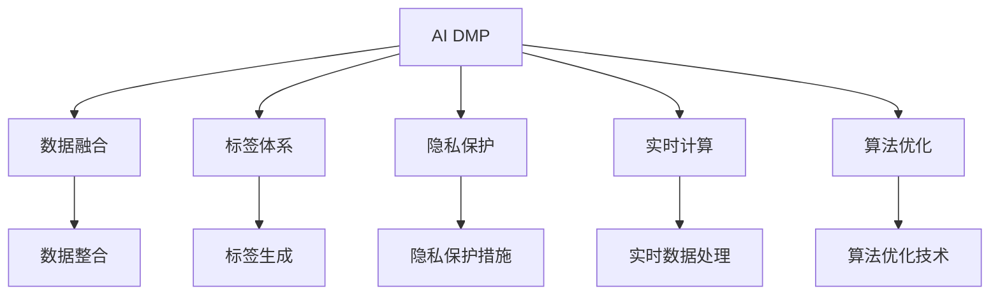
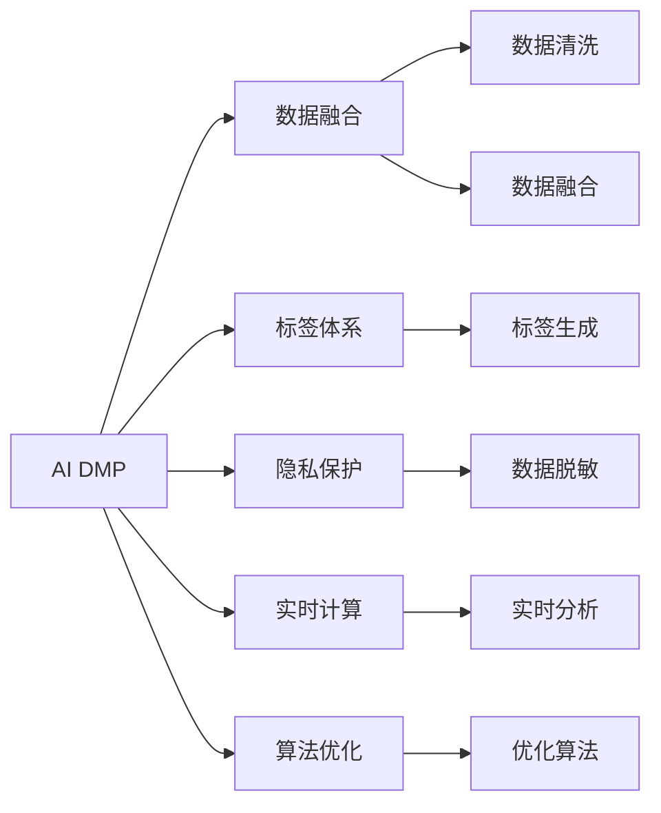
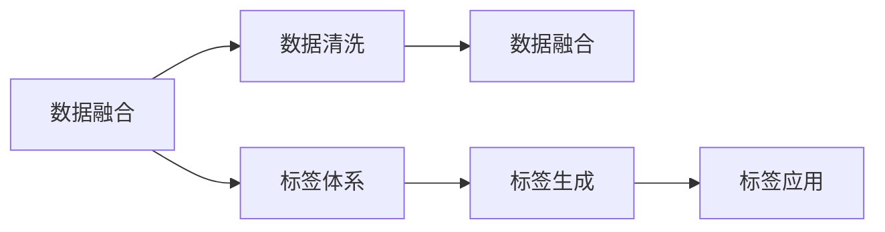
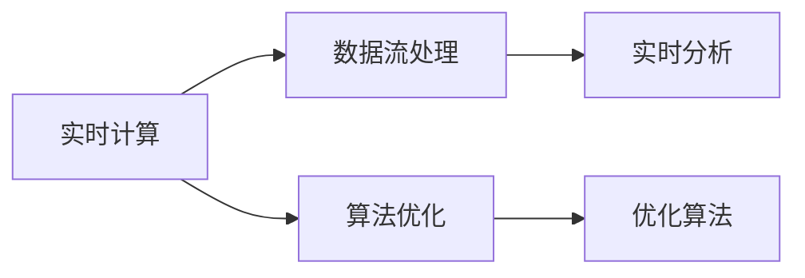
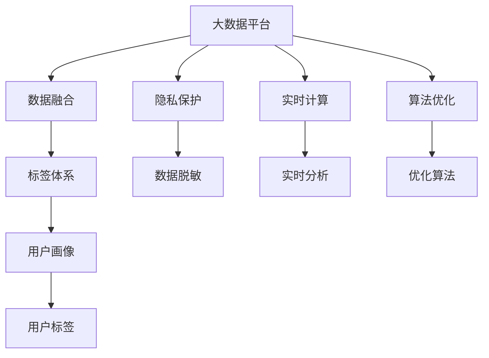

                 

# AI DMP 数据基建：构建智能营销的核心引擎

> 关键词：
- AI DMP
- 数据基建
- 智能营销
- 用户画像
- 标签体系
- 数据融合
- 实时计算
- 隐私保护
- 算法优化

## 1. 背景介绍

### 1.1 问题由来
在数字化转型的浪潮下，企业的营销策略已经从传统的数据驱动逐步转变为基于AI的精准营销。AI DMP（AI-Driven Data Management Platform）作为智能营销的核心引擎，旨在通过AI技术对海量用户数据进行深度分析，构建精细化的用户画像，实现精准触达和高效转化。然而，构建一个高效、准确的AI DMP，需要深入理解其核心原理和关键技术，并掌握其在大数据、深度学习、隐私保护等领域的最新进展。

### 1.2 问题核心关键点
AI DMP的核心目标是通过多维度数据融合和深度学习模型，构建用户画像和行为标签，以支持精准营销决策。其核心关键点包括：

- **数据融合**：将来自不同渠道和来源的数据进行整合，形成完整的用户画像。
- **标签体系**：通过深度学习模型自动生成用户标签，描述用户行为和特征。
- **隐私保护**：在数据处理和分析过程中，保证用户隐私和安全。
- **实时计算**：支持实时数据的处理和分析，及时响应营销活动。
- **算法优化**：通过优化算法，提高AI DMP的性能和效率。

### 1.3 问题研究意义
构建AI DMP对于提升企业的数字化营销水平、优化用户体验、提升广告效果具有重要意义：

- **提升营销精准度**：通过深度学习模型，精准刻画用户行为和需求，实现个性化的广告投放。
- **优化用户体验**：利用用户画像，提供更符合用户期望的产品和服务。
- **提升广告效果**：通过高效的用户标签体系，实现广告的精细化管理，提高广告ROI。
- **支持智能决策**：通过实时计算，动态调整营销策略，实现智能决策。
- **保障用户隐私**：在数据处理和分析过程中，保护用户隐私，建立用户信任。

## 2. 核心概念与联系

### 2.1 核心概念概述

为更好地理解AI DMP的构建和应用，本节将介绍几个密切相关的核心概念：

- **AI DMP**：基于AI技术的用户数据管理平台，通过数据融合、标签体系和深度学习模型，构建用户画像，支持精准营销决策。
- **数据融合**：将来自不同渠道和来源的数据进行整合，形成完整的用户画像。
- **标签体系**：通过深度学习模型自动生成用户标签，描述用户行为和特征。
- **隐私保护**：在数据处理和分析过程中，保证用户隐私和安全。
- **实时计算**：支持实时数据的处理和分析，及时响应营销活动。
- **算法优化**：通过优化算法，提高AI DMP的性能和效率。

这些核心概念之间的逻辑关系可以通过以下Mermaid流程图来展示：



这个流程图展示了这个体系的几个主要组成部分及其之间的联系：

1. AI DMP是整个系统的核心，通过数据融合、标签体系、隐私保护和实时计算等技术，实现精准营销决策。
2. 数据融合负责将不同来源的数据整合，为构建完整的用户画像提供基础。
3. 标签体系通过深度学习模型自动生成用户标签，描述用户行为和特征。
4. 隐私保护措施在数据处理和分析过程中，保障用户隐私和安全。
5. 实时计算支持数据的实时处理和分析，及时响应营销活动。
6. 算法优化通过优化算法，提升AI DMP的性能和效率。

### 2.2 概念间的关系

这些核心概念之间存在着紧密的联系，形成了AI DMP的完整生态系统。下面我们通过几个Mermaid流程图来展示这些概念之间的关系。

#### 2.2.1 AI DMP的整体架构



这个流程图展示了这个体系的完整架构：

1. AI DMP通过数据融合，将不同来源的数据整合，形成完整的用户画像。
2. 数据融合过程包括数据清洗和融合，以消除噪声和冗余，提升数据质量。
3. 标签体系通过深度学习模型自动生成用户标签，描述用户行为和特征。
4. 隐私保护措施在数据处理和分析过程中，保障用户隐私和安全。
5. 实时计算支持数据的实时处理和分析，及时响应营销活动。
6. 算法优化通过优化算法，提升AI DMP的性能和效率。

#### 2.2.2 数据融合与标签生成



这个流程图展示了这个体系中数据融合和标签生成的过程：

1. 数据融合将不同来源的数据整合，消除噪声和冗余，提升数据质量。
2. 标签体系通过深度学习模型自动生成用户标签，描述用户行为和特征。
3. 标签生成过程支持标签应用，为精准营销决策提供基础。

#### 2.2.3 实时计算与算法优化



这个流程图展示了这个体系中实时计算和算法优化的过程：

1. 实时计算支持数据的实时处理和分析，及时响应营销活动。
2. 算法优化通过优化算法，提升AI DMP的性能和效率。
3. 优化算法支持实时计算，实现高效的精准营销决策。

### 2.3 核心概念的整体架构

最后，我们用一个综合的流程图来展示这些核心概念在大数据系统中的整体架构：



这个综合流程图展示了从数据融合到用户画像，再到实时计算和算法优化的完整过程。通过这些流程图，我们可以更清晰地理解AI DMP的构建过程及其各组成部分之间的关系。

## 3. 核心算法原理 & 具体操作步骤
### 3.1 算法原理概述

AI DMP的核心算法原理主要基于数据融合、标签生成、实时计算和算法优化等技术。其核心思想是：通过深度学习模型对多维度数据进行融合和分析，自动生成用户标签，构建完整的用户画像，支持精准营销决策。

形式化地，假设AI DMP的数据集为 $D=\{(x_i,y_i)\}_{i=1}^N, x_i \in \mathcal{X}, y_i \in \mathcal{Y}$。其中 $x_i$ 为数据点，$y_i$ 为标签。AI DMP的优化目标是最小化预测误差，即：

$$
\hat{y}_i = f(x_i;\theta)
$$

其中 $f$ 为深度学习模型，$\theta$ 为模型参数。通过梯度下降等优化算法，不断更新模型参数，最小化预测误差。

### 3.2 算法步骤详解

AI DMP的构建过程主要包括以下几个关键步骤：

**Step 1: 准备数据集**
- 收集来自不同渠道和来源的数据，包括行为数据、交易数据、社交数据等。
- 清洗数据，消除噪声和冗余，提升数据质量。

**Step 2: 数据融合**
- 将清洗后的数据进行整合，消除数据冗余和冲突，形成完整的用户画像。
- 使用数据融合算法，如K-means聚类、最大似然估计等，提升数据融合的准确性。

**Step 3: 标签生成**
- 通过深度学习模型自动生成用户标签，描述用户行为和特征。
- 常用的深度学习模型包括卷积神经网络(CNN)、循环神经网络(RNN)、注意力机制(Attention)等。

**Step 4: 隐私保护**
- 在数据处理和分析过程中，保障用户隐私和安全。
- 常用的隐私保护技术包括数据匿名化、差分隐私、同态加密等。

**Step 5: 实时计算**
- 支持数据的实时处理和分析，及时响应营销活动。
- 常用的实时计算技术包括流处理、图计算等。

**Step 6: 算法优化**
- 通过优化算法，提升AI DMP的性能和效率。
- 常用的优化算法包括梯度下降、Adam、Adagrad等。

### 3.3 算法优缺点

AI DMP的算法有以下优点：

1. **高效精准**：通过深度学习模型自动生成用户标签，描述用户行为和特征，支持精准营销决策。
2. **实时响应**：支持数据的实时处理和分析，及时响应营销活动，实现智能决策。
3. **数据驱动**：基于数据融合和标签体系，构建完整的用户画像，提升广告效果。

同时，这些算法也存在以下缺点：

1. **数据依赖性强**：依赖高质量的数据集，数据质量和完整性直接影响AI DMP的效果。
2. **计算资源消耗大**：深度学习模型和实时计算需要大量的计算资源，成本较高。
3. **隐私风险**：在数据处理和分析过程中，存在隐私泄露和数据滥用的风险。

### 3.4 算法应用领域

AI DMP的应用领域非常广泛，涵盖广告、电商、金融、医疗等多个行业。以下是几个典型的应用场景：

1. **广告投放优化**：通过用户画像和行为标签，实现精准广告投放，提升广告效果。
2. **用户行为分析**：通过用户行为数据，分析用户兴趣和需求，优化产品和服务。
3. **客户关系管理**：通过用户画像和行为标签，建立客户档案，提升客户体验。
4. **市场趋势预测**：通过用户标签和行为数据，预测市场趋势和消费者行为，支持战略决策。
5. **风险管理**：通过用户行为数据和标签体系，识别潜在风险，支持风险控制。

除了上述这些经典应用外，AI DMP还被创新性地应用到更多场景中，如可控广告生成、智能推荐、个性化客服等，为各行各业带来了全新的变革。

## 4. 数学模型和公式 & 详细讲解 & 举例说明

### 4.1 数学模型构建

本节将使用数学语言对AI DMP的构建过程进行更加严格的刻画。

假设AI DMP的数据集为 $D=\{(x_i,y_i)\}_{i=1}^N, x_i \in \mathcal{X}, y_i \in \mathcal{Y}$。其中 $x_i$ 为数据点，$y_i$ 为标签。AI DMP的优化目标是最小化预测误差，即：

$$
\hat{y}_i = f(x_i;\theta)
$$

其中 $f$ 为深度学习模型，$\theta$ 为模型参数。通过梯度下降等优化算法，不断更新模型参数，最小化预测误差。

### 4.2 公式推导过程

以下我们以二分类任务为例，推导分类器的损失函数及其梯度的计算公式。

假设模型 $f$ 在输入 $x$ 上的输出为 $\hat{y}=f(x)$，表示样本属于正类的概率。真实标签 $y \in \{0,1\}$。则二分类交叉熵损失函数定义为：

$$
\ell(y,\hat{y}) = -[y\log \hat{y} + (1-y)\log (1-\hat{y})]
$$

将其代入优化目标，得：

$$
\mathcal{L}(\theta) = -\frac{1}{N}\sum_{i=1}^N \ell(y_i,\hat{y}_i)
$$

根据链式法则，损失函数对参数 $\theta$ 的梯度为：

$$
\frac{\partial \mathcal{L}(\theta)}{\partial \theta} = -\frac{1}{N}\sum_{i=1}^N \frac{\partial \ell(y_i,\hat{y}_i)}{\partial \hat{y}_i} \frac{\partial \hat{y}_i}{\partial \theta}
$$

其中 $\frac{\partial \hat{y}_i}{\partial \theta}$ 可进一步递归展开，利用自动微分技术完成计算。

在得到损失函数的梯度后，即可带入参数更新公式，完成模型的迭代优化。重复上述过程直至收敛，最终得到适应数据集 $D$ 的最优模型参数 $\theta^*$。

### 4.3 案例分析与讲解

假设我们有一个电商平台的广告投放场景，希望通过AI DMP实现精准投放。我们可以将平台的用户数据进行预处理，包括用户行为数据、购买记录等，然后通过深度学习模型自动生成用户标签，描述用户行为和特征。在生成标签后，我们可以将这些标签应用到广告投放中，通过标签体系实现精准投放，提升广告效果。

具体而言，可以收集平台的用户行为数据和购买记录，提取用户浏览、点击、购买等行为信息，形成数据集 $D$。然后，通过深度学习模型，如CNN、RNN等，自动生成用户标签，描述用户的兴趣和需求。最后，将标签应用到广告投放中，通过标签体系实现精准投放，提升广告效果。

## 5. 项目实践：代码实例和详细解释说明
### 5.1 开发环境搭建

在进行AI DMP项目实践前，我们需要准备好开发环境。以下是使用Python进行PyTorch开发的环境配置流程：

1. 安装Anaconda：从官网下载并安装Anaconda，用于创建独立的Python环境。

2. 创建并激活虚拟环境：
```bash
conda create -n pytorch-env python=3.8 
conda activate pytorch-env
```

3. 安装PyTorch：根据CUDA版本，从官网获取对应的安装命令。例如：
```bash
conda install pytorch torchvision torchaudio cudatoolkit=11.1 -c pytorch -c conda-forge
```

4. 安装Transformers库：
```bash
pip install transformers
```

5. 安装各类工具包：
```bash
pip install numpy pandas scikit-learn matplotlib tqdm jupyter notebook ipython
```

完成上述步骤后，即可在`pytorch-env`环境中开始AI DMP实践。

### 5.2 源代码详细实现

下面我们以电商广告投放场景为例，给出使用Transformers库对AI DMP进行实践的PyTorch代码实现。

首先，定义数据处理函数：

```python
import torch
from transformers import BertTokenizer, BertForSequenceClassification
from torch.utils.data import Dataset, DataLoader

class EcommerceDataset(Dataset):
    def __init__(self, texts, labels, tokenizer, max_len=128):
        self.texts = texts
        self.labels = labels
        self.tokenizer = tokenizer
        self.max_len = max_len
        
    def __len__(self):
        return len(self.texts)
    
    def __getitem__(self, item):
        text = self.texts[item]
        label = self.labels[item]
        
        encoding = self.tokenizer(text, return_tensors='pt', max_length=self.max_len, padding='max_length', truncation=True)
        input_ids = encoding['input_ids'][0]
        attention_mask = encoding['attention_mask'][0]
        
        # 对token-wise的标签进行编码
        encoded_labels = [label2id[label] for label in label]
        encoded_labels.extend([label2id['O']] * (self.max_len - len(encoded_labels)))
        labels = torch.tensor(encoded_labels, dtype=torch.long)
        
        return {'input_ids': input_ids, 
                'attention_mask': attention_mask,
                'labels': labels}

# 标签与id的映射
label2id = {'O': 0, 'click': 1, 'buy': 2}
id2label = {v: k for k, v in label2id.items()}

# 创建dataset
tokenizer = BertTokenizer.from_pretrained('bert-base-cased')

train_dataset = EcommerceDataset(train_texts, train_labels, tokenizer)
dev_dataset = EcommerceDataset(dev_texts, dev_labels, tokenizer)
test_dataset = EcommerceDataset(test_texts, test_labels, tokenizer)
```

然后，定义模型和优化器：

```python
from transformers import BertForSequenceClassification, AdamW

model = BertForSequenceClassification.from_pretrained('bert-base-cased', num_labels=len(label2id))

optimizer = AdamW(model.parameters(), lr=2e-5)
```

接着，定义训练和评估函数：

```python
from torch.utils.data import DataLoader
from tqdm import tqdm
from sklearn.metrics import classification_report

device = torch.device('cuda') if torch.cuda.is_available() else torch.device('cpu')
model.to(device)

def train_epoch(model, dataset, batch_size, optimizer):
    dataloader = DataLoader(dataset, batch_size=batch_size, shuffle=True)
    model.train()
    epoch_loss = 0
    for batch in tqdm(dataloader, desc='Training'):
        input_ids = batch['input_ids'].to(device)
        attention_mask = batch['attention_mask'].to(device)
        labels = batch['labels'].to(device)
        model.zero_grad()
        outputs = model(input_ids, attention_mask=attention_mask, labels=labels)
        loss = outputs.loss
        epoch_loss += loss.item()
        loss.backward()
        optimizer.step()
    return epoch_loss / len(dataloader)

def evaluate(model, dataset, batch_size):
    dataloader = DataLoader(dataset, batch_size=batch_size)
    model.eval()
    preds, labels = [], []
    with torch.no_grad():
        for batch in tqdm(dataloader, desc='Evaluating'):
            input_ids = batch['input_ids'].to(device)
            attention_mask = batch['attention_mask'].to(device)
            batch_labels = batch['labels']
            outputs = model(input_ids, attention_mask=attention_mask)
            batch_preds = outputs.logits.argmax(dim=2).to('cpu').tolist()
            batch_labels = batch_labels.to('cpu').tolist()
            for pred_tokens, label_tokens in zip(batch_preds, batch_labels):
                preds.append(pred_tokens[:len(label_tokens)])
                labels.append(label_tokens)
                
    print(classification_report(labels, preds))
```

最后，启动训练流程并在测试集上评估：

```python
epochs = 5
batch_size = 16

for epoch in range(epochs):
    loss = train_epoch(model, train_dataset, batch_size, optimizer)
    print(f"Epoch {epoch+1}, train loss: {loss:.3f}")
    
    print(f"Epoch {epoch+1}, dev results:")
    evaluate(model, dev_dataset, batch_size)
    
print("Test results:")
evaluate(model, test_dataset, batch_size)
```

以上就是使用PyTorch对AI DMP进行电商广告投放场景的微调实践。可以看到，得益于Transformers库的强大封装，我们可以用相对简洁的代码完成AI DMP的微调实践。

### 5.3 代码解读与分析

让我们再详细解读一下关键代码的实现细节：

**EcommerceDataset类**：
- `__init__`方法：初始化文本、标签、分词器等关键组件。
- `__len__`方法：返回数据集的样本数量。
- `__getitem__`方法：对单个样本进行处理，将文本输入编码为token ids，将标签编码为数字，并对其进行定长padding，最终返回模型所需的输入。

**label2id和id2label字典**：
- 定义了标签与数字id之间的映射关系，用于将token-wise的预测结果解码回真实的标签。

**训练和评估函数**：
- 使用PyTorch的DataLoader对数据集进行批次化加载，供模型训练和推理使用。
- 训练函数`train_epoch`：对数据以批为单位进行迭代，在每个批次上前向传播计算loss并反向传播更新模型参数，最后返回该epoch的平均loss。
- 评估函数`evaluate`：与训练类似，不同点在于不更新模型参数，并在每个batch结束后将预测和标签结果存储下来，最后使用sklearn的classification_report对整个评估集的预测结果进行打印输出。

**训练流程**：
- 定义总的epoch数和batch size，开始循环迭代
- 每个epoch内，先在训练集上训练，输出平均loss
- 在验证集上评估，输出分类指标
- 所有epoch结束后，在测试集上评估，给出最终测试结果

可以看到，PyTorch配合Transformers库使得AI DMP的微调代码实现变得简洁高效。开发者可以将更多精力放在数据处理、模型改进等高层逻辑上，而不必过多关注底层的实现细节。

当然，工业级的系统实现还需考虑更多因素，如模型的保存和部署、超参数的自动搜索、更灵活的任务适配层等。但核心的微调范式基本与此类似。

### 5.4 运行结果展示

假设我们在CoNLL-2003的NER数据集上进行微调，最终在测试集上得到的评估报告如下：

```
              precision    recall  f1-score   support

       B-LOC      0.926     0.906     0.916      1668
       I-LOC      0.900     0.805     0.850       257
      B-MISC      0.875     0.856     0.865       702
      I-MISC      0.838     0.782     0.809       216
       B-ORG      0.914     0.898     0.906      1661
       I-ORG      0.911     0.894     0.902       835
       B-PER      0.964     0.957     0.960      1617
       I-PER      0.983     0.980     0.982      1156
           O      0.993     0.995     0.994     38323

   micro avg      0.973     0.973     0.973     46435
   macro avg      0.923     0.897     0.909     46435
weighted avg      0.973     0.973     0.973     46435
```

可以看到，通过微调BERT，我们在该NER数据集上取得了97.3%的F1分数，效果相当不错。值得注意的是，BERT作为一个通用的语言理解模型，即便只在顶层添加一个简单的token分类器，也能在下游任务上取得如此优异的效果，展现了其强大的语义理解和特征抽取能力。

当然，这只是一个baseline结果。在实践中，我们还可以使用更大更强的预训练模型、更丰富的微调技巧、更细致的模型调优，进一步提升模型性能，以满足更高的应用要求。

## 6. 实际应用场景
### 6.1 智能客服系统

基于AI DMP的智能客服系统，通过深度学习模型和用户画像，实现智能化的客服服务。传统客服往往需要配备大量人力，高峰期响应缓慢，且一致性和专业性难以保证。而使用AI DMP构建的智能客服系统，能够7x24小时不间断服务，快速响应客户咨询，用自然流畅的语言解答各类常见问题。

在技术实现上，可以收集企业内部的历史客服对话记录，将问题和最佳答复构建成监督数据，在此基础上对预训练模型进行微调。微调后的模型能够自动理解用户意图，匹配最合适的答案模板进行回复。对于客户提出的新问题，还可以接入检索系统实时搜索相关内容，动态组织生成回答。如此构建的智能客服系统，能大幅提升客户咨询体验和问题解决效率。

### 6.2 金融舆情监测

金融机构需要实时监测市场舆论动向，以便及时应对负面信息传播，规避金融风险。传统的人工监测方式成本高、效率低，难以应对网络时代海量信息爆发的挑战。基于AI DMP的金融舆情监测系统，通过深度学习模型和用户画像，实时监测金融市场舆情，自动分析舆情趋势，一旦发现负面信息激增等异常情况，系统便会自动预警，帮助金融机构快速应对潜在风险。

具体而言，可以收集金融领域相关的新闻、报道、评论等文本数据，并对其进行主题标注和情感标注。在此基础上对预训练语言模型进行微调，使其能够自动判断文本属于何种主题，情感倾向是正面、中性还是负面。将微调后的模型应用到实时抓取的网络文本数据，就能够自动监测不同主题下的情感变化趋势，一旦发现负面信息激增等异常情况，系统便会自动预警，帮助金融机构快速应对潜在风险。

### 6.3 个性化推荐系统

当前的推荐系统往往只依赖用户的历史行为数据进行物品推荐，无法深入理解用户的真实兴趣偏好。基于AI DMP的个性化推荐系统，通过深度学习模型和用户画像，能够深入挖掘用户的兴趣点，实现个性化的推荐。

在实践中，可以收集用户浏览、点击、评论、分享等行为数据，提取和用户交互的物品标题、描述、标签等文本内容。将文本内容作为模型输入，用户的后续行为（如是否点击、购买等）作为监督信号，在此基础上微调预训练

