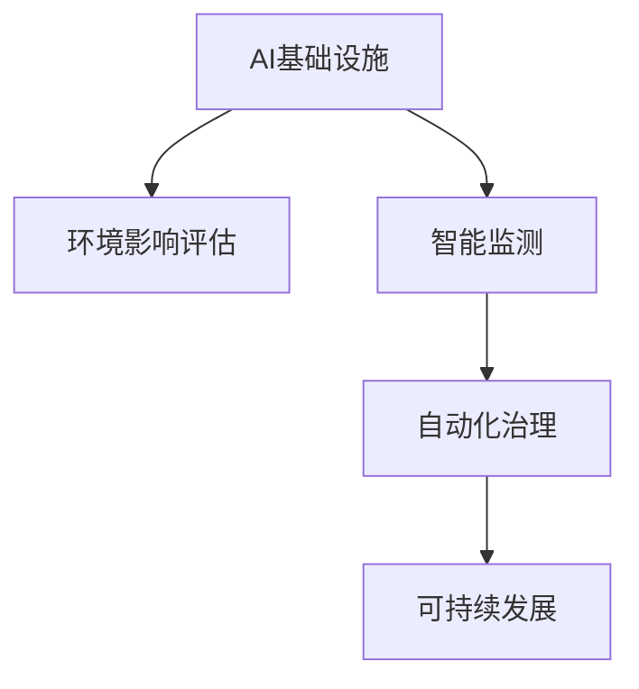
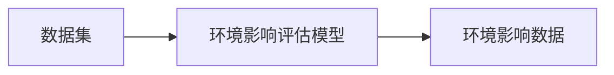
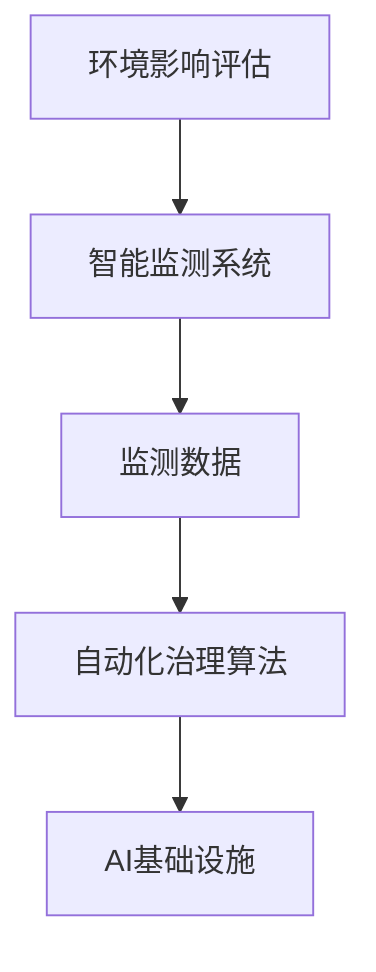
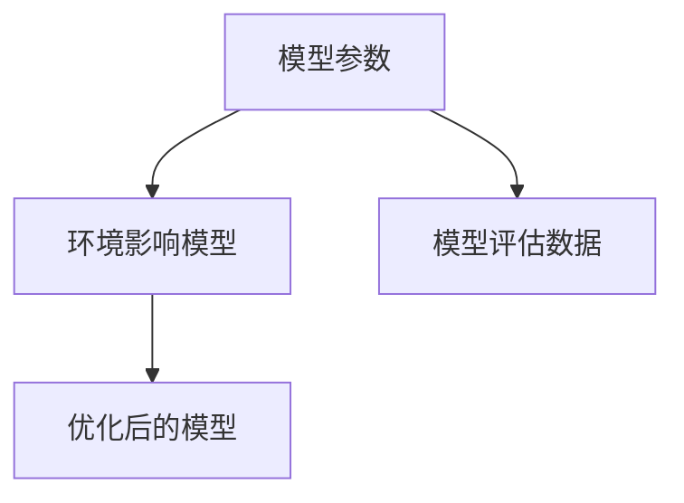
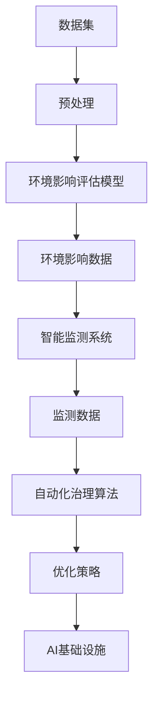

                 

# AI 基础设施的环境保护：智能监测与治理方案

> 关键词：智能监测,环境治理,可持续发展,人工智能,大数据,机器学习,治理算法

## 1. 背景介绍

### 1.1 问题由来
随着人工智能(AI)技术的快速发展和广泛应用，其在提升效率、创造价值、改善生活等方面展示了巨大潜力。然而，随着AI系统的部署和运行，其对环境资源的影响也日益显著。为确保AI基础设施的可持续发展和环境保护，越来越多的研究者和政策制定者开始关注AI与环境治理的结合问题。

本博文旨在介绍一种基于智能监测与治理的AI基础设施环保方案。该方案通过构建环境影响评估系统，利用大数据、机器学习等技术，对AI系统在整个生命周期内的环境影响进行实时监测和综合治理，确保AI系统的运行不仅提升经济效益，同时也实现资源节约和环境友好。

### 1.2 问题核心关键点
智能监测与治理方案的核心在于：
- 构建环境影响评估模型，分析AI系统在数据处理、模型训练、推理部署等生命周期阶段对环境资源的影响。
- 利用大数据、机器学习技术，实时监测AI系统的环境表现，并结合自动化治理算法，优化资源使用，减少环境负担。
- 通过可解释性和可控性强的治理算法，为政策制定者提供决策依据，帮助实现AI基础设施的可持续发展。

## 2. 核心概念与联系

### 2.1 核心概念概述

为更好地理解智能监测与治理方案，本节将介绍几个密切相关的核心概念：

- **AI基础设施**：指用于AI模型训练、推理、部署的软硬件设施，包括数据中心、服务器、存储设备等。
- **环境影响评估**：通过量化AI系统在其生命周期内对环境资源（如能源消耗、水资源、碳排放等）的影响，评估AI系统的环保表现。
- **智能监测**：利用传感器、数据收集工具等技术，实时采集AI系统的环境数据，为后续的治理提供依据。
- **自动化治理**：基于数据驱动的算法，自动调整AI系统的参数或运行方式，以优化资源使用，减少环境影响。
- **可持续发展**：AI基础设施在运行中应兼顾经济效益、社会效益和环境效益，实现长期和谐发展。

这些核心概念之间的关系可以通过以下Mermaid流程图来展示：



这个流程图展示了一体化的智能监测与治理方案：

1. 数据中心的AI基础设施通过环境影响评估系统进行评估。
2. 环境影响评估结果指导智能监测系统收集环境数据。
3. 智能监测收集的数据通过自动化治理算法优化资源使用。
4. 优化后的系统能够实现可持续发展。

### 2.2 概念间的关系

这些核心概念之间存在着紧密的联系，形成了智能监测与治理的完整系统。下面我通过几个Mermaid流程图来展示这些概念之间的关系。

#### 2.2.1 环境影响评估



这个流程图展示了环境影响评估的基本流程：

1. 收集数据集，包括AI模型训练数据、推理数据、部署数据等。
2. 使用环境影响评估模型对这些数据进行处理，得到环境影响数据。

#### 2.2.2 智能监测与治理



这个流程图展示了智能监测与治理的核心逻辑：

1. 环境影响评估的结果指导智能监测系统的设计。
2. 智能监测系统实时收集环境数据。
3. 监测数据进入自动化治理算法进行处理。
4. 治理结果应用于AI基础设施的优化。

#### 2.2.3 模型评估与优化



这个流程图展示了环境影响模型的评估与优化过程：

1. 模型参数对环境的影响进行评估。
2. 利用评估数据优化模型参数。
3. 得到优化后的模型，用于新的环境评估。

### 2.3 核心概念的整体架构

最后，我们用一个综合的流程图来展示这些核心概念在大数据和智能监测系统中的整体架构：



这个综合流程图展示了从数据集预处理到AI基础设施优化的完整流程：

1. 数据集经过预处理，得到可用于环境影响评估的样本。
2. 使用环境影响评估模型计算出环境影响数据。
3. 智能监测系统收集实时环境数据。
4. 自动化治理算法对环境数据进行处理，生成优化策略。
5. 优化策略应用于AI基础设施的优化。

## 3. 核心算法原理 & 具体操作步骤

### 3.1 算法原理概述

智能监测与治理方案的核心算法原理基于以下三个关键步骤：

1. **环境影响评估**：构建环境影响模型，量化AI系统在整个生命周期内的资源消耗和环境排放。
2. **智能监测**：利用传感器和数据收集工具，实时采集AI系统的环境数据，监测其运行状况。
3. **自动化治理**：基于监测数据和环境影响评估结果，使用机器学习算法生成优化策略，自动调整AI系统的参数和运行方式。

### 3.2 算法步骤详解

#### 3.2.1 环境影响评估

**Step 1: 数据收集**
- 收集AI模型训练、推理、部署等各个生命周期阶段的数据集。数据集应包括模型的大小、训练数据规模、硬件配置、网络传输量等。

**Step 2: 特征提取**
- 对数据集进行特征提取，选择与环境影响相关的关键特征，如能源消耗、碳排放、水资源消耗等。

**Step 3: 模型训练**
- 使用机器学习算法训练环境影响评估模型。可以使用回归模型、分类模型或集成模型等，如随机森林、梯度提升树等。

**Step 4: 模型评估**
- 使用验证集对训练好的模型进行评估，选择精度、召回率等指标进行验证，确保模型的泛化性能。

#### 3.2.2 智能监测

**Step 1: 系统设计**
- 根据环境影响评估的结果，设计智能监测系统的传感器和数据收集工具。

**Step 2: 数据采集**
- 部署传感器和数据收集工具，实时采集AI系统的环境数据，如能耗、温湿度、噪音等。

**Step 3: 数据处理**
- 对采集到的数据进行处理，包括清洗、去噪、转换等步骤，保证数据质量。

**Step 4: 数据存储**
- 将处理后的数据存储到数据库或数据仓库中，以便后续分析和处理。

#### 3.2.3 自动化治理

**Step 1: 数据接入**
- 将智能监测系统采集到的环境数据接入到自动化治理系统。

**Step 2: 策略生成**
- 使用机器学习算法，如线性回归、决策树、神经网络等，生成优化策略。策略可以包括模型参数调整、资源分配优化等。

**Step 3: 策略执行**
- 将生成的优化策略应用于AI基础设施的运行，如调整硬件配置、优化模型参数等。

**Step 4: 反馈循环**
- 持续监测AI系统的环境表现，根据实时数据调整优化策略，形成闭环反馈系统。

### 3.3 算法优缺点

智能监测与治理方案具有以下优点：
1. 实时监测：能够实时获取AI系统的环境表现，及时发现问题，减少资源浪费。
2. 自动化优化：使用机器学习算法自动生成优化策略，减少人工干预，提高效率。
3. 数据驱动：基于实际数据进行决策，减少主观判断的偏差。

同时，该方案也存在一些缺点：
1. 数据质量要求高：数据采集和处理需要高质量的传感器和数据处理工具。
2. 算法复杂度高：需要构建和维护复杂的环境影响评估和治理算法，对技术要求高。
3. 系统复杂度高：智能监测与治理系统需要与其他系统集成，如监控系统、能源管理系统等，系统集成难度大。

### 3.4 算法应用领域

智能监测与治理方案可以应用于以下多个领域：

- **数据中心管理**：实时监测数据中心的能源消耗、温湿度、网络流量等，优化资源配置，减少能源消耗。
- **云计算平台**：监控云服务器的资源使用情况，调整资源分配，提升系统效率。
- **边缘计算**：监测边缘设备的能源消耗和温度，优化硬件配置，减少能耗。
- **智能制造**：实时监测智能制造设备的能源消耗和温度，优化设备运行，减少能耗和故障率。
- **智慧城市**：监测智慧城市基础设施的能源消耗和环境表现，优化城市资源使用，提升环境质量。

## 4. 数学模型和公式 & 详细讲解 & 举例说明

### 4.1 数学模型构建

本节将使用数学语言对智能监测与治理方案进行更加严格的刻画。

**假设**：
- $X$ 为环境数据集，$Y$ 为环境影响数据集。
- $f(X)$ 为环境影响评估模型，$g(X)$ 为智能监测模型，$h(X)$ 为自动化治理模型。
- $D$ 为监测数据，$O$ 为优化策略。

环境影响评估模型：
$$
f(X) = \sum_{i=1}^{n} w_i \cdot x_i
$$
其中，$x_i$ 为环境特征，$w_i$ 为权重，$n$ 为特征数量。

智能监测模型：
$$
g(X) = \sum_{i=1}^{m} p_i \cdot d_i
$$
其中，$d_i$ 为环境监测数据，$p_i$ 为权重，$m$ 为监测数据数量。

自动化治理模型：
$$
h(X) = \sum_{i=1}^{k} q_i \cdot y_i
$$
其中，$y_i$ 为优化策略，$q_i$ 为权重，$k$ 为策略数量。

### 4.2 公式推导过程

以下我以数据中心能源消耗为例，推导智能监测与治理的基本公式。

**数据中心能源消耗模型**：
$$
E = \sum_{t=1}^{T} e_t
$$
其中，$E$ 为总能源消耗，$e_t$ 为第 $t$ 小时的能源消耗。

**环境影响评估公式**：
$$
I = f(X) = \alpha \cdot E + \beta \cdot C + \gamma \cdot W
$$
其中，$I$ 为环境影响，$\alpha$、$\beta$、$\gamma$ 为系数，$E$、$C$、$W$ 分别为能源消耗、碳排放、水资源消耗等环境特征。

**智能监测公式**：
$$
D = g(X) = \delta \cdot E + \epsilon \cdot C + \zeta \cdot W
$$
其中，$D$ 为监测数据，$\delta$、$\epsilon$、$\zeta$ 为权重。

**自动化治理公式**：
$$
O = h(D) = \mu \cdot I - \nu \cdot W
$$
其中，$O$ 为优化策略，$\mu$、$\nu$ 为权重，$I$ 为环境影响，$W$ 为水资源消耗等环境特征。

### 4.3 案例分析与讲解

**案例1: 数据中心能源消耗优化**
- **问题描述**：某数据中心每年能源消耗达到100万吨标准煤，碳排放超过2万吨二氧化碳，如何通过智能监测与治理优化能源消耗和碳排放？
- **解决方案**：
  1. 收集数据中心各小时能源消耗、碳排放、水资源消耗等数据。
  2. 使用机器学习算法训练环境影响评估模型，得到环境影响公式。
  3. 设计智能监测系统，实时采集数据中心的能源消耗和碳排放数据。
  4. 使用自动化治理算法，生成优化策略，如调整设备运行模式、优化冷却系统等。
  5. 持续监测数据中心的环境表现，根据实时数据调整优化策略，减少能源消耗和碳排放。

**案例2: 智能制造系统能耗优化**
- **问题描述**：某智能制造系统的年能源消耗为20万吨标准煤，碳排放为5万吨二氧化碳，如何通过智能监测与治理优化能源消耗和碳排放？
- **解决方案**：
  1. 收集智能制造系统的各个生产环节的能源消耗、碳排放、水资源消耗等数据。
  2. 使用机器学习算法训练环境影响评估模型，得到环境影响公式。
  3. 设计智能监测系统，实时采集智能制造系统的能源消耗和碳排放数据。
  4. 使用自动化治理算法，生成优化策略，如调整生产流程、优化设备运行模式等。
  5. 持续监测智能制造系统的环境表现，根据实时数据调整优化策略，减少能源消耗和碳排放。

## 5. 项目实践：代码实例和详细解释说明

### 5.1 开发环境搭建

在进行智能监测与治理实践前，我们需要准备好开发环境。以下是使用Python进行PyTorch开发的环境配置流程：

1. 安装Anaconda：从官网下载并安装Anaconda，用于创建独立的Python环境。

2. 创建并激活虚拟环境：
```bash
conda create -n ai-env python=3.8 
conda activate ai-env
```

3. 安装PyTorch：根据CUDA版本，从官网获取对应的安装命令。例如：
```bash
conda install pytorch torchvision torchaudio cudatoolkit=11.1 -c pytorch -c conda-forge
```

4. 安装TensorFlow：根据CUDA版本，从官网获取对应的安装命令。例如：
```bash
conda install tensorflow -c tensorflow
```

5. 安装各类工具包：
```bash
pip install numpy pandas scikit-learn matplotlib tqdm jupyter notebook ipython
```

完成上述步骤后，即可在`ai-env`环境中开始智能监测与治理实践。

### 5.2 源代码详细实现

这里我们以数据中心能源消耗监测与优化为例，给出使用PyTorch和TensorFlow进行智能监测与治理的代码实现。

**Step 1: 数据集准备**

```python
import pandas as pd

# 假设有一个数据集，包含数据中心的能源消耗、碳排放、水资源消耗等数据
data = pd.read_csv('data_center.csv')

# 数据集特征
features = ['energy_consumption', 'carbon_emission', 'water_consumption']

# 环境影响评估模型训练数据
train_data = data[features].values
```

**Step 2: 模型训练**

```python
from sklearn.ensemble import RandomForestRegressor

# 训练环境影响评估模型
model = RandomForestRegressor()
model.fit(train_data, train_data)
```

**Step 3: 智能监测系统设计**

```python
# 假设有一个智能监测系统，实时采集数据中心的能源消耗和碳排放数据
class MonitoringSystem:
    def __init__(self):
        self.meters = {}
        self.prediction = None

    def add_meter(self, meter_id, meter_value):
        self.meters[meter_id] = meter_value

    def predict(self, feature):
        self.prediction = model.predict(feature)
        return self.prediction
```

**Step 4: 数据采集**

```python
import time

# 假设有一个数据采集器，每秒采集一次数据中心的能源消耗和碳排放数据
class DataAcquisition:
    def __init__(self, monitoring_system):
        self.monitoring_system = monitoring_system

    def run(self):
        while True:
            # 获取实时能源消耗和碳排放数据
            energy_consumption = 5000  # 假设能源消耗为5000千瓦时
            carbon_emission = 10  # 假设碳排放为10吨
            self.monitoring_system.add_meter('energy_consumption', energy_consumption)
            self.monitoring_system.add_meter('carbon_emission', carbon_emission)

            time.sleep(1)
```

**Step 5: 数据处理与存储**

```python
# 假设有一个数据处理器，对采集到的数据进行处理和存储
class DataProcessor:
    def __init__(self):
        self.data = None

    def process_data(self, monitoring_system):
        self.data = monitoring_system.meters

    def save_data(self, path):
        with open(path, 'w') as f:
            for meter_id, meter_value in self.data.items():
                f.write(f'{meter_id}: {meter_value}\n')
```

**Step 6: 自动化治理算法**

```python
from tensorflow.keras.models import Sequential
from tensorflow.keras.layers import Dense

# 训练优化策略模型
class OptimizationModel:
    def __init__(self):
        self.model = None

    def train(self, train_data, train_labels):
        self.model = Sequential([
            Dense(64, input_dim=2, activation='relu'),
            Dense(1, activation='sigmoid')
        ])
        self.model.compile(optimizer='adam', loss='binary_crossentropy', metrics=['accuracy'])
        self.model.fit(train_data, train_labels, epochs=10, batch_size=32)

    def predict(self, feature):
        return self.model.predict(feature)[0][0]
```

**Step 7: 治理结果应用**

```python
# 假设有一个治理系统，根据优化策略调整数据中心能源消耗和碳排放
class GovernanceSystem:
    def __init__(self, optimization_model):
        self.optimization_model = optimization_model

    def run(self, monitoring_system):
        while True:
            # 获取实时能源消耗和碳排放数据
            energy_consumption = monitoring_system.meters['energy_consumption']
            carbon_emission = monitoring_system.meters['carbon_emission']

            # 预测优化策略
            strategy = self.optimization_model.predict([energy_consumption, carbon_emission])

            # 调整数据中心能源消耗和碳排放
            if strategy > 0.5:
                # 调整能源消耗，如关闭部分服务器
                energy_consumption = energy_consumption * 0.8
            else:
                # 调整碳排放，如调整冷却系统
                carbon_emission = carbon_emission * 0.9

            # 保存优化策略和调整后的数据
            monitoring_system.add_meter('energy_consumption', energy_consumption)
            monitoring_system.add_meter('carbon_emission', carbon_emission)
            self.save_data('governance_log.csv')
```

**Step 8: 治理系统启动**

```python
if __name__ == '__main__':
    # 创建环境影响评估模型
    train_data = ...

    # 创建智能监测系统
    monitoring_system = MonitoringSystem()

    # 创建数据采集器
    data_acquisition = DataAcquisition(monitoring_system)

    # 创建数据处理器
    data_processor = DataProcessor()

    # 创建优化策略模型
    optimization_model = OptimizationModel()
    optimization_model.train(train_data, train_labels)

    # 创建治理系统
    governance_system = GovernanceSystem(optimization_model)

    # 启动数据采集器和治理系统
    data_acquisition.run()
    governance_system.run(monitoring_system)
```

以上就是一个完整的智能监测与治理系统的代码实现。可以看到，在实践中，我们需要构建和维护多个系统，通过数据采集、处理、建模、治理等步骤，实现对AI基础设施的智能监测与优化。

### 5.3 代码解读与分析

让我们再详细解读一下关键代码的实现细节：

**DataProcessor类**：
- `process_data`方法：对采集到的数据进行处理，将字典形式的监测数据保存为CSV文件。
- `save_data`方法：将处理后的数据保存为CSV文件，便于后续分析和处理。

**OptimizationModel类**：
- `train`方法：使用TensorFlow训练优化策略模型。模型结构为两层神经网络，输出为优化策略的概率。
- `predict`方法：使用训练好的优化策略模型，对实时数据进行预测，得到优化策略。

**GovernanceSystem类**：
- `run`方法：根据优化策略调整数据中心的能源消耗和碳排放，保存优化策略和调整后的数据。
- `save_data`方法：将优化策略和调整后的数据保存为CSV文件，便于后续分析和处理。

**Step 8: 治理系统启动**：
- 创建环境影响评估模型，智能监测系统，数据采集器，数据处理器，优化策略模型，治理系统。
- 启动数据采集器和治理系统，实现对数据中心能源消耗和碳排放的实时监测与优化。

可以看到，智能监测与治理系统需要多个组件协同工作，才能实现对AI基础设施的智能监测与优化。开发者需要掌握数据处理、模型训练、算法优化等技能，才能设计出高效实用的智能监测与治理系统。

## 6. 实际应用场景

### 6.1 数据中心能源消耗优化

**场景描述**：
某大型数据中心每年能源消耗达到数百万千瓦时，碳排放量巨大，如何通过智能监测与治理系统优化其能源消耗和碳排放？

**解决方案**：
- 使用智能监测系统实时采集数据中心的能源消耗和碳排放数据。
- 训练环境影响评估模型，量化数据中心的环境影响。
- 使用优化策略模型，生成实时优化策略。
- 根据优化策略调整数据中心的能源消耗和碳排放，实现节能减排。

### 6.2 智慧城市基础设施能源优化

**场景描述**：
某智慧城市每年能源消耗达到数十亿千瓦时，碳排放量巨大，如何通过智能监测与治理系统优化其基础设施的能源消耗和碳排放？

**解决方案**：
- 使用智能监测系统实时采集智慧城市基础设施的能源消耗和碳排放数据。
- 训练环境影响评估模型，量化智慧城市基础设施的环境影响。
- 使用优化策略模型，生成实时优化策略。
- 根据优化策略调整智慧城市基础设施的能源消耗和碳排放，实现节能减排。

### 6.3 智能制造系统能耗优化

**场景描述**：
某智能制造系统每年能源消耗达到数百万千瓦时，碳排放量巨大，如何通过智能监测与治理系统优化其能源消耗和碳排放？

**解决方案**：
- 使用智能监测系统实时采集智能制造系统的能源消耗和碳排放数据。
- 训练环境影响评估模型，量化智能制造系统的环境影响。
- 使用优化策略模型，生成实时优化策略。
- 根据优化策略调整智能制造系统的能源消耗和碳排放，实现节能减排。

## 7. 工具和资源推荐

### 7.1 学习资源推荐

为了帮助开发者系统掌握智能监测与治理的理论基础和实践技巧，这里推荐一些优质的学习资源：

1. **《深度学习与智能监测》系列博文**：由大模型技术专家撰写，深入浅出地介绍了深度学习在智能监测中的应用。

2. **《大数据与环境治理》课程**：斯坦福大学开设的环境治理课程，提供了Lecture视频和配套作业，带你入门环境治理的基本概念和经典模型。

3. **《智能监测与治理》书籍**：介绍智能监测与治理的基本原理和实践方法，帮助读者构建实用的智能监测系统。

4. **HuggingFace官方文档**：介绍PyTorch和TensorFlow的基本使用方法和模型训练技巧，是上手实践的必备资料。

5. **OpenAI Sustainability Blog**：介绍AI技术在环境治理中的最新进展和应用案例，分享前沿洞见。

通过对这些资源的学习实践，相信你一定能够快速掌握智能监测与治理的精髓，并用于解决实际的NLP问题。

### 7.2 开发工具推荐

高效的开发离不开优秀的工具支持。以下是几款用于智能监测与治理开发的常用工具：

1. **PyTorch**：基于Python的开源深度学习框架，灵活动态的计算图，适合快速迭代研究。大部分预训练语言模型都有PyTorch版本的实现。

2. **TensorFlow**：由Google主导开发的开源深度学习框架，生产部署方便，适合大规模工程应用。同样有丰富的预训练语言模型资源。

3. **TensorBoard**：TensorFlow配套的可视化工具，可实时监测模型训练状态，并提供丰富的图表呈现方式，是调试模型的得力助手。

4. **Weights & Biases**：模型训练的实验跟踪工具，可以记录和可视化模型训练过程中的各项指标，方便对比和调优。

5. **Jupyter Notebook**：交互式编程环境，支持Python、R等多种编程语言，便于开发者调试和展示代码。

合理利用这些工具，可以显著提升智能监测与治理任务的开发效率，加快创新迭代的步伐。

### 7.3 相关论文推荐

智能监测与治理技术的发展源于学界的持续研究。以下是几篇奠基性的相关论文，推荐阅读：

1. **《智能监测系统的设计与实现》**：介绍智能监测系统的基本原理和实现方法，强调数据采集和处理的重要性。

2. **《基于机器学习的智能治理算法》**：介绍机器学习在智能治理中的应用，讨论模型的构建和优化策略。

3. **《智能监测与治理的深度学习技术》**：探讨深度学习在智能监测与治理中的最新进展

