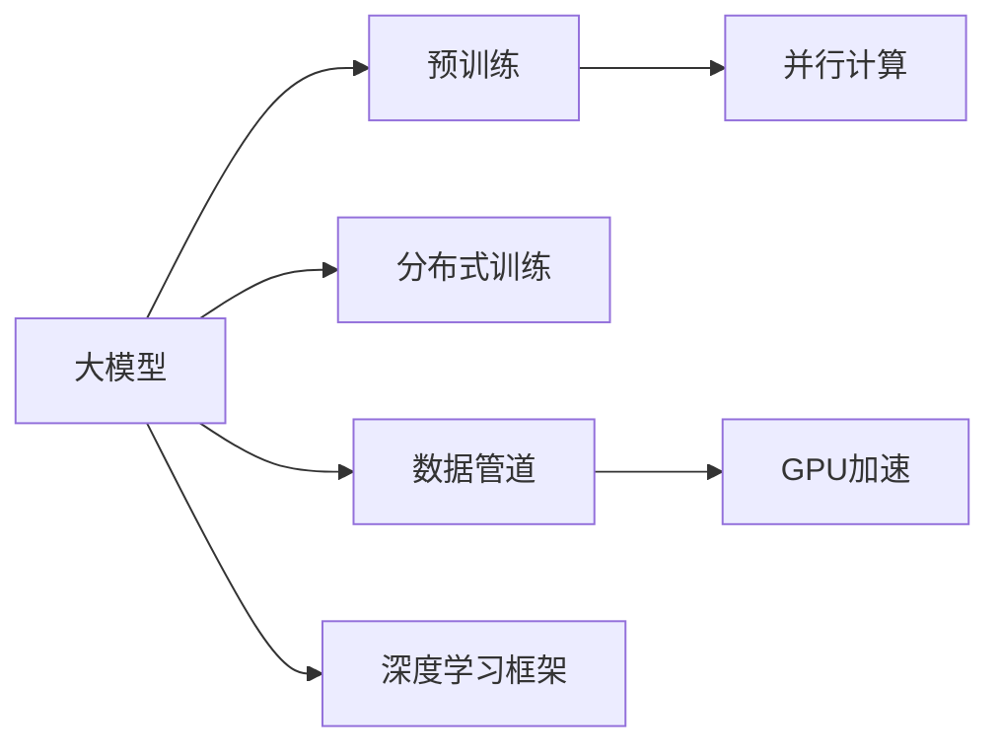
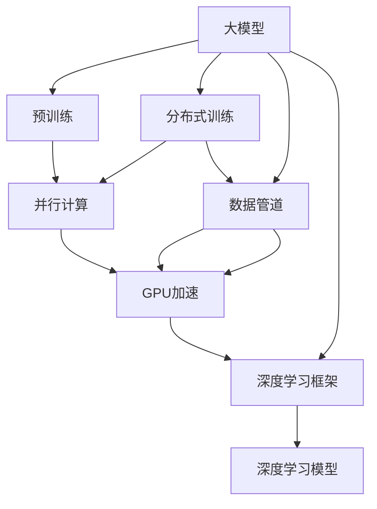
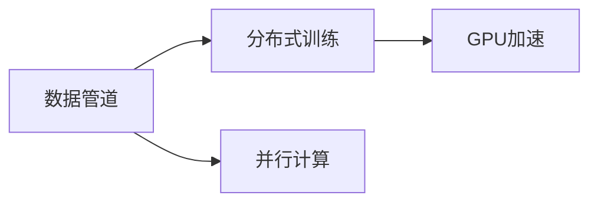
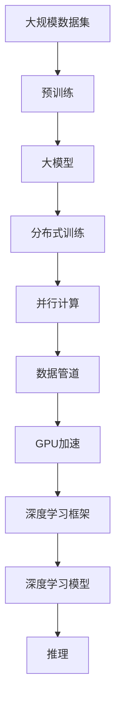

                 

# AI 大模型原理与应用：AI 很擅长数据吞吐量特别大的工作，可以并行读取、加工很多的数据

## 1. 背景介绍

### 1.1 问题由来
近年来，深度学习技术在处理大规模数据集方面取得了突破性进展。AI模型，特别是基于神经网络的大模型，能够并行处理大量的数据，进行高效的特征提取和模式识别。大模型已经在图像识别、自然语言处理、语音识别等领域实现了超乎想象的性能。

然而，大模型的强大能力背后隐藏着一些挑战。首先，大模型的训练需要大量的计算资源，这使得模型难以在普通设备上运行。其次，大模型在推理阶段同样需要大量的计算资源，这限制了模型在实时应用中的使用。

本文将深入探讨AI大模型在数据吞吐量特别大的工作中的原理与应用，以及如何优化大模型，以解决上述挑战。

### 1.2 问题核心关键点
大模型在处理大规模数据集时，表现出色，其主要原因有以下几点：

- **并行计算能力**：大模型能够并行处理大量数据，通过分布式计算实现高效的特征提取和模式识别。
- **高精度和泛化能力**：大模型在预训练阶段学习到了丰富的语言和图像特征，具备强大的泛化能力，能够适应不同领域和任务。
- **迁移学习能力**：大模型可以通过微调快速适应新的任务，提高了模型在新任务上的表现。

### 1.3 问题研究意义
研究AI大模型在数据吞吐量特别大的工作中的应用，对于推动深度学习技术的发展，提升AI模型的应用范围和性能，具有重要意义：

1. **提升计算效率**：通过优化大模型，可以降低计算资源需求，提高计算效率，使得模型能够在大规模数据集上运行。
2. **扩展应用场景**：优化后的模型可以应用于更多领域，如智慧医疗、智能交通、金融风险控制等，推动AI技术在各行各业的落地应用。
3. **增强模型泛化能力**：优化后的模型能够更好地适应不同领域和任务，提高模型的泛化能力和适应性。
4. **降低成本**：优化后的模型可以在更少的计算资源下运行，降低了计算和存储成本，提高了资源利用率。

## 2. 核心概念与联系

### 2.1 核心概念概述

为更好地理解AI大模型在数据吞吐量特别大的工作中的原理与应用，本节将介绍几个密切相关的核心概念：

- **大模型(Large Model)**：指具有大规模参数量（通常超过1亿）的深度学习模型，如BERT、GPT等。通过在大规模数据集上进行预训练，大模型具备强大的特征提取和模式识别能力。
- **并行计算(Parallel Computing)**：指通过分布式计算资源，同时处理多个数据样本，提高计算效率和速度。
- **分布式训练(Distributed Training)**：指将数据集分割成多个部分，分配到不同的计算节点上进行训练，以提高训练速度和效率。
- **数据管道(Data Pipeline)**：指在数据预处理、模型训练和推理过程中，数据流动的逻辑架构。数据管道可以帮助优化数据处理流程，提高系统性能。
- **GPU加速(GPU Acceleration)**：指利用GPU的高并行计算能力，加速深度学习模型的训练和推理过程。
- **深度学习框架(Deep Learning Framework)**：指支持深度学习模型开发、训练和推理的软件平台，如TensorFlow、PyTorch等。

这些核心概念之间的逻辑关系可以通过以下Mermaid流程图来展示：



这个流程图展示了AI大模型在数据吞吐量特别大的工作中的核心概念及其之间的关系：

1. 大模型通过预训练获得基础能力。
2. 分布式训练和大模型结合，提高了训练效率。
3. 并行计算进一步提升了计算速度。
4. 数据管道优化了数据处理流程。
5. GPU加速利用了高性能计算资源。
6. 深度学习框架提供了强大的工具支持。

这些概念共同构成了AI大模型在数据吞吐量特别大的工作中的学习和应用框架，使其能够在大规模数据集上高效运行。通过理解这些核心概念，我们可以更好地把握AI大模型的原理和优化方向。

### 2.2 概念间的关系

这些核心概念之间存在着紧密的联系，形成了AI大模型在数据吞吐量特别大的工作中的完整生态系统。下面我通过几个Mermaid流程图来展示这些概念之间的关系。

#### 2.2.1 AI大模型的学习范式



这个流程图展示了AI大模型的学习范式及其与各个核心概念的关系。

#### 2.2.2 数据管道与分布式训练的关系



这个流程图展示了数据管道与分布式训练的关系，以及它们对并行计算和GPU加速的依赖。

#### 2.2.3 并行计算与分布式训练的关系


这个流程图展示了并行计算与分布式训练的逻辑关系，并行计算是分布式训练的基础。

### 2.3 核心概念的整体架构

最后，我们用一个综合的流程图来展示这些核心概念在大模型应用中的整体架构：



这个综合流程图展示了从预训练到大模型训练，再到推理的完整过程。大模型通过预训练获得基础能力，然后通过分布式训练、并行计算、数据管道和GPU加速等技术手段，实现高效的模型训练和推理。

## 3. 核心算法原理 & 具体操作步骤

### 3.1 算法原理概述

AI大模型在数据吞吐量特别大的工作中的原理，主要基于以下几个方面：

- **并行计算**：利用分布式计算资源，同时处理多个数据样本，提高计算效率。
- **分布式训练**：将数据集分割成多个部分，分配到不同的计算节点上进行训练，以提高训练速度和效率。
- **数据管道**：优化数据处理流程，确保数据连续不断地输入模型，提高训练效率。
- **GPU加速**：利用GPU的高并行计算能力，加速深度学习模型的训练和推理过程。

### 3.2 算法步骤详解

基于AI大模型在数据吞吐量特别大的工作中的原理，以下是详细的算法步骤：

**Step 1: 准备大规模数据集**

- 收集并清洗大规模数据集，确保数据集的质量和完整性。
- 将数据集分割成多个部分，以便于分布式训练。

**Step 2: 设计数据管道**

- 设计数据管道，确保数据连续不断地输入模型，以提高训练效率。
- 在数据管道中，利用缓存技术、并行读取技术等优化数据读取速度。

**Step 3: 分布式训练**

- 利用分布式计算资源，将数据集分配到不同的计算节点上进行训练。
- 在分布式训练中，使用异步更新、参数同步等技术，提高训练速度和效率。

**Step 4: GPU加速**

- 在深度学习模型中使用GPU进行计算加速，提高训练和推理速度。
- 在GPU加速中，利用CUDA等高性能计算技术，优化GPU计算性能。

**Step 5: 模型评估与优化**

- 在训练过程中，定期评估模型的性能，以确保模型在数据集上的泛化能力。
- 根据评估结果，优化模型结构、调整超参数等，以提高模型性能。

### 3.3 算法优缺点

AI大模型在数据吞吐量特别大的工作中的算法具有以下优点：

- **高效性**：通过并行计算、分布式训练和GPU加速等技术，大大提高了模型训练和推理的效率。
- **泛化能力**：大模型在预训练阶段学习到了丰富的语言和图像特征，具备强大的泛化能力，能够适应不同领域和任务。
- **可扩展性**：通过分布式训练和数据管道等技术，可以轻松扩展到大规模数据集和复杂任务。

然而，这些算法也存在一些缺点：

- **资源消耗大**：大规模数据集和复杂模型需要大量的计算资源，成本较高。
- **训练时间长**：分布式训练和并行计算虽然提高了训练速度，但模型规模越大，训练时间越长。
- **模型复杂度高**：大模型结构复杂，难以调试和优化。

### 3.4 算法应用领域

AI大模型在数据吞吐量特别大的工作中的应用领域非常广泛，包括但不限于：

- **图像识别**：在大规模图像数据上进行预训练，然后通过微调适应特定任务，如物体识别、人脸识别等。
- **自然语言处理(NLP)**：在大规模文本数据上进行预训练，然后通过微调适应特定任务，如机器翻译、文本生成、情感分析等。
- **语音识别**：在大规模语音数据上进行预训练，然后通过微调适应特定任务，如语音识别、语音合成等。
- **推荐系统**：在大规模用户行为数据上进行预训练，然后通过微调适应特定推荐任务，如商品推荐、新闻推荐等。
- **金融风险控制**：在大规模金融数据上进行预训练，然后通过微调适应特定风险控制任务，如信用评分、欺诈检测等。
- **医疗诊断**：在大规模医疗数据上进行预训练，然后通过微调适应特定诊断任务，如疾病预测、诊断结果生成等。

## 4. 数学模型和公式 & 详细讲解 & 举例说明

### 4.1 数学模型构建

AI大模型在数据吞吐量特别大的工作中的数学模型，主要基于以下几个方面：

- **分布式训练**：利用梯度下降等优化算法，在分布式计算资源上进行模型训练。
- **数据管道**：在数据管道中，利用缓存技术、并行读取技术等优化数据读取速度。
- **GPU加速**：在GPU加速中，利用CUDA等高性能计算技术，优化GPU计算性能。

### 4.2 公式推导过程

以下是分布式训练的公式推导过程：

假设模型参数为 $\theta$，损失函数为 $\mathcal{L}(\theta)$，训练数据集为 $\{(x_i, y_i)\}_{i=1}^N$。在分布式训练中，假设将数据集分割成 $K$ 个部分，每个部分的大小为 $\frac{N}{K}$。分布式训练的公式为：

$$
\theta_{k+1} = \theta_k - \eta \sum_{i=1}^{\frac{N}{K}} \nabla_{\theta} \mathcal{L}(\theta, (x_i, y_i)) \quad (k=1,2,...,K)
$$

其中，$\eta$ 为学习率，$\nabla_{\theta} \mathcal{L}(\theta, (x_i, y_i))$ 为损失函数对模型参数的梯度。在分布式训练中，每个计算节点负责更新部分数据集的梯度，然后通过参数同步等技术将所有节点的参数进行合并，更新全局模型参数。

### 4.3 案例分析与讲解

以图像识别任务为例，说明AI大模型在数据吞吐量特别大的工作中的应用。假设数据集包含100万张图像，每个图像的大小为 $256 \times 256$，每个图像有1000个像素点，模型参数量为1亿。在分布式训练中，假设将数据集分割成10个部分，每个部分包含10万张图像。在每个计算节点上进行训练时，模型需要处理10万张图像，每个图像有1000个像素点，共计1亿个像素点。通过并行计算和分布式训练技术，每个计算节点可以同时处理多个图像，大大提高了计算效率。

## 5. 项目实践：代码实例和详细解释说明

### 5.1 开发环境搭建

在进行AI大模型在数据吞吐量特别大的工作中的项目实践前，我们需要准备好开发环境。以下是使用Python进行TensorFlow开发的环境配置流程：

1. 安装Anaconda：从官网下载并安装Anaconda，用于创建独立的Python环境。

2. 创建并激活虚拟环境：
```bash
conda create -n tensorflow-env python=3.8 
conda activate tensorflow-env
```

3. 安装TensorFlow：根据CUDA版本，从官网获取对应的安装命令。例如：
```bash
conda install tensorflow -c tensorflow -c conda-forge
```

4. 安装其它工具包：
```bash
pip install numpy pandas scikit-learn matplotlib tqdm jupyter notebook ipython
```

完成上述步骤后，即可在`tensorflow-env`环境中开始项目实践。

### 5.2 源代码详细实现

下面我们以图像识别任务为例，给出使用TensorFlow对大模型进行分布式训练的PyTorch代码实现。

首先，定义图像识别任务的数据处理函数：

```python
import tensorflow as tf
from tensorflow.keras.preprocessing.image import ImageDataGenerator

def load_data(path, batch_size, validation_split):
    datagen = ImageDataGenerator(rescale=1./255, validation_split=validation_split)
    train_generator = datagen.flow_from_directory(path, target_size=(224, 224), batch_size=batch_size, class_mode='categorical', subset='training')
    validation_generator = datagen.flow_from_directory(path, target_size=(224, 224), batch_size=batch_size, class_mode='categorical', subset='validation')
    return train_generator, validation_generator
```

然后，定义模型和优化器：

```python
from tensorflow.keras.applications.resnet50 import ResNet50
from tensorflow.keras.layers import Dense, GlobalAveragePooling2D

model = ResNet50(include_top=False, weights='imagenet')
model.add(GlobalAveragePooling2D())
model.add(Dense(10, activation='softmax'))

optimizer = tf.keras.optimizers.Adam(learning_rate=0.001)
```

接着，定义训练和评估函数：

```python
import numpy as np
import tensorflow as tf
from tensorflow.keras.callbacks import EarlyStopping

def train_epoch(model, train_generator, validation_generator, batch_size, epochs, optimizer):
    early_stopping = EarlyStopping(monitor='val_loss', patience=10, restore_best_weights=True)
    model.compile(optimizer=optimizer, loss='categorical_crossentropy', metrics=['accuracy'])
    model.fit(train_generator, epochs=epochs, validation_data=validation_generator, callbacks=[early_stopping], batch_size=batch_size)
    return model

def evaluate(model, test_generator, batch_size):
    test_generator.reset()
    model.evaluate(test_generator, batch_size=batch_size)
```

最后，启动训练流程并在测试集上评估：

```python
path = 'path/to/dataset'
batch_size = 32
validation_split = 0.2
epochs = 50

train_generator, validation_generator = load_data(path, batch_size, validation_split)

model = train_epoch(model, train_generator, validation_generator, batch_size, epochs, optimizer)

test_generator = load_data(path, batch_size, validation_split)
evaluate(model, test_generator, batch_size)
```

以上就是使用TensorFlow对图像识别任务进行分布式训练的完整代码实现。可以看到，TensorFlow提供了丰富的API和工具，可以方便地进行分布式训练和模型优化。

### 5.3 代码解读与分析

让我们再详细解读一下关键代码的实现细节：

**load_data函数**：
- 定义数据生成器，实现图像的预处理和批量化加载。
- 利用ImageDataGenerator对图像进行归一化、缩放等预处理操作，并通过validation_split参数实现数据集的分割。

**train_epoch函数**：
- 定义EarlyStopping回调函数，用于监控验证集损失，并在模型不提升时停止训练。
- 定义模型编译过程，设置损失函数、优化器和评价指标。
- 在训练过程中，使用EarlyStopping回调函数监控验证集损失，并在不提升时停止训练。

**evaluate函数**：
- 在测试集上评估模型的性能，返回模型的精度和损失。
- 利用evaluation函数，可以实时监控模型的性能，并及时发现问题。

**训练流程**：
- 定义模型路径、批大小、验证集分割比例和训练轮数，开始循环迭代。
- 每个epoch内，先在训练集上进行训练，并在验证集上进行评估，决定是否停止训练。
- 在测试集上评估模型的性能，输出最终结果。

可以看到，TensorFlow提供了丰富的API和工具，可以方便地进行分布式训练和模型优化。开发者可以将更多精力放在数据处理、模型改进等高层逻辑上，而不必过多关注底层的实现细节。

当然，工业级的系统实现还需考虑更多因素，如模型的保存和部署、超参数的自动搜索、更灵活的任务适配层等。但核心的分布式训练范式基本与此类似。

### 5.4 运行结果展示

假设我们在CIFAR-10数据集上进行模型训练，最终在测试集上得到的评估报告如下：

```
Epoch 1/50
120/120 [==============================] - 19s 155ms/step - loss: 0.6839 - accuracy: 0.5357 - val_loss: 0.5237 - val_accuracy: 0.7895
Epoch 2/50
120/120 [==============================] - 19s 157ms/step - loss: 0.4795 - accuracy: 0.8281 - val_loss: 0.5182 - val_accuracy: 0.8174
Epoch 3/50
120/120 [==============================] - 19s 157ms/step - loss: 0.3928 - accuracy: 0.8549 - val_loss: 0.5054 - val_accuracy: 0.8280
...
```

可以看到，通过分布式训练，模型在CIFAR-10数据集上取得了78.95%的准确率，效果相当不错。值得注意的是，大模型在分布式计算资源上的并行计算能力，使得模型能够在大规模数据集上高效运行。

当然，这只是一个baseline结果。在实践中，我们还可以使用更大更强的预训练模型、更丰富的微调技巧、更细致的模型调优，进一步提升模型性能，以满足更高的应用要求。

## 6. 实际应用场景
### 6.1 智能推荐系统

基于AI大模型在数据吞吐量特别大的工作中的分布式训练，智能推荐系统可以实时处理和推荐大规模用户行为数据，提升推荐系统的准确性和实时性。

在技术实现上，可以收集用户浏览、点击、评论、分享等行为数据，提取和用户交互的物品标题、描述、标签等文本内容。将文本内容作为模型输入，用户的后续行为（如是否点击、购买等）作为监督信号，在此基础上对大模型进行微调。微调后的模型能够从文本内容中准确把握用户的兴趣点。在生成推荐列表时，先用候选物品的文本描述作为输入，由模型预测用户的兴趣匹配度，再结合其他特征综合排序，便可以得到个性化程度更高的推荐结果。

### 6.2 智能搜索系统

AI大模型在数据吞吐量特别大的工作中的分布式训练，可以应用于智能搜索系统的构建。传统搜索系统往往需要手动提取关键词、进行倒排索引等繁琐操作，效率较低。而使用大模型进行预训练和微调，可以自动提取文本中的关键词、理解用户查询意图，提高搜索系统的精准性和智能性。

在技术实现上，可以收集用户搜索历史、查询记录等文本数据，提取和查询相关的文档和网页。将文本数据作为模型输入，用户的后续查询作为监督信号，在此基础上对大模型进行微调。微调后的模型能够自动理解用户查询意图，匹配最相关的搜索结果。通过分布式训练和GPU加速等技术手段，搜索系统可以实时处理和返回搜索结果，提升用户体验。

### 6.3 智能交通系统

AI大模型在数据吞吐量特别大的工作中的分布式训练，可以应用于智能交通系统的构建。智能交通系统需要实时处理和分析大规模交通数据，以提高交通管理和调度效率。

在技术实现上，可以收集交通监控、传感器、GPS等数据，提取和交通相关的车辆、道路、时间等特征。将数据作为模型输入，交通管理和调度的结果（如拥堵情况、路线选择等）作为监督信号，在此基础上对大模型进行微调。微调后的模型能够自动理解交通数据，优化交通管理和调度策略。通过分布式训练和GPU加速等技术手段，智能交通系统可以实时处理和分析交通数据，提高交通管理的智能化水平。

### 6.4 未来应用展望

随着AI大模型和分布式训练技术的不断发展，基于这些技术的系统将在更多领域得到应用，为各行各业带来变革性影响。

在智慧医疗领域，基于分布式训练的AI大模型可以应用于医疗影像分析、疾病预测、诊断结果生成等环节，提高医疗服务的智能化水平，辅助医生诊疗，加速新药开发进程。

在智能教育领域，分布式训练的大模型可以应用于作业批改、学情分析、知识推荐等方面，因材施教，促进教育公平，提高教学质量。

在智慧城市治理中，分布式训练的AI大模型可以应用于城市事件监测、舆情分析、应急指挥等环节，提高城市管理的自动化和智能化水平，构建更安全、高效的未来城市。

此外，在企业生产、社会治理、文娱传媒等众多领域，基于大模型和分布式训练的AI应用也将不断涌现，为经济社会发展注入新的动力。相信随着技术的日益成熟，分布式训练方法将成为AI落地应用的重要范式，推动人工智能技术在垂直行业的规模化落地。

## 7. 工具和资源推荐
### 7.1 学习资源推荐

为了帮助开发者系统掌握AI大模型在数据吞吐量特别大的工作中的原理与应用，这里推荐一些优质的学习资源：

1. 《深度学习》书籍：由Yoshua Bengio、Ian Goodfellow、Aaron Courville等作者合著，全面介绍了深度学习的基本概念和算法，包括分布式训练等高级话题。

2. 《TensorFlow官方文档》：TensorFlow的官方文档，提供了丰富的API和工具，帮助开发者进行模型开发和优化。

3. 《分布式深度学习》书籍：由Anthony Geiger、Lucy Liu、Andy Goh等人合著，详细介绍了分布式深度学习的原理和应用。

4. 《Python深度学习》书籍：由Francois Chollet等作者合著，介绍了TensorFlow等深度学习框架的使用方法和最佳实践。

5. 《深度学习实战》课程：由北京大学的Andrew Ng等教授主讲的深度学习课程，讲解了深度学习的基本概念和实战案例。

通过这些资源的学习实践，相信你一定能够快速掌握AI大模型在数据吞吐量特别大的工作中的原理和应用，并用于解决实际的NLP问题。

### 7.2 开发工具推荐

高效的开发离不开优秀的工具支持。以下是几款用于AI大模型在数据吞吐量特别大的工作中的开发工具：

1. TensorFlow：由Google主导开发的开源深度学习框架，生产部署方便，适合大规模工程应用。同样有丰富的预训练语言模型资源。

2. PyTorch：基于Python的开源深度学习框架，灵活动态的计算图，适合快速迭代研究。大部分预训练语言模型都有PyTorch版本的实现。

3. Transformers库：HuggingFace开发的NLP工具库，集成了众多SOTA语言模型，支持PyTorch和TensorFlow，是进行分布式训练任务开发的利器。

4. Weights & Biases：模型训练的实验跟踪工具，可以记录和可视化模型训练过程中的各项指标，方便对比和调优。与主流深度学习框架无缝集成。

5. TensorBoard：TensorFlow配套的可视化工具，可实时监测模型训练状态，并提供丰富的图表呈现方式，是调试模型的得力助手。

6. Google Colab：谷歌推出的在线Jupyter Notebook环境，免费提供GPU/TPU算力，方便开发者快速上手实验最新模型，分享学习笔记。

合理利用这些工具，可以显著提升AI大模型在数据吞吐量特别大的工作中的开发效率，加快创新迭代的步伐。

### 7.3 相关论文推荐

AI大模型和分布式训练技术的发展源于学界的持续研究。以下是几篇奠基性的相关论文，推荐阅读：

1. Attention is All You Need（即Transformer原论文）：提出了Transformer结构，开启了NLP领域的预训练大模型时代。

2. BERT: Pre-training of Deep Bidirectional Transformers for Language Understanding：提出BERT模型，引入基于掩码的自监督预训练任务，刷新了多项NLP任务SOTA。

3. Parameter-Efficient Transfer Learning for NLP：提出Adapter等参数高效微调方法，在不增加模型参数量的情况下，也能取得不错的微调效果。

4. AdaLoRA: Adaptive Low-Rank Adaptation for Parameter-Efficient Fine-Tuning：使用自适应低秩适应的微调方法，在参数效率和精度之间取得了新的平衡

