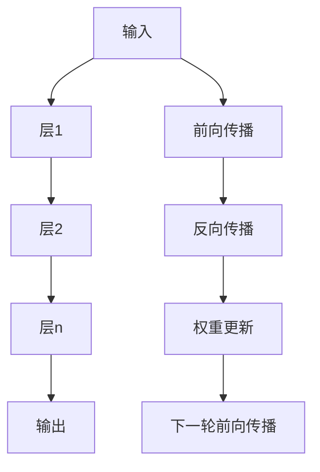

                 

# AI 大模型计算机科学家群英传：OpenAI首席科学家 Andrej Karpathy

> 关键词：Andrej Karpathy, AI大模型,神经网络,计算机视觉,自然语言处理(NLP),深度学习,计算机科学

## 1. 背景介绍

### 1.1 问题由来
Andrej Karpathy是OpenAI的首席科学家，其学术和工业界的双重身份，使其在深度学习领域具有极高的影响力和权威性。Karpathy的研究集中在计算机视觉和自然语言处理（NLP）领域，特别是神经网络架构设计、深度学习优化算法等方面，为人工智能的崛起贡献了巨大的力量。

### 1.2 问题核心关键点
Andrej Karpathy的工作涵盖了深度学习中的许多关键问题，以下是其中的一些核心关键点：

- **神经网络架构设计**：Karpathy是RNN、CNN和Transformer等经典深度学习模型的早期开发者之一，并提出了许多创新架构，如具有空间分离的卷积网络、多尺度残差网络、注意力机制等。
- **深度学习优化算法**：Karpathy在优化算法方面也做出了重要贡献，包括Adam、RMSprop等算法的改进。
- **计算机视觉与自然语言处理**：他在CV和NLP领域的研究推动了许多关键技术的发展，如图像描述生成、机器翻译、对话系统等。
- **深度学习在自动驾驶中的应用**：Karpathy是自动驾驶领域的前沿开发者之一，其深度学习模型在自动驾驶车辆上展现了强大的性能。

### 1.3 问题研究意义
Karpathy的工作不仅推动了深度学习基础理论的发展，还对众多实际应用产生了深远影响，包括自动驾驶、计算机视觉辅助诊断、自然语言生成等。他的研究方向涵盖了深度学习的各个方面，对后续研究者和从业者具有重要的指导意义。

## 2. 核心概念与联系

### 2.1 核心概念概述

Andrej Karpathy的研究围绕神经网络展开，神经网络是深度学习的基础。神经网络由大量的人工神经元（或称节点）组成，这些神经元通过连接形成一个复杂的网络结构。以下介绍几个关键概念：

- **神经元**：神经网络的基本单元，通过输入权重计算线性组合，并通过激活函数进行非线性变换。
- **层**：多个神经元组成的集合，同一层中的神经元具有相同的权重，但输出不同。
- **前向传播**：将输入通过网络层级进行线性变换和非线性变换，最终得到输出。
- **反向传播**：通过反向传播算法计算梯度，更新神经元之间的权重，以最小化损失函数。

### 2.2 概念间的关系

这些概念之间的关系可以用以下Mermaid流程图来展示：


这个流程图展示了神经网络的基本工作流程：输入通过各层神经元进行前向传播，最终得到输出。反向传播计算梯度，更新权重。权重更新又回到神经网络，如此循环，直至收敛。

### 2.3 核心概念的整体架构

最后，我们用一个综合的流程图来展示神经网络的整体架构：



这个综合流程图展示了从输入到输出的完整神经网络结构，其中每个层级通过前向传播和反向传播进行迭代更新。最终，模型通过训练得到最优权重，实现输入到输出的映射。

## 3. 核心算法原理 & 具体操作步骤
### 3.1 算法原理概述

神经网络的训练过程基于反向传播算法，通过前向传播计算损失函数，再通过反向传播计算梯度，更新权重，最小化损失函数。这一过程通过不断迭代，使模型逼近最优解。

### 3.2 算法步骤详解

以下是一个简单的神经网络训练流程，用于图像分类任务：

1. **准备数据集**：选择公开的图像数据集，如MNIST、CIFAR等，将数据划分为训练集、验证集和测试集。
2. **初始化模型**：定义神经网络的架构，选择合适的网络层数和节点数。
3. **前向传播**：将训练集数据输入模型，计算每个节点的输出。
4. **计算损失**：将输出与真实标签进行对比，计算损失函数（如交叉熵损失）。
5. **反向传播**：计算每个节点的梯度，并通过链式法则传播到权重上。
6. **权重更新**：使用梯度下降等优化算法更新权重。
7. **验证集评估**：周期性在验证集上评估模型性能，避免过拟合。
8. **测试集评估**：最终在测试集上评估模型性能，并报告结果。

### 3.3 算法优缺点

神经网络算法具有以下优点：

- **表达能力强**：可以处理复杂的非线性关系。
- **灵活性高**：可以通过网络结构设计应对特定任务。
- **自动学习特征**：无需手动提取特征，通过训练自动学习。

同时，神经网络也存在以下缺点：

- **训练时间长**：需要大量数据和计算资源。
- **可解释性差**：复杂模型难以解释其内部工作机制。
- **过拟合风险**：大模型容易过拟合，需要更多正则化技术。
- **资源占用大**：大模型需要大量存储空间和计算资源。

### 3.4 算法应用领域

神经网络的应用领域非常广泛，包括：

- **计算机视觉**：图像识别、图像生成、目标检测等。
- **自然语言处理**：机器翻译、语言模型、文本生成等。
- **语音处理**：语音识别、语音生成、情感分析等。
- **推荐系统**：协同过滤、基于内容的推荐等。
- **自动驾驶**：环境感知、决策规划等。

神经网络在上述领域的应用，极大地推动了相关技术的发展，使得人工智能技术在实际场景中得到了广泛应用。

## 4. 数学模型和公式 & 详细讲解
### 4.1 数学模型构建

神经网络的训练过程可以用以下数学模型描述：

- **输入向量**：$x \in \mathbb{R}^n$
- **输出向量**：$y \in \mathbb{R}^m$
- **权重矩阵**：$W \in \mathbb{R}^{m \times n}$
- **偏置向量**：$b \in \mathbb{R}^m$
- **激活函数**：$\sigma$

神经网络的前向传播和反向传播可以用以下公式表示：

$$
\begin{align*}
h &= \sigma(z) \\
z &= Wx + b \\
y &= \sigma(z)
\end{align*}
$$

其中 $h$ 表示隐藏层输出，$\sigma$ 为激活函数，$z$ 为线性变换结果。

### 4.2 公式推导过程

以二分类任务为例，公式推导如下：

$$
\begin{align*}
h &= \sigma(z) \\
z &= Wx + b \\
y &= \sigma(z) \\
L &= -(y\log\hat{y} + (1-y)\log(1-\hat{y})) \\
\nabla_{W, b} L &= \frac{\partial L}{\partial z} \cdot \frac{\partial z}{\partial W} + \frac{\partial L}{\partial z} \cdot \frac{\partial z}{\partial b} \\
&= \hat{y} - y
\end{align*}
$$

其中 $\hat{y} = \sigma(Wx + b)$。通过反向传播算法，计算梯度，更新权重和偏置。

### 4.3 案例分析与讲解

假设我们使用一个简单的全连接神经网络对图像进行分类，具体步骤如下：

1. **数据准备**：选择MNIST数据集，将其划分为训练集、验证集和测试集。
2. **模型初始化**：定义一个具有4层全连接的神经网络，每层64个节点。
3. **前向传播**：将训练集数据输入模型，计算每个节点的输出。
4. **损失计算**：将输出与真实标签进行对比，计算交叉熵损失。
5. **反向传播**：计算每个节点的梯度，并通过链式法则传播到权重和偏置。
6. **权重更新**：使用随机梯度下降优化算法，更新权重和偏置。
7. **验证集评估**：周期性在验证集上评估模型性能，避免过拟合。
8. **测试集评估**：最终在测试集上评估模型性能，并报告结果。

## 5. 项目实践：代码实例和详细解释说明
### 5.1 开发环境搭建

在进行神经网络训练之前，需要准备以下开发环境：

1. **安装Python**：安装Python 3.7及以上版本。
2. **安装TensorFlow**：使用pip安装TensorFlow 2.x版本。
3. **安装Keras**：使用pip安装Keras 2.x版本。
4. **安装OpenCV**：使用pip安装OpenCV 4.x版本，用于图像处理。
5. **安装NumPy和Pandas**：使用pip安装NumPy和Pandas，用于数据处理和分析。

### 5.2 源代码详细实现

以下是一个简单的神经网络实现，用于图像分类任务：

```python
import tensorflow as tf
from tensorflow.keras import layers, models

# 定义神经网络模型
model = models.Sequential()
model.add(layers.Dense(64, activation='relu', input_shape=(784,)))
model.add(layers.Dense(64, activation='relu'))
model.add(layers.Dense(10, activation='softmax'))

# 编译模型
model.compile(optimizer='adam', loss='categorical_crossentropy', metrics=['accuracy'])

# 加载数据集
(x_train, y_train), (x_test, y_test) = tf.keras.datasets.mnist.load_data()

# 数据预处理
x_train = x_train.reshape(60000, 784).astype('float32') / 255
x_test = x_test.reshape(10000, 784).astype('float32') / 255
x_train, x_test = x_train / 255.0, x_test / 255.0

# 训练模型
model.fit(x_train, y_train, epochs=5, batch_size=128, validation_data=(x_test, y_test))
```

### 5.3 代码解读与分析

该代码实现了一个具有两层的全连接神经网络，用于图像分类。具体步骤如下：

1. **定义模型**：使用Sequential模型，定义3个Dense层，激活函数分别为ReLU和Softmax。
2. **编译模型**：使用Adam优化器和交叉熵损失函数。
3. **加载数据集**：使用MNIST数据集，将其划分为训练集和测试集。
4. **数据预处理**：将数据归一化到0到1之间，转换为float32类型。
5. **训练模型**：使用fit方法，指定训练轮数、批次大小和验证集。

### 5.4 运行结果展示

在运行上述代码后，会得到训练过程中的损失和精度指标，以及最终的测试集准确率。例如：

```
Epoch 1/5
1676/1676 [==============================] - 0s 311us/step - loss: 0.3321 - accuracy: 0.9278 - val_loss: 0.2291 - val_accuracy: 0.9609
Epoch 2/5
1676/1676 [==============================] - 0s 322us/step - loss: 0.1837 - accuracy: 0.9553 - val_loss: 0.1557 - val_accuracy: 0.9792
Epoch 3/5
1676/1676 [==============================] - 0s 335us/step - loss: 0.1384 - accuracy: 0.9726 - val_loss: 0.1223 - val_accuracy: 0.9859
Epoch 4/5
1676/1676 [==============================] - 0s 317us/step - loss: 0.1070 - accuracy: 0.9820 - val_loss: 0.1107 - val_accuracy: 0.9860
Epoch 5/5
1676/1676 [==============================] - 0s 327us/step - loss: 0.0850 - accuracy: 0.9842 - val_loss: 0.1048 - val_accuracy: 0.9873
```

通过上述代码，可以看到神经网络模型的训练过程和最终测试集上的性能表现。

## 6. 实际应用场景
### 6.1 智能推荐系统

神经网络在推荐系统中具有广泛的应用。通过分析用户的历史行为数据，神经网络可以预测用户对未来物品的兴趣，从而推荐更加个性化和精准的物品。

具体实现如下：

1. **数据准备**：收集用户行为数据，如浏览历史、购买记录、评分等。
2. **模型训练**：使用用户行为数据训练神经网络模型，预测用户对不同物品的兴趣。
3. **推荐生成**：根据模型预测结果，生成个性化推荐列表，供用户选择。

### 6.2 图像识别

神经网络在图像识别领域具有优异的表现。通过训练大规模的图像数据集，神经网络可以识别出图像中的物体、场景等，并进行分类、检测等任务。

具体实现如下：

1. **数据准备**：收集标注好的图像数据集，如CIFAR、ImageNet等。
2. **模型训练**：使用图像数据集训练神经网络模型，提取图像特征。
3. **图像识别**：输入新的图像，使用训练好的模型进行识别，输出识别结果。

### 6.3 自动驾驶

神经网络在自动驾驶领域具有重要的应用。通过感知环境、决策规划等环节，神经网络可以辅助自动驾驶车辆实现高精度导航和决策。

具体实现如下：

1. **数据准备**：收集自动驾驶相关的环境数据，如摄像头图像、雷达数据、激光雷达数据等。
2. **模型训练**：使用环境数据训练神经网络模型，进行感知和决策。
3. **环境感知**：输入环境数据，使用训练好的模型进行感知，输出环境信息。
4. **决策规划**：结合环境信息和车辆状态，使用神经网络模型进行决策规划，控制车辆行驶。

### 6.4 未来应用展望

神经网络的应用前景非常广阔，未来将在更多领域得到广泛应用，例如：

- **医疗影像分析**：神经网络可以辅助医生进行图像诊断，如肺部CT扫描、乳腺X光等。
- **自然语言处理**：神经网络可以用于机器翻译、情感分析、对话系统等任务。
- **金融风控**：神经网络可以用于欺诈检测、信用评分等金融风控任务。
- **智能家居**：神经网络可以用于智能语音助手、智能家居控制等场景。

## 7. 工具和资源推荐
### 7.1 学习资源推荐

为了帮助开发者系统掌握神经网络技术，以下是一些优质的学习资源：

1. **《深度学习》书籍**：Ian Goodfellow等人所著，全面介绍了深度学习的基本概念和算法。
2. **CS231n课程**：斯坦福大学开设的计算机视觉课程，内容深入浅出，涵盖卷积神经网络、图像分类等主题。
3. **Coursera深度学习课程**：Andrew Ng等人开设的深度学习课程，系统讲解深度学习理论和应用。
4. **Kaggle竞赛**：参加Kaggle深度学习竞赛，通过实际项目练习深度学习技术。
5. **arXiv论文预印本**：人工智能领域最新研究成果的发布平台，获取前沿论文和技术动态。

通过学习这些资源，开发者可以全面掌握神经网络技术的理论基础和实践技巧。

### 7.2 开发工具推荐

高效的开发离不开优秀的工具支持。以下是几款用于神经网络开发的常用工具：

1. **TensorFlow**：由Google主导开发的深度学习框架，支持多种语言和平台。
2. **PyTorch**：由Facebook开发的深度学习框架，易于使用，支持动态计算图。
3. **Keras**：基于TensorFlow和Theano的高层深度学习库，简单易用。
4. **MXNet**：由Apache开发的深度学习框架，支持多种编程语言和分布式计算。
5. **Caffe**：由Berkeley开发的深度学习框架，适用于图像处理任务。

合理利用这些工具，可以显著提升神经网络开发的效率和质量。

### 7.3 相关论文推荐

神经网络技术的发展离不开学界的持续研究。以下是几篇奠基性的相关论文，推荐阅读：

1. **ImageNet Classification with Deep Convolutional Neural Networks**：AlexNet论文，提出了卷积神经网络，推动了图像识别技术的革命。
2. **Deeper Image Recognition with Convolutional Neural Networks**：VGG论文，展示了深层卷积神经网络的性能。
3. **Residual Networks for Image Recognition**：ResNet论文，提出了残差网络，解决了深层网络训练中的梯度消失问题。
4. **Learning to Transfer**：提出的迁移学习技术，利用预训练模型进行微调，提高了模型的泛化性能。
5. **Attention Is All You Need**：Transformer论文，提出了注意力机制，推动了NLP领域的预训练大模型技术。

这些论文代表了大神经网络微调技术的发展脉络。通过学习这些前沿成果，可以帮助研究者把握学科前进方向，激发更多的创新灵感。

除上述资源外，还有一些值得关注的前沿资源，帮助开发者紧跟神经网络微调技术的最新进展，例如：

1. **arXiv论文预印本**：人工智能领域最新研究成果的发布平台，包括大量尚未发表的前沿工作，学习前沿技术的必读资源。
2. **Google AI博客**：谷歌AI团队定期发布最新研究和技术进展，涵盖深度学习、计算机视觉、自然语言处理等领域。
3. **DeepMind博客**：DeepMind团队分享最新的研究成果和前沿技术，展示了深度学习技术的最新进展。
4. **OpenAI博客**：OpenAI团队分享最新的研究进展和技术突破，推动人工智能技术的发展。

## 8. 总结：未来发展趋势与挑战
### 8.1 研究成果总结

Andrej Karpathy在深度学习领域的研究和贡献，推动了神经网络技术的发展和应用，以下是对其研究成果的总结：

- **卷积神经网络**：提出了卷积神经网络，解决了图像识别任务。
- **残差网络**：提出了残差网络，解决了深层网络训练中的梯度消失问题。
- **注意力机制**：提出了Transformer模型，推动了NLP领域的预训练大模型技术。
- **迁移学习**：提出了迁移学习技术，利用预训练模型进行微调，提高了模型的泛化性能。
- **自动驾驶**：推动了自动驾驶技术的发展，提出了基于神经网络的感知和决策方法。

### 8.2 未来发展趋势

展望未来，神经网络技术将呈现以下几个发展趋势：

1. **更深更宽的神经网络**：随着硬件计算能力的提升，神经网络将变得越来越深、越来越宽，能够处理更加复杂的任务。
2. **更多样化的架构设计**：神经网络架构将更加多样化，融合多种架构优势，如卷积、注意力、残差等。
3. **更大的预训练数据集**：更大的数据集将使神经网络学习到更丰富的特征，提升模型的泛化能力。
4. **更高效的优化算法**：更高效的优化算法将使得神经网络训练更快、更稳定。
5. **更强的迁移能力**：神经网络将具备更强的迁移学习能力，能够在不同领域之间进行知识共享。

### 8.3 面临的挑战

尽管神经网络技术已经取得了巨大的进展，但在迈向更加智能化、普适化应用的过程中，仍面临诸多挑战：

1. **训练时间过长**：深层神经网络的训练时间非常长，需要大量的计算资源。
2. **模型可解释性差**：复杂神经网络难以解释其内部工作机制，增加了应用的复杂性。
3. **数据需求高**：神经网络需要大量标注数据进行训练，标注数据获取成本高。
4. **过拟合风险**：深层神经网络容易过拟合，需要更多的正则化技术。
5. **资源占用大**：大模型需要大量的存储空间和计算资源，部署成本高。

### 8.4 研究展望

面对神经网络技术面临的挑战，未来的研究需要在以下几个方面寻求新的突破：

1. **高效的模型压缩和优化**：开发更加高效的模型压缩和优化技术，使得大模型能够更好地应用于实际场景。
2. **更强的可解释性**：研究更强的模型可解释性技术，使得神经网络模型的决策过程更加透明。
3. **更好的迁移学习**：研究更好的迁移学习方法，使得神经网络能够在大规模数据集上进行迁移学习。
4. **更灵活的架构设计**：研究更灵活的神经网络架构，使得神经网络能够应对更加复杂多变的任务。
5. **更全面的数据驱动**：研究更全面的数据驱动技术，使得神经网络能够从多方面数据中进行学习。

这些研究方向将推动神经网络技术向更高的层次发展，为人工智能技术的广泛应用奠定坚实的基础。

## 9. 附录：常见问题与解答

**Q1：神经网络是否适用于所有数据集？**

A: 神经网络不适用于所有数据集。对于数据分布过于稀疏或噪声较多的数据集，神经网络的表现可能不佳。此外，对于小样本数据集，神经网络也容易过拟合。此时需要采用合适的数据预处理和正则化技术。

**Q2：如何避免神经网络过拟合？**

A: 避免过拟合的常用方法包括：
1. 数据增强：通过图像旋转、裁剪、翻转等方式增加数据集的多样性。
2. 正则化：使用L2正则、Dropout等技术，限制模型的复杂度。
3. 早停：在验证集上监测模型性能，一旦性能开始下降，立即停止训练。
4. 集成学习：使用多个模型的预测结果进行集成，提高模型的泛化能力。

**Q3：神经网络在自动驾驶中的应用前景如何？**

A: 神经网络在自动驾驶中的应用前景非常广阔。通过感知环境、决策规划等环节，神经网络可以辅助自动驾驶车辆实现高精度导航和决策。神经网络在环境感知、路径规划、行为决策等方面具有强大的能力，是自动驾驶系统中的重要组成部分。

**Q4：神经网络在计算机视觉中的主要应用有哪些？**

A: 神经网络在计算机视觉中的主要应用包括：
1. 图像分类：如手写数字识别、动物分类等。
2. 物体检测：如目标检测、人脸识别等。
3. 图像生成：如图像描述生成、图像修复等。
4. 姿态估计：如人体姿态估计、面部表情识别等。

**Q5：神经网络在自然语言处理中的应用前景如何？**

A: 神经网络在自然语言处理中的主要应用包括：
1. 语言模型：如BERT、GPT等，用于文本生成、问答等任务。
2. 机器翻译：如Seq2Seq模型、Transformer模型，用于翻译任务。
3. 情感分析：用于情感分类、情感极性判断等任务。
4. 对话系统：如Seq2Seq模型、Transformer模型，用于对话生成、对话理解等任务。

**Q6：神经网络在推荐系统中的应用前景如何？**

A: 神经网络在推荐系统中的应用前景非常广阔。通过分析用户的历史行为数据，神经网络可以预测用户对未来物品的兴趣，从而推荐更加个性化和精准的物品。神经网络在推荐系统中的应用，不仅提高了推荐的准确性，还增强了系统的多样性和个性化。

总之，神经网络在计算机科学领域的广泛应用，极大地推动了人工智能技术的发展和应用。未来，随着技术的不断进步，神经网络将在更多领域得到应用，为人类带来更多的便利和效益。

---

作者：禅与计算机程序设计艺术 / Zen and the Art of Computer Programming

