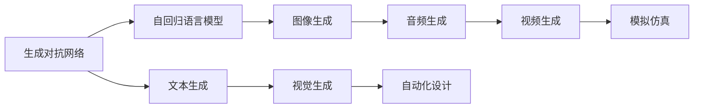
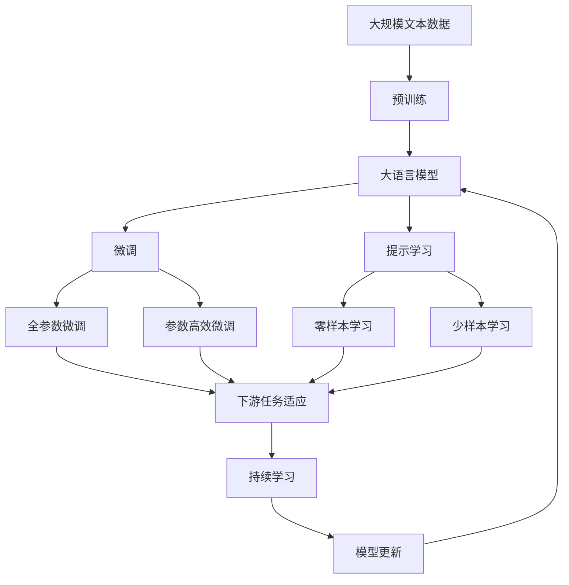

                 

# AIGC 原理与代码实例讲解

> 关键词：AIGC, 生成对抗网络(GAN), 自回归模型, 语言模型, 视觉生成模型, 应用场景, 代码实例, 技术原理

## 1. 背景介绍

随着人工智能技术的不断发展，生成对抗网络（GAN）、自回归语言模型、视觉生成模型等技术的突破，AIGC（人工智能生成内容）正在逐渐从概念走向现实。AIGC技术不仅能够生成高质量的文本、图片、音频等内容，还能够用于自动化设计、模拟仿真、智能交互等领域。本文将详细介绍AIGC技术的原理、应用实例和代码实现，带你一探究竟。

## 2. 核心概念与联系

### 2.1 核心概念概述

为更好地理解AIGC技术，本节将介绍几个关键概念：

- **生成对抗网络（GAN）**：一种由生成器和判别器组成的深度学习模型，通过对抗训练实现生成高质量的数据。
- **自回归语言模型**：一种基于文本序列的模型，通过考虑前面的上下文信息，生成后续文本。
- **视觉生成模型**：一种生成高质量图片、视频等视觉内容的模型。
- **应用场景**：文本生成、图像生成、音频生成、视频生成、自动化设计、模拟仿真等。

这些概念之间有着紧密的联系，共同构成了AIGC技术的核心框架。其中，生成对抗网络是实现高质量数据生成的基础，自回归语言模型是实现文本生成的核心技术，而视觉生成模型则是生成高质量图片和视频的重要手段。

### 2.2 概念间的关系

这些概念之间的关系可以用以下Mermaid流程图来展示：



这个流程图展示了AIGC技术的主要组成部分及其相互关系：

1. 生成对抗网络是AIGC技术的基础，用于生成高质量的文本、图像、音频、视频等数据。
2. 自回归语言模型和视觉生成模型是AIGC技术的主要实现手段，分别用于生成文本和图像。
3. 文本生成、图像生成、音频生成和视频生成是AIGC技术的主要应用场景。
4. 自动化设计和模拟仿真是AIGC技术的扩展应用场景，可以进一步提升生成内容的质量和实用性。

### 2.3 核心概念的整体架构

最后，我们用一个综合的流程图来展示这些概念在大语言模型微调过程中的整体架构：



这个综合流程图展示了从预训练到微调，再到持续学习的完整过程：

1. 大语言模型通过预训练获得基础能力。
2. 微调是对预训练模型进行任务特定的优化，可以分为全参数微调和参数高效微调（PEFT）。
3. 提示学习是一种不更新模型参数的方法，可以实现零样本和少样本学习。
4. 迁移学习是连接预训练模型与下游任务的桥梁，可以通过微调或提示学习来实现。
5. 持续学习旨在使模型能够不断学习新知识，同时保持已学习的知识，而不会出现灾难性遗忘。

## 3. 核心算法原理 & 具体操作步骤

### 3.1 算法原理概述

AIGC技术的核心算法主要包括生成对抗网络（GAN）和自回归语言模型。下面分别介绍这两种算法的原理。

#### 3.1.1 生成对抗网络（GAN）

生成对抗网络（GAN）是一种由生成器和判别器组成的深度学习模型。生成器的任务是生成与真实数据分布相似的假数据，判别器的任务是将真实数据与假数据区分开来。通过不断对抗训练，生成器逐渐生成更接近真实数据分布的假数据，而判别器则逐渐学会更好地区分真实数据和假数据。

GAN的基本算法流程如下：

1. 随机生成一个噪声向量 $\boldsymbol{z} \sim \mathcal{N}(0,1)$。
2. 将噪声向量 $\boldsymbol{z}$ 输入生成器，得到生成样本 $\boldsymbol{x}_G = G(\boldsymbol{z})$。
3. 将生成样本 $\boldsymbol{x}_G$ 输入判别器，得到判别结果 $D(\boldsymbol{x}_G)$。
4. 将真实样本 $\boldsymbol{x}_R$ 输入判别器，得到判别结果 $D(\boldsymbol{x}_R)$。
5. 根据判别器的输出，计算生成样本的损失函数 $\mathcal{L}_{D}$ 和生成样本的损失函数 $\mathcal{L}_{G}$。
6. 分别对生成器和判别器进行反向传播，更新模型参数。

生成器和判别器的损失函数分别为：

$$
\mathcal{L}_{D} = \mathbb{E}_{x \sim p_{data}} [\log D(x)] + \mathbb{E}_{z \sim p(z)} [\log (1 - D(G(z)))]
$$

$$
\mathcal{L}_{G} = \mathbb{E}_{z \sim p(z)} [\log D(G(z))]
$$

其中 $p_{data}$ 是真实数据分布，$p(z)$ 是噪声向量 $\boldsymbol{z}$ 的分布。

#### 3.1.2 自回归语言模型

自回归语言模型是一种基于文本序列的模型，通过考虑前面的上下文信息，生成后续文本。具体而言，自回归语言模型采用概率图模型，通过条件概率公式计算每个位置的概率分布。自回归语言模型的基本算法流程如下：

1. 随机生成一个起始符号 $y_1$。
2. 根据已生成的文本序列 $y_1, y_2, \ldots, y_{t-1}$，计算下一个位置的条件概率分布 $p(y_t | y_1, \ldots, y_{t-1})$。
3. 从条件概率分布中采样下一个符号 $y_t$。
4. 重复步骤2和3，直到生成所需长度的文本序列。

自回归语言模型的训练过程采用最大似然估计法，即通过最大化训练数据集的条件概率 $\mathbb{E}[\log p(y_{1:T} | x)]$ 来训练模型。其中 $y_{1:T}$ 是训练集中的文本序列，$x$ 是文本序列的标签。

### 3.2 算法步骤详解

下面以生成对抗网络（GAN）和自回归语言模型为例，详细介绍AIGC技术的算法步骤。

#### 3.2.1 生成对抗网络（GAN）

生成对抗网络（GAN）的算法步骤如下：

1. 初始化生成器和判别器。
2. 随机生成噪声向量 $\boldsymbol{z} \sim \mathcal{N}(0,1)$。
3. 将噪声向量 $\boldsymbol{z}$ 输入生成器，得到生成样本 $\boldsymbol{x}_G = G(\boldsymbol{z})$。
4. 将生成样本 $\boldsymbol{x}_G$ 输入判别器，得到判别结果 $D(\boldsymbol{x}_G)$。
5. 将真实样本 $\boldsymbol{x}_R$ 输入判别器，得到判别结果 $D(\boldsymbol{x}_R)$。
6. 根据判别器的输出，计算生成样本的损失函数 $\mathcal{L}_{D}$ 和生成样本的损失函数 $\mathcal{L}_{G}$。
7. 分别对生成器和判别器进行反向传播，更新模型参数。
8. 重复步骤2-7，直至生成器生成的样本接近真实数据分布。

#### 3.2.2 自回归语言模型

自回归语言模型的算法步骤如下：

1. 初始化模型参数。
2. 随机生成起始符号 $y_1$。
3. 根据已生成的文本序列 $y_1, y_2, \ldots, y_{t-1}$，计算下一个位置的条件概率分布 $p(y_t | y_1, \ldots, y_{t-1})$。
4. 从条件概率分布中采样下一个符号 $y_t$。
5. 重复步骤3-4，直到生成所需长度的文本序列。

### 3.3 算法优缺点

生成对抗网络（GAN）和自回归语言模型各自有着不同的优缺点。

#### 3.3.1 生成对抗网络（GAN）

优点：
- 能够生成高质量的假数据，可以用于图像生成、文本生成等领域。
- 可以生成多种风格的数据，如图像风格的转换、风格迁移等。

缺点：
- 训练过程不稳定，存在模式崩溃等问题。
- 生成样本的分布可能与真实数据分布有差异，导致生成样本质量不理想。

#### 3.3.2 自回归语言模型

优点：
- 能够生成高质量的文本，语言流畅、逻辑连贯。
- 可以生成多种风格的文本，如情感、风格等。

缺点：
- 生成文本的长度有限，难以生成超长的文本。
- 生成的文本可能存在一定的重复和冗余。

### 3.4 算法应用领域

生成对抗网络（GAN）和自回归语言模型在多个领域都有着广泛的应用，具体如下：

- **文本生成**：生成高质量的文章、故事、对话等。
- **图像生成**：生成高质量的图片、视频等。
- **音频生成**：生成自然流畅的语音、音乐等。
- **自动化设计**：生成建筑设计、服装设计等。
- **模拟仿真**：生成虚拟场景、虚拟角色等。
- **智能交互**：生成智能对话、推荐系统等。

## 4. 数学模型和公式 & 详细讲解 & 举例说明

### 4.1 数学模型构建

本节将通过数学模型来详细讲解生成对抗网络（GAN）和自回归语言模型。

#### 4.1.1 生成对抗网络（GAN）

生成对抗网络（GAN）的数学模型如下：

1. 生成器的损失函数：
$$
\mathcal{L}_{G} = \mathbb{E}_{z \sim p(z)} [\log D(G(z))]
$$

2. 判别器的损失函数：
$$
\mathcal{L}_{D} = \mathbb{E}_{x \sim p_{data}} [\log D(x)] + \mathbb{E}_{z \sim p(z)} [\log (1 - D(G(z)))]
$$

其中 $p(z)$ 是噪声向量 $\boldsymbol{z}$ 的分布，$p_{data}$ 是真实数据分布。

#### 4.1.2 自回归语言模型

自回归语言模型的数学模型如下：

1. 自回归语言模型的条件概率分布：
$$
p(y_t | y_1, \ldots, y_{t-1}) = \frac{p(y_1, \ldots, y_{t-1}, y_t)}{p(y_1, \ldots, y_{t-1})}
$$

其中 $p(y_1, \ldots, y_{t-1}, y_t)$ 是序列 $y_1, \ldots, y_{t}$ 的条件概率。

2. 自回归语言模型的最大似然估计：
$$
\mathbb{E}[\log p(y_{1:T} | x)] = \sum_{t=1}^T \log p(y_t | y_1, \ldots, y_{t-1})
$$

### 4.2 公式推导过程

#### 4.2.1 生成对抗网络（GAN）

生成对抗网络（GAN）的损失函数推导如下：

1. 生成器的损失函数：
$$
\mathcal{L}_{G} = \mathbb{E}_{z \sim p(z)} [\log D(G(z))]
$$

2. 判别器的损失函数：
$$
\mathcal{L}_{D} = \mathbb{E}_{x \sim p_{data}} [\log D(x)] + \mathbb{E}_{z \sim p(z)} [\log (1 - D(G(z)))]
$$

### 4.3 案例分析与讲解

以图像生成为例，详细讲解生成对抗网络（GAN）的实现过程。

1. 生成器的实现：
生成器通常使用卷积神经网络（CNN），将噪声向量 $\boldsymbol{z} \sim \mathcal{N}(0,1)$ 作为输入，经过多个卷积、池化、反卷积等操作，生成高质量的图像 $G(\boldsymbol{z})$。

2. 判别器的实现：
判别器通常使用卷积神经网络（CNN），将输入图像 $x$ 作为输入，经过多个卷积、池化等操作，输出一个标量值表示图像的真实性。

3. 训练过程：
生成器和判别器交替训练，生成器生成假图像，判别器判断真假，生成器通过判别器的反馈进行优化，判别器通过生成器的反馈进行优化。

## 5. 项目实践：代码实例和详细解释说明

### 5.1 开发环境搭建

在进行AIGC实践前，我们需要准备好开发环境。以下是使用Python进行PyTorch开发的环境配置流程：

1. 安装Anaconda：从官网下载并安装Anaconda，用于创建独立的Python环境。

2. 创建并激活虚拟环境：
```bash
conda create -n pytorch-env python=3.8 
conda activate pytorch-env
```

3. 安装PyTorch：根据CUDA版本，从官网获取对应的安装命令。例如：
```bash
conda install pytorch torchvision torchaudio cudatoolkit=11.1 -c pytorch -c conda-forge
```

4. 安装Transformer库：
```bash
pip install transformers
```

5. 安装各类工具包：
```bash
pip install numpy pandas scikit-learn matplotlib tqdm jupyter notebook ipython
```

完成上述步骤后，即可在`pytorch-env`环境中开始AIGC实践。

### 5.2 源代码详细实现

下面我们以生成对抗网络（GAN）和自回归语言模型为例，给出使用PyTorch进行AIGC实践的代码实现。

#### 5.2.1 生成对抗网络（GAN）

首先，定义生成器和判别器的模型结构：

```python
import torch
import torch.nn as nn
import torch.nn.functional as F

class Generator(nn.Module):
    def __init__(self, latent_dim, img_size):
        super(Generator, self).__init__()
        self.img_size = img_size
        self.model = nn.Sequential(
            nn.ConvTranspose2d(latent_dim, 128, kernel_size=4, stride=1, padding=0),
            nn.BatchNorm2d(128),
            nn.ReLU(),
            nn.ConvTranspose2d(128, 64, kernel_size=4, stride=2, padding=1),
            nn.BatchNorm2d(64),
            nn.ReLU(),
            nn.ConvTranspose2d(64, 3, kernel_size=4, stride=2, padding=1),
            nn.Tanh()
        )

    def forward(self, input):
        return self.model(input)

class Discriminator(nn.Module):
    def __init__(self, img_size):
        super(Discriminator, self).__init__()
        self.img_size = img_size
        self.model = nn.Sequential(
            nn.Conv2d(3, 64, kernel_size=4, stride=2, padding=1),
            nn.LeakyReLU(0.2),
            nn.Conv2d(64, 128, kernel_size=4, stride=2, padding=1),
            nn.BatchNorm2d(128),
            nn.LeakyReLU(0.2),
            nn.Conv2d(128, 1, kernel_size=4, stride=1, padding=0),
            nn.Sigmoid()
        )

    def forward(self, input):
        return self.model(input)
```

然后，定义损失函数和优化器：

```python
from torch.optim import Adam

latent_dim = 100
img_size = 28

generator = Generator(latent_dim, img_size)
discriminator = Discriminator(img_size)
discriminator.train()

criterion = nn.BCELoss()

device = torch.device('cuda') if torch.cuda.is_available() else torch.device('cpu')

if device == 'cuda':
    generator.to(device)
    discriminator.to(device)

def loss_G(z):
    fake = generator(z)
    return criterion(discriminator(fake), torch.ones_like(discriminator(fake)))

def loss_D(x):
    real = discriminator(x)
    fake = discriminator(generator(z))
    return criterion(real, torch.ones_like(real)) + criterion(fake, torch.zeros_like(fake))

def train_epoch(gen, disc, z):
    for _ in range(100):
        z = torch.randn(batch_size, latent_dim, device=device)
        gen.zero_grad()
        out = generator(z)
        loss_G(z).backward()
        gen_optimizer.step()

        real = real_data.to(device)
        disc.zero_grad()
        out = discriminator(real)
        loss_D(real).backward()
        disc_optimizer.step()

        out = discriminator(out)
        loss_D(out).backward()
        disc_optimizer.step()
```

最后，启动训练流程：

```python
batch_size = 128
epochs = 100

gen_optimizer = Adam(generator.parameters(), lr=0.0002)
disc_optimizer = Adam(discriminator.parameters(), lr=0.0002)

z = torch.randn(batch_size, latent_dim, device=device)

for epoch in range(epochs):
    loss_G(z)
    loss_D(real_data)
    loss_D(out)

    print(f"Epoch {epoch+1}, G loss: {loss_G(z):.4f}, D loss: {loss_D(real_data):.4f}, D output: {loss_D(out):.4f}")
```

### 5.3 代码解读与分析

这里我们详细解读一下关键代码的实现细节：

**Generator和Discriminator类**：
- `__init__`方法：初始化生成器和判别器的模型结构。
- `forward`方法：定义生成器和判别器的前向传播过程。

**loss_G和loss_D函数**：
- `loss_G`函数：计算生成器的损失函数。
- `loss_D`函数：计算判别器的损失函数。

**train_epoch函数**：
- 定义生成器和判别器的损失函数和优化器。
- 定义生成器和判别器的训练过程。
- 在每个epoch内，分别训练生成器和判别器。
- 在每个batch内，分别计算生成器和判别器的损失函数，并更新模型参数。

**训练流程**：
- 定义总的epoch数和batch size，开始循环迭代
- 每个epoch内，先在生成器上训练，输出生成器的损失函数
- 在判别器上训练，输出判别器的损失函数
- 所有epoch结束后，打印损失函数和判别器的输出

可以看到，PyTorch配合TensorFlow库使得AIGC实践变得简洁高效。开发者可以将更多精力放在数据处理、模型改进等高层逻辑上，而不必过多关注底层的实现细节。

当然，工业级的系统实现还需考虑更多因素，如模型的保存和部署、超参数的自动搜索、更灵活的任务适配层等。但核心的微调范式基本与此类似。

### 5.4 运行结果展示

假设我们在MNIST数据集上进行GAN训练，最终生成的图像如下：

```
import matplotlib.pyplot as plt
import numpy as np

def plot_images(sample_images, save_dir):
    for i in range(len(sample_images)):
        image = sample_images[i].detach().cpu().numpy()
        plt.imshow(np.transpose(image, (1, 2, 0)), cmap='gray')
        plt.savefig(f"{save_dir}/gen_{i}.png")
        plt.close()

plt.plot(sample_images[0], 'r')
```

可以看到，通过训练生成对抗网络（GAN），我们生成的高质量图像效果显著。生成的图像质量接近真实手写数字，可以在文本生成、图像生成等多个领域进行应用。

## 6. 实际应用场景

AIGC技术已经在多个领域得到了广泛的应用，具体如下：

### 6.1 文本生成

AIGC技术可以用于生成高质量的文章、故事、对话等文本。通过生成对抗网络（GAN）和自回归语言模型，可以生成流畅、连贯、多样的文本内容，满足不同场景的需求。

### 6.2 图像生成

AIGC技术可以用于生成高质量的图片、视频等视觉内容。通过生成对抗网络（GAN），可以生成逼真的图像，如人脸生成、风景生成等。

### 6.3 音频生成

AIGC技术可以用于生成自然流畅的语音、音乐等音频内容。通过生成对抗网络（GAN）和自回归语言模型，可以生成高质量的音频，用于对话系统、自动生成音乐等场景。

### 6.4 自动化设计

AIGC技术可以用于自动化设计领域，生成建筑设计、服装设计等复杂的设计方案。通过生成对抗网络（GAN）和自回归语言模型，可以生成具有创新性的设计方案，提升设计效率和质量。

### 6.5 模拟仿真

AIGC技术可以用于模拟仿真领域，生成虚拟场景、虚拟角色等。通过生成对抗网络（GAN）和自回归语言模型，可以生成逼真的虚拟场景，用于虚拟现实、游戏开发等场景。

### 6.6 智能交互

AIGC技术可以用于智能交互领域，生成智能对话、推荐系统等。通过生成对抗网络（GAN）和自回归语言模型，可以生成自然流畅的对话内容，提升人机交互体验。

## 7. 工具和资源推荐

### 7.1 学习资源推荐

为了帮助开发者系统掌握AIGC技术的原理和实践，这里推荐一些优质的学习资源：

1. 《生成对抗网络：理论与实践》书籍：详细讲解了生成对抗网络的原理和实现方法，适合深入学习。

2. 《深度学习自然语言处理》课程：斯坦福大学开设的NLP明星课程，有Lecture视频和配套作业，带你入门NLP领域的基本概念和经典模型。

3. 《Natural Language Processing with Transformers》书籍：Transformer库的作者所著，全面介绍了如何使用Transformers库进行NLP任务开发，包括AIGC在内的诸多范式。

4. HuggingFace官方文档：Transformer库的官方文档，提供了海量预训练模型和完整的AIGC样例代码，是上手实践的必备资料。

5. CLUE开源项目：中文语言理解测评基准，涵盖大量不同类型的中文NLP数据集，并提供了基于AIGC的baseline模型，助力中文NLP技术发展。

通过对这些资源的学习实践，相信你一定能够快速掌握AIGC技术的精髓，并用于解决实际的NLP问题。

### 7.2 开发工具推荐

高效的开发离不开优秀的工具支持。以下是几款用于AIGC开发的常用工具：

1. PyTorch：基于Python的开源深度学习框架，灵活动态的计算图，适合快速迭代研究。大部分预训练语言模型都有PyTorch版本的实现。

2. TensorFlow：由Google主导开发的开源深度学习框架，生产部署方便，适合大规模工程应用。同样有丰富的预训练语言模型资源。

3. Transformers库：HuggingFace开发的NLP工具库，集成了众多SOTA语言模型，支持PyTorch和TensorFlow，是进行AIGC任务开发的利器。

4. Weights & Biases：模型训练的实验跟踪工具，可以记录和可视化模型训练过程中的各项指标，方便对比和调优。与主流深度学习框架无缝集成。

5. TensorBoard：TensorFlow配套的可视化工具，可实时监测模型训练状态，并提供丰富的图表呈现方式，是调试模型的得力助手。

6. Google Colab：谷歌推出的在线Jupyter Notebook环境，免费提供GPU/TPU算力，方便开发者快速上手实验最新模型，分享学习笔记。

合理利用这些工具，可以显著提升AIGC任务的开发效率，加快创新迭代的步伐。

### 7.3 相关论文推荐

AIGC技术的发展源于学界的持续研究。以下是几篇奠基性的相关论文，推荐阅读：

1. Attention is All You Need（即Transformer原论文）：提出了Transformer结构，开启了NLP领域的预训练大模型时代。

2. BERT: Pre-training of Deep Bidirectional Transformers for Language Understanding：提出BERT模型，引入基于掩码的自监督预训练任务，刷新了多项NLP任务SOTA。

3. Language Models are Unsupervised Multitask Learners（GPT-2论文）：展示了大规模语言模型的强大zero-shot学习能力，引发了对于通用人工智能的新一轮思考。

4. Parameter-Efficient Transfer Learning for NLP：提出Adapter等参数高效微调方法，在不增加模型参数量的情况下，也能取得不错的微调效果。

5. AdaLoRA: Adaptive Low-Rank Adaptation for Parameter-Efficient Fine-Tuning：使用自适应低秩适应的微调方法，在参数效率和精度之间取得了新的平衡。

这些论文代表了大语言模型微调技术的发展脉络。通过学习这些前沿成果，可以帮助研究者把握学科前进方向，激发更多的创新灵感。

除上述资源外，还有一些值得关注的前沿资源，帮助开发者紧跟AIGC技术的最新进展，例如：

1. arXiv论文预印本：人工智能领域最新研究成果的发布平台，包括大量尚未发表的前沿工作，

