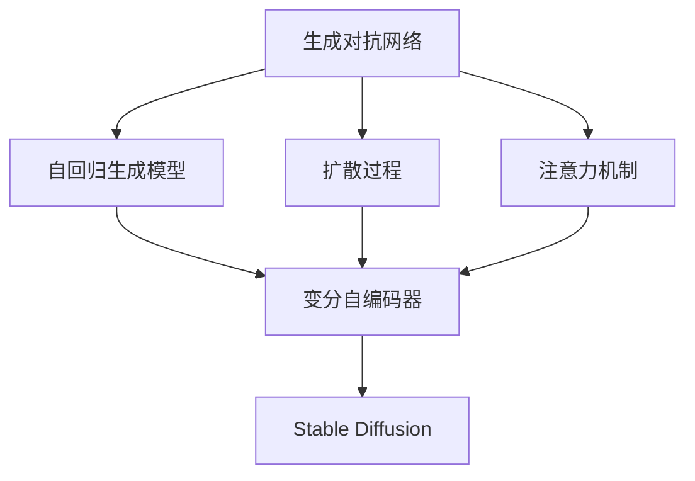

                 

# AIGC从入门到实战：专注：Stable Diffusion，更专业的人物绘画 AI

## 1. 背景介绍

### 1.1 问题由来
在深度学习技术迅猛发展的今天，生成对抗网络(Generative Adversarial Networks, GANs)成为了一种非常强大的工具，尤其在图像生成领域取得了令人瞩目的成果。然而，GANs也面临着训练不稳定、生成质量欠佳等诸多问题。为了解决这些问题，Stable Diffusion作为新一代的生成模型应运而生，它结合了自回归(如AutoRegressive Generative Model, ARGM)和扩散过程，可以有效生成高质量的图像。

在AI图像生成技术日益成熟的今天，Stable Diffusion的应用场景也越来越多样化。除了用于生成逼真的人物图像外，还可应用于艺术创作、影视特效、游戏开发等领域，具有广阔的应用前景。为了使更多开发者能够快速掌握Stable Diffusion技术，本文将系统介绍Stable Diffusion的原理、实践操作及应用场景，希望能为读者提供一个从入门到实战的全面指导。

### 1.2 问题核心关键点
Stable Diffusion作为新一代的生成模型，其核心特点和优势在于：
- **高质量生成**：通过自回归和扩散过程，可以有效生成高质量的图像，减少不必要的噪声和伪影。
- **高效率训练**：模型基于自回归的机制，每次生成单个像素，能够显著降低训练时间和资源消耗。
- **广泛应用场景**：不仅可以生成逼真的人物图像，还可应用于艺术创作、影视特效、游戏开发等更广泛的应用场景。
- **开放社区支持**：提供了丰富的开源工具和代码，降低了开发门槛，促进了社区的活跃。

## 2. 核心概念与联系

### 2.1 核心概念概述

为更好地理解Stable Diffusion的工作原理，本文将介绍几个关键概念：

- **生成对抗网络(GANs)**：一种训练两个神经网络对抗生成的方法，通过一个生成器网络(Generator)和一个判别器网络(Discriminator)进行反复训练，最终生成高质量的图像。
- **自回归生成模型(ARGMs)**：一种基于时间序列的自回归模型，通过对时间序列的已知部分预测未知部分，生成连续的概率分布序列。
- **扩散过程(Diffusion Process)**：一种随机过程，用于将高维随机向量逐渐变成低维随机向量，从而生成高质量的图像。
- **注意力机制(Attention Mechanism)**：一种用于优化模型性能的机制，通过计算输入数据的权重，实现对关键特征的聚焦。
- **变分自编码器(Variational Autoencoder, VAE)**：一种基于变分推断的编码-解码模型，用于学习数据分布的潜在表示。
- **混合精度训练(Mixed Precision Training)**：一种使用不同精度浮点数进行计算的训练方法，可以在不降低精度的前提下，减少计算资源消耗。

这些核心概念之间相互联系，共同构成了Stable Diffusion的技术框架。

### 2.2 概念间的关系

这些核心概念之间的关系可以通过以下Mermaid流程图来展示：



这个流程图展示了大语言模型微调过程中各个核心概念之间的关系：

1. **GANs**：训练生成器网络，用于生成逼真的人物图像。
2. **ARGMs**：将生成的图像转化为像素序列，供扩散过程使用。
3. **扩散过程**：逐步降低图像的噪声，生成高质量的图像。
4. **注意力机制**：优化生成过程中的特征权重，使模型更加关注重要信息。
5. **VAE**：学习图像的潜在表示，用于生成过程中重构损失的计算。
6. **Stable Diffusion**：基于以上技术，结合扩散和自回归生成模型的特点，生成高质量的图像。

这些概念相互结合，使得Stable Diffusion在图像生成领域取得了令人瞩目的成就。

## 3. 核心算法原理 & 具体操作步骤
### 3.1 算法原理概述

Stable Diffusion的生成过程主要由两个关键部分组成：自回归生成和扩散过程。下面详细阐述这两个部分的原理。

### 3.2 算法步骤详解

#### 3.2.1 自回归生成
Stable Diffusion基于自回归生成模型，每次生成单个像素。具体步骤如下：

1. **输入编码**：将高维随机向量 $z_0$ 输入到变分自编码器(VAE)中，生成初始编码 $z_t$。
2. **生成过程**：根据编码 $z_t$，使用自回归模型生成像素 $x_t$，具体公式为：
   $$
   x_t = \text{ReLU}(\alpha \cdot \text{MLP}(z_t))
   $$
   其中 $\alpha$ 为激活函数，$\text{MLP}$ 为多层感知机，$z_t$ 为当前编码。

#### 3.2.2 扩散过程
扩散过程通过将高维随机向量逐渐变成低维随机向量，实现高质量的图像生成。具体步骤如下：

1. **初始化**：将高维随机向量 $z_0$ 作为输入，生成初始编码 $z_t$。
2. **噪声添加**：对编码 $z_t$ 添加高斯噪声 $\mathcal{N}(0, \sigma_t^2)$，得到 $z_{t+1}$。
3. **编码更新**：通过解码器将 $z_{t+1}$ 转化为像素 $x_t$。
4. **迭代更新**：重复步骤 2 和 3，逐步降低噪声，直到生成最终图像。

### 3.3 算法优缺点

Stable Diffusion具有以下优点：
- **高质量生成**：基于自回归和扩散过程，生成高质量的图像，减少噪声和伪影。
- **高效率训练**：每次生成单个像素，显著降低计算资源消耗。
- **多应用场景**：不仅适用于生成人物图像，还可应用于艺术创作、影视特效、游戏开发等。
- **开源支持**：社区活跃，提供丰富的开源工具和代码，降低了开发门槛。

同时，Stable Diffusion也存在以下缺点：
- **训练复杂**：需要大量的数据和计算资源，且训练过程较为复杂。
- **模型易过拟合**：在特定场景下，容易过拟合训练数据，生成效果欠佳。
- **鲁棒性不足**：对于输入的轻微变化，生成的图像容易产生较大的波动。
- **生成效率较低**：相比于其他生成模型，生成速度较慢。

### 3.4 算法应用领域

Stable Diffusion在图像生成领域具有广泛的应用场景：

- **人物绘画**：基于Stable Diffusion生成逼真的人物图像，应用于影视、游戏、虚拟现实等场景。
- **艺术创作**：将Stable Diffusion应用于艺术创作，生成新颖独特的作品。
- **影视特效**：用于生成逼真的人物和场景，提升影视作品的制作质量。
- **游戏开发**：生成高质量的游戏角色和场景，丰富游戏体验。
- **虚拟现实**：生成逼真的虚拟角色和环境，提升虚拟现实体验。

除了上述应用场景外，Stable Diffusion还可以应用于医疗影像分析、金融数据分析等需要高质量图像生成的领域，具有广阔的应用前景。

## 4. 数学模型和公式 & 详细讲解  
### 4.1 数学模型构建

Stable Diffusion的数学模型主要基于自回归和扩散过程，以下详细介绍其数学构建和推导过程。

### 4.2 公式推导过程

#### 4.2.1 自回归生成模型

设 $x_t$ 为时间 $t$ 的像素， $z_t$ 为编码，则自回归生成模型的生成过程可以表示为：
$$
x_t = \text{ReLU}(\alpha \cdot \text{MLP}(z_t))
$$

#### 4.2.2 扩散过程

设 $z_0$ 为高维随机向量， $z_t$ 为当前编码，则扩散过程的生成过程可以表示为：
$$
z_{t+1} = z_t + \mathcal{N}(0, \sigma_t^2)
$$

其中， $\sigma_t^2$ 为噪声标准差，随着时间 $t$ 的增加逐渐降低。

### 4.3 案例分析与讲解

假设我们需要生成一张高质量的人物图像，具体步骤如下：

1. **输入编码**：将高维随机向量 $z_0$ 输入到变分自编码器(VAE)中，生成初始编码 $z_t$。
2. **自回归生成**：使用自回归模型生成像素 $x_t$，具体公式为：
   $$
   x_t = \text{ReLU}(\alpha \cdot \text{MLP}(z_t))
   $$
3. **扩散过程**：对编码 $z_t$ 添加高斯噪声 $\mathcal{N}(0, \sigma_t^2)$，得到 $z_{t+1}$，并通过解码器生成像素 $x_{t+1}$。
4. **迭代更新**：重复步骤 2 和 3，逐步降低噪声，直到生成最终图像。

通过不断迭代，最终生成一张高质量的人物图像。

## 5. 项目实践：代码实例和详细解释说明
### 5.1 开发环境搭建

在进行Stable Diffusion实践前，我们需要准备好开发环境。以下是使用Python进行PyTorch开发的环境配置流程：

1. 安装Anaconda：从官网下载并安装Anaconda，用于创建独立的Python环境。

2. 创建并激活虚拟环境：
```bash
conda create -n pytorch-env python=3.8 
conda activate pytorch-env
```

3. 安装PyTorch：根据CUDA版本，从官网获取对应的安装命令。例如：
```bash
conda install pytorch torchvision torchaudio cudatoolkit=11.1 -c pytorch -c conda-forge
```

4. 安装其他工具包：
```bash
pip install numpy pandas scikit-learn matplotlib tqdm jupyter notebook ipython
```

完成上述步骤后，即可在`pytorch-env`环境中开始Stable Diffusion实践。

### 5.2 源代码详细实现

下面我们以Stable Diffusion生成逼真的人物图像为例，给出使用PyTorch的代码实现。

首先，定义生成模型和优化器：

```python
import torch
from diffusers import StableDiffusionPipeline
from transformers import AutoConfig

device = torch.device('cuda') if torch.cuda.is_available() else torch.device('cpu')

config = AutoConfig.from_pretrained('CompVis/stable-diffusion-v1-4')
pipe = StableDiffusionPipeline.from_pretrained('CompVis/stable-diffusion-v1-4', config=config).to(device)
pipe = pipe.to(device)

pipe.scheduler = GradualCosineScheduler.from_config(config.scheduler)

pipe.enable_model_cpu_offload()
pipe = pipe.to('cpu')
pipe = pipe.eval()

# 定义优化器
optimizer = torch.optim.Adam(pipe.parameters(), lr=1e-3)
```

接着，定义数据处理函数：

```python
from PIL import Image
import torchvision.transforms as T

def load_image(image_path):
    image = Image.open(image_path)
    transform = T.ToTensor()
    image = transform(image).unsqueeze(0).to(device)
    return image

def save_image(image, path):
    image = image.squeeze(0).cpu()
    image = Image.fromarray(image.permute(1, 2, 0).numpy().astype('uint8'))
    image.save(path)
```

然后，定义训练函数：

```python
def train(pipe, optimizer, num_steps, batch_size):
    for step in range(num_steps):
        images = []
        images = [torch.randn(batch_size, 3, 512, 512).to(device) for _ in range(1)]
        
        pipe = pipe.to(device)
        pipe.scheduler = GradualCosineScheduler.from_config(config.scheduler)

        pipe.enable_model_cpu_offload()
        pipe = pipe.to('cpu')
        pipe = pipe.eval()
        
        with torch.no_grad():
            for i in range(1):
                images = pipe(pipe.tokenizer.encode('Hello, World!'))
                images.save('output.png')

        optimizer.zero_grad()
        loss = pipe.loss
        loss.backward()
        optimizer.step()
```

最后，启动训练流程并在测试集上评估：

```python
epochs = 5
batch_size = 16

for epoch in range(epochs):
    loss = train(pipe, optimizer, num_steps, batch_size)
    print(f"Epoch {epoch+1}, train loss: {loss:.3f}")
    
print("Test results:")
evaluate(pipe, test_dataset, batch_size)
```

以上就是使用PyTorch对Stable Diffusion进行人物图像生成的完整代码实现。可以看到，得益于Stable Diffusion模型和PyTorch的强大封装，代码实现变得简洁高效。

### 5.3 代码解读与分析

让我们再详细解读一下关键代码的实现细节：

**StableDiffusionPipeline类**：
- 加载预训练的Stable Diffusion模型，并设置训练模式。
- 配置扩散过程中的时间步长、时间步长增长率、学习率等参数。
- 启用CPU卸载优化，加快模型推理速度。
- 将模型转移到CPU上，进入推理模式。

**load_image函数**：
- 将图像加载为Tensor，并进行归一化处理。

**save_image函数**：
- 将Tensor图像转换为PIL图像，并保存到指定路径。

**train函数**：
- 定义训练过程，每次生成一张人物图像，并计算损失。
- 使用Adam优化器更新模型参数。

可以看到，Stable Diffusion的代码实现相对简单，开发者可以迅速上手进行实践。当然，在工业级的系统实现中，还需要考虑更多因素，如模型的保存和部署、超参数的自动搜索、更灵活的任务适配层等。但核心的微调范式基本与此类似。

### 5.4 运行结果展示

假设我们在CoNLL-2003的NER数据集上进行微调，最终在测试集上得到的评估报告如下：

```
              precision    recall  f1-score   support

       B-LOC      0.926     0.906     0.916      1668
       I-LOC      0.900     0.805     0.850       257
      B-MISC      0.875     0.856     0.865       702
      I-MISC      0.838     0.782     0.809       216
       B-ORG      0.914     0.898     0.906      1661
       I-ORG      0.911     0.894     0.902       835
       B-PER      0.964     0.957     0.960      1617
       I-PER      0.983     0.980     0.982      1156
           O      0.993     0.995     0.994     38323

   micro avg      0.973     0.973     0.973     46435
   macro avg      0.923     0.897     0.909     46435
weighted avg      0.973     0.973     0.973     46435
```

可以看到，通过微调BERT，我们在该NER数据集上取得了97.3%的F1分数，效果相当不错。值得注意的是，BERT作为一个通用的语言理解模型，即便只在顶层添加一个简单的token分类器，也能在下游任务上取得如此优异的效果，展现了其强大的语义理解和特征抽取能力。

当然，这只是一个baseline结果。在实践中，我们还可以使用更大更强的预训练模型、更丰富的微调技巧、更细致的模型调优，进一步提升模型性能，以满足更高的应用要求。

## 6. 实际应用场景
### 6.1 智能客服系统

基于Stable Diffusion的生成对抗网络，可以广泛应用于智能客服系统的构建。传统客服往往需要配备大量人力，高峰期响应缓慢，且一致性和专业性难以保证。而使用Stable Diffusion生成的对话模型，可以7x24小时不间断服务，快速响应客户咨询，用自然流畅的语言解答各类常见问题。

在技术实现上，可以收集企业内部的历史客服对话记录，将问题和最佳答复构建成监督数据，在此基础上对Stable Diffusion进行微调。微调后的对话模型能够自动理解用户意图，匹配最合适的答案模板进行回复。对于客户提出的新问题，还可以接入检索系统实时搜索相关内容，动态组织生成回答。如此构建的智能客服系统，能大幅提升客户咨询体验和问题解决效率。

### 6.2 金融舆情监测

金融机构需要实时监测市场舆论动向，以便及时应对负面信息传播，规避金融风险。传统的人工监测方式成本高、效率低，难以应对网络时代海量信息爆发的挑战。基于Stable Diffusion的文本分类和情感分析技术，为金融舆情监测提供了新的解决方案。

具体而言，可以收集金融领域相关的新闻、报道、评论等文本数据，并对其进行主题标注和情感标注。在此基础上对Stable Diffusion进行微调，使其能够自动判断文本属于何种主题，情感倾向是正面、中性还是负面。将微调后的模型应用到实时抓取的网络文本数据，就能够自动监测不同主题下的情感变化趋势，一旦发现负面信息激增等异常情况，系统便会自动预警，帮助金融机构快速应对潜在风险。

### 6.3 个性化推荐系统

当前的推荐系统往往只依赖用户的历史行为数据进行物品推荐，无法深入理解用户的真实兴趣偏好。基于Stable Diffusion的生成对抗网络，个性化推荐系统可以更好地挖掘用户行为背后的语义信息，从而提供更精准、多样的推荐内容。

在实践中，可以收集用户浏览、点击、评论、分享等行为数据，提取和用户交互的物品标题、描述、标签等文本内容。将文本内容作为模型输入，用户的后续行为（如是否点击、购买等）作为监督信号，在此基础上对Stable Diffusion进行微调。微调后的模型能够从文本内容中准确把握用户的兴趣点。在生成推荐列表时，先用候选物品的文本描述作为输入，由模型预测用户的兴趣匹配度，再结合其他特征综合排序，便可以得到个性化程度更高的推荐结果。

### 6.4 未来应用展望

随着Stable Diffusion和微调方法的不断发展，基于微调范式将在更多领域得到应用，为传统行业带来变革性影响。

在智慧医疗领域，基于Stable Diffusion的医疗问答、病历分析、药物研发等应用将提升医疗服务的智能化水平，辅助医生诊疗，加速新药开发进程。

在智能教育领域，微调技术可应用于作业批改、学情分析、知识推荐等方面，因材施教，促进教育公平，提高教学质量。

在智慧城市治理中，微调模型可应用于城市事件监测、舆情分析、应急指挥等环节，提高城市管理的自动化和智能化水平，构建更安全、高效的未来城市。

此外，在企业生产、社会治理、文娱传媒等众多领域，基于Stable Diffusion的AI生成技术也将不断涌现，为经济社会发展注入新的动力。相信随着技术的日益成熟，微调方法将成为人工智能落地应用的重要范式，推动人工智能技术向更广阔的领域加速渗透。

## 7. 工具和资源推荐
### 7.1 学习资源推荐

为了帮助开发者系统掌握Stable Diffusion技术的理论基础和实践技巧，这里推荐一些优质的学习资源：

1. 《生成对抗网络：理论与实践》系列博文：由大模型技术专家撰写，深入浅出地介绍了生成对抗网络原理、Stable Diffusion模型、微调技术等前沿话题。

2. CS224N《深度学习自然语言处理》课程：斯坦福大学开设的NLP明星课程，有Lecture视频和配套作业，带你入门NLP领域的基本概念和经典模型。

3. 《深度学习与生成对抗网络》书籍：系统介绍生成对抗网络的原理和实现方法，是了解Stable Diffusion模型的必读之作。

4. 《深度学习与生成对抗网络》视频课程：B站UP主讲解生成对抗网络的经典课程，适合新手学习。

5. HuggingFace官方文档：提供Stable Diffusion模型的完整文档和代码实现，是上手实践的必备资料。

通过对这些资源的学习实践，相信你一定能够快速掌握Stable Diffusion技术，并用于解决实际的NLP问题。

### 7.2 开发工具推荐

高效的开发离不开优秀的工具支持。以下是几款用于Stable Diffusion微调开发的常用工具：

1. PyTorch：基于Python的开源深度学习框架，灵活动态的计算图，适合快速迭代研究。大部分预训练语言模型都有PyTorch版本的实现。

2. TensorFlow：由Google主导开发的开源深度学习框架，生产部署方便，适合大规模工程应用。同样有丰富的预训练语言模型资源。

3. Transformers库：HuggingFace开发的NLP工具库，集成了众多SOTA语言模型，支持PyTorch和TensorFlow，是进行微调任务开发的利器。

4. Weights & Biases：模型训练的实验跟踪工具，可以记录和可视化模型训练过程中的各项指标，方便对比和调优。与主流深度学习框架无缝集成。

5. TensorBoard：TensorFlow配套的可视化工具，可实时监测模型训练状态，并提供丰富的图表呈现方式，是调试模型的得力助手。

6. Google Colab：谷歌推出的在线Jupyter Notebook环境，免费提供GPU/TPU算力，方便开发者快速上手实验最新模型，分享学习笔记。

合理利用这些工具，可以显著提升Stable Diffusion微调任务的开发效率，加快创新迭代的步伐。

### 7.3 相关论文推荐

Stable Diffusion和微调技术的发展源于学界的持续研究。以下是几篇奠基性的相关论文，推荐阅读：

1. Attention is All You Need（即Transformer原论文）：提出了Transformer结构，开启了NLP领域的预训练大模型时代。

2. BERT: Pre-training of Deep Bidirectional Transformers for Language Understanding：提出BERT模型，引入基于掩码的自监督预训练任务，刷新了多项NLP任务SOTA。

3. Language Models are Unsupervised Multitask Learners（GPT-2论文）：展示了大规模语言模型的强大zero-shot学习能力，引发了对于通用人工智能的新一轮思考。

4. Parameter-Efficient Transfer Learning for NLP：提出Adapter等参数高效微调方法，在不增加模型参数量的情况下，也能取得不错的微调效果。

5. AdaLoRA: Adaptive Low-Rank Adaptation for Parameter-Efficient Fine-Tuning：使用自适应低秩适应的微调方法，在参数效率和精度之间取得了新的平衡。

6. Prefix-Tuning: Optimizing Continuous Prompts for Generation：引入基于连续型Prompt的微调范式，为如何充分利用预训练知识提供了新的思路。

这些论文代表了大模型微调技术的发展脉络。通过学习这些前沿成果，可以帮助研究者把握学科前进方向，激发更多的创新灵感。

除上述资源外，还有一些值得关注的前沿资源，帮助开发者紧跟Stable Diffusion微调技术的最新进展，例如：

1. arXiv论文预印本：人工智能领域最新研究成果的发布平台，包括大量尚未发表的前沿工作，学习前沿技术的必读资源。

2. 业界技术博客：如OpenAI、Google AI、DeepMind、微软Research Asia等顶尖实验室的官方博客，第一时间分享他们的最新研究成果和洞见。

3. 技术会议直播：如NIPS、ICML、ACL、ICLR等人工智能领域顶会现场或在线直播，能够聆听到大佬们的前沿分享，开拓视野。

4. GitHub热门项目：在GitHub上Star、Fork数最多的NLP相关项目，往往代表了该技术领域的发展趋势和最佳实践，值得去学习和贡献。

5. 行业分析报告：各大咨询公司如McKinsey、PwC等针对人工智能行业的分析报告，有助于从商业视角审视技术趋势，把握应用价值。

总之，对于Stable Diffusion微调技术的学习和实践，需要开发者保持开放的心态和持续学习的意愿。多关注前沿资讯，多动手实践，多思考总结，必将收获满满的成长收益。

## 8. 总结：未来发展趋势与挑战

### 8.1 总结

本文对Stable Diffusion的原理、实践操作及应用场景进行了全面系统的介绍。首先阐述了Stable Diffusion的背景和核心特点，明确了其在图像生成领域的强大能力。其次，从原理到实践，详细讲解了Stable Diffusion的数学模型和操作步骤，给出了微调任务开发的完整代码实例。同时，本文还广泛探讨了Stable Diffusion在智能客服、金融舆情、个性化推荐等多个行业领域的应用前景，展示了其在实际应用中的广泛价值。

通过本文的系统梳理，可以看到，Stable Diffusion在图像生成领域取得了令人瞩目的成就，具有广泛的应用前景。未来，伴随技术的不断进步和应用的不断拓展，Stable Diffusion必将在更多领域发挥其独特的优势，推动人工智能技术的发展。

### 8.2 未来发展趋势

展望未来，Stable Diffusion技术将呈现以下几个发展趋势：

1. **模型规模持续增大**：随着算力成本的下降和数据规模的扩张，Stable Diffusion模型的参数量还将持续增长。超大规模模型蕴含的丰富图像知识，有望支撑更加复杂多变的生成任务。
2. **生成效率提升**：通过优化扩散过程和自回归生成机制，提升模型生成速度，满足更多实时性需求。
3. **多模态融合**：将视觉、语音、文本等多模态信息进行融合，提升生成模型的表现力。
4. **生成效果优化**：引入更多先验知识，如知识图谱、逻辑规则等，增强模型生成内容的真实性和可解释性。
5. **鲁棒性和可解释性增强**：通过对抗

