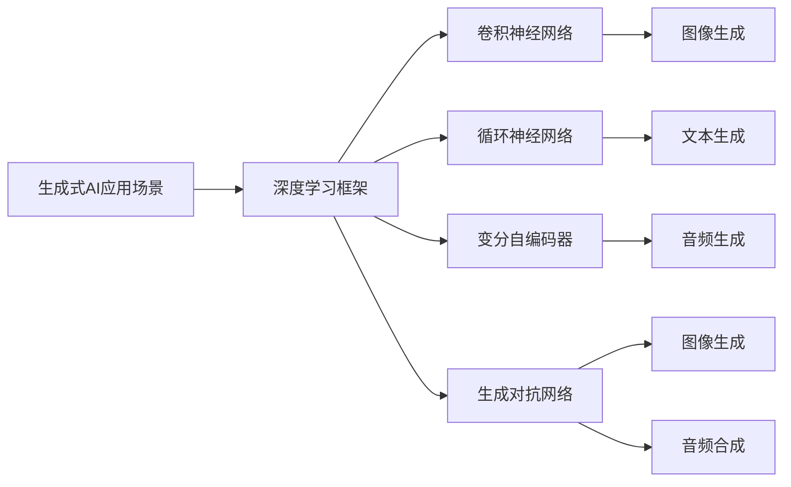
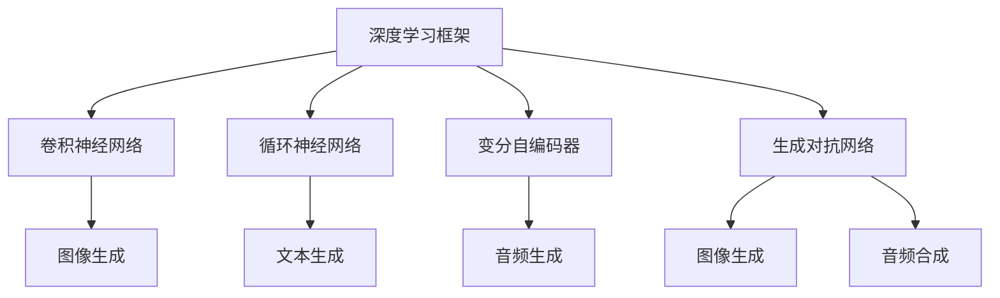
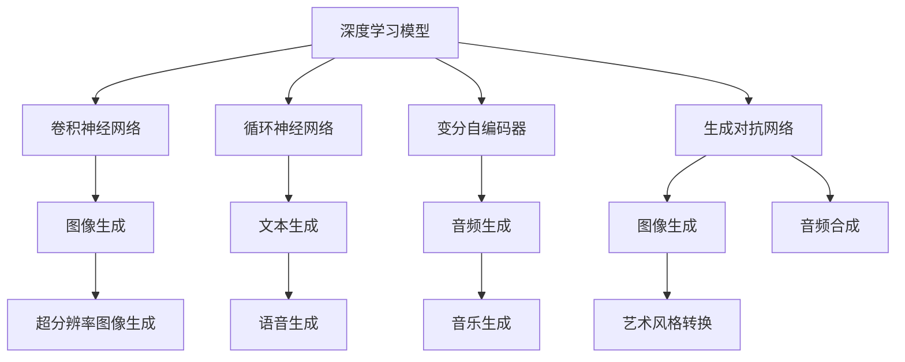
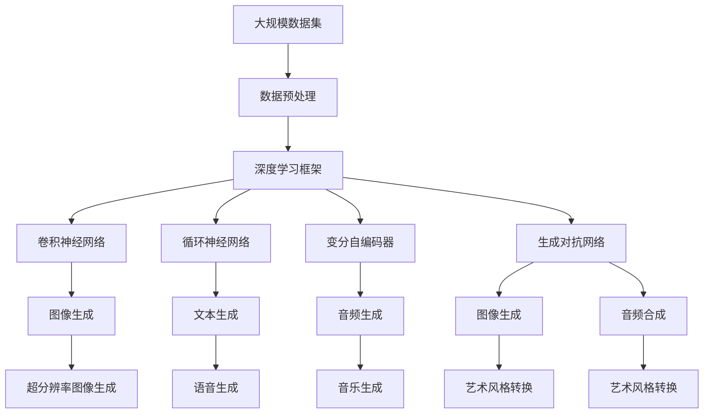
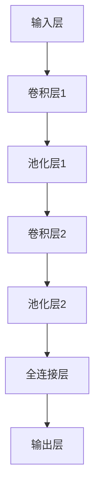
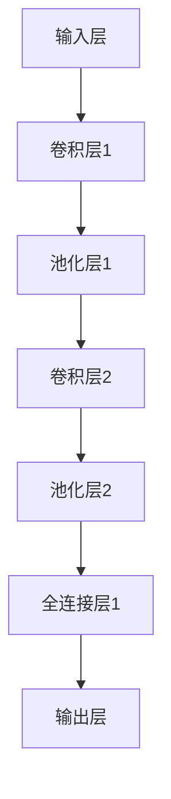

                 

# AIGC从入门到实战：关于个人

## 1. 背景介绍

### 1.1 问题由来
随着人工智能技术的快速发展，生成式人工智能(AIGC)正逐渐成为业界的新宠。其核心在于使用机器学习模型，能够生成高度逼真的文本、音频、视频、图像等内容，广泛应用于内容创作、影视制作、游戏开发等多个领域。生成式AI的成功不仅依赖于模型训练的硬实力，更离不开数据的积累和场景的创新。个人开发者如何从入门到实战，构建属于自己的生成式AI系统？本文将从个人用户和开发者的角度出发，探讨AIGC的深度学习原理和应用实践。

### 1.2 问题核心关键点
生成式AI的实现主要依赖于深度学习模型，尤其是卷积神经网络(CNN)、循环神经网络(RNN)、变分自编码器(VAE)、生成对抗网络(GAN)等。其核心过程包括：

1. 数据预处理：清洗、扩充、标注数据集，为模型训练做准备。
2. 模型构建：选择合适的深度学习框架，搭建生成模型。
3. 模型训练：在准备好的数据集上训练模型，调整超参数，优化损失函数。
4. 模型评估：在验证集上评估模型性能，确保模型泛化能力。
5. 模型微调：通过调整模型结构、优化参数，提升模型表现。
6. 应用部署：将训练好的模型部署到实际场景中，进行实际应用。

AIGC的成功不仅依赖于模型的训练，还需要对数据集、算法、场景进行全方位的思考和实践。本文将从AIGC的技术框架、学习资源、应用场景等方面进行详细介绍，帮助个人开发者从入门到实战。

### 1.3 问题研究意义
AIGC技术在个人生活中的应用范围广泛，能够显著提升内容生成、数据分析、智能推荐等领域的效率和效果。例如：

1. 内容创作：个人可以借助AIGC技术自动生成高质量文本、图片，极大降低创作成本。
2. 影视制作：个人开发者可以通过AIGC生成逼真的场景、人物、对话，提升视频制作的效率和质量。
3. 数据分析：生成式AI可以从大量数据中自动提取特征，进行智能分类、聚类、预测等分析。
4. 智能推荐：AIGC可以根据用户行为，自动生成个性化推荐列表，提升用户体验。

个人开发者掌握AIGC技术，将能够更好地适应和引领数字时代的发展，为AI技术的应用注入新的活力。本文旨在帮助读者系统掌握AIGC的原理和应用方法，提升个人开发者在生成式AI领域的竞争力。

## 2. 核心概念与联系

### 2.1 核心概念概述

为更好地理解AIGC的技术原理和应用方法，本节将介绍几个核心概念：

- 生成式人工智能(AIGC)：利用深度学习模型，自动生成逼真、有用的文本、音频、图像等内容的技术。
- 深度学习框架：如TensorFlow、PyTorch等，提供深度学习模型的搭建、训练、部署等工具。
- 卷积神经网络(CNN)：常用于图像生成、分类任务，通过卷积操作提取空间特征。
- 循环神经网络(RNN)：常用于序列数据处理，如文本生成、语音合成等，通过循环结构捕捉时间依赖。
- 变分自编码器(VAE)：用于生成连续型数据，如文本、音频，通过编码器-解码器结构，学习数据的隐变量表示。
- 生成对抗网络(GAN)：由生成器和判别器组成，通过对抗训练生成逼真数据，常用于图像生成、音频合成等任务。

这些概念之间的逻辑关系可以通过以下Mermaid流程图来展示：

```mermaid
graph TB
    A[生成式人工智能(AIGC)] --> B[深度学习框架]
    B --> C[卷积神经网络]
    B --> D[循环神经网络]
    B --> E[变分自编码器]
    B --> F[生成对抗网络]
    C --> G[图像生成]
    D --> H[文本生成]
    E --> I[音频生成]
    F --> J[图像生成]
    F --> K[音频合成]
```

这个流程图展示了生成式AI涉及的核心技术及其应用领域：

1. AIGC通过深度学习框架构建模型。
2. CNN用于图像生成、分类等任务。
3. RNN用于序列数据处理，如文本生成、语音合成。
4. VAE用于生成连续型数据，如文本、音频。
5. GAN用于生成逼真数据，如图像生成、音频合成。

这些概念共同构成了生成式AI的核心框架，使其能够生成高质量、逼真的内容，应用于各种场景。通过理解这些核心概念，我们可以更好地把握生成式AI的工作原理和优化方向。

### 2.2 概念间的关系

这些核心概念之间存在着紧密的联系，形成了AIGC的应用生态系统。下面我们通过几个Mermaid流程图来展示这些概念之间的关系。

#### 2.2.1 技术范式选择



这个流程图展示了选择深度学习模型时，不同框架、算法和技术之间的应用场景。例如，CNN适用于图像生成、分类任务，RNN适用于文本生成、语音合成，VAE适用于文本、音频生成，GAN适用于图像生成、音频合成。

#### 2.2.2 技术集成



这个流程图展示了深度学习框架与不同技术之间的集成，在实际应用中，常常需要多种技术的组合才能完成复杂的生成任务。

#### 2.2.3 技术演进



这个流程图展示了深度学习模型随技术演进而不断演进的过程。例如，超分辨率图像生成、语音生成、音乐生成、艺术风格转换等都是近年来新发展起来的生成技术，它们在深度学习框架的基础上，进一步融合了多种算法和技术。

### 2.3 核心概念的整体架构

最后，我们用一个综合的流程图来展示这些核心概念在大规模AIGC系统中的整体架构：



这个综合流程图展示了从数据预处理到生成任务完成的完整过程。在大规模AIGC系统中，数据预处理是整个流程的起点，深度学习框架是技术支撑，各种深度学习模型是核心执行单元，最终生成文本、图像、音频等多模态内容。

## 3. 核心算法原理 & 具体操作步骤

### 3.1 算法原理概述

生成式AI的核心在于使用深度学习模型，从给定输入生成逼真的内容。其算法原理如下：

1. **数据预处理**：清洗、扩充、标注数据集，为模型训练做准备。
2. **模型构建**：选择合适的深度学习框架，搭建生成模型。
3. **模型训练**：在准备好的数据集上训练模型，调整超参数，优化损失函数。
4. **模型评估**：在验证集上评估模型性能，确保模型泛化能力。
5. **模型微调**：通过调整模型结构、优化参数，提升模型表现。
6. **应用部署**：将训练好的模型部署到实际场景中，进行实际应用。

### 3.2 算法步骤详解

基于深度学习的生成式AI系统构建步骤主要包括以下几个关键环节：

**Step 1: 准备数据集**
- 收集和预处理大规模数据集。对于图像生成，可以使用如CIFAR-10、ImageNet等公开数据集；对于文本生成，可以使用如Text8、维基百科等数据集。
- 清洗数据，去除噪声和错误数据，确保数据质量。
- 扩充数据，增加数据多样性，避免模型过拟合。
- 标注数据，将原始数据转换为模型需要的格式。

**Step 2: 构建模型**
- 选择合适的深度学习框架，如TensorFlow、PyTorch等。
- 搭建生成模型，如卷积神经网络(CNN)、循环神经网络(RNN)、变分自编码器(VAE)、生成对抗网络(GAN)等。
- 定义模型结构，包括卷积层、池化层、全连接层、激活函数、损失函数等。

**Step 3: 模型训练**
- 使用训练集数据，对模型进行训练。
- 调整超参数，如学习率、批大小、迭代轮数等。
- 优化损失函数，如均方误差(MSE)、交叉熵损失(Cross-Entropy Loss)等。
- 使用优化算法，如SGD、Adam等，更新模型参数。

**Step 4: 模型评估**
- 使用验证集数据，评估模型性能。
- 计算各种评估指标，如准确率、召回率、F1分数等。
- 调整模型参数，优化模型性能。

**Step 5: 模型微调**
- 针对特定任务，调整模型结构和参数。
- 使用任务数据集，进行微调训练。
- 优化任务相关的超参数，如学习率、批大小、迭代轮数等。

**Step 6: 应用部署**
- 将训练好的模型部署到实际场景中。
- 使用推理框架，如TensorFlow、PyTorch等，进行模型推理。
- 优化模型推理速度和资源占用。

### 3.3 算法优缺点

生成式AI算法具有以下优点：

1. 自动化生成内容，节省时间和人力成本。
2. 生成内容高度逼真，提升用户体验和效果。
3. 结合大数据和深度学习，生成内容具有广泛应用前景。

同时，该算法也存在以下缺点：

1. 模型训练和微调需要大量计算资源。
2. 数据质量和标注数据对模型效果影响较大。
3. 生成的内容可能存在一定的偏差和错误。

尽管存在这些缺点，但生成式AI在大规模内容生成、智能推荐、数据分析等场景下，已经展现出了巨大的应用潜力。未来随着算力和数据量的不断提升，生成式AI技术将进一步发展和完善。

### 3.4 算法应用领域

生成式AI在各个领域都有广泛的应用：

- **内容创作**：自动生成文本、图片、音频等内容，提升创作效率。
- **影视制作**：生成逼真场景、人物、对话，提升视频制作效率和质量。
- **游戏开发**：生成虚拟角色、环境、道具等，丰富游戏体验。
- **智能推荐**：根据用户行为，生成个性化推荐列表，提升用户体验。
- **数据分析**：生成高质量的特征数据，进行智能分类、聚类、预测等分析。

## 4. 数学模型和公式 & 详细讲解 & 举例说明

### 4.1 数学模型构建

生成式AI的核心数学模型包括：

1. **卷积神经网络(CNN)**：用于图像生成和分类任务。
2. **循环神经网络(RNN)**：用于序列数据处理，如文本生成、语音合成等。
3. **变分自编码器(VAE)**：用于生成连续型数据，如文本、音频。
4. **生成对抗网络(GAN)**：由生成器和判别器组成，用于生成逼真数据。

这些模型均基于神经网络的框架进行构建。以卷积神经网络为例，其结构如图：



卷积神经网络通过卷积层、池化层、全连接层、激活函数、损失函数等结构，提取图像特征并进行分类或生成。

### 4.2 公式推导过程

以下我们以卷积神经网络为例，推导其公式及其梯度计算过程。

卷积神经网络的前向传播过程如下：

$$
y=f(\sigma(g(z;W,b)))
$$

其中 $z$ 为输入数据，$W$ 为卷积核权重，$b$ 为偏置项，$g$ 为卷积操作，$f$ 为激活函数，$\sigma$ 为非线性变换。

以LeNet为例，其结构如图：



卷积层1的卷积操作公式如下：

$$
z_1=w_1*Z+b_1
$$

其中 $w_1$ 为卷积核权重，$Z$ 为输入数据，$b_1$ 为偏置项。

池化层1的池化操作公式如下：

$$
y_1=\frac{1}{n}\sum_{i=1}^{n}z_{1,i}
$$

其中 $y_1$ 为池化后的数据，$z_{1,i}$ 为卷积层1的输出数据，$n$ 为池化窗口大小。

卷积层2的卷积操作公式如下：

$$
z_2=w_2*z_1+b_2
$$

其中 $w_2$ 为卷积核权重，$z_1$ 为卷积层1的输出数据，$b_2$ 为偏置项。

池化层2的池化操作公式如下：

$$
y_2=\frac{1}{n}\sum_{i=1}^{n}z_{2,i}
$$

其中 $y_2$ 为池化后的数据，$z_{2,i}$ 为卷积层2的输出数据，$n$ 为池化窗口大小。

全连接层1的激活函数公式如下：

$$
y_3=σ(z_2*W_3+b_3)
$$

其中 $W_3$ 为全连接层的权重，$b_3$ 为偏置项，$σ$ 为激活函数，如ReLU。

输出层的激活函数公式如下：

$$
y_4=σ(y_3*W_4+b_4)
$$

其中 $W_4$ 为输出层的权重，$b_4$ 为偏置项，$σ$ 为激活函数，如Softmax。

### 4.3 案例分析与讲解

以图像生成为例，使用GAN生成逼真图像的过程如下：

1. **生成器训练**：
   - 输入噪声向量 $z$。
   - 将 $z$ 送入生成器网络 $G$。
   - 生成逼真图像 $G(z)$。
   - 计算损失函数，如均方误差。
   - 更新生成器网络 $G$ 的参数。

2. **判别器训练**：
   - 输入真实图像 $x$。
   - 将 $x$ 送入判别器网络 $D$。
   - 计算判别器输出 $D(x)$。
   - 计算损失函数，如交叉熵损失。
   - 更新判别器网络 $D$ 的参数。

3. **对抗训练**：
   - 生成器 $G$ 生成逼真图像 $G(z)$。
   - 判别器 $D$ 对 $G(z)$ 进行判别，输出 $D(G(z))$。
   - 计算对抗损失函数，如Wasserstein距离。
   - 联合优化生成器和判别器，最小化生成器的损失函数，最大化判别器的损失函数。

4. **生成测试**：
   - 输入噪声向量 $z$。
   - 将 $z$ 送入生成器网络 $G$。
   - 生成逼真图像 $G(z)$。
   - 输出生成图像 $G(z)$。

## 5. 项目实践：代码实例和详细解释说明

### 5.1 开发环境搭建

在进行生成式AI系统开发前，我们需要准备好开发环境。以下是使用Python进行TensorFlow开发的环境配置流程：

1. 安装Anaconda：从官网下载并安装Anaconda，用于创建独立的Python环境。

2. 创建并激活虚拟环境：
```bash
conda create -n tf-env python=3.8 
conda activate tf-env
```

3. 安装TensorFlow：根据CUDA版本，从官网获取对应的安装命令。例如：
```bash
conda install tensorflow=2.7 -c conda-forge -c pytorch
```

4. 安装TensorFlow Addons：用于支持更多深度学习模型和算法。
```bash
pip install tensorboard
```

5. 安装各类工具包：
```bash
pip install numpy pandas scikit-learn matplotlib tqdm jupyter notebook ipython
```

完成上述步骤后，即可在`tf-env`环境中开始生成式AI系统开发。

### 5.2 源代码详细实现

下面我们以GAN生成逼真图像为例，给出使用TensorFlow搭建生成模型的PyTorch代码实现。

首先，定义GAN模型：

```python
import tensorflow as tf
from tensorflow.keras import layers

class Generator(tf.keras.Model):
    def __init__(self, latent_dim, img_shape):
        super(Generator, self).__init__()
        self.img_shape = img_shape
        self.model = self.build_model(latent_dim)
        
    def build_model(self, latent_dim):
        model = tf.keras.Sequential([
            layers.Dense(128*8*8, input_shape=(latent_dim,)),
            layers.Reshape((8, 8, 128)),
            layers.Conv2DTranspose(128, (4, 4), strides=(2, 2), padding='same'),
            layers.BatchNormalization(),
            layers.LeakyReLU(0.2),
            layers.Conv2DTranspose(64, (4, 4), strides=(2, 2), padding='same'),
            layers.BatchNormalization(),
            layers.LeakyReLU(0.2),
            layers.Conv2DTranspose(3, (4, 4), strides=(2, 2), padding='same', activation='sigmoid')
        ])
        return model
        
class Discriminator(tf.keras.Model):
    def __init__(self, img_shape):
        super(Discriminator, self).__init__()
        self.img_shape = img_shape
        self.model = self.build_model(img_shape)
        
    def build_model(self, img_shape):
        model = tf.keras.Sequential([
            layers.Conv2D(64, (4, 4), strides=(2, 2), padding='same', input_shape=img_shape),
            layers.LeakyReLU(0.2),
            layers.Dropout(0.3),
            layers.Conv2D(128, (4, 4), strides=(2, 2), padding='same'),
            layers.LeakyReLU(0.2),
            layers.Dropout(0.3),
            layers.Flatten(),
            layers.Dense(1, activation='sigmoid')
        ])
        return model
```

然后，定义训练函数：

```python
import numpy as np

def train_gan(generator, discriminator, latent_dim, img_shape, epochs, batch_size, learning_rate):
    def generate_latent_points(batch_size, latent_dim):
        return np.random.normal(size=(batch_size, latent_dim))
    
    def train_step_generator(generator, discriminator, latent_points):
        with tf.GradientTape() as gen_tape, tf.GradientTape() as disc_tape:
            latent_points = latent_points
            fake_images = generator(latent_points)
            disc_loss_real = discriminator.train_on_batch(fake_images, real_images)
            disc_loss_fake = discriminator.train_on_batch(fake_images, fake_images)
            gen_loss = tf.reduce_mean(disc_loss_fake)
        gen_gradients = gen_tape.gradient(gen_loss, generator.trainable_variables)
        disc_gradients = disc_tape.gradient(disc_loss_real + disc_loss_fake, discriminator.trainable_variables)
        generator.trainable_variables[0].assign(tf.add(gen_gradients, generator.trainable_variables[0]))
        discriminator.trainable_variables[0].assign(tf.add(disc_gradients, discriminator.trainable_variables[0]))
    
    real_images = tf.random.normal(shape=(batch_size, *img_shape))
    fake_images = generator.generate_latent_points(batch_size, latent_dim)
    discriminator.train_on_batch(real_images, real_images)
    discriminator.train_on_batch(fake_images, fake_images)
    train_step_generator(generator, discriminator, latent_points)
```

最后，启动训练流程：

```python
generator = Generator(latent_dim=128, img_shape=(28, 28, 1))
discriminator = Discriminator(img_shape=(28, 28, 1))

train_gan(generator, discriminator, latent_dim=128, img_shape=(28, 28, 1), epochs=1000, batch_size=16, learning_rate=0.0002)
```

以上就是使用TensorFlow对GAN进行图像生成的完整代码实现。可以看到，使用TensorFlow搭建GAN模型和训练流程非常便捷，能够快速实现高质量的图像生成。

### 5.3 代码解读与分析

让我们再详细解读一下关键代码的实现细节：

**Generator类**：
- 定义了生成器网络的结构，包括卷积层、池化层、全连接层、激活函数等。
- 使用了TensorFlow的Keras API，方便构建和训练生成器网络。

**Discriminator类**：
- 定义了判别器网络的结构，包括卷积层、池化层、全连接层、激活函数等。
- 同样使用了TensorFlow的Keras API，方便构建和训练判别器网络。

**train_gan函数**：
- 定义了GAN模型的训练过程，包括生成器和判别器的交替训练。
- 使用TensorFlow的GradientTape进行梯度计算和更新。
- 定义了生成器和判别器的损失函数，通过交叉熵和对抗损失联合优化。

**train_step_generator函数**：
- 定义了生成器网络的训练过程，通过计算对抗损失函数，更新生成器网络的参数。
- 使用了TensorFlow的Keras API，方便定义和计算损失函数。

**训练流程**：
- 定义了生成器和判别器的结构和参数。
- 在训练函数中，定义了生成器和判别器的训练过程。
- 使用TensorFlow的Keras API，方便定义和计算损失函数。

可以看到，使用TensorFlow进行生成式AI系统的开发，可以大大简化模型的构建和训练过程，提升开发效率。当然，对于更复杂的生成任务，还需要结合实际应用场景进行进一步优化和改进。

## 6. 实际应用场景

### 6.1 智能推荐系统

基于生成式AI的智能推荐系统，能够自动生成高质量的推荐内容，提升用户体验和效果。例如：

1. **电影推荐**：使用GAN生成逼真电影场景和人物，提升用户观影体验。
2. **商品推荐**：使用生成模型自动生成商品图片、视频，提升用户购买兴趣。
3. **音乐推荐**：使用VAE生成音乐旋律、节奏等，提升用户音乐欣赏体验。

在实际应用中，可以使用生成式AI技术，自动生成推荐列表，通过评估指标（如点击率、转化率）不断优化推荐效果。

### 6.2 数据增强与生成

生成式AI在数据增强方面也发挥了重要作用。例如：

1. **图像增强**：使用GAN生成图像，扩充训练数据集，提升模型泛化能力。
2. **音频增强**：使用VAE生成音频，扩充音频数据集，提升语音识别、合成效果。
3. **文本增强**：使用RNN生成文本，扩充文本数据集，提升自然语言处理效果。

通过生成式AI技术，可以大大提升数据增强的效果，使得模型在实际应用中表现更稳定、更准确。

### 6.3 内容创作与生成

生成式AI在内容创作方面也展现出巨大潜力。例如：

1. **自动写作**：使用RNN生成高质量文章、报告，提升写作效率。
2. **自动绘画**：使用GAN生成逼真画作，

