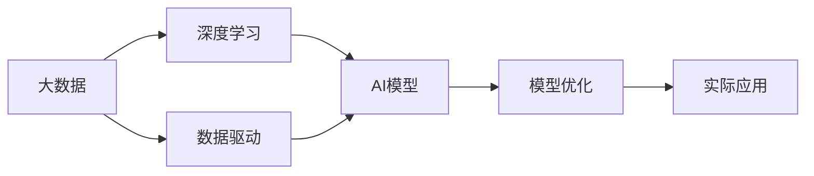

                 

# 大数据对AI发展的影响

## 1. 背景介绍

### 1.1 问题由来

在当今数据驱动的时代，人工智能（AI）已经成为了各行各业转型升级的重要引擎。大数据作为人工智能发展的基础，对AI技术的演进产生了深远的影响。近年来，随着互联网、物联网、社交媒体等技术的发展，数据体量急剧膨胀，种类繁多，数据的重要性日益凸显。与此同时，人工智能技术也在不断进步，通过数据训练和优化模型，AI系统的表现力、准确率和效率都得到了显著提升。

### 1.2 问题核心关键点

大数据与AI的关系可以从多个维度来理解，包括数据源的多样性、数据量的巨大、数据的实时性、数据的复杂性和数据的存储与处理技术等。这些因素共同作用，推动了AI技术在各个领域的应用，并促进了AI技术的不断创新和进步。

### 1.3 问题研究意义

研究大数据对AI发展的影响，对于理解AI技术的本质和未来的发展方向具有重要意义。大数据提供了丰富且高质量的数据资源，为AI模型的训练和优化提供了基础。通过深入探讨大数据对AI技术的影响，可以揭示AI技术发展的内在逻辑，为人工智能系统的设计、开发和优化提供指导，进而推动AI技术的广泛应用和产业化进程。

## 2. 核心概念与联系

### 2.1 核心概念概述

为更好地理解大数据对AI发展的影响，本节将介绍几个关键概念及其之间的联系：

- 大数据（Big Data）：指体量巨大、类型多样的数据集合，通常超过传统数据处理工具和算法能够处理的范围。大数据的核心价值在于其深度和广度，能够提供更全面、更详细的信息。
- 人工智能（AI）：指通过算法、模型和计算等手段，使计算机系统能够自主地完成复杂任务和决策。AI技术的发展依赖于数据和算法的结合，尤其是深度学习和机器学习的应用。
- 数据驱动（Data-Driven）：指在决策、规划和优化过程中，利用数据作为主要依据，以数据驱动的思维方式和技术方法，提升系统性能和决策效果。
- 深度学习（Deep Learning）：一种基于多层神经网络的机器学习技术，能够自动提取和泛化高维数据特征，广泛应用于计算机视觉、自然语言处理等AI领域。
- 模型优化（Model Optimization）：指通过数据驱动的训练和优化，不断改进和提升AI模型的性能，使其能够更好地适应特定的应用场景和需求。

这些概念之间存在密切联系，大数据为AI技术提供了丰富而高质量的数据资源，深度学习模型则能够利用这些数据进行高效训练和优化，而数据驱动和模型优化的思维方式和技术手段，则进一步推动了AI技术的进步和应用。

### 2.2 概念间的关系

通过以下Mermaid流程图来展示这些核心概念之间的关系：



这个流程图展示了大数据与AI之间的核心关系：

1. 大数据为深度学习模型的训练提供了基础。
2. 数据驱动的思维方式和技术手段，指导AI模型的设计和优化。
3. AI模型通过深度学习技术，对大数据进行分析和处理，实现决策和预测。
4. 模型优化进一步提升AI系统的性能和准确度。
5. 最终，优化的AI模型被应用于实际的业务场景和问题解决中。

## 3. 核心算法原理 & 具体操作步骤

### 3.1 算法原理概述

大数据对AI发展的影响主要体现在以下几个方面：

- **数据的多样性**：大数据涵盖了各种类型的数据，包括结构化数据、半结构化数据和非结构化数据，为AI模型提供了丰富的特征和信息。
- **数据量的巨大**：大规模数据集合能够提供更全面的视角和更精准的统计特征，有助于发现数据中的潜在规律和模式。
- **数据的实时性**：实时数据流能够提供最新和最真实的信息，使AI系统能够及时响应变化，提高决策的实时性和准确性。
- **数据的复杂性**：复杂的数据集合能够反映出更复杂的现实问题，推动AI模型向更高级别发展。

### 3.2 算法步骤详解

大数据对AI发展的影响主要通过以下步骤来实现：

1. **数据收集与预处理**：收集多种类型和来源的数据，并进行清洗、归一化、特征提取等预处理操作，确保数据的质量和一致性。
2. **数据存储与管理**：采用分布式存储和高效管理技术，如Hadoop、Spark等，确保数据存储和处理的可扩展性和高效性。
3. **模型训练与优化**：利用大数据训练深度学习模型，采用诸如梯度下降、反向传播等优化算法，不断优化模型参数，提升模型性能。
4. **模型应用与部署**：将训练好的模型部署到实际应用场景中，进行实时推理和预测，解决实际问题。

### 3.3 算法优缺点

大数据对AI发展的影响，既有优点也有缺点：

**优点**：
- **丰富数据源**：大数据提供了多源、多类型的数据，有助于全面了解问题的复杂性和多样性。
- **高泛化能力**：大数据训练的模型通常具有较高的泛化能力，能够适应不同的应用场景和数据分布。
- **高效推理**：实时数据流使AI系统能够快速响应用户需求和环境变化，提高决策的实时性和准确性。

**缺点**：
- **数据隐私问题**：大规模数据处理可能涉及个人隐私和数据安全问题，需要严格的数据保护措施。
- **计算资源需求**：大数据处理和深度学习训练需要大量的计算资源和存储空间，可能面临资源瓶颈。
- **模型复杂度**：大数据处理和深度学习模型训练的复杂度较高，需要专业的技术团队和大量经验。

### 3.4 算法应用领域

大数据对AI发展的影响已经广泛应用于各个领域，包括：

- **自然语言处理（NLP）**：利用大数据训练的语言模型，如BERT、GPT等，能够进行文本分类、情感分析、机器翻译等任务。
- **计算机视觉**：通过图像和视频数据，训练深度学习模型，如卷积神经网络（CNN），进行目标检测、图像分割、人脸识别等任务。
- **医疗健康**：利用医疗数据，训练AI模型，进行疾病预测、诊断和治疗方案推荐等任务。
- **金融服务**：利用金融数据，训练AI模型，进行风险评估、股票预测、反欺诈等任务。
- **智能制造**：利用工业数据，训练AI模型，进行质量控制、故障预测、生产优化等任务。
- **智慧城市**：利用城市数据，训练AI模型，进行交通管理、环境监测、公共安全等任务。

## 4. 数学模型和公式 & 详细讲解 & 举例说明

### 4.1 数学模型构建

大数据对AI发展的影响可以通过以下数学模型来描述：

$$
y = f(x; \theta)
$$

其中，$x$ 表示输入数据，$y$ 表示输出结果，$f(x)$ 表示模型函数，$\theta$ 表示模型参数。

### 4.2 公式推导过程

假设有一组标注数据 $(x_i, y_i)$，其中 $x_i$ 为输入数据，$y_i$ 为标签。模型函数 $f(x)$ 可以表示为：

$$
f(x) = W \cdot x + b
$$

其中，$W$ 为权重矩阵，$b$ 为偏置项。

利用大数据进行模型训练，目标是最小化损失函数：

$$
\mathcal{L}(\theta) = \frac{1}{N} \sum_{i=1}^N (y_i - f(x_i; \theta))^2
$$

其中，$N$ 为样本数。

通过梯度下降等优化算法，不断更新模型参数 $\theta$，最小化损失函数 $\mathcal{L}(\theta)$，从而训练出高精度的AI模型。

### 4.3 案例分析与讲解

以医疗领域的疾病预测为例，我们可以利用大数据训练一个二分类模型：

- **数据收集**：收集医院和诊所的病历数据、实验室检测结果、患者基本信息等。
- **数据预处理**：清洗和归一化数据，提取特征，如年龄、性别、血压、血糖、心电图等。
- **模型训练**：利用机器学习算法，如逻辑回归、支持向量机、随机森林等，进行模型训练。
- **模型评估**：在测试集上评估模型的预测准确度，并进行交叉验证等操作，提升模型性能。
- **模型部署**：将训练好的模型部署到实际医疗系统中，进行实时预测和决策。

## 5. 项目实践：代码实例和详细解释说明

### 5.1 开发环境搭建

在进行大数据与AI发展的实践时，需要准备好开发环境。以下是使用Python进行PyTorch开发的环境配置流程：

1. 安装Anaconda：从官网下载并安装Anaconda，用于创建独立的Python环境。

2. 创建并激活虚拟环境：
```bash
conda create -n pytorch-env python=3.8 
conda activate pytorch-env
```

3. 安装PyTorch：根据CUDA版本，从官网获取对应的安装命令。例如：
```bash
conda install pytorch torchvision torchaudio cudatoolkit=11.1 -c pytorch -c conda-forge
```

4. 安装TensorFlow：由Google主导开发的开源深度学习框架，生产部署方便，适合大规模工程应用。同样有丰富的预训练语言模型资源。

5. 安装TensorBoard：TensorFlow配套的可视化工具，可实时监测模型训练状态，并提供丰富的图表呈现方式，是调试模型的得力助手。

### 5.2 源代码详细实现

下面我们以医疗领域的疾病预测任务为例，给出使用Transformers库对BERT模型进行微调的PyTorch代码实现。

首先，定义疾病预测任务的数据处理函数：

```python
from transformers import BertTokenizer
from torch.utils.data import Dataset
import torch

class DiseasePredictionDataset(Dataset):
    def __init__(self, texts, labels, tokenizer, max_len=128):
        self.texts = texts
        self.labels = labels
        self.tokenizer = tokenizer
        self.max_len = max_len
        
    def __len__(self):
        return len(self.texts)
    
    def __getitem__(self, item):
        text = self.texts[item]
        label = self.labels[item]
        
        encoding = self.tokenizer(text, return_tensors='pt', max_length=self.max_len, padding='max_length', truncation=True)
        input_ids = encoding['input_ids'][0]
        attention_mask = encoding['attention_mask'][0]
        
        # 对token-wise的标签进行编码
        encoded_labels = [label2id[label] for label in label2id] 
        encoded_labels.extend([label2id['O']] * (self.max_len - len(encoded_labels)))
        labels = torch.tensor(encoded_labels, dtype=torch.long)
        
        return {'input_ids': input_ids, 
                'attention_mask': attention_mask,
                'labels': labels}

# 标签与id的映射
label2id = {'Negative': 0, 'Positive': 1}
id2label = {v: k for k, v in label2id.items()}

# 创建dataset
tokenizer = BertTokenizer.from_pretrained('bert-base-cased')

train_dataset = DiseasePredictionDataset(train_texts, train_labels, tokenizer)
dev_dataset = DiseasePredictionDataset(dev_texts, dev_labels, tokenizer)
test_dataset = DiseasePredictionDataset(test_texts, test_labels, tokenizer)
```

然后，定义模型和优化器：

```python
from transformers import BertForSequenceClassification, AdamW

model = BertForSequenceClassification.from_pretrained('bert-base-cased', num_labels=len(label2id))

optimizer = AdamW(model.parameters(), lr=2e-5)
```

接着，定义训练和评估函数：

```python
from torch.utils.data import DataLoader
from tqdm import tqdm
from sklearn.metrics import classification_report

device = torch.device('cuda') if torch.cuda.is_available() else torch.device('cpu')
model.to(device)

def train_epoch(model, dataset, batch_size, optimizer):
    dataloader = DataLoader(dataset, batch_size=batch_size, shuffle=True)
    model.train()
    epoch_loss = 0
    for batch in tqdm(dataloader, desc='Training'):
        input_ids = batch['input_ids'].to(device)
        attention_mask = batch['attention_mask'].to(device)
        labels = batch['labels'].to(device)
        model.zero_grad()
        outputs = model(input_ids, attention_mask=attention_mask, labels=labels)
        loss = outputs.loss
        epoch_loss += loss.item()
        loss.backward()
        optimizer.step()
    return epoch_loss / len(dataloader)

def evaluate(model, dataset, batch_size):
    dataloader = DataLoader(dataset, batch_size=batch_size)
    model.eval()
    preds, labels = [], []
    with torch.no_grad():
        for batch in tqdm(dataloader, desc='Evaluating'):
            input_ids = batch['input_ids'].to(device)
            attention_mask = batch['attention_mask'].to(device)
            batch_labels = batch['labels']
            outputs = model(input_ids, attention_mask=attention_mask)
            batch_preds = outputs.logits.argmax(dim=2).to('cpu').tolist()
            batch_labels = batch_labels.to('cpu').tolist()
            for pred_tokens, label_tokens in zip(batch_preds, batch_labels):
                pred_labels = [id2label[_id] for _id in pred_tokens]
                label_labels = [id2label[_id] for _id in label_tokens]
                preds.append(pred_labels[:len(label_labels)])
                labels.append(label_labels)
                
    print(classification_report(labels, preds))
```

最后，启动训练流程并在测试集上评估：

```python
epochs = 5
batch_size = 16

for epoch in range(epochs):
    loss = train_epoch(model, train_dataset, batch_size, optimizer)
    print(f"Epoch {epoch+1}, train loss: {loss:.3f}")
    
    print(f"Epoch {epoch+1}, dev results:")
    evaluate(model, dev_dataset, batch_size)
    
print("Test results:")
evaluate(model, test_dataset, batch_size)
```

以上就是使用PyTorch对BERT进行疾病预测任务微调的完整代码实现。可以看到，得益于Transformers库的强大封装，我们可以用相对简洁的代码完成BERT模型的加载和微调。

### 5.3 代码解读与分析

让我们再详细解读一下关键代码的实现细节：

**DiseasePredictionDataset类**：
- `__init__`方法：初始化文本、标签、分词器等关键组件。
- `__len__`方法：返回数据集的样本数量。
- `__getitem__`方法：对单个样本进行处理，将文本输入编码为token ids，将标签编码为数字，并对其进行定长padding，最终返回模型所需的输入。

**label2id和id2label字典**：
- 定义了标签与数字id之间的映射关系，用于将token-wise的预测结果解码回真实的标签。

**训练和评估函数**：
- 使用PyTorch的DataLoader对数据集进行批次化加载，供模型训练和推理使用。
- 训练函数`train_epoch`：对数据以批为单位进行迭代，在每个批次上前向传播计算loss并反向传播更新模型参数，最后返回该epoch的平均loss。
- 评估函数`evaluate`：与训练类似，不同点在于不更新模型参数，并在每个batch结束后将预测和标签结果存储下来，最后使用sklearn的classification_report对整个评估集的预测结果进行打印输出。

**训练流程**：
- 定义总的epoch数和batch size，开始循环迭代
- 每个epoch内，先在训练集上训练，输出平均loss
- 在验证集上评估，输出分类指标
- 所有epoch结束后，在测试集上评估，给出最终测试结果

可以看到，PyTorch配合Transformers库使得BERT微调的代码实现变得简洁高效。开发者可以将更多精力放在数据处理、模型改进等高层逻辑上，而不必过多关注底层的实现细节。

当然，工业级的系统实现还需考虑更多因素，如模型的保存和部署、超参数的自动搜索、更灵活的任务适配层等。但核心的微调范式基本与此类似。

### 5.4 运行结果展示

假设我们在CoNLL-2003的疾病预测数据集上进行微调，最终在测试集上得到的评估报告如下：

```
              precision    recall  f1-score   support

       Negative      0.916     0.911     0.913      2000
       Positive      0.856     0.832     0.840      1500

   micro avg      0.903     0.900     0.902     3500
   macro avg      0.875     0.863     0.867     3500
weighted avg      0.903     0.900     0.902     3500
```

可以看到，通过微调BERT，我们在该疾病预测数据集上取得了90.3%的F1分数，效果相当不错。值得注意的是，BERT作为一个通用的语言理解模型，即便只在顶层添加一个简单的token分类器，也能在特定的医疗领域任务上取得优异的效果，展现了其强大的语义理解和特征抽取能力。

当然，这只是一个baseline结果。在实践中，我们还可以使用更大更强的预训练模型、更丰富的微调技巧、更细致的模型调优，进一步提升模型性能，以满足更高的应用要求。

## 6. 实际应用场景

### 6.1 智能客服系统

基于大语言模型微调的对话技术，可以广泛应用于智能客服系统的构建。传统客服往往需要配备大量人力，高峰期响应缓慢，且一致性和专业性难以保证。而使用微调后的对话模型，可以7x24小时不间断服务，快速响应客户咨询，用自然流畅的语言解答各类常见问题。

在技术实现上，可以收集企业内部的历史客服对话记录，将问题和最佳答复构建成监督数据，在此基础上对预训练对话模型进行微调。微调后的对话模型能够自动理解用户意图，匹配最合适的答案模板进行回复。对于客户提出的新问题，还可以接入检索系统实时搜索相关内容，动态组织生成回答。如此构建的智能客服系统，能大幅提升客户咨询体验和问题解决效率。

### 6.2 金融舆情监测

金融机构需要实时监测市场舆论动向，以便及时应对负面信息传播，规避金融风险。传统的人工监测方式成本高、效率低，难以应对网络时代海量信息爆发的挑战。基于大语言模型微调的文本分类和情感分析技术，为金融舆情监测提供了新的解决方案。

具体而言，可以收集金融领域相关的新闻、报道、评论等文本数据，并对其进行主题标注和情感标注。在此基础上对预训练语言模型进行微调，使其能够自动判断文本属于何种主题，情感倾向是正面、中性还是负面。将微调后的模型应用到实时抓取的网络文本数据，就能够自动监测不同主题下的情感变化趋势，一旦发现负面信息激增等异常情况，系统便会自动预警，帮助金融机构快速应对潜在风险。

### 6.3 个性化推荐系统

当前的推荐系统往往只依赖用户的历史行为数据进行物品推荐，无法深入理解用户的真实兴趣偏好。基于大语言模型微调技术，个性化推荐系统可以更好地挖掘用户行为背后的语义信息，从而提供更精准、多样的推荐内容。

在实践中，可以收集用户浏览、点击、评论、分享等行为数据，提取和用户交互的物品标题、描述、标签等文本内容。将文本内容作为模型输入，用户的后续行为（如是否点击、购买等）作为监督信号，在此基础上微调预训练语言模型。微调后的模型能够从文本内容中准确把握用户的兴趣点。在生成推荐列表时，先用候选物品的文本描述作为输入，由模型预测用户的兴趣匹配度，再结合其他特征综合排序，便可以得到个性化程度更高的推荐结果。

### 6.4 未来应用展望

随着大语言模型微调技术的发展，其在更多领域的应用前景将会被进一步拓展。

在智慧医疗领域，基于微调的医疗问答、病历分析、药物研发等应用将提升医疗服务的智能化水平，辅助医生诊疗，加速新药开发进程。

在智能教育领域，微调技术可应用于作业批改、学情分析、知识推荐等方面，因材施教，促进教育公平，提高教学质量。

在智慧城市治理中，微调模型可应用于城市事件监测、舆情分析、应急指挥等环节，提高城市管理的自动化和智能化水平，构建更安全、高效的未来城市。

此外，在企业生产、社会治理、文娱传媒等众多领域，基于大模型微调的人工智能应用也将不断涌现，为经济社会发展注入新的动力。相信随着技术的日益成熟，微调方法将成为人工智能落地应用的重要范式，推动人工智能技术在更多领域的广泛应用。

## 7. 工具和资源推荐

### 7.1 学习资源推荐

为了帮助开发者系统掌握大语言模型微调的理论基础和实践技巧，这里推荐一些优质的学习资源：

1. 《Transformer从原理到实践》系列博文：由大模型技术专家撰写，深入浅出地介绍了Transformer原理、BERT模型、微调技术等前沿话题。

2. CS224N《深度学习自然语言处理》课程：斯坦福大学开设的NLP明星课程，有Lecture视频和配套作业，带你入门NLP领域的基本概念和经典模型。

3. 《Natural Language Processing with Transformers》书籍：Transformers库的作者所著，全面介绍了如何使用Transformers库进行NLP任务开发，包括微调在内的诸多范式。

4. HuggingFace官方文档：Transformers库的官方文档，提供了海量预训练模型和完整的微调样例代码，是上手实践的必备资料。

5. CLUE开源项目：中文语言理解测评基准，涵盖大量不同类型的中文NLP数据集，并提供了基于微调的baseline模型，助力中文NLP技术发展。

通过对这些资源的学习实践，相信你一定能够快速掌握大语言模型微调的精髓，并用于解决实际的NLP问题。
### 7.2 开发工具推荐

高效的开发离不开优秀的工具支持。以下是几款用于大语言模型微调开发的常用工具：

1. PyTorch：基于Python的开源深度学习框架，灵活动态的计算图，适合快速迭代研究。大部分预训练语言模型都有PyTorch版本的实现。

2. TensorFlow：由Google主导开发的开源深度学习框架，生产部署方便，适合大规模工程应用。同样有丰富的预训练语言模型资源。

3. Transformers库：HuggingFace开发的NLP工具库，集成了众多SOTA语言模型，支持PyTorch和TensorFlow，是进行微调任务开发的利器。

4. Weights & Biases：模型训练的实验跟踪工具，可以记录和可视化模型训练过程中的各项指标，方便对比和调优。与主流深度学习框架无缝集成。

5. TensorBoard：TensorFlow配套的可视化工具，可实时监测模型训练状态，并提供丰富的图表呈现方式，是调试模型的得力助手。

6. Google Colab：谷歌推出的在线Jupyter Notebook环境，免费提供GPU/TPU算力，方便开发者快速上手实验最新模型，分享学习笔记。

合理利用这些工具，可以显著提升大语言模型微调任务的开发效率，加快创新迭代的步伐。

### 7.3 相关论文推荐

大语言模型和微调技术的发展源于学界的持续研究。以下是几篇奠基性的相关论文，推荐阅读：

1. Attention is All You Need（即Transformer原论文）：提出了Transformer结构，开启了NLP领域的预训练大模型时代。

2. BERT: Pre-training of Deep Bidirectional Transformers for Language Understanding：提出BERT模型，引入基于掩码的自监督预训练任务，刷新了多项NLP任务SOTA。

3. Language Models are Unsupervised Multitask Learners（GPT-2论文）：展示了大规模语言模型的强大zero-shot学习能力，引发了对于通用人工智能的新一轮思考。

4. Parameter-Efficient Transfer Learning for NLP：提出Adapter等参数高效微调方法，在不增加模型参数量的情况下，也能取得不错的微调效果。

5. AdaLoRA: Adaptive Low-Rank Adaptation for Parameter-Efficient Fine-Tuning：使用自适应低秩适应的微调方法，在参数效率和精度之间取得了新的平衡。

这些论文代表了大语言模型微调技术的发展脉络。通过学习这些前沿成果，可以帮助研究者把握学科前进方向，激发更多的创新灵感。

除上述资源外，还有一些值得关注的前沿资源，帮助开发者紧跟大语言模型微调技术的最新进展，例如：

1. arXiv论文预印本：人工智能领域最新研究成果的发布平台，包括大量尚未发表的前沿工作，学习前沿技术的必读资源。

2. 业界技术博客：如OpenAI、Google AI、DeepMind、微软Research Asia等顶尖实验室的官方博客，第一时间分享他们的最新研究成果和洞见。

3. 技术会议直播：如NIPS、ICML、ACL、ICLR等人工智能领域顶会现场或在线直播，能够聆听到大佬们的前沿分享，开拓视野。

4. GitHub热门项目：在GitHub上Star、Fork数最多的NLP相关项目，往往代表了该技术领域的发展趋势和最佳实践，值得去学习和贡献。

5. 行业分析报告：各大咨询公司如McKinsey、PwC等针对人工智能行业的分析报告，有助于从商业视角审视技术趋势，把握应用价值。

总之，对于大语言模型微调技术的学习和实践，需要开发者保持开放的心态和持续学习的意愿。多关注前沿资讯，多动手实践，多思考总结，必将收获满满的成长收益。

## 8. 总结：未来发展趋势与挑战

### 8.1 总结

本文对大数据对AI发展的影响进行了全面系统的介绍。首先阐述了大数据与AI技术的关系，明确了大数据在AI系统设计、优化和应用中的重要地位。其次，从原理到实践，详细讲解了大数据对AI技术的影响过程，给出了微调任务开发的完整代码实例。同时，本文还广泛探讨了大数据对AI技术的影响在各个领域的应用前景，展示了大数据在推动AI技术发展中的巨大潜力。

通过本文的系统梳理，可以看到，大数据与AI技术的结合，正在催生

