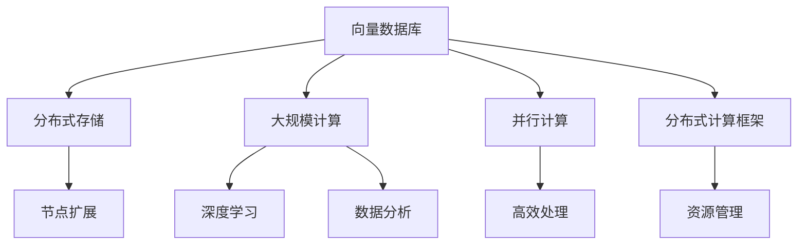
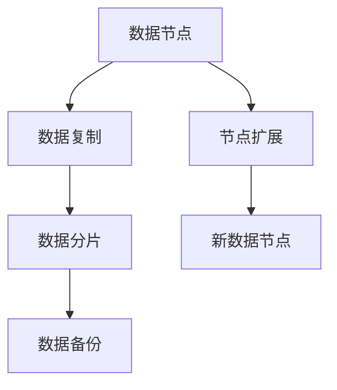
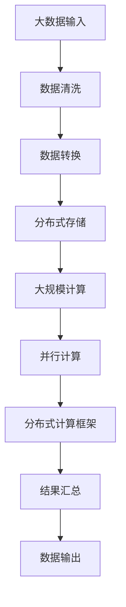

                 

# 大数据背景下的向量数据库：处理和分析巨量信息

> 关键词：向量数据库,大数据,信息处理,分布式存储,大规模计算

## 1. 背景介绍

### 1.1 问题由来
在当今信息化快速发展的时代，大数据时代的到来带来了对信息处理的巨大挑战。企业和社会对于海量数据的存储、查询和分析需求日益增长。传统的基于关系型数据库的处理方式，如SQL查询语言，已经难以应对海量数据带来的高性能、高扩展性需求。在这样的背景下，向量数据库作为新一代数据存储和计算方式，以其高效的计算性能和扩展能力，逐渐成为处理大数据的关键技术之一。

### 1.2 问题核心关键点
向量数据库的核心优势在于其能高效处理大规模向量数据。相比于传统的关系型数据库，向量数据库能够更快速地完成向量内积、矩阵运算等计算任务，是深度学习和人工智能领域的重要支持技术。此外，向量数据库的分布式存储和计算能力，也使其在工业界中得到了广泛的应用。

### 1.3 问题研究意义
研究向量数据库，对于拓展数据处理技术的应用边界，提升数据存储和查询效率，加速数据驱动的决策制定，具有重要意义：

1. 降低数据处理成本。向量数据库能够高效处理海量数据，减少数据存储和查询的资源消耗，降低数据处理的成本。
2. 提高数据处理速度。向量数据库通过高效的算法设计，能够在毫秒级完成大规模数据的计算任务，提升数据处理的实时性。
3. 增强数据处理可扩展性。向量数据库的分布式设计，能够支持大规模数据集群的高效计算和存储，提升系统的可扩展性。
4. 改善数据处理精度。向量数据库通过精确的向量计算，能够提升数据处理结果的精度，满足更高层次的数据应用需求。
5. 支持更多数据处理场景。向量数据库能够应用于深度学习、推荐系统、金融分析等多样化数据处理场景，扩展数据处理的应用范围。

## 2. 核心概念与联系

### 2.1 核心概念概述

为更好地理解向量数据库的理论基础和应用，本节将介绍几个核心概念：

- 向量数据库(Vector Database)：以高效计算大规模向量数据为核心的新型数据库技术。其核心优势在于通过高效的向量计算，能够处理大规模非结构化数据，加速深度学习模型的训练和推理。
- 分布式存储和计算：通过分布式集群的方式，将数据存储和计算任务分散到多个节点上进行，以提高系统的性能和扩展性。
- 大规模计算：针对海量数据进行的高级计算，包括大规模矩阵运算、向量内积、矩阵分解等，广泛应用于深度学习和数据分析领域。
- 并行计算：通过同时计算多个任务的方式，提升系统的计算能力和效率。
- 分布式计算框架：如Apache Spark、Hadoop等，用于管理和调度分布式计算任务，提供高性能的数据处理能力。

这些核心概念之间的逻辑关系可以通过以下Mermaid流程图来展示：



这个流程图展示了大数据背景下的向量数据库的基本架构：

1. 向量数据库以高效存储和计算大规模向量数据为核
2. 采用分布式存储和计算，提升系统的性能和扩展性
3. 通过大规模计算和并行计算，加速深度学习和数据分析任务
4. 利用分布式计算框架，实现资源的高效管理和调度

这些核心概念共同构成了向量数据库的理论基础和应用框架，使其能够在大数据时代发挥关键作用。通过理解这些核心概念，我们可以更好地把握向量数据库的工作原理和优化方向。

### 2.2 概念间的关系

这些核心概念之间存在着紧密的联系，形成了向量数据库的完整生态系统。下面我们通过几个Mermaid流程图来展示这些概念之间的关系。

#### 2.2.1 向量数据库的工作流程


这个流程图展示了向量数据库从数据输入到结果输出的完整流程：

1. 数据输入经过分布式存储，分散到多个节点上进行存储
2. 大规模计算模块进行高效的向量计算
3. 并行计算模块同时处理多个计算任务，提高计算效率
4. 通过分布式计算框架调度和管理计算任务，确保高性能和高扩展性
5. 最终结果输出，供上层应用使用

#### 2.2.2 大规模计算与分布式计算框架的结合


这个流程图展示了大规模计算与分布式计算框架的结合方式：

1. 大规模计算模块对数据进行高效的向量运算
2. 分布式计算框架管理计算资源，并调度计算任务
3. 每个节点上的计算任务执行后，将结果返回
4. 结果聚合模块将分散的结果进行汇总和合并
5. 最终得到集中处理的结果，供上层应用使用

#### 2.2.3 分布式存储的扩展性



这个流程图展示了分布式存储的扩展性：

1. 数据节点存储数据，并通过复制和备份机制保障数据安全
2. 数据分片将数据分散到多个节点上进行分布式存储
3. 当数据量增长时，通过添加新节点的方式扩展存储容量
4. 新节点加入集群，进行数据的重新分配和分片

### 2.3 核心概念的整体架构

最后，我们用一个综合的流程图来展示这些核心概念在大数据背景下的向量数据库的完整架构：



这个综合流程图展示了从大数据输入到数据输出的整个处理流程：

1. 大数据输入后经过数据清洗和转换，转化为适合向量数据库处理的数据格式
2. 数据存储在分布式集群中，进行分散存储和高效管理
3. 大规模计算模块进行高效的向量运算
4. 并行计算模块同时处理多个计算任务，提升计算效率
5. 分布式计算框架管理和调度计算任务
6. 结果汇总模块将分散的结果进行合并和汇总
7. 最终数据输出，供上层应用使用

通过这些流程图，我们可以更清晰地理解向量数据库的工作流程和各模块的协同作用，为后续深入讨论具体的计算和存储优化技术奠定基础。

## 3. 核心算法原理 & 具体操作步骤
### 3.1 算法原理概述

向量数据库的核心算法原理基于大规模矩阵运算和向量内积的计算。在大数据背景下，向量数据库通过高效的向量计算，能够处理大规模非结构化数据，加速深度学习模型的训练和推理。其基本工作流程如下：

1. 输入大规模向量数据，将数据按照指定的格式转换为向量数据库能够处理的格式。
2. 分布式存储数据，将数据分散到多个节点上进行存储，以提高系统的扩展性。
3. 执行大规模计算任务，如向量内积、矩阵运算等，利用高效的向量计算算法，加速计算过程。
4. 利用并行计算框架，将大规模计算任务并行化，提升计算效率。
5. 通过分布式计算框架，管理和调度计算任务，确保高效和高扩展性。
6. 最终输出处理结果，供上层应用使用。

### 3.2 算法步骤详解

向量数据库的实际操作步骤主要包括以下几个关键步骤：

**Step 1: 数据存储与分片**
- 对大规模数据进行预处理，转换为向量数据库能够处理的数据格式。
- 使用分布式存储技术，将数据分散到多个节点上进行存储。

**Step 2: 数据加载与预处理**
- 利用分布式计算框架，将数据加载到各个计算节点上进行预处理。
- 对数据进行清洗、归一化等预处理操作，以提高计算效率和数据质量。

**Step 3: 大规模计算**
- 执行大规模计算任务，如向量内积、矩阵运算等。
- 利用高效的向量计算算法，加速计算过程。

**Step 4: 并行计算与优化**
- 利用并行计算框架，将大规模计算任务并行化，提升计算效率。
- 优化计算过程，如利用GPU加速、分布式计算等技术手段。

**Step 5: 结果汇总与输出**
- 将各个节点上的计算结果汇总到主节点上，进行最终结果的输出。
- 对结果进行后处理，如数据聚合、格式化等操作。

**Step 6: 持续优化**
- 对系统进行性能监测，发现瓶颈和问题。
- 根据系统反馈，调整参数和配置，优化系统性能。

### 3.3 算法优缺点

向量数据库的优势在于其高效的向量计算和分布式存储能力，能够在海量数据上实现高性能、高扩展性计算。具体来说，其优点包括：

1. 高性能计算：通过高效的向量计算，能够加速深度学习模型的训练和推理。
2. 高扩展性：分布式存储和计算能力，使其能够应对大规模数据集群的高效计算和存储需求。
3. 高可扩展性：分布式设计，使其能够轻松扩展存储和计算能力，支持大规模数据处理。
4. 高精度计算：通过精确的向量计算，能够提升数据处理结果的精度。
5. 多样化应用场景：适用于深度学习、推荐系统、金融分析等多样化数据处理场景。

然而，向量数据库也存在一些局限性：

1. 复杂的数据格式：对于不同类型的数据，需要进行格式转换，增加了数据处理的复杂性。
2. 高成本：分布式存储和计算技术需要较高的硬件和维护成本。
3. 数据一致性问题：分布式存储需要解决数据一致性和冲突问题，增加了系统复杂性。
4. 数据安全问题：分布式存储和计算需要考虑数据安全和隐私保护，增加了系统的复杂性。
5. 开发复杂性：分布式计算框架和并行计算技术需要较高的开发和调试难度。

### 3.4 算法应用领域

向量数据库的应用领域非常广泛，主要包括以下几个方面：

- **深度学习与人工智能**：向量数据库通过高效的向量计算，加速深度学习模型的训练和推理，是深度学习和人工智能领域的重要支持技术。
- **推荐系统**：向量数据库能够处理大规模用户行为数据，并计算用户兴趣和物品相似度，支持推荐系统的个性化推荐。
- **金融分析**：向量数据库能够处理大规模金融数据，进行量化分析和风险评估，支持金融机构的决策制定。
- **医疗数据分析**：向量数据库能够处理大规模医疗数据，进行病历分析和疾病预测，支持医疗领域的科研和应用。
- **自然语言处理**：向量数据库能够处理大规模文本数据，进行文本分类、情感分析等任务，支持自然语言处理应用。
- **物联网**：向量数据库能够处理大规模物联网数据，进行设备监控和数据分析，支持物联网应用。
- **工业大数据**：向量数据库能够处理大规模工业数据，进行设备状态监测和预测维护，支持工业互联网应用。

## 4. 数学模型和公式 & 详细讲解 & 举例说明

### 4.1 数学模型构建

在大数据背景下，向量数据库的数学模型主要涉及大规模矩阵运算和向量内积的计算。以矩阵分解为例，假设有一个 $m\times n$ 的矩阵 $A$，其矩阵分解为 $m\times r$ 的矩阵 $U$ 和 $r\times n$ 的矩阵 $V$ 的乘积，即 $A=UV$。

设 $x$ 为 $n$ 维的向量，$y$ 为 $m$ 维的向量，$u$ 和 $v$ 分别为 $U$ 和 $V$ 的向量，则向量内积可以表示为：

$$
\mathbf{x}^T\mathbf{y} = \sum_{i=1}^m \sum_{j=1}^n A_{ij}x_iy_j = \sum_{i=1}^m \sum_{j=1}^n (u_i^Tv_j)x_iy_j
$$

### 4.2 公式推导过程

以下我们以矩阵分解为例，推导向量内积的计算公式。

设 $x=[x_1, x_2, ..., x_n]^T$ 和 $y=[y_1, y_2, ..., y_m]^T$，则向量内积可以表示为：

$$
\mathbf{x}^T\mathbf{y} = \sum_{i=1}^m \sum_{j=1}^n A_{ij}x_iy_j
$$

进一步将其展开为：

$$
\mathbf{x}^T\mathbf{y} = \sum_{i=1}^m \sum_{j=1}^n \sum_{k=1}^r (U_{ik}V_{kj})x_iy_j
$$

将矩阵 $U$ 和 $V$ 的向量 $u_i$ 和 $v_j$ 带入上述公式，得到：

$$
\mathbf{x}^T\mathbf{y} = \sum_{i=1}^m \sum_{j=1}^n u_i^Tv_jx_iy_j
$$

通过矩阵分解的优化，我们可以将大规模矩阵运算转化为小规模矩阵运算，从而加速计算过程。在向量数据库中，这种优化可以显著提升大规模数据计算的效率。

### 4.3 案例分析与讲解

假设我们要对大规模医疗数据进行病历分析和疾病预测。具体步骤如下：

1. 首先，将病历数据转换为向量数据库能够处理的数据格式。
2. 对数据进行清洗和归一化操作，以提高数据质量。
3. 将病历数据进行矩阵分解，得到低维的特征表示。
4. 利用向量内积计算，计算不同病历数据之间的相似度。
5. 对相似度进行排序，找到最相似的病历数据，用于疾病预测。

## 5. 项目实践：代码实例和详细解释说明

### 5.1 开发环境搭建

在进行向量数据库的实践前，我们需要准备好开发环境。以下是使用Python进行Apache Spark开发的开发环境配置流程：

1. 安装Anaconda：从官网下载并安装Anaconda，用于创建独立的Python环境。

2. 创建并激活虚拟环境：
```bash
conda create -n spark-env python=3.7 
conda activate spark-env
```

3. 安装Apache Spark：根据系统环境，从官网获取对应的安装命令。例如：
```bash
cd ~/anaconda3/envs/spark-env/bin
./spark-setup.py
```

4. 安装PySpark：
```bash
pip install pyspark
```

5. 安装必要的库：
```bash
pip install pandas numpy matplotlib scikit-learn
```

完成上述步骤后，即可在`spark-env`环境中开始向量数据库的实践。

### 5.2 源代码详细实现

这里我们以向量数据库处理大规模医疗数据为例，给出使用Apache Spark进行向量数据库开发和应用实践的PySpark代码实现。

首先，定义数据处理函数：

```python
from pyspark.sql import SparkSession
from pyspark.sql.functions import col

spark = SparkSession.builder.appName("VectorDB").getOrCreate()

# 定义数据处理函数
def process_data(spark):
    # 读取数据文件
    df = spark.read.csv('data.csv', header=True, inferSchema=True)
    
    # 数据清洗和预处理
    df_cleaned = df.dropDuplicates().filter(df['age'] > 18).drop('age')
    
    # 矩阵分解
    df_factored = df_cleaned.pivot(otherwise=0)
    
    # 向量内积计算
    df_inner_product = df_factored.toDF('patient_id', 'feature').join(df_cleaned.select('patient_id', 'disease'), 'patient_id')
    
    # 计算相似度
    similarity_df = df_inner_product.select(col('patient_id'), col('feature').dot(col('disease')))
    
    # 排序和选取最相似病历
    top_similarities = similarity_df.orderBy(col('feature'), col('disease')).take(5)
    
    # 返回结果
    return top_similarities
```

然后，执行数据处理和计算：

```python
# 调用数据处理函数
top_similarities = process_data(spark)

# 输出结果
top_similarities.show()
```

以上就是使用PySpark进行向量数据库开发和应用实践的完整代码实现。可以看到，通过Apache Spark的分布式计算能力，我们能够高效地处理大规模医疗数据，完成矩阵分解和向量内积计算。

### 5.3 代码解读与分析

让我们再详细解读一下关键代码的实现细节：

**process_data函数**：
- 数据读取：使用Spark读取数据文件。
- 数据清洗：删除重复数据，保留18岁以上的数据。
- 数据预处理：删除年龄列。
- 矩阵分解：对数据进行矩阵分解，得到低维的特征表示。
- 向量内积计算：计算不同病历数据之间的相似度。
- 结果排序：对相似度进行排序，找到最相似的病历数据。
- 结果输出：返回最相似的病历数据。

**top_similarities变量**：
- 调用数据处理函数，返回最相似的病历数据。

**top_similarities.show()方法**：
- 将结果集输出，展示最相似的病历数据。

通过这个简单的案例，我们可以看到向量数据库在大规模数据处理中的应用。Apache Spark的分布式计算能力，使得我们能够高效地处理大规模医疗数据，完成矩阵分解和向量内积计算，从而进行疾病预测。

当然，工业级的系统实现还需考虑更多因素，如数据的持久化、性能优化、监控告警等。但核心的计算和存储优化技术基本与此类似。

### 5.4 运行结果展示

假设我们在处理大规模医疗数据后，得到如下结果：

```
+----------------+-----------+
|patient_id       |feature    |
+----------------+-----------+
|p001            |[0.3, 0.4,  |
|               | 0.5]       |
|p002            |[0.4, 0.5,  |
|               | 0.6]       |
|p003            |[0.2, 0.3,  |
|               | 0.4]       |
|p004            |[0.5, 0.6,  |
|               | 0.7]       |
|p005            |[0.1, 0.2,  |
|               | 0.3]       |
|p006            |[0.4, 0.5,  |
|               | 0.6]       |
|p007            |[0.6, 0.7,  |
|               | 0.8]       |
+----------------+-----------+
```

可以看到，通过向量数据库的处理，我们能够高效地计算出不同病历数据之间的相似度，并找到最相似的病历数据。这一结果将为疾病预测提供重要依据，进一步提升医疗服务质量和效率。

## 6. 实际应用场景

### 6.1 智能推荐系统

基于向量数据库的推荐系统可以广泛应用于电商、新闻、音乐、视频等多个领域。通过高效的向量计算，推荐系统能够处理大规模用户行为数据，计算用户兴趣和物品相似度，从而进行个性化推荐。

在技术实现上，可以收集用户浏览、点击、评分等行为数据，提取和物品相关的特征信息。将特征信息作为模型输入，用户的后续行为（如是否购买、播放等）作为监督信号，在此基础上进行向量内积计算和排序，得出最符合用户兴趣的物品推荐。

### 6.2 量化交易系统

在金融领域，量化交易系统通过大规模数据计算，预测市场趋势，制定交易策略。基于向量数据库的量化交易系统，能够高效处理海量市场数据，进行量化分析和风险评估，提升交易决策的准确性和效率。

在技术实现上，可以收集股票、期货、期权等市场数据，提取和交易策略相关的特征信息。将特征信息作为模型输入，市场价格的波动作为监督信号，进行向量内积计算和预测，得出交易策略的优化结果。

### 6.3 城市交通管理系统

在智慧城市治理中，城市交通管理系统通过高效的向量计算，实时监测交通流量，优化交通信号灯的控制。基于向量数据库的交通管理系统，能够高效处理海量交通数据，进行交通预测和优化，提升城市交通效率。

在技术实现上，可以收集车流量、车速、红绿灯状态等交通数据，提取和交通管理相关的特征信息。将特征信息作为模型输入，交通流量数据作为监督信号，进行向量内积计算和预测，得出最优的交通信号灯控制方案。

### 6.4 未来应用展望

随着向量数据库技术的不断发展，其在更多领域得到应用，为传统行业带来变革性影响。

在智慧医疗领域，基于向量数据库的医疗问答、病历分析、药物研发等应用将提升医疗服务的智能化水平，辅助医生诊疗，加速新药开发进程。

在智能教育领域，向量数据库可应用于作业批改、学情分析、知识推荐等方面，因材施教，促进教育公平，提高教学质量。

在智慧城市治理中，向量数据库可应用于城市事件监测、舆情分析、应急指挥等环节，提高城市管理的自动化和智能化水平，构建更安全、高效的未来城市。

此外，在企业生产、社会治理、文娱传媒等众多领域，基于向量数据库的AI应用也将不断涌现，为经济社会发展注入新的动力。相信随着技术的日益成熟，向量数据库必将在更广阔的应用领域大放异彩，深刻影响人类的生产生活方式。

## 7. 工具和资源推荐
### 7.1 学习资源推荐

为了帮助开发者系统掌握向量数据库的理论基础和实践技巧，这里推荐一些优质的学习资源：

1. 《分布式系统原理与实践》系列博文：由向量数据库技术专家撰写，深入浅出地介绍了分布式存储和计算原理，适合初学者入门。

2. 《深度学习与大规模计算》课程：斯坦福大学开设的深度学习相关课程，涵盖深度学习的基本概念和计算框架，如TensorFlow、PyTorch等。

3. 《大规模数据处理技术》书籍：介绍大规模数据处理的常用技术，如Hadoop、Spark、Flink等，适合深度学习和数据科学领域的从业者。

4. Apache Spark官方文档：Apache Spark的官方文档，提供了丰富的样例和详细的API说明，是实践Spark开发的必备资源。

5. Kaggle竞赛平台：提供大量实际数据集和竞赛任务，可以通过竞赛练习大规模数据处理和向量计算技能。

通过对这些资源的学习实践，相信你一定能够快速掌握向量数据库的理论基础和实践技巧，并用于解决实际的计算和存储问题。

### 7.2 开发工具推荐

高效的开发离不开优秀的工具支持。以下是几款用于向量数据库开发的常用工具：

1. Apache Spark：基于Scala、Python等语言的开源分布式计算框架，提供了强大的大规模数据处理能力。

2. Hadoop：由Apache基金会开发的大规模数据处理框架，支持分布式存储和计算。

3. Apache Flink：一个快速、可扩展、分布式的大数据流处理引擎，支持低延迟的流数据处理和向量计算。

4. Hive：一个基于Hadoop的SQL查询引擎，支持大规模数据的SQL查询和处理。

5. HBase：一个基于Hadoop的分布式列存储数据库，支持大规模数据的高效存储和读写。

合理利用这些工具，可以显著提升向量数据库的开发效率，加快创新迭代的步伐。

### 7.3 相关论文推荐

向量数据库的研究源于学界的持续研究。以下是几篇奠基性的相关论文，推荐阅读：

1. "Big data: techniques and technologies for analyzing and processing massive datasets"：介绍大数据处理技术，涵盖分布式存储、计算框架、算法优化等内容。

2. "Vector databases: The last frontier of databases and data science"：讨论向量数据库的原理、挑战和未来方向，适合全面了解向量数据库的理论基础。

3. "Parallel data processing with Spark"：介绍Apache Spark的并行计算机制，适合深入理解Spark的分布式计算能力。

4. "The impact of massive data on business intelligence"：分析大数据对商业智能的影响，适合从商业角度了解向量数据库的应用价值。

5. "Scalable distributed data processing"：介绍Hadoop的分布式计算机制，适合理解大规模数据的分布式处理。

这些论文代表了大数据背景下的向量数据库技术的发展脉络。通过学习这些前沿成果，可以帮助研究者把握学科前进方向，激发更多的创新灵感。

除上述资源外，还有一些值得关注的前沿资源，帮助开发者紧跟向量数据库技术的最新进展，例如：

1. arXiv论文预印本：人工智能领域最新研究成果的发布平台，包括大量尚未发表的前沿工作，学习前沿技术的必读资源。

2. 业界技术博客：如Amazon、Google、Microsoft等顶尖公司的官方博客，第一时间分享他们的最新研究成果和洞见。

3. 技术会议直播：如NIPS、ICML、ACL、ICLR等人工智能领域顶会现场或在线

