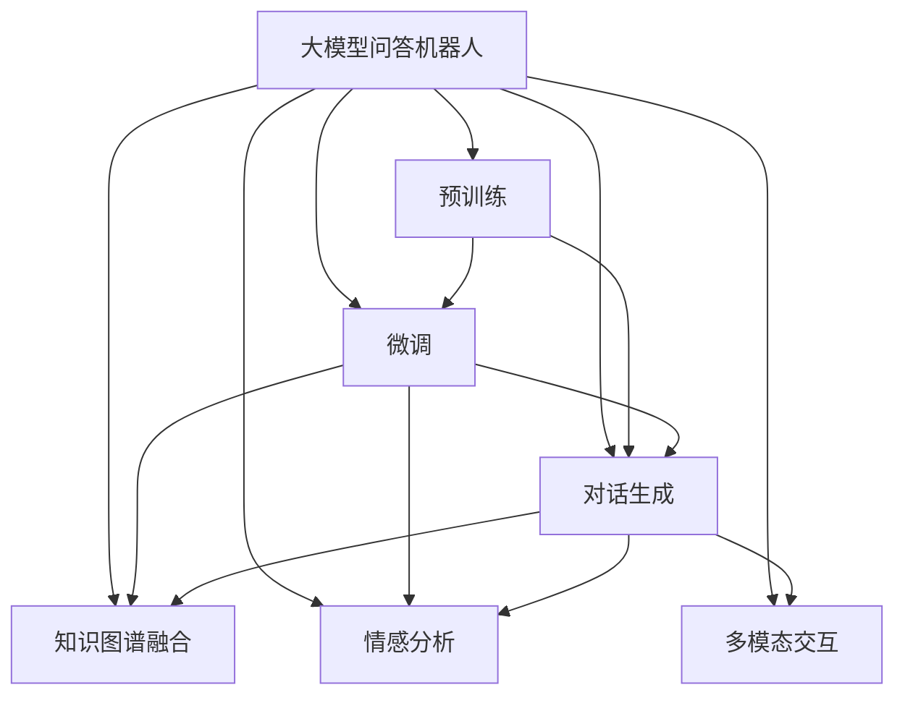
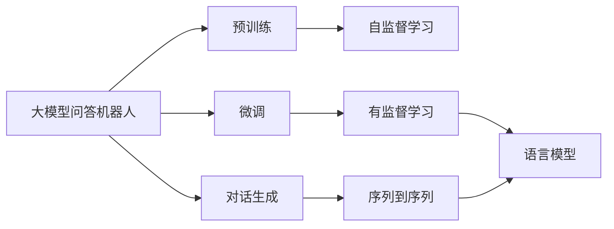
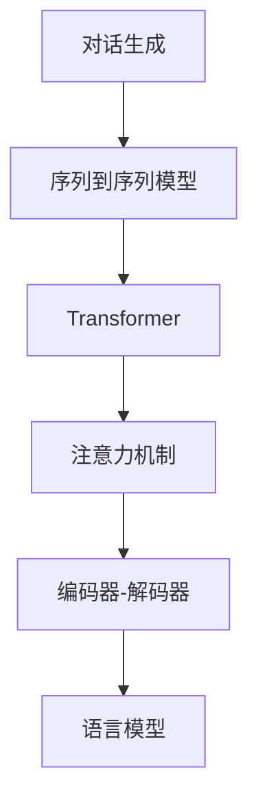
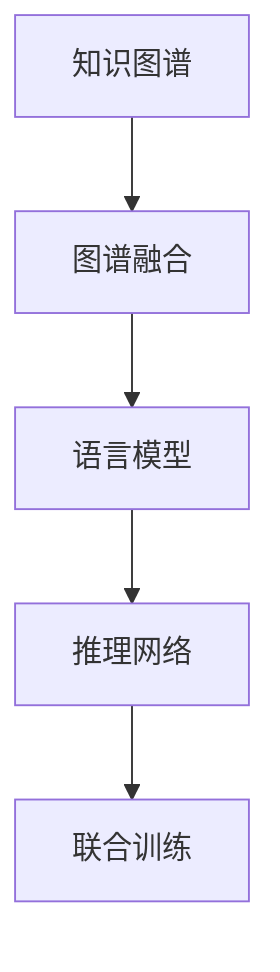
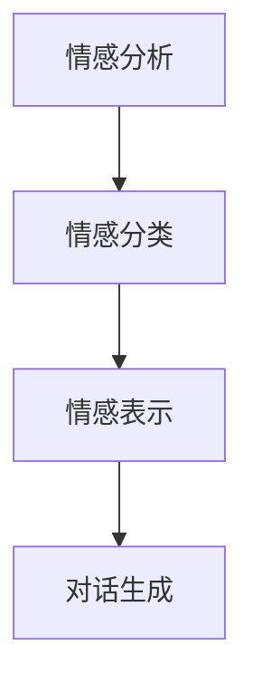
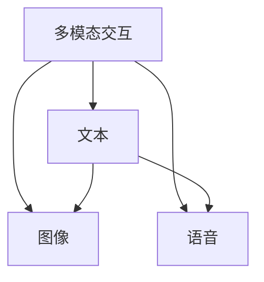
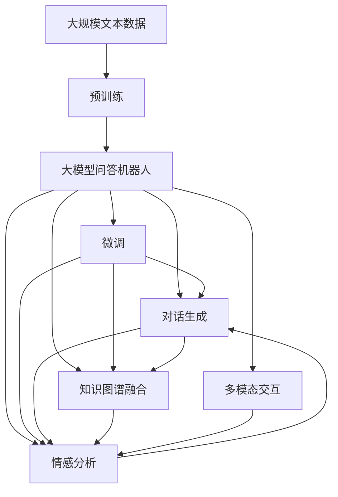

                 

# 大模型问答机器人的自然互动

> 关键词：大模型问答、自然语言处理、深度学习、预训练、微调、对话生成、用户交互、多轮对话、知识图谱、语义理解、情感识别

## 1. 背景介绍

### 1.1 问题由来

随着人工智能技术的快速发展，智能问答机器人成为越来越多企业和机构的关注焦点。智能问答不仅能够及时解答用户的查询，还能提供个性化、多轮对话的支持。而大模型问答机器人正是在这一背景下应运而生，它通过深度学习和大规模预训练，具备了强大的语义理解能力和知识管理能力。

近年来，大模型问答机器人在金融、医疗、教育等多个领域展示了其卓越的性能。在金融行业，智能问答机器人能够快速解答用户关于投资、理财等方面的问题；在医疗领域，智能问答机器人可以提供疾病诊断、治疗建议等专业服务；在教育领域，智能问答机器人能够回答学生关于课程内容、考试准备等方面的问题。

然而，尽管大模型问答机器人在各个领域展示了出色的应用效果，但仍存在一些挑战。其中，如何实现自然互动，即构建一个与人类无异、友好且高效的对话系统，是当前研究的重点和难点。

### 1.2 问题核心关键点

大模型问答机器人自然互动的核心在于构建一个具备以下特征的对话系统：

1. **语义理解能力强**：能够准确理解用户的意图和需求。
2. **知识丰富且更新及时**：具备广泛的知识库和动态更新的能力。
3. **多轮对话流畅**：能够支持多轮对话，保持对话连贯性。
4. **情感识别与回应**：能够识别用户的情感，并作出适当的回应。

要实现上述特征，大模型问答机器人通常需要采用以下技术：

1. **预训练与微调**：在大规模无标签文本数据上进行预训练，在特定领域或任务上进行调整。
2. **对话生成技术**：如序列到序列模型、Transformer等，生成连贯的对话。
3. **知识图谱融合**：将知识图谱与语言模型结合，提高知识获取和推理能力。
4. **情感分析**：通过情感分类模型识别用户情感，提供情感化的对话。
5. **多模态输入输出**：结合文本、图像、语音等多模态数据，提升交互体验。

### 1.3 问题研究意义

大模型问答机器人的自然互动技术，对于提升用户体验、拓展应用场景、推动智能技术落地具有重要意义：

1. **提升用户体验**：自然互动的问答系统能够提供更加友好、高效的交互方式，使用户获得更好的体验。
2. **拓展应用场景**：在医疗、金融、教育等垂直领域，通过自然互动的问答系统，能够提供更加专业的服务。
3. **推动智能技术落地**：自然互动的问答系统是实现人工智能技术实际应用的重要一环，能够为更多场景提供解决方案。

## 2. 核心概念与联系

### 2.1 核心概念概述

为更好地理解大模型问答机器人自然互动的实现机制，本节将介绍几个密切相关的核心概念：

- **大模型问答机器人**：基于深度学习模型（如BERT、GPT等）构建的智能问答系统，具备强大的语义理解能力和知识管理能力。
- **预训练与微调**：在大规模无标签文本数据上进行预训练，在特定领域或任务上进行微调，优化模型性能。
- **对话生成**：通过序列到序列模型、Transformer等技术，生成连贯的对话。
- **知识图谱**：将结构化的知识表示为图谱形式，便于语言模型进行知识获取和推理。
- **情感分析**：通过情感分类模型识别用户情感，提供情感化的对话。
- **多模态交互**：结合文本、图像、语音等多模态数据，提升交互体验。

这些概念之间的逻辑关系可以通过以下Mermaid流程图来展示：



这个流程图展示了大模型问答机器人的核心概念及其之间的关系：

1. 大模型问答机器人通过预训练获得基础能力。
2. 微调是对预训练模型进行任务特定的优化，以适应特定领域或任务。
3. 对话生成技术实现多轮对话，保持对话连贯性。
4. 知识图谱融合提升知识获取和推理能力。
5. 情感分析技术实现情感识别与回应。
6. 多模态交互技术提升交互体验。

这些核心概念共同构成了大模型问答机器人的实现框架，使其能够在各种场景下提供高效、智能的问答服务。

### 2.2 概念间的关系

这些核心概念之间存在着紧密的联系，形成了大模型问答机器人的完整生态系统。下面我们通过几个Mermaid流程图来展示这些概念之间的关系。

#### 2.2.1 大模型问答机器人的学习范式



这个流程图展示了大模型问答机器人的三种主要学习范式：

1. 大模型问答机器人通过预训练获得基础能力。
2. 微调是对预训练模型进行任务特定的优化，以适应特定领域或任务。
3. 对话生成技术实现多轮对话，保持对话连贯性。
4. 知识图谱融合提升知识获取和推理能力。
5. 情感分析技术实现情感识别与回应。
6. 多模态交互技术提升交互体验。

#### 2.2.2 预训练与微调的关系


这个流程图展示了预训练与微调的关系：

1. 预训练通过在大规模无标签文本数据上进行自监督学习，获得通用的语言表示。
2. 微调在大规模预训练的基础上，对特定领域或任务进行优化，以提升模型性能。
3. 下游任务是微调的目标，如问答、对话生成、情感分析等。

#### 2.2.3 对话生成方法



这个流程图展示了对话生成的方法：

1. 对话生成技术通过序列到序列模型实现，其中Transformer是主要的模型结构。
2. Transformer中的注意力机制用于处理多轮对话中的上下文信息。
3. 编码器-解码器结构实现对话的生成过程。
4. 语言模型用于生成最终的对话文本。

#### 2.2.4 知识图谱与语言模型结合



这个流程图展示了知识图谱与语言模型结合的方法：

1. 知识图谱表示为图谱形式，通过图谱融合技术将其与语言模型结合。
2. 语言模型用于理解用户查询，并从知识图谱中获取相关信息。
3. 推理网络用于处理图谱中的推理关系，提高知识获取的准确性。
4. 联合训练保证图谱融合与语言模型的协同工作。

#### 2.2.5 情感分析流程



这个流程图展示了情感分析的流程：

1. 情感分析通过情感分类模型识别用户的情感。
2. 情感表示用于生成情感化的对话。
3. 对话生成技术将情感信息融入到对话中，提高用户体验。

#### 2.2.6 多模态交互方法



这个流程图展示了多模态交互的方法：

1. 多模态交互技术结合文本、图像、语音等多模态数据，提升交互体验。
2. 文本、图像、语音数据分别进行处理和融合。
3. 多模态数据的融合用于生成最终的对话。

### 2.3 核心概念的整体架构

最后，我们用一个综合的流程图来展示这些核心概念在大模型问答机器人自然互动过程中的整体架构：



这个综合流程图展示了从预训练到自然互动的完整过程。大模型问答机器人首先在大规模文本数据上进行预训练，然后通过微调和对话生成技术实现自然互动，通过知识图谱融合和情感分析技术提升性能，通过多模态交互技术提升用户体验。通过这些核心概念的协同工作，大模型问答机器人能够提供高效、智能的问答服务。

## 3. 核心算法原理 & 具体操作步骤
### 3.1 算法原理概述

大模型问答机器人的自然互动过程，本质上是一个多任务学习框架。其核心思想是：将预训练的大模型视作一个强大的"特征提取器"，通过在有标注的对话数据上进行微调，使得模型能够理解用户意图、获取知识、生成连贯的对话、进行情感识别等，从而实现自然互动。

形式化地，假设预训练模型为 $M_{\theta}$，其中 $\theta$ 为预训练得到的模型参数。给定一个问答对话 $D=\{(x_i, y_i)\}_{i=1}^N$，其中 $x_i$ 为查询，$y_i$ 为对应的答案。微调的目标是找到新的模型参数 $\hat{\theta}$，使得模型在回答查询时能够尽可能接近真实答案 $y_i$。

通过梯度下降等优化算法，微调过程不断更新模型参数 $\theta$，最小化损失函数 $\mathcal{L}(M_{\theta}, D)$，使得模型输出逼近真实答案。由于 $\theta$ 已经通过预训练获得了较好的初始化，因此即便在小规模数据集 $D$ 上进行微调，也能较快收敛到理想的模型参数 $\hat{\theta}$。

### 3.2 算法步骤详解

大模型问答机器人的自然互动过程包括以下几个关键步骤：

**Step 1: 准备预训练模型和数据集**
- 选择合适的预训练语言模型 $M_{\theta}$ 作为初始化参数，如 BERT、GPT等。
- 准备问答对话数据集 $D$，划分为训练集、验证集和测试集。一般要求标注数据与预训练数据的分布不要差异过大。

**Step 2: 设计任务适配层**
- 根据问答任务类型，在预训练模型顶层设计合适的输出层和损失函数。
- 对于问答任务，通常在顶层添加线性分类器和交叉熵损失函数。
- 对于对话生成任务，通常使用语言模型的解码器输出概率分布，并以负对数似然为损失函数。

**Step 3: 设置微调超参数**
- 选择合适的优化算法及其参数，如 AdamW、SGD 等，设置学习率、批大小、迭代轮数等。
- 设置正则化技术及强度，包括权重衰减、Dropout、Early Stopping 等。
- 确定冻结预训练参数的策略，如仅微调顶层，或全部参数都参与微调。

**Step 4: 执行梯度训练**
- 将训练集数据分批次输入模型，前向传播计算损失函数。
- 反向传播计算参数梯度，根据设定的优化算法和学习率更新模型参数。
- 周期性在验证集上评估模型性能，根据性能指标决定是否触发 Early Stopping。
- 重复上述步骤直到满足预设的迭代轮数或 Early Stopping 条件。

**Step 5: 测试和部署**
- 在测试集上评估微调后模型 $M_{\hat{\theta}}$ 的性能，对比微调前后的精度提升。
- 使用微调后的模型对新样本进行推理预测，集成到实际的应用系统中。
- 持续收集新的对话数据，定期重新微调模型，以适应数据分布的变化。

以上是基于监督学习的大模型问答机器人自然互动的一般流程。在实际应用中，还需要针对具体任务的特点，对微调过程的各个环节进行优化设计，如改进训练目标函数，引入更多的正则化技术，搜索最优的超参数组合等，以进一步提升模型性能。

### 3.3 算法优缺点

大模型问答机器人自然互动方法具有以下优点：

1. 简单高效。只需准备少量标注数据，即可对预训练模型进行快速适配，获得较大的性能提升。
2. 通用适用。适用于各种NLP下游任务，包括问答、对话生成、情感分析等，设计简单的任务适配层即可实现自然互动。
3. 参数高效。利用参数高效微调技术，在固定大部分预训练参数的情况下，仍可取得不错的提升。
4. 效果显著。在学术界和工业界的诸多任务上，基于微调的方法已经刷新了最先进的性能指标。

同时，该方法也存在一定的局限性：

1. 依赖标注数据。微调的效果很大程度上取决于标注数据的质量和数量，获取高质量标注数据的成本较高。
2. 迁移能力有限。当目标任务与预训练数据的分布差异较大时，微调的性能提升有限。
3. 负面效果传递。预训练模型的固有偏见、有害信息等，可能通过微调传递到下游任务，造成负面影响。
4. 可解释性不足。微调模型的决策过程通常缺乏可解释性，难以对其推理逻辑进行分析和调试。

尽管存在这些局限性，但就目前而言，基于监督学习的自然互动方法仍是大模型问答机器人的主流范式。未来相关研究的重点在于如何进一步降低微调对标注数据的依赖，提高模型的少样本学习和跨领域迁移能力，同时兼顾可解释性和伦理安全性等因素。

### 3.4 算法应用领域

大模型问答机器人自然互动方法在NLP领域已经得到了广泛的应用，覆盖了几乎所有常见任务，例如：

- 问答系统：对自然语言问题给出答案。将问题-答案对作为微调数据，训练模型学习匹配答案。
- 对话系统：使机器能够与人自然对话。将多轮对话历史作为上下文，微调模型进行回复生成。
- 摘要生成：将长文本压缩成简短摘要。将文章-摘要对作为微调数据，使模型学习抓取要点。
- 翻译系统：将源语言文本翻译成目标语言。通过微调使模型学习语言-语言映射。
- 情感分析：识别文本中表达的情感。通过微调使模型掌握情感分类。

除了上述这些经典任务外，大模型问答机器人自然互动方法也被创新性地应用到更多场景中，如可控文本生成、常识推理、代码生成、数据增强等，为NLP技术带来了全新的突破。随着预训练模型和微调方法的不断进步，相信NLP技术将在更广阔的应用领域大放异彩。

## 4. 数学模型和公式 & 详细讲解 & 举例说明
### 4.1 数学模型构建

本节将使用数学语言对大模型问答机器人自然互动过程进行更加严格的刻画。

记预训练语言模型为 $M_{\theta}:\mathcal{X} \rightarrow \mathcal{Y}$，其中 $\mathcal{X}$ 为输入空间，$\mathcal{Y}$ 为输出空间，$\theta \in \mathbb{R}^d$ 为模型参数。假设微调任务的训练集为 $D=\{(x_i,y_i)\}_{i=1}^N, x_i \in \mathcal{X}, y_i \in \mathcal{Y}$。

定义模型 $M_{\theta}$ 在输入 $x$ 上的损失函数为 $\ell(M_{\theta}(x),y)$，则在数据集 $D$ 上的经验风险为：

$$
\mathcal{L}(\theta) = \frac{1}{N} \sum_{i=1}^N \ell(M_{\theta}(x_i),y_i)
$$

微调的优化目标是最小化经验风险，即找到最优参数：

$$
\theta^* = \mathop{\arg\min}_{\theta} \mathcal{L}(\theta)
$$

在实践中，我们通常使用基于梯度的优化算法（如SGD、Adam等）来近似求解上述最优化问题。设 $\eta$ 为学习率，$\lambda$ 为正则化系数，则参数的更新公式为：

$$
\theta \leftarrow \theta - \eta \nabla_{\theta}\mathcal{L}(\theta) - \eta\lambda\theta
$$

其中 $\nabla_{\theta}\mathcal{L}(\theta)$ 为损失函数对参数 $\theta$ 的梯度，可通过反向传播算法高效计算。

### 4.2 公式推导过程

以下我们以问答系统为例，推导交叉熵损失函数及其梯度的计算公式。

假设模型 $M_{\theta}$ 在输入 $x$ 上的输出为 $\hat{y}=M_{\theta}(x) \in [0,1]$，表示样本属于正类的概率。真实标签 $y \in \{0,1\}$。则二分类交叉熵损失函数定义为：

$$
\ell(M_{\theta}(x),y) = -[y\log \hat{y} + (1-y)\log (1-\hat{y})]
$$

将其代入经验风险公式，得：

$$
\mathcal{L}(\theta) = -\frac{1}{N}\sum_{i=1}^N [y_i\log M_{\theta}(x_i)+(1-y_i)\log(1-M_{\theta}(x_i))]
$$

根据链式法则，损失函数对参数 $\theta_k$ 的梯度为：

$$
\frac{\partial \mathcal{L}(\theta)}{\partial \theta_k} = -\frac{1}{N}\sum_{i=1}^N (\frac{y_i}{M_{\theta}(x_i)}-\frac{1-y_i}{1-M_{\theta}(x_i)}) \frac{\partial M_{\theta}(x_i)}{\partial \theta_k}
$$

其中 $\frac{\partial M_{\theta}(x_i)}{\partial \theta_k}$ 可进一步递归展开，利用自动微分技术完成计算。

在得到损失函数的梯度后，即可带入参数更新公式，完成模型的迭代优化。重复上述过程直至收敛，最终得到适应下游任务的最优模型参数 $\theta^*$。

## 5. 项目实践：代码实例和详细解释说明
### 5.1 开发环境搭建

在进行自然互动实践前，我们需要准备好开发环境。以下是使用Python进行PyTorch开发的环境配置流程：

1. 安装Anaconda：从官网下载并安装Anaconda，用于创建独立的Python环境。

2. 创建并激活虚拟环境：
```bash
conda create -n pytorch-env python=3.8 
conda activate pytorch-env
```

3. 安装PyTorch：根据CUDA版本，从官网获取对应的安装命令。例如：
```bash
conda install pytorch torchvision torchaudio cudatoolkit=11.1 -c pytorch -c conda-forge
```

4. 安装Transformers库：
```bash
pip install transformers
```

5. 安装各类工具包：
```bash
pip install numpy pandas scikit-learn matplotlib tqdm jupyter notebook ipython
```

完成上述步骤后，即可在`pytorch-env`环境中开始自然互动实践。

### 5.2 源代码详细实现

下面我以一个简单的问答系统为例，给出使用Transformers库对BERT模型进行自然互动的PyTorch代码实现。

首先，定义问答系统的数据处理函数：

```python
from transformers import BertTokenizer
from torch.utils.data import Dataset
import torch

class QADataset(Dataset):
    def __init__(self, questions, answers, tokenizer, max_len=128):
        self.questions = questions
        self.answers = answers
        self.tokenizer = tokenizer
        self.max_len = max_len
        
    def __len__(self):
        return len(self.questions)
    
    def __getitem__(self, item):
        question = self.questions[item]
        answer = self.answers[item]
        
        encoding = self.tokenizer(question, return_tensors='pt', max_length=self.max_len, padding='max_length', truncation=True)
        input_ids = encoding['input_ids'][0]
        attention_mask = encoding['attention_mask'][0]
        
        # 对answer进行编码
        answer_tokenizer = BertTokenizer.from_pretrained('bert-base-cased')
        answer = answer_tokenizer(answer, return_tensors='pt', max_length=self.max_len, padding='max_length', truncation=True)
        label_ids = answer['input_ids'][0]
        
        return {'input_ids': input_ids, 
                'attention_mask': attention_mask,
                'labels': label_ids}

# 加载数据集
tokenizer = BertTokenizer.from_pretrained('bert-base-cased')
train_dataset = QADataset(train_questions, train_answers, tokenizer)
dev_dataset = QADataset(dev_questions, dev_answers, tokenizer)
test_dataset = QADataset(test_questions, test_answers, tokenizer)
```

然后，定义模型和优化器：

```python
from transformers import BertForQuestionAnswering, AdamW

model = BertForQuestionAnswering.from_pretrained('bert-base-cased')
optimizer = AdamW(model.parameters(), lr=2e-5)
```

接着，定义训练和评估函数：

```python
from torch.utils.data import DataLoader
from tqdm import tqdm
from sklearn.metrics import precision_recall_fscore_support

device = torch.device('cuda') if torch.cuda.is_available() else torch.device('cpu')
model.to(device)

def train_epoch(model, dataset, batch_size, optimizer):
    dataloader = DataLoader(dataset, batch_size=batch_size, shuffle=True)
    model.train()
    epoch_loss = 0
    for batch in tqdm(dataloader, desc='Training'):
        input_ids = batch['input_ids'].to(device)
        attention_mask = batch['attention_mask'].to(device)
        labels = batch['labels'].to(device)
        model.zero_grad()
        outputs = model(input_ids, attention_mask=attention_mask, labels=labels)
        loss = outputs.loss
        epoch_loss += loss.item()
        loss.backward()
        optimizer.step()
    return epoch_loss / len(dataloader)

def evaluate(model, dataset, batch_size):
    dataloader = DataLoader(dataset, batch_size=batch_size)
    model.eval()
    preds, labels = [], []
    with torch.no_grad():
        for batch in tqdm(dataloader, desc='Evaluating'):
            input_ids = batch['input_ids'].to(device)
            attention_mask = batch['attention_mask'].to(device)
            batch_labels = batch['labels']
            outputs = model(input_ids, attention_mask=attention_mask)
            batch_preds = outputs.logits.argmax(dim=2).to('cpu').tolist()
            batch_labels = batch_labels.to('cpu').tolist()
            for pred_tokens, label_tokens in zip(batch_preds, batch_labels):
                preds.append(pred_tokens)
                labels.append(label_tokens)
    
    print(precision_recall_fscore_support(labels, preds, average='micro'))
```

最后，启动训练流程并在测试集上评估：

```python
epochs = 5
batch_size = 16

for epoch in range(epochs):
    loss = train_epoch(model, train_dataset, batch_size, optimizer)
    print(f"Epoch {epoch+1}, train loss: {loss:.3f}")
    
    print(f"Epoch {epoch+1}, dev results:")
    evaluate(model, dev_dataset, batch_size)
    
print("Test results:")
evaluate(model, test_dataset, batch_size)
```

以上就是使用PyTorch对BERT进行问答系统自然互动的完整代码实现。可以看到，得益于Transformers库的强大封装，我们可以用相对简洁的代码完成BERT模型的加载和微调。

### 5.3 代码解读与分析

让我们再详细解读一下关键代码的实现细节：

**QADataset类**：
- `__init__`方法：初始化问题和答案，分词器等关键组件。
- `__len__`方法：返回数据集的样本数量。
- `__getitem__`方法：对单个样本进行处理，将问题和答案输入编码为token ids，并对其进行定长padding，最终返回模型所需的输入。

**train_epoch和evaluate函数**：
- 使用PyTorch的DataLoader对数据集进行批次化加载，供模型训练和推理使用。
- 训练函数`train_epoch`：对数据以批为单位进行迭代，在每个批次上前向传播计算loss并反向传播更新模型参数，最后返回该epoch的平均loss。
- 评估函数`evaluate`：与训练类似，不同点在于不更新模型参数，并在每个batch结束后将预测和标签结果存储下来，最后使用sklearn的precision_recall

