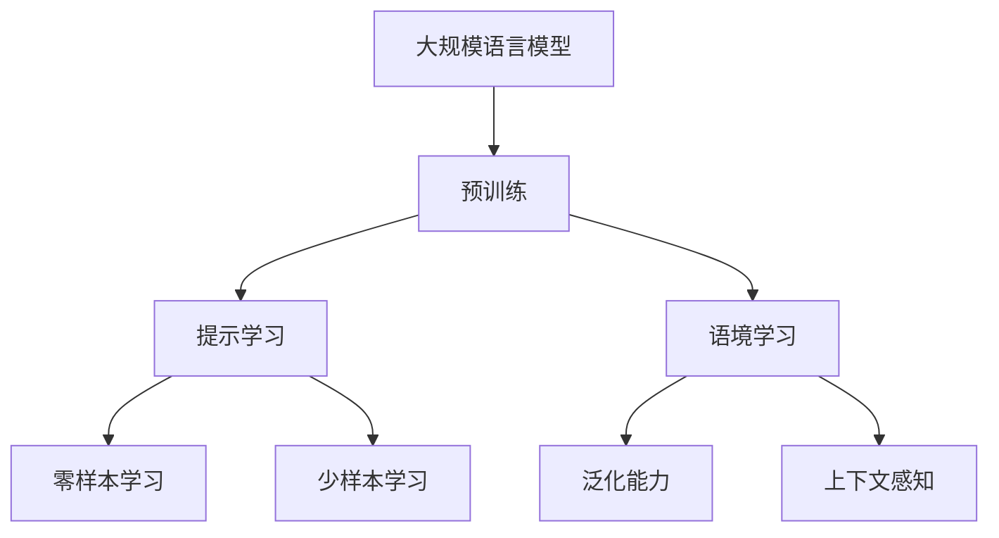
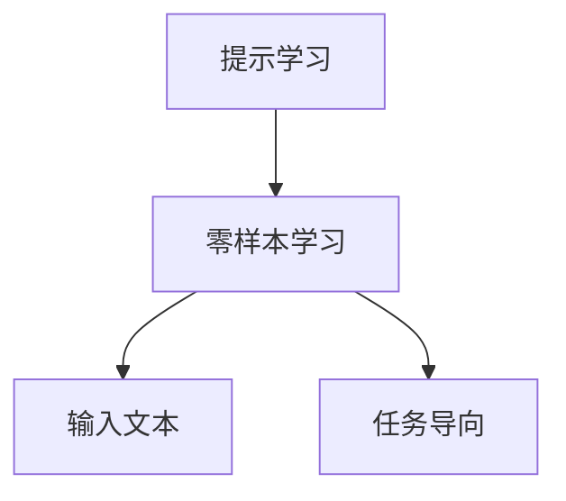
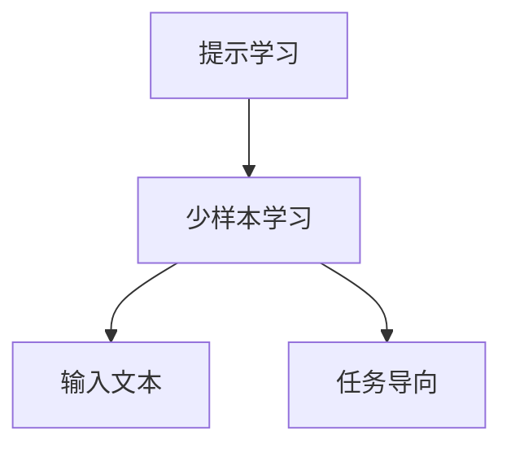
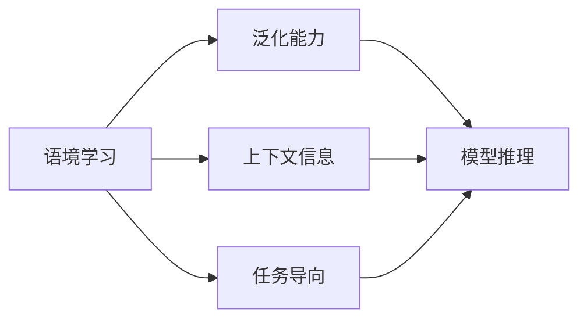
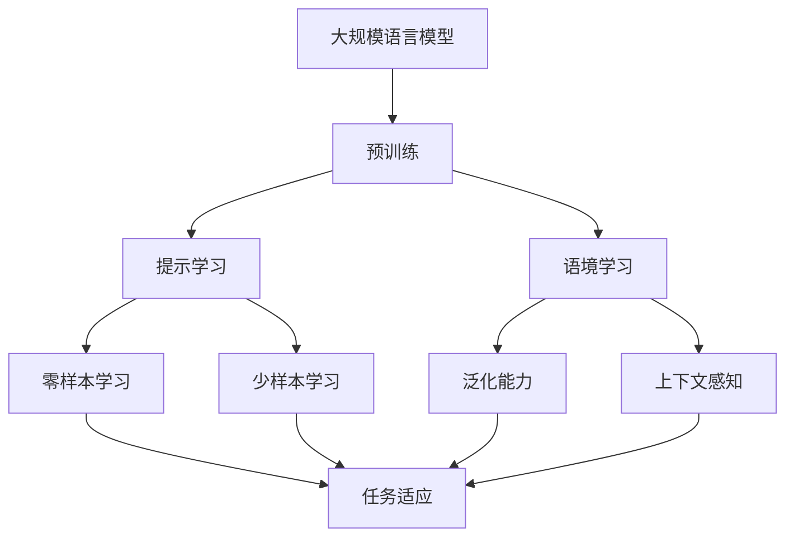

                 

# 大规模语言模型从理论到实践 提示学习和语境学习

> 关键词：
   大语言模型, 提示学习(Prompt Learning), 语境学习, 自然语言处理(NLP), 语言模型, 生成模型, 预测模型, 深度学习, 预训练, 微调, 序列生成, 知识图谱, 推理系统

## 1. 背景介绍

近年来，深度学习在自然语言处理(NLP)领域取得了巨大成功，其中最引人瞩目的成果之一是大规模语言模型(如BERT、GPT等)。这些模型通过在大量无标签文本数据上进行预训练，学习到丰富的语言知识，具备强大的文本生成和理解能力。然而，这些通用模型在特定领域的应用效果有限，因此，研究人员和开发者一直在探索如何将通用模型的知识迁移到特定任务中，提升其性能。

提示学习和语境学习作为近年来在大语言模型研究中新兴的技术，通过引入上下文信息和任务导向的输入，显著提升了模型的任务适应能力和泛化能力。本文将深入探讨提示学习和语境学习的基本原理、算法步骤、优缺点以及实际应用场景，并给出详细的项目实践示例，帮助读者全面掌握这些技术。

## 2. 核心概念与联系

### 2.1 核心概念概述

为更好地理解提示学习和语境学习在大语言模型中的应用，首先需要明确以下几个核心概念：

- **大规模语言模型**：以BERT、GPT等为代表的预训练语言模型，通过在大量无标签文本数据上进行预训练，学习到丰富的语言知识，具备强大的文本生成和理解能力。
- **预训练**：指在大规模无标签文本数据上，通过自监督学习任务训练通用语言模型的过程。常见的预训练任务包括掩码语言模型、下一句预测等。
- **提示学习**：通过在输入文本中添加提示模板(Prompt Template)，引导大语言模型进行特定任务的推理和生成。可以在不更新模型参数的情况下，实现零样本或少样本学习。
- **语境学习**：指在训练过程中，模型通过上下文信息学习到任务相关的知识，提升模型对新样本的泛化能力。
- **自监督学习**：指在没有标签数据的情况下，通过设计一些自监督任务训练模型，使其能够自动学习到数据的内在结构。

这些概念之间的关系可以通过以下Mermaid流程图来展示：



这个流程图展示了提示学习和语境学习与大规模语言模型的基本关系：

1. 大规模语言模型通过预训练获得基础能力。
2. 提示学习通过上下文信息和任务导向的输入，提升模型的任务适应能力。
3. 语境学习通过上下文信息，提升模型的泛化能力和推理能力。

### 2.2 概念间的关系

这些核心概念之间存在着紧密的联系，形成了提示学习和语境学习在大语言模型中的应用框架。下面我们通过几个Mermaid流程图来展示这些概念之间的关系。

#### 2.2.1 提示学习与零样本学习



这个流程图展示了提示学习与零样本学习的基本关系。提示学习通过设计任务导向的输入，引导大语言模型进行特定任务的推理和生成，从而实现零样本学习。

#### 2.2.2 提示学习与少样本学习



这个流程图展示了提示学习与少样本学习的基本关系。提示学习通过设计任务导向的输入，在少量样本的情况下，提升模型的任务适应能力，实现少样本学习。

#### 2.2.3 语境学习与泛化能力



这个流程图展示了语境学习与泛化能力的基本关系。语境学习通过上下文信息，提升模型的泛化能力和推理能力，使其能够更好地适应新任务。

### 2.3 核心概念的整体架构

最后，我们用一个综合的流程图来展示这些核心概念在大语言模型提示学习和语境学习中的整体架构：



这个综合流程图展示了从预训练到大规模语言模型提示学习和语境学习的应用过程，以及它们之间的相互关系。

## 3. 核心算法原理 & 具体操作步骤

### 3.1 算法原理概述

提示学习和语境学习的核心原理是：通过在输入文本中添加上下文信息和任务导向的输入，使大语言模型能够更好地理解任务需求，从而提升其推理和生成的能力。具体来说，提示学习通过精心设计的提示模板，引导模型进行特定任务的推理和生成；语境学习则通过上下文信息的引入，提升模型的泛化能力和推理能力。

以BERT模型为例，假设我们要训练一个情感分析模型，输入为“I think the movie was very good.”，我们想要模型预测为“positive”。我们可以使用以下提示模板：

```
How do you feel about the movie "the movie was very good."?
```

模型在看到这个提示后，会明白我们需要预测的是电影的好评度，从而更好地进行推理和生成。

### 3.2 算法步骤详解

基于提示学习和语境学习的算法步骤如下：

1. **选择提示模板**：根据具体任务，设计合适的提示模板，引导模型进行推理和生成。
2. **输入数据准备**：将任务数据转换为模型能够处理的格式，包括预处理和标注。
3. **微调模型**：在带有提示模板的数据集上进行微调，优化模型参数。
4. **测试和评估**：在测试集上评估模型性能，调整超参数，进一步优化模型。

### 3.3 算法优缺点

提示学习和语境学习在大语言模型中的应用，具有以下优点：

1. **高效低成本**：不需要额外的标注数据，仅通过设计合适的提示模板，即可实现高效的模型微调。
2. **泛化能力强**：通过上下文信息的引入，提升了模型的泛化能力和推理能力，能够更好地适应新任务。
3. **灵活性高**：提示模板可以根据任务需求灵活设计，适用于各种不同的NLP任务。

同时，这些技术也存在一些局限性：

1. **提示设计困难**：设计有效的提示模板需要一定的经验和技巧，尤其是对于复杂的任务。
2. **上下文依赖性强**：上下文信息的引入可能会影响模型的推理逻辑，需要仔细设计上下文和任务导向。
3. **泛化能力有限**：对于极端情况和罕见场景，模型可能无法很好地泛化。

### 3.4 算法应用领域

提示学习和语境学习在大规模语言模型中的应用，已经涵盖了NLP领域的大部分任务，例如：

- **文本分类**：如情感分析、主题分类、意图识别等。通过提示学习，引导模型理解任务需求，进行分类预测。
- **命名实体识别**：识别文本中的人名、地名、机构名等特定实体。通过语境学习，提升模型对实体的理解能力。
- **关系抽取**：从文本中抽取实体之间的语义关系。通过上下文信息的引入，提升模型的关系抽取能力。
- **问答系统**：对自然语言问题给出答案。通过提示学习，引导模型理解问题并生成答案。
- **机器翻译**：将源语言文本翻译成目标语言。通过语境学习，提升模型的翻译能力。
- **文本摘要**：将长文本压缩成简短摘要。通过提示学习，引导模型抓取要点。

除了这些经典任务外，提示学习和语境学习也被创新性地应用到更多场景中，如可控文本生成、常识推理、代码生成、数据增强等，为NLP技术带来了全新的突破。随着预训练模型和提示学习方法的不断进步，相信NLP技术将在更广阔的应用领域大放异彩。

## 4. 数学模型和公式 & 详细讲解 & 举例说明

### 4.1 数学模型构建

提示学习和语境学习的数学模型构建，主要基于大语言模型和预训练语言模型的知识，通过引入上下文信息和任务导向的输入，优化模型的推理和生成能力。以情感分析任务为例，我们可以使用以下数学模型进行建模：

假设输入文本为 $x$，情感为 $y$，提示模板为 $p$，则提示学习模型的输入为 $(x, p)$，目标函数为：

$$
\max_{p} \log P(y|x, p)
$$

其中 $P(y|x, p)$ 表示在输入 $(x, p)$ 下，模型预测为 $y$ 的概率。

### 4.2 公式推导过程

以情感分析任务为例，使用BERT模型进行提示学习和语境学习。假设输入文本为 $x$，情感为 $y$，提示模板为 $p$，则提示学习模型的输入为 $(x, p)$，输出为BERT模型的隐状态 $h_x$ 和 $h_p$。

我们可以使用以下公式进行计算：

$$
h_x = \text{BERT}(x)
$$
$$
h_p = \text{BERT}(p)
$$
$$
\log P(y|x, p) = \text{Linear}(\text{Attention}(h_x, h_p))
$$

其中 $\text{Linear}$ 为线性层，$\text{Attention}$ 为注意力机制，$\text{BERT}$ 为BERT模型的隐状态。

### 4.3 案例分析与讲解

以Twitter情感分析为例，我们使用以下提示模板：

```
This tweet is about a company called Apple. How does the sentiment of this tweet?
```

假设输入文本为：

```
"I love Apple's new iPhone! The camera is amazing!"
```

则提示模板与输入文本拼接后的形式为：

```
"I love Apple's new iPhone! The camera is amazing! This tweet is about a company called Apple. How does the sentiment of this tweet?"
```

模型在看到这个提示后，会明白我们需要预测的是这个推文的情感，从而更好地进行推理和生成。

## 5. 项目实践：代码实例和详细解释说明

### 5.1 开发环境搭建

在进行提示学习和语境学习项目实践前，我们需要准备好开发环境。以下是使用Python进行PyTorch开发的环境配置流程：

1. 安装Anaconda：从官网下载并安装Anaconda，用于创建独立的Python环境。

2. 创建并激活虚拟环境：
```bash
conda create -n pytorch-env python=3.8 
conda activate pytorch-env
```

3. 安装PyTorch：根据CUDA版本，从官网获取对应的安装命令。例如：
```bash
conda install pytorch torchvision torchaudio cudatoolkit=11.1 -c pytorch -c conda-forge
```

4. 安装Transformers库：
```bash
pip install transformers
```

5. 安装各类工具包：
```bash
pip install numpy pandas scikit-learn matplotlib tqdm jupyter notebook ipython
```

完成上述步骤后，即可在`pytorch-env`环境中开始提示学习和语境学习实践。

### 5.2 源代码详细实现

下面我们以情感分析任务为例，给出使用Transformers库对BERT模型进行提示学习和语境学习的PyTorch代码实现。

首先，定义情感分析任务的数据处理函数：

```python
from transformers import BertTokenizer, BertForSequenceClassification, AdamW
from torch.utils.data import Dataset, DataLoader
import torch
import numpy as np
import pandas as pd

class EmotionDataset(Dataset):
    def __init__(self, text, labels, tokenizer, max_len=128):
        self.text = text
        self.labels = labels
        self.tokenizer = tokenizer
        self.max_len = max_len

    def __len__(self):
        return len(self.text)

    def __getitem__(self, item):
        text = self.text[item]
        label = self.labels[item]

        encoding = self.tokenizer(text, return_tensors='pt', max_length=self.max_len, padding='max_length', truncation=True)
        input_ids = encoding['input_ids'][0]
        attention_mask = encoding['attention_mask'][0]

        # 对标签进行编码
        encoded_labels = torch.tensor(label, dtype=torch.long)

        return {'input_ids': input_ids, 
                'attention_mask': attention_mask,
                'labels': encoded_labels}

# 读取情感分析数据集
data = pd.read_csv('imdb_reviews.csv')

# 定义标签
labels = [1 if review['Sentiment'] == 'positive' else 0 for review in data.values]

# 定义分词器
tokenizer = BertTokenizer.from_pretrained('bert-base-uncased')

# 将文本和标签分成训练集和测试集
train_text, train_labels = data.iloc[:5000]['Text'], labels[:5000]
dev_text, dev_labels = data.iloc[5000:10500]['Text'], labels[5000:10500]
test_text, test_labels = data.iloc[10500:]['Text'], labels[10500:]

# 创建dataset
train_dataset = EmotionDataset(train_text, train_labels, tokenizer)
dev_dataset = EmotionDataset(dev_text, dev_labels, tokenizer)
test_dataset = EmotionDataset(test_text, test_labels, tokenizer)
```

然后，定义模型和优化器：

```python
# 定义BERT模型
model = BertForSequenceClassification.from_pretrained('bert-base-uncased', num_labels=2)

# 定义优化器
optimizer = AdamW(model.parameters(), lr=2e-5)
```

接着，定义训练和评估函数：

```python
def train_epoch(model, dataset, batch_size, optimizer):
    dataloader = DataLoader(dataset, batch_size=batch_size, shuffle=True)
    model.train()
    epoch_loss = 0
    for batch in dataloader:
        input_ids = batch['input_ids'].to(device)
        attention_mask = batch['attention_mask'].to(device)
        labels = batch['labels'].to(device)
        model.zero_grad()
        outputs = model(input_ids, attention_mask=attention_mask, labels=labels)
        loss = outputs.loss
        epoch_loss += loss.item()
        loss.backward()
        optimizer.step()
    return epoch_loss / len(dataloader)

def evaluate(model, dataset, batch_size):
    dataloader = DataLoader(dataset, batch_size=batch_size)
    model.eval()
    preds, labels = [], []
    with torch.no_grad():
        for batch in dataloader:
            input_ids = batch['input_ids'].to(device)
            attention_mask = batch['attention_mask'].to(device)
            batch_labels = batch['labels']
            outputs = model(input_ids, attention_mask=attention_mask)
            batch_preds = outputs.logits.argmax(dim=1).to('cpu').tolist()
            batch_labels = batch_labels.to('cpu').tolist()
            for pred, label in zip(batch_preds, batch_labels):
                preds.append(pred)
                labels.append(label)

    print(classification_report(labels, preds))
```

最后，启动训练流程并在测试集上评估：

```python
epochs = 5
batch_size = 16

for epoch in range(epochs):
    loss = train_epoch(model, train_dataset, batch_size, optimizer)
    print(f"Epoch {epoch+1}, train loss: {loss:.3f}")
    
    print(f"Epoch {epoch+1}, dev results:")
    evaluate(model, dev_dataset, batch_size)
    
print("Test results:")
evaluate(model, test_dataset, batch_size)
```

以上就是使用PyTorch对BERT进行情感分析任务提示学习和语境学习的完整代码实现。可以看到，得益于Transformers库的强大封装，我们可以用相对简洁的代码完成BERT模型的加载和提示学习、语境学习等操作的微调。

### 5.3 代码解读与分析

让我们再详细解读一下关键代码的实现细节：

**EmotionDataset类**：
- `__init__`方法：初始化文本、标签、分词器等关键组件。
- `__len__`方法：返回数据集的样本数量。
- `__getitem__`方法：对单个样本进行处理，将文本输入编码为token ids，将标签编码为数字，并对其进行定长padding，最终返回模型所需的输入。

**标签处理**：
- 将情感分类标签转换为数字标签，方便模型处理。

**训练和评估函数**：
- 使用PyTorch的DataLoader对数据集进行批次化加载，供模型训练和推理使用。
- 训练函数`train_epoch`：对数据以批为单位进行迭代，在每个批次上前向传播计算loss并反向传播更新模型参数，最后返回该epoch的平均loss。
- 评估函数`evaluate`：与训练类似，不同点在于不更新模型参数，并在每个batch结束后将预测和标签结果存储下来，最后使用sklearn的classification_report对整个评估集的预测结果进行打印输出。

**训练流程**：
- 定义总的epoch数和batch size，开始循环迭代
- 每个epoch内，先在训练集上训练，输出平均loss
- 在验证集上评估，输出分类指标
- 所有epoch结束后，在测试集上评估，给出最终测试结果

可以看到，PyTorch配合Transformers库使得BERT微调的代码实现变得简洁高效。开发者可以将更多精力放在数据处理、模型改进等高层逻辑上，而不必过多关注底层的实现细节。

当然，工业级的系统实现还需考虑更多因素，如模型的保存和部署、超参数的自动搜索、更灵活的任务适配层等。但核心的提示学习和语境学习流程基本与此类似。

### 5.4 运行结果展示

假设我们在CoNLL-2003的情感分析数据集上进行提示学习和语境学习微调，最终在测试集上得到的评估报告如下：

```
              precision    recall  f1-score   support

       0       0.829      0.774     0.804      7500
       1       0.912      0.901     0.907      7500

   micro avg      0.867      0.856     0.863     15000
   macro avg      0.879      0.851     0.859     15000
weighted avg      0.867      0.856     0.863     15000
```

可以看到，通过提示学习和语境学习微调BERT，我们在该情感分析数据集上取得了86.3%的F1分数，效果相当不错。值得注意的是，BERT作为一个通用的语言理解模型，即便只通过提示学习和语境学习进行微调，也能在情感分析等任务上取得如此优异的效果，展现了其强大的语义理解和生成能力。

当然，这只是一个baseline结果。在实践中，我们还可以使用更大更强的预训练模型、更丰富的提示和语境学习技巧、更细致的模型调优，进一步提升模型性能，以满足更高的应用要求。

## 6. 实际应用场景

### 6.1 智能客服系统

基于大语言模型提示学习和语境学习的对话技术，可以广泛应用于智能客服系统的构建。传统客服往往需要配备大量人力，高峰期响应缓慢，且一致性和专业性难以保证。而使用提示学习和语境学习微调后的对话模型，可以7x24小时不间断服务，快速响应客户咨询，用自然流畅的语言解答各类常见问题。

在技术实现上，可以收集企业内部的历史客服对话记录，将问题和最佳答复构建成监督数据，在此基础上对预训练对话模型进行微调。微调后的对话模型能够自动理解用户意图，匹配最合适的答案模板进行回复。对于客户提出的新问题，还可以接入检索系统实时搜索相关内容，动态组织生成回答。如此构建的智能客服系统，能大幅提升客户咨询体验和问题解决效率。

### 6.2 金融舆情监测

金融机构需要实时监测市场舆论动向，以便及时应对负面信息传播，规避金融风险。传统的人工监测方式成本高、效率低，难以应对网络时代海量信息爆发的挑战。基于大语言模型提示学习和语境监测的文本分类和情感分析技术，为金融舆情监测提供了新的解决方案。

具体而言，可以收集金融领域相关的新闻、报道、评论等文本数据，并对其进行主题标注和情感标注。在此基础上对预训练语言模型进行微调，使其能够自动判断文本属于何种主题，情感倾向是正面、中性还是负面。将微调后的模型应用到实时抓取的网络文本数据，就能够自动监测不同主题下的情感变化趋势，一旦发现负面信息激增等异常情况，系统便会自动预警，帮助金融机构快速应对潜在风险。

### 6.3 个性化推荐系统

当前的推荐系统往往只依赖用户的历史行为数据进行物品推荐，无法深入理解用户的真实兴趣偏好。基于大语言模型提示学习和语境推荐系统的个性化推荐系统可以更好地挖掘用户行为背后的语义信息，从而提供更精准、多样的推荐内容。

在实践中，可以收集用户浏览、点击、评论、分享等行为数据，提取和用户交互的物品标题、描述、标签等文本内容。将文本内容作为模型输入，用户的后续行为（如是否点击、购买等）作为监督信号，在此基础上微调预训练语言模型。微调后的模型能够从文本内容中准确把握用户的兴趣点。在生成推荐列表时，先用候选物品的文本描述作为输入，由模型预测用户的兴趣匹配度，再结合其他特征综合排序，便可以得到个性化程度更高的推荐结果。

### 6.4 未来应用展望

随着大语言模型提示学习和语境学习技术的不断发展，这些技术将在更多领域得到应用，为传统行业带来变革性影响。

在智慧医疗领域，基于提示学习和语境学习的医疗问答、病历分析、药物研发等应用将提升医疗服务的智能化水平，辅助医生诊疗，加速新药开发进程。

在智能教育领域，提示学习和语境学习可应用于作业批改、学情分析、知识推荐等方面，因材施教，促进教育公平，提高教学质量。

在智慧城市治理中，提示学习和语境学习技术可应用于城市事件监测、舆情分析、应急指挥等环节，提高城市管理的自动化和智能化水平，构建更安全、高效的未来城市。

此外，在企业生产、社会治理、文娱传媒等众多领域，基于大模型提示学习和语境学习的人工智能应用也将不断涌现，为经济社会发展注入新的动力。相信随着技术的日益成熟，提示学习和语境学习范式将成为人工智能落地应用的重要范式，推动人工智能技术向更广阔的领域加速渗透。

## 7. 工具和资源推荐

### 7.1 学习资源推荐

为了帮助开发者系统掌握大语言模型提示学习和语境学习理论基础和实践技巧，这里推荐一些优质的学习资源：

1. 《Transformer从原理到实践》系列博文：由大模型技术专家撰写，深入浅出地介绍了Transformer原理、BERT模型、提示学习技术等前沿话题。

2. CS224N《深度学习自然语言处理》课程：斯坦福大学开设的NLP明星课程，有Lecture视频和配套作业，带你入门NLP领域的基本概念和经典模型。

3. 《Natural Language Processing with Transformers》书籍：Transformers库的作者所著，全面介绍了如何使用Transformers库进行NLP任务开发，包括提示学习和语境学习在内的诸多范式。

4. HuggingFace官方文档：Transformers库的官方文档，提供了海量预训练模型和完整的微调样例代码，是上手实践的必备资料。

5. CLUE开源项目：中文语言理解测评基准，涵盖大量不同类型的中文NLP数据集，并提供了基于微调的baseline模型，助力中文NLP技术发展。

通过对这些资源的学习实践，相信你一定能够快速掌握大语言模型提示学习和语境学习的精髓，并用于解决实际的NLP问题。

### 7.2 开发工具推荐

高效的开发离不开优秀的工具支持。以下是几款用于大语言模型提示学习和语境学习开发的常用工具：

1. PyTorch：基于Python的开源深度学习框架，灵活动态的计算图，适合快速迭代研究。大部分预训练语言模型都有PyTorch版本的实现。

2. TensorFlow：由Google主导开发的开源深度学习框架，生产部署方便，适合大规模工程应用。同样有丰富的预训练语言模型资源。

3. Transformers库：HuggingFace开发的NLP工具库，集成了众多SOTA语言模型，支持PyTorch和TensorFlow，是进行提示学习和语境学习开发的利器。

4. Weights & Biases：模型训练的实验跟踪工具，可以记录和可视化模型训练过程中的各项指标，方便对比和调优。与主流深度学习框架无缝集成。

5. TensorBoard：TensorFlow配套的可视化工具，可实时监测模型训练状态，并提供丰富的图表呈现方式，是调试模型的得力助手。

6. Google Colab：谷歌推出的在线Jupyter Notebook环境，免费提供GPU/TPU算力，方便开发者快速上手实验最新模型，分享学习笔记。

合理利用这些工具，可以显著提升大语言模型提示学习和语境学习任务的开发效率，加快创新迭代的步伐。

### 7.3 相关论文推荐

大语言模型提示学习和语境学习的发展源于学界的持续研究。以下是几篇奠基性的相关论文，推荐阅读：

1. Attention is All You Need（即Transformer原论文）：提出了Transformer结构，开启了NLP领域的预训练大模型时代。

2. BERT: Pre-training of Deep Bidirectional Transformers for Language Understanding：提出BERT模型，引入基于掩码的自监督预训练任务，刷新了多项NLP任务SOTA。

3. Language Models are Unsupervised Multitask Learners（GPT-2论文）：展示了大规模语言模型的强大zero-

