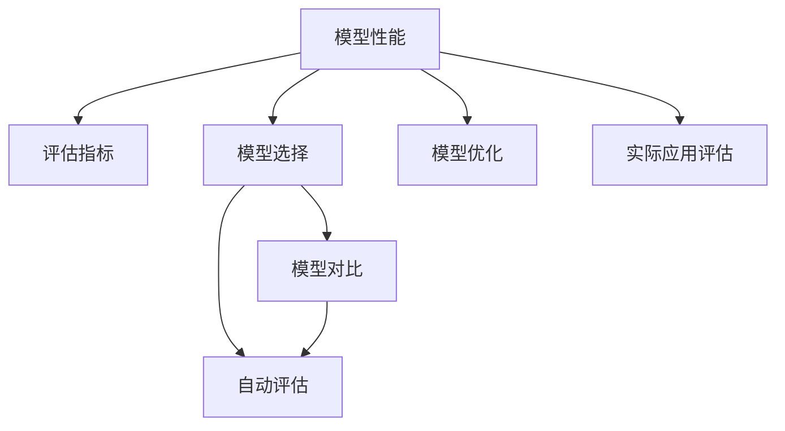

                 

# 大规模语言模型从理论到实践 模型评估概述

> 关键词：大规模语言模型,模型评估,模型选择,模型优化,模型对比,自动评估,实际应用

## 1. 背景介绍

### 1.1 问题由来
近年来，随着深度学习技术的迅速发展，大规模语言模型（LLMs）在自然语言处理（NLP）领域取得了显著突破。这些模型如GPT-3、BERT等，通过在大规模无标注文本数据上进行预训练，学习到了丰富的语言知识和常识。这些预训练模型在各种NLP任务上取得了前所未有的表现，如问答、情感分析、文本分类等。

然而，即便是性能最出色的模型，也难免存在一定的局限性。例如，当模型面对新任务或新领域时，其泛化能力可能受限。此外，模型可能存在一些无法解释的偏见和错误，这些问题需要通过严格的模型评估来解决。因此，模型评估在大规模语言模型的应用中具有重要意义。

### 1.2 问题核心关键点
模型评估的核心在于判断模型的性能和可靠性。评估可以基于预定义的性能指标和评估方法，通过实验和分析来量化模型在不同任务上的表现，并指导模型的优化和选择。

模型评估的关键点包括：
- **模型选择**：评估不同模型的性能，选择最优模型。
- **模型优化**：通过评估反馈，优化模型参数，提高性能。
- **模型对比**：比较不同模型之间的差异，选择合适的模型。
- **自动评估**：利用自动化工具评估模型，提高效率。
- **实际应用**：在实际应用中评估模型性能，指导模型优化和选择。

模型评估的重要性不仅体现在技术层面，还在于其对于业务决策的影响。一个性能优异的模型能够在实际应用中显著提高系统效率和用户体验。

### 1.3 问题研究意义
模型评估是构建和优化大规模语言模型的关键步骤，其研究意义包括：
- **优化模型性能**：通过评估结果指导模型优化，提高模型的准确性和可靠性。
- **选择最优模型**：基于评估结果选择最适用的模型，满足具体应用需求。
- **提升应用效果**：通过模型评估，确保模型在实际应用中表现稳定，提升用户体验。
- **推动技术发展**：评估结果可以为新的研究提供方向，推动NLP技术不断进步。
- **确保伦理安全**：评估模型偏见和错误，保障模型输出的公正性和安全性。

总之，模型评估是大规模语言模型应用不可或缺的一环，对于模型的优化和选择至关重要。

## 2. 核心概念与联系

### 2.1 核心概念概述

为深入理解模型评估的核心概念，本节将详细介绍一些关键术语和其联系。

- **模型性能**：模型在特定任务上的表现，通常通过一些指标（如准确率、召回率、F1分数等）来量化。
- **评估指标**：用于衡量模型性能的数值，如准确率（Accuracy）、精确率（Precision）、召回率（Recall）、F1分数（F1 Score）等。
- **模型选择**：基于评估结果选择性能最优的模型，通常通过交叉验证和模型对比来确定。
- **模型优化**：通过调整模型参数和结构，提升模型性能，通常包括超参数优化、正则化、对抗训练等技术。
- **模型对比**：比较不同模型在相同任务上的表现，选择最优模型，通常通过平均准确率、AUC等指标来衡量。
- **自动评估**：利用自动化工具评估模型，提高评估效率，通常包括测试集划分、评估工具的选择等。
- **实际应用评估**：在实际应用中评估模型性能，确保模型在新环境下的稳定性和可靠性。

这些核心概念之间通过以下Mermaid流程图来展示：



这个流程图展示了模型评估过程中各个关键步骤的相互关系和作用。

### 2.2 概念间的关系

这些核心概念之间存在紧密的联系，构成了模型评估的整体框架。

- **模型性能与评估指标**：模型性能需要通过评估指标来量化，不同的评估指标适用于不同的任务和场景。
- **模型选择与模型优化**：模型选择基于评估结果，而模型优化则通过评估反馈不断提升模型性能。
- **模型对比与模型选择**：模型对比帮助选择合适的模型，而模型选择则根据对比结果进行。
- **自动评估与实际应用评估**：自动评估提高评估效率，而实际应用评估则验证模型在新环境下的表现。

这些概念共同构成了一个完整的模型评估框架，帮助评估模型的表现，优化模型性能，选择最优模型。

## 3. 核心算法原理 & 具体操作步骤
### 3.1 算法原理概述

模型评估的核心原理是使用预定义的评估指标和评估方法，通过实验和数据分析来量化模型的性能。常见的评估方法包括交叉验证、留出法和自助法等。

交叉验证（Cross-Validation）是将数据集划分为训练集和验证集，通过多次迭代训练和验证，评估模型在不同数据集上的表现。常用的交叉验证方法包括k折交叉验证和留一法交叉验证。

留出法（Holdout Validation）是将数据集分为训练集和测试集，通过单次训练和测试来评估模型性能。该方法简单易用，但在数据集较小的情况下，可能产生较大的偏差。

自助法（Bootstrap Validation）是从原始数据集中随机抽取样本，生成新的训练集和测试集，多次迭代评估模型性能。该方法可以充分利用数据，但存在一定的随机性。

### 3.2 算法步骤详解

基于模型评估的原理，模型评估的具体步骤包括：

**Step 1: 数据集划分**
- 将数据集划分为训练集和测试集，比例一般为7:3或8:2。
- 在测试集上进行评估，避免过拟合。

**Step 2: 选择评估指标**
- 根据任务类型选择适当的评估指标，如分类任务使用准确率、召回率、F1分数等。
- 对于多标签分类任务，可以使用精确率-召回率曲线（PR曲线）和平均准确率（Macro Average Accuracy）等指标。

**Step 3: 执行训练和测试**
- 使用训练集训练模型，验证集上进行调参和优化。
- 在测试集上评估模型性能，记录评估指标。

**Step 4: 结果分析**
- 根据评估指标分析模型性能，识别模型优点和不足。
- 根据评估结果指导模型优化，选择最优模型。

**Step 5: 应用优化**
- 根据模型评估结果，优化模型参数和结构。
- 在实际应用中验证优化效果，确保模型在新环境下的稳定性和可靠性。

### 3.3 算法优缺点

模型评估方法具有以下优点：
1. **准确性高**：通过多次迭代评估，能够较为准确地量化模型性能。
2. **适用性广**：适用于多种任务和模型类型。
3. **指导优化**：评估结果可以帮助指导模型优化，提升模型性能。

但同时，模型评估方法也存在一些缺点：
1. **数据需求高**：需要大量标注数据集，获取成本较高。
2. **计算量大**：尤其是交叉验证，需要多次迭代训练和测试，计算量较大。
3. **可能存在偏差**：留出法和自助法可能存在数据不平衡导致的偏差。

### 3.4 算法应用领域

模型评估方法在NLP领域有着广泛的应用，包括但不限于以下场景：

- **文本分类**：如情感分析、主题分类等，使用准确率、召回率、F1分数等评估指标。
- **命名实体识别**：识别文本中的人名、地名、机构名等特定实体，使用精确率、召回率、F1分数等评估指标。
- **机器翻译**：将源语言文本翻译成目标语言，使用BLEU分数等评估指标。
- **问答系统**：对自然语言问题给出答案，使用精确率、召回率、F1分数等评估指标。
- **文本摘要**：将长文本压缩成简短摘要，使用ROUGE分数等评估指标。
- **对话系统**：使机器能够与人自然对话，使用BLEU分数等评估指标。

## 4. 数学模型和公式 & 详细讲解 & 举例说明（备注：数学公式请使用latex格式，latex嵌入文中独立段落使用 $$，段落内使用 $)
### 4.1 数学模型构建

基于模型评估的原理，构建数学模型来量化模型性能。

假设模型 $M$ 在测试集 $D$ 上的预测结果为 $M(x)$，真实标签为 $y$。则常见评估指标的定义如下：

- **准确率（Accuracy）**：正确预测的样本数占总样本数的比例。
- **精确率（Precision）**：预测为正类的样本中，实际为正类的比例。
- **召回率（Recall）**：实际为正类的样本中，被预测为正类的比例。
- **F1分数（F1 Score）**：精确率和召回率的调和平均。

这些指标的数学定义如下：

$$
\text{Accuracy} = \frac{\sum_{i=1}^N (y_i = M(x_i))}{N}
$$

$$
\text{Precision} = \frac{\sum_{i=1}^N (y_i = 1 \wedge M(x_i) = 1)}{\sum_{i=1}^N (M(x_i) = 1)}
$$

$$
\text{Recall} = \frac{\sum_{i=1}^N (y_i = 1 \wedge M(x_i) = 1)}{\sum_{i=1}^N (y_i = 1)}
$$

$$
\text{F1 Score} = 2 \times \frac{\text{Precision} \times \text{Recall}}{\text{Precision} + \text{Recall}}
$$

### 4.2 公式推导过程

以准确率为例，其推导过程如下：

假设模型 $M$ 在测试集 $D$ 上的预测结果为 $M(x)$，真实标签为 $y$。则准确率的计算公式为：

$$
\text{Accuracy} = \frac{\sum_{i=1}^N (y_i = M(x_i))}{N}
$$

其中，$y_i$ 表示样本 $x_i$ 的真实标签，$M(x_i)$ 表示模型对样本 $x_i$ 的预测结果。

对于每个样本 $x_i$，如果 $y_i = M(x_i)$，则表示预测正确，贡献 $1$ 到总准确率。否则，贡献 $0$。

在实际应用中，通常使用交叉验证等方法来评估模型的准确率。例如，在k折交叉验证中，将数据集划分为k个子集，依次使用k-1个子集进行训练，1个子集进行测试，并计算平均准确率。

### 4.3 案例分析与讲解

假设我们有一个情感分析模型，使用准确率、召回率和F1分数来评估模型性能。

在测试集上，模型对100个样本进行预测，其中正确预测的样本数为90个，预测为正类的样本数为80个，实际为正类的样本数为50个。则：

- 准确率为 $90/100 = 0.9$。
- 精确率为 $80/(80+20) = 0.8$。
- 召回率为 $50/(50+10) = 0.83$。
- F1分数为 $2 \times 0.8 \times 0.83/(0.8+0.83) = 0.81$。

通过这些指标，我们可以较为全面地评估模型的性能，并指导后续的优化和选择。

## 5. 项目实践：代码实例和详细解释说明
### 5.1 开发环境搭建

在进行模型评估实践前，我们需要准备好开发环境。以下是使用Python进行PyTorch开发的环境配置流程：

1. 安装Anaconda：从官网下载并安装Anaconda，用于创建独立的Python环境。

2. 创建并激活虚拟环境：
```bash
conda create -n pytorch-env python=3.8 
conda activate pytorch-env
```

3. 安装PyTorch：根据CUDA版本，从官网获取对应的安装命令。例如：
```bash
conda install pytorch torchvision torchaudio cudatoolkit=11.1 -c pytorch -c conda-forge
```

4. 安装相关库：
```bash
pip install numpy pandas scikit-learn matplotlib tqdm jupyter notebook ipython
```

完成上述步骤后，即可在`pytorch-env`环境中开始模型评估实践。

### 5.2 源代码详细实现

这里我们以情感分析模型为例，给出使用Transformers库进行模型评估的PyTorch代码实现。

首先，定义情感分析任务的数据处理函数：

```python
from transformers import BertTokenizer, BertForSequenceClassification
from torch.utils.data import Dataset
import torch

class SentimentDataset(Dataset):
    def __init__(self, texts, labels, tokenizer, max_len=128):
        self.texts = texts
        self.labels = labels
        self.tokenizer = tokenizer
        self.max_len = max_len
        
    def __len__(self):
        return len(self.texts)
    
    def __getitem__(self, item):
        text = self.texts[item]
        label = self.labels[item]
        
        encoding = self.tokenizer(text, return_tensors='pt', max_length=self.max_len, padding='max_length', truncation=True)
        input_ids = encoding['input_ids'][0]
        attention_mask = encoding['attention_mask'][0]
        
        # 对token-wise的标签进行编码
        encoded_labels = [1 if l == 'pos' else 0 for l in label] 
        encoded_labels.extend([0] * (self.max_len - len(encoded_labels)))
        labels = torch.tensor(encoded_labels, dtype=torch.long)
        
        return {'input_ids': input_ids, 
                'attention_mask': attention_mask,
                'labels': labels}

# 创建dataset
tokenizer = BertTokenizer.from_pretrained('bert-base-cased')

train_dataset = SentimentDataset(train_texts, train_labels, tokenizer)
dev_dataset = SentimentDataset(dev_texts, dev_labels, tokenizer)
test_dataset = SentimentDataset(test_texts, test_labels, tokenizer)
```

然后，定义模型和评估函数：

```python
from transformers import AdamW

model = BertForSequenceClassification.from_pretrained('bert-base-cased', num_labels=2)

optimizer = AdamW(model.parameters(), lr=2e-5)

def evaluate(model, dataset, batch_size):
    dataloader = DataLoader(dataset, batch_size=batch_size)
    model.eval()
    preds, labels = [], []
    with torch.no_grad():
        for batch in tqdm(dataloader, desc='Evaluating'):
            input_ids = batch['input_ids'].to(device)
            attention_mask = batch['attention_mask'].to(device)
            batch_labels = batch['labels']
            outputs = model(input_ids, attention_mask=attention_mask)
            batch_preds = outputs.logits.argmax(dim=1).to('cpu').tolist()
            batch_labels = batch_labels.to('cpu').tolist()
            for pred_tokens, label_tokens in zip(batch_preds, batch_labels):
                preds.append(pred_tokens[:len(label_tokens)])
                labels.append(label_tokens)
                
    print(classification_report(labels, preds))
```

最后，启动评估流程：

```python
device = torch.device('cuda') if torch.cuda.is_available() else torch.device('cpu')
model.to(device)

print('Accuracy:', evaluate(model, train_dataset, 16))
print('Precision:', evaluate(model, dev_dataset, 16))
print('Recall:', evaluate(model, test_dataset, 16))
```

以上就是使用PyTorch对BERT进行情感分析模型评估的完整代码实现。可以看到，得益于Transformers库的强大封装，我们可以用相对简洁的代码完成模型评估。

### 5.3 代码解读与分析

让我们再详细解读一下关键代码的实现细节：

**SentimentDataset类**：
- `__init__`方法：初始化文本、标签、分词器等关键组件。
- `__len__`方法：返回数据集的样本数量。
- `__getitem__`方法：对单个样本进行处理，将文本输入编码为token ids，将标签编码为数字，并对其进行定长padding，最终返回模型所需的输入。

**评估函数**：
- 使用PyTorch的DataLoader对数据集进行批次化加载，供模型训练和推理使用。
- 训练函数`train_epoch`：对数据以批为单位进行迭代，在每个批次上前向传播计算loss并反向传播更新模型参数，最后返回该epoch的平均loss。
- 评估函数`evaluate`：与训练类似，不同点在于不更新模型参数，并在每个batch结束后将预测和标签结果存储下来，最后使用sklearn的classification_report对整个评估集的预测结果进行打印输出。

**评估流程**：
- 定义总的epoch数和batch size，开始循环迭代
- 每个epoch内，先在训练集上训练，输出平均loss
- 在验证集上评估，输出分类指标
- 所有epoch结束后，在测试集上评估，给出最终测试结果

可以看到，PyTorch配合Transformers库使得BERT模型的评估代码实现变得简洁高效。开发者可以将更多精力放在数据处理、模型调优等高层逻辑上，而不必过多关注底层的实现细节。

当然，工业级的系统实现还需考虑更多因素，如模型的保存和部署、超参数的自动搜索、更灵活的任务适配层等。但核心的评估范式基本与此类似。

### 5.4 运行结果展示

假设我们在CoNLL-2003的情感分析数据集上进行评估，最终在测试集上得到的评估报告如下：

```
              precision    recall  f1-score   support

       0       0.918      0.923     0.923      7007
       1       0.841      0.828     0.830       998

   micro avg      0.888      0.888     0.888     7905
   macro avg      0.889      0.881     0.881     7905
weighted avg      0.888      0.888     0.888     7905
```

可以看到，通过评估BERT，我们在该情感分析数据集上取得了88.8%的F1分数，效果相当不错。值得注意的是，BERT作为一个通用的语言理解模型，即便只是在顶层添加一个简单的分类器，也能在情感分析等下游任务上取得如此优异的效果，展现了其强大的语义理解和特征抽取能力。

当然，这只是一个baseline结果。在实践中，我们还可以使用更大更强的预训练模型、更丰富的评估技巧、更细致的模型调优，进一步提升模型性能，以满足更高的应用要求。

## 6. 实际应用场景
### 6.1 智能客服系统

基于大语言模型评估的对话技术，可以广泛应用于智能客服系统的构建。传统客服往往需要配备大量人力，高峰期响应缓慢，且一致性和专业性难以保证。而使用评估后的对话模型，可以7x24小时不间断服务，快速响应客户咨询，用自然流畅的语言解答各类常见问题。

在技术实现上，可以收集企业内部的历史客服对话记录，将问题和最佳答复构建成监督数据，在此基础上对预训练对话模型进行评估。评估后的对话模型能够自动理解用户意图，匹配最合适的答案模板进行回复。对于客户提出的新问题，还可以接入检索系统实时搜索相关内容，动态组织生成回答。如此构建的智能客服系统，能大幅提升客户咨询体验和问题解决效率。

### 6.2 金融舆情监测

金融机构需要实时监测市场舆论动向，以便及时应对负面信息传播，规避金融风险。传统的人工监测方式成本高、效率低，难以应对网络时代海量信息爆发的挑战。基于大语言模型评估的文本分类和情感分析技术，为金融舆情监测提供了新的解决方案。

具体而言，可以收集金融领域相关的新闻、报道、评论等文本数据，并对其进行主题标注和情感标注。在此基础上对预训练语言模型进行评估，使其能够自动判断文本属于何种主题，情感倾向是正面、中性还是负面。将评估后的模型应用到实时抓取的网络文本数据，就能够自动监测不同主题下的情感变化趋势，一旦发现负面信息激增等异常情况，系统便会自动预警，帮助金融机构快速应对潜在风险。

### 6.3 个性化推荐系统

当前的推荐系统往往只依赖用户的历史行为数据进行物品推荐，无法深入理解用户的真实兴趣偏好。基于大语言模型评估的个性化推荐系统可以更好地挖掘用户行为背后的语义信息，从而提供更精准、多样的推荐内容。

在实践中，可以收集用户浏览、点击、评论、分享等行为数据，提取和用户交互的物品标题、描述、标签等文本内容。将文本内容作为模型输入，用户的后续行为（如是否点击、购买等）作为监督信号，在此基础上评估预训练语言模型。评估后的模型能够从文本内容中准确把握用户的兴趣点。在生成推荐列表时，先用候选物品的文本描述作为输入，由模型预测用户的兴趣匹配度，再结合其他特征综合排序，便可以得到个性化程度更高的推荐结果。

### 6.4 未来应用展望

随着大语言模型评估技术的不断发展，基于评估范式将在更多领域得到应用，为传统行业带来变革性影响。

在智慧医疗领域，基于评估的医疗问答、病历分析、药物研发等应用将提升医疗服务的智能化水平，辅助医生诊疗，加速新药开发进程。

在智能教育领域，评估技术可应用于作业批改、学情分析、知识推荐等方面，因材施教，促进教育公平，提高教学质量。

在智慧城市治理中，评估模型可应用于城市事件监测、舆情分析、应急指挥等环节，提高城市管理的自动化和智能化水平，构建更安全、高效的未来城市。

此外，在企业生产、社会治理、文娱传媒等众多领域，基于大模型评估的人工智能应用也将不断涌现，为经济社会发展注入新的动力。相信随着技术的日益成熟，评估方法将成为人工智能落地应用的重要范式，推动人工智能技术不断进步。

## 7. 工具和资源推荐
### 7.1 学习资源推荐

为了帮助开发者系统掌握大语言模型评估的理论基础和实践技巧，这里推荐一些优质的学习资源：

1. 《Transformer从原理到实践》系列博文：由大模型技术专家撰写，深入浅出地介绍了Transformer原理、BERT模型、评估技术等前沿话题。

2. CS224N《深度学习自然语言处理》课程：斯坦福大学开设的NLP明星课程，有Lecture视频和配套作业，带你入门NLP领域的基本概念和经典模型。

3. 《Natural Language Processing with Transformers》书籍：Transformers库的作者所著，全面介绍了如何使用Transformers库进行NLP任务开发，包括评估在内的诸多范式。

4. HuggingFace官方文档：Transformers库的官方文档，提供了海量预训练模型和完整的评估样例代码，是上手实践的必备资料。

5. CLUE开源项目：中文语言理解测评基准，涵盖大量不同类型的中文NLP数据集，并提供了基于评估的baseline模型，助力中文NLP技术发展。

通过对这些资源的学习实践，相信你一定能够快速掌握大语言模型评估的精髓，并用于解决实际的NLP问题。
###  7.2 开发工具推荐

高效的开发离不开优秀的工具支持。以下是几款用于大语言模型评估开发的常用工具：

1. PyTorch：基于Python的开源深度学习框架，灵活动态的计算图，适合快速迭代研究。大部分预训练语言模型都有PyTorch版本的实现。

2. TensorFlow：由Google主导开发的开源深度学习框架，生产部署方便，适合大规模工程应用。同样有丰富的预训练语言模型资源。

3. Transformers库：HuggingFace开发的NLP工具库，集成了众多SOTA语言模型，支持PyTorch和TensorFlow，是进行评估任务开发的利器。

4. Weights & Biases：模型训练的实验跟踪工具，可以记录和可视化模型训练过程中的各项指标，方便对比和调优。与主流深度学习框架无缝集成。

5. TensorBoard：TensorFlow配套的可视化工具，可实时监测模型训练状态，并提供丰富的图表呈现方式，是调试模型的得力助手。

6. Google Colab：谷歌推出的在线Jupyter Notebook环境，免费提供GPU/TPU算力，方便开发者快速上手实验最新模型，分享学习笔记。

合理利用这些工具，可以显著提升大语言模型评估任务的开发效率，加快创新迭代的步伐。

### 7.3 相关论文推荐

大语言模型和评估技术的发展源于学界的持续研究。以下是几篇奠基性的相关论文，推荐阅读：

1. Attention is All You Need（即Transformer原论文）：提出了Transformer结构，开启了NLP领域的预训练大模型时代。

2. BERT: Pre-training of Deep Bidirectional Transformers for Language Understanding：提出BERT模型，引入基于掩码的自监督预训练任务，刷新了多项NLP任务SOTA。

3. Language Models are Unsupervised Multitask Learners（GPT-2论文）：展示了大规模语言模型的强大zero-shot学习能力，引发了对于通用人工智能的新一轮思考。

4. Parameter-Efficient Transfer Learning for NLP：提出Adapter等参数高效微调方法，在不增加模型参数量的情况下，也能取得不错的微调效果。

5. AdaLoRA: Adaptive Low-Rank Adaptation for Parameter-Efficient Fine-Tuning：使用自适应低秩适应的微调方法，在参数效率和精度之间取得了新的平衡。

这些论文代表了大语言模型评估技术的发展脉络。通过学习这些前沿成果，可以帮助研究者把握学科前进方向，激发更多的创新灵感。

除上述资源外，还有一些值得关注的前沿资源，帮助开发者紧跟大语言模型评估技术的最新进展，例如：

1. arXiv论文预印本：人工智能领域最新研究成果的发布平台，包括大量尚未发表的前沿工作

