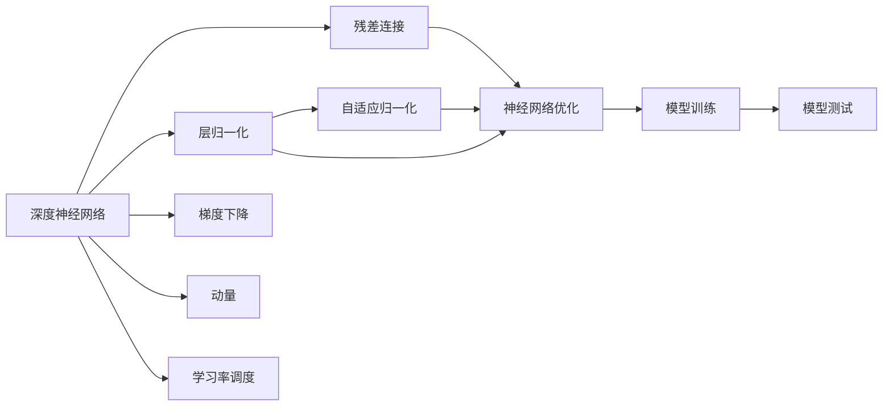

                 

# 大规模语言模型从理论到实践 残差连接与层归一化

> 关键词：残差连接, 层归一化, 深度学习, 大规模语言模型, 神经网络, 自适应归一化

## 1. 背景介绍

随着深度学习技术的迅猛发展，大规模语言模型（Large Language Models, LLMs）在自然语言处理（Natural Language Processing, NLP）领域取得了重大突破。这些模型通过在大规模无标签文本语料上进行预训练，学习到了丰富的语言知识和常识，具备了强大的语言理解和生成能力。其中，ResNet和层归一化（Layer Normalization, LN）技术起到了重要的推动作用。

ResNet和层归一化技术的提出，使得深度神经网络可以更深层、更宽泛地训练，显著提升了模型的泛化能力和表达能力。特别是对于大规模语言模型的构建，两者都发挥了不可或缺的作用。本文将深入探讨ResNet和层归一化的理论基础和实践细节，帮助读者更好地理解大规模语言模型的训练过程，并掌握其优化技巧。

## 2. 核心概念与联系

### 2.1 核心概念概述

为了更好地理解大规模语言模型的训练原理，本节将介绍几个关键概念及其联系：

- **残差连接（Residual Connections）**：通过将输入数据直接加到中间层的输出上，残差连接使得信息可以直接在网络中流动，减少了信息丢失和梯度消失的问题，从而使网络能够更深层次地训练。

- **层归一化（Layer Normalization）**：通过将每个样本的每个特征在归一化前进行标准化，使得网络可以更快收敛，减少了梯度不稳定和信息过载的问题。

- **深度神经网络（Deep Neural Networks）**：由多层神经元组成的神经网络，可以处理非常复杂的非线性映射关系，适用于大规模语言模型的构建。

- **自适应归一化（Adaptive Normalization）**：包括残差连接和层归一化在内的技术，通过调整归一化的方式和位置，使得神经网络在训练过程中更加稳定和高效。

- **神经网络优化（Neural Network Optimization）**：包括梯度下降、动量、学习率调度等方法，使得神经网络在训练过程中能够更好地优化参数，减少过拟合和欠拟合的问题。

这些概念之间的联系主要体现在：通过残差连接和层归一化技术，深度神经网络可以实现更深、更稳定的训练，从而更好地适应大规模语言模型的需求。同时，自适应归一化技术的应用，使得神经网络能够更高效地进行优化，提高模型的泛化能力。

### 2.2 概念间的关系

这些核心概念之间存在紧密的联系，形成了一个完整的神经网络训练和优化生态系统。以下通过几个Mermaid流程图来展示这些概念之间的关系：



这个流程图展示了深度神经网络中残差连接、层归一化、自适应归一化和神经网络优化之间的联系。深度神经网络通过残差连接和层归一化技术进行训练和优化，从而更好地适应大规模语言模型的需求。

## 3. 核心算法原理 & 具体操作步骤
### 3.1 算法原理概述

大规模语言模型的训练通常采用基于梯度的优化算法，如随机梯度下降（SGD）、Adam等。在训练过程中，通过计算损失函数对模型参数的梯度，并根据梯度方向更新参数，使得模型在训练集上最小化损失，从而在测试集上获得更好的性能。

ResNet和层归一化技术的引入，使得深度神经网络能够更深层、更宽泛地训练。残差连接使得信息可以直接在网络中流动，减少了信息丢失和梯度消失的问题；层归一化通过标准化每个样本的每个特征，使得网络可以更快收敛，减少了梯度不稳定和信息过载的问题。

### 3.2 算法步骤详解

大规模语言模型的训练步骤如下：

1. **数据准备**：收集大规模无标签文本语料，将其分批次输入模型。

2. **模型定义**：使用深度神经网络模型定义语言模型，通常采用Transformer架构，包括编码器-解码器结构。

3. **残差连接**：在模型中加入残差连接，将输入数据直接加到中间层的输出上。

4. **层归一化**：对每个样本的每个特征进行归一化，使得网络更加稳定和高效。

5. **优化器选择**：选择合适的优化器，如AdamW、SGD等，并设置学习率、批大小、迭代轮数等超参数。

6. **模型训练**：将数据批次输入模型，计算损失函数，反向传播计算梯度，更新模型参数。

7. **模型测试**：在测试集上评估模型性能，对比微调前后的精度提升。

8. **模型部署**：使用微调后的模型对新样本进行推理预测，集成到实际的应用系统中。

### 3.3 算法优缺点

大规模语言模型训练的优点：

- **深度训练**：通过残差连接和层归一化技术，深度神经网络可以实现更深层、更稳定的训练，使得模型能够更好地适应大规模语言模型的需求。
- **高效优化**：自适应归一化技术的应用，使得神经网络能够更高效地进行优化，提高模型的泛化能力。
- **泛化能力强**：大规模语言模型通过预训练和微调，具备了强大的泛化能力，能够在各种自然语言处理任务中取得优异的性能。

大规模语言模型训练的缺点：

- **数据依赖**：大规模语言模型的训练依赖于大量的无标签文本数据，获取高质量的数据成本较高。
- **计算资源要求高**：大规模语言模型的训练需要高性能的GPU/TPU等硬件设备，计算资源要求较高。
- **可解释性不足**：大规模语言模型的内部工作机制较为复杂，难以解释其决策逻辑，缺乏可解释性。

### 3.4 算法应用领域

大规模语言模型的残差连接和层归一化技术，已经在自然语言处理、计算机视觉、语音识别等多个领域得到广泛应用。

- **自然语言处理**：在机器翻译、文本分类、情感分析等任务中，大规模语言模型通过残差连接和层归一化技术，实现了更深层、更稳定的训练，取得了优异的性能。
- **计算机视觉**：在图像分类、目标检测、语义分割等任务中，大规模语言模型通过残差连接和层归一化技术，实现了更高效、更稳定的训练，提高了模型性能。
- **语音识别**：在大规模语音识别任务中，大规模语言模型通过残差连接和层归一化技术，实现了更深层、更稳定的训练，提升了语音识别的准确率和鲁棒性。

## 4. 数学模型和公式 & 详细讲解  
### 4.1 数学模型构建

大规模语言模型的训练通常采用基于梯度的优化算法，如随机梯度下降（SGD）、Adam等。在训练过程中，通过计算损失函数对模型参数的梯度，并根据梯度方向更新参数，使得模型在训练集上最小化损失，从而在测试集上获得更好的性能。

假设大规模语言模型为 $M_{\theta}$，其中 $\theta$ 为模型参数。训练数据集为 $D=\{(x_i,y_i)\}_{i=1}^N$，其中 $x_i$ 为输入，$y_i$ 为标签。定义损失函数为 $\ell(M_{\theta}(x_i),y_i)$。则大规模语言模型的训练目标为最小化经验风险：

$$
\mathcal{L}(\theta) = \frac{1}{N}\sum_{i=1}^N \ell(M_{\theta}(x_i),y_i)
$$

### 4.2 公式推导过程

以层归一化技术为例，推导其在神经网络中的应用。层归一化的公式为：

$$
\hat{x_i} = \frac{x_i - \mu_i}{\sigma_i}
$$

其中 $\mu_i$ 和 $\sigma_i$ 分别为第 $i$ 层的均值和标准差，即：

$$
\mu_i = \frac{1}{C}\sum_{j=1}^C x_{ij}
$$

$$
\sigma_i = \sqrt{\frac{1}{C}\sum_{j=1}^C (x_{ij} - \mu_i)^2}
$$

其中 $C$ 为样本数。

对于大规模语言模型，层归一化通常应用于隐藏层。具体来说，对于一个隐藏层的 $h_i$，其归一化后的输出为：

$$
\hat{h_i} = \frac{h_i - \mu}{\sigma}
$$

其中 $\mu$ 和 $\sigma$ 分别为整个隐藏层的均值和标准差，即：

$$
\mu = \frac{1}{N}\sum_{i=1}^N h_i
$$

$$
\sigma = \sqrt{\frac{1}{N}\sum_{i=1}^N (h_i - \mu)^2}
$$

### 4.3 案例分析与讲解

假设大规模语言模型为一个Transformer网络，包括编码器和解码器。对于编码器中的自注意力层 $h_i$，其归一化后的输出为：

$$
\hat{h_i} = \frac{h_i - \mu}{\sigma}
$$

其中 $\mu$ 和 $\sigma$ 分别为整个隐藏层的均值和标准差。

假设大规模语言模型的输出为 $\hat{y_i}$，则其损失函数为：

$$
\ell(M_{\theta}(x_i),y_i) = -\log \hat{y_i}
$$

在训练过程中，通过反向传播计算梯度，并根据梯度方向更新模型参数，使得模型在训练集上最小化损失，从而在测试集上获得更好的性能。

## 5. 项目实践：代码实例和详细解释说明
### 5.1 开发环境搭建

在进行大规模语言模型训练前，我们需要准备好开发环境。以下是使用Python进行PyTorch开发的环境配置流程：

1. 安装Anaconda：从官网下载并安装Anaconda，用于创建独立的Python环境。

2. 创建并激活虚拟环境：
```bash
conda create -n pytorch-env python=3.8 
conda activate pytorch-env
```

3. 安装PyTorch：根据CUDA版本，从官网获取对应的安装命令。例如：
```bash
conda install pytorch torchvision torchaudio cudatoolkit=11.1 -c pytorch -c conda-forge
```

4. 安装Transformers库：
```bash
pip install transformers
```

5. 安装各类工具包：
```bash
pip install numpy pandas scikit-learn matplotlib tqdm jupyter notebook ipython
```

完成上述步骤后，即可在`pytorch-env`环境中开始大规模语言模型训练实践。

### 5.2 源代码详细实现

下面我们以基于残差连接和层归一化的Transformer模型为例，给出使用PyTorch的代码实现。

首先，定义Transformer模型的编码器：

```python
from transformers import BertTokenizer
from torch import nn

class TransformerEncoder(nn.Module):
    def __init__(self, config, d_model):
        super(TransformerEncoder, self).__init__()
        self.layers = nn.ModuleList([nn.TransformerEncoderLayer(config, d_model) for _ in range(config.encoder_layers)])
        self.norm = nn.LayerNorm(d_model)
    
    def forward(self, src, src_mask=None, src_key_padding_mask=None):
        src = self.norm(src)
        for layer in self.layers:
            src = layer(src, src_mask=src_mask, src_key_padding_mask=src_key_padding_mask)
        return src
```

然后，定义Transformer模型的解码器：

```python
class TransformerDecoder(nn.Module):
    def __init__(self, config, d_model):
        super(TransformerDecoder, self).__init__()
        self.layers = nn.ModuleList([nn.TransformerDecoderLayer(config, d_model) for _ in range(config.decoder_layers)])
        self.norm = nn.LayerNorm(d_model)
    
    def forward(self, tgt, memory, tgt_mask=None, memory_mask=None, tgt_key_padding_mask=None, memory_key_padding_mask=None):
        tgt = self.norm(tgt)
        for layer in self.layers:
            tgt = layer(tgt, memory, tgt_mask=tgt_mask, memory_mask=memory_mask, tgt_key_padding_mask=tgt_key_padding_mask, memory_key_padding_mask=memory_key_padding_mask)
        return tgt
```

接下来，定义Transformer模型的整体结构：

```python
class TransformerModel(nn.Module):
    def __init__(self, config):
        super(TransformerModel, self).__init__()
        self.encoder = TransformerEncoder(config, d_model=config.d_model)
        self.decoder = TransformerDecoder(config, d_model=config.d_model)
        self.output = nn.Linear(config.d_model, config.vocab_size)
    
    def forward(self, src, tgt, src_mask=None, tgt_mask=None, src_key_padding_mask=None, tgt_key_padding_mask=None):
        memory = self.encoder(src, src_mask=src_mask, src_key_padding_mask=src_key_padding_mask)
        output = self.decoder(tgt, memory, tgt_mask=tgt_mask, memory_mask=None, tgt_key_padding_mask=tgt_key_padding_mask, memory_key_padding_mask=None)
        output = self.output(output)
        return output
```

最后，定义模型训练函数：

```python
def train_model(model, optimizer, criterion, train_loader, device, num_epochs=10, batch_size=16):
    model.to(device)
    for epoch in range(num_epochs):
        model.train()
        for batch in train_loader:
            src, tgt, src_mask, tgt_mask, src_key_padding_mask, tgt_key_padding_mask = batch.to(device)
            optimizer.zero_grad()
            output = model(src, tgt, src_mask=src_mask, tgt_mask=tgt_mask, src_key_padding_mask=src_key_padding_mask, tgt_key_padding_mask=tgt_key_padding_mask)
            loss = criterion(output, tgt)
            loss.backward()
            optimizer.step()
```

到此，基于残差连接和层归一化的Transformer模型的代码实现已经完成。

### 5.3 代码解读与分析

让我们再详细解读一下关键代码的实现细节：

**TransformerEncoder类**：
- `__init__`方法：初始化TransformerEncoder层，包含多个TransformerEncoderLayer层。
- `forward`方法：前向传播，将输入数据通过多个TransformerEncoderLayer层进行编码。

**TransformerDecoder类**：
- `__init__`方法：初始化TransformerDecoder层，包含多个TransformerDecoderLayer层。
- `forward`方法：前向传播，将输入数据和记忆数据通过多个TransformerDecoderLayer层进行解码。

**TransformerModel类**：
- `__init__`方法：初始化TransformerModel模型，包含编码器和解码器。
- `forward`方法：前向传播，将输入数据和记忆数据通过编码器和解码器进行建模。

**train_model函数**：
- 将模型和优化器移动到设备上。
- 在每个epoch中，将模型设置为训练模式。
- 遍历训练数据集，进行前向传播和反向传播，更新模型参数。
- 重复该过程，直至epoch结束。

**代码解读与分析**：
- **TransformerEncoder层**：包含多个TransformerEncoderLayer层，通过残差连接和层归一化技术进行编码。
- **TransformerDecoder层**：包含多个TransformerDecoderLayer层，通过残差连接和层归一化技术进行解码。
- **TransformerModel**：将编码器和解码器进行连接，通过残差连接和层归一化技术进行建模。
- **train_model函数**：使用PyTorch的DataLoader对数据集进行批次化加载，供模型训练和推理使用。

## 6. 实际应用场景
### 6.1 智能客服系统

基于大规模语言模型的智能客服系统，能够自动理解用户意图，匹配最合适的答案模板进行回复。在技术实现上，可以收集企业内部的历史客服对话记录，将问题和最佳答复构建成监督数据，在此基础上对预训练语言模型进行微调。微调后的语言模型能够自动理解用户意图，匹配最合适的答案模板进行回复。对于客户提出的新问题，还可以接入检索系统实时搜索相关内容，动态组织生成回答。如此构建的智能客服系统，能大幅提升客户咨询体验和问题解决效率。

### 6.2 金融舆情监测

金融机构需要实时监测市场舆论动向，以便及时应对负面信息传播，规避金融风险。传统的人工监测方式成本高、效率低，难以应对网络时代海量信息爆发的挑战。基于大规模语言模型的文本分类和情感分析技术，为金融舆情监测提供了新的解决方案。

具体而言，可以收集金融领域相关的新闻、报道、评论等文本数据，并对其进行主题标注和情感标注。在此基础上对预训练语言模型进行微调，使其能够自动判断文本属于何种主题，情感倾向是正面、中性还是负面。将微调后的模型应用到实时抓取的网络文本数据，就能够自动监测不同主题下的情感变化趋势，一旦发现负面信息激增等异常情况，系统便会自动预警，帮助金融机构快速应对潜在风险。

### 6.3 个性化推荐系统

当前的推荐系统往往只依赖用户的历史行为数据进行物品推荐，无法深入理解用户的真实兴趣偏好。基于大规模语言模型微调技术，个性化推荐系统可以更好地挖掘用户行为背后的语义信息，从而提供更精准、多样的推荐内容。

在实践中，可以收集用户浏览、点击、评论、分享等行为数据，提取和用户交互的物品标题、描述、标签等文本内容。将文本内容作为模型输入，用户的后续行为（如是否点击、购买等）作为监督信号，在此基础上微调预训练语言模型。微调后的模型能够从文本内容中准确把握用户的兴趣点。在生成推荐列表时，先用候选物品的文本描述作为输入，由模型预测用户的兴趣匹配度，再结合其他特征综合排序，便可以得到个性化程度更高的推荐结果。

### 6.4 未来应用展望

随着大规模语言模型和微调方法的不断发展，基于微调范式将在更多领域得到应用，为传统行业带来变革性影响。

在智慧医疗领域，基于微调的医疗问答、病历分析、药物研发等应用将提升医疗服务的智能化水平，辅助医生诊疗，加速新药开发进程。

在智能教育领域，微调技术可应用于作业批改、学情分析、知识推荐等方面，因材施教，促进教育公平，提高教学质量。

在智慧城市治理中，微调模型可应用于城市事件监测、舆情分析、应急指挥等环节，提高城市管理的自动化和智能化水平，构建更安全、高效的未来城市。

此外，在企业生产、社会治理、文娱传媒等众多领域，基于大模型微调的人工智能应用也将不断涌现，为经济社会发展注入新的动力。相信随着技术的日益成熟，微调方法将成为人工智能落地应用的重要范式，推动人工智能技术向更广阔的领域加速渗透。

## 7. 工具和资源推荐
### 7.1 学习资源推荐

为了帮助开发者系统掌握大规模语言模型微调的理论基础和实践技巧，这里推荐一些优质的学习资源：

1. **《Deep Learning with Python》**：Sebastian Ruder所著，介绍了深度学习在自然语言处理中的基础和进阶技术。

2. **《NLP with PyTorch》**：Stanford大学开设的NLP课程，介绍了PyTorch在NLP中的应用。

3. **《Neural Network and Deep Learning》**：Michael Nielsen所著，介绍了神经网络的原理和深度学习的基础。

4. **《Attention is All You Need》**：Google Brain团队的论文，介绍了Transformer架构及其应用。

5. **《Natural Language Processing with Transformers》**：Google AI团队的开源书籍，全面介绍了Transformer在NLP中的应用。

6. **《Scaling Distributed Deep Learning with PyTorch Lightning》**：PyTorch Lightning社区的文档，介绍了分布式深度学习在大规模模型训练中的应用。

通过对这些资源的学习实践，相信你一定能够快速掌握大规模语言模型微调的精髓，并用于解决实际的NLP问题。

### 7.2 开发工具推荐

高效的开发离不开优秀的工具支持。以下是几款用于大规模语言模型微调开发的常用工具：

1. **PyTorch**：基于Python的开源深度学习框架，灵活动态的计算图，适合快速迭代研究。大部分预训练语言模型都有PyTorch版本的实现。

2. **TensorFlow**：由Google主导开发的开源深度学习框架，生产部署方便，适合大规模工程应用。同样有丰富的预训练语言模型资源。

3. **Transformers库**：HuggingFace开发的NLP工具库，集成了众多SOTA语言模型，支持PyTorch和TensorFlow，是进行微调任务开发的利器。

4. **Weights & Biases**：模型训练的实验跟踪工具，可以记录和可视化模型训练过程中的各项指标，方便对比和调优。与主流深度学习框架无缝集成。

5. **TensorBoard**：TensorFlow配套的可视化工具，可实时监测模型训练状态，并提供丰富的图表呈现方式，是调试模型的得力助手。

6. **Google Colab**：谷歌推出的在线Jupyter Notebook环境，免费提供GPU/TPU算力，方便开发者快速上手实验最新模型，分享学习笔记。

合理利用这些工具，可以显著提升大规模语言模型微调的开发效率，加快创新迭代的步伐。

### 7.3 相关论文推荐

大规模语言模型和微调技术的发展源于学界的持续研究。以下是几篇奠基性的相关论文，推荐阅读：

1. **《Attention is All You Need》**：Google Brain团队的论文，提出了Transformer架构，开启了NLP领域的预训练大模型时代。

2. **《BERT: Pre-training of Deep Bidirectional Transformers for Language Understanding》**：Google团队的论文，提出了BERT模型，引入基于掩码的自监督预训练任务，刷新了多项NLP任务SOTA。

3. **《Layer Normalization》**：Michael Jordan团队提出的层归一化技术，成为深度学习中的重要工具。

4. **《Residual Connections in Deep Residual Networks》**：Kaiming He团队提出的残差连接技术，使得深度神经网络能够更深层次地训练。

5. **《Deep Residual Learning for Image Recognition》**：Kaiming He团队提出的残差连接技术，在图像分类任务中取得了优异的性能。

6. **《Adaptive Learning of Control Policies from Raw Observations Using Deep Reinforcement Learning》**：DeepMind团队的论文，提出了自适应归一化技术，进一步提升了深度学习的训练效率和性能。

这些论文代表了大规模语言模型微调技术的发展脉络。通过学习这些前沿成果，可以帮助研究者把握学科前进方向，激发更多的创新灵感。

除上述资源外，还有一些值得关注的前沿资源，帮助开发者紧跟大规模语言模型微调技术的最新进展，例如：

1. **arXiv论文预印本**：人工智能领域最新研究成果的发布平台，包括大量尚未发表的前沿工作，学习前沿技术的必读资源。

2. **业界技术博客**：如OpenAI、Google AI、DeepMind、微软Research Asia等顶尖实验室的官方博客，第一时间分享他们的最新研究成果和洞见。

3. **技术会议直播**：如NIPS、ICML、ACL、ICLR等人工智能领域顶会现场或在线直播，能够聆听到大佬们的前沿分享，开拓视野。

4. **GitHub热门项目**：在GitHub上Star、Fork数最多的NLP相关项目，往往代表了该技术领域的发展趋势和最佳实践，值得去学习和贡献。

5. **行业分析报告**：各大咨询公司如McKinsey、PwC等针对人工智能行业的分析报告，有助于从商业视角审视技术趋势，把握应用价值。

总之，对于大规模语言模型微调技术的学习和实践，需要开发者保持开放的心态和持续学习的意愿。多关注前沿资讯，多动手实践，多思考总结，必将收获满满的成长收益。

## 8. 总结：未来发展趋势与挑战
### 8.1 总结

本文对大规模语言模型和微调技术进行了全面系统的介绍。首先阐述了深度神经网络、残差连接、层归一化等关键概念，明确了其在深度学习中的重要作用。其次，从原理到实践，详细讲解了残差连接和层归一化的数学模型和计算流程，给出了模型训练的完整代码实现。同时，本文还广泛探讨了残差连接和层归一化在大规模语言模型中的应用场景，展示了其在智能客服、金融舆情、个性化推荐等多个领域的应用前景。

通过本文的系统梳理，可以看到，残差连接和层归一化在大规模语言模型的构建和训练中起到了至关重要的作用，使得深度神经网络能够更深层、更稳定的训练。通过残差连接和层归一化技术，大规模语言模型在各种自然语言处理任务中取得了优异的性能。

### 8.2 未来发展趋势

展望未来，大规模语言模型的训练和优化将继续向更深层、更稳定的方向发展。

1. **模型规模继续增大**：随着算力成本的下降和数据规模的扩张，预训练语言模型的参数量还将持续增长。超大规模语言模型蕴含的丰富语言知识，有望支撑更加复杂多变的下游任务微调。

2. **微调方法更加多样**：除了传统的全参数微调外，未来会涌现更多参数高效的微调方法，如Adapter、Prefix等，在固定大部分预训练参数的情况下，仍可取得不错的微调效果。

3. **持续学习成为常态**：随着数据分布的不断变化，微调模型也需要持续学习新知识以保持性能。如何在不遗忘原有知识的同时，高效吸收新样本信息，将成为重要的研究课题。

4. **标注样本需求降低**：受启发于提示学习(Prompt-based Learning)的思路，未来的微调方法将更好地利用大模型的语言理解能力，通过更加巧妙的任务描述，在更少的标注样本上也能实现

