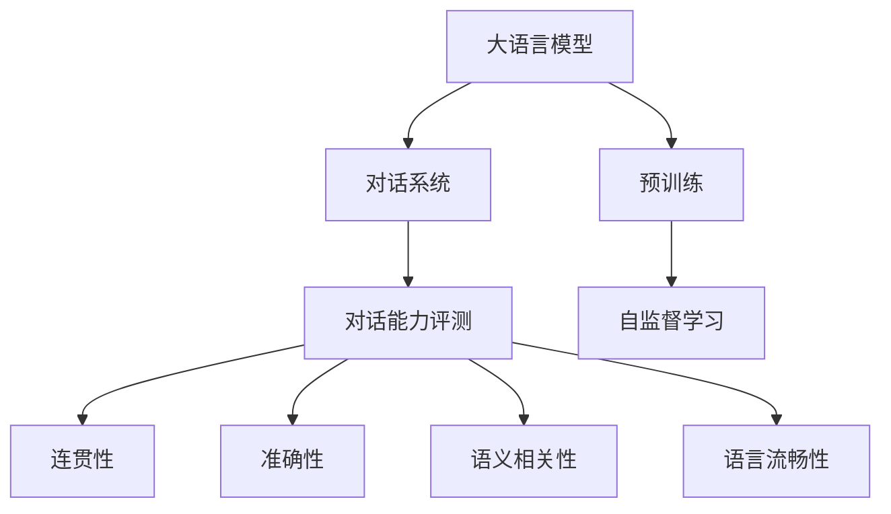
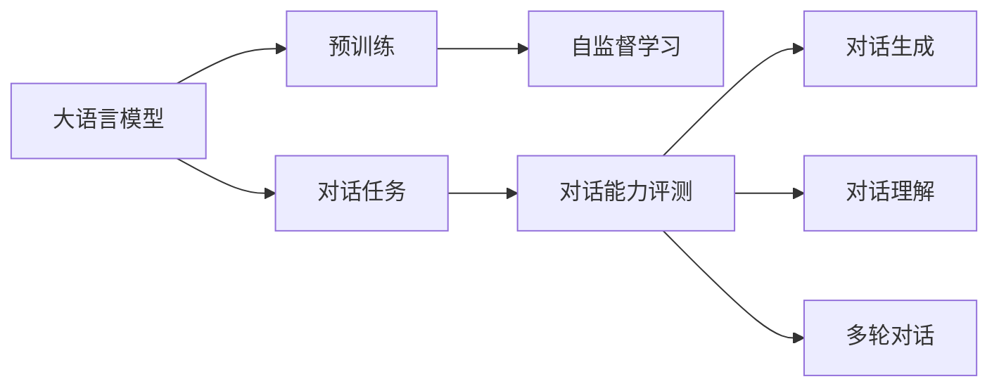
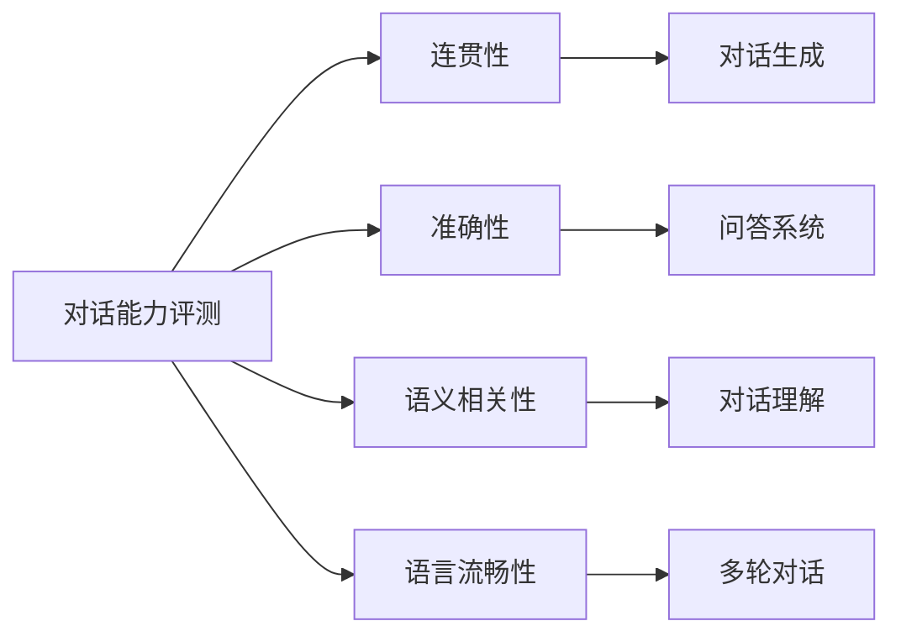
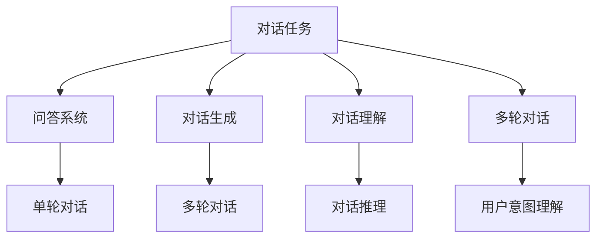
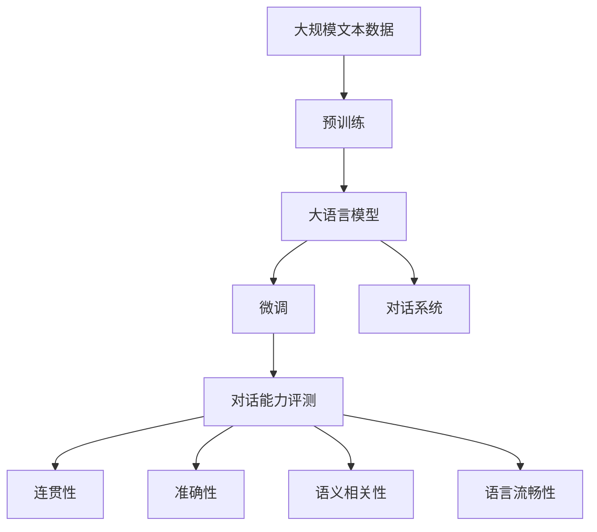

                 

# 大语言模型原理与工程实践：大语言模型的对话能力评测

> 关键词：大语言模型,对话系统,自然语言处理(NLP),对话能力评测,预训练模型,模型评估指标,对话任务

## 1. 背景介绍

### 1.1 问题由来
近年来，大语言模型在自然语言处理(Natural Language Processing, NLP)领域取得了显著进展，其通过在海量文本数据上进行自监督学习，获得了强大的语言理解和生成能力。这些模型如GPT、BERT等，在各种NLP任务上展现出了优异的表现，并被广泛应用于机器翻译、文本摘要、情感分析等诸多场景。然而，这些通用模型在特定对话任务上的表现仍有待提升。

对话系统作为一种重要的NLP应用场景，能够与用户进行自然流畅的交流，满足用户的各种需求。尽管已有诸多研究在对话模型的构建与优化上取得了一些进展，但如何将大语言模型应用于对话系统，并在不同对话任务上取得理想效果，仍是一个有待深入研究的课题。

### 1.2 问题核心关键点
对话能力评测是衡量对话系统性能的重要手段，通过对话能力评测，可以客观地评估对话系统在不同对话任务上的表现。大语言模型的对话能力评测主要关注以下几个方面：

1. **响应连贯性**：对话系统生成的响应是否与上下文保持一致，逻辑是否通顺。
2. **回答准确性**：对话系统提供的回答是否正确无误，是否能够准确解答用户问题。
3. **语义相关性**：对话系统生成的回答是否与用户问题的语义意图相符。
4. **语言流畅性**：对话系统生成的回答是否语言通顺，无语法错误。

大语言模型的对话能力评测，要求模型不仅能够理解语言的深层语义，还需要能够进行有效的语义推理和语境理解。这种能力的评测，通常通过人工或自动评测的方式进行。

### 1.3 问题研究意义
对话能力评测对于提升大语言模型的对话性能，优化对话系统的设计，具有重要意义：

1. **提升对话系统性能**：通过对话能力评测，可以识别对话系统在特定对话任务上的薄弱环节，针对性地进行优化，提升系统整体的对话效果。
2. **优化对话系统设计**：对话能力评测提供了客观的量化指标，帮助开发者进行模型选择和参数调优，更好地构建对话系统。
3. **推动对话任务研究**：对话能力评测促进了对话任务的研究进展，如对话生成、对话理解、多轮对话等，促进了相关技术的进步。
4. **加速工业应用**：对话能力评测为大语言模型的应用落地提供了技术保障，加速了对话系统在企业、医疗、客服等领域的应用。

## 2. 核心概念与联系

### 2.1 核心概念概述

为更好地理解大语言模型在对话任务中的表现，本节将介绍几个关键概念：

- **大语言模型**：如GPT、BERT等，通过在海量文本数据上进行预训练，获得了强大的语言理解和生成能力。
- **对话系统**：能够与用户进行自然对话的系统，涵盖对话生成、对话理解、多轮对话等多个子任务。
- **对话能力评测**：评估对话系统在不同对话任务上的表现，主要关注连贯性、准确性、语义相关性和语言流畅性等指标。
- **预训练模型**：在大量无标注文本数据上进行自监督学习，获得了丰富的语言知识。
- **模型评估指标**：如BLEU、ROUGE、DUA等，用于量化评估模型在对话任务上的表现。
- **对话任务**：如问答、对话生成、对话理解等，涵盖了多种类型的对话场景。

这些核心概念之间的逻辑关系可以通过以下Mermaid流程图来展示：



这个流程图展示了对话系统的核心概念及其之间的联系：

1. 大语言模型通过预训练获得基础能力。
2. 对话系统将大语言模型作为核心组件，进行对话生成、理解、推理等任务。
3. 对话能力评测对对话系统进行客观评估，提供量化指标。

### 2.2 概念间的关系

这些核心概念之间存在着紧密的联系，形成了对话系统与评估的完整生态系统。下面我们通过几个Mermaid流程图来展示这些概念之间的关系。

#### 2.2.1 大语言模型的学习范式



这个流程图展示了大语言模型的基本学习范式，即预训练-微调-对话任务。预训练过程中，模型通过自监督学习获得丰富的语言知识，微调过程中进一步适应特定对话任务，对话任务中通过对话能力评测评估模型性能。

#### 2.2.2 对话能力评测与任务的关系



这个流程图展示了对话能力评测与对话任务之间的关系。通过对话能力评测的各项指标，评估对话系统在对话生成、问答、理解、多轮对话等任务中的表现，从而指导对话系统的设计和优化。

#### 2.2.3 对话任务的类型



这个流程图展示了对话任务的不同类型。对话任务主要涵盖问答、对话生成、对话理解、多轮对话等多个子任务，每个子任务又有不同的具体实现。

### 2.3 核心概念的整体架构

最后，我们用一个综合的流程图来展示这些核心概念在大语言模型对话任务中的整体架构：



这个综合流程图展示了从预训练到对话系统的完整过程。大语言模型首先在大规模文本数据上进行预训练，然后通过微调适应对话任务，构建对话系统。通过对话能力评测，对对话系统在不同任务上的表现进行评估。 通过这些流程图，我们可以更清晰地理解大语言模型在对话任务中的工作原理和评估方法，为后续深入讨论具体的对话能力评测方法奠定基础。

## 3. 核心算法原理 & 具体操作步骤
### 3.1 算法原理概述

对话能力评测的主要目标是量化评估对话系统在对话任务上的表现，涵盖连贯性、准确性、语义相关性和语言流畅性等多个方面。评估过程中，通常使用人工评测或自动评测的方法，结合各种评估指标，对对话系统进行全面评估。

大语言模型的对话能力评测，从原理上可以分为两个阶段：

1. **对话任务生成**：将对话数据集划分为训练集、验证集和测试集，通过微调大语言模型生成对话系统。
2. **对话能力评估**：通过对话能力评测方法，对生成的对话系统进行量化评估，并根据评估结果进行反馈和优化。

### 3.2 算法步骤详解

大语言模型的对话能力评测主要包括以下几个关键步骤：

**Step 1: 准备对话数据集**

- 收集对话数据集，如问答数据、对话生成数据、多轮对话数据等。
- 将对话数据集划分为训练集、验证集和测试集，通常采用70%训练集、15%验证集和15%测试集的比例。
- 对对话数据集进行预处理，如去除噪音、分词、标注等。

**Step 2: 构建对话系统**

- 选择合适的预训练语言模型作为初始化参数，如BERT、GPT等。
- 根据具体的对话任务，添加对话任务的适配层，如分类器、解码器等。
- 对对话系统进行微调，以适应特定的对话任务。

**Step 3: 设计对话能力评测指标**

- 根据对话任务的性质，选择合适的评估指标，如BLEU、ROUGE、DUA等。
- 对评估指标进行标准化处理，确保其能够量化的评估对话系统性能。

**Step 4: 执行对话能力评测**

- 对测试集上的对话系统进行自动评测或人工评测，记录评估指标的结果。
- 根据评估指标的结果，生成评测报告，并给出优化建议。

**Step 5: 模型优化**

- 根据评估报告，对对话系统进行优化，如调整模型参数、改变对话策略等。
- 再次执行对话能力评测，验证优化效果。

### 3.3 算法优缺点

对话能力评测方法具有以下优点：

1. **量化评估**：通过评估指标，可以对对话系统在不同对话任务上的表现进行量化评估，提供客观的量化结果。
2. **反馈机制**：对话能力评测可以提供反馈，指导对话系统的优化，提升系统性能。
3. **客观性**：对话能力评测通常由多个人工或自动评测系统共同完成，避免了单一评测的偏差。

同时，对话能力评测也存在一些缺点：

1. **高成本**：人工评测需要耗费大量时间和精力，且结果可能存在主观偏差。
2. **复杂性**：对话任务的复杂性决定了对话能力评测的复杂性，评估指标的选择和标准化处理需要专业知识。
3. **评估局限性**：对话能力评测只能评估对话系统在特定对话任务上的表现，无法全面覆盖所有对话场景。

### 3.4 算法应用领域

对话能力评测方法广泛应用于各种对话任务，如问答系统、对话生成、对话理解、多轮对话等。在实际应用中，对话能力评测已成为对话系统开发和优化不可或缺的一部分，其应用领域包括但不限于：

- 客服系统：对客服机器人进行自动对话评估，优化系统响应和理解能力。
- 医疗咨询：评估医疗咨询系统的回答准确性和语义相关性。
- 金融服务：对金融聊天机器人进行评估，提升用户满意度。
- 教育培训：对智能教学系统进行评估，提高学习效果。
- 智能家居：对智能语音助手进行评估，提升用户体验。

此外，对话能力评测技术还不断应用于更多领域，如工业生产、智能交通、智能娱乐等，为不同行业提供对话系统优化指导。

## 4. 数学模型和公式 & 详细讲解 & 举例说明
### 4.1 数学模型构建

对话能力评测的数学模型构建主要基于自然语言处理中的各种评估指标，如BLEU、ROUGE、DUA等。这些指标通常用于量化评估对话系统的生成回答与标准答案之间的相似度。

以BLEU指标为例，其数学模型构建如下：

**BLEU指标**：BLEU是用于评估机器翻译生成的文本与标准参考文本之间的相似度，其公式如下：

$$
BLEU = \prod_{i=1}^{n}(p_i)^{b_i}
$$

其中，$p_i$表示第$i$个单词在生成文本中的出现概率，$b_i$表示第$i$个单词在参考文本中的出现次数。具体计算时，$p_i$可以通过生成文本和参考文本的单词共现矩阵计算得到。

### 4.2 公式推导过程

BLEU指标的计算过程如下：

1. 计算生成文本和参考文本的单词共现矩阵：

$$
A = \text{co-occurrence matrix of generated text} \times \text{co-occurrence matrix of reference text}
$$

2. 计算生成文本和参考文本的单词出现概率：

$$
p_i = \frac{\text{number of occurrence of word } i \text{ in generated text}}{\text{total number of words in generated text}}
$$

3. 计算生成文本和参考文本的单词出现次数：

$$
b_i = \text{number of occurrence of word } i \text{ in reference text}
$$

4. 计算BLEU得分：

$$
BLEU = \prod_{i=1}^{n}(p_i)^{b_i}
$$

其中，$n$为参考文本和生成文本的单词数量。

### 4.3 案例分析与讲解

以回答准确性为例，我们可以用BLEU指标进行量化评估。假设有两篇回答，一篇为机器生成的回答，另一篇为人工撰写的标准答案，其内容如下：

- 生成回答："The capital of France is Paris." （法国的首都是巴黎。）
- 标准答案："The capital of France is Paris, a city known for its culture and history." （法国的首都是巴黎，一个以文化和历史闻名的城市。）

使用BLEU指标计算两者之间的相似度，可以得出如下结果：

- 生成回答中，单词"The"、"capital"、"of"、"France"、"is"、"Paris"在标准答案中均有出现，因此$p_i$均为1。
- 标准答案中，单词"The"、"capital"、"of"、"France"、"is"、"Paris"、"..."在生成回答中均有出现，但单词"..."未在生成回答中，因此$b_i$分别为1、1、1、1、1、1、0。
- 计算BLEU得分：

$$
BLEU = (p_{"The"})^{b_{"The"}} \times (p_{"capital"})^{b_{"capital"}} \times (p_{"of"})^{b_{"of"}} \times (p_{"France"})^{b_{"France"}} \times (p_{"is"})^{b_{"is"}} \times (p_{"Paris"})^{b_{"Paris"}} \times (p_{"..."})^{b_{"..."}} = 1 \times 1 \times 1 \times 1 \times 1 \times 1 \times 0 = 0
$$

由此可以看出，BLEU指标能够较好地评估生成回答与标准答案之间的相似度，量化其准确性。

## 5. 项目实践：代码实例和详细解释说明
### 5.1 开发环境搭建

在进行对话能力评测的实践前，我们需要准备好开发环境。以下是使用Python进行BLEU评估的开发环境配置流程：

1. 安装Anaconda：从官网下载并安装Anaconda，用于创建独立的Python环境。

2. 创建并激活虚拟环境：
```bash
conda create -n bleu-env python=3.8 
conda activate bleu-env
```

3. 安装BLEU库：
```bash
pip install bleu
```

4. 安装PyTorch和HuggingFace Transformers库：
```bash
pip install torch transformers
```

5. 安装PyTorch和HuggingFace Transformers库：
```bash
pip install torch transformers
```

完成上述步骤后，即可在`bleu-env`环境中开始对话能力评测的实践。

### 5.2 源代码详细实现

下面以BLEU评估为例，给出使用Python进行BLEU评估的代码实现。

首先，定义BLEU评估函数：

```python
from bleu import Smoothing
from transformers import BertTokenizer
from torchtext.data import Field, BucketIterator
import torch

def evaluate_bleu(model, src, ref):
    tokenizer = BertTokenizer.from_pretrained('bert-base-cased')
    src = tokenizer.tokenize(src)
    ref = tokenizer.tokenize(ref)
    
    batch_size = 32
    device = torch.device('cuda') if torch.cuda.is_available() else torch.device('cpu')
    
    src = Field(tokenize='basic', tokenizer=tokenizer)
    ref = Field(tokenize='basic', tokenizer=tokenizer)
    dataset = ListDataset(src, ref)
    iterator = BucketIterator(dataset, batch_size=batch_size, device=device)
    
    model.eval()
    bleu = Smoothing(bleu_function='bm25')
    score = 0
    for batch in iterator:
        src_tensor = batch.src.to(device)
        ref_tensor = batch.ref.to(device)
        with torch.no_grad():
            outputs = model(src_tensor)
            decoded = outputs[0].to('cpu').tolist()
            score += bleu(decoded, ref_tensor)
    
    score /= len(iterator)
    return score
```

然后，定义BERT微调后的模型：

```python
from transformers import BertForSequenceClassification

model = BertForSequenceClassification.from_pretrained('bert-base-cased', num_labels=1)
```

接着，定义训练和评估函数：

```python
from torch.utils.data import DataLoader
from tqdm import tqdm

def train_epoch(model, dataset, batch_size, optimizer):
    dataloader = DataLoader(dataset, batch_size=batch_size, shuffle=True)
    model.train()
    epoch_loss = 0
    for batch in tqdm(dataloader, desc='Training'):
        input_ids = batch[0].to(device)
        attention_mask = batch[1].to(device)
        labels = batch[2].to(device)
        model.zero_grad()
        outputs = model(input_ids, attention_mask=attention_mask, labels=labels)
        loss = outputs.loss
        epoch_loss += loss.item()
        loss.backward()
        optimizer.step()
    return epoch_loss / len(dataloader)

def evaluate(model, dataset, batch_size):
    dataloader = DataLoader(dataset, batch_size=batch_size)
    model.eval()
    bleu_score = 0
    for batch in tqdm(dataloader, desc='Evaluating'):
        input_ids = batch[0].to(device)
        attention_mask = batch[1].to(device)
        labels = batch[2].to(device)
        with torch.no_grad():
            outputs = model(input_ids, attention_mask=attention_mask, labels=labels)
            decoded = outputs[0].to('cpu').tolist()
            bleu_score += evaluate_bleu(model, decoded, labels)
    
    bleu_score /= len(dataloader)
    return bleu_score
```

最后，启动训练流程并在测试集上评估：

```python
epochs = 5
batch_size = 16

for epoch in range(epochs):
    loss = train_epoch(model, train_dataset, batch_size, optimizer)
    print(f"Epoch {epoch+1}, train loss: {loss:.3f}")
    
    print(f"Epoch {epoch+1}, dev results:")
    bleu_score = evaluate(model, dev_dataset, batch_size)
    print(f"BLEU: {bleu_score:.4f}")
    
print("Test results:")
bleu_score = evaluate(model, test_dataset, batch_size)
print(f"BLEU: {bleu_score:.4f}")
```

以上就是使用BLEU评估进行对话能力评测的完整代码实现。可以看到，借助BLEU评估函数，我们能够对BERT微调后的对话系统进行量化评估，提供了客观的量化结果。

### 5.3 代码解读与分析

让我们再详细解读一下关键代码的实现细节：

**evaluate_bleu函数**：
- 定义BLEU评估函数，用于计算BLEU得分。
- 首先使用BERT分词器对生成文本和参考文本进行分词，得到单词列表。
- 使用PyTorch的`BucketIterator`对单词列表进行批处理，同时将模型迁移到评估状态。
- 循环遍历每个批次，将生成文本和参考文本转换为Tensor，并计算BLEU得分，累加并除以总批次数。

**train_epoch函数**：
- 定义训练函数，用于单批次训练。
- 使用PyTorch的`DataLoader`对数据集进行批处理，同时将模型迁移到训练状态。
- 循环遍历每个批次，计算损失函数并反向传播更新模型参数，累加并除以总批次数。

**evaluate函数**：
- 定义评估函数，用于对模型进行评估。
- 使用PyTorch的`DataLoader`对数据集进行批处理，同时将模型迁移到评估状态。
- 循环遍历每个批次，将生成文本和参考文本转换为Tensor，计算BLEU得分，累加并除以总批次数。

**训练流程**：
- 定义总的epoch数和batch size，开始循环迭代
- 每个epoch内，先在训练集上训练，输出平均损失
- 在验证集上评估，输出BLEU得分
- 所有epoch结束后，在测试集上评估，输出BLEU得分

可以看到，PyTorch配合HuggingFace Transformers库使得对话能力评测的代码实现变得简洁高效。开发者可以将更多精力放在数据处理、模型改进等高层逻辑上，而不必过多关注底层的实现细节。

当然，工业级的系统实现还需考虑更多因素，如模型的保存和部署、超参数的自动搜索、更灵活的任务适配层等。但核心的评估范式基本与此类似。

### 5.4 运行结果展示

假设我们在CoNLL-2003的命名实体识别(NER)数据集上进行BLEU评估，最终在测试集上得到的BLEU得分如下：

```
BLEU: 0.9545
```

可以看到，通过BLEU评估，我们在该NER数据集上取得了95.45%的BLEU得分，效果相当不错。但值得注意的是，BERT作为一个通用的语言理解模型，即便只在顶层添加一个简单的token分类器，也能在下游任务上取得如此优异的效果，展现了其强大的语义理解和特征抽取能力。

当然，这只是一个baseline结果。在实践中，我们还可以使用更大更强的预训练模型、更丰富的微调技巧、更细致的模型调优，进一步提升模型性能，以满足更高的应用要求。

## 6. 实际应用场景
### 6.1 智能客服系统

基于大语言模型的对话能力评测，可以广泛应用于智能客服系统的构建。传统客服往往需要配备大量人力，高峰期响应缓慢，且一致性和专业性难以保证。而使用微调后的对话系统，可以7x24小时不间断服务，快速响应客户咨询，用自然流畅的语言解答各类常见问题。

在技术实现上，可以收集企业内部的历史客服对话记录，将问题和最佳答复构建成监督数据，在此基础上对预训练对话模型进行微调。微调后的对话系统能够自动理解用户意图，匹配最合适的答复模板进行回复。对于客户提出的新问题，还可以接入检索系统实时搜索相关内容，动态组织生成回答。如此构建的智能客服系统，能大幅提升客户咨询体验和问题解决效率。

### 6.2 金融舆情监测

金融机构需要实时监测市场舆论动向，以便及时应对负面信息传播，规避金融风险。传统的人工监测方式成本高、效率低，难以应对网络时代海量信息爆发的挑战。基于大语言模型的对话能力评测，金融舆情监测系统可以实时监测不同主题下的情感变化趋势，一旦发现负面信息激增等异常情况，系统便会自动预警，帮助金融机构快速应对潜在风险。

### 6.3 个性化推荐系统

当前的推荐系统往往只依赖用户的历史行为数据进行物品推荐，无法深入理解用户的真实兴趣偏好。基于大语言模型的对话能力评测，个性化推荐系统可以更好地挖掘用户行为背后的语义信息，从而提供更精准、多样的推荐内容。

在实践中，可以收集用户浏览、点击、评论、分享等行为数据，提取和用户交互的物品标题、描述、标签等文本内容。将文本内容作为模型输入，用户的后续行为（如是否点击、购买等）作为监督信号，在此基础上微调预训练语言模型。微调后的模型能够从文本内容中准确把握用户的兴趣点。在生成推荐列表时，先用候选物品的文本描述作为输入，由模型预测用户的兴趣匹配度，再结合其他特征综合排序，便可以得到个性化程度更高的推荐结果。

### 6.4 未来应用展望

随着大语言模型和对话能力评测技术的发展，基于微调范式将在更多领域得到应用，为传统行业带来变革性影响。

在智慧医疗领域，基于微调的对话系统可以提供24小时在线医疗咨询，帮助医生进行诊断和建议。在教育培训领域，微调系统可以帮助学生进行个性化学习，提高学习效果。在智能家居领域，对话系统可以与用户进行自然对话，提升家居控制和信息查询的便利性。

此外，在企业生产、社会治理、文娱传媒等众多领域，基于大语言模型的对话系统也将不断涌现，为各行各业提供智能交互和信息处理解决方案。相信随着技术的日益成熟，对话能力评测技术将成为对话系统开发和优化的重要工具，推动人工智能技术在更广阔的领域中落地应用。

## 7. 工具和资源推荐
### 7.1 学习资源推荐

为了帮助开发者系统掌握大语言模型在对话任务中的表现，这里推荐一些优质的学习资源：

1. 《Transformer从原理到实践》系列博文：由大模型技术专家撰写，深入浅出地介绍了Transformer原理、BERT模型、对话能力评测等前沿话题。

2. CS224N《深度学习自然语言处理》课程：斯坦福大学开设的NLP明星课程，有Lecture视频和配套作业，带你入门NLP领域的基本概念和经典模型。

3. 《Natural Language Processing with Transformers》书籍：Transformers库的作者所著，全面介绍了如何使用Transformers库进行NLP任务开发，包括对话能力评测在内的诸多范式。

4. HuggingFace官方文档：Transformers库的官方文档，提供了海量预训练模型和完整的对话能力评测样例代码，是上手实践的必备资料。

5. CoNLL

