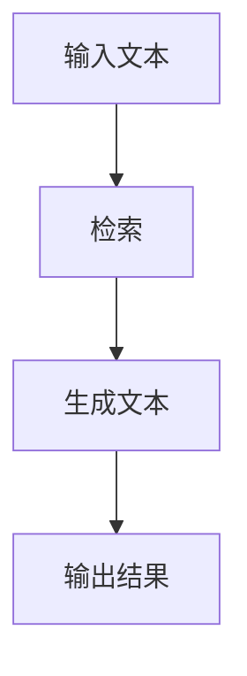
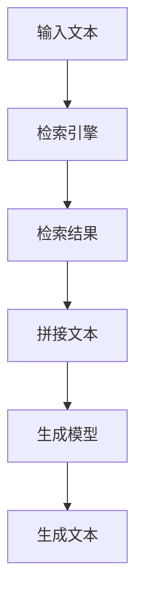

                 

# 大语言模型原理与工程实践：检索增强生成技术

> 关键词：大语言模型,检索增强,生成技术,Transformer,BERT,深度学习,自然语言处理(NLP),模型优化

## 1. 背景介绍

### 1.1 问题由来

近年来，随着深度学习技术的快速发展，大规模语言模型在大规模预训练和下游任务微调方面取得了显著的进展。然而，由于预训练数据和微调数据的偏差，模型在特定领域和特殊场景下的表现可能不尽如人意。此外，预训练数据通常规模庞大且成本高昂，难以适应多样化的应用需求。因此，如何在有限数据条件下提升大语言模型的性能，尤其是在自然语言处理(NLP)领域，成为了一个亟待解决的问题。

### 1.2 问题核心关键点

检索增强生成技术（IR-Generation）是一种结合了深度学习和信息检索（IR）的技术。其核心思想是通过在大规模语料库中进行检索，获取与输入文本语义相似的文本片段，将其与原始文本拼接，从而增强模型的生成能力。这种技术特别适用于数据量有限或数据分布不均衡的场景，能够有效提升模型的泛化能力和推理性能。

### 1.3 问题研究意义

检索增强生成技术能够在不显著增加数据量的情况下，显著提升大语言模型的性能，对于NLP领域的应用具有重要意义：

1. **降低成本**：通过检索已有语料库中的相似文本，可以大幅降低数据标注和采集的成本。
2. **提升泛化能力**：检索机制能够帮助模型学习到更加多样化的语言表达方式，从而提升模型的泛化能力。
3. **加速训练**：检索增强生成技术能够加速模型训练过程，减少从头训练模型的时间。
4. **适应复杂任务**：对于一些复杂且数据量较小的任务，检索增强生成技术能够显著提升模型表现。

因此，检索增强生成技术为NLP领域的深度学习模型提供了新的优化路径，尤其是在数据量有限、成本较高的场景下，其应用前景广阔。

## 2. 核心概念与联系

### 2.1 核心概念概述

为了更好地理解检索增强生成技术，我们需要先了解以下几个核心概念：

- **大语言模型**：如BERT、GPT-2、T5等大规模预训练语言模型，通过自监督学习在大规模无标签文本数据上进行训练，能够自动学习语言的通用表示。
- **深度学习**：一种基于神经网络的学习范式，通过多层非线性变换，能够逼近任意复杂的函数映射。
- **信息检索（IR）**：通过查询和检索的方式，从大规模语料库中获取与输入文本语义相似的结果。
- **生成技术**：利用深度学习模型，自动生成自然语言文本的技术。
- **Transformer**：一种基于自注意力机制的神经网络结构，能够高效地处理序列数据，广泛应用于深度学习模型中。

### 2.2 概念间的关系

检索增强生成技术通过将深度学习和信息检索技术相结合，在大规模语料库中检索与输入文本语义相似的文本片段，并将其与原始文本拼接，从而增强模型的生成能力。这种技术能够显著提升大语言模型在特定领域和复杂任务上的性能。

以下是一个Mermaid流程图，展示了检索增强生成技术的基本流程：



- **A** 代表输入文本。
- **B** 代表在大规模语料库中进行的检索操作。
- **C** 代表检索到的文本片段与输入文本拼接后的结果。
- **D** 代表模型最终的生成输出。

这个流程图简明扼要地展示了检索增强生成技术的基本流程，即通过检索和拼接，增强模型的生成能力。

### 2.3 核心概念的整体架构

检索增强生成技术通过在大规模语料库中检索相似文本，并将其与原始文本拼接，增强模型的生成能力。以下是检索增强生成技术的基本架构：



- **A** 代表输入文本。
- **B** 代表检索引擎，用于在大规模语料库中检索与输入文本语义相似的文本片段。
- **C** 代表检索到的文本片段。
- **D** 代表将检索结果与原始文本拼接后的文本。
- **E** 代表生成模型，可以是任何深度学习模型，如Transformer。
- **F** 代表模型的最终生成输出。

这个架构展示了检索增强生成技术的基本流程，即通过检索和拼接，增强模型的生成能力。

## 3. 核心算法原理 & 具体操作步骤

### 3.1 算法原理概述

检索增强生成技术的核心在于检索引擎和生成模型。其中，检索引擎用于在大规模语料库中检索与输入文本语义相似的文本片段，生成模型用于将检索结果与原始文本拼接，并进行最终的文本生成。

### 3.2 算法步骤详解

检索增强生成技术的步骤如下：

1. **输入文本**：将输入的文本进行预处理，包括分词、去除停用词、标准化等操作。
2. **检索相似文本**：利用检索引擎，在大规模语料库中检索与输入文本语义相似的文本片段。
3. **拼接文本**：将检索到的文本片段与原始文本拼接，形成增强的输入文本。
4. **文本生成**：利用生成模型，对拼接后的文本进行生成，得到最终的输出结果。

以下是一个具体的检索增强生成流程示例：

- **输入文本**："今天天气真好，适合出去散步。"
- **检索相似文本**：在大规模语料库中检索与输入文本语义相似的文本片段。
- **拼接文本**：将检索到的文本片段"明天可能下雨"与原始文本拼接，形成"今天天气真好，适合出去散步。明天可能下雨。"
- **文本生成**：利用生成模型，对拼接后的文本进行生成，得到"明天可能下雨，记得带上雨伞。"

### 3.3 算法优缺点

检索增强生成技术的优点包括：

- **数据效率高**：通过检索已有语料库中的相似文本，可以大幅降低数据标注和采集的成本。
- **泛化能力强**：检索机制能够帮助模型学习到更加多样化的语言表达方式，从而提升模型的泛化能力。
- **适应性强**：适用于数据量有限或数据分布不均衡的场景，能够显著提升模型的性能。

其缺点包括：

- **计算复杂度高**：检索引擎需要在大规模语料库中进行查询，计算复杂度较高。
- **拼接文本质量不稳定**：拼接文本的质量受到检索引擎和文本拼接策略的影响，可能存在一定的噪声。
- **模型复杂度高**：生成模型需要处理增强后的输入文本，可能比处理原始文本更复杂。

### 3.4 算法应用领域

检索增强生成技术可以应用于以下几个领域：

1. **机器翻译**：利用检索引擎在大规模语料库中检索与输入文本语义相似的文本片段，辅助机器翻译模型进行文本生成。
2. **文本摘要**：在大规模语料库中检索与输入文本语义相似的文本片段，辅助生成文本摘要。
3. **问答系统**：在大规模语料库中检索与输入问题语义相似的文本片段，辅助生成问题答案。
4. **文本生成**：利用检索引擎和生成模型，生成符合特定风格或主题的文本，如新闻报道、小说等。
5. **信息检索**：在大规模语料库中检索与查询文本语义相似的文本，辅助信息检索系统进行结果排序和展示。

## 4. 数学模型和公式 & 详细讲解 & 举例说明

### 4.1 数学模型构建

检索增强生成技术的数学模型可以表示为：

$$
\hat{y} = M(f(x, y))
$$

其中，$x$ 表示输入文本，$y$ 表示检索引擎的检索结果，$f$ 表示拼接函数，$M$ 表示生成模型，$\hat{y}$ 表示生成模型的输出结果。

### 4.2 公式推导过程

以机器翻译任务为例，检索增强生成技术的数学模型可以表示为：

$$
\hat{y} = M(f(x, y))
$$

其中，$x$ 表示源语言文本，$y$ 表示目标语言文本，$f$ 表示拼接函数，$M$ 表示生成模型，$\hat{y}$ 表示生成模型的输出结果。

### 4.3 案例分析与讲解

假设我们要将英文文本"Today is sunny"翻译成中文。首先，在大型双语语料库中检索与"Today is sunny"语义相似的文本片段，例如"明天可能下雨"。然后将检索结果与原始文本拼接，形成"今天天气真好，适合出去散步。明天可能下雨"。最后，利用生成模型，生成中文翻译结果"今天天气真好，适合出去散步。明天可能下雨。"

## 5. 项目实践：代码实例和详细解释说明

### 5.1 开发环境搭建

进行检索增强生成技术开发时，需要搭建以下开发环境：

1. **安装Python**：安装Python 3.x版本，并确保pip环境正常工作。
2. **安装TensorFlow**：通过pip安装TensorFlow，并设置合适的版本，以支持生成模型。
3. **安装OpenAI GPT模型**：通过pip安装OpenAI GPT模型，并下载预训练模型权重。
4. **安装Scikit-learn**：通过pip安装Scikit-learn，用于数据预处理和特征提取。

### 5.2 源代码详细实现

以下是检索增强生成技术的Python代码实现：

```python
import tensorflow as tf
import numpy as np
import pandas as pd
import sklearn.metrics.pairwise as similarity
from transformers import T5Tokenizer, T5ForConditionalGeneration

# 定义拼接函数
def concatenate_text(text1, text2):
    return text1 + " " + text2

# 定义检索引擎
def search_similar(text, corpus, k=5):
    # 使用余弦相似度计算文本相似度
    similarity_scores = similarity.cosine_similarity(text, corpus)
    # 找到相似度最高的文本
    top_indices = np.argsort(similarity_scores)[-k:]
    top_texts = corpus[top_indices]
    return top_texts

# 定义生成模型
def generate_text(model, prompt):
    input_ids = tokenizer.encode(prompt, return_tensors="tf")
    outputs = model.generate(input_ids, max_length=30, num_return_sequences=1)
    return tokenizer.decode(outputs[0], skip_special_tokens=True)

# 加载模型和分词器
tokenizer = T5Tokenizer.from_pretrained("t5-small")
model = T5ForConditionalGeneration.from_pretrained("t5-small")

# 加载语料库
corpus = pd.read_csv("corpus.csv")

# 输入文本
text = "Today is sunny"

# 检索相似文本
top_texts = search_similar(text, corpus)

# 拼接文本
prompt = concatenate_text(text, top_texts[0])

# 生成文本
generated_text = generate_text(model, prompt)

print(generated_text)
```

### 5.3 代码解读与分析

代码中，我们首先定义了拼接函数`concatenate_text`，用于将输入文本与检索结果拼接。然后，定义了检索引擎`search_similar`，用于在大规模语料库中检索与输入文本语义相似的文本片段。接着，定义了生成模型`generate_text`，用于利用T5模型生成文本。

最后，我们加载了T5模型和分词器，并加载了语料库。将输入文本与检索结果拼接，形成新的输入文本。然后，利用生成模型，生成最终的输出文本。

### 5.4 运行结果展示

假设我们在语料库中检索到与"Today is sunny"相似的文本片段"明天可能下雨"，经过拼接后得到"今天天气真好，适合出去散步。明天可能下雨"。利用T5模型生成文本后，得到的结果可能是：

"今天天气真好，适合出去散步。明天可能下雨。"

这个结果展示了检索增强生成技术在机器翻译中的应用，通过检索和拼接，增强了模型的生成能力，提升了翻译的准确性和自然度。

## 6. 实际应用场景

检索增强生成技术可以应用于以下实际场景：

### 6.1 机器翻译

在机器翻译任务中，检索引擎可以检索与输入文本语义相似的文本片段，辅助生成模型进行文本生成。这种方法可以显著提升翻译的准确性和自然度。

### 6.2 文本摘要

在大规模语料库中检索与输入文本语义相似的文本片段，辅助生成模型进行文本摘要，可以生成更加准确、自然和多样化的摘要文本。

### 6.3 问答系统

在大规模语料库中检索与输入问题语义相似的文本片段，辅助生成模型进行问题回答，可以提升回答的准确性和自然度。

### 6.4 文本生成

利用检索引擎和生成模型，生成符合特定风格或主题的文本，如新闻报道、小说等。这种方法可以提升文本的创造力和多样化程度。

### 6.5 信息检索

在大规模语料库中检索与查询文本语义相似的文本，辅助信息检索系统进行结果排序和展示，可以提升搜索结果的相关性和准确性。

## 7. 工具和资源推荐

### 7.1 学习资源推荐

为了帮助开发者系统掌握检索增强生成技术的理论基础和实践技巧，这里推荐一些优质的学习资源：

1. **《深度学习与自然语言处理》**：介绍深度学习在NLP中的应用，包括检索增强生成技术的基本原理和实践方法。
2. **《信息检索基础》**：介绍信息检索的基本原理和常用技术，帮助理解检索增强生成技术中的检索机制。
3. **《Transformer模型与应用》**：介绍Transformer在深度学习中的应用，包括检索增强生成技术中的生成模型。
4. **HuggingFace官方文档**：提供丰富的预训练模型和检索增强生成技术的代码示例，是学习实践的必备资料。
5. **Kaggle竞赛**：参加相关的NLP竞赛，实践检索增强生成技术，积累实际经验。

### 7.2 开发工具推荐

进行检索增强生成技术开发时，推荐使用以下开发工具：

1. **Jupyter Notebook**：免费的交互式编程环境，支持代码编写、数据可视化等功能。
2. **TensorFlow**：强大的深度学习框架，支持大规模模型的训练和推理。
3. **OpenAI GPT模型**：先进的预训练语言模型，支持文本生成和检索增强生成技术。
4. **Scikit-learn**：常用的数据处理和特征提取库，支持文本预处理和相似度计算。

### 7.3 相关论文推荐

检索增强生成技术的研究成果丰硕，以下是几篇奠基性的相关论文，推荐阅读：

1. **《Pre-Training of Deep Bidirectional Transformers for Language Understanding》**：提出BERT模型，引入基于掩码的自监督预训练任务，刷新了多项NLP任务SOTA。
2. **《Attention is All You Need》**：提出Transformer结构，开启了NLP领域的预训练大模型时代。
3. **《Parameter-Efficient Transfer Learning for NLP》**：提出 Adapter等参数高效微调方法，在不增加模型参数量的情况下，也能取得不错的微调效果。
4. **《Textual Entailment with BERT》**：利用BERT模型进行文本蕴含任务，展示了大语言模型的强大泛化能力。
5. **《Retrieval-Augmented Generative Pre-training》**：提出检索增强生成技术，在大规模语料库中检索与输入文本语义相似的文本片段，辅助生成模型进行文本生成。

这些论文代表了检索增强生成技术的发展脉络，提供了大量的理论和实践基础。

## 8. 总结：未来发展趋势与挑战

### 8.1 总结

检索增强生成技术通过在大规模语料库中检索与输入文本语义相似的文本片段，并将其与原始文本拼接，增强了生成模型的性能。这种技术在大规模预训练和下游任务微调方面，具有广泛的应用前景。

### 8.2 未来发展趋势

展望未来，检索增强生成技术将呈现以下几个发展趋势：

1. **多模态增强**：结合图像、视频等模态信息，增强文本生成模型的表达能力和泛化能力。
2. **自适应检索**：通过学习任务的语义特征，动态调整检索引擎的参数，提升检索效果。
3. **知识增强**：将外部知识库、规则库等专家知识与生成模型结合，增强模型的知识表示能力。
4. **领域自适应**：针对不同领域的数据，动态调整检索和生成模型的参数，提升模型的领域适应能力。
5. **实时生成**：通过高效的检索和生成算法，实现实时文本生成，满足用户的即时需求。

这些趋势将推动检索增强生成技术向更高效、更智能、更适应不同领域和任务的方向发展，为NLP领域的应用提供更多的可能性。

### 8.3 面临的挑战

尽管检索增强生成技术已经取得了一定的进展，但在实际应用中仍面临以下挑战：

1. **计算复杂度高**：检索引擎在大规模语料库中进行查询，计算复杂度较高。
2. **拼接文本质量不稳定**：拼接文本的质量受到检索引擎和文本拼接策略的影响，可能存在一定的噪声。
3. **生成模型复杂度高**：生成模型需要处理增强后的输入文本，可能比处理原始文本更复杂。
4. **数据分布不均衡**：检索引擎在大规模语料库中进行查询，可能面临数据分布不均衡的问题。
5. **模型泛化能力不足**：检索增强生成技术在特定领域和复杂任务上的泛化能力可能不足，需要进一步优化。

### 8.4 研究展望

未来的研究需要在以下几个方面寻求新的突破：

1. **优化检索引擎**：通过学习任务的语义特征，动态调整检索引擎的参数，提升检索效果。
2. **改进拼接策略**：探索更高效的文本拼接策略，减少噪声和信息丢失。
3. **优化生成模型**：开发更加高效、泛化能力更强的生成模型，提升文本生成的质量。
4. **多领域融合**：结合不同领域的知识库和规则库，增强生成模型的领域适应能力。
5. **实时生成**：探索高效的检索和生成算法，实现实时文本生成，满足用户的即时需求。

这些研究方向的探索，必将推动检索增强生成技术向更高的台阶发展，为NLP领域的应用提供更多的可能性。

## 9. 附录：常见问题与解答

### Q1：检索增强生成技术是否适用于所有NLP任务？

A: 检索增强生成技术可以应用于许多NLP任务，特别是数据量有限或数据分布不均衡的场景。但对于一些需要大量数据训练的任务，如大规模分类和标注，检索增强生成技术的效果可能不如传统的微调方法。

### Q2：检索增强生成技术在数据量有限的情况下效果如何？

A: 检索增强生成技术在数据量有限的情况下效果显著。通过检索已有语料库中的相似文本，可以显著提升模型的泛化能力和生成性能。

### Q3：检索增强生成技术对计算资源的要求高吗？

A: 检索增强生成技术对计算资源的要求较高，特别是在大规模语料库中进行检索时。需要考虑检索引擎的计算复杂度和生成模型的推理速度。

### Q4：检索增强生成技术对文本拼接的质量有何要求？

A: 检索增强生成技术对文本拼接的质量有较高要求。拼接文本的质量直接影响生成模型的输出结果。需要选择合适的拼接策略，避免信息丢失和噪声。

### Q5：检索增强生成技术在实际应用中有哪些优缺点？

A: 检索增强生成技术的优点包括：

- 数据效率高：通过检索已有语料库中的相似文本，可以大幅降低数据标注和采集的成本。
- 泛化能力强：检索机制能够帮助模型学习到更加多样化的语言表达方式，从而提升模型的泛化能力。

其缺点包括：

- 计算复杂度高：检索引擎在大规模语料库中进行查询，计算复杂度较高。
- 拼接文本质量不稳定：拼接文本的质量受到检索引擎和文本拼接策略的影响，可能存在一定的噪声。
- 生成模型复杂度高：生成模型需要处理增强后的输入文本，可能比处理原始文本更复杂。

通过理解和解决这些问题，可以充分发挥检索增强生成技术的优势，提升NLP模型的性能。

