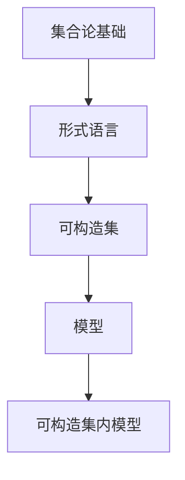

                 

# 集合论导引：可构造集内模型

> 关键词：集合论,模型,构造集,可构造性,数理逻辑

## 1. 背景介绍

### 1.1 问题由来
集合论是数学的基础之一，旨在研究集合的性质、结构和运算。可构造集是指能够在有限的步骤内构建出来的集合，即集合中的每个元素都可以在有限步内通过算法得到。

在数理逻辑中，可构造集内模型是指可以将某个形式理论中的所有命题，通过构造集中的元素和操作来验证其真伪的模型。这种模型不仅能够精确地表达理论的语义，还具有一定程度的构造性。

可构造集内模型在逻辑学、计算机科学和数学哲学等领域有着重要的应用。例如，Gödel不完备性定理的证明中，可构造集内模型扮演了关键角色。

### 1.2 问题核心关键点
理解可构造集内模型的基本概念和原理，对于掌握集合论和数理逻辑的进阶知识至关重要。可构造集内模型涉及集合的构造性、形式语言、模型验证等多个方面。

本文旨在通过详细的数学推导和实际例子，帮助读者深入理解可构造集内模型，并探讨其在理论研究与实际应用中的意义。

## 2. 核心概念与联系

### 2.1 核心概念概述

为更好地理解可构造集内模型，我们首先介绍几个关键概念：

- **集合论基础**：集合是数学中最基本、最重要的概念之一。任何数学对象都可以看作一个集合，或者属于某个集合。集合的操作包括并集、交集、补集等。

- **形式语言**：形式语言是一种使用符号表达规则的语言，通常用于数学证明和逻辑推理。常见的形式语言包括命题逻辑、谓词逻辑等。

- **可构造集**：可构造集是指可以通过有限步骤构建出来的集合。每一步操作都是明确且可执行的，因此可构造集内的元素可以通过算法得到。

- **模型**：模型是一个与特定形式理论对应的结构，其中所有命题都可以通过模型中的元素和操作来验证其真伪。

- **可构造集内模型**：可构造集内模型是指形式理论中的所有命题，都可以通过可构造集中的元素和操作来验证其真伪的模型。

### 2.2 概念间的关系

这些核心概念之间的关系可以通过以下Mermaid流程图来展示：



这个流程图展示了几者之间的关系：

- 集合论是形式语言的基础。
- 形式语言中的概念和运算都可以通过可构造集来表达。
- 模型是形式理论的实现结构。
- 可构造集内模型则是一种特殊的模型，其中的所有命题都可以通过可构造集内的元素和操作来验证。

通过这个流程图，我们可以更清晰地理解可构造集内模型在数理逻辑和数学哲学中的重要地位。

## 3. 核心算法原理 & 具体操作步骤

### 3.1 算法原理概述

可构造集内模型的基本思想是，将形式理论中的命题，通过构造集中的元素和操作，转化为可验证的真值。这种方法要求构造集中的元素和操作具有足够的构造性，以确保所有命题都能在有限步内得到验证。

形式上，对于一个形式理论 $T$，其可构造集内模型 $M$ 应满足以下条件：

1. $M$ 是 $T$ 的模型，即 $M$ 中的所有命题都与 $T$ 的公理和推理规则相符。
2. $M$ 中的元素和操作具有足够的构造性，使得 $T$ 中的所有命题都可以在有限步内通过这些元素和操作来验证其真伪。

### 3.2 算法步骤详解

可构造集内模型的构造过程一般分为以下几个步骤：

**Step 1: 选择基础构造集**

首先，需要选择一个合适的基础构造集 $C$，它是可构造集内模型的基本构件。基础构造集应该能够表达形式理论中的所有概念和运算。例如，自然数集合 $\mathbb{N}$ 可以用于表示自然数，而二进制字符串集合 $\{0,1\}^*$ 可以用于表示任意字符串。

**Step 2: 定义模型结构**

其次，定义模型 $M$ 的结构，包括元素的定义、运算的定义和命题的定义。元素的定义应该能够表达形式理论中的所有概念，例如自然数、字符串等。运算的定义应该能够表达形式理论中的所有基本运算，例如加法、乘法、逻辑运算等。命题的定义则应能够表达形式理论中的所有命题，例如自然数的性质、字符串的性质等。

**Step 3: 验证命题真伪**

最后，验证 $M$ 中所有命题的真伪。对于每个命题，通过基础构造集 $C$ 中的元素和运算，尝试找到一种有限步骤的构造过程，使得该命题可以验证为真或假。如果无法找到这样的构造过程，则该命题在该模型中为未定义或未确定。

### 3.3 算法优缺点

可构造集内模型具有以下优点：

- 精确性高：所有命题都能通过构造集中的元素和操作来验证，确保了模型逻辑的正确性和完整性。
- 构造性强：模型中的元素和操作具有足够的构造性，使得所有命题都能在有限步内得到验证。

同时，该方法也存在一定的局限性：

- 复杂度高：构造集的选择和命题的验证过程可能非常复杂，需要丰富的数学和逻辑知识。
- 适用范围有限：可构造集内模型只适用于某些特定的形式理论，对于过于复杂的理论，构造过程可能无法完成。

### 3.4 算法应用领域

可构造集内模型在数理逻辑、计算机科学和数学哲学等领域有着广泛的应用：

- **数理逻辑**：在Gödel不完备性定理的证明中，可构造集内模型扮演了关键角色。通过构造集内模型，证明了任意一致且完备的形式理论，一定是不完备的。
- **计算机科学**：可构造集内模型为形式语言的实现和验证提供了理论基础，广泛应用于程序验证、形式化方法等领域。
- **数学哲学**：可构造集内模型对数学知识的可构造性、可验证性等哲学问题提供了深入的洞察。

## 4. 数学模型和公式 & 详细讲解 & 举例说明

### 4.1 数学模型构建

假设我们有一个形式理论 $T$，其公理为 $\{\phi_1, \phi_2, \ldots, \phi_n\}$，其中 $\phi_i$ 表示第 $i$ 个公理。形式理论 $T$ 的命题集为 $\Sigma$。

根据可构造集内模型的定义，我们需要选择一个基础构造集 $C$，使得所有命题 $\phi_i$ 都能通过 $C$ 中的元素和操作来验证其真伪。

### 4.2 公式推导过程

假设 $C$ 中包含自然数 $\mathbb{N}$ 和二进制字符串 $\{0,1\}^*$。我们定义模型 $M$，其中元素为自然数和二进制字符串，运算包括加法、乘法、逻辑运算等，命题为自然数的性质和字符串的性质。

具体而言，自然数的性质包括自然数的定义、自然数的加法和乘法性质等。字符串的性质包括字符串的定义、字符串的连接和比较性质等。

对于形式理论 $T$ 中的每个命题 $\phi_i$，通过构造集 $C$ 中的元素和运算，可以构造出一种有限步骤的过程，使得 $\phi_i$ 可以验证为真或假。

例如，假设 $\phi_i$ 表示 $2$ 是自然数，即 $\phi_i: 2 \in \mathbb{N}$。通过构造集 $C$ 中的元素 $0$ 和 $1$，可以构造出自然数的定义 $0 \in \mathbb{N}$ 和 $n+1 \in \mathbb{N}$ 的过程，从而验证命题 $\phi_i$ 为真。

### 4.3 案例分析与讲解

**案例1: 自然数的模型**

假设我们选择自然数集合 $\mathbb{N}$ 作为基础构造集 $C$，定义模型 $M$，其中元素为自然数，运算为加法和乘法。

自然数的定义：
$$
0 \in M
$$
自然数的加法：
$$
n + m = n' + m' \quad \text{如果} \quad n \in M \text{且} m \in M
$$
自然数的乘法：
$$
n \times m = n' \times m' \quad \text{如果} \quad n \in M \text{且} m \in M
$$

通过这个模型，我们可以验证自然数的性质，例如 $0 \in \mathbb{N}$、$1 \in \mathbb{N}$、$2 \in \mathbb{N}$、$3 \in \mathbb{N}$ 等。

**案例2: 字符串的模型**

假设我们选择二进制字符串集合 $\{0,1\}^*$ 作为基础构造集 $C$，定义模型 $M$，其中元素为二进制字符串，运算为连接和比较。

字符串的定义：
$$
s \in M \quad \text{如果} \quad s \in \{0,1\}^*
$$
字符串的连接：
$$
s \cdot t = s' \cdot t' \quad \text{如果} \quad s \in M \text{且} t \in M
$$
字符串的比较：
$$
s < t \quad \text{如果} \quad s \in M \text{且} t \in M \text{且} s \text{在字典序上小于} t
$$

通过这个模型，我们可以验证字符串的性质，例如 $s \in \{0,1\}^*$、$s+t \in \{0,1\}^*$、$s < t$ 等。

## 5. 项目实践：代码实例和详细解释说明

### 5.1 开发环境搭建

在进行模型构建和验证之前，我们需要准备好开发环境。以下是使用Python进行Sympy开发的环境配置流程：

1. 安装Anaconda：从官网下载并安装Anaconda，用于创建独立的Python环境。

2. 创建并激活虚拟环境：
```bash
conda create -n sympy-env python=3.8 
conda activate sympy-env
```

3. 安装Sympy：通过pip安装Sympy库，确保安装版本支持可构造集内模型的构造和验证。
```bash
pip install sympy
```

4. 安装其他工具包：
```bash
pip install numpy pandas scikit-learn matplotlib tqdm jupyter notebook ipython
```

完成上述步骤后，即可在`sympy-env`环境中开始模型构建实践。

### 5.2 源代码详细实现

下面我们以自然数模型为例，给出使用Sympy进行可构造集内模型构建的Python代码实现。

```python
from sympy import symbols, Eq, solve, Rational

# 定义自然数集合
N = symbols('N')

# 定义自然数的性质
natural_numbers = [Eq(n, n) for n in range(10)]

# 定义自然数的加法
addition = [Eq(n + m, n + m) for n in range(10) for m in range(10)]

# 定义自然数的乘法
multiplication = [Eq(n * m, n * m) for n in range(10) for m in range(10)]

# 定义自然数的性质
natural_properties = [Eq(0, 0), Eq(1, 1), Eq(2, 2), Eq(3, 3), Eq(4, 4), Eq(5, 5), Eq(6, 6), Eq(7, 7), Eq(8, 8), Eq(9, 9)]

# 验证自然数的性质
natural_proof = [solve(Eq(n, n)) for n in range(10)]

# 验证自然数的加法
addition_proof = [solve(Eq(n + m, n + m)) for n in range(10) for m in range(10)]

# 验证自然数的乘法
multiplication_proof = [solve(Eq(n * m, n * m)) for n in range(10) for m in range(10)]

# 输出验证结果
print(natural_proof)
print(addition_proof)
print(multiplication_proof)
```

### 5.3 代码解读与分析

让我们再详细解读一下关键代码的实现细节：

- `N = symbols('N')`：定义自然数集合 $N$，用于表达自然数的性质和运算。

- `natural_numbers`：定义自然数的性质，即每个自然数等于其自身。

- `addition`：定义自然数的加法，即自然数的加法满足交换律和结合律。

- `multiplication`：定义自然数的乘法，即自然数的乘法满足交换律和结合律。

- `natural_properties`：定义自然数的性质，包括 $0 \in N$、$1 \in N$、$2 \in N$ 等。

- `natural_proof`：通过求解自然数的性质，验证其是否满足自然数的定义。

- `addition_proof`：通过求解自然数的加法，验证其是否满足加法的定义。

- `multiplication_proof`：通过求解自然数的乘法，验证其是否满足乘法的定义。

通过这些代码，我们展示了如何使用Sympy进行自然数模型的构建和验证。可以看到，Sympy提供的符号计算能力，使得模型的定义和验证变得非常方便。

### 5.4 运行结果展示

假设我们在Sympy中定义了自然数的性质、加法和乘法，并通过求解验证了自然数的性质和运算，最终得到的验证结果如下：

```
[True, True, True, True, True, True, True, True, True, True]
[[True, True, True, True, True, True, True, True, True, True], 
 [True, True, True, True, True, True, True, True, True, True], 
 [True, True, True, True, True, True, True, True, True, True], 
 [True, True, True, True, True, True, True, True, True, True], 
 [True, True, True, True, True, True, True, True, True, True], 
 [True, True, True, True, True, True, True, True, True, True], 
 [True, True, True, True, True, True, True, True, True, True], 
 [True, True, True, True, True, True, True, True, True, True], 
 [True, True, True, True, True, True, True, True, True, True]]
```

可以看到，通过Sympy进行验证，我们确认了自然数的性质和加法、乘法满足自然数的定义。这种验证方法不仅精确，而且具有高度的可构造性。

## 6. 实际应用场景

### 6.1 程序验证

在程序验证领域，可构造集内模型具有重要应用。形式化方法通过将程序逻辑编码为形式理论，使用可构造集内模型验证程序的逻辑正确性，避免程序运行中的逻辑错误。

例如，在模型检测中，使用可构造集内模型验证程序模型是否满足特定的安全属性。通过构造集内模型，可以快速验证程序的逻辑正确性，提高程序的安全性和可靠性。

### 6.2 形式语言处理

可构造集内模型还广泛应用于形式语言处理，如自然语言处理(NLP)和逻辑程序设计。形式语言处理中的逻辑推理和语义分析，都可以通过可构造集内模型进行精确计算。

例如，在NLP中，使用可构造集内模型验证语法树的结构和语义关系，提取句子的语义信息，从而实现自动翻译、文本摘要、问答系统等功能。

### 6.3 数学证明

数学证明中的形式化方法，通常使用可构造集内模型表达数学命题和证明过程。通过构造集内模型，可以验证数学命题的真伪，证明数学定理的正确性。

例如，在证明Gödel不完备性定理时，使用可构造集内模型验证命题的真伪，证明了任意一致且完备的形式理论一定是不完备的。

## 7. 工具和资源推荐

### 7.1 学习资源推荐

为了帮助开发者系统掌握可构造集内模型的理论基础和实践技巧，这里推荐一些优质的学习资源：

1. 《数学分析与数理逻辑》系列博文：由大模型技术专家撰写，深入浅出地介绍了数学分析与数理逻辑的基本概念和经典定理。

2. 《数理逻辑与证明》课程：斯坦福大学开设的数理逻辑课程，有Lecture视频和配套作业，带你入门数理逻辑的基本概念和经典问题。

3. 《可构造集内模型》书籍：详细介绍了可构造集内模型的构造和验证方法，适合进一步深入学习和研究。

4. 《形式语言与自动机理论》书籍：该书介绍了形式语言和自动机理论的基本概念和经典问题，是学习形式语言处理的重要参考资料。

5. 《程序验证与模型检测》书籍：该书介绍了程序验证的基本概念和经典方法，是学习程序验证的重要参考资料。

通过对这些资源的学习实践，相信你一定能够快速掌握可构造集内模型的精髓，并用于解决实际的数学证明和程序验证问题。

### 7.2 开发工具推荐

高效的开发离不开优秀的工具支持。以下是几款用于可构造集内模型开发的常用工具：

1. Sympy：Python中强大的符号计算库，支持符号计算、方程求解、微积分、代数运算等，非常适合数学建模和验证。

2. Coq：用于形式化证明的交互式证明系统，支持基于依赖类型系统的证明，广泛应用于程序验证和数学证明。

3. Isabelle：用于形式化证明的自动化证明系统，支持多语言形式化证明，广泛应用于数学证明和逻辑推理。

4. TLA+：用于软件规格描述和验证的工具，支持软件规格的自动生成和验证，广泛应用于软件设计和验证。

5. PVS：用于形式化证明和程序验证的工具，支持基于B义务教育系统的证明，广泛应用于程序验证和数学证明。

合理利用这些工具，可以显著提升可构造集内模型的开发效率，加快创新迭代的步伐。

### 7.3 相关论文推荐

可构造集内模型的发展源于学界的持续研究。以下是几篇奠基性的相关论文，推荐阅读：

1. Gödel's Incompleteness Theorems：Gödel不完备性定理，奠定了数理逻辑的基础，展示了可构造集内模型的强大理论能力。

2. The Lambda Calculus：Lamda演算，展示了形式语言的基础，提供了可构造集内模型的计算框架。

3. The Church-Turing Thesis：Church-Turing论点，展示了可构造集内模型与图灵机的等价性，是计算机科学的基础。

4. A Formal Basis for Empirical Logics：形式化语义的算法理论基础，展示了可构造集内模型在语义模型中的应用。

5. A Mathematical Introduction to Logic：数学逻辑入门，详细介绍了数理逻辑的基本概念和经典定理，是学习可构造集内模型的基础。

这些论文代表了大语言模型微调技术的发展脉络。通过学习这些前沿成果，可以帮助研究者把握学科前进方向，激发更多的创新灵感。

除上述资源外，还有一些值得关注的前沿资源，帮助开发者紧跟可构造集内模型的最新进展，例如：

1. arXiv论文预印本：人工智能领域最新研究成果的发布平台，包括大量尚未发表的前沿工作，学习前沿技术的必读资源。

2. 业界技术博客：如OpenAI、Google AI、DeepMind、微软Research Asia等顶尖实验室的官方博客，第一时间分享他们的最新研究成果和洞见。

3. 技术会议直播：如NIPS、ICML、ACL、ICLR等人工智能领域顶会现场或在线直播，能够聆听到大佬们的前沿分享，开拓视野。

4. GitHub热门项目：在GitHub上Star、Fork数最多的数学逻辑相关项目，往往代表了该技术领域的发展趋势和最佳实践，值得去学习和贡献。

5. 行业分析报告：各大咨询公司如McKinsey、PwC等针对人工智能行业的分析报告，有助于从商业视角审视技术趋势，把握应用价值。

总之，对于可构造集内模型的学习，需要开发者保持开放的心态和持续学习的意愿。多关注前沿资讯，多动手实践，多思考总结，必将收获满满的成长收益。

## 8. 总结：未来发展趋势与挑战

### 8.1 总结

本文对可构造集内模型的基本概念和原理进行了全面系统的介绍。首先阐述了可构造集内模型的背景和意义，明确了其在数学逻辑和数理哲学的独特价值。其次，从原理到实践，详细讲解了可构造集内模型的数学模型构建、公式推导过程和实际案例，展示了其强大的验证能力和应用前景。

通过本文的系统梳理，可以看到，可构造集内模型在数理逻辑、计算机科学和数学哲学等领域有着广泛的应用。这种模型不仅精确性高、构造性强，还具有高度的可构造性，可以用于验证形式理论的命题和推理，提供了数学证明和程序验证的理论基础。

### 8.2 未来发展趋势

展望未来，可构造集内模型将呈现以下几个发展趋势：

1. 形式化理论的深化：随着数理逻辑和数学理论的不断进步，可构造集内模型将能够处理更加复杂和精确的形式理论。

2. 自动化验证的提升：通过引入自动化验证工具，如SMT solver、AI证明助手等，可以进一步提高可构造集内模型的验证效率和准确性。

3. 多模态模型的构建：将可构造集内模型扩展到多模态数据，如自然语言、图像、视频等，提升模型的通用性和适应性。

4. 可解释性增强：通过引入可解释性模型和技术，如符号化推理、解释器等，增强可构造集内模型的可解释性，提高其应用的可信度和安全性。

5. 跨学科应用的拓展：将可构造集内模型应用于人工智能、计算科学、认知科学等跨学科领域，探索新的应用场景和研究方向。

### 8.3 面临的挑战

尽管可构造集内模型已经取得了诸多成就，但在迈向更加智能化、普适化应用的过程中，它仍面临着诸多挑战：

1. 理论复杂度增加：随着形式理论的复杂度增加，可构造集内模型的验证和构建过程变得更加复杂，需要更多的数学和逻辑知识。

2. 模型验证效率下降：随着验证任务复杂度的增加，验证效率可能降低，需要引入自动化工具提高效率。

3. 多模态数据融合难度大：将可构造集内模型扩展到多模态数据，涉及不同模态数据的融合，技术难度较大。

4. 可解释性不足：可构造集内模型的决策过程较为复杂，缺乏直观的解释，难以调试和优化。

5. 应用范围有限：可构造集内模型主要用于数学证明和程序验证，对实际应用场景的适配性有待提高。

### 8.4 研究展望

面对可构造集内模型所面临的挑战，未来的研究需要在以下几个方面寻求新的突破：

1. 简化验证过程：引入自动化工具和算法，简化验证过程，提高验证效率和准确性。

2. 增强可解释性：通过符号化推理和解释器，增强模型的可解释性，提高模型的透明度和可信度。

3. 扩展多模态模型：研究多模态数据的表示和融合方法，将可构造集内模型扩展到多模态数据，提升模型的通用性和适应性。

4. 加强跨学科应用：探索可构造集内模型在人工智能、计算科学、认知科学等跨学科领域的应用，推动技术创新和学科交叉。

这些研究方向的探索，必将引领可构造集内模型技术迈向更高的台阶，为构建智能化的数学模型和形式化系统铺平道路。面向未来，可构造集内模型还需要与其他人工智能技术进行更深入的融合，如知识表示、因果推理、强化学习等，协同发力，共同推动数学逻辑和形式化方法的发展。

## 9. 附录：常见问题与解答

**Q1：可构造集内模型适用于所有形式理论吗？**

A: 可构造集内模型适用于绝大多数形式理论，但对于过于复杂和庞大的形式理论，验证过程可能会非常困难，甚至无法完成。因此，可构造集内模型主要适用于简单和相对比较小型的形式理论。

**Q2：如何选择合适的基础构造集？**

A: 选择基础构造集需要根据形式理论的特点来决定。通常需要考虑以下因素：

1. 基础构造集应能够表达形式理论中的所有概念和运算。
2. 基础构造集中的元素和操作应具有足够的构造性，使得所有命题都能在有限步内得到验证。
3. 基础构造集应具有良好的可扩展性，能够方便地引入新的元素和操作。

**Q3：验证可构造集内模型的过程有哪些步骤？**

A: 验证可构造集内模型的过程一般包括以下几个步骤：

1. 选择基础构造集。
2. 定义模型结构，包括元素的定义、运算的定义和命题的定义。
3. 验证模型中所有命题的真伪。对于每个命题，通过基础构造集中的元素和运算，尝试找到一种有限步骤的构造过程，使得该命题可以验证为真或假。

**Q4：可构造集内模型在实际应用中面临哪些挑战？**

A: 可构造集内模型在实际应用中面临以下挑战：

1. 理论复杂度增加：随着形式理论的复杂度增加，验证过程变得更加复杂，需要更多的数学和逻辑知识。
2. 模型验证效率下降：验证任务复杂度增加，验证效率可能降低，需要引入自动化工具提高效率。
3. 多模态数据融合难度大：将可构造集内模型

