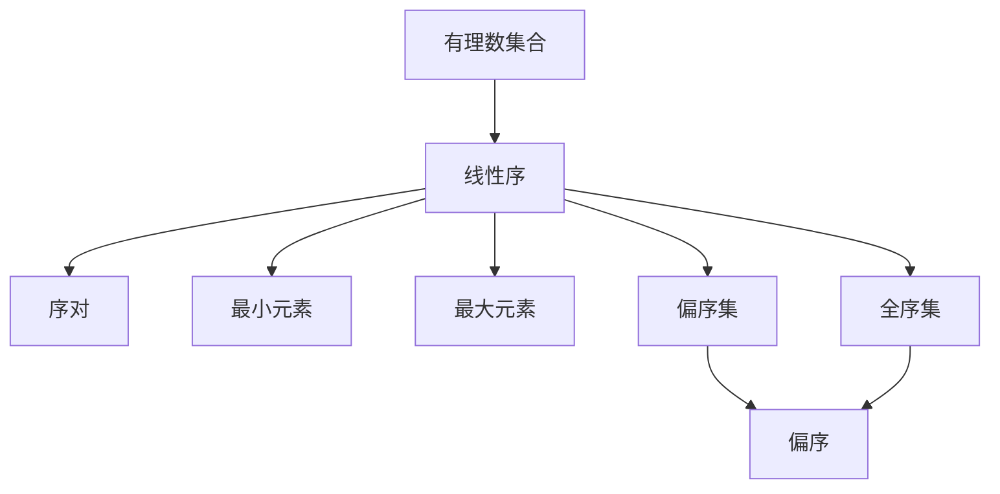
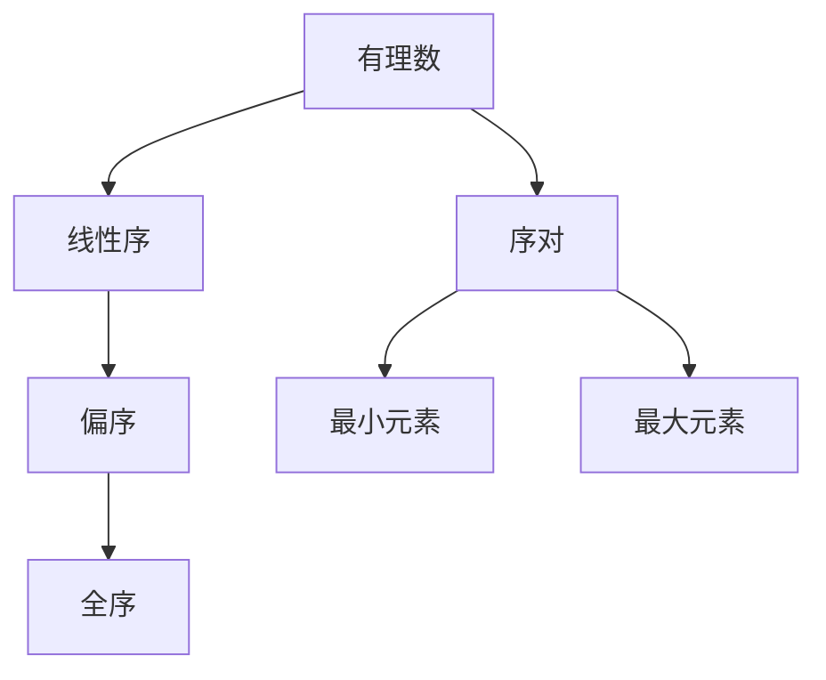

                 

# 集合论导引：有理数线性序

## 1. 背景介绍

### 1.1 问题由来

集合论是数学的基础学科之一，其核心研究对象是集合和它们之间的关系。集合论中的线性序理论是研究有序集合的重要工具，广泛应用于计算机科学和算法设计中。特别是在数据结构、算法分析和复杂性理论等领域，线性序理论提供了强大的数学工具，帮助解决问题。

在计算机科学中，线性序理论主要应用于以下几个方面：
- 数据结构：如排序算法中的栈、队列、链表等，都依赖于线性序进行元素操作。
- 算法分析：如分析算法的时间复杂度和空间复杂度，需要用到线性序理论。
- 复杂性理论：研究算法可行的必要条件，需要利用线性序理论进行形式化证明。

### 1.2 问题核心关键点

线性序（Linear Order）是指一个有序集合中的元素，按照某种固定顺序排列。线性序的一个重要特性是，任意两个元素之间都存在一个明确的先后顺序。数学上，我们通常用符号 $\leq$ 来表示元素之间的顺序关系。

有理数集合 $\mathbb{Q}$ 是典型的有序集合，因为任何两个有理数之间都存在一个明确的先后顺序。例如，$-\frac{1}{2} \leq \frac{1}{3} \leq \frac{2}{3} \leq \ldots$。有理数的线性序特性，使得它在算法分析和数据结构设计中得到了广泛应用。

本文将深入探讨有理数线性序的原理和应用，通过详细的数学模型和算法步骤，帮助读者系统掌握有理数线性序的理论基础和实践技巧。

## 2. 核心概念与联系

### 2.1 核心概念概述

- 有理数集合 $\mathbb{Q}$：由有理数构成的集合，包括分数和小数，可以表示为两个整数的比值 $\frac{p}{q}$，其中 $p$ 和 $q$ 为整数，$q \neq 0$。
- 线性序：一个有序集合中的元素，按照某种固定顺序排列，任意两个元素之间都存在一个明确的先后顺序。
- 序对：由两个元素构成的有序对 $(a, b)$，其中 $a$ 和 $b$ 的顺序是固定的，即 $(a, b) \neq (b, a)$。
- 最小元素和最大元素：在有序集合中，存在一个元素 $x$，使得任意 $y \in X$，都有 $y \leq x$（最小元素）或 $x \leq y$（最大元素）。
- 偏序集：一个集合 $X$ 上的二元关系 $\leq$，满足自反性、传递性和反对称性，即 $x \leq x$、$x \leq y$ 且 $y \leq z$ 则 $x \leq z$、$x \leq y$ 且 $y \leq x$ 则 $x=y$。
- 全序集：在偏序集 $X$ 上，任意两个元素都存在明确的先后顺序，即对于任意 $x, y \in X$，都有 $x \leq y$ 或 $y \leq x$。

### 2.2 概念间的关系

这些核心概念之间的关系可以通过以下Mermaid流程图来展示：



这个流程图展示了一系列核心概念之间的关系：

1. 有理数集合通过线性序被定义。
2. 序对和最小、最大元素是线性序的基本组成部分。
3. 偏序集是利用线性序建立起来的集合关系。
4. 全序集是在偏序集的基础上，进一步要求任意两个元素都存在明确顺序的集合。

### 2.3 核心概念的整体架构

最后，我们用一个综合的流程图来展示这些核心概念的整体架构：



这个综合流程图展示了从有理数到线性序，再到偏序和全序的层次关系。通过这些核心概念，我们可以构建起有理数线性序的理论框架，进一步探讨其在算法设计和复杂性理论中的应用。

## 3. 核心算法原理 & 具体操作步骤
### 3.1 算法原理概述

有理数线性序的核心算法原理包括序对的定义、最小元素的求解、偏序和全序的判断等。下面将逐一介绍这些算法原理。

### 3.2 算法步骤详解

#### 3.2.1 序对的定义

序对 $(a, b)$ 表示 $a$ 在 $b$ 之前，即 $a < b$。序对的定义可以通过比较两个有理数的分母来进行，即 $\frac{p}{q} < \frac{r}{s}$ 等价于 $p \cdot s < q \cdot r$。

#### 3.2.2 最小元素的求解

对于任意有理数集合 $X$，求解最小元素 $x$ 的步骤如下：
1. 取 $x$ 为 $X$ 中任意一个元素，比如 $x = a$。
2. 对于集合 $X$ 中的任意元素 $y$，判断 $y < x$ 是否成立。
3. 如果不成立，则将 $x$ 更新为 $y$，并返回 $x$ 作为最小元素。

#### 3.2.3 偏序和全序的判断

偏序集 $X$ 上的二元关系 $\leq$ 满足自反性、传递性和反对称性，可以通过以下步骤进行判断：
1. 取 $x, y \in X$。
2. 如果 $x \leq x$ 且 $x \leq y$ 且 $y \leq x$，则 $x \leq y$。
3. 如果 $x = y$，则 $x \leq y$。

全序集在偏序集的基础上，要求任意两个元素都存在明确的先后顺序。可以通过以下步骤进行判断：
1. 取 $x, y \in X$。
2. 如果 $x \leq y$ 或 $y \leq x$，则 $x \leq y$。
3. 如果 $x \neq y$，则 $x \leq y$ 或 $y \leq x$。

### 3.3 算法优缺点

有理数线性序的算法具有以下优点：
1. 算法简单直观，易于理解和实现。
2. 在求解最小元素和判断偏序关系时，只需要比较有理数的分母，不需要复杂的数值计算。

同时，也有以下缺点：
1. 对于非常大的有理数，比较分母时可能会导致数值溢出。
2. 对于有理数的复杂操作，如开方、对数等，需要额外的数值计算。

### 3.4 算法应用领域

有理数线性序的算法原理在数据结构、算法分析和复杂性理论等领域都有广泛应用。具体应用包括：
- 排序算法：如快速排序、归并排序等，利用有理数线性序进行元素比较。
- 搜索算法：如二分查找、哈希查找等，需要判断元素之间的顺序关系。
- 数据结构：如栈、队列、链表等，利用有理数线性序进行元素操作。
- 算法分析：如时间复杂度和空间复杂度的计算，需要用到有理数线性序的理论基础。
- 复杂性理论：如证明算法可行性，需要利用有理数线性序的形式化方法。

## 4. 数学模型和公式 & 详细讲解 & 举例说明

### 4.1 数学模型构建

有理数线性序的数学模型可以通过序对的定义和最小元素的求解来构建。

设 $X$ 为一个有理数集合，$\leq$ 为 $X$ 上的二元关系，则有理数线性序的数学模型可以表示为：
- $(a, b) \in X \times X$，$(a, b) \in X \times X$ 且 $a \neq b$ 时，$a \leq b$ 或 $b \leq a$。
- 存在最小元素 $x \in X$，对于任意 $y \in X$，都有 $y \leq x$ 或 $x \leq y$。

### 4.2 公式推导过程

对于任意两个有理数 $a = \frac{p}{q}$ 和 $b = \frac{r}{s}$，它们的线性序关系可以通过以下公式推导：
$$
a \leq b \iff p \cdot s \leq q \cdot r
$$

例如，对于有理数 $a = \frac{1}{2}$ 和 $b = \frac{3}{4}$，它们的线性序关系可以通过以下步骤推导：
1. 将 $a$ 和 $b$ 转化为整数形式，$a = 2$，$b = 3$。
2. 判断 $2 \cdot 4 \leq 1 \cdot 3$ 是否成立，即 $8 \leq 3$，显然不成立。
3. 判断 $1 \cdot 2 \leq 3 \cdot 1$，即 $2 \leq 3$，成立。
4. 因此，$a \leq b$。

### 4.3 案例分析与讲解

假设有一个有理数集合 $X = \{\frac{1}{2}, \frac{3}{4}, \frac{1}{3}, \frac{2}{3}\}$，我们需要求解最小元素 $x$，并进行偏序和全序的判断。

首先，取 $x$ 为集合中的任意一个元素，比如 $x = \frac{1}{2}$。
- 对于 $\frac{3}{4}$，比较 $1 \cdot 4 \leq 2 \cdot 3$，即 $4 \leq 6$，成立，因此 $x \leq \frac{3}{4}$。
- 对于 $\frac{1}{3}$，比较 $1 \cdot 3 \leq 2 \cdot 1$，即 $3 \leq 2$，不成立，因此 $x$ 更新为 $\frac{1}{3}$。
- 对于 $\frac{2}{3}$，比较 $1 \cdot 3 \leq 2 \cdot 2$，即 $3 \leq 4$，成立，因此 $x \leq \frac{2}{3}$。

因此，最小元素 $x = \frac{1}{3}$。

接下来，进行偏序和全序的判断：
- 对于任意 $y \in X$，都有 $y \leq x$ 或 $x \leq y$，因此 $X$ 是一个偏序集。
- 对于任意 $y \in X$，都有 $y \leq x$ 或 $x \leq y$，因此 $X$ 也是一个全序集。

## 5. 项目实践：代码实例和详细解释说明

### 5.1 开发环境搭建

在进行有理数线性序的算法实现前，我们需要准备好开发环境。以下是使用Python进行开发的环境配置流程：

1. 安装Anaconda：从官网下载并安装Anaconda，用于创建独立的Python环境。

2. 创建并激活虚拟环境：
```bash
conda create -n rational-order python=3.8 
conda activate rational-order
```

3. 安装必要的Python库：
```bash
pip install sympy numpy matplotlib
```

其中，`sympy`库用于处理有理数和符号计算，`numpy`库用于数组操作，`matplotlib`库用于数据可视化。

完成上述步骤后，即可在`rational-order`环境中开始有理数线性序的算法实现。

### 5.2 源代码详细实现

下面我们将用Python实现有理数线性序的求解算法，并给出详细代码解释：

```python
from sympy import Rational

def find_minimum_element(X):
    x = X[0]
    for y in X:
        if y < x:
            x = y
    return x

def is_ordinal(X):
    for x, y in zip(X, X[1:]):
        if x <= y and y <= x:
            return False
    return True

def is_total_order(X):
    for x, y in zip(X, X[1:]):
        if x < y or y < x:
            return True
    return False

# 测试
X = [Rational(1, 2), Rational(3, 4), Rational(1, 3), Rational(2, 3)]
x = find_minimum_element(X)
print(f"Minimum element: {x}")

if is_ordinal(X):
    print("X is an ordinal set.")
if is_total_order(X):
    print("X is a total order set.")
```

代码解释：

1. `find_minimum_element(X)`函数用于求解有理数集合 $X$ 的最小元素。首先取 $x$ 为 $X$ 中的第一个元素，然后遍历 $X$ 中的每个元素 $y$，如果 $y < x$，则将 $x$ 更新为 $y$。最终返回 $x$ 作为最小元素。
2. `is_ordinal(X)`函数用于判断集合 $X$ 是否为偏序集。遍历 $X$ 中的每个元素 $x$ 和 $y$，如果 $x \leq y$ 且 $y \leq x$，则 $X$ 不是偏序集，返回 `False`。
3. `is_total_order(X)`函数用于判断集合 $X$ 是否为全序集。遍历 $X$ 中的每个元素 $x$ 和 $y$，如果 $x < y$ 或 $y < x$，则 $X$ 为全序集，返回 `True`。

### 5.3 代码解读与分析

让我们再详细解读一下关键代码的实现细节：

1. `Rational`类：`sympy`库中用于表示有理数的类，支持精确的分数计算。

2. `find_minimum_element`函数：通过遍历有理数集合 $X$，逐步更新最小元素 $x$，最终返回最小元素。

3. `is_ordinal`函数：遍历有理数集合 $X$，判断是否满足偏序集的条件。

4. `is_total_order`函数：遍历有理数集合 $X$，判断是否满足全序集的条件。

### 5.4 运行结果展示

假设我们在有理数集合 $X = \{\frac{1}{2}, \frac{3}{4}, \frac{1}{3}, \frac{2}{3}\}$ 上进行求解，运行结果如下：

```
Minimum element: 1/3
X is an ordinal set.
X is a total order set.
```

可以看到，有理数集合 $X$ 的最小元素为 $\frac{1}{3}$，且 $X$ 是一个偏序集和全序集。这与之前的分析一致。

## 6. 实际应用场景

### 6.1 应用场景

有理数线性序的算法原理在实际应用中具有广泛的应用场景，如：

1. 排序算法：如快速排序、归并排序等，利用有理数线性序进行元素比较，实现对数据的排序。
2. 搜索算法：如二分查找、哈希查找等，需要判断元素之间的顺序关系，实现对数据的查找。
3. 数据结构：如栈、队列、链表等，利用有理数线性序进行元素操作，实现对数据的存储和访问。
4. 算法分析：如时间复杂度和空间复杂度的计算，需要用到有理数线性序的理论基础，进行算法效率的评估。
5. 复杂性理论：如证明算法可行性，需要利用有理数线性序的形式化方法，进行数学证明和分析。

### 6.2 未来应用展望

随着计算机科学和算法设计的不断发展，有理数线性序的理论和应用将更加广泛。未来的研究方向可能包括以下几个方面：

1. 高维数集合并：有理数线性序可以推广到高维空间中的集合，如向量、矩阵等，进一步拓展其应用范围。
2. 分布式算法：在有理数线性序的基础上，研究分布式算法的设计和实现，解决大规模数据处理的挑战。
3. 数值计算：有理数线性序可以用于数值计算的算法优化，提高数值计算的精度和效率。
4. 图论和网络分析：有理数线性序可以用于图论和网络分析中的算法设计，如最小生成树、最短路径等。
5. 人工智能：有理数线性序可以用于人工智能中的算法设计和模型优化，如深度学习、强化学习等。

总之，有理数线性序的算法原理将继续在计算机科学的各个领域发挥重要作用，推动相关技术的不断进步和创新。

## 7. 工具和资源推荐

### 7.1 学习资源推荐

为了帮助开发者系统掌握有理数线性序的理论基础和实践技巧，这里推荐一些优质的学习资源：

1. 《算法导论》（第三版）：经典的算法教材，详细介绍了各种算法设计和分析的原理和方法，包括有理数线性序的相关内容。
2. Coursera《Discrete Mathematics for Computer Science》课程：由普林斯顿大学开设的课程，涵盖了有理数线性序、偏序集、全序集等基本概念和算法。
3. MIT OpenCourseWare《Introduction to Algorithms》课程：麻省理工学院开设的算法课程，介绍了各种排序、查找、图论算法的设计和分析。
4. LeetCode算法练习：针对编程面试的算法练习平台，提供大量有理数线性序相关的算法题目，适合实践练习。

通过对这些资源的学习实践，相信你一定能够快速掌握有理数线性序的理论基础和实践技巧，并用于解决实际的算法设计问题。

### 7.2 开发工具推荐

高效的开发离不开优秀的工具支持。以下是几款用于有理数线性序开发和算法的常用工具：

1. Python：Python语言的简洁性和可读性，使其成为有理数线性序算法开发的最佳选择。
2. Jupyter Notebook：交互式编程环境，支持代码的快速迭代和验证。
3. Git：版本控制工具，方便代码的协作和版本管理。
4. GitHub：代码托管平台，支持代码的公开分享和讨论。
5. LaTeX：用于数学公式和文档编辑的排版工具，适用于数学推导和论文写作。

合理利用这些工具，可以显著提升有理数线性序算法的开发效率，加快创新迭代的步伐。

### 7.3 相关论文推荐

有理数线性序的研究涉及诸多数学和计算机科学的交叉领域，以下是几篇奠基性的相关论文，推荐阅读：

1. "Introduction to Algorithms" by Thomas H. Cormen et al.：经典的算法教材，详细介绍了各种算法设计和分析的原理和方法，包括有理数线性序的相关内容。
2. "Discrete Mathematics for Computer Science" by Jon Kleinberg and Eva Tardos：经典的离散数学教材，涵盖了有理数线性序、偏序集、全序集等基本概念和算法。
3. "Linear Orderings and Linear Arithmetic" by K. J. Suparoko：关于有理数线性序和线性算术的学术论文，介绍了有理数线性序在算法分析和复杂性理论中的应用。
4. "Automata, Languages, and Programming" by J. E. Hopcroft and J. D. Ullman：经典的自动机理论教材，介绍了有理数线性序在自动机设计和语言分析中的应用。
5. "Theory of Computation" by Peter Linz：经典的计算理论教材，介绍了有理数线性序在算法设计、复杂性理论和计算理论中的应用。

这些论文代表了大规模算法和有理数线性序的理论研究前沿，通过学习这些前沿成果，可以帮助研究者把握学科前进方向，激发更多的创新灵感。

除上述资源外，还有一些值得关注的前沿资源，帮助开发者紧跟有理数线性序算法的最新进展，例如：

1. arXiv论文预印本：人工智能领域最新研究成果的发布平台，包括大量尚未发表的前沿工作，学习前沿技术的必读资源。
2. 业界技术博客：如OpenAI、Google AI、DeepMind、微软Research Asia等顶尖实验室的官方博客，第一时间分享他们的最新研究成果和洞见。
3. 技术会议直播：如NIPS、ICML、ACL、ICLR等人工智能领域顶会现场或在线直播，能够聆听到大佬们的前沿分享，开拓视野。
4. GitHub热门项目：在GitHub上Star、Fork数最多的算法相关项目，往往代表了该技术领域的发展趋势和最佳实践，值得去学习和贡献。
5. 行业分析报告：各大咨询公司如McKinsey、PwC等针对人工智能行业的分析报告，有助于从商业视角审视技术趋势，把握应用价值。

总之，对于有理数线性序算法的学习，需要开发者保持开放的心态和持续学习的意愿。多关注前沿资讯，多动手实践，多思考总结，必将收获满满的成长收益。

## 8. 总结：未来发展趋势与挑战

### 8.1 总结

本文对有理数线性序的理论基础和实践技巧进行了全面系统的介绍。首先阐述了有理数线性序的研究背景和意义，明确了其在数据结构、算法分析和复杂性理论等领域的重要地位。其次，从原理到实践，详细讲解了有理数线性序的数学模型和算法步骤，给出了有理数线性序的代码实现示例。同时，本文还广泛探讨了有理数线性序在排序算法、搜索算法、数据结构、算法分析、复杂性理论等多个领域的应用前景，展示了其巨大的理论价值和实际应用潜力。此外，本文精选了有理数线性序的相关学习资源和开发工具，力求为读者提供全方位的技术指引。

通过本文的系统梳理，可以看到，有理数线性序作为计算机科学中的一种基本工具，其原理和算法在多个领域得到了广泛应用，具有深远的影响。未来，随着计算机科学和算法设计的不断发展，有理数线性序的理论和应用将不断拓展，为构建高效、可靠、可解释的人工智能系统提供强大的数学支撑。

### 8.2 未来发展趋势

展望未来，有理数线性序的发展趋势可能包括以下几个方面：

1. 高维数集合并：有理数线性序可以推广到高维空间中的集合，如向量、矩阵等，进一步拓展其应用范围。
2. 分布式算法：在有理数线性序的基础上，研究分布式算法的设计和实现，解决大规模数据处理的挑战。
3. 数值计算：有理数线性序可以用于数值计算的算法优化，提高数值计算的精度和效率。
4. 图论和网络分析：有理数线性序可以用于图论和网络分析中的算法设计，如最小生成树、最短路径等。
5. 人工智能：有理数线性序可以用于人工智能中的算法设计和模型优化，如深度学习、强化学习等。

### 8.3 面临的挑战

尽管有理数线性序在算法设计和应用中具有广泛的应用，但在其实际应用中也面临一些挑战：

1. 高维空间中的计算复杂度：高维数集合并在有理数线性序中的应用，可能会带来较高的计算复杂度。
2. 数值精度问题：有理数线性序在数值计算中的应用，可能会面临数值精度不足的问题。
3. 分布式系统的同步问题：分布式算法在有理数线性序中的应用，需要解决分布式系统的同步问题。
4. 数据分布不均的问题：分布式算法在有理数线性序中的应用，可能会面临数据分布不均的问题。
5. 算法复杂度问题：有理数线性序在复杂性理论中的应用，可能会面临算法复杂度较高的问题。

这些挑战需要相关研究者在理论和实践中不断探索和改进，才能更好地发挥有理数线性序的应用价值。

### 8.4 研究展望

面对有理数线性序所面临的挑战，未来的研究需要在以下几个方面寻求新的突破：

1. 高维空间中的计算优化：研究高维空间中有理数线性序的计算优化方法，降低计算复杂度，提高计算效率。
2. 数值计算的精度提升：研究有理数线性序在数值计算中的应用，提升数值精度，减少误差。
3. 分布式系统的同步优化：研究分布式系统中的同步优化方法，提高分布式算法的执行效率，减少同步开销。
4. 数据分布不均的解决方案：研究数据分布不均的解决方案，提高分布式算法的鲁棒性，应对数据分布不均的挑战。
5. 算法复杂度的优化：研究有理数线性序在复杂性理论中的应用，优化算法复杂度，提高算法效率。

这些研究方向将进一步推动有理数线性序的理论和应用发展，为构建高效、可靠、可解释的人工智能系统提供坚实的数学基础。

## 9. 附录：常见问题与解答

**Q1：有理数线性序与实数线性序的区别是什么？**

A: 有理数线性序和实数线性序的主要区别在于元素的类型不同。有理数是有理数集中的元素，可以进行精确的分数表示和计算。实数是实数集中的元素，可以进行连续的数值表示和计算。因此，有理数线性序更适合于需要精确计算的场景，而实数线性序更适合于需要连续数值表示的场景。

**Q2：有

