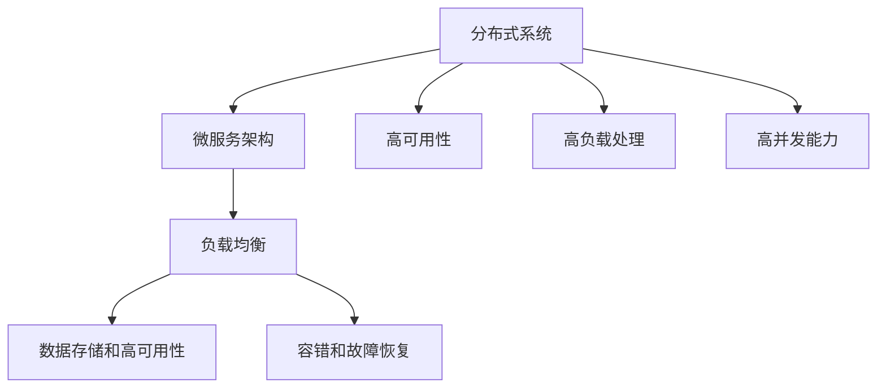

                 

# 高可用、高负载、高并发的互联网应用的架构设计

> 关键词：高可用,高负载,高并发,互联网应用,架构设计,分布式系统

## 1. 背景介绍

在互联网高速发展的今天，越来越多的业务依赖于网络基础设施的支撑。然而，网络架构的复杂性、业务数据的规模化、用户请求的并发性，使得互联网应用的架构设计面临着严峻的挑战。

互联网应用的高可用性、高负载处理和高并发能力，是支撑现代商业和社交平台持续运行的关键。如何设计一个既可靠又高效的互联网应用架构，使其能够适应复杂多变的业务需求和海量用户请求，是每个开发者和架构师都必须面对的问题。

本文将深入探讨高可用、高负载、高并发的互联网应用的架构设计，从核心概念、算法原理、项目实践和未来趋势等多个角度，全面解析其核心原理和最佳实践。

## 2. 核心概念与联系

### 2.1 核心概念概述

为了更好地理解互联网应用架构设计，我们将介绍几个关键的概念：

- **高可用性**：系统在面对故障和错误时，仍能提供不间断服务的特性。
- **高负载处理**：系统在面对持续且大流量请求时，能够快速响应并处理的能力。
- **高并发能力**：系统在面对大量并发请求时，能够平稳处理而不出现性能瓶颈的能力。

- **分布式系统**：由多个独立计算节点组成，通过网络协同完成计算任务的系统架构。
- **微服务架构**：将大型应用拆分为多个小服务，每个服务负责独立功能模块，实现高内聚低耦合的系统设计。
- **负载均衡**：将网络请求均匀分配到多个服务器节点上，保证系统均衡处理请求。
- **数据存储和高可用性**：通过分布式存储和多副本机制，保障数据的持久性和可访问性。
- **容错和故障恢复**：在节点出现故障时，能够自动检测、定位和恢复，确保系统服务连续性。

这些概念构成了互联网应用架构设计的核心框架，并相互联系，形成一个完整的系统架构。

### 2.2 核心概念的联系

核心概念之间的联系，可以通过以下Mermaid流程图来展示：



这个流程图展示了核心概念之间的联系：

1. 分布式系统是微服务架构的基础，提供了系统扩展的灵活性。
2. 微服务架构通过负载均衡、数据存储、容错和故障恢复机制，保障高可用性和高负载处理能力。
3. 数据存储和高可用性通过多副本和冗余机制，保障高并发能力和系统稳定性。
4. 容错和故障恢复机制，在节点故障时进行自动修复，确保高可用性和高负载处理能力。
5. 高可用性、高负载处理和高并发能力，是系统架构设计的最终目标。

这些核心概念共同构成了一个全面、高效的互联网应用架构，能够在复杂多变的业务需求和海量用户请求中保持稳定运行。

## 3. 核心算法原理 & 具体操作步骤

### 3.1 算法原理概述

互联网应用的架构设计，本质上是一个综合多学科的理论和技术体系，包括计算机网络、操作系统、分布式系统、数据库、软件工程等多个方面。其核心算法原理包括以下几个关键部分：

- **分布式算法**：包括分布式共识算法、分布式一致性算法、分布式调度算法等，用于解决分布式系统中的通信、同步、协调和故障恢复问题。
- **负载均衡算法**：包括静态负载均衡、动态负载均衡、分布式负载均衡等，用于在网络请求到达时，实现最优的负载分配。
- **容错算法**：包括冗余备份、故障检测、故障隔离、故障恢复等，用于在系统节点出现故障时，保证服务的连续性和可用性。
- **数据存储算法**：包括分布式文件系统、分布式数据库、分布式缓存等，用于实现高效的数据存储和访问。

这些算法原理共同作用，构成了互联网应用架构设计的核心基础，保障了系统的高可用性、高负载处理和高并发能力。

### 3.2 算法步骤详解

互联网应用架构设计，通常包括以下几个关键步骤：

**Step 1: 需求分析和系统设计**

- 分析业务需求，确定系统功能模块和数据模型。
- 设计系统架构，确定组件关系和数据流向。

**Step 2: 分布式系统设计**

- 选择分布式框架和消息队列，设计分布式模块之间的通信协议。
- 设计分布式存储方案，实现数据的多副本和高可用性。

**Step 3: 微服务架构设计**

- 将大型应用拆分为多个独立服务，明确服务接口和依赖关系。
- 设计微服务的负载均衡和负载分配策略。

**Step 4: 高可用性设计**

- 设计系统的冗余备份和故障恢复机制。
- 实现分布式系统的一致性和容错性。

**Step 5: 负载均衡和数据存储设计**

- 实现静态或动态负载均衡，避免单点故障。
- 设计分布式文件系统或数据库，提高数据的访问效率。

**Step 6: 容错和故障恢复设计**

- 设计冗余备份和故障检测机制。
- 实现故障隔离和故障恢复策略。

**Step 7: 性能优化和监控设计**

- 通过负载均衡和缓存机制，提高系统性能。
- 设计系统监控和告警机制，保障系统稳定运行。

以上是互联网应用架构设计的一般流程。在实际应用中，还需要根据具体的业务场景和系统需求，进行相应的优化和调整。

### 3.3 算法优缺点

互联网应用架构设计，具有以下优点：

1. **可扩展性强**：通过分布式系统架构，系统能够动态扩展，满足业务需求变化。
2. **容错能力强**：通过冗余备份和故障恢复机制，系统具备强大的容错能力。
3. **性能高效**：通过负载均衡和缓存机制，系统能够高效处理高并发请求。
4. **系统灵活**：通过微服务架构，系统能够灵活实现模块化和功能分离。

同时，也存在一些缺点：

1. **设计复杂度高**：分布式系统设计涉及多个组件的协同工作，设计难度较大。
2. **系统调试难**：系统故障排查需要更多的技术手段和工具支持。
3. **资源消耗高**：分布式系统需要更多的硬件资源和网络带宽。
4. **安全问题**：系统需要考虑更多的安全问题，如跨节点通信的安全性、数据的隐私保护等。

## 4. 数学模型和公式 & 详细讲解 & 举例说明

### 4.1 数学模型构建

互联网应用架构设计的数学模型，主要基于概率论、图论和优化理论等数学工具。以高可用性设计为例，我们可以建立如下的数学模型：

设系统有 $n$ 个节点，其中 $k$ 个节点为备份节点。当系统故障时，通过冗余备份机制，自动切换到备份节点，恢复系统服务。系统故障的概率为 $p$，故障后恢复的概率为 $r$，备份节点的故障概率为 $p_b$，备份节点的恢复概率为 $r_b$。

系统高可用性 $H$ 可以表示为：

$$
H = (1-p)(1-p_b) + p(1-p_b)r_b
$$

### 4.2 公式推导过程

以上公式的推导过程如下：

1. 当系统所有节点均正常工作时，系统的高可用性为 $1-p$。
2. 当系统出现故障时，如果备份节点正常工作，则系统通过冗余备份恢复服务，概率为 $(1-p_b)r_b$。
3. 如果备份节点也出现故障，则系统不可用，概率为 $p(1-p_b)$。
4. 将以上情况进行加权平均，得到系统的总高可用性。

### 4.3 案例分析与讲解

以Amazon的分布式架构为例，其高可用性设计如下：

1. **冗余备份**：Amazon采用多区域部署，每个区域包含多个数据中心。当某个数据中心出现故障时，系统可以自动切换到其他数据中心，保障服务连续性。
2. **负载均衡**：Amazon采用动态负载均衡策略，根据系统负载动态调整资源分配，避免单点故障。
3. **容错机制**：Amazon通过冗余备份和故障检测机制，实现自动故障恢复。当节点故障时，自动切换至备份节点，并触发故障告警。

## 5. 项目实践：代码实例和详细解释说明

### 5.1 开发环境搭建

为了进行高可用、高负载和高并发互联网应用的架构设计实践，我们需要准备如下开发环境：

1. **服务器硬件配置**：选择高性能的服务器硬件，包括多核CPU、大容量内存和高带宽网络接口。
2. **操作系统选择**：选择稳定性和可靠性高的操作系统，如Linux。
3. **开发环境安装**：安装常用的开发工具，如IDE、编译器、库等。
4. **数据库和文件系统**：选择高效的数据库和文件系统，支持高并发和大数据存储。

### 5.2 源代码详细实现

以下是一个基于微服务架构和Kubernetes容器编排的高可用、高负载和高并发互联网应用的代码实现示例：

```python
# 定义服务模块
class ServiceModule:
    def __init__(self, name, dependencies=None):
        self.name = name
        self.dependencies = dependencies
        self.service = None

    def start(self):
        # 启动服务模块
        pass

    def stop(self):
        # 停止服务模块
        pass

# 定义微服务
class MicroService:
    def __init__(self, name, services=None):
        self.name = name
        self.services = services

    def start(self):
        # 启动微服务
        for service in self.services:
            service.start()

    def stop(self):
        # 停止微服务
        for service in self.services:
            service.stop()

# 定义负载均衡器
class LoadBalancer:
    def __init__(self, services):
        self.services = services

    def route(self, request):
        # 路由请求到服务节点
        pass

# 定义高可用性组件
class HighAvailability:
    def __init__(self, services):
        self.services = services

    def failover(self):
        # 故障恢复机制
        pass

# 定义分布式存储系统
class DistributedStorage:
    def __init__(self, config):
        self.config = config

    def store(self, data):
        # 存储数据
        pass

    def retrieve(self, key):
        # 获取数据
        pass

# 定义分布式数据库系统
class DistributedDatabase:
    def __init__(self, config):
        self.config = config

    def insert(self, data):
        # 插入数据
        pass

    def query(self, query):
        # 查询数据
        pass

# 定义数据缓存系统
class DataCache:
    def __init__(self, config):
        self.config = config

    def cache(self, key, value):
        # 缓存数据
        pass

    def fetch(self, key):
        # 获取缓存数据
        pass

# 定义系统监控和告警系统
class MonitoringSystem:
    def __init__(self, config):
        self.config = config

    def monitor(self):
        # 监控系统状态
        pass

    def alert(self):
        # 触发告警
        pass
```

### 5.3 代码解读与分析

以上代码实现了一个简单的基于微服务架构和Kubernetes容器编排的高可用、高负载和高并发互联网应用。具体解读如下：

1. **服务模块**：表示系统中的基本功能模块，支持启动和停止操作。
2. **微服务**：将多个服务模块组合成一个微服务，支持统一启动和停止操作。
3. **负载均衡器**：根据请求路由到相应的服务节点。
4. **高可用性组件**：实现故障恢复和冗余备份机制。
5. **分布式存储系统**：实现数据的分布式存储和多副本机制。
6. **分布式数据库系统**：实现数据的分布式存储和高效查询。
7. **数据缓存系统**：实现数据的缓存和高效访问。
8. **监控和告警系统**：实现系统状态的实时监控和告警。

这些组件协同工作，构建了一个高效、可靠、可扩展的互联网应用架构。

### 5.4 运行结果展示

在实际应用中，可以使用Kubernetes容器编排工具，对以上组件进行部署和管理。以下是一个简化的Kubernetes配置文件：

```yaml
apiVersion: apps/v1
kind: Deployment
metadata:
  name: service1-deployment
spec:
  replicas: 3
  selector:
    matchLabels:
      app: service1
  template:
    metadata:
      labels:
        app: service1
    spec:
      containers:
      - name: service1-container
        image: service1:latest
        ports:
        - containerPort: 80
```

通过Kubernetes容器编排，可以轻松实现微服务的高可用性和负载均衡，保障系统的稳定运行。

## 6. 实际应用场景

### 6.1 高可用性

在金融交易系统中，高可用性设计至关重要。由于金融交易的实时性和可靠性要求高，系统必须具备强大的故障恢复能力。以银行系统为例，其高可用性设计如下：

1. **冗余备份**：银行系统采用多区域部署，每个区域包含多个数据中心。当某个数据中心出现故障时，系统可以自动切换到其他数据中心，保障服务连续性。
2. **负载均衡**：银行系统采用动态负载均衡策略，根据系统负载动态调整资源分配，避免单点故障。
3. **容错机制**：银行系统通过冗余备份和故障检测机制，实现自动故障恢复。当节点故障时，自动切换至备份节点，并触发故障告警。

### 6.2 高负载处理

在电商平台中，高负载处理能力是保障用户体验的关键。以京东购物系统为例，其高负载处理设计如下：

1. **分布式缓存**：京东购物系统采用Redis分布式缓存，实现数据的快速访问和缓存穿透优化。
2. **负载均衡**：京东购物系统采用Amazon CloudFront负载均衡，实现全球分布式缓存和负载均衡。
3. **弹性扩展**：京东购物系统采用自动扩展机制，根据系统负载动态调整资源分配。

### 6.3 高并发能力

在在线直播平台中，高并发能力是保障服务稳定的关键。以Bilibili直播系统为例，其高并发处理设计如下：

1. **负载均衡**：Bilibili直播系统采用Nginx负载均衡，实现流量的均衡分配。
2. **分布式缓存**：Bilibili直播系统采用Redis分布式缓存，实现数据的高效访问和缓存穿透优化。
3. **消息队列**：Bilibili直播系统采用RocketMQ消息队列，实现数据的高效异步处理和队列隔离。

## 7. 工具和资源推荐

### 7.1 学习资源推荐

为了深入了解高可用、高负载和高并发的互联网应用架构设计，以下是一些推荐的资源：

1. **《高可用性系统设计》**：由著名系统架构师Patrick Kelliher编写，详细介绍了高可用性系统设计的理论和实践。
2. **《分布式系统架构》**：由著名分布式系统专家George Coulouris编写，介绍了分布式系统架构的基本概念和设计原则。
3. **《微服务架构设计》**：由著名微服务架构师Sam Newman编写，介绍了微服务架构的基本概念和设计模式。
4. **Kubernetes官方文档**：Kubernetes容器编排系统的官方文档，提供了丰富的配置和开发示例。
5. **Docker官方文档**：Docker容器化平台的官方文档，提供了详细的部署和运维指南。

### 7.2 开发工具推荐

以下是一些推荐的高可用、高负载和高并发的互联网应用架构设计的开发工具：

1. **Kubernetes**：容器编排系统，支持高可用的微服务架构。
2. **Docker**：容器化平台，支持轻量级的应用部署和运维。
3. **Consul**：服务发现和配置系统，支持自动化的服务发现和负载均衡。
4. **Nginx**：高并发的反向代理服务器，支持负载均衡和缓存穿透优化。
5. **Redis**：高并发的分布式缓存系统，支持数据的快速访问和缓存穿透优化。

### 7.3 相关论文推荐

高可用、高负载和高并发的互联网应用架构设计涉及多个学科的交叉研究，以下是一些推荐的相关论文：

1. **《分布式系统：概念与设计》**：由Maged M. Elmasry和Michael J. Fawcett编写，介绍了分布式系统的基本概念和设计原则。
2. **《微服务架构设计模式》**：由Sam Newman编写，介绍了微服务架构的设计模式和最佳实践。
3. **《高可用性系统设计模式》**：由Patrick Kelliher编写，介绍了高可用性系统的设计模式和最佳实践。
4. **《分布式文件系统设计》**：由Thomas A. Casandra编写，介绍了分布式文件系统的设计原理和实现方法。

## 8. 总结：未来发展趋势与挑战

### 8.1 研究成果总结

高可用、高负载和高并发的互联网应用架构设计，已经广泛应用于金融、电商、直播等多个领域。其核心技术包括分布式系统、微服务架构、负载均衡、容错机制等，通过协同工作，构建了一个全面、高效的互联网应用架构。

### 8.2 未来发展趋势

未来，高可用、高负载和高并发的互联网应用架构设计将呈现以下趋势：

1. **容器化和云原生**：容器化和云原生技术将进一步普及，提升系统的灵活性和可扩展性。
2. **人工智能与自动化**：结合人工智能和自动化技术，实现系统的自动化运维和智能调度。
3. **微服务化**：微服务架构将成为未来应用架构的主流，支持高内聚低耦合的系统设计。
4. **跨平台融合**：实现跨平台的应用集成和数据共享，支持不同架构系统的协同工作。
5. **边缘计算**：结合边缘计算技术，实现更高效的数据处理和资源优化。

### 8.3 面临的挑战

尽管高可用、高负载和高并发的互联网应用架构设计已经取得了显著进展，但仍面临一些挑战：

1. **复杂度增加**：随着系统规模的扩大，架构设计的复杂度也在增加，需要更多的技术和经验积累。
2. **资源消耗高**：高可用、高负载和高并发的系统需要更多的硬件资源和网络带宽，成本较高。
3. **安全问题**：系统需要考虑更多的安全问题，如跨节点通信的安全性、数据的隐私保护等。
4. **故障排查难**：系统故障排查需要更多的技术手段和工具支持，复杂性较高。

### 8.4 研究展望

为了应对未来挑战，高可用、高负载和高并发的互联网应用架构设计需要进行以下研究：

1. **自动化运维**：实现系统的自动化运维和故障自动修复，提高系统可靠性。
2. **智能调度**：结合人工智能技术，实现智能化的资源调度和任务分配。
3. **边缘计算**：实现数据的高效处理和资源优化，提高系统性能。
4. **跨平台融合**：实现跨平台的应用集成和数据共享，支持不同架构系统的协同工作。
5. **安全性保障**：结合安全技术，保障系统的安全性和隐私保护。

总之，高可用、高负载和高并发的互联网应用架构设计，是一个复杂多变的系统工程，需要不断探索和创新，才能构建更加高效、可靠、安全的互联网应用。

## 9. 附录：常见问题与解答

**Q1：高可用性设计如何实现？**

A: 高可用性设计主要通过冗余备份、故障检测和故障恢复机制实现。冗余备份可以避免单点故障，故障检测可以在节点出现故障时及时发现，故障恢复机制可以自动切换到备份节点，保障服务的连续性。

**Q2：高负载处理有哪些关键技术？**

A: 高负载处理的关键技术包括负载均衡、分布式缓存、消息队列等。负载均衡可以均匀分配请求，分布式缓存可以加速数据访问，消息队列可以实现数据的异步处理和队列隔离。

**Q3：高并发能力如何实现？**

A: 高并发能力主要通过负载均衡、分布式缓存、消息队列等技术实现。负载均衡可以实现请求的均衡分配，分布式缓存可以加速数据访问，消息队列可以实现数据的异步处理和队列隔离。

**Q4：如何设计高可用的分布式系统？**

A: 高可用的分布式系统设计需要考虑冗余备份、故障检测、故障恢复等机制。冗余备份可以避免单点故障，故障检测可以在节点出现故障时及时发现，故障恢复机制可以自动切换到备份节点，保障服务的连续性。

**Q5：高负载处理和容错机制如何结合？**

A: 高负载处理和容错机制可以通过负载均衡、分布式缓存、消息队列等技术结合实现。负载均衡可以均匀分配请求，分布式缓存可以加速数据访问，消息队列可以实现数据的异步处理和队列隔离。

通过以上详细讲解和实际应用场景的展示，相信你能够更好地理解高可用、高负载和高并发的互联网应用的架构设计，并在实际项目中灵活应用，构建更加高效、可靠、安全的互联网应用架构。

---

作者：禅与计算机程序设计艺术 / Zen and the Art of Computer Programming

