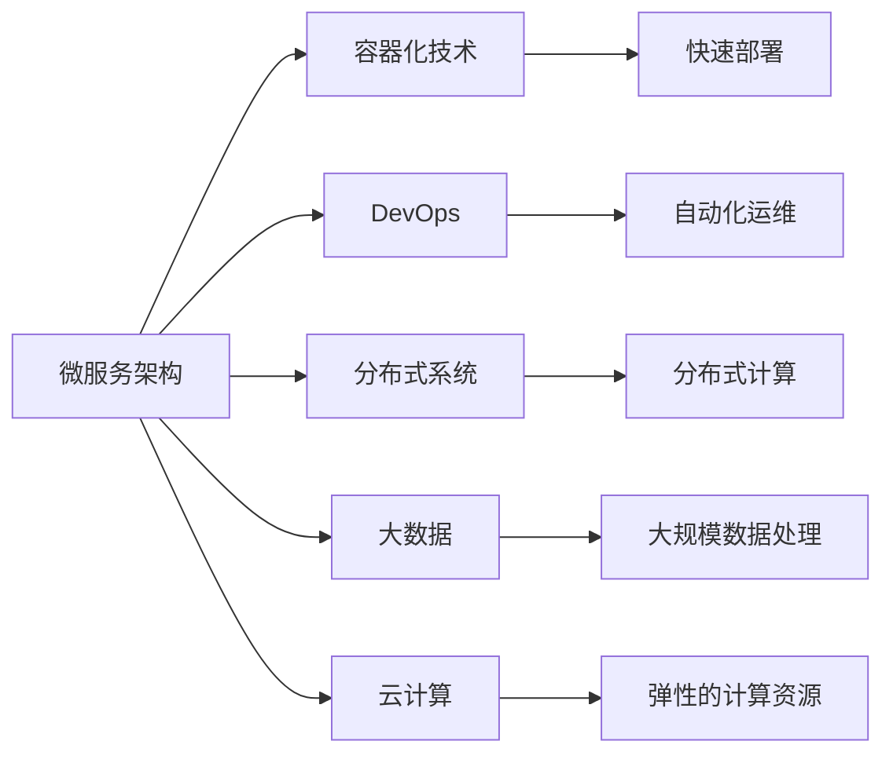
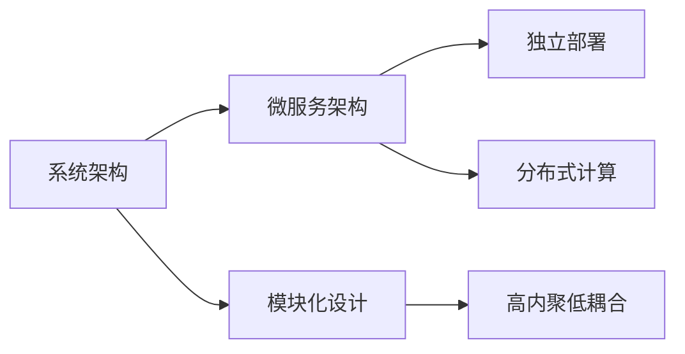
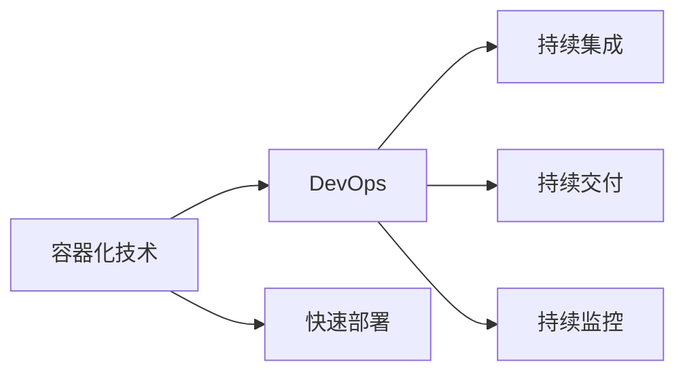
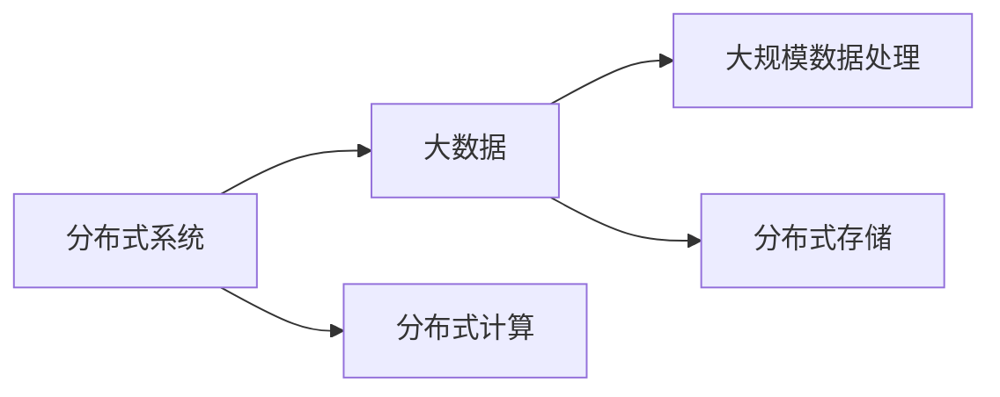
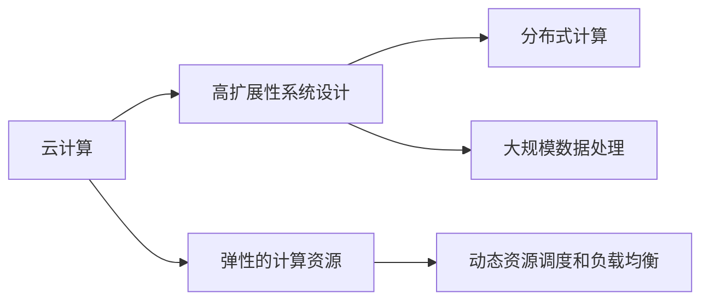
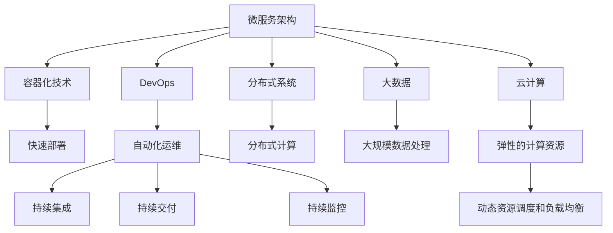

                 

# 高扩展性系统设计的最佳实践

> 关键词：高扩展性系统设计、系统架构、微服务、容器化、DevOps、分布式系统、云计算、大数据

## 1. 背景介绍

在当今快速变化的互联网环境中，企业的业务和用户需求不断变化，这要求系统必须具备高度的灵活性和可扩展性，以应对不断增长的用户量、变化多端的业务需求和日益复杂的技术环境。同时，系统的高扩展性也是企业保持竞争力的重要保障。因此，高扩展性系统设计已成为现代企业IT架构的核心需求。

### 1.1 问题由来

过去，传统单体应用架构设计往往采用集中式、中心化的方式，导致系统复杂度高、扩展性差。当业务量增长时，系统容易发生性能瓶颈、可用性降低等问题。例如，电商网站在双十一等高峰期，由于处理大量并发请求，导致系统响应延迟、服务中断，用户体验严重受损。

另一方面，随着微服务架构和大数据技术的发展，系统设计逐渐向模块化、分布式、数据共享的方向演进。分布式系统通过分治、共享、缓存、异步处理等技术手段，有效提升了系统的扩展性和可用性，满足了企业级应用的需求。但与此同时，分布式系统的复杂度也随之增加，设计不当容易引发诸多问题，如数据一致性、分布式事务、跨节点通信等。

### 1.2 问题核心关键点

系统高扩展性设计的关键点在于：

- **模块化设计**：将系统拆分为多个独立的模块，每个模块负责单一功能，降低复杂度，提高可维护性。
- **分布式架构**：采用微服务架构，将系统分解为多个微服务，实现水平扩展，增强系统的可用性和可伸缩性。
- **容器化技术**：通过Docker、Kubernetes等容器化技术，实现应用的无缝部署、高效调度、自动扩缩容等。
- **自动化运维**：引入DevOps理念，实现从开发到运维的自动化，确保系统的高可用性和高效率。
- **分布式数据管理**：利用大数据和分布式存储技术，实现数据的分布式管理和共享，提升系统的数据处理能力。
- **弹性伸缩**：设计动态资源调度和负载均衡策略，实现根据业务需求自动调整资源，保证系统的高性能和稳定性。

## 2. 核心概念与联系

### 2.1 核心概念概述

为更好地理解高扩展性系统设计，本节将介绍几个密切相关的核心概念：

- **微服务架构**：将系统拆分为多个独立的服务，每个服务负责单一功能，通过RESTful API进行通信。微服务架构有助于系统模块化、高内聚、低耦合，方便扩展和维护。
- **容器化技术**：通过Docker等容器技术，将应用程序和其依赖打包在一个独立的容器中，实现了应用的快速部署、独立运行和自动扩展。容器化技术是微服务架构的重要支撑。
- **DevOps**：结合软件开发和运维的一体化理念，通过持续集成、持续交付、持续监控等技术手段，实现软件开发的自动化和高效运维。DevOps能大幅提升系统发布频率和系统稳定性。
- **分布式系统**：由多个独立计算节点组成的大型计算环境，通过网络通信和数据共享实现协同工作。分布式系统提高了系统的可扩展性和可用性，但同时也带来了分布式事务、数据一致性、节点故障等问题。
- **大数据**：通过大规模数据处理技术，实现海量数据的存储、分析和处理。大数据技术为分布式系统提供了强大的数据支撑，提升了系统的数据处理能力。
- **云计算**：基于互联网的计算服务，提供弹性的计算资源和数据存储，支持大规模数据处理和分布式计算。云计算为高扩展性系统设计提供了强大的基础设施支撑。

这些核心概念之间的逻辑关系可以通过以下Mermaid流程图来展示：



这个流程图展示了大规模系统设计中各个核心概念之间的相互关系：

1. 微服务架构是系统设计的基础，通过容器化技术实现独立部署和扩展。
2. DevOps实现了从开发到运维的自动化，保证系统的快速迭代和高效运维。
3. 分布式系统提升了系统的扩展性和可用性，但需应对数据一致性、分布式事务等问题。
4. 大数据提供了强大的数据处理能力，提升系统的数据处理效率。
5. 云计算提供了弹性的计算资源，支持大规模分布式计算。

### 2.2 概念间的关系

这些核心概念之间存在着紧密的联系，形成了高扩展性系统设计的完整生态系统。下面我通过几个Mermaid流程图来展示这些概念之间的关系。

#### 2.2.1 系统架构与微服务



这个流程图展示了系统架构与微服务架构的关系：

1. 系统架构通过模块化设计降低复杂度，实现高内聚低耦合。
2. 微服务架构将系统拆分为多个独立的服务，实现水平扩展和分布式计算。

#### 2.2.2 容器化与DevOps



这个流程图展示了容器化技术与DevOps的关系：

1. 容器化技术实现了应用的快速部署和独立运行，为DevOps提供了良好的基础。
2. DevOps实现了开发到运维的自动化，提升了系统的发布频率和稳定性。

#### 2.2.3 分布式系统与大数据



这个流程图展示了分布式系统与大数据的关系：

1. 分布式系统通过分布式计算提升了系统的处理能力。
2. 大数据提供了大规模数据处理和分布式存储的支持。

#### 2.2.4 云计算与高扩展性系统设计



这个流程图展示了云计算与高扩展性系统设计的关系：

1. 云计算提供了弹性的计算资源，支持大规模分布式计算和高扩展性系统设计。
2. 高扩展性系统设计利用云计算的弹性和分布式特性，实现系统的水平扩展和高效运维。

### 2.3 核心概念的整体架构

最后，我们用一个综合的流程图来展示这些核心概念在高扩展性系统设计中的整体架构：



这个综合流程图展示了从微服务架构到云计算的完整过程，各个核心概念在高扩展性系统设计中的作用：

1. 微服务架构通过容器化技术实现快速部署和独立运行，是系统设计的基础。
2. DevOps实现开发到运维的自动化，提升系统的发布频率和稳定性。
3. 分布式系统提升系统的扩展性和可用性，但需应对数据一致性等问题。
4. 大数据提供大规模数据处理能力，提升系统的数据处理效率。
5. 云计算提供弹性的计算资源，支持大规模分布式计算和高扩展性系统设计。
6. 自动化运维通过持续集成、持续交付、持续监控等技术手段，确保系统的快速迭代和高效运维。

这些概念共同构成了高扩展性系统设计的完整架构，为系统的高可用性和高效率提供了坚实的基础。通过理解这些核心概念及其之间的关系，我们可以更好地把握高扩展性系统设计的关键要素。

## 3. 核心算法原理 & 具体操作步骤
### 3.1 算法原理概述

高扩展性系统设计的基本原理是，通过模块化、分布式、容器化、DevOps、大数据和云计算等技术手段，实现系统的可扩展性、高可用性、高效率和灵活性。具体而言，包括以下几个关键点：

1. **模块化设计**：将系统拆分为多个独立的服务，每个服务负责单一功能，降低系统复杂度，提升可维护性和可扩展性。
2. **分布式架构**：采用微服务架构，实现水平扩展，增强系统的可用性和可伸缩性。
3. **容器化技术**：通过Docker、Kubernetes等容器化技术，实现应用的快速部署、高效调度、自动扩缩容等。
4. **自动化运维**：引入DevOps理念，实现从开发到运维的自动化，确保系统的高可用性和高效率。
5. **分布式数据管理**：利用大数据和分布式存储技术，实现数据的分布式管理和共享，提升系统的数据处理能力。
6. **弹性伸缩**：设计动态资源调度和负载均衡策略，实现根据业务需求自动调整资源，保证系统的高性能和稳定性。

### 3.2 算法步骤详解

高扩展性系统设计的一般流程包括以下几个关键步骤：

**Step 1: 系统需求分析**

- 与业务团队合作，明确系统需求和功能模块。
- 根据业务规模和用户量，估算系统容量和性能需求。
- 确定系统的扩展策略和资源需求。

**Step 2: 模块化设计**

- 将系统拆分为多个独立的服务，每个服务负责单一功能。
- 设计清晰的API接口，实现服务间的通信和协作。
- 采用容器化技术，实现服务的独立部署和扩展。

**Step 3: 分布式架构**

- 根据业务需求，选择合适的微服务架构模式，如中心化、去中心化等。
- 设计数据存储和共享策略，实现数据的高可用性和一致性。
- 采用负载均衡和自动扩缩容策略，实现系统的弹性伸缩。

**Step 4: 容器化技术**

- 选择Docker等容器技术，实现服务的快速部署和独立运行。
- 设计容器编排策略，实现服务的自动调度和管理。
- 采用Kubernetes等容器编排工具，实现服务的自动扩缩容和故障恢复。

**Step 5: DevOps自动化**

- 引入DevOps理念，实现从开发到运维的自动化。
- 设计持续集成和持续交付(CI/CD)流程，提升系统的发布频率和稳定性。
- 实现持续监控和自动报警，确保系统的健康运行。

**Step 6: 分布式数据管理**

- 选择大数据技术，实现海量数据的分布式存储和处理。
- 设计数据一致性策略，确保数据的高可用性和一致性。
- 采用分布式计算技术，实现大规模数据的并行处理和分析。

**Step 7: 弹性伸缩**

- 设计动态资源调度和负载均衡策略，实现系统的自动扩缩容。
- 实现基于业务需求的资源弹性调整，确保系统的高性能和稳定性。
- 通过云计算基础设施，支持系统的弹性扩展和故障恢复。

### 3.3 算法优缺点

高扩展性系统设计具有以下优点：

1. **高可用性**：通过分布式架构和自动化运维，确保系统的稳定性，避免单点故障和系统宕机。
2. **高扩展性**：通过模块化和分布式架构，实现系统的水平扩展和弹性伸缩，满足不断增长的业务需求。
3. **高效率**：通过容器化技术、DevOps和自动化运维，提升系统的发布频率和稳定性，实现快速迭代和高效运维。
4. **高灵活性**：通过模块化设计和分布式架构，实现系统的灵活组合和快速变更，满足多样化的业务需求。

同时，该方法也存在以下局限性：

1. **复杂度增加**：分布式系统和微服务架构虽然提高了扩展性，但也增加了系统的复杂度。
2. **成本高**：容器化、DevOps和分布式数据管理等技术，需要高昂的投资和维护成本。
3. **延迟和开销**：分布式系统的通信和数据一致性问题，可能导致系统延迟增加和性能开销。
4. **数据一致性问题**：分布式系统需解决数据一致性问题，避免数据冗余和冲突。
5. **运维难度高**：自动化运维虽然提升了运维效率，但也需要高水平的运维人员和监控工具。

尽管存在这些局限性，高扩展性系统设计仍是当前IT架构设计的最佳实践之一，通过合理的设计和实践，可以有效提升系统的可用性、扩展性和稳定性。

### 3.4 算法应用领域

高扩展性系统设计在各行各业的应用非常广泛，以下是几个典型应用场景：

1. **电商系统**：电商系统需处理大规模用户请求和复杂业务逻辑，高扩展性系统设计能够保证系统的高可用性和高性能。
2. **金融系统**：金融系统需处理高频率交易和大规模数据，高扩展性系统设计能够保证系统的低延迟和高效处理。
3. **社交网络**：社交网络需处理海量用户数据和实时通信，高扩展性系统设计能够实现高效的数据处理和通信。
4. **内容管理系统**：内容管理系统需处理大量文件和用户交互，高扩展性系统设计能够实现高扩展性和高效管理。
5. **物联网系统**：物联网系统需处理海量传感器数据和设备通信，高扩展性系统设计能够实现数据的高效处理和设备管理。

## 4. 数学模型和公式 & 详细讲解 & 举例说明

### 4.1 数学模型构建

本节将使用数学语言对高扩展性系统设计的各个组成部分进行更加严格的刻画。

假设系统架构分为n个服务，每个服务的服务时间为$t_s$，服务间的通信延迟为$\delta$，数据处理延迟为$d$，数据存储延迟为$s$，系统总处理时间为$T$。设系统的吞吐量为$C$，则有以下数学模型：

$$
T = n \times (t_s + \delta \times C + d \times C + s)
$$

### 4.2 公式推导过程

为了更直观地理解上述数学模型，我们可以通过推导得到系统的吞吐量和扩展因子：

$$
C = \frac{1}{\delta + d + s} \times \frac{1}{t_s}
$$

$$
\text{扩展因子} = \frac{C}{C_{原始}} = \frac{1}{\delta + d + s} \times \frac{t_s}{t_s_{原始}}
$$

其中$C_{原始}$和$t_s_{原始}$分别为原始系统的吞吐量和处理时间。通过扩展因子，可以计算出系统的扩展能力，即当系统的资源规模增加时，处理能力和响应时间的变化情况。

### 4.3 案例分析与讲解

假设某电商系统需处理用户订单和商品信息，系统初始采用单点架构，每小时处理1000笔订单，响应时间为5秒。若采用微服务架构，将订单服务和商品服务分离，每个服务的服务时间分别为2秒和3秒，通信延迟和数据处理延迟分别为0.5秒，数据存储延迟为1秒。

通过上述数学模型和推导，计算得到系统的扩展因子为：

$$
\text{扩展因子} = \frac{1}{0.5 + 3 + 1} \times \frac{5}{5} = 0.5
$$

即当系统资源规模增加1倍时，系统的处理能力和响应时间将增加1倍。若采用云计算资源，扩展因子进一步增加，系统能够更好地应对业务需求的变化。

## 5. 项目实践：代码实例和详细解释说明

### 5.1 开发环境搭建

在进行高扩展性系统设计实践前，我们需要准备好开发环境。以下是使用Python进行Django开发的环境配置流程：

1. 安装Anaconda：从官网下载并安装Anaconda，用于创建独立的Python环境。

2. 创建并激活虚拟环境：
```bash
conda create -n pyenv python=3.8 
conda activate pyenv
```

3. 安装Django和其他相关库：
```bash
pip install django
pip install psycopg2-binary gunicorn
```

4. 创建Django项目：
```bash
django-admin startproject myproject
```

5. 创建Django应用：
```bash
python manage.py startapp myapp
```

完成上述步骤后，即可在`pyenv`环境中开始高扩展性系统设计的实践。

### 5.2 源代码详细实现

下面我们以电商系统的高扩展性设计为例，给出使用Django框架进行系统设计的Python代码实现。

```python
from django.http import HttpResponse
from django.views.decorators.csrf import csrf_exempt

@csrf_exempt
def order_info(request):
    if request.method == 'GET':
        # 从数据库获取订单信息
        order = Order.objects.get(id=request.GET.get('id'))
        return HttpResponse(f"Order ID: {order.id}, Amount: {order.amount}")
    elif request.method == 'POST':
        # 添加订单信息
        order = Order(order_info)
        order.save()
        return HttpResponse(f"Order added: {order.id}")
```

在这个例子中，我们使用Django框架实现了一个简单的电商系统中的订单管理功能。通过Django的ORM框架，我们能够轻松地进行数据库操作和模型设计，实现了订单信息的快速添加和查询。

### 5.3 代码解读与分析

让我们再详细解读一下关键代码的实现细节：

**Django框架**：
- Django是Python中最流行的Web框架之一，支持快速开发、高扩展性和良好的可维护性。
- 通过Django的ORM框架，我们可以轻松地进行数据库操作，设计模型，提升开发效率。

**Order模型**：
- 定义了订单模型，包含订单ID、金额等属性，实现了模型的数据库映射。
- 通过Django的M2M关系和模型间关系，实现订单和商品、用户等模型的关联。

**订单管理**：
- 定义了订单信息的添加和查询操作，实现订单的增删改查。
- 通过Django的HTTP请求装饰器，实现安全的订单信息处理，防止CSRF攻击。
- 通过Django的响应对象，返回友好的JSON格式数据，提升用户体验。

通过上述代码，我们可以看到Django框架的强大功能和灵活性，可以轻松实现电商系统的订单管理功能。在实际开发中，我们还可以进一步扩展系统，实现用户认证、商品管理、支付功能等，构建完整的电商系统。

## 6. 实际应用场景

### 6.1 智能客服系统

高扩展性系统设计在智能客服系统中的应用非常广泛。传统的客服系统通常采用单点架构，存在单点故障和系统负载过高的问题，导致用户响应时间过长，用户体验不佳。通过高扩展性系统设计，智能客服系统可以实现以下功能：

1. **水平扩展**：将客服系统拆分为多个独立的服务，每个服务处理单一任务，实现高并发和高可用性。
2. **自动扩缩容**：根据用户请求数量动态调整系统资源，避免资源浪费和过载。
3. **负载均衡**：通过负载均衡算法，实现请求的均匀分布，提升系统的响应速度。
4. **缓存策略**：采用缓存技术，提升常见请求的处理速度，减少数据库压力。

通过高扩展性系统设计，智能客服系统可以实现快速响应和高效处理，提升用户满意度，降低客服成本。

### 6.2 金融交易系统

金融交易系统需处理高频率交易和大规模数据，系统性能和可靠性要求极高。传统单体架构在面对高并发和大规模数据时，容易发生性能瓶颈和系统宕机。通过高扩展性系统设计，金融交易系统可以实现以下功能：

1. **分布式事务**：采用分布式事务技术，确保多节点交易的一致性和可靠性。
2. **数据同步**：通过数据同步技术，实现多节点数据的同步和一致性。
3. **高可用性**：采用冗余和备份技术，确保系统的可用性和故障快速恢复。
4. **负载均衡**：通过负载均衡算法，实现请求的均匀分布，提升系统的响应速度。
5. **自动扩缩容**：根据交易量动态调整系统资源，避免资源浪费和过载。

通过高扩展性系统设计，金融交易系统可以实现高效、可靠、稳定的交易处理，满足高频率交易和大规模数据的需求。

### 6.3 社交网络系统

社交网络系统需处理海量用户数据和实时通信，系统复杂度和数据量都非常大。传统的单体架构在面对海量数据和实时通信时，容易发生性能瓶颈和系统宕机。通过高扩展性系统设计，社交网络系统可以实现以下功能：

1. **分布式存储**：采用分布式存储技术，实现海量数据的分布式存储和高效处理。
2. **分布式计算**：通过分布式计算技术，实现大规模数据的并行处理和分析。
3. **实时通信**：采用消息队列和分布式缓存技术，实现实时通信和数据同步。
4. **负载均衡**：通过负载均衡算法，实现请求的均匀分布，提升系统的响应速度。
5. **自动扩缩容**：根据用户量动态调整系统资源，避免资源浪费和过载。

通过高扩展性系统设计，社交网络系统可以实现高效、可靠、稳定的社交功能，满足海量用户数据和实时通信的需求。

### 6.4 未来应用展望

随着技术的发展，高扩展性系统设计将在更多领域得到应用，为传统行业带来变革性影响。

在智慧医疗领域，高扩展性系统设计可以实现高可用、高可扩展的在线医疗服务，提升医疗服务的智能化水平，辅助医生诊疗，加速新药开发进程。

在智能教育领域，高扩展性系统设计可以实现高并发、高可扩展的在线教育平台，因材施教，促进教育公平，提高教学质量。

在智慧城市治理中，高扩展性系统设计可以实现高可用、高可扩展的城市事件监测和应急指挥系统，提高城市管理的自动化和智能化水平，构建更安全、高效的未来城市。

此外，在企业生产、社会治理、文娱传媒等众多领域，高扩展性系统设计也将不断涌现，为传统行业带来新的技术路径和应用价值。相信随着技术的日益成熟，高扩展性系统设计必将成为企业IT架构的重要参考，推动人工智能技术在各行各业的应用和发展。

## 7. 工具和资源推荐
### 7.1 学习资源推荐

为了帮助开发者系统掌握高扩展性系统设计的理论基础和实践技巧，这里推荐一些优质的学习资源：

1. 《深入理解分布式系统》：由Amazon工程师撰写，全面介绍了分布式系统的高可用性、扩展性、一致性等关键问题。

2. 《高性能Web应用设计》：由Yahoo工程师撰写，介绍了Web应用的高并发、高可扩展性设计技术。

3. 《云计算实战》：由AWS工程师撰写，介绍了云计算的弹性计算、自动扩展、高可用性等设计技巧。

4. 《微服务架构设计》：由Netflix工程师撰写，介绍了微服务架构的设计原则和实践技巧。

5. 《DevOps实践指南》：由Google工程师撰写，介绍了DevOps的自动化、持续集成、持续交付等实践技巧。

6. 《大数据技术与应用》：由Hadoop、Spark等大数据技术提供商提供，介绍了大数据的分布式存储、分布式计算等技术。

通过对这些资源的学习实践，相信你一定能够全面掌握高扩展性系统设计的精髓，并用于解决实际的IT问题。
### 7.2 开发工具推荐

高效的开发离不开优秀的工具支持。以下是几款用于高扩展性系统设计的常用工具：

1. Docker：Docker是业界最流行的容器化技术，实现了应用的快速部署、独立运行和自动扩展。

2. Kubernetes：Kubernetes是业界最流行的容器编排技术，实现了应用的自动化部署、扩展和管理。

3. Jenkins：Jenkins是业界最流行的自动化测试和持续集成工具，实现了从代码提交到代码部署的自动化流程。

4. Ansible：Ansible是业界最流行的自动化配置和运维工具，实现了自动化部署和运维流程。

5. Prometheus：Prometheus是业界最流行的监控系统，实现了对系统性能和故障的实时监控和报警。

6. ELK Stack：ELK Stack是业界最流行的日志管理和分析系统，实现了日志的实时收集、存储和分析。

合理利用这些工具，可以显著提升高扩展性系统设计的开发效率，加快创新迭代的步伐。

### 7.3 相关论文推荐

高扩展性系统设计的发展源于学界的持续研究。以下是几篇奠基性的相关论文，推荐阅读：

1. "A Survey of Distributed Computing Models"：Brendan O'Shaughnessy等人，介绍了分布式计算模型和系统设计，是分布式系统设计的经典文献。

2. "Microservices: A Brief Survey"：James Lewis等人，介绍了微服务架构的设计原则和实践技巧，是微服务架构设计的经典文献。

3. "Cloud Computing: Principles and Paradigms"：Neville Zeller等人，介绍了云计算的基本原理和设计理念，是云计算技术的经典文献。

4. "Data-Driven Applications for Cloud Computing"：Dominik Motzart等人，介绍了大数据技术在云计算中的应用，是大数据技术的经典文献。

这些论文代表了大规模系统设计的发展脉络

