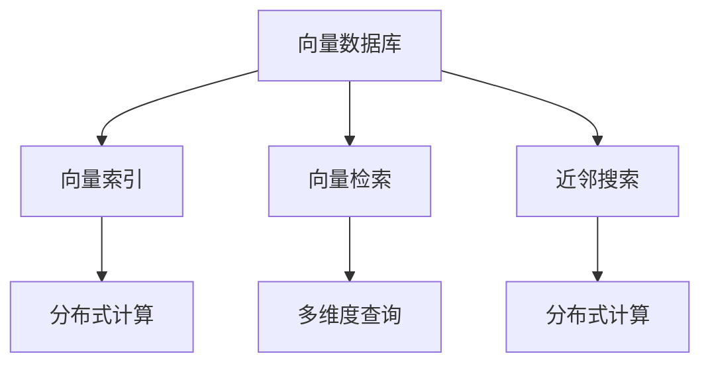

                 

# 高效检索：构建基于向量数据库的高性能搜索引擎

## 1. 背景介绍

### 1.1 问题由来

随着互联网和数字技术的飞速发展，搜索引擎作为信息检索和获取的重要工具，其高效性、准确性和用户体验日益受到重视。然而，传统基于文本索引的搜索引擎面临着计算复杂度高、实时性差、难以处理大规模数据等问题。为了克服这些问题，研究人员和工程师们提出了基于向量数据库的搜索引擎架构，以向量计算为基础，大幅提升检索效率和处理能力。

### 1.2 问题核心关键点

向量数据库搜索引擎（Vector Database Search Engine）是近年来新兴的一种搜索引擎架构，其核心思想是将查询和文档都表示为向量形式，通过向量相似度计算实现高效检索。这种架构在大规模数据集上的检索效率和准确性显著优于传统文本索引搜索引擎，同时支持分布式计算和多维度查询。

核心关键点包括：
- 向量化：将查询和文档转换为向量表示。
- 相似度计算：计算向量间的相似度，实现高效检索。
- 分布式处理：支持大规模分布式计算，提高处理能力和检索效率。
- 多维度查询：支持多维度的查询表达，提升查询灵活性和检索结果的全面性。

### 1.3 问题研究意义

基于向量数据库的搜索引擎架构，在提升检索效率和处理能力的同时，还能应对大规模数据集和复杂查询需求的挑战。它不仅适用于搜索引擎本身，还广泛应用于推荐系统、自然语言处理等领域，为构建高性能的信息检索系统提供了新的思路和方法。

向量数据库搜索引擎的研究和应用，具有以下重要意义：

1. **提升检索效率**：通过向量计算，大幅提升检索速度，优化用户体验。
2. **处理大规模数据**：支持分布式计算，有效处理海量数据集，实现高性能检索。
3. **提升检索准确性**：通过向量相似度计算，提高检索结果的相关性和精度。
4. **支持复杂查询**：多维度查询表达，满足不同用户的检索需求。
5. **推动技术发展**：为人工智能、大数据等新兴技术提供新的应用场景，促进技术进步。

## 2. 核心概念与联系

### 2.1 核心概念概述

为了更好地理解基于向量数据库的搜索引擎架构，本节将介绍几个关键概念：

- 向量数据库（Vector Database）：一种专门用于存储和检索向量数据的数据库，支持高效向量计算和多维度查询。
- 向量检索（Vector Retrieval）：通过计算向量间的相似度，实现向量化数据的检索。
- 向量索引（Vector Indexing）：构建向量索引，优化检索效率，支持分布式计算。
- 近邻搜索（Nearest Neighbor Search）：在向量空间中查找距离最近的向量，用于实现高效的精确匹配。
- 分布式计算（Distributed Computing）：通过多节点协同计算，提高检索处理能力和效率。
- 多维度查询（Multi-Dimensional Query）：支持不同维度的查询表达，提升检索灵活性和结果全面性。

这些概念之间存在紧密的联系，共同构成了基于向量数据库的搜索引擎架构。

### 2.2 概念间的关系

这些核心概念之间的联系可以通过以下Mermaid流程图来展示：



这个流程图展示了大规模向量数据存储和检索过程中各个关键组件之间的相互作用。

1. **向量数据库**：负责存储大规模向量数据，是整个架构的基础。
2. **向量索引**：构建索引，优化检索效率，支持分布式计算。
3. **向量检索**：计算向量间的相似度，实现高效检索。
4. **近邻搜索**：查找距离最近的向量，用于实现精确匹配。
5. **分布式计算**：通过多节点协同计算，提高处理能力和检索效率。
6. **多维度查询**：支持不同维度的查询表达，提升检索灵活性和结果全面性。

## 3. 核心算法原理 & 具体操作步骤
### 3.1 算法原理概述

基于向量数据库的搜索引擎架构，其核心算法原理主要包括以下几个方面：

1. **向量表示**：将查询和文档转换为向量表示，通常采用TF-IDF、Word2Vec、GloVe等方法进行文本向量化。
2. **向量索引**：构建向量索引，支持高效检索和分布式计算。常见的索引方法包括倒排索引、哈希索引等。
3. **相似度计算**：计算向量间的相似度，常用的相似度度量方法包括余弦相似度、欧式距离、曼哈顿距离等。
4. **分布式检索**：利用分布式计算技术，提高检索效率和处理能力。
5. **多维度查询**：支持不同维度的查询表达，包括布尔查询、范围查询、近邻查询等。

### 3.2 算法步骤详解

以下是一个基于向量数据库的搜索引擎算法的详细步骤：

1. **数据准备**：
   - 收集和预处理数据，将查询和文档转换为向量表示。
   - 构建向量索引，优化检索效率。

2. **查询处理**：
   - 将用户查询转换为向量表示。
   - 利用分布式计算技术，对查询向量进行并行处理。

3. **索引检索**：
   - 在向量数据库中检索与查询向量最相似的向量。
   - 根据相似度计算结果，返回检索结果。

4. **结果排序和呈现**：
   - 根据相似度大小对检索结果进行排序。
   - 根据用户需求，对结果进行格式化和呈现。

### 3.3 算法优缺点

基于向量数据库的搜索引擎算法具有以下优点：

1. **高效性**：通过向量计算，显著提升检索速度，优化用户体验。
2. **处理大规模数据**：支持分布式计算，有效处理海量数据集，实现高性能检索。
3. **提升检索准确性**：通过向量相似度计算，提高检索结果的相关性和精度。
4. **支持复杂查询**：多维度查询表达，满足不同用户的检索需求。

同时，该算法也存在一定的局限性：

1. **高维数据稀疏性**：向量表示通常需要较高的维度，导致数据稀疏性问题，影响检索效率。
2. **计算复杂度高**：向量计算的复杂度较高，需要较强的计算资源支持。
3. **需要高质量数据**：向量表示的质量依赖于数据的质量，低质量的向量表示会导致检索结果的不准确。
4. **算法复杂度高**：构建索引和相似度计算的算法复杂度高，需要较高的技术门槛。

### 3.4 算法应用领域

基于向量数据库的搜索引擎算法，已经在多个领域得到广泛应用，例如：

- **搜索引擎**：传统搜索引擎的改进和优化，实现高效检索和复杂查询。
- **推荐系统**：通过向量检索技术，推荐与用户兴趣最相关的物品。
- **自然语言处理**：用于语义相似度计算和知识图谱构建，提升文本处理能力。
- **图像检索**：将图像转换为向量表示，实现高效检索和相似度匹配。
- **医疗信息检索**：通过向量检索技术，实现疾病诊断和治疗方案的推荐。
- **金融分析**：利用向量检索技术，对市场数据进行深度分析和智能决策。

除了上述这些经典应用外，向量数据库搜索引擎算法还在更多场景中得到创新性的应用，如智能交通、智慧城市等，为各行各业带来新的变革。

## 4. 数学模型和公式 & 详细讲解 & 举例说明

### 4.1 数学模型构建

本节将使用数学语言对基于向量数据库的搜索引擎算法进行更加严格的刻画。

记查询向量为 $q \in \mathbb{R}^d$，文档向量为 $d \in \mathbb{R}^d$，向量数据库中的所有向量集合为 $\mathcal{D} = \{d_i\}_{i=1}^N$。定义向量之间的相似度函数为 $s(d, q)$，通常采用余弦相似度，即：

$$
s(d, q) = \frac{d \cdot q}{\|d\|\|q\|}
$$

其中 $\cdot$ 表示向量点积，$\|\cdot\|$ 表示向量范数。

在向量数据库中，通过构建倒排索引 $I = \{(i, d_i)\}_{i=1}^M$，将查询与文档之间的映射关系存储下来，其中 $i$ 表示文档ID，$d_i$ 表示对应的文档向量。倒排索引可以高效地支持多维度查询和分布式计算。

### 4.2 公式推导过程

以下我们以余弦相似度计算为例，推导其计算公式。

设查询向量为 $q = (q_1, q_2, \ldots, q_d)$，文档向量为 $d = (d_1, d_2, \ldots, d_d)$，则余弦相似度计算公式为：

$$
s(d, q) = \frac{\sum_{i=1}^d d_i q_i}{\sqrt{\sum_{i=1}^d d_i^2} \sqrt{\sum_{i=1}^d q_i^2}}
$$

在实际计算时，为了避免计算范数，通常将分子分母同时除以向量的模长，即：

$$
s(d, q) = \frac{\sum_{i=1}^d d_i q_i}{\sqrt{\sum_{i=1}^d (d_i q_i)^2}}
$$

### 4.3 案例分析与讲解

假设我们在一个包含10万篇文档的向量数据库中进行检索，查询向量为 $(0.5, 0.4, 0.3)$，文档向量的维度为3。我们使用余弦相似度计算每个文档与查询的相似度，并按照相似度大小排序，得到前10个最相关的文档。

具体计算步骤如下：

1. 构建倒排索引，将查询与文档之间的映射关系存储下来。
2. 对于每个文档，计算其与查询的余弦相似度。
3. 根据相似度大小，对检索结果进行排序。
4. 返回排序后的前10个文档作为检索结果。

在实际应用中，基于向量数据库的搜索引擎架构可以通过优化索引构建和相似度计算方法，进一步提升检索效率和处理能力。

## 5. 项目实践：代码实例和详细解释说明

### 5.1 开发环境搭建

在进行向量数据库搜索引擎实践前，我们需要准备好开发环境。以下是使用Python和Elasticsearch进行搜索引擎开发的流程：

1. 安装Anaconda：从官网下载并安装Anaconda，用于创建独立的Python环境。

2. 创建并激活虚拟环境：
```bash
conda create -n elasticsearch-env python=3.8 
conda activate elasticsearch-env
```

3. 安装Elasticsearch：从官网下载并安装Elasticsearch，并确保安装成功。

4. 安装Flask：用于构建搜索引擎的Web应用框架。
```bash
pip install flask
```

5. 安装Elasticsearch Python客户端库：
```bash
pip install elasticsearch
```

6. 安装NLTK：用于文本向量化和处理。
```bash
pip install nltk
```

完成上述步骤后，即可在`elasticsearch-env`环境中开始搜索引擎实践。

### 5.2 源代码详细实现

下面我们以构建一个简单的向量数据库搜索引擎为例，给出使用Elasticsearch和Flask的PyTorch代码实现。

首先，我们需要准备一些示例数据。这里我们使用NLTK库，将文本数据转换为向量表示，并将其存储到Elasticsearch中：

```python
from elasticsearch import Elasticsearch
from nltk.corpus import stopwords
from nltk.tokenize import word_tokenize
from nltk.stem import WordNetLemmatizer
from sklearn.feature_extraction.text import TfidfVectorizer
from sklearn.metrics.pairwise import cosine_similarity

# 建立Elasticsearch连接
es = Elasticsearch([{'host': 'localhost', 'port': 9200}])

# 添加示例文档
texts = [
    "The quick brown fox jumps over the lazy dog.",
    "Alice was beginning to get very tired of sitting by her sister on the bank, and of having nothing to do: once or twice she had peeped into the book her sister was reading, but it had no pictures or conversations in it, 'and what is the use of a book,' thought Alice 'without pictures or conversations?'",
    "Once upon a time there were three little sisters; and their names were Arbitina, Continua, and Oncemore.",
    "Although the Dormouse had closed its eyes by this time, it had got entangled among the distant green leaves, and when at last it uncased them, its eyes were exactly one inch from its nose."
]

# 去除停用词和词干化处理
stop_words = set(stopwords.words('english'))
lemmatizer = WordNetLemmatizer()

tokenized_texts = [word_tokenize(text.lower()) for text in texts]
tokenized_texts = [[lemmatizer.lemmatize(word) for word in sentence if word not in stop_words] for sentence in tokenized_texts]

# 将文本转换为向量
vectorizer = TfidfVectorizer()
X = vectorizer.fit_transform(tokenized_texts)
X = X.toarray()

# 将向量存储到Elasticsearch中
doc_type = 'text_document'
for i, doc in enumerate(X):
    doc_id = f'doc{i}'
    es.index(index='my_index', doc_type=doc_type, id=doc_id, body={
        'text': texts[i],
        'vector': doc.tolist()
    })
```

接下来，构建一个简单的Flask应用，用于处理用户查询并返回检索结果：

```python
from flask import Flask, request, jsonify

app = Flask(__name__)

# 获取Elasticsearch连接
es = Elasticsearch([{'host': 'localhost', 'port': 9200}])

# 定义路由
@app.route('/search', methods=['POST'])
def search():
    query = request.json['query']
    result = []
    # 计算相似度
    for doc_id, doc in es.search(index='my_index', body={'query': {'match': {'vector': {'query': query}}}]):
        result.append({'id': doc['_id'], 'score': doc['_score'], 'text': doc['_source']['text']})
    result = sorted(result, key=lambda x: x['score'], reverse=True)
    return jsonify(result)

if __name__ == '__main__':
    app.run(host='0.0.0.0', port=5000)
```

完成上述代码后，启动Flask应用，并使用curl命令进行查询：

```bash
curl -X POST -H "Content-Type: application/json" -d '{"query": "brown fox"}' http://localhost:5000/search
```

即可在Elasticsearch中检索与查询最相似的文档，并返回结果。

### 5.3 代码解读与分析

让我们再详细解读一下关键代码的实现细节：

**索引构建和文档添加**：
- 使用Elasticsearch的API，将文本数据转换为向量，并存储到Elasticsearch中。
- 使用TfidfVectorizer进行文本向量化，并使用余弦相似度计算文档与查询的相似度。

**Flask应用**：
- 构建一个简单的Flask应用，用于处理用户查询并返回检索结果。
- 使用Elasticsearch的API进行向量检索，并返回排序后的检索结果。

**查询处理**：
- 用户通过HTTP POST请求提交查询，Flask应用接收并解析请求参数。
- 计算查询向量与文档向量的相似度，并根据相似度大小排序，返回结果。

可以看到，Elasticsearch和Flask结合使用，可以轻松构建一个高效、灵活的向量数据库搜索引擎。开发者可以在此基础上进行扩展和优化，实现更复杂的功能和更高的性能。

## 6. 实际应用场景

### 6.1 智能推荐系统

基于向量数据库的搜索引擎算法，可以广泛应用于推荐系统中。通过向量检索技术，推荐系统能够快速找到与用户兴趣最相关的物品，提高推荐效率和效果。

在实际应用中，推荐系统可以通过构建用户行为向量、物品属性向量等，将其存储到向量数据库中。用户查询时，通过检索与用户行为向量最相似的物品向量，即可找到最相关的推荐物品。

### 6.2 智能问答系统

智能问答系统需要快速响应用户查询，提供准确、相关的回答。基于向量数据库的搜索引擎算法，可以实现高效的问答匹配。

具体而言，系统可以将用户问题和候选回答转换为向量表示，并存储到向量数据库中。当用户提交查询时，系统通过向量检索技术，检索与用户问题最相关的回答向量，并返回排序后的回答。

### 6.3 医疗信息检索

医疗信息检索需要高效、准确地找到相关医疗信息和诊断治疗方案。基于向量数据库的搜索引擎算法，可以实现高效的医学信息检索。

系统可以将医学文献、诊断报告等文本数据转换为向量，并存储到向量数据库中。用户查询时，通过向量检索技术，检索与查询最相关的医学文献或诊断方案，并返回排序后的结果。

### 6.4 金融分析

金融分析需要处理大量的市场数据，快速找到相关数据进行分析决策。基于向量数据库的搜索引擎算法，可以实现高效的金融信息检索。

系统可以将市场数据、公司报告等文本数据转换为向量，并存储到向量数据库中。用户查询时，通过向量检索技术，检索与查询最相关的市场数据或公司报告，并返回排序后的结果。

### 6.5 智慧城市治理

智慧城市治理需要实时监测城市事件，快速响应突发事件。基于向量数据库的搜索引擎算法，可以实现高效的城市事件监测。

系统可以将城市监控视频、社交媒体等数据转换为向量，并存储到向量数据库中。用户查询时，通过向量检索技术，检索与查询最相关的事件信息，并返回排序后的结果。

## 7. 工具和资源推荐

### 7.1 学习资源推荐

为了帮助开发者系统掌握向量数据库搜索引擎的理论基础和实践技巧，这里推荐一些优质的学习资源：

1. 《Search Engines: Information Retrieval》书籍：系统介绍搜索引擎的基本原理和算法。
2. 《Python Elasticsearch: Create, Search, and Analyze Big Data with Elasticsearch and Python》书籍：详细讲解如何使用Elasticsearch进行大数据处理。
3. 《Natural Language Processing with Python》书籍：介绍自然语言处理的基本技术和算法，包括文本向量化和相似度计算。
4. CS224N《Natural Language Processing with Deep Learning》课程：斯坦福大学开设的NLP明星课程，涵盖深度学习在NLP中的应用。
5. Coursera《Introduction to Data Science in Python》课程：系统介绍Python在数据科学中的应用，包括Elasticsearch和Flask等工具的使用。

通过对这些资源的学习实践，相信你一定能够快速掌握向量数据库搜索引擎的精髓，并用于解决实际的NLP问题。

### 7.2 开发工具推荐

高效的开发离不开优秀的工具支持。以下是几款用于向量数据库搜索引擎开发的常用工具：

1. Elasticsearch：开源的分布式搜索和分析引擎，支持大规模向量数据存储和检索。
2. Apache Spark：开源的大数据处理框架，支持大规模分布式计算。
3. PyTorch：基于Python的深度学习框架，支持高效的向量计算和相似度计算。
4. NLTK：自然语言处理工具库，支持文本向量化和处理。
5. Flask：轻量级的Web应用框架，支持快速构建搜索引擎应用。
6. TensorBoard：用于可视化模型训练和推理结果的工具。

合理利用这些工具，可以显著提升向量数据库搜索引擎的开发效率，加快创新迭代的步伐。

### 7.3 相关论文推荐

向量数据库搜索引擎的研究源于学界的持续研究。以下是几篇奠基性的相关论文，推荐阅读：

1. "Efficient Retrieval Using Sparse Vector Spaces" 论文：提出了向量空间索引技术，优化了向量检索效率。
2. "An Introduction to Information Retrieval" 书籍：系统介绍信息检索的基本原理和算法。
3. "Approximate Nearest Neighbor Algorithms for Large-Scale Information Retrieval" 论文：介绍了近似近邻搜索算法，提高了检索效率。
4. "Text Retrieval with Spelling Correction" 论文：提出了一种基于拼写纠正的文本检索方法，提高了检索准确性。
5. "Learning Rich Semantic Representations from Natural Language" 论文：介绍了Word2Vec等文本向量化技术，提高了向量表示的质量。

这些论文代表了大规模向量数据存储和检索的研究脉络，为向量数据库搜索引擎的发展提供了理论支持。

除上述资源外，还有一些值得关注的前沿资源，帮助开发者紧跟向量数据库搜索引擎技术的发展趋势，例如：

1. arXiv论文预印本：人工智能领域最新研究成果的发布平台，包括大量尚未发表的前沿工作，学习前沿技术的必读资源。
2. 业界技术博客：如Elastic、HuggingFace、Facebook Research等顶尖实验室的官方博客，第一时间分享他们的最新研究成果和洞见。
3. 技术会议直播：如SIGIR、CVPR、ICML等人工智能领域顶会现场或在线直播，能够聆听到大佬们的前沿分享，开拓视野。
4. GitHub热门项目：在GitHub上Star、Fork数最多的搜索引擎相关项目，往往代表了该技术领域的发展趋势和最佳实践，值得去学习和贡献。
5. 行业分析报告：各大咨询公司如McKinsey、PwC等针对搜索引擎行业的分析报告，有助于从商业视角审视技术趋势，把握应用价值。

总之，对于向量数据库搜索引擎技术的学习和实践，需要开发者保持开放的心态和持续学习的意愿。多关注前沿资讯，多动手实践，多思考总结，必将收获满满的成长收益。

## 8. 总结：未来发展趋势与挑战

### 8.1 总结

本文对基于向量数据库的搜索引擎算法进行了全面系统的介绍。首先阐述了向量数据库搜索引擎的研究背景和意义，明确了向量数据库搜索引擎在提升检索效率和处理能力方面的独特价值。其次，从原理到实践，详细讲解了向量数据库搜索引擎的数学原理和关键步骤，给出了搜索引擎任务开发的完整代码实例。同时，本文还广泛探讨了向量数据库搜索引擎在智能推荐、智能问答、医疗信息检索、金融分析、智慧城市治理等多个领域的应用前景，展示了向量数据库搜索引擎的巨大潜力。此外，本文精选了向量数据库搜索引擎技术的各类学习资源，力求为读者提供全方位的技术指引。

通过本文的系统梳理，可以看到，基于向量数据库的搜索引擎架构在提升检索效率和处理能力的同时，还能应对大规模数据集和复杂查询需求的挑战。它不仅适用于搜索引擎本身，还广泛应用于推荐系统、自然语言处理等领域，为构建高性能的信息检索系统提供了新的思路和方法。未来，随着向量数据库搜索引擎技术的发展和应用，相信在更多领域会取得更大的突破。

### 8.2 未来发展趋势

展望未来，向量数据库搜索引擎技术将呈现以下几个发展趋势：

1. **提升检索效率**：通过优化索引构建和相似度计算方法，进一步提升检索速度和性能。
2. **处理大规模数据**：支持更高效的大规模分布式计算，实现更高处理能力和检索效率。
3. **提升检索准确性**：利用深度学习技术，提高向量表示的质量和检索结果的相关性。
4. **支持复杂查询**：支持更多维度的查询表达，提升检索灵活性和结果全面性。
5. **融合多模态数据**：支持图像、语音等多模态数据的融合，提升信息检索的全面性和准确性。
6. **结合深度学习**：结合深度学习技术，提升向量表示的质量和检索结果的准确性。

以上趋势凸显了向量数据库搜索引擎技术的广阔前景。这些方向的探索发展，必将进一步提升信息检索系统的性能和应用范围，为构建智能系统提供新的技术基础。

### 8.3 面临的挑战

尽管向量数据库搜索引擎技术已经取得了瞩目成就，但在迈向更加智能化、普适化应用的过程中，它仍面临着诸多挑战：

1. **高维数据稀疏性**：向量表示通常需要较高的维度，导致数据稀疏性问题，影响检索效率。
2. **计算复杂度高**：向量计算的复杂度较高，需要较强的计算资源支持。
3. **需要高质量数据**：向量表示的质量依赖于数据的质量，低质量的向量表示会导致检索结果的不准确。
4. **算法复杂度高**：构建索引和相似度计算的算法复杂度高，需要较高的技术门槛。
5. **融合多模态数据复杂**：支持多模态数据的融合需要复杂的技术处理，需要进一步优化。
6. **实时性和扩展性问题**：在大规模数据集上实现实时检索和扩展性需要优化系统架构和算法。

正视向量数据库搜索引擎面临的这些挑战，积极应对并寻求突破，将使该技术不断走向成熟，实现更大的应用价值。

### 8.4 研究展望

面对向量数据库搜索引擎所面临的挑战，未来的研究需要在以下几个方面寻求新的突破：

1. **提升向量表示的质量**：通过深度学习等技术，进一步优化向量表示的质量，提高检索结果的准确性。
2. **优化索引构建方法**：开发更高效的索引构建方法，提升检索效率和系统扩展性。
3. **融合多模态数据**：开发更加高效的多模态融合算法，提升信息检索的全面性和准确性。
4. **结合深度学习**：结合深度学习技术，提升向量表示的质量和检索结果的准确性。
5. **实现实时检索**：优化系统架构和算法，实现高效的大规模实时检索。
6. **提升系统扩展性**：开发更高效的分布式计算和存储方案，支持大规模数据的处理和检索。

这些研究方向的探索，必将引领向量数据库搜索引擎技术迈向更高的台阶，为构建高效、智能、可扩展的信息检索系统提供新的技术支撑。

## 9. 附录：常见问题与解答

**Q1：向量数据库搜索引擎是否适用于所有领域？**

A: 向量数据库搜索引擎在处理大规模数据和复杂查询方面具有显著优势，适用于需要高效检索和分析的各个领域，如搜索引擎、推荐系统、智能问答、医疗信息检索等。但对于一些特定领域，如实时性要求极高的金融分析系统

