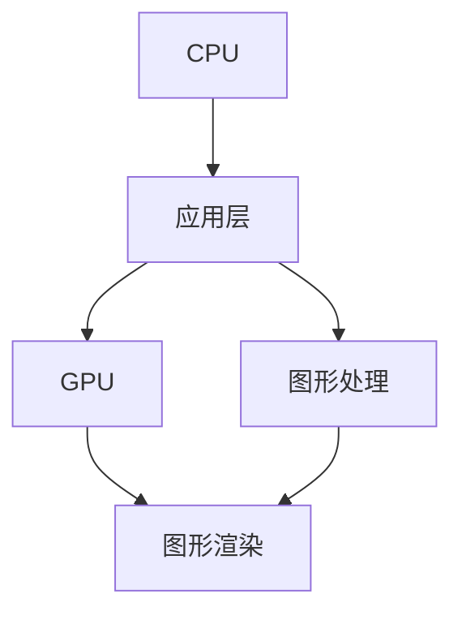

                 

## 1. 背景介绍

随着计算机技术的发展，图形处理单元（GPU）已成为计算领域的重要组成部分。GPU的诞生和发展离不开其背后的领导者，黄仁勋（NVIDIA的创始人兼CEO）。本文将详细探讨黄仁勋在GPU领域的开创性贡献，及其对现代计算和人工智能的影响。

## 2. 核心概念与联系

### 2.1 核心概念概述

GPU（Graphics Processing Unit），即图形处理单元，是专门用于图像处理和图形渲染的硬件加速器。与传统的中央处理器（CPU）相比，GPU具有更高的并行计算能力，更高效的浮点数处理能力，以及对内存的高带宽访问。

GPU技术的发展离不开早期的研究和开拓者，其中黄仁勋是推动GPU技术商业化的关键人物。他在GPU领域的研究和创新，为NVIDIA公司奠定了基础，并极大地推动了计算机图形学、人工智能等领域的发展。

### 2.2 核心概念原理和架构的 Mermaid 流程图



该流程图展示了CPU和GPU之间的数据流动。CPU负责处理复杂的逻辑和控制任务，而GPU则专注于图像和图形的计算与渲染。

### 2.3 核心概念间的联系

GPU技术的发展与CPU技术密切相关，两者的分工合作构成了现代计算的核心。同时，GPU的出现也推动了计算机图形学、人工智能、机器学习等领域的进步。

## 3. 核心算法原理 & 具体操作步骤

### 3.1 算法原理概述

GPU的并行计算能力是通过其大规模的并行处理器阵列实现的。这些处理器可以同时处理大量数据，从而加速图像处理、渲染、深度学习和科学计算等任务。

黄仁勋及其团队的研究集中在GPU架构的创新和优化上。通过引入可编程顶点着色器、统一着色器架构（UAA）等技术，他们极大地提高了GPU的计算效率和灵活性。

### 3.2 算法步骤详解

1. **硬件设计**：黄仁勋和他的团队设计了高性能的GPU芯片，包括CUDA（Compute Unified Device Architecture）架构，这为GPU的并行计算提供了底层支持。

2. **软件优化**：他们开发了CUDA编程语言，使得开发者能够高效地编写并行计算程序，同时提供了GPU加速的库和工具。

3. **应用开发**：通过与游戏、图形处理、深度学习等领域的合作，展示了GPU在实际应用中的强大性能和广泛适用性。

### 3.3 算法优缺点

**优点**：
- **高性能**：GPU的高并行计算能力使其在图形渲染、深度学习等领域表现出色。
- **灵活性**：可编程架构使得GPU能够处理多种类型的数据和任务。
- **广泛适用性**：GPU技术被广泛应用于游戏、科学计算、人工智能等多个领域。

**缺点**：
- **功耗高**：GPU的高计算能力伴随着较高的能耗和热量，需要高效的散热系统。
- **编程复杂**：尽管CUDA等工具简化了编程，但并行计算的复杂性仍然较高。

### 3.4 算法应用领域

GPU技术在以下几个领域得到了广泛应用：

1. **图形处理**：GPU是计算机图形学和游戏开发的基础。
2. **科学计算**：GPU加速了科学计算任务，如分子动力学模拟、气象模拟等。
3. **深度学习**：GPU在深度学习模型的训练和推理中发挥了重要作用，加速了AI技术的发展。
4. **自动驾驶**：GPU在自动驾驶的感知和决策过程中扮演了重要角色。
5. **增强现实**：GPU支持复杂的实时渲染和交互，推动了增强现实技术的发展。

## 4. 数学模型和公式 & 详细讲解

### 4.1 数学模型构建

GPU的计算模型主要基于并行计算和流水线处理。假设我们有N个计算任务，每个任务需要T个时间单位完成。则并行计算的总时间T_total可以表示为：

$$
T_{total} = T/N
$$

其中，T_total为并行计算的总时间，N为计算任务的个数。

### 4.2 公式推导过程

为了进一步优化GPU的性能，研究人员引入了加速比的概念：

$$
S = \frac{T_{seq}}{T_{par}}
$$

其中，S为加速比，T_seq为串行计算所需的时间，T_par为并行计算所需的时间。加速比表示并行计算相较于串行计算的速度提升倍数。

### 4.3 案例分析与讲解

以深度学习中的卷积神经网络（CNN）为例，GPU的并行计算能力使得卷积层的计算效率显著提升。假设一个卷积层有M个滤波器，每个滤波器处理N个像素，则串行计算的总时间T_seq为：

$$
T_{seq} = M \times N \times T_{conv}
$$

其中，T_conv为单个像素卷积所需的时间。使用并行计算后，总时间T_par可以表示为：

$$
T_{par} = T_{conv}/N
$$

因此，加速比S为：

$$
S = \frac{T_{seq}}{T_{par}} = M \times N
$$

这表明GPU通过并行计算，使得卷积层的计算效率提升了M*N倍。

## 5. 项目实践：代码实例和详细解释说明

### 5.1 开发环境搭建

为了实现GPU加速的深度学习模型，我们需要安装CUDA、cuDNN和TensorFlow或PyTorch等框架。以下是一个简单的开发环境搭建流程：

1. **安装CUDA和cuDNN**：
   - 从NVIDIA官网下载并安装CUDA和cuDNN。
   - 设置环境变量，使TensorFlow或PyTorch能够找到这些库。

2. **安装深度学习框架**：
   - 使用pip安装TensorFlow或PyTorch。
   - 安装GPU版本，并确保安装成功。

3. **配置环境**：
   - 在Jupyter Notebook或其他IDE中设置使用GPU。
   - 导入必要的库，进行模型训练。

### 5.2 源代码详细实现

以下是一个使用TensorFlow实现GPU加速的卷积神经网络的代码示例：

```python
import tensorflow as tf

# 设置使用GPU
gpus = tf.config.list_physical_devices('GPU')
if gpus:
  try:
    # 仅使用第一块GPU
    tf.config.set_visible_devices(gpus[0], 'GPU')
  except RuntimeError as e:
    print(e)

# 定义卷积神经网络模型
class ConvNet(tf.keras.Model):
  def __init__(self):
    super(ConvNet, self).__init__()
    self.conv1 = tf.keras.layers.Conv2D(32, (3, 3), activation='relu')
    self.pool1 = tf.keras.layers.MaxPooling2D((2, 2))
    self.conv2 = tf.keras.layers.Conv2D(64, (3, 3), activation='relu')
    self.pool2 = tf.keras.layers.MaxPooling2D((2, 2))
    self.flatten = tf.keras.layers.Flatten()
    self.dense1 = tf.keras.layers.Dense(128, activation='relu')
    self.dense2 = tf.keras.layers.Dense(10)

  def call(self, inputs):
    x = self.conv1(inputs)
    x = self.pool1(x)
    x = self.conv2(x)
    x = self.pool2(x)
    x = self.flatten(x)
    x = self.dense1(x)
    return self.dense2(x)

# 加载数据集
(x_train, y_train), (x_test, y_test) = tf.keras.datasets.mnist.load_data()
x_train = x_train.reshape(x_train.shape[0], 28, 28, 1).astype('float32') / 255
x_test = x_test.reshape(x_test.shape[0], 28, 28, 1).astype('float32') / 255
y_train = tf.keras.utils.to_categorical(y_train, 10)
y_test = tf.keras.utils.to_categorical(y_test, 10)

# 定义模型
model = ConvNet()

# 编译模型
model.compile(optimizer='adam', loss='categorical_crossentropy', metrics=['accuracy'])

# 训练模型
model.fit(x_train, y_train, epochs=10, validation_data=(x_test, y_test))
```

### 5.3 代码解读与分析

在上述代码中，我们首先设置了使用GPU。然后定义了一个简单的卷积神经网络模型，并在TensorFlow中编译和训练。在训练过程中，TensorFlow会自动使用GPU进行并行计算，大大提高了计算效率。

### 5.4 运行结果展示

训练完成后，可以使用以下代码进行模型评估：

```python
test_loss, test_acc = model.evaluate(x_test, y_test)
print('Test accuracy:', test_acc)
```

## 6. 实际应用场景

### 6.1 图形处理

GPU在图形处理领域的应用非常广泛。例如，在3D图形渲染中，GPU可以处理大量的顶点和像素，实现复杂的渲染效果。

### 6.2 科学计算

GPU在科学计算中的应用也日益增多。例如，在天气模拟、蛋白质折叠等复杂计算中，GPU能够提供巨大的计算能力，加速计算进程。

### 6.3 深度学习

GPU在深度学习中的应用最为显著。GPU的高并行计算能力使得深度学习模型的训练和推理变得高效，加速了AI技术的发展。

### 6.4 未来应用展望

未来，随着GPU技术的不断进步，其在更多的领域将发挥更大的作用。例如，在量子计算、生物信息学等领域，GPU有望提供强大的计算支持。

## 7. 工具和资源推荐

### 7.1 学习资源推荐

1. **NVIDIA官网**：NVIDIA提供了大量关于GPU技术的资源，包括技术白皮书、开发者文档和教育课程。
2. **CUDA官方文档**：CUDA官方文档详细介绍了CUDA编程语言和工具的使用方法。
3. **DeepLearning.AI课程**：由黄仁勋主讲的DeepLearning.AI课程，深入讲解了深度学习和GPU技术的结合。

### 7.2 开发工具推荐

1. **NVIDIA CUDA Toolkit**：NVIDIA提供的CUDA开发环境，包括编译器、调试器和工具链。
2. **NVIDIA cuDNN**：NVIDIA提供的深度学习加速库，支持GPU加速的卷积和池化操作。
3. **TensorFlow和PyTorch**：两大流行的深度学习框架，提供了GPU加速的支持。

### 7.3 相关论文推荐

1. **《A CUDA Architecture for General-Purpose Graph Rendering》**：黄仁勋等人发表的论文，介绍了CUDA架构的设计和应用。
2. **《The C10 API for Deep Learning》**：黄仁勋等人发表的论文，介绍了C10 API的设计和使用方法。

## 8. 总结：未来发展趋势与挑战

### 8.1 研究成果总结

黄仁勋在GPU领域的开创性工作，推动了计算机图形学、深度学习等技术的发展。他的研究和创新为NVIDIA公司奠定了基础，推动了GPU技术的商业化进程。

### 8.2 未来发展趋势

1. **更高的性能**：未来的GPU将具备更高的并行计算能力，支持更多的深度学习模型和算法。
2. **更低的能耗**：未来的GPU将更加注重能效比，提供更高效、更节能的计算方案。
3. **更广泛的应用**：GPU技术将在更多领域得到应用，推动更多行业的数字化转型。

### 8.3 面临的挑战

1. **计算能耗**：尽管GPU性能提升，但其高能耗仍然是一个重要挑战，需要不断优化散热和能效。
2. **编程复杂性**：尽管GPU并行计算能力强大，但编程复杂性仍然较高，需要更多易于使用的工具和框架。
3. **跨平台兼容性**：GPU硬件和软件在不同平台上的兼容性问题，需要进一步解决。

### 8.4 研究展望

未来，GPU技术将在计算领域发挥更加重要的作用，推动更多领域的数字化转型。同时，如何优化计算效率、提高编程易用性、提升跨平台兼容性，将是研究的重要方向。

## 9. 附录：常见问题与解答

**Q1：GPU和CPU的主要区别是什么？**

A：GPU和CPU的主要区别在于其计算架构。CPU主要用于控制和逻辑处理，具有较高的频率和缓存效率，适合执行单线程任务。GPU则具有大量的并行处理单元，适合执行大量并发计算任务，如图像处理、图形渲染和深度学习。

**Q2：GPU加速深度学习有什么优势？**

A：GPU加速深度学习具有以下优势：
1. **并行计算**：GPU的并行计算能力使得深度学习模型的训练和推理效率大幅提升。
2. **高吞吐量**：GPU的高计算能力和高内存带宽，可以处理大量的数据并行运算。
3. **跨平台支持**：GPU技术被广泛支持，可以在各种硬件平台上高效运行。

**Q3：如何优化GPU计算性能？**

A：优化GPU计算性能可以从以下几个方面入手：
1. **选择合适的算法**：根据计算任务的特点，选择最适合GPU并行计算的算法。
2. **数据预处理**：对数据进行优化，减少数据传输和计算量。
3. **优化内存使用**：合理分配内存，避免内存瓶颈。
4. **使用合适的并行编程模型**：选择合适的编程模型，如CUDA、OpenCL等，提高并行计算效率。

**Q4：GPU加速深度学习的局限性有哪些？**

A：GPU加速深度学习的局限性包括：
1. **高能耗**：GPU的高计算能力伴随着较高的能耗和热量，需要高效的散热系统。
2. **编程复杂**：尽管CUDA等工具简化了编程，但并行计算的复杂性仍然较高。
3. **硬件兼容性**：不同GPU厂商的硬件平台和软件工具可能存在兼容性问题。

**Q5：未来的GPU技术有哪些趋势？**

A：未来的GPU技术可能包括以下趋势：
1. **更高的计算密度**：未来GPU将具备更高的计算密度，提供更高的计算能力。
2. **更低的能耗**：未来的GPU将更加注重能效比，提供更高效、更节能的计算方案。
3. **更广泛的应用**：GPU技术将在更多领域得到应用，推动更多行业的数字化转型。

---

作者：禅与计算机程序设计艺术 / Zen and the Art of Computer Programming

