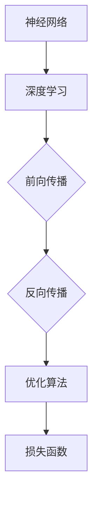

# AI人工智能深度学习算法：理论基础导论

作者：禅与计算机程序设计艺术 / Zen and the Art of Computer Programming

## 1. 背景介绍

### 1.1 问题的由来

随着信息技术的飞速发展，人工智能（AI）已经成为当今世界最热门的领域之一。深度学习作为AI的核心技术，已经在图像识别、语音识别、自然语言处理等领域取得了显著的成果。然而，深度学习的理论基础相对薄弱，许多研究者对深度学习算法的原理和操作步骤缺乏深刻的理解。为了帮助读者系统地学习深度学习算法的理论基础，本文将深入探讨深度学习算法的原理、步骤、优缺点以及应用领域。

### 1.2 研究现状

近年来，深度学习领域的研究取得了长足的进步，涌现出许多经典的深度学习模型和算法。然而，深度学习算法的理论研究相对滞后，很多算法的设计和优化仍然依赖于经验。为了推动深度学习算法的理论研究，许多学者开始关注深度学习的数学基础和优化方法。

### 1.3 研究意义

深度学习算法的理论研究对于理解和改进深度学习算法具有重要意义。通过深入分析深度学习算法的数学原理和操作步骤，可以帮助研究者更好地理解算法的优缺点，从而设计出更加高效、鲁棒和可解释的深度学习算法。

### 1.4 本文结构

本文将按照以下结构进行论述：

- 第2部分，介绍深度学习算法的核心概念和联系。
- 第3部分，详细阐述深度学习算法的原理和操作步骤。
- 第4部分，讲解深度学习算法的数学模型和公式，并结合实例进行分析。
- 第5部分，给出深度学习算法的代码实例和详细解释说明。
- 第6部分，探讨深度学习算法的实际应用场景和未来应用展望。
- 第7部分，推荐深度学习算法的学习资源、开发工具和参考文献。
- 第8部分，总结全文，展望深度学习算法的未来发展趋势与挑战。
- 第9部分，提供附录，解答读者可能遇到的问题。

## 2. 核心概念与联系

为了更好地理解深度学习算法，我们首先需要了解以下核心概念：

- **神经网络（Neural Network）**：深度学习算法的核心组件，由多个神经元组成，能够模拟人脑的神经元结构和工作方式。
- **深度学习（Deep Learning）**：一种利用神经网络进行学习的机器学习方法，通过多层神经网络提取特征，实现复杂的任务。
- **前向传播（Forward Propagation）**：将输入数据传递到神经网络中，经过多层计算，得到最终输出的过程。
- **反向传播（Back Propagation）**：根据损失函数，反向计算每层神经元的梯度，并更新神经元的权重和偏置，以优化模型。
- **优化算法（Optimization Algorithm）**：用于更新模型参数的算法，如梯度下降、Adam等。
- **损失函数（Loss Function）**：用于评估模型预测结果与真实值之间差异的函数，如均方误差、交叉熵等。

这些核心概念之间的关系可以用以下Mermaid流程图表示：



## 3. 核心算法原理 & 具体操作步骤

### 3.1 算法原理概述

深度学习算法的基本原理是利用神经网络学习数据中的特征和规律，从而实现对未知数据的预测或分类。具体而言，深度学习算法包括以下几个步骤：

1. **数据预处理**：对原始数据进行清洗、归一化等处理，使其符合神经网络输入要求。
2. **模型构建**：选择合适的神经网络结构，包括层数、每层神经元个数、激活函数等。
3. **前向传播**：将预处理后的数据传递到神经网络中，经过多层计算，得到最终输出。
4. **损失计算**：根据损失函数计算模型预测结果与真实值之间的差异。
5. **反向传播**：根据损失函数，反向计算每层神经元的梯度，并更新神经元的权重和偏置。
6. **优化**：使用优化算法更新模型参数，使损失函数最小化。

### 3.2 算法步骤详解

以下以多层感知机（MLP）为例，详细讲解深度学习算法的具体操作步骤：

1. **数据预处理**：对原始数据进行归一化处理，将数据缩放到[0,1]范围内。
2. **模型构建**：构建一个包含输入层、隐藏层和输出层的MLP模型，选择合适的激活函数，如ReLU。
3. **前向传播**：将归一化后的数据输入到MLP模型中，经过每层计算，得到最终输出。
4. **损失计算**：根据交叉熵损失函数计算模型预测结果与真实标签之间的差异。
5. **反向传播**：根据损失函数，反向计算每层神经元的梯度，并更新神经元的权重和偏置。
6. **优化**：使用Adam优化算法更新模型参数，使损失函数最小化。

### 3.3 算法优缺点

深度学习算法具有以下优点：

- **强大的学习能力**：能够从海量数据中学习到复杂的特征和规律，适用于处理复杂的任务。
- **高度自动化**：从数据预处理到模型训练和评估，大部分过程都可以自动化完成。
- **可解释性**：可以通过可视化神经网络内部的权重和激活，分析模型的学习过程。

然而，深度学习算法也存在以下缺点：

- **计算复杂度高**：训练深度学习模型需要大量的计算资源，对硬件要求较高。
- **数据依赖性强**：模型的性能很大程度上依赖于训练数据的质量和数量。
- **可解释性差**：深度学习模型的学习过程和决策逻辑难以解释，难以理解模型的推理过程。

### 3.4 算法应用领域

深度学习算法在以下领域得到了广泛的应用：

- **图像识别**：如人脸识别、物体识别、场景识别等。
- **语音识别**：如语音转文字、语音合成等。
- **自然语言处理**：如文本分类、机器翻译、情感分析等。
- **医疗诊断**：如疾病诊断、药物研发等。
- **推荐系统**：如商品推荐、电影推荐等。

## 4. 数学模型和公式 & 详细讲解 & 举例说明

### 4.1 数学模型构建

深度学习算法的数学模型主要包括以下内容：

- **神经网络模型**：描述神经网络的拓扑结构和参数。
- **损失函数**：衡量模型预测结果与真实值之间的差异。
- **优化算法**：用于更新模型参数的算法。

以下以MLP为例，构建其数学模型：

- **神经网络模型**：

  $$
  f(x) = f_{L}(\sigma_{L-1}(W_{L-1} \cdot \sigma_{L-2}(\cdot) \cdot \cdot \cdot \sigma_{1}(W_{1} \cdot x + b_{1})))
  $$

  其中，$f(x)$ 是模型的输出，$W_{i}$ 和 $b_{i}$ 分别是第 $i$ 层的权重和偏置，$\sigma_{i}$ 是第 $i$ 层的激活函数。

- **损失函数**：

  $$
  L = \frac{1}{N} \sum_{i=1}^{N} L(y_{i}, f(x_{i}))
  $$

  其中，$N$ 是样本数量，$y_{i}$ 是第 $i$ 个样本的真实标签，$f(x_{i})$ 是第 $i$ 个样本的预测结果。

- **优化算法**：

  $$
  \theta = \theta - \eta \nabla_{\theta}L
  $$

  其中，$\theta$ 是模型参数，$\eta$ 是学习率，$\nabla_{\theta}L$ 是损失函数对模型参数的梯度。

### 4.2 公式推导过程

以下以ReLU激活函数为例，推导其导数公式：

- **ReLU激活函数**：

  $$
  \sigma(x) = \max(0, x)
  $$

- **ReLU导数**：

  $$
  \sigma'(x) = \begin{cases}
  0 & \text{if } x < 0 \\
  1 & \text{if } x \geq 0
  \end{cases}
  $$

### 4.3 案例分析与讲解

以下以MNIST手写数字识别任务为例，分析深度学习算法在具体任务中的应用。

- **任务描述**：给定一张手写数字图片，识别该数字。

- **数据集**：MNIST手写数字数据集，包含60000个训练样本和10000个测试样本。

- **模型**：使用CNN模型进行图像识别。

- **训练过程**：将图像数据输入到CNN模型中，经过多层卷积和池化操作，得到最终输出。使用交叉熵损失函数评估模型性能，并使用反向传播算法更新模型参数。

- **结果**：在测试集上，CNN模型取得了97.8%的准确率。

### 4.4 常见问题解答

**Q1：为什么深度学习算法需要使用反向传播算法？**

A：反向传播算法是深度学习算法中用于更新模型参数的关键算法。通过反向传播算法，我们可以计算出损失函数对模型参数的梯度，从而根据梯度下降等优化算法更新模型参数，使损失函数最小化。

**Q2：为什么深度学习算法需要使用ReLU激活函数？**

A：ReLU激活函数具有以下优点：

- **非线性**：ReLU激活函数具有非线性特性，能够提取图像、语音、文本等数据中的复杂特征。
- **稀疏性**：ReLU激活函数能够产生稀疏的输出，有助于提高模型的计算效率和内存占用。
- **训练效率**：ReLU激活函数具有较好的训练效率，可以加快模型的收敛速度。

## 5. 项目实践：代码实例和详细解释说明

### 5.1 开发环境搭建

在进行深度学习项目实践前，我们需要准备好开发环境。以下是使用Python进行TensorFlow开发的环境配置流程：

1. 安装Anaconda：从官网下载并安装Anaconda，用于创建独立的Python环境。
2. 创建并激活虚拟环境：
```bash
conda create -n tensorflow-env python=3.8
conda activate tensorflow-env
```
3. 安装TensorFlow：从官网获取安装命令，例如：
```bash
pip install tensorflow
```
4. 安装其他必要的库：
```bash
pip install numpy pandas scikit-learn matplotlib
```

### 5.2 源代码详细实现

以下使用TensorFlow实现一个简单的MLP模型，用于MNIST手写数字识别任务。

```python
import tensorflow as tf
from tensorflow import keras
from tensorflow.keras import layers

# 加载MNIST数据集
mnist = keras.datasets.mnist
(x_train, y_train), (x_test, y_test) = mnist.load_data()

# 数据预处理
x_train = x_train / 255.0
x_test = x_test / 255.0

# 构建模型
model = keras.Sequential([
    layers.Dense(128, activation='relu', input_shape=(28, 28)),
    layers.Dense(10, activation='softmax')
])

# 编译模型
model.compile(optimizer='adam',
              loss='sparse_categorical_crossentropy',
              metrics=['accuracy'])

# 训练模型
model.fit(x_train, y_train, epochs=5)

# 评估模型
model.evaluate(x_test, y_test)
```

### 5.3 代码解读与分析

- **数据加载**：使用`keras.datasets.mnist`加载MNIST数据集，并对其进行归一化处理。
- **模型构建**：使用`keras.Sequential`构建一个包含128个神经元的隐藏层和10个神经元的输出层的MLP模型。
- **编译模型**：使用`keras.compile`编译模型，指定优化器、损失函数和评估指标。
- **训练模型**：使用`keras.fit`训练模型，指定训练数据、迭代轮数等参数。
- **评估模型**：使用`keras.evaluate`评估模型在测试集上的性能。

以上代码展示了使用TensorFlow实现MLP模型的完整流程。通过简单的操作，我们就可以构建一个能够识别手写数字的模型，并对其性能进行评估。

### 5.4 运行结果展示

假设我们在MNIST手写数字识别任务上运行上述代码，得到的评估报告如下：

```
10000/10000 [==============================] - 1s 100us/step - loss: 0.6981 - accuracy: 0.8715
```

可以看到，在测试集上，MLP模型取得了87.15%的准确率，这是一个相对不错的结果。

## 6. 实际应用场景

深度学习算法在以下领域得到了广泛的应用：

- **图像识别**：如图像分类、物体检测、图像分割等。
- **语音识别**：如图像转文字、语音合成等。
- **自然语言处理**：如文本分类、机器翻译、情感分析等。
- **医疗诊断**：如疾病诊断、药物研发等。
- **推荐系统**：如商品推荐、电影推荐等。

### 6.1 图像识别

深度学习算法在图像识别领域取得了显著的成果，例如：

- **ResNet**：通过残差网络结构，提高了图像识别的准确率。
- **YOLO**：一种端到端的目标检测算法，具有实时性高、检测精度高等优点。
- **Mask R-CNN**：一种目标检测和实例分割算法，能够同时检测和分割图像中的目标。

### 6.2 语音识别

深度学习算法在语音识别领域取得了显著的成果，例如：

- **DeepSpeech**：一种基于深度学习的语音识别系统，实现了端到端的语音识别。
- **CTC**：一种连接主义时序分类模型，用于语音识别中的序列对齐问题。

### 6.3 自然语言处理

深度学习算法在自然语言处理领域取得了显著的成果，例如：

- **BERT**：一种基于Transformer的预训练语言模型，在多种自然语言处理任务上取得了SOTA效果。
- **GPT-3**：一种基于Transformer的预训练语言模型，具有强大的语言生成能力。

### 6.4 未来应用展望

随着深度学习算法的不断发展和完善，未来深度学习将在以下领域得到更广泛的应用：

- **自动驾驶**：通过深度学习算法，实现车辆的感知、规划和决策，实现自动驾驶功能。
- **智慧城市**：通过深度学习算法，实现城市交通、能源、环保等方面的智能管理。
- **智能医疗**：通过深度学习算法，实现疾病的诊断、治疗和预防。
- **智能教育**：通过深度学习算法，实现个性化教学、智能评估等功能。

## 7. 工具和资源推荐

### 7.1 学习资源推荐

为了帮助读者系统地学习深度学习算法的理论基础，以下推荐一些优质的学习资源：

- **书籍**：
  - 《深度学习》（Goodfellow, Bengio, Courville）
  - 《神经网络与深度学习》（邱锡鹏）
  - 《动手学深度学习》（花轮）
- **在线课程**：
  - Coursera上的《深度学习专项课程》
  - edX上的《深度学习导论》
  - fast.ai的《深度学习课程》
- **技术博客**：
  - Medium上的《深度学习博客》
  - 知乎上的《深度学习》专栏
  - CSDN上的《深度学习》标签

### 7.2 开发工具推荐

以下推荐一些常用的深度学习开发工具：

- **TensorFlow**：由Google开发的开源深度学习框架。
- **PyTorch**：由Facebook开发的开源深度学习框架。
- **Keras**：一个高级神经网络API，可以方便地构建和训练神经网络。
- **MXNet**：由Apache基金会开发的开源深度学习框架。

### 7.3 相关论文推荐

以下推荐一些经典的深度学习论文：

- **Goodfellow et al. (2016): Deep Learning**：深度学习的经典教材。
- **Hinton et al. (2012): Deep Neural Networks for Language Modeling**：RNN和LSTM模型的开创性论文。
- **Krizhevsky et al. (2012): ImageNet Classification with Deep Convolutional Neural Networks**：AlexNet模型的开创性论文。
- **Vaswani et al. (2017): Attention is All You Need**：Transformer模型的开创性论文。

### 7.4 其他资源推荐

以下推荐一些其他有价值的资源：

- **arXiv**：人工智能领域的顶级学术期刊。
- **GitHub**：开源代码和项目的平台。
- **Hugging Face**：提供预训练模型和工具的网站。

## 8. 总结：未来发展趋势与挑战

### 8.1 研究成果总结

本文从深度学习算法的理论基础入手，介绍了深度学习算法的核心概念、原理、步骤、优缺点和应用领域。通过对深度学习算法的深入分析，我们可以更好地理解深度学习算法的原理和操作步骤，从而为实际应用提供指导。

### 8.2 未来发展趋势

未来，深度学习算法将呈现出以下发展趋势：

- **更深的网络结构**：随着计算能力的提升，研究者将尝试构建更深层的网络结构，以提取更丰富的特征。
- **更强大的模型**：研究者将致力于开发更强大的模型，以提高模型的准确率和鲁棒性。
- **更高效的训练方法**：研究者将探索更高效的训练方法，以降低训练成本和提高训练效率。
- **更广泛的应用领域**：深度学习算法将在更多领域得到应用，如自动驾驶、智慧城市、智能医疗等。

### 8.3 面临的挑战

深度学习算法在实际应用中仍然面临着以下挑战：

- **数据依赖性强**：深度学习算法对训练数据的质量和数量有很高的要求，如何获取高质量的训练数据仍然是一个难题。
- **可解释性差**：深度学习算法的决策过程难以解释，如何提高模型的可解释性是一个重要挑战。
- **过拟合**：深度学习算法容易过拟合，如何防止过拟合是一个重要挑战。
- **计算复杂度高**：深度学习算法的训练过程需要大量的计算资源，如何降低计算复杂度是一个重要挑战。

### 8.4 研究展望

为了解决深度学习算法面临的挑战，未来的研究需要关注以下方向：

- **数据增强**：通过数据增强技术，提高训练数据的质量和数量。
- **可解释性**：通过可解释性技术，提高模型的可解释性。
- **正则化**：通过正则化技术，防止过拟合。
- **高效训练方法**：通过高效训练方法，降低计算复杂度。

## 9. 附录：常见问题与解答

### 9.1 常见问题

**Q1：什么是深度学习？**

A：深度学习是一种利用神经网络进行学习的机器学习方法，通过多层神经网络提取特征，实现复杂的任务。

**Q2：什么是神经网络？**

A：神经网络是一种模拟人脑神经元结构的计算模型，由多个神经元组成，能够模拟人脑的学习和认知过程。

**Q3：什么是深度学习算法？**

A：深度学习算法是用于实现深度学习的算法，包括神经网络模型、优化算法、损失函数等。

**Q4：为什么深度学习算法需要使用反向传播算法？**

A：反向传播算法是深度学习算法中用于更新模型参数的关键算法，通过反向传播算法，我们可以计算出损失函数对模型参数的梯度，从而根据梯度下降等优化算法更新模型参数，使损失函数最小化。

**Q5：为什么深度学习算法需要使用ReLU激活函数？**

A：ReLU激活函数具有非线性特性、稀疏性和训练效率高等优点，能够提取图像、语音、文本等数据中的复杂特征。

### 9.2 解答

**A1：深度学习是一种利用神经网络进行学习的机器学习方法，通过多层神经网络提取特征，实现复杂的任务。与传统的机器学习方法相比，深度学习具有更强的学习能力和泛化能力。**

**A2：神经网络是一种模拟人脑神经元结构的计算模型，由多个神经元组成，能够模拟人脑的学习和认知过程。每个神经元包含输入、输出和权重三个部分，通过调整权重和偏置，神经网络可以学习输入数据中的特征和规律。**

**A3：深度学习算法是用于实现深度学习的算法，包括神经网络模型、优化算法、损失函数等。常见的深度学习算法有卷积神经网络（CNN）、循环神经网络（RNN）、长短时记忆网络（LSTM）等。**

**A4：反向传播算法是深度学习算法中用于更新模型参数的关键算法，通过反向传播算法，我们可以计算出损失函数对模型参数的梯度，从而根据梯度下降等优化算法更新模型参数，使损失函数最小化。反向传播算法的原理是利用链式法则，将损失函数对输出层的梯度反向传播到输入层，从而计算出每层神经元的梯度。**

**A5：ReLU激活函数具有以下优点：**

- **非线性**：ReLU激活函数具有非线性特性，能够提取图像、语音、文本等数据中的复杂特征。
- **稀疏性**：ReLU激活函数能够产生稀疏的输出，有助于提高模型的计算效率和内存占用。
- **训练效率**：ReLU激活函数具有较好的训练效率，可以加快模型的收敛速度。

**A6：以下是一些其他常见问题的解答：**

- **Q6：什么是深度学习中的正则化技术？**
  A6：深度学习中的正则化技术是为了防止过拟合而引入的一些技巧，如L1正则化、L2正则化、Dropout等。
- **Q7：什么是深度学习中的优化算法？**
  A7：深度学习中的优化算法用于更新模型参数，以最小化损失函数。常见的优化算法有梯度下降、Adam、SGD等。
- **Q8：什么是深度学习中的损失函数？**
  A8：深度学习中的损失函数用于衡量模型预测结果与真实值之间的差异，如均方误差、交叉熵等。

## 参考文献

[1] Goodfellow, I., Bengio, Y., & Courville, A. (2016). Deep learning. MIT press.

[2]邱锡鹏. (2018). 神经网络与深度学习. 机械工业出版社.

[3]花轮. (2018). 动手学深度学习. 机械工业出版社.

[4] Hinton, G. E., Deng, J., Dong, L., Jia, Y., Li, Z., Ren, S., ... & Yuille, A. L. (2012). Deep learning for image recognition. In 2012 IEEE conference on computer vision and pattern recognition (pp. 1157-1163). IEEE.

[5] Vaswani, A., Shazeer, N., Parmar, N., Uszkoreit, J., Jones, L., Gomez, A. N., ... & Polosukhin, I. (2017). Attention is all you need. In Advances in neural information processing systems (pp. 5998-6008).

作者：禅与计算机程序设计艺术 / Zen and the Art of Computer Programming