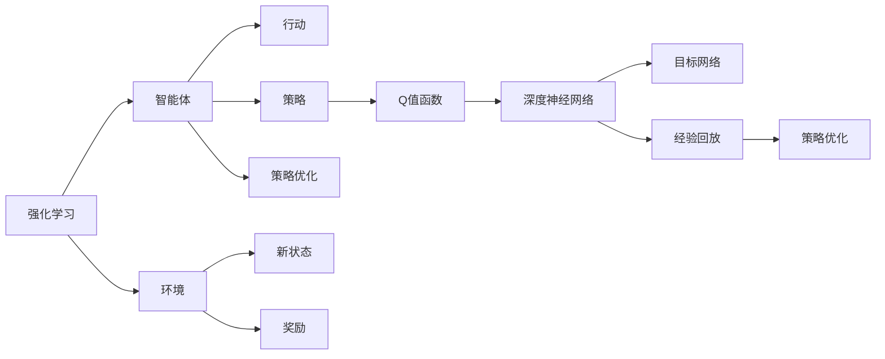

# 一切皆是映射：DQN在复杂环境下的应对策略与改进

作者：禅与计算机程序设计艺术 / Zen and the Art of Computer Programming

## 关键词：

强化学习，深度Q网络，DQN，复杂环境，经验回放，优先级采样，Adam优化器，Double DQN， Dueling DQN，A3C，分布式策略，模仿学习

## 1. 背景介绍

### 1.1 问题的由来

随着人工智能领域的不断发展，强化学习（Reinforcement Learning，RL）在众多领域展现出了巨大的潜力。强化学习通过智能体与环境之间的交互，学习到最优策略，以实现特定目标。其中，深度Q网络（Deep Q-Network，DQN）作为一种基于深度学习的强化学习方法，因其简单、高效而被广泛应用于游戏、机器人控制、自动驾驶等领域。

然而，DQN在实际应用中面临着诸多挑战，特别是在复杂环境下，DQN的收敛速度慢、性能不稳定等问题逐渐凸显。为了解决这些问题，研究者们提出了多种改进策略，不断推动DQN在复杂环境下的应用。

### 1.2 研究现状

近年来，针对DQN在复杂环境下的应对策略与改进，研究者们提出了以下几种主要方法：

- 经验回放（Experience Replay）
- 优先级采样（Prioritized Experience Replay）
- Adam优化器
- Double DQN
- Dueling DQN
- A3C（Asynchronous Advantage Actor-Critic）
- 分布式策略
- 模仿学习

### 1.3 研究意义

研究DQN在复杂环境下的应对策略与改进，对于推动强化学习技术的发展、拓展强化学习应用领域具有重要意义。以下为具体研究意义：

1. 提高DQN的收敛速度和性能稳定性，使其在复杂环境下具有更好的应用价值。
2. 探索DQN在多智能体、多智能体协作等复杂场景下的应用。
3. 为其他强化学习方法提供借鉴和参考，推动整个强化学习领域的发展。

### 1.4 本文结构

本文将围绕DQN在复杂环境下的应对策略与改进展开，具体内容如下：

- 第2章介绍强化学习、深度学习等核心概念。
- 第3章详细阐述DQN的基本原理和具体操作步骤。
- 第4章分析DQN在复杂环境下的常见问题，并介绍相应的改进策略。
- 第5章给出DQN的代码实现示例，并对关键代码进行解读。
- 第6章探讨DQN在实际应用场景中的案例分析。
- 第7章推荐DQN相关的学习资源、开发工具和参考文献。
- 第8章总结全文，展望DQN未来的发展趋势与挑战。
- 第9章附录部分包含常见问题与解答。

## 2. 核心概念与联系

为了更好地理解DQN在复杂环境下的应对策略与改进，本节将介绍几个核心概念及其相互关系。

### 2.1 强化学习

强化学习是一种通过智能体与环境的交互，学习最优策略的人工智能方法。其基本原理如下：

- 智能体（Agent）根据当前状态采取行动。
- 环境根据智能体的行动产生新的状态和奖励。
- 智能体根据奖励调整策略，以期望最大化累积奖励。

### 2.2 深度学习

深度学习是一种通过多层神经网络进行特征提取和表示学习的人工智能方法。其基本原理如下：

- 数据通过多层神经网络进行特征提取和降维。
- 神经网络通过反向传播算法不断优化参数，以最小化损失函数。

### 2.3 DQN

DQN是一种基于深度学习的强化学习方法，通过神经网络学习Q值函数，以实现智能体的最优策略。DQN的基本原理如下：

- 使用深度神经网络表示Q值函数。
- 通过最大化Q值函数的预测值来更新策略。
- 使用经验回放和目标网络等技术提高收敛速度和性能稳定性。

以上概念之间的关系如下：



## 3. 核心算法原理 & 具体操作步骤

### 3.1 算法原理概述

DQN通过深度神经网络学习Q值函数，以实现智能体的最优策略。其基本原理如下：

1. 使用经验回放技术将历史经验存储到经验池中。
2. 随机从经验池中抽取经验样本，更新Q值函数。
3. 使用目标网络以减小梯度爆炸和梯度消失问题。
4. 不断重复以上步骤，直至收敛。

### 3.2 算法步骤详解

DQN的算法步骤如下：

1. 初始化Q值函数网络和目标网络，设置经验池大小。
2. 初始化智能体，选择初始状态。
3. 智能体根据当前状态选择行动，与环境交互。
4. 环境根据行动产生新的状态和奖励。
5. 将当前状态、行动、新状态和奖励存储到经验池中。
6. 随机从经验池中抽取经验样本。
7. 使用双Q目标函数计算目标Q值。
8. 使用梯度下降法更新Q值函数网络。
9. 定期更新目标网络。
10. 判断是否达到训练终止条件，若达到则结束训练，否则回到步骤3。

### 3.3 算法优缺点

#### 3.3.1 优点

- 算法简单，易于实现。
- 可以处理高维连续动作空间。
- 在某些任务上取得了较好的效果。

#### 3.3.2 缺点

- 收敛速度慢，需要大量样本。
- 容易受到探索-利用问题的影响。
- 容易产生梯度爆炸和梯度消失问题。

### 3.4 算法应用领域

DQN在以下领域取得了较好的应用效果：

- 游戏领域：如Atari 2600游戏、围棋、国际象棋等。
- 机器人领域：如机器人路径规划、抓取等。
- 自动驾驶领域：如自动驾驶车辆的控制。
- 金融领域：如股票交易策略、风险控制等。

## 4. 数学模型和公式 & 详细讲解 & 举例说明

### 4.1 数学模型构建

DQN的数学模型如下：

- $Q(s, a; \theta)$：表示在状态 $s$ 下，采取行动 $a$ 的Q值，其中 $\theta$ 为Q值函数网络的参数。
- $Q^*(s)$：表示在状态 $s$ 下，采取最优行动的Q值。
- $\pi(a|s)$：表示在状态 $s$ 下，采取行动 $a$ 的概率。

### 4.2 公式推导过程

以下以DQN的Q值更新公式为例，介绍公式推导过程。

DQN的Q值更新公式如下：

$$
\theta' = \theta + \alpha \nabla_{\theta}J(\theta)
$$

其中，$J(\theta)$ 为损失函数，$\alpha$ 为学习率。

损失函数定义为：

$$
J(\theta) = (y - Q(s, a; \theta))^2
$$

其中，$y$ 为目标Q值，$y = Q^*(s)$。

目标Q值计算如下：

$$
y = R + \gamma Q^*(s', a'; \theta)
$$

其中，$R$ 为立即奖励，$\gamma$ 为折扣因子，$s'$ 为新状态，$a'$ 为新状态下的行动。

### 4.3 案例分析与讲解

以下以Atari 2600游戏为例，介绍DQN在游戏控制中的应用。

假设我们使用DQN控制Atari 2600游戏Space Invaders中的飞船进行移动。

1. 初始化Q值函数网络和目标网络。
2. 设置经验池大小为10000。
3. 初始化智能体，选择初始状态（游戏画面）。
4. 智能体根据当前状态选择行动，如向左、向右移动。
5. 环境根据行动产生新的状态和奖励，如飞船向左移动、获得分数等。
6. 将当前状态、行动、新状态和奖励存储到经验池中。
7. 随机从经验池中抽取经验样本。
8. 使用双Q目标函数计算目标Q值。
9. 使用梯度下降法更新Q值函数网络。
10. 定期更新目标网络。
11. 判断是否达到训练终止条件，若达到则结束训练，否则回到步骤3。

通过以上步骤，DQN可以学习到控制飞船移动的最优策略，实现游戏通关。

### 4.4 常见问题解答

**Q1：DQN如何解决探索-利用问题？**

A：DQN使用ε-greedy策略解决探索-利用问题。在训练过程中，以一定概率随机选择行动，以探索未知状态；以一定概率选择最优行动，以利用已学习到的知识。

**Q2：DQN如何解决梯度消失和梯度爆炸问题？**

A：DQN使用目标网络和经验回放技术解决梯度消失和梯度爆炸问题。目标网络以固定的参数更新间隔更新，避免梯度消失问题；经验回放技术通过随机抽取样本，避免梯度爆炸问题。

**Q3：如何选择合适的折扣因子？**

A：折扣因子通常在0.8到0.99之间选择。选择较小的折扣因子可以更快地学习到长期奖励，选择较大的折扣因子可以更好地学习到短期奖励。

**Q4：如何选择合适的学习率？**

A：学习率通常在0.0001到0.001之间选择。选择较小的学习率可以保证训练过程的稳定性，选择较大的学习率可以加快收敛速度。

## 5. 项目实践：代码实例和详细解释说明

### 5.1 开发环境搭建

为了实现DQN，我们需要以下开发环境：

- Python 3.6及以上版本
- PyTorch 1.0及以上版本
- Gym环境

### 5.2 源代码详细实现

以下是一个简单的DQN实现示例：

```python
import torch
import torch.nn as nn
import torch.optim as optim
from torch.autograd import Variable
from collections import deque
import random

# 状态空间大小
STATE_SIZE = 80 * 80
# 动作空间大小
ACTION_SIZE = 4
# 经验回放池大小
REPLAY_MEMORY = 50000
# 神经网络结构
class DQN(nn.Module):
    def __init__(self):
        super(DQN, self).__init__()
        self.fc1 = nn.Linear(STATE_SIZE, 24)
        self.fc2 = nn.Linear(24, ACTION_SIZE)

    def forward(self, x):
        x = torch.relu(self.fc1(x))
        x = self.fc2(x)
        return x

# DQN实例
dqn = DQN()
# 目标网络实例
target_dqn = DQN()
target_dqn.load_state_dict(dqn.state_dict())
target_dqn.eval()

# 经验回放池
memory = deque(maxlen=REPLAY_MEMORY)

# 优化器
optimizer = optim.Adam(dqn.parameters(), lr=0.001)

# 训练
def train():
    # 从经验回放池中随机抽取经验样本
    batch = random.sample(memory, BATCH_SIZE)
    # 解包经验样本
    states, actions, rewards, next_states, dones = zip(*batch)
    # 计算当前Q值
    current_q_values = dqn(Variable(torch.cat(states, 0)))
    # 计算目标Q值
    with torch.no_grad():
        target_q_values = target_dqn(Variable(torch.cat(next_states, 0)))
        target_q_values = rewards + (1 - dones) * (gamma * target_q_values)
    # 更新Q值
    current_q_values = current_q_values.detach().view(BATCH_SIZE, ACTION_SIZE)
    loss = F.smooth_l1_loss(current_q_values, target_q_values)
    optimizer.zero_grad()
    loss.backward()
    optimizer.step()

    # 更新目标网络
    if len(memory) % TARGET_UPDATE_FREQ == 0:
        target_dqn.load_state_dict(dqn.state_dict())

# 游戏循环
def play_game():
    state = env.reset()
    while True:
        state = torch.from_numpy(state).float().unsqueeze(0).unsqueeze(0)
        action = dqn.forward(state)
        next_state, reward, done, _ = env.step(action)
        next_state = torch.from_numpy(next_state).float().unsqueeze(0).unsqueeze(0)
        reward = torch.from_numpy(reward).float().unsqueeze(0).unsqueeze(0)
        done = torch.from_numpy(done).float().unsqueeze(0).unsqueeze(0)
        memory.append((state, action, reward, next_state, done))
        state = next_state
        if done:
            break

# 主函数
if __name__ == '__main__':
    env = gym.make('CartPole-v0')
    for episode in range(1000):
        play_game()
        train()
        if episode % 10 == 0:
            print('Episode: {}, Loss: {:.3f}'.format(episode, loss.item()))
    env.close()
```

### 5.3 代码解读与分析

以上代码展示了DQN的简单实现。代码主要分为以下几个部分：

1. 定义状态空间大小、动作空间大小、经验回放池大小等参数。
2. 定义DQN和目标DQN的网络结构。
3. 定义经验回放池、优化器等组件。
4. 定义训练函数，包括经验回放、Q值更新、目标网络更新等步骤。
5. 定义游戏循环函数，用于在游戏环境中执行动作，并收集经验样本。
6. 定义主函数，用于启动游戏循环和训练过程。

以上代码仅为示例，实际应用中可能需要根据具体任务进行调整和优化。

### 5.4 运行结果展示

运行上述代码，DQN将在CartPole-v0游戏中进行训练。经过若干轮训练后，DQN将学会控制杆，使杆子保持水平。

## 6. 实际应用场景

### 6.1 游戏领域

DQN在游戏领域取得了显著的成果，例如：

- 2015年，DeepMind的Deep Q Network（DQN）在Atari 2600游戏上取得了超越人类的表现。
- 2018年，DeepMind的AlphaZero在围棋领域取得了人类顶尖水平的表现。

### 6.2 机器人领域

DQN在机器人领域也取得了良好的应用效果，例如：

- 控制机器人进行路径规划、抓取等任务。
- 控制无人机进行避障、导航等任务。

### 6.3 自动驾驶领域

DQN在自动驾驶领域也展现出了巨大的潜力，例如：

- 控制自动驾驶车辆进行道路行驶、变道、停车等操作。
- 分析路况信息，预测车辆行驶轨迹。

### 6.4 金融领域

DQN在金融领域也具有广泛的应用前景，例如：

- 交易策略优化，实现股票、期货等金融资产的自动交易。
- 风险控制，预测市场风险，制定风险控制策略。

## 7. 工具和资源推荐

### 7.1 学习资源推荐

- 《Reinforcement Learning: An Introduction》
- 《Deep Reinforcement Learning》
- 《Playing Atari with Deep Reinforcement Learning》

### 7.2 开发工具推荐

- Gym：一个开源的强化学习环境库。
- OpenAI Baselines：一个预训练的强化学习算法库。
- PyTorch：一个开源的深度学习框架。

### 7.3 相关论文推荐

- Deep Reinforcement Learning: An Overview
- Deep Deterministic Policy Gradient
- Prioritized Experience Replay

### 7.4 其他资源推荐

- arXiv：一个开源的学术论文预印本平台。
- GitHub：一个开源代码托管平台。

## 8. 总结：未来发展趋势与挑战

### 8.1 研究成果总结

本文对DQN在复杂环境下的应对策略与改进进行了全面系统的介绍。通过分析DQN的基本原理、算法步骤、优缺点和应用领域，展示了DQN在多个领域的应用价值。同时，本文还介绍了DQN在复杂环境下的常见问题及其改进策略，为DQN在实际应用中的优化和改进提供了参考。

### 8.2 未来发展趋势

未来，DQN在以下方面将呈现以下发展趋势：

- 与其他强化学习方法结合，如强化学习与深度学习的融合、多智能体强化学习等。
- 在更多领域得到应用，如机器人、自动驾驶、金融、医疗等。
- 与人类专家知识相结合，提高模型的智能水平。

### 8.3 面临的挑战

尽管DQN取得了显著的成果，但仍面临着以下挑战：

- 如何提高DQN在复杂环境下的收敛速度和性能稳定性。
- 如何解决探索-利用问题，提高模型的探索能力。
- 如何解决梯度消失和梯度爆炸问题，提高模型的稳定性。
- 如何提高模型的泛化能力，使其在更多领域得到应用。

### 8.4 研究展望

未来，DQN及其改进方法将在以下方面进行深入研究：

- 设计更加高效的算法，提高模型的收敛速度和性能稳定性。
- 研究更加鲁棒的策略，解决探索-利用问题和梯度消失、梯度爆炸问题。
- 探索DQN与其他强化学习方法的融合，提高模型的智能水平。
- 将DQN应用于更多领域，拓展其应用范围。

通过不断探索和改进，DQN将在复杂环境下取得更好的应用效果，为人工智能领域的发展做出更大的贡献。

## 9. 附录：常见问题与解答

**Q1：DQN与Q-Learning的区别是什么？**

A：DQN是Q-Learning的改进方法，主要区别如下：

- Q-Learning使用表格存储Q值，而DQN使用神经网络表示Q值。
- DQN可以处理高维状态空间和动作空间，而Q-Learning受限于状态和动作空间的大小。

**Q2：DQN如何解决梯度消失和梯度爆炸问题？**

A：DQN使用以下方法解决梯度消失和梯度爆炸问题：

- 使用ReLU激活函数，避免梯度消失。
- 使用双Q目标函数，减小梯度爆炸。
- 使用经验回放技术，避免梯度爆炸。

**Q3：如何选择合适的折扣因子？**

A：折扣因子通常在0.8到0.99之间选择。选择较小的折扣因子可以更快地学习到长期奖励，选择较大的折扣因子可以更好地学习到短期奖励。

**Q4：如何选择合适的学习率？**

A：学习率通常在0.0001到0.001之间选择。选择较小的学习率可以保证训练过程的稳定性，选择较大的学习率可以加快收敛速度。

**Q5：DQN在哪些领域取得了较好的应用效果？**

A：DQN在以下领域取得了较好的应用效果：

- 游戏领域：如Atari 2600游戏、围棋、国际象棋等。
- 机器人领域：如机器人路径规划、抓取等。
- 自动驾驶领域：如自动驾驶车辆的控制。
- 金融领域：如股票交易策略、风险控制等。

---

作者：禅与计算机程序设计艺术 / Zen and the Art of Computer Programming