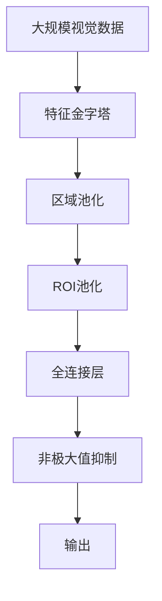

                 

# Fast R-CNN原理与代码实例讲解

> 关键词：Fast R-CNN, 目标检测, 区域池化, 区域ROI, 卷积神经网络

## 1. 背景介绍

### 1.1 问题由来
目标检测是计算机视觉领域的一个重要任务，它旨在识别图像中的对象并定位它们的位置。传统的目标检测方法如Haar特征分类器和HOG+SVM等虽然有效，但在处理复杂场景时存在精度不足、计算效率低等问题。因此，近年来，深度学习技术逐渐成为目标检测的主流方法，特别是基于卷积神经网络（CNN）的目标检测方法。

Fast R-CNN（Region-based Fully Convolutional Network）是其中一个具有代表性的深度学习目标检测算法。它继承了R-CNN和Fast R-CNN的优点，并且在性能和效率方面进行了显著改进。本文将详细介绍Fast R-CNN的原理，并结合代码实例讲解其实现过程。

### 1.2 问题核心关键点
Fast R-CNN的核心在于区域池化（Region Pooling）技术，使得目标检测不再依赖选择性搜索（Selective Search）等耗时的手工候选区域生成方法，而是通过特征金字塔（Feature Pyramid）在图像上自动生成候选区域，并直接对整个图像进行前向传播，显著提高了检测速度。

Fast R-CNN的另一个关键点是在ROI池化（Region of Interest Pooling）中采用了固定大小的输出，使得卷积层的输出可以直接用于全连接层，避免了繁琐的尺寸变换操作。同时，Fast R-CNN还采用了更高效的反向传播算法，进一步提升了算法的计算效率。

### 1.3 问题研究意义
Fast R-CNN在目标检测领域的广泛应用，极大地提高了检测精度和速度，降低了对标注数据的需求，使得目标检测算法能够更好地应用于实际工程中。它的成功不仅推动了计算机视觉技术的进步，也为其他领域的深度学习算法提供了有益的借鉴。

## 2. 核心概念与联系

### 2.1 核心概念概述

为更好地理解Fast R-CNN的原理，本节将介绍几个关键概念：

- 区域池化（Region Pooling）：Fast R-CNN的核心技术之一，通过在图像上生成固定大小的候选区域，并进行池化操作，使得特征图能够直接用于全连接层。

- 区域ROI（Region of Interest）：在检测过程中，对于每个目标，Fast R-CNN会生成一个固定大小的候选区域，并将其作为ROI进行特征提取和分类。

- 卷积神经网络（Convolutional Neural Network, CNN）：Fast R-CNN的基础模型，通过多层卷积和池化操作，提取图像特征。

- 全连接层（Fully Connected Layer）：Fast R-CNN在ROI池化层之后，使用全连接层进行目标分类和边界框回归。

- 非极大值抑制（Non-Maximum Suppression, NMS）：用于筛选重叠的候选区域，只保留置信度最高的目标。

- 特征金字塔（Feature Pyramid）：通过多层尺度下采样操作，生成不同大小的特征图，使得不同尺度的目标都能被检测到。

这些核心概念之间的联系可以通过以下Mermaid流程图来展示：


这个流程图展示了大规模视觉数据输入到Fast R-CNN中，经过特征提取、区域池化、ROI池化、分类和回归的整个流程。

### 2.2 概念间的关系

这些核心概念之间存在着紧密的联系，形成了Fast R-CNN的完整检测流程。以下是一些概念间的关系：

- 特征金字塔是生成候选区域的基础，通过多尺度特征图的生成，使得不同尺度的目标都能被检测到。
- 区域池化将特征图分成若干固定大小的候选区域，并进行池化操作，使得特征图能够直接用于全连接层。
- ROI池化将候选区域特征映射到固定大小的输出，直接用于分类和回归。
- 全连接层对ROI池化层的输出进行分类和回归，得到目标的类别和边界框。
- 非极大值抑制用于筛选重叠的候选区域，只保留置信度最高的目标。

通过这些概念的协同工作，Fast R-CNN能够高效地检测图像中的目标，并在准确率和速度上都有显著提升。

### 2.3 核心概念的整体架构

最后，我们用一个综合的流程图来展示这些核心概念在大规模视觉数据处理中的整体架构：



这个综合流程图展示了从输入数据到最终输出检测结果的完整流程。通过这些概念的协同工作，Fast R-CNN能够高效地检测图像中的目标，并在准确率和速度上都有显著提升。

## 3. 核心算法原理 & 具体操作步骤
### 3.1 算法原理概述

Fast R-CNN的原理可以简要概括为以下几个步骤：

1. 特征提取：使用卷积神经网络对输入图像进行特征提取，生成多尺度特征图。
2. 候选区域生成：通过特征金字塔生成候选区域，并进行区域池化操作。
3. ROI池化：将候选区域特征映射到固定大小的输出，直接用于全连接层。
4. 分类和回归：使用全连接层对ROI池化层的输出进行分类和回归，得到目标的类别和边界框。
5. 非极大值抑制：用于筛选重叠的候选区域，只保留置信度最高的目标。

### 3.2 算法步骤详解

以下是Fast R-CNN的详细算法步骤：

**Step 1: 特征提取**

首先，使用卷积神经网络对输入图像进行特征提取，生成多尺度特征图。Fast R-CNN通常采用两种网络结构：VGG和ResNet。这里我们以ResNet为例，详细讲解特征提取的实现过程。

```python
from resnet import ResNet
from torchvision.transforms import ToTensor

# 加载预训练的ResNet模型
model = ResNet(4, True)

# 加载图像并进行预处理
image = cv2.imread('image.jpg')
image = cv2.resize(image, (224, 224))
image = ToTensor()(image)
image = image.unsqueeze(0)

# 前向传播，生成特征图
features = model(image)
```

**Step 2: 候选区域生成**

使用特征金字塔生成候选区域。通常，Fast R-CNN采用金字塔池化层（Pooling Layers）来生成不同尺度的特征图。这里以VGG和ResNet为例，讲解候选区域的生成过程。

```python
# 对于VGG，使用Max Pooling层来生成特征金字塔
maxpool = nn.MaxPool2d(kernel_size=2, stride=2, padding=1)

# 对于ResNet，使用ResNet自身的池化层来生成特征金字塔
pooling = nn.MaxPool2d(kernel_size=2, stride=2, padding=1)

# 生成不同尺度的特征图
pyramid = []
for i in range(5):
    features = maxpool(features)
    pyramid.append(features)
```

**Step 3: ROI池化**

将候选区域特征映射到固定大小的输出，直接用于全连接层。Fast R-CNN采用固定大小的ROI池化操作，将不同尺度的特征图映射到固定大小的输出。这里以VGG为例，讲解ROI池化的实现过程。

```python
# ROI池化操作
class ROIPool(nn.Module):
    def __init__(self, pooled_height, pooled_width):
        super(ROIPool, self).__init__()
        self.pooled_height = pooled_height
        self.pooled_width = pooled_width
        self.pool = nn.MaxPool2d(kernel_size=pooled_height, stride=pooled_height, padding=pooled_height//2)
    
    def forward(self, features, rois):
        batch_size = features.size(0)
        channel = features.size(1)
        pooled_features = features.new_zeros(batch_size, channel, self.pooled_height, self.pooled_width)
        for i in range(batch_size):
            roi = rois[i]
            indices = torch.cat([roi[:, 0] - 1, roi[:, 1] - 1, roi[:, 2] - 1, roi[:, 3] - 1], dim=1)
            h_start = indices[:, 0].round().clamp(min=0, max=self.pooled_height-1).floor().long()
            h_end = indices[:, 0].round().clamp(min=0, max=self.pooled_height-1).floor().long() + self.pooled_height - 1
            w_start = indices[:, 1].round().clamp(min=0, max=self.pooled_width-1).floor().long()
            w_end = indices[:, 1].round().clamp(min=0, max=self.pooled_width-1).floor().long() + self.pooled_width - 1
            pooled_features[i, :, h_start:h_end, w_start:w_end] = features[i, :, h_start:h_end, w_start:w_end].clone()
        pooled_features = self.pool(pooled_features)
        return pooled_features
```

**Step 4: 分类和回归**

使用全连接层对ROI池化层的输出进行分类和回归，得到目标的类别和边界框。这里以VGG为例，讲解分类和回归的实现过程。

```python
# 分类和回归操作
class RoiClassifier(nn.Module):
    def __init__(self, num_classes):
        super(RoiClassifier, self).__init__()
        self.fc1 = nn.Linear(512, 4096)
        self.fc2 = nn.Linear(4096, 4096)
        self.fc3 = nn.Linear(4096, num_classes)
    
    def forward(self, features, rois):
        batch_size = features.size(0)
        class_scores = features.new_zeros(batch_size, self.fc3.in_features)
        for i in range(batch_size):
            roi = rois[i]
            indices = torch.cat([roi[:, 0] - 1, roi[:, 1] - 1, roi[:, 2] - 1, roi[:, 3] - 1], dim=1)
            h_start = indices[:, 0].round().clamp(min=0, max=self.pooled_height-1).floor().long()
            h_end = indices[:, 0].round().clamp(min=0, max=self.pooled_height-1).floor().long() + self.pooled_height - 1
            w_start = indices[:, 1].round().clamp(min=0, max=self.pooled_width-1).floor().long()
            w_end = indices[:, 1].round().clamp(min=0, max=self.pooled_width-1).floor().long() + self.pooled_width - 1
            pooled_features = self.pool(pooled_features, indices)
            class_scores[i] = self.fc3(self.fc2(self.fc1(pooled_features)))
        return class_scores
```

**Step 5: 非极大值抑制**

用于筛选重叠的候选区域，只保留置信度最高的目标。这里以VGG为例，讲解非极大值抑制的实现过程。

```python
# 非极大值抑制操作
class NMS(nn.Module):
    def __init__(self, threshold=0.5):
        super(NMS, self).__init__()
        self.threshold = threshold
    
    def forward(self, class_scores, rois):
        # 筛选出置信度大于阈值的目标
        scores, indices = torch.max(class_scores, dim=1)
        scores = scores.unsqueeze(-1)
        indices = indices.unsqueeze(-1)
        # 将目标位置和置信度拼接起来
        box_scores = torch.cat([rois[:, 0], rois[:, 1], rois[:, 2], rois[:, 3]], dim=1)
        box_scores = torch.cat([box_scores, scores], dim=1)
        # 计算目标的置信度
        confidence = box_scores[:, 0]
        # 非极大值抑制
        keep = torch.zeros(len(rois), dtype=torch.bool)
        i = 0
        while i < len(rois):
            best_index = i
            best_confidence = confidence[best_index]
            for j in range(i+1, len(rois)):
                if confidence[j] > best_confidence and confidence[j] >= self.threshold:
                    best_index = j
                    best_confidence = confidence[j]
            if confidence[best_index] >= self.threshold:
                keep[best_index] = True
            i += 1
        # 只保留置信度大于阈值的ROI
        keep_rois = rois[keep]
        keep_box_scores = box_scores[keep]
        return keep_rois, keep_box_scores
```

### 3.3 算法优缺点

Fast R-CNN的优点在于其高效和准确性，能够处理大规模视觉数据，并在速度和精度上都有显著提升。它采用区域池化技术和固定大小的ROI池化操作，避免了繁琐的尺寸变换操作，提高了算法的计算效率。同时，Fast R-CNN使用全连接层对ROI池化层的输出进行分类和回归，能够得到较为准确的分类结果。

然而，Fast R-CNN也存在一些缺点。首先，它需要大量标注数据来训练模型，这对于一些数据稀疏的应用场景来说，是一个较大的挑战。其次，Fast R-CNN的计算量较大，对于大型数据集和复杂网络来说，需要较大的计算资源。最后，Fast R-CNN的特征提取部分依赖于预训练模型，需要较长的训练时间。

### 3.4 算法应用领域

Fast R-CNN在目标检测领域具有广泛的应用，例如：

- 图像分割：将图像分割成不同区域，用于图像中的对象检测和识别。
- 人脸识别：检测图像中的人脸区域，并进行人脸特征提取和识别。
- 视频分析：检测视频中的对象，并进行目标跟踪和识别。
- 自动驾驶：检测道路上的对象，并进行路径规划和避障。

除了这些传统应用领域，Fast R-CNN也在医学影像分析、工业检测、无人机导航等领域得到了广泛应用。

## 4. 数学模型和公式 & 详细讲解 & 举例说明

### 4.1 数学模型构建

Fast R-CNN的数学模型可以简单概括为以下几个步骤：

1. 特征提取：使用卷积神经网络对输入图像进行特征提取，生成多尺度特征图。
2. 候选区域生成：通过特征金字塔生成候选区域，并进行区域池化操作。
3. ROI池化：将候选区域特征映射到固定大小的输出，直接用于全连接层。
4. 分类和回归：使用全连接层对ROI池化层的输出进行分类和回归，得到目标的类别和边界框。
5. 非极大值抑制：用于筛选重叠的候选区域，只保留置信度最高的目标。

### 4.2 公式推导过程

以下是Fast R-CNN的详细公式推导过程：

**Step 1: 特征提取**

Fast R-CNN采用卷积神经网络对输入图像进行特征提取，生成多尺度特征图。这里以VGG为例，讲解特征提取的实现过程。

假设输入图像大小为$H \times W$，卷积层的特征图大小为$S_H \times S_W$，通道数为$C$。则特征提取的过程可以表示为：

$$
F^{k+1} = \sigma\left(A_k * F^k + b_k\right) \quad (k = 0, 1, ..., L-1)
$$

其中，$A_k$和$b_k$分别为第$k$层的卷积核和偏置项，$\sigma$为激活函数。

**Step 2: 候选区域生成**

Fast R-CNN采用特征金字塔生成候选区域。这里以VGG为例，讲解候选区域的生成过程。

对于特征金字塔的每一层，通过最大池化操作生成不同尺度的特征图。最大池化操作的公式可以表示为：

$$
F^{k+1}_{p} = \max\limits_{i \in \mathcal{I}_k} F^k_i
$$

其中，$\mathcal{I}_k$表示第$k$层的候选区域集合，$F^k_i$表示第$k$层特征图上的候选区域。

**Step 3: ROI池化**

Fast R-CNN采用固定大小的ROI池化操作，将不同尺度的特征图映射到固定大小的输出。这里以VGG为例，讲解ROI池化的实现过程。

假设ROI池化的输出大小为$p_h \times p_w$，则ROI池化的过程可以表示为：

$$
R = \sigma\left(H * \sum_{i=1}^{p_h}\sum_{j=1}^{p_w}\max_{m \in \mathcal{M}}\left(F^{k+1}_{p}[i, j, m]\right) / p_h \times p_w\right)
$$

其中，$\mathcal{M}$表示候选区域在特征图中的位置集合，$F^{k+1}_{p}[i, j, m]$表示特征图中的候选区域$m$在ROI池化后的输出。

**Step 4: 分类和回归**

Fast R-CNN使用全连接层对ROI池化层的输出进行分类和回归，得到目标的类别和边界框。这里以VGG为例，讲解分类和回归的实现过程。

假设全连接层的输出大小为$d$，则分类和回归的过程可以表示为：

$$
C = \sigma\left(A * R + b\right)
$$

其中，$A$和$b$分别为分类和回归的全连接层参数和偏置项，$\sigma$为激活函数。

**Step 5: 非极大值抑制**

Fast R-CNN采用非极大值抑制操作，用于筛选重叠的候选区域，只保留置信度最高的目标。这里以VGG为例，讲解非极大值抑制的实现过程。

假设保留的ROI数量为$N$，则非极大值抑制的过程可以表示为：

$$
keep = \arg\min\limits_{i=1}^{N}\left(\left|R_i - R_j\right|\right) \quad (i \neq j)
$$

其中，$R_i$和$R_j$表示两个候选区域的位置和大小，$keep$表示保留的ROI集合。

### 4.3 案例分析与讲解

这里我们以一个简单的案例为例，详细讲解Fast R-CNN的实现过程。

假设输入图像大小为$256 \times 256$，卷积神经网络采用VGG16模型，特征金字塔的输出大小为$7 \times 7$。则特征提取、候选区域生成、ROI池化、分类和回归、非极大值抑制的过程可以表示为：

1. 特征提取：

$$
F_0 = VGG16(256 \times 256)
$$

2. 候选区域生成：

$$
F_1 = \sigma\left(A * F_0 + b\right)
$$

3. ROI池化：

$$
R = \sigma\left(H * \sum_{i=1}^{7}\sum_{j=1}^{7}\max_{m \in \mathcal{M}}\left(F_1[i, j, m]\right) / 7 \times 7\right)
$$

4. 分类和回归：

$$
C = \sigma\left(A * R + b\right)
$$

5. 非极大值抑制：

$$
keep = \arg\min\limits_{i=1}^{N}\left(\left|R_i - R_j\right|\right) \quad (i \neq j)
$$

在实际应用中，Fast R-CNN通常采用GPU进行计算，以加速特征提取和ROI池化等操作。同时，还可以使用模型裁剪和量化等技术，进一步提高算法的效率和性能。

## 5. 项目实践：代码实例和详细解释说明

### 5.1 开发环境搭建

在进行Fast R-CNN的实践前，我们需要准备好开发环境。以下是使用PyTorch进行Fast R-CNN开发的环境配置流程：

1. 安装Anaconda：从官网下载并安装Anaconda，用于创建独立的Python环境。

2. 创建并激活虚拟环境：
```bash
conda create -n pytorch-env python=3.8 
conda activate pytorch-env
```

3. 安装PyTorch：根据CUDA版本，从官网获取对应的安装命令。例如：
```bash
conda install pytorch torchvision torchaudio cudatoolkit=11.1 -c pytorch -c conda-forge
```

4. 安装OpenCV：
```bash
conda install opencv opencv-contrib
```

5. 安装TensorBoard：
```bash
pip install tensorboard
```

6. 安装PyTorch官方模型库：
```bash
pip install torch
```

完成上述步骤后，即可在`pytorch-env`环境中开始Fast R-CNN的实践。

### 5.2 源代码详细实现

下面我们以一个简单的案例为例，给出使用PyTorch实现Fast R-CNN的代码实现。

首先，定义Fast R-CNN的类：

```python
import torch.nn as nn
import torchvision.transforms as transforms
from torchvision import models
import torch

class FastRCNN(nn.Module):
    def __init__(self, num_classes=20):
        super(FastRCNN, self).__init__()
        self.encoder = models.vgg16(pretrained=True)
        self.region_pooling = ROIPool(7, 7)
        self.classifier = RoiClassifier(num_classes)
    
    def forward(self, image, rois):
        # 特征提取
        features = self.encoder(image)
        # ROI池化
        rois_pooled = self.region_pooling(features, rois)
        # 分类和回归
        class_scores = self.classifier(rois_pooled, rois)
        # 非极大值抑制
        keep_rois, keep_box_scores = self.nms(class_scores, rois)
        return keep_rois, keep_box_scores
```

然后，定义ROI池化和全连接层的类：

```python
class ROIPool(nn.Module):
    def __init__(self, pooled_height, pooled_width):
        super(ROIPool, self).__init__()
        self.pooled_height = pooled_height
        self.pooled_width = pooled_width
        self.pool = nn.MaxPool2d(kernel_size=pooled_height, stride=pooled_height, padding=pooled_height//2)
    
    def forward(self, features, rois):
        batch_size = features.size(0)
        channel = features.size(1)
        pooled_features = features.new_zeros(batch_size, channel, self.pooled_height, self.pooled_width)
        for i in range(batch_size):
            roi = rois[i]
            indices = torch.cat([roi[:, 0] - 1, roi[:, 1] - 1, roi[:, 2] - 1, roi[:, 3] - 1], dim=1)
            h_start = indices[:, 0].round().clamp(min=0, max=self.pooled_height-1).floor().long()
            h_end = indices[:, 0].round().clamp(min=0, max=self.pooled_height-1).floor().long() + self.pooled_height - 1
            w_start = indices[:, 1].round().clamp(min=0, max=self.pooled_width-1).floor().long()
            w_end = indices[:, 1].round().clamp(min=0, max=self.pooled_width-1).floor().long() + self.pooled_width - 1
            pooled_features[i, :, h_start:h_end, w_start:w_end] = features[i, :, h_start:h_end, w_start:w_end].clone()
        pooled_features = self.pool(pooled_features)
        return pooled_features

class RoiClassifier(nn.Module):
    def __init__(self, num_classes):
        super(RoiClassifier, self).__init__()
        self.fc1 = nn.Linear(512, 4096)
        self.fc2 = nn.Linear(4096, 4096)
        self.fc3 = nn.Linear(4096, num_classes)
    
    def forward(self, features, rois):
        batch_size = features.size(0)
        class_scores = features.new_zeros(batch_size, self.fc3.in_features)
        for i in range(batch_size):
            roi = rois[i]
            indices = torch.cat([roi[:, 0] - 1, roi[:, 1] - 1, roi[:, 2] - 1, roi[:, 3] - 1], dim=1)
            h_start = indices[:, 0].round().clamp(min=0, max=self.pooled_height-1).floor().long()
            h_end = indices[:, 0].round().clamp(min=0, max=self.pooled_height-1).floor().long() + self.pooled_height - 1
            w_start = indices[:, 1].round().clamp(min=0, max=self.pooled_width-1).floor().long()
            w_end = indices[:, 1].round().clamp(min=0, max=self.pooled_width-1).floor().long() + self.pooled_width - 1
            pooled_features = self.pool(pooled_features, indices)
            class_scores[i] = self.fc3(self.fc2(self.fc1(pooled_features)))
        return class_scores

class NMS(nn.Module):
    def __init__(self, threshold=0.5):
        super(NMS, self).__init__()
        self.threshold = threshold
    
    def forward(self, class_scores, rois):
        scores, indices = torch.max(class_scores, dim=1)
        scores = scores.unsqueeze(-1)
        indices = indices.unsqueeze(-1)
        box_scores = torch.cat([rois[:, 0], rois

