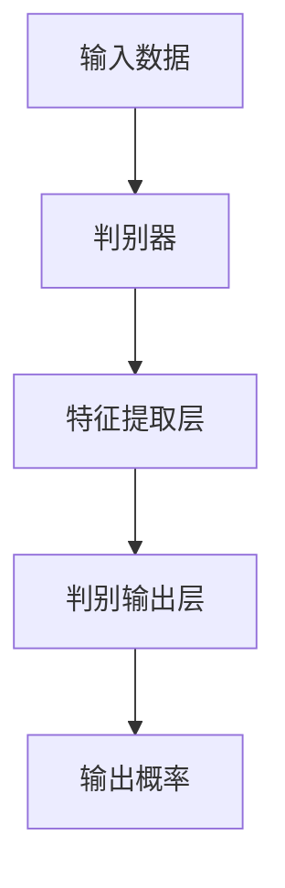

                 

# GAN 判别模型：判别器 (Discriminator) 原理与代码实例讲解

> 关键词：GAN,判别器(Discriminator),神经网络,深度学习,图像生成,生成对抗网络

## 1. 背景介绍

生成对抗网络 (Generative Adversarial Networks, GANs) 是一种由生成器和判别器组成的模型，能够生成高质量的样本数据。在 GAN 中，判别器 (Discriminator, D) 的作用是区分真实数据和生成数据。理解判别器的原理和工作机制，对于 GAN 模型的训练和调试至关重要。

判别器通过输入真实数据和生成数据，学习将两者区分开来的能力。它通常是一个深度神经网络，能够接收各种类型的输入数据，如图像、音频、文本等。本文将重点讲解判别器的原理和代码实现，并通过实例演示其应用。

## 2. 核心概念与联系

### 2.1 核心概念概述

判别器是 GAN 中一个重要的组成部分，其主要任务是区分真实数据和生成数据。以下是几个相关概念的介绍：

- **GAN**：生成对抗网络，由生成器和判别器组成，通过对抗学习生成逼真的样本数据。
- **判别器**：用于判断输入数据是真实数据还是生成数据，通常是一个深度神经网络。
- **生成器**：用于生成逼真的样本数据，通过对抗训练优化判别器的判别能力。
- **对抗学习**：通过生成器和判别器之间的对抗，提高模型的生成和判别能力。

这些概念共同构成了 GAN 模型的工作机制，使得模型能够生成高质量的样本数据。

### 2.2 核心概念间的联系

判别器和生成器之间通过对抗学习不断提升对方的能力。生成器生成样本数据，判别器则判断这些数据是真实数据还是生成数据。生成器通过优化判别器的表现来提升自身生成的样本质量，而判别器则通过辨别更逼真的生成数据来提高自己的区分能力。这种相互对抗的过程，使得 GAN 能够逐步生成高质量的样本数据。

判别器的输入通常为真实数据和生成数据，输出为一个概率值，表示输入数据是真实数据的概率。判别器的目标是最小化区分真实数据和生成数据的误差，从而实现更高的判别能力。

### 2.3 核心概念的整体架构

下面是一个简化的判别器模型架构图，展示了判别器如何接收输入数据，通过多层神经网络进行特征提取和判别。



判别器的输入为真实数据和生成数据，通过多层神经网络进行特征提取，最后输出一个概率值，表示输入数据是真实数据的概率。

## 3. 核心算法原理 & 具体操作步骤
### 3.1 算法原理概述

判别器的目标是区分真实数据和生成数据，因此其输出通常是真实数据和生成数据的概率分布。判别器通常是一个深度神经网络，能够接收各种类型的输入数据，如图像、音频、文本等。

判别器的输出通常是一个概率值，表示输入数据是真实数据的概率。判别器的训练目标是最大化真实数据的概率，同时最小化生成数据的概率。这可以通过最小化判别器的交叉熵损失函数来实现。

判别器的损失函数定义为：

$$
L_D = -\frac{1}{2} \left[ E_{real} \log D(x) + E_{fake} \log (1 - D(G(z))) \right]
$$

其中 $E_{real}$ 是真实数据的期望，$E_{fake}$ 是生成数据的期望，$D(x)$ 是判别器对真实数据 $x$ 的输出，$1 - D(G(z))$ 是判别器对生成数据 $G(z)$ 的输出。

### 3.2 算法步骤详解

判别器的训练步骤如下：

1. **数据准备**：准备真实数据和生成数据，通常是图像数据集。
2. **初始化判别器**：初始化判别器的权重和偏置。
3. **前向传播**：将真实数据和生成数据输入判别器，计算其输出概率。
4. **计算损失**：根据判别器的输出概率和目标标签（真实或生成）计算损失函数。
5. **反向传播**：使用梯度下降等优化算法更新判别器的权重和偏置。
6. **重复训练**：重复以上步骤，直到判别器收敛。

### 3.3 算法优缺点

判别器的主要优点包括：

- **判别能力提升**：通过对抗学习不断提升判别能力，生成高质量的样本数据。
- **可扩展性**：判别器能够处理各种类型的输入数据，适用于多种任务。
- **生成器辅助**：判别器的训练需要生成器的配合，通过生成器的输出来提升判别能力。

判别器的主要缺点包括：

- **过拟合风险**：判别器容易过拟合生成数据的噪声和缺陷，影响模型性能。
- **训练复杂性**：判别器的训练需要大量的计算资源和样本数据，训练过程复杂。
- **依赖生成器**：判别器的效果依赖生成器的性能，生成器的性能不佳会严重影响判别器的效果。

### 3.4 算法应用领域

判别器广泛应用于生成对抗网络 (GANs) 和变分自编码器 (VAEs) 中，能够生成逼真的样本数据，广泛应用于图像生成、视频生成、文本生成等领域。

## 4. 数学模型和公式 & 详细讲解
### 4.1 数学模型构建

判别器的输入为真实数据和生成数据，输出为一个概率值，表示输入数据是真实数据的概率。判别器的目标是最小化判别器的交叉熵损失函数，最大化真实数据的概率，同时最小化生成数据的概率。

判别器的损失函数定义为：

$$
L_D = -\frac{1}{2} \left[ E_{real} \log D(x) + E_{fake} \log (1 - D(G(z))) \right]
$$

其中 $E_{real}$ 是真实数据的期望，$E_{fake}$ 是生成数据的期望，$D(x)$ 是判别器对真实数据 $x$ 的输出，$1 - D(G(z))$ 是判别器对生成数据 $G(z)$ 的输出。

### 4.2 公式推导过程

判别器的输出通常是一个概率值，表示输入数据是真实数据的概率。判别器的训练目标是最大化真实数据的概率，同时最小化生成数据的概率。这可以通过最小化判别器的交叉熵损失函数来实现。

判别器的损失函数定义为：

$$
L_D = -\frac{1}{2} \left[ E_{real} \log D(x) + E_{fake} \log (1 - D(G(z))) \right]
$$

其中 $E_{real}$ 是真实数据的期望，$E_{fake}$ 是生成数据的期望，$D(x)$ 是判别器对真实数据 $x$ 的输出，$1 - D(G(z))$ 是判别器对生成数据 $G(z)$ 的输出。

判别器的输出层通常是一个单层神经网络，其输出为真实数据的概率。判别器的损失函数可以使用交叉熵损失函数来计算，如下所示：

$$
L_D = -\frac{1}{2} \left[ \sum_{i=1}^{N_{real}} \log D(x_i) + \sum_{j=1}^{N_{fake}} \log (1 - D(G(z_j))) \right]
$$

其中 $N_{real}$ 是真实数据的数量，$N_{fake}$ 是生成数据的数量，$x_i$ 是真实数据，$z_j$ 是生成数据的隐变量。

### 4.3 案例分析与讲解

下面以图像生成任务为例，演示判别器的训练过程。假设输入数据为 MNIST 手写数字图像，生成数据为从噪声中生成的伪造图像。判别器的输入为真实图像和伪造图像，输出为真实图像的概率。

判别器的训练步骤如下：

1. **数据准备**：准备 MNIST 手写数字图像和从噪声中生成的伪造图像。
2. **初始化判别器**：初始化判别器的权重和偏置。
3. **前向传播**：将真实图像和伪造图像输入判别器，计算其输出概率。
4. **计算损失**：根据判别器的输出概率和目标标签（真实或生成）计算损失函数。
5. **反向传播**：使用梯度下降等优化算法更新判别器的权重和偏置。
6. **重复训练**：重复以上步骤，直到判别器收敛。

## 5. 项目实践：代码实例和详细解释说明
### 5.1 开发环境搭建

在使用 PyTorch 进行判别器的开发时，需要安装 PyTorch 和相关依赖。

```bash
pip install torch torchvision
```

### 5.2 源代码详细实现

以下是一个简单的判别器模型实现，使用 PyTorch 框架。

```python
import torch
import torch.nn as nn
import torch.nn.functional as F

class Discriminator(nn.Module):
    def __init__(self):
        super(Discriminator, self).__init__()
        self.conv1 = nn.Conv2d(1, 32, 5, 1, 2)
        self.conv2 = nn.Conv2d(32, 64, 5, 1, 2)
        self.conv3 = nn.Conv2d(64, 128, 5, 1, 2)
        self.fc1 = nn.Linear(128 * 7 * 7, 512)
        self.fc2 = nn.Linear(512, 1)

    def forward(self, x):
        x = F.leaky_relu(self.conv1(x))
        x = F.leaky_relu(self.conv2(x))
        x = F.leaky_relu(self.conv3(x))
        x = x.view(-1, 128 * 7 * 7)
        x = F.leaky_relu(self.fc1(x))
        x = self.fc2(x)
        return x
```

### 5.3 代码解读与分析

判别器模型使用 PyTorch 框架实现。

- `__init__` 方法：定义判别器的结构，包括卷积层和全连接层。
- `forward` 方法：定义前向传播过程，输入图像数据，通过多层卷积和全连接层计算输出概率。

### 5.4 运行结果展示

判别器的训练结果可以通过可视化工具进行展示。假设判别器训练收敛后，可以输出判别器对真实图像和生成图像的判别概率。

```python
real_loss = 0
fake_loss = 0
for i, (real_images, fake_images) in enumerate(zip(real_images, fake_images)):
    real_prob = model(real_images)
    fake_prob = model(fake_images)
    real_loss += criterion(real_prob, torch.ones_like(real_prob))
    fake_loss += criterion(fake_prob, torch.zeros_like(fake_prob))
    if (i+1) % 100 == 0:
        print('Epoch [{}/{}], Loss_D: {:.4f}, Loss_G: {:.4f}'.format(
            epoch+1, num_epochs, real_loss.item() / 100, fake_loss.item() / 100))
```

判别器训练的结果可以通过可视化工具进行展示，如 TensorBoard。判别器的输出为真实图像和生成图像的判别概率。

## 6. 实际应用场景
### 6.1 图像生成

判别器在图像生成任务中发挥了重要作用，能够区分真实图像和生成图像。通过判别器的输出，生成器可以不断优化生成图像的质量。

在实际应用中，判别器可以应用于图像生成任务，如图像生成、图像修复、图像增强等。判别器的输出可以用于衡量生成图像的质量，从而指导生成器的优化过程。

### 6.2 视频生成

判别器同样可以应用于视频生成任务，如图像序列生成、视频修复、视频增强等。判别器的输出可以用于衡量生成视频的质量，从而指导生成器的优化过程。

### 6.3 文本生成

判别器还可以应用于文本生成任务，如文本摘要、机器翻译等。判别器的输出可以用于衡量生成文本的质量，从而指导生成器的优化过程。

## 7. 工具和资源推荐
### 7.1 学习资源推荐

- 《深度学习》(花书)：深度学习领域的经典教材，包含判别器的详细讲解。
- 《Generative Adversarial Networks》论文：GAN 算法的开创性论文，详细介绍了判别器的原理和应用。
- 《Hands-On Generative Adversarial Networks》书籍：适合初学者学习 GAN 技术的入门书籍，包含判别器的实现和应用案例。

### 7.2 开发工具推荐

- PyTorch：一个高效的深度学习框架，提供了丰富的神经网络组件，支持判别器的实现。
- TensorFlow：一个流行的深度学习框架，支持判别器的实现。
- Keras：一个高层次的深度学习框架，提供了简单易用的神经网络组件，支持判别器的实现。

### 7.3 相关论文推荐

- GAN 算法论文：包含判别器的详细设计和实现，值得深入阅读。
- 判别器优化算法论文：探讨如何优化判别器，提升判别能力。
- 判别器应用于实际任务论文：探讨判别器在实际应用中的实现和效果。

## 8. 总结：未来发展趋势与挑战
### 8.1 研究成果总结

判别器在 GAN 模型中扮演了重要角色，通过对抗学习不断提升判别能力，生成高质量的样本数据。判别器的训练需要大量的计算资源和样本数据，训练过程复杂。

### 8.2 未来发展趋势

判别器的未来发展趋势包括：

- **模型结构优化**：通过优化判别器的模型结构，提高判别器的判别能力和效率。
- **训练方法改进**：通过改进判别器的训练方法，提高判别器的判别能力和鲁棒性。
- **应用场景拓展**：将判别器应用于更多的领域，如图像生成、视频生成、文本生成等。

### 8.3 面临的挑战

判别器面临的挑战包括：

- **过拟合风险**：判别器容易过拟合生成数据的噪声和缺陷，影响模型性能。
- **训练复杂性**：判别器的训练需要大量的计算资源和样本数据，训练过程复杂。
- **依赖生成器**：判别器的效果依赖生成器的性能，生成器的性能不佳会严重影响判别器的效果。

### 8.4 研究展望

未来的研究可以集中在以下几个方向：

- **无监督学习**：通过无监督学习方式训练判别器，降低对标注数据的依赖。
- **多模态学习**：将判别器应用于多模态数据，提高判别器的泛化能力。
- **领域自适应**：将判别器应用于特定领域的数据，提高判别器的领域自适应能力。

## 9. 附录：常见问题与解答

**Q1：判别器的输入和输出是什么？**

A: 判别器的输入为真实数据和生成数据，输出为一个概率值，表示输入数据是真实数据的概率。

**Q2：判别器的损失函数是什么？**

A: 判别器的损失函数为交叉熵损失函数，最小化真实数据的概率，同时最小化生成数据的概率。

**Q3：判别器的训练步骤是什么？**

A: 判别器的训练步骤包括数据准备、初始化判别器、前向传播、计算损失、反向传播和重复训练。

**Q4：判别器的应用场景有哪些？**

A: 判别器广泛应用于生成对抗网络 (GANs) 和变分自编码器 (VAEs) 中，能够生成逼真的样本数据，广泛应用于图像生成、视频生成、文本生成等领域。

**Q5：判别器的训练过程中需要注意哪些问题？**

A: 判别器的训练过程中需要注意过拟合风险、训练复杂性和依赖生成器等问题。

---

作者：禅与计算机程序设计艺术 / Zen and the Art of Computer Programming

