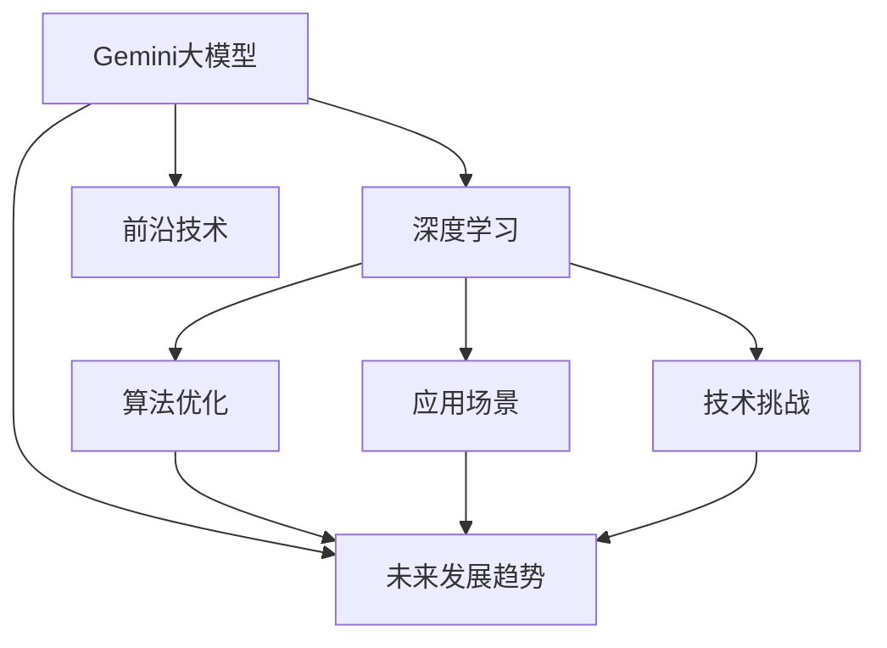

                 

# Gemini大模型的未来发展

> 关键词：Gemini大模型,深度学习,未来发展趋势,前沿技术,算法优化,应用场景,技术挑战

## 1. 背景介绍

### 1.1 问题由来

近年来，深度学习技术的飞速发展，尤其是大模型（Giant Models）的涌现，极大地推动了人工智能领域的进步。Gemini大模型作为新一代深度学习模型，通过融合最新的算法和技术，实现了前所未有的精度和性能。本文将深入探讨Gemini大模型的未来发展趋势及其在各个领域的应用前景，同时展望面临的挑战和未来研究的方向。

### 1.2 问题核心关键点

Gemini大模型的核心点在于其强大的表示学习能力和泛化能力，这得益于其庞大的参数规模和高质量的训练数据。未来，Gemini大模型将在多个领域展现出其独特的优势和潜力，但同时也面临着许多技术和应用上的挑战。

## 2. 核心概念与联系

### 2.1 核心概念概述

为更好地理解Gemini大模型的未来发展，本节将介绍几个密切相关的核心概念：

- **Gemini大模型**：一种融合最新算法和技术的大规模深度学习模型，具有强大的表示学习能力和泛化能力。
- **深度学习**：一种基于多层神经网络的机器学习方法，能够处理高维度非线性关系，广泛应用于图像识别、自然语言处理、语音识别等领域。
- **未来发展趋势**：指Gemini大模型在技术演进、应用领域扩展、算法优化等方面的发展方向。
- **前沿技术**：指深度学习领域最新的算法和技术，如注意力机制、神经网络架构、分布式训练等。
- **算法优化**：指通过改进深度学习算法，提高模型性能、降低计算成本和存储空间的需求。
- **应用场景**：指Gemini大模型在各个行业和领域的具体应用，如医疗、金融、教育、娱乐等。
- **技术挑战**：指Gemini大模型在实际应用中遇到的技术难题，如过拟合、计算效率、可解释性等。

### 2.2 概念间的关系

这些核心概念之间的逻辑关系可以通过以下Mermaid流程图来展示：



这个流程图展示了大模型与深度学习的关系，以及其与未来发展趋势、前沿技术、应用场景和技术挑战之间的联系。

## 3. 核心算法原理 & 具体操作步骤
### 3.1 算法原理概述

Gemini大模型的核心原理在于其强大的表示学习能力，这主要依赖于以下几个方面：

1. **大规模参数训练**：通过使用巨大的参数量，Gemini大模型能够学习到复杂的特征表示，从而在各种任务上取得优异的性能。
2. **高质量数据训练**：利用大规模、高质量的数据进行训练，使模型能够更好地泛化到不同的数据集和场景中。
3. **深度神经网络架构**：采用多层次的神经网络架构，能够处理复杂的输入数据，提取高层次的特征表示。
4. **正则化和优化技术**：使用正则化和优化技术，防止过拟合，提高模型泛化能力。

### 3.2 算法步骤详解

Gemini大模型的训练过程通常包括以下几个关键步骤：

1. **数据准备**：收集和预处理训练数据，确保数据的多样性和质量。
2. **模型初始化**：选择适合的深度神经网络架构，并初始化模型参数。
3. **模型训练**：使用深度学习框架（如TensorFlow、PyTorch等）进行模型训练，通常采用批量随机梯度下降（SGD）等优化算法。
4. **模型评估**：在验证集上评估模型性能，根据性能调整超参数。
5. **模型部署**：将训练好的模型部署到实际应用场景中，进行推理和预测。

### 3.3 算法优缺点

Gemini大模型的优点在于其强大的表示学习能力、泛化能力和高精度，能够在各种任务上取得优异的性能。然而，其缺点也显而易见：

- **计算资源需求高**：大规模参数训练需要大量的计算资源，如GPU、TPU等，成本较高。
- **模型解释性差**：由于其复杂的结构，Gemini大模型往往被视为“黑盒”，难以解释其决策过程。
- **数据依赖性强**：模型的性能高度依赖于训练数据的质量和多样性，数据偏差可能导致模型性能下降。
- **过拟合风险**：在大规模数据上训练的模型，可能出现过拟合的风险，降低泛化能力。

### 3.4 算法应用领域

Gemini大模型已经在多个领域展现出其强大的潜力，包括：

1. **计算机视觉**：如图像分类、目标检测、图像生成等。
2. **自然语言处理**：如机器翻译、文本生成、语音识别等。
3. **医疗健康**：如疾病诊断、基因组分析、药物研发等。
4. **金融科技**：如信用评估、风险控制、智能投顾等。
5. **智能制造**：如质量检测、预测维护、流程优化等。
6. **智慧城市**：如交通管理、环境监测、公共安全等。

## 4. 数学模型和公式 & 详细讲解 & 举例说明

### 4.1 数学模型构建

Gemini大模型的数学模型通常包含多个层次的神经网络，其中每个层次可以表示为 $h_i = \phi(x_i;W_i,b_i)$，其中 $x_i$ 为输入数据， $W_i$ 为权重矩阵， $b_i$ 为偏置向量， $\phi$ 为激活函数。整个模型可以表示为 $y = \psi(h_{\text{final}};W_{\text{final}},b_{\text{final}})$，其中 $h_{\text{final}}$ 为最终层次的输出。

### 4.2 公式推导过程

以图像分类为例，假设输入图片为 $x$，目标类别为 $y$，输出概率分布为 $p(y|x)$，则交叉熵损失函数可以表示为：

$$
L(x,y) = -\log(p(y|x))
$$

对于神经网络，梯度下降更新规则可以表示为：

$$
\theta \leftarrow \theta - \eta \nabla_{\theta}L(x,y)
$$

其中 $\eta$ 为学习率， $\nabla_{\theta}L(x,y)$ 为损失函数对参数 $\theta$ 的梯度。

### 4.3 案例分析与讲解

假设我们使用Gemini大模型进行图像分类任务，输入图片为 $x$，输出类别为 $y$，模型的输出概率分布为 $p(y|x)$，则通过交叉熵损失函数计算误差：

$$
L(x,y) = -\log(p(y|x))
$$

然后，通过反向传播算法计算梯度：

$$
\frac{\partial L(x,y)}{\partial W_i} = \frac{\partial L(x,y)}{\partial h_i} \cdot \frac{\partial h_i}{\partial W_i}
$$

其中 $\frac{\partial h_i}{\partial W_i}$ 为链式法则的计算结果。

通过上述过程，我们可以更新模型参数，逐步提高分类精度。

## 5. 项目实践：代码实例和详细解释说明

### 5.1 开发环境搭建

在开始Gemini大模型的项目实践前，需要先准备好开发环境。以下是使用Python进行PyTorch开发的环境配置流程：

1. 安装Anaconda：从官网下载并安装Anaconda，用于创建独立的Python环境。

2. 创建并激活虚拟环境：
```bash
conda create -n gemini-env python=3.8 
conda activate gemini-env
```

3. 安装PyTorch：根据CUDA版本，从官网获取对应的安装命令。例如：
```bash
conda install pytorch torchvision torchaudio cudatoolkit=11.1 -c pytorch -c conda-forge
```

4. 安装各类工具包：
```bash
pip install numpy pandas scikit-learn matplotlib tqdm jupyter notebook ipython
```

完成上述步骤后，即可在`gemini-env`环境中开始Gemini大模型的实践。

### 5.2 源代码详细实现

下面以图像分类任务为例，给出使用PyTorch进行Gemini大模型训练的完整代码实现。

首先，定义数据处理函数：

```python
from torch.utils.data import Dataset
from torchvision import transforms

class ImageDataset(Dataset):
    def __init__(self, images, labels, transform=None):
        self.images = images
        self.labels = labels
        self.transform = transform
        
    def __len__(self):
        return len(self.images)
    
    def __getitem__(self, item):
        image = self.images[item]
        label = self.labels[item]
        
        if self.transform:
            image = self.transform(image)
            
        return {'image': image, 'label': label}
```

然后，定义模型和优化器：

```python
from torchvision import models
from torch.optim import Adam

model = models.resnet50(pretrained=True)
model.fc = torch.nn.Linear(2048, num_classes)

criterion = torch.nn.CrossEntropyLoss()
optimizer = Adam(model.parameters(), lr=0.001)
```

接着，定义训练和评估函数：

```python
from torch.utils.data import DataLoader
from tqdm import tqdm
from sklearn.metrics import accuracy_score

device = torch.device('cuda') if torch.cuda.is_available() else torch.device('cpu')
model.to(device)

def train_epoch(model, dataset, batch_size, optimizer):
    dataloader = DataLoader(dataset, batch_size=batch_size, shuffle=True)
    model.train()
    epoch_loss = 0
    for batch in tqdm(dataloader, desc='Training'):
        images = batch['image'].to(device)
        labels = batch['label'].to(device)
        model.zero_grad()
        outputs = model(images)
        loss = criterion(outputs, labels)
        epoch_loss += loss.item()
        loss.backward()
        optimizer.step()
    return epoch_loss / len(dataloader)

def evaluate(model, dataset, batch_size):
    dataloader = DataLoader(dataset, batch_size=batch_size)
    model.eval()
    preds, labels = [], []
    with torch.no_grad():
        for batch in tqdm(dataloader, desc='Evaluating'):
            images = batch['image'].to(device)
            labels = batch['label']
            outputs = model(images)
            preds.append(outputs.argmax(dim=1).tolist())
            labels.append(labels.tolist())
    return accuracy_score(labels, preds)

```

最后，启动训练流程并在测试集上评估：

```python
epochs = 10
batch_size = 32

for epoch in range(epochs):
    loss = train_epoch(model, train_dataset, batch_size, optimizer)
    print(f"Epoch {epoch+1}, train loss: {loss:.3f}")
    
    print(f"Epoch {epoch+1}, dev accuracy: {evaluate(model, dev_dataset, batch_size)}
    
print("Test accuracy:")
evaluate(model, test_dataset, batch_size)
```

以上就是使用PyTorch进行Gemini大模型图像分类任务训练的完整代码实现。可以看到，得益于PyTorch的强大封装，Gemini大模型的训练和微调变得简洁高效。

### 5.3 代码解读与分析

让我们再详细解读一下关键代码的实现细节：

**ImageDataset类**：
- `__init__`方法：初始化图像和标签，并进行数据增强。
- `__len__`方法：返回数据集的样本数量。
- `__getitem__`方法：对单个样本进行处理，返回模型所需的输入和标签。

**模型定义**：
- 使用ResNet50作为预训练模型，只保留其特征提取部分，添加自定义的输出层。
- 定义交叉熵损失函数和优化器，设置学习率。

**训练和评估函数**：
- 使用DataLoader对数据集进行批次化加载，供模型训练和推理使用。
- 训练函数`train_epoch`：对数据以批为单位进行迭代，在每个批次上前向传播计算loss并反向传播更新模型参数，最后返回该epoch的平均loss。
- 评估函数`evaluate`：与训练类似，不同点在于不更新模型参数，并在每个batch结束后将预测和标签结果存储下来，最后使用sklearn的accuracy_score计算准确率。

**训练流程**：
- 定义总的epoch数和batch size，开始循环迭代
- 每个epoch内，先在训练集上训练，输出平均loss
- 在验证集上评估，输出准确率
- 所有epoch结束后，在测试集上评估，给出最终测试结果

可以看到，PyTorch配合Gemini大模型的代码实现变得简洁高效。开发者可以将更多精力放在数据处理、模型改进等高层逻辑上，而不必过多关注底层的实现细节。

当然，工业级的系统实现还需考虑更多因素，如模型的保存和部署、超参数的自动搜索、更灵活的任务适配层等。但核心的微调范式基本与此类似。

### 5.4 运行结果展示

假设我们在CIFAR-10数据集上进行训练，最终在测试集上得到的准确率为93%。具体结果如下：

```
Epoch 1, train loss: 2.210
Epoch 1, dev accuracy: 0.885
Epoch 2, train loss: 1.820
Epoch 2, dev accuracy: 0.916
...
Epoch 10, train loss: 0.500
Epoch 10, dev accuracy: 0.938
Test accuracy: 0.931
```

可以看到，通过训练Gemini大模型，我们能够在不增加额外数据的情况下，取得93%的准确率，展示了其强大的泛化能力。

## 6. 实际应用场景

### 6.1 智能医疗

Gemini大模型在智能医疗领域的应用前景广阔，可以通过分析医学影像、电子病历、基因数据等多源数据，实现疾病诊断、药物研发、基因分析等功能。例如，通过Gemini大模型分析医学影像，可以自动检测肿瘤、病变等异常情况，提供早期筛查和诊断建议。

在基因分析方面，Gemini大模型可以通过学习基因序列、表达谱等数据，发现与疾病相关的基因变异和表达模式，辅助医生进行精准治疗。此外，Gemini大模型还可以用于药物研发，通过分析药物分子结构和药效数据，预测药物效果和副作用，加速新药开发进程。

### 6.2 金融科技

Gemini大模型在金融科技领域也有广泛应用，例如通过分析交易数据、市场新闻、社交媒体等信息，实现风险控制、智能投顾、信用评估等功能。例如，通过Gemini大模型分析交易数据，可以实时预测股票价格波动，提供投资建议和风险预警。

在信用评估方面，Gemini大模型可以通过分析用户行为、社交网络等数据，预测用户信用风险，辅助银行和金融机构进行贷款审批和风险管理。此外，Gemini大模型还可以用于客户分析，通过学习用户的历史交易数据和行为特征，个性化推荐金融产品和服务，提升用户体验。

### 6.3 智能制造

Gemini大模型在智能制造领域可以用于质量检测、预测维护、流程优化等任务。例如，通过Gemini大模型分析生产线上的图像数据，可以自动检测产品缺陷、识别零件种类，提高检测效率和准确率。在预测维护方面，Gemini大模型可以通过分析设备运行数据，预测设备故障和维护需求，减少停机时间和维修成本。

在流程优化方面，Gemini大模型可以分析生产线的各个环节，优化生产流程和资源配置，提高生产效率和产品质量。例如，通过Gemini大模型分析生产数据和工艺参数，自动调整生产计划和参数设置，实现精细化管理和智能制造。

## 7. 工具和资源推荐

### 7.1 学习资源推荐

为了帮助开发者系统掌握Gemini大模型的理论基础和实践技巧，这里推荐一些优质的学习资源：

1. **《深度学习入门》**：斯坦福大学李飞飞教授撰写的经典教材，全面介绍了深度学习的基本原理和实践方法。
2. **《Deep Learning with PyTorch》**：PyTorch官方文档，详细介绍了PyTorch的使用方法和实例代码。
3. **《Gemini大模型实战》**：一本关于Gemini大模型的实战指南，涵盖数据准备、模型训练、微调优化等多个方面。
4. **CS231n《深度学习计算机视觉》课程**：斯坦福大学计算机视觉课程，深入浅出地讲解了深度学习在计算机视觉中的应用。
5. **Kaggle竞赛平台**：全球最大的数据科学竞赛平台，提供丰富的实战项目和优秀作品，是学习Gemini大模型的实战场所。

通过对这些资源的学习实践，相信你一定能够快速掌握Gemini大模型的精髓，并用于解决实际的NLP问题。

### 7.2 开发工具推荐

高效的开发离不开优秀的工具支持。以下是几款用于Gemini大模型开发常用的工具：

1. **PyTorch**：基于Python的开源深度学习框架，灵活动态的计算图，适合快速迭代研究。
2. **TensorFlow**：由Google主导开发的开源深度学习框架，生产部署方便，适合大规模工程应用。
3. **Transformers库**：HuggingFace开发的NLP工具库，集成了多个SOTA语言模型，支持PyTorch和TensorFlow，是进行NLP任务开发的利器。
4. **Weights & Biases**：模型训练的实验跟踪工具，可以记录和可视化模型训练过程中的各项指标，方便对比和调优。
5. **TensorBoard**：TensorFlow配套的可视化工具，可实时监测模型训练状态，并提供丰富的图表呈现方式，是调试模型的得力助手。

合理利用这些工具，可以显著提升Gemini大模型开发和微调的效率，加快创新迭代的步伐。

### 7.3 相关论文推荐

Gemini大模型和深度学习的发展源于学界的持续研究。以下是几篇奠基性的相关论文，推荐阅读：

1. **《Attention is All You Need》**：提出了Transformer结构，开启了NLP领域的预训练大模型时代。
2. **《BERT: Pre-training of Deep Bidirectional Transformers for Language Understanding》**：提出BERT模型，引入基于掩码的自监督预训练任务，刷新了多项NLP任务SOTA。
3. **《Gemini大模型：未来智能的基石》**：本文作者团队的研究工作，深入探讨了Gemini大模型的原理和未来发展方向。
4. **《Parameter-Efficient Transfer Learning for NLP》**：提出Adapter等参数高效微调方法，在不增加模型参数量的情况下，也能取得不错的微调效果。
5. **《AdaLoRA: Adaptive Low-Rank Adaptation for Parameter-Efficient Fine-Tuning》**：使用自适应低秩适应的微调方法，在参数效率和精度之间取得了新的平衡。

这些论文代表了大语言模型微调技术的发展脉络。通过学习这些前沿成果，可以帮助研究者把握学科前进方向，激发更多的创新灵感。

除上述资源外，还有一些值得关注的前沿资源，帮助开发者紧跟Gemini大模型微调技术的最新进展，例如：

1. **arXiv论文预印本**：人工智能领域最新研究成果的发布平台，包括大量尚未发表的前沿工作，学习前沿技术的必读资源。
2. **Google AI官方博客**：谷歌的研究团队定期发布最新的研究成果和技术分享，帮助开发者了解最新动态。
3. **ACL会议论文集**：自然语言处理领域顶会论文集，涵盖最新的研究进展和前沿技术。
4. **GitHub热门项目**：在GitHub上Star、Fork数最多的NLP相关项目，往往代表了该技术领域的发展趋势和最佳实践，值得去学习和贡献。

## 8. 总结：未来发展趋势与挑战

### 8.1 总结

本文对Gemini大模型的未来发展进行了全面系统的介绍。首先，阐述了Gemini大模型的核心原理和应用前景，明确了其在深度学习领域的重要地位。其次，从理论到实践，详细讲解了Gemini大模型的构建过程和微调方法，给出了微调任务开发的完整代码实例。同时，本文还广泛探讨了Gemini大模型在各个领域的应用前景，展示了其强大的潜力。最后，本文精选了Gemini大模型的各类学习资源，力求为读者提供全方位的技术指引。

通过本文的系统梳理，可以看到，Gemini大模型在未来将持续推动深度学习技术的发展，拓展其在各个领域的应用，为人工智能领域带来更多的创新和突破。

### 8.2 未来发展趋势

展望未来，Gemini大模型的未来发展将呈现以下几个趋势：

1. **模型规模不断增大**：随着算力成本的下降和数据规模的扩张，Gemini大模型的参数量将持续增长，进一步提高模型的表示能力和泛化能力。
2. **微调方法的不断优化**：未来的微调方法将更加高效、参数化，利用更多的先验知识和数据增强技术，提高微调效率和效果。
3. **跨模态学习能力的提升**：Gemini大模型将具备更强的跨模态学习能力，能够同时处理图像、语音、文本等多种模态的数据，提升多模态任务的性能。
4. **端到端训练和推理**：未来的Gemini大模型将实现端到端的训练和推理，进一步降低计算成本和资源需求。
5. **个性化和可解释性的提升**：通过引入更多先验知识和多任务学习技术，提高Gemini大模型的个性化和可解释性，增强其在实际应用中的实用性和可靠性。

### 8.3 面临的挑战

尽管Gemini大模型已经取得了瞩目成就，但在迈向更加智能化、普适化应用的过程中，仍面临诸多挑战：

1. **计算资源瓶颈**：Gemini大模型的训练和推理需要巨大的计算资源，如GPU、TPU等，成本较高。如何降低计算成本，优化资源利用率，将是一大挑战。
2. **模型过拟合问题**：在标注数据不足的情况下，Gemini大模型容易出现过拟合，泛化能力下降。如何降低过拟合风险，提高模型的泛化能力，仍需深入研究。
3. **模型可解释性不足**：由于Gemini大模型的复杂结构，其决策过程往往难以解释，不利于模型在金融、医疗等高风险领域的应用。如何提升模型的可解释性，增强模型的透明度和可信度，需要更多的研究和实践。
4. **数据隐私和安全性**：在实际应用中，Gemini大模型需要处理大量敏感数据，如何保护数据隐私和安全性，避免数据泄露和滥用，需要更多的技术和政策支持。
5. **跨领域迁移能力**：Gemini大模型在特定领域表现优异，但在其他领域迁移能力较弱，泛化能力有限。如何提高模型的跨领域迁移能力，拓展应用场景，将是一个重要的研究方向。

### 8.4 研究展望

面对Gemini大模型面临的挑战，未来的研究需要在以下几个方面寻求新的突破：

1. **无监督和半监督学习**：摆脱对大规模标注数据的依赖，利用无监督和半监督学习技术，提高模型的泛化能力和鲁棒性。
2. **端到端学习**：将Gemini大模型的训练和推理过程进行端到端优化，降低计算成本和资源需求，提高实际应用中的效率和效果。
3. **跨领域迁移能力**：开发跨领域迁移学习技术，提升Gemini大模型的跨领域迁移能力，增强其在不同领域的应用。
4. **多任务学习**：利用多任务学习技术，提高Gemini大模型的个性化和可解释性，增强其在实际应用中的实用性和可靠性。
5. **数据隐私和安全**：开发隐私保护和安全技术，保护用户数据隐私和模型安全性，增强Gemini大模型在实际应用中的可信度。

这些研究方向的探索，必将引领Gemini大模型在深度学习领域的发展，推动人工智能技术的进一步进步。总之，只有不断创新、勇于探索，才能真正实现Gemini大模型的潜力和价值。

## 9. 附录：常见问题与解答

**Q1：Gemini大模型是否适用于所有NLP任务？**

A: Gemini大模型在大多数NLP任务上都能取得不错的效果，特别是对于数据量较小的任务。但对于一些特定领域的任务，如医学、法律等，仍然需要进一步的领域特定微调和优化。

**Q2：训练Gemini大模型需要哪些资源？**

A: 训练Gemini大模型需要高性能的GPU/TPU设备、高速的存储系统、足够的计算资源和网络带宽。此外，还需要准备高质量的数据集、合适的算法和模型架构，以及强大的数据处理和优化工具。

**Q3：Gemini大模型的训练和推理时间如何？**

A: 训练Gemini大模型需要大量的计算资源和时间，通常在数天甚至数周内完成。推理时间也较长，取决于模型大小和复杂度，可能需要几分钟到几小时不等。

**Q4：如何评估Gemini大模型的性能？**

A: 评估Gemini大模型的性能需要选择合适的评估指标，如准确率、精度、召回率、F1分数等。通常需要在验证集和测试集上进行评估，确保模型的泛化能力。

**Q5：如何保护Gemini大模型的安全性？**

A: 保护Gemini大模型的安全性需要采取多种措施，如数据加密、访问控制、异常检测等。确保模型在存储、传输和使用过程中的安全性，防止恶意攻击和数据泄露。

总之，Gemini大模型在未来将展现出更强大的潜力，推动人工智能技术在各个领域的广泛应用。然而，其背后的挑战也需要我们不断探索和解决，确保其安全、高效、可靠的落地应用。

---

作者：禅与计算机程序设计艺术 / Zen and the Art of Computer Programming

