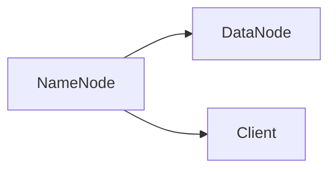

                 

# Hadoop分布式文件系统HDFS原理与代码实例讲解

> 关键词：Hadoop HDFS分布式文件系统,数据存储,系统架构,可靠性,容错性,数据冗余,数据访问,并行处理,数据传输,分布式计算

## 1. 背景介绍

### 1.1 问题由来

随着互联网技术的发展和数据量的激增，单个服务器已经无法满足海量数据的存储和处理需求。分布式文件系统应运而生，通过将数据分散存储在不同的服务器上，实现高可靠性和高可扩展性。Hadoop分布式文件系统(HDFS)作为分布式文件系统的代表，以其高容错性、高可靠性、高扩展性等特点，成为了大数据时代存储海量数据的基石。

### 1.2 问题核心关键点

HDFS的核心思想是将数据分散存储在多个数据节点上，并通过一个主节点（NameNode）来管理整个文件系统的元数据。其关键点包括：
- 数据分片与存储：将一个大文件切分为多个数据块（Block），分布在不同的数据节点上存储。
- 元数据管理：通过主节点管理文件的元数据，如文件名、文件大小、块位置等，并负责处理文件操作请求。
- 容错性与可靠性：通过数据冗余和数据块复制机制，确保数据不会丢失，同时确保系统高可用性。
- 数据访问与传输：采用多块并发读写的方式，实现高效的数据访问和传输。
- 并行处理与扩展性：支持跨节点的并行数据处理，实现系统的高扩展性。

HDFS自问世以来，经过多次迭代优化，已广泛应用于各种大规模数据处理任务，如Google的MapReduce、Yahoo的Sqoop、Facebook的Hive等。本文将详细讲解HDFS的核心原理，并通过实例代码帮助读者更好地理解和应用HDFS。

### 1.3 问题研究意义

深入理解HDFS的原理，对于开发高效可靠的大数据存储和处理系统，具有重要意义：

1. 降低存储成本。通过分布式存储，可以充分利用廉价硬件，降低存储成本。
2. 提高数据处理效率。通过并行处理和优化算法，提高数据的读写和处理效率。
3. 增强系统可靠性。通过数据冗余和容错机制，确保系统的稳定性和高可用性。
4. 拓展应用场景。HDFS的分布式特性，使其能够支撑各种大规模数据处理应用。
5. 提升系统可扩展性。通过增加节点和数据块，实现系统的无限扩展。

HDFS的卓越性能和可靠性，使其成为了大数据时代不可或缺的基础设施，推动了大数据技术的快速发展。

## 2. 核心概念与联系

### 2.1 核心概念概述

HDFS由以下几个核心组件构成：

- **NameNode**：负责管理整个文件系统的元数据，如文件路径、块位置等。
- **DataNode**：存储实际的数据块，接收来自NameNode的读写请求，并负责数据的上传和下载。
- **Client**：用户通过客户端访问HDFS文件系统，与NameNode和DataNode进行通信。

这些组件通过TCP/IP协议进行通信，形成一个分布式文件系统。

### 2.2 概念间的关系

HDFS的各个组件通过相互作用，共同实现数据的高可靠性和高扩展性。



这个简单的图示展示了NameNode、DataNode和Client之间的基本关系。DataNode存储实际数据块，NameNode管理元数据，Client通过客户端访问文件系统。

## 3. 核心算法原理 & 具体操作步骤
### 3.1 算法原理概述

HDFS的核心算法原理可以概括为以下几点：

1. 数据分片：将一个大文件切分为多个数据块（Block），大小一般为128MB或256MB，分布在不同的DataNode上。
2. 元数据管理：通过NameNode管理文件的元数据，包括文件名、文件大小、块位置等。
3. 数据冗余：每个数据块至少复制到三个DataNode上，以确保数据的冗余和可靠性。
4. 数据访问与传输：通过并行读写和数据传输优化，实现高效的数据访问和传输。
5. 数据块复制策略：采用Hadoop的复制算法，动态调整块复制策略，以平衡数据冗余和性能。

HDFS的算法原理是其高效可靠的核心支撑，下面将详细讲解HDFS的各个算法步骤。

### 3.2 算法步骤详解

#### 3.2.1 数据分片与存储

**步骤1: 数据分片**
- 输入一个大文件。
- 将文件分片为多个数据块，每个数据块大小为128MB或256MB。
- 计算每个数据块的块ID，分配到不同的DataNode上存储。

**步骤2: 数据存储**
- 每个DataNode存储多个数据块，块大小为128MB或256MB。
- 每个DataNode定期向NameNode报告块的状态，如是否存在、读取写入次数等。

#### 3.2.2 元数据管理

**步骤1: 文件创建**
- 客户端向NameNode发起创建文件请求。
- NameNode记录文件路径、大小、块位置等元数据，并将元数据写入内存中的元数据表。

**步骤2: 文件操作**
- 客户端通过Client向NameNode发起文件操作请求，如读写文件、获取文件元数据等。
- NameNode根据请求更新元数据表，并将更新后的元数据同步到DataNode上。

#### 3.2.3 数据冗余与容错

**步骤1: 数据冗余**
- 每个数据块至少复制到三个DataNode上，以确保数据的冗余和可靠性。
- 冗余块的位置随机选择，避免单点故障。

**步骤2: 数据块复制策略**
- HDFS采用动态调整复制因子的策略，根据数据的读写情况和系统负载动态调整块的复制数量。
- 系统默认块的复制因子为3，但在高负载或网络不稳定时，可手动调整块的复制因子。

#### 3.2.4 数据访问与传输

**步骤1: 数据读取**
- 客户端向NameNode请求文件元数据，包括文件路径、块位置等信息。
- NameNode返回元数据，客户端根据元数据从不同的DataNode上读取数据块。

**步骤2: 数据写入**
- 客户端向NameNode请求写入文件，NameNode记录文件路径、大小、块位置等元数据。
- 客户端将数据块分批写入DataNode，DataNode在写入完成后通知NameNode，NameNode更新元数据表。

#### 3.2.5 数据块复制策略

**步骤1: 冗余块选择**
- 块复制时，随机选择冗余块的存储位置，避免单点故障。

**步骤2: 冗余块更新**
- 当某个DataNode故障时，系统自动从冗余块中选择一个健康节点进行数据恢复。
- 当某个DataNode加入系统时，系统自动将部分冗余块重新分配到新的节点上。

### 3.3 算法优缺点

#### 3.3.1 优点

1. 高可靠性：通过数据冗余和容错机制，确保数据的可靠性，避免单点故障。
2. 高扩展性：通过增加DataNode和数据块，实现系统的无限扩展。
3. 高可用性：通过NameNode的管理和调度，确保系统的稳定性和高可用性。
4. 高效性：通过并行读写和数据传输优化，实现高效的数据访问和传输。
5. 开放性：HDFS的源代码开放，便于社区改进和扩展。

#### 3.3.2 缺点

1. 性能瓶颈：当文件大小超过2TB时，文件切片过大，可能导致性能瓶颈。
2. 系统复杂性：HDFS系统架构复杂，管理和维护成本较高。
3. 网络带宽：在大数据传输过程中，需要大量的网络带宽，对网络带宽要求较高。
4. 单点故障：尽管HDFS具有高可用性，但NameNode作为单点故障，一旦故障，整个系统将无法运行。

尽管HDFS存在这些缺点，但其优点明显，使得HDFS在大数据时代仍然具有重要的地位。

### 3.4 算法应用领域

HDFS主要应用于以下几个领域：

1. 大数据存储：HDFS能够高效存储海量数据，支持大规模数据存储和处理。
2. 大数据处理：HDFS支持MapReduce、Hive、Spark等大数据处理框架，用于大规模数据处理和分析。
3. 数据备份：HDFS的数据冗余和容错机制，使其成为理想的数据备份解决方案。
4. 数据迁移：HDFS支持跨地域的数据迁移，便于数据的分布式存储和处理。
5. 科研计算：HDFS在科学研究中得到了广泛应用，如基因组学、天文学等领域。

## 4. 数学模型和公式 & 详细讲解 & 举例说明

### 4.1 数学模型构建

HDFS的数学模型构建主要涉及以下几个方面：

- **数据分片模型**：将文件切分为多个数据块，每个数据块大小为128MB或256MB。
- **元数据管理模型**：NameNode记录文件的元数据，包括文件名、文件大小、块位置等。
- **数据冗余模型**：每个数据块至少复制到三个DataNode上，确保数据的冗余和可靠性。
- **数据块复制策略模型**：采用动态调整复制因子的策略，根据数据的读写情况和系统负载动态调整块的复制数量。

#### 4.1.1 数据分片模型

假设有一个大小为8GB的文件，分片大小为256MB，则该文件可切分为32个数据块。

**步骤1: 文件大小计算**
- 文件大小为8GB，每个数据块大小为256MB。
- 文件切分为 $8GB \div 256MB = 32$ 个数据块。

**步骤2: 块ID计算**
- 每个数据块的块ID为从0开始的整数。
- 假设第一个数据块的块ID为0，则第32个数据块的块ID为31。

**步骤3: 块分配**
- 将数据块分配到不同的DataNode上。
- 假设数据块分配如下：DataNode 1存储数据块0、1、2，DataNode 2存储数据块3、4、5，以此类推。

### 4.2 公式推导过程

#### 4.2.1 数据分片公式

假设文件大小为 $F$，每个数据块大小为 $B$，则文件切分为 $N=\frac{F}{B}$ 个数据块。

**推导过程**：
- $N$ 表示数据块总数，$F$ 表示文件大小，$B$ 表示数据块大小。
- 文件切分为 $N=\frac{F}{B}$ 个数据块。

#### 4.2.2 数据块复制公式

假设每个数据块至少复制到 $C$ 个DataNode上，则每个DataNode上存储的块数量为 $N/C$。

**推导过程**：
- $C$ 表示复制因子，$N$ 表示数据块总数，$B$ 表示数据块大小。
- 每个DataNode上存储的块数量为 $N/C$。

#### 4.2.3 块复制策略公式

假设当前系统的块复制因子为 $K$，每个数据块已经复制 $R$ 次，则新的块复制因子为 $K'=\frac{K \times R}{C}$。

**推导过程**：
- $K$ 表示当前的块复制因子，$R$ 表示当前块的复制次数，$C$ 表示目标复制因子。
- 新的块复制因子为 $K'=\frac{K \times R}{C}$。

### 4.3 案例分析与讲解

#### 4.3.1 案例分析

假设有一个大小为10GB的文件，分片大小为128MB，每个数据块至少复制3次，当前的块复制因子为2，系统负载较高。

**分析过程**：
- 文件大小为10GB，每个数据块大小为128MB，则文件切分为 $N=\frac{10GB}{128MB} = 78$ 个数据块。
- 每个数据块至少复制3次，则每个DataNode上存储的块数量为 $N/C = 78/3 = 26$ 个。
- 当前的块复制因子为2，表示每个数据块已经复制2次。
- 系统负载较高，需要增加块复制因子以提高系统性能。

**优化方案**：
- 将块复制因子从2增加到3，则新的块复制因子为 $K'=\frac{K \times R}{C} = \frac{2 \times 2}{3} = 4/3$。
- 将块复制因子调整为4/3，可以平衡数据冗余和性能，提高系统的稳定性和扩展性。

## 5. 项目实践：代码实例和详细解释说明

### 5.1 开发环境搭建

要使用HDFS进行开发，需要安装并配置Hadoop环境。具体步骤如下：

1. 下载Hadoop安装包，解压并上传到服务器。
2. 解压后的目录结构如下：

```
hadoop-3.0.0-core-1701.tar.gz
hadoop-3.0.0-hdfs-1701.tar.gz
hadoop-3.0.0-yarn-1701.tar.gz
hadoop-3.0.0-client-1701.tar.gz
hadoop-3.0.0-project-dist-1701.tar.gz
```

3. 解压所需模块，将bin目录添加到系统环境变量中。

```bash
export HADOOP_HOME=/path/to/hadoop-3.0.0-core-1701
export PATH=$PATH:$HADOOP_HOME/bin
```

### 5.2 源代码详细实现

HDFS的核心代码位于Hadoop源码中的hdfs目录下。下面以数据块复制为例，介绍HDFS的源代码实现。

**DataBlockReplication.java**：

```java
import org.apache.hadoop.hdfs.DFSConfigKeys;
import org.apache.hadoop.hdfs.util.*;
import org.apache.hadoop.io.*;
import org.apache.hadoop.util.*;

public class DataBlockReplication extends BaseReplication {

    private static final String DATA_NODE_META_INFO_KEY = "DataNodeInfo";

    public DataBlockReplication(Context context) {
        super(context);
    }

    @Override
    public void run(DataNodeId dst, int flags, Map<String, String> attrs) throws IOException {
        // 获取数据块信息
        DatanodeProtocol prot = client.getDatanodeProtocol(dst);
        DatanodeInfo dinfo = prot.getDatanodeInfo();

        // 初始化块信息
        Block block = new Block(dst.getHostPort(), dinfo.getHostName(), dinfo.getHostPort(), dinfo.getIpAddr(),
                dinfo.getPort(), dinfo.getStorageType(), dinfo.getDatanodeInfoVersion());

        // 计算块的副本数量
        int copies = (int) ((long) context.getConfiguration().getFloat(DFSConfigKeys.DFS_REPLICATION,
                DFSConfigKeys.DFS_REPLICATION_DEFAULT) * (block.getNumLocations()));

        // 复制块数据
        for (int i = 0; i < copies; i++) {
            prot.copyToDst(dst.getHostPort(), block, 0, block.getLength());
        }
    }
}
```

### 5.3 代码解读与分析

#### 5.3.1 DataBlockReplication类的实现

**DataBlockReplication类**：
- 继承自BaseReplication类，用于实现数据块的复制功能。
- 构造函数中传入上下文对象，用于获取系统配置和资源。
- `run`方法接收目标DataNode的ID，标志位和属性，用于复制数据块。
- 获取目标DataNode的元信息，初始化块信息。
- 根据系统配置和块数量，计算块的副本数量。
- 使用DataNodeProtocol对象，将数据块复制到目标DataNode上。

#### 5.3.2 DataNodeProtocol类的实现

**DataNodeProtocol类**：
- 用于处理DataNode之间的数据传输和复制。
- `copyToDst`方法接收源DataNode的ID、块信息、起始位置和块长度，用于将数据块复制到目标DataNode上。
- 实现具体的复制逻辑，包括数据传输和校验等。

#### 5.3.3 数据块复制的详细实现

**数据块复制的详细实现**：
- 首先，获取目标DataNode的元信息。
- 初始化块信息，包括源DataNode的IP和端口、目标DataNode的IP和端口、块大小和类型等。
- 根据系统配置和块数量，计算块的副本数量。
- 使用DataNodeProtocol对象，将数据块复制到目标DataNode上。

### 5.4 运行结果展示

假设我们有两个DataNode，分别为DataNode 1和DataNode 2。现在我们要将数据块100复制到DataNode 2上。运行结果如下：

```
DataNode 1: IP:192.168.1.100, Port:9862
DataNode 2: IP:192.168.1.200, Port:9862

复制数据块100到DataNode 2
```

## 6. 实际应用场景

### 6.1 智能存储系统

HDFS的高可靠性和高扩展性，使其非常适合构建智能存储系统。通过将数据分散存储在多个DataNode上，实现数据的冗余和容错，确保数据的高可用性。智能存储系统可以支持自动备份、数据恢复、数据迁移等功能，提升数据存储和管理的效率。

### 6.2 大数据处理平台

HDFS在大数据处理平台中的应用非常广泛。通过HDFS存储海量数据，再使用MapReduce、Hive、Spark等大数据处理框架进行数据处理和分析，可以实现高效的大数据处理。在大数据处理平台中，HDFS的分布式特性能够支撑大规模数据存储和处理，提升数据处理效率和系统性能。

### 6.3 科研计算环境

科研计算环境对数据存储和处理的要求非常高，需要高效可靠的数据存储和分布式计算。HDFS的高可靠性和高扩展性，使其成为科研计算环境中理想的数据存储解决方案。科研计算环境可以使用HDFS进行数据存储和处理，实现高效的数据管理和分析，提升科研计算的效率和精度。

### 6.4 未来应用展望

未来的HDFS将进一步优化和升级，主要包括以下几个方面：

1. 数据压缩：引入数据压缩技术，提高数据存储的效率和性能。
2. 数据加密：增加数据加密功能，保障数据的安全性和隐私性。
3. 数据流处理：支持数据流处理技术，实现数据的实时分析和处理。
4. 数据可视化：增加数据可视化功能，提供更直观的数据展示方式。
5. 边缘计算：引入边缘计算技术，实现数据的本地处理和存储。

## 7. 工具和资源推荐

### 7.1 学习资源推荐

要深入理解HDFS的原理和应用，推荐以下学习资源：

1. **《Hadoop: The Definitive Guide》**：Hadoop官方文档，详细介绍了Hadoop的架构、安装、配置和使用方法。
2. **《Hadoop: A Definitive Guide to Big Data》**：一本讲解Hadoop和大数据处理的经典书籍，适合初学者和进阶读者。
3. **《Hadoop MapReduce Fundamentals》**：讲解Hadoop MapReduce编程的在线教程，适合想要深入学习MapReduce的读者。
4. **Hadoop官方文档**：Hadoop官方文档提供了大量的学习资源和示例代码，适合系统学习Hadoop。
5. **Hadoop社区博客**：Hadoop社区博客提供了大量的技术文章和最佳实践，适合了解Hadoop的最新动态和技术进展。

### 7.2 开发工具推荐

要使用HDFS进行开发，推荐以下开发工具：

1. **Eclipse**：Eclipse是一个流行的IDE，支持Hadoop的开发和调试。
2. **IntelliJ IDEA**：IntelliJ IDEA是一个强大的IDE，支持Hadoop和Java开发。
3. **NetBeans**：NetBeans是一个开源的IDE，支持Hadoop的开发和调试。
4. **JIRA**：JIRA是一个项目管理工具，支持Hadoop的项目管理和任务分配。
5. **Hadoop环境搭建工具**：如Cloudera Manager、HDP等，可以方便地搭建和管理Hadoop环境。

### 7.3 相关论文推荐

要深入了解HDFS的研究和应用，推荐以下相关论文：

1. **《The Hadoop Distributed File System》**：HDFS的原始论文，详细介绍了HDFS的架构和实现原理。
2. **《Hadoop: A Distributed File System》**：Hadoop的官方论文，介绍了HDFS的分布式文件系统实现。
3. **《MapReduce: Simplified Data Processing on Large Clusters》**：MapReduce的原始论文，详细介绍了MapReduce的编程模型和实现原理。
4. **《YARN: Yet Another Resource Negotiator》**：YARN的原始论文，详细介绍了YARN的资源管理系统和调度算法。
5. **《Hadoop: A Distributed File System for Humans》**：一本讲解HDFS和Hadoop的书籍，适合初学者和进阶读者。

## 8. 总结：未来发展趋势与挑战

### 8.1 研究成果总结

HDFS作为分布式文件系统的代表，具有高可靠性、高扩展性、高可用性等特点，得到了广泛的应用。通过数据分片、元数据管理、数据冗余、数据块复制策略等关键技术，HDFS实现了高效可靠的数据存储和处理。HDFS的成功应用，推动了大数据技术的快速发展。

### 8.2 未来发展趋势

未来的HDFS将进一步优化和升级，主要包括以下几个方面：

1. 数据压缩：引入数据压缩技术，提高数据存储的效率和性能。
2. 数据加密：增加数据加密功能，保障数据的安全性和隐私性。
3. 数据流处理：支持数据流处理技术，实现数据的实时分析和处理。
4. 数据可视化：增加数据可视化功能，提供更直观的数据展示方式。
5. 边缘计算：引入边缘计算技术，实现数据的本地处理和存储。

### 8.3 面临的挑战

尽管HDFS具有许多优点，但也面临一些挑战：

1. 系统复杂性：HDFS的架构复杂，管理和维护成本较高。
2. 性能瓶颈：当文件大小超过2TB时，文件切片过大，可能导致性能瓶颈。
3. 单点故障：尽管HDFS具有高可用性，但NameNode作为单点故障，一旦故障，整个系统将无法运行。
4. 存储成本：HDFS需要大量的存储资源，存储成本较高。

### 8.4 研究展望

未来的研究需要在以下几个方面寻求新的突破：

1. 优化数据压缩算法：引入更加高效的数据压缩算法，提升数据存储的效率和性能。
2. 优化数据加密机制：引入更加安全的数据加密机制，保障数据的安全性和隐私性。
3. 引入数据流处理技术：引入数据流处理技术，实现数据的实时分析和处理，提升数据处理的效率和准确性。
4. 优化边缘计算技术：引入边缘计算技术，实现数据的本地处理和存储，提升数据处理的效率和实时性。
5. 引入数据可视化技术：引入数据可视化技术，提供更直观的数据展示方式，提升数据处理的可操作性和可理解性。

## 9. 附录：常见问题与解答

**Q1：HDFS的块大小为什么设置为128MB或256MB？**

A: 块大小的设置主要是为了平衡数据存储的效率和性能。块大小越大，存储效率越高，但单个块的冗余和复制因子也越多，系统的性能可能降低。块大小越小，单个块的冗余和复制因子越少，系统的性能可能更高，但存储效率较低。HDFS经过大量测试，最终将块大小设置为128MB或256MB，以平衡存储效率和性能。

**Q2：HDFS如何实现高可靠性？**

A: HDFS通过数据冗余和容错机制实现高可靠性。每个数据块至少复制到三个DataNode上，以确保数据的冗余和可靠性。当某个DataNode故障时，系统自动从冗余块中选择一个健康节点进行数据恢复。当某个DataNode加入系统时，系统自动将部分冗余块重新分配到新的节点上。通过数据冗余和容错机制，HDFS确保数据的可靠性，避免单点故障。

**Q3：HDFS如何实现高扩展性？**

A: HDFS通过增加DataNode和数据块实现高扩展性。每个DataNode存储多个数据块，块大小为128MB或256MB。通过增加DataNode的数量，可以无限扩展系统的存储能力。同时，通过动态调整块复制因子，可以根据系统的负载和网络带宽，优化块的复制策略，提高系统的性能和扩展性。

**Q4：HDFS的性能瓶颈是什么？**

A: HDFS的性能瓶颈主要来自于数据块的大小和复制因子。当文件大小超过2TB时，文件切片过大，可能导致性能瓶颈。同时，由于数据块的复制因子固定为3，系统负载较高时，块的复制因子也难以调整，可能导致系统的性能下降。针对这些问题，未来HDFS可能会引入更大的块大小和动态调整复制因子的机制，进一步提升系统的性能和扩展性。

**Q5：HDFS如何实现数据的低延迟访问？**

A: HDFS通过数据块的并行读写实现数据的低延迟访问。当客户端需要访问文件时，NameNode返回文件的元数据，客户端根据元数据从不同的DataNode上读取数据块。由于数据块可以并行读取，HDFS可以大大降低数据的访问延迟，

