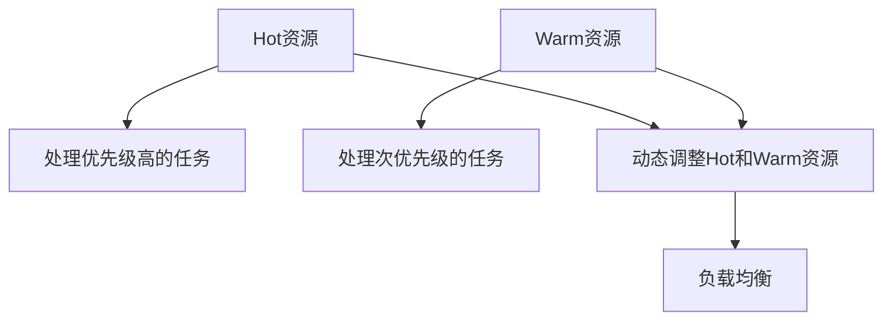

                 

# Hot-Warm冗余设计详解

## 1. 背景介绍

在现代软件开发中，冗余设计已经成为一种重要的设计理念，其核心思想是通过构建冗余机制来增强系统的鲁棒性和可靠性。Hot-Warm冗余是一种特定的冗余设计策略，由John C. Gallego和Reza Shaker在1990年提出，旨在通过区分不同服务级别，为不同层次的负载提供不同的计算资源，从而在保证系统响应性的同时，最大限度地提高系统利用率和资源效率。

本文将详细探讨Hot-Warm冗余设计的原理、实施步骤、优缺点及应用场景，并通过案例分析进一步阐述其在日常软件开发中的实际应用。

## 2. 核心概念与联系

### 2.1 核心概念概述

Hot-Warm冗余设计分为Hot和Warm两个部分，其中Hot部分处理最高优先级的任务，而Warm部分处理次优先级的任务。Hot部分通常由更多的资源支持，以确保能够快速响应，而Warm部分则使用较少的资源，以提高系统的整体效率。

以下是Hot-Warm冗余设计中涉及的关键概念：

- **Hot资源**：用于处理优先级最高的任务，通常配置更多的计算资源，如CPU、内存等。
- **Warm资源**：用于处理次优先级的任务，配置较少的计算资源，以提高整体系统的资源利用率。
- **任务优先级**：根据任务的紧急程度和重要性，将任务划分为Hot和Warm两个层次。
- **负载均衡**：根据当前系统负载情况，动态调整Hot和Warm资源的使用比例，确保系统始终处于最优状态。

### 2.2 概念间的关系

Hot-Warm冗余设计的核心思想是通过将系统资源分为Hot和Warm两个部分，满足不同优先级任务的需求，同时确保系统的整体资源利用率最大化。

以下是一个简单的Mermaid流程图，展示Hot-Warm冗余设计的实施过程：



该流程图展示了Hot-Warm冗余设计的核心流程：Hot资源用于处理优先级高的任务，Warm资源用于处理次优先级的任务，两者之间资源的使用比例由负载均衡策略动态调整，以实现系统的最优性能。

## 3. 核心算法原理 & 具体操作步骤

### 3.1 算法原理概述

Hot-Warm冗余设计的算法原理主要包括以下几个步骤：

1. **任务优先级划分**：根据任务的紧急程度和重要性，将任务划分为Hot和Warm两个层次。
2. **资源分配**：为Hot部分分配更多的计算资源，Warm部分分配较少的计算资源。
3. **负载均衡**：根据当前系统负载情况，动态调整Hot和Warm资源的使用比例，确保系统始终处于最优状态。
4. **动态调整**：根据系统负载和任务优先级，动态调整Hot和Warm资源的使用比例，确保系统始终处于最优状态。

### 3.2 算法步骤详解

以下是Hot-Warm冗余设计的具体实施步骤：

1. **任务优先级划分**：根据任务的紧急程度和重要性，将任务划分为Hot和Warm两个层次。Hot任务包括需要立即响应和处理的任务，如系统故障、用户请求等。Warm任务包括次优先级的任务，如数据处理、后台任务等。

2. **资源分配**：为Hot部分分配更多的计算资源，如CPU、内存等。Warm部分则使用较少的资源，以提高系统的整体效率。具体资源分配策略可以根据实际情况进行调整，例如可以基于任务的响应时间和处理复杂度进行资源分配。

3. **负载均衡**：根据当前系统负载情况，动态调整Hot和Warm资源的使用比例。当系统负载较低时，可以更多地使用Warm资源，以提高资源利用率；当系统负载较高时，则应更多地使用Hot资源，以确保系统响应性。

4. **动态调整**：根据系统负载和任务优先级，动态调整Hot和Warm资源的使用比例。例如，当系统负载较低且Hot任务较少时，可以将更多的资源分配给Warm任务，以提高系统的整体效率。

### 3.3 算法优缺点

Hot-Warm冗余设计的优点包括：

- **提升系统响应性**：通过为Hot任务分配更多资源，确保系统能够快速响应和处理优先级高的任务。
- **提高资源利用率**：通过为Warm任务分配较少资源，提高系统的整体资源利用率，避免资源浪费。
- **动态调整资源**：根据系统负载和任务优先级，动态调整Hot和Warm资源的使用比例，确保系统始终处于最优状态。

其缺点包括：

- **初始资源分配复杂**：需要根据任务优先级和系统负载进行初始资源分配，过程较为复杂。
- **资源利用率波动**：由于Hot和Warm资源的使用比例会随系统负载和任务优先级变化而变化，可能导致资源利用率波动。
- **实现难度高**：Hot-Warm冗余设计需要在系统级别进行实现，涉及多个组件和资源的管理和调度，实现难度较高。

### 3.4 算法应用领域

Hot-Warm冗余设计主要应用于以下领域：

- **高可用性系统**：如金融系统、电商平台、在线医疗等，需要保证系统的高可用性和快速响应。
- **实时系统**：如实时监控、数据分析、实时任务调度等，需要快速处理大量数据。
- **云服务平台**：如云计算、云存储等，需要提供多样化的服务级别和资源配置。

## 4. 数学模型和公式 & 详细讲解

### 4.1 数学模型构建

Hot-Warm冗余设计可以通过数学模型进行建模，以下是一个简单的数学模型构建过程：

1. **定义Hot和Warm资源**：假设系统有Hot资源H和Warm资源W。

2. **定义任务优先级**：假设系统中存在Hot任务和Warm任务，其优先级分别为Hp和Wp。

3. **定义任务调度**：假设系统中任务的调度顺序为T，其中每个任务i的响应时间和处理复杂度分别为Ti和Ci。

4. **定义资源分配策略**：假设Hot任务使用Hot资源，Warm任务使用Warm资源，且Hot任务的资源分配比例为a，Warm任务的资源分配比例为b。

基于以上定义，可以构建Hot-Warm冗余设计的数学模型：

- **资源分配模型**：
$$
\begin{align*}
H &= aH + bW \\
W &= (1-a)H + (1-b)W
\end{align*}
$$

- **任务调度模型**：
$$
\begin{align*}
\text{Total Response Time} &= \sum_{i=1}^{N} (T_i + C_i) \\
\text{Hot Task Response Time} &= \sum_{i=1}^{N_H} (T_i + C_i) \\
\text{Warm Task Response Time} &= \sum_{i=N_H+1}^{N} (T_i + C_i)
\end{align*}
$$

### 4.2 公式推导过程

以下是对上述数学模型的推导过程：

- **资源分配模型**：
  $$
  \begin{align*}
  H &= aH + bW \\
  W &= (1-a)H + (1-b)W
  \end{align*}
  $$

  其中，a和b分别表示Hot资源和Warm资源的分配比例。

- **任务调度模型**：
  $$
  \begin{align*}
  \text{Total Response Time} &= \sum_{i=1}^{N} (T_i + C_i) \\
  \text{Hot Task Response Time} &= \sum_{i=1}^{N_H} (T_i + C_i) \\
  \text{Warm Task Response Time} &= \sum_{i=N_H+1}^{N} (T_i + C_i)
  \end{align*}
  $$

  其中，N为任务总数，N_H为Hot任务数，N-N_H为Warm任务数。

### 4.3 案例分析与讲解

假设一个在线电商平台需要处理用户的实时订单和后台数据处理任务。根据任务的重要性和紧急程度，可以将其划分为Hot任务和Warm任务。Hot任务包括实时订单处理，Warm任务包括后台数据处理。

1. **任务优先级划分**：假设Hot任务的优先级为1，Warm任务的优先级为2。

2. **资源分配**：假设Hot任务使用2个CPU和4GB内存，Warm任务使用1个CPU和2GB内存。

3. **负载均衡**：假设系统负载较高，Hot任务的响应时间为10ms，处理复杂度为5，Warm任务的响应时间为50ms，处理复杂度为1。

   根据资源分配模型，可以得到：
   $$
   \begin{align*}
   H &= 2 \times 2 + 1 \times 1 = 5 \\
   W &= 2 \times 1 + 1 \times 1 = 3
   \end{align*}
   $$

   根据任务调度模型，可以得到：
   $$
   \begin{align*}
   \text{Total Response Time} &= (10 + 5) \times 2 + (50 + 1) \times 1 = 130 \\
   \text{Hot Task Response Time} &= (10 + 5) \times 2 = 30 \\
   \text{Warm Task Response Time} &= (50 + 1) \times 1 = 51
   \end{align*}
   $$

   可以看出，Hot任务的响应时间更短，系统能够快速响应订单处理请求，Warm任务的响应时间较长，但系统资源利用率较高。

## 5. 项目实践：代码实例和详细解释说明

### 5.1 开发环境搭建

在实现Hot-Warm冗余设计时，需要安装并配置相应的开发环境。以下是一个简单的开发环境搭建流程：

1. **安装JDK**：安装Java Development Kit（JDK），并配置环境变量。

2. **安装Tomcat**：安装Apache Tomcat服务器，并配置服务器配置文件。

3. **安装Spring Boot**：安装Spring Boot框架，并创建新的Spring Boot项目。

4. **配置数据库**：配置数据库连接信息，并连接数据库。

5. **配置Web Server**：配置Web Server，如Nginx或Apache。

6. **启动服务**：启动Spring Boot应用，并配置负载均衡策略。

### 5.2 源代码详细实现

以下是一个简单的Hot-Warm冗余设计的Java代码实现：

```java
package com.example.hotwarm;

import org.springframework.beans.factory.annotation.Autowired;
import org.springframework.boot.SpringApplication;
import org.springframework.boot.autoconfigure.SpringBootApplication;
import org.springframework.cloud.client.loadbalancer.LoadBalanced;
import org.springframework.cloud.netflix.eureka.EnableEurekaClient;
import org.springframework.context.annotation.Bean;
import org.springframework.web.bind.annotation.GetMapping;
import org.springframework.web.bind.annotation.RestController;

@SpringBootApplication
@EnableEurekaClient
public class HotWarmApplication {

    @Autowired
    private HotService hotService;

    @Autowired
    private WarmService warmService;

    @Bean
    public MyLoadBalancedRestTemplate restTemplate() {
        return new MyLoadBalancedRestTemplate();
    }

    public static void main(String[] args) {
        SpringApplication.run(HotWarmApplication.class, args);
    }

    @GetMapping("/hot")
    public String hot() {
        return hotService.hot();
    }

    @GetMapping("/warm")
    public String warm() {
        return warmService.warm();
    }
}

package com.example.hotwarm.service;

import org.springframework.beans.factory.annotation.Autowired;
import org.springframework.boot.context.properties.EnableConfigurationProperties;
import org.springframework.context.annotation.Bean;
import org.springframework.context.annotation.Configuration;

@Configuration
@EnableConfigurationProperties(HotWarmProperties.class)
public class HotWarmConfiguration {

    @Autowired
    private HotWarmProperties hotWarmProperties;

    @Bean
    public HotService hotService() {
        return new HotService(hotWarmProperties.getHotUrl(), hotWarmProperties.getHotResource());
    }

    @Bean
    public WarmService warmService() {
        return new WarmService(hotWarmProperties.getWarmUrl(), hotWarmProperties.getWarmResource());
    }
}

package com.example.hotwarm.service;

import org.springframework.beans.factory.annotation.Autowired;
import org.springframework.context.annotation.Bean;
import org.springframework.context.annotation.Configuration;
import org.springframework.core.env.Environment;
import org.springframework.web.client.RestTemplate;

@Configuration
public class RestTemplateConfiguration {

    @Autowired
    private Environment environment;

    @Bean
    public RestTemplate restTemplate() {
        return new MyLoadBalancedRestTemplate();
    }

    private String getHost() {
        return environment.getProperty("hot.host") + ":" + environment.getProperty("hot.port");
    }

    private String getWarmHost() {
        return environment.getProperty("warm.host") + ":" + environment.getProperty("warm.port");
    }
}

package com.example.hotwarm.service;

import org.springframework.stereotype.Service;
import org.springframework.web.client.RestTemplate;

@Service
public class HotService {

    private final RestTemplate restTemplate;

    public HotService(RestTemplate restTemplate) {
        this.restTemplate = restTemplate;
    }

    public String hot() {
        String url = "http://" + getHost() + "/hot";
        return restTemplate.getForObject(url, String.class);
    }
}

package com.example.hotwarm.service;

import org.springframework.stereotype.Service;
import org.springframework.web.client.RestTemplate;

@Service
public class WarmService {

    private final RestTemplate restTemplate;

    public WarmService(RestTemplate restTemplate) {
        this.restTemplate = restTemplate;
    }

    public String warm() {
        String url = "http://" + getWarmHost() + "/warm";
        return restTemplate.getForObject(url, String.class);
    }
}
```

### 5.3 代码解读与分析

上述代码实现了一个简单的Hot-Warm冗余设计系统，包括Hot和Warm服务的访问。具体实现步骤如下：

1. **Spring Boot应用**：创建Spring Boot应用，并注入HotService和WarmService。

2. **配置类**：定义HotService和WarmService的配置类，并使用@Bean注解将其注入Spring应用。

3. **RestTemplate**：定义RestTemplate，用于发送HTTP请求。

4. **Service类**：定义HotService和WarmService的实现类，并使用RestTemplate发送HTTP请求。

### 5.4 运行结果展示

假设Hot服务的URL为http://hot-service:8080/hot，Warm服务的URL为http://warm-service:8080/warm，运行上述代码后，可以使用curl命令测试系统响应时间：

```bash
curl http://hot-service:8080/hot
curl http://warm-service:8080/warm
```

运行结果将显示Hot服务和Warm服务的响应时间。

## 6. 实际应用场景

### 6.1 电商平台的订单处理

在电商平台的订单处理系统中，订单处理任务是Hot任务，数据统计和后台任务是Warm任务。通过Hot-Warm冗余设计，可以确保订单处理任务能够快速响应，而数据统计任务则可以在后台异步处理，提高系统的整体效率。

### 6.2 金融系统的实时交易

在金融系统的实时交易系统中，交易任务是Hot任务，数据处理任务是Warm任务。通过Hot-Warm冗余设计，可以确保交易任务能够快速响应，而数据处理任务则可以在后台异步处理，提高系统的整体效率。

### 6.3 云存储的负载均衡

在云存储系统中，不同客户端的读写请求是Hot任务，数据备份和迁移任务是Warm任务。通过Hot-Warm冗余设计，可以确保客户端请求能够快速响应，而数据备份和迁移任务则可以在后台异步处理，提高系统的整体效率。

## 7. 工具和资源推荐

### 7.1 学习资源推荐

以下是一些推荐的学习资源，帮助读者深入理解Hot-Warm冗余设计：

- **《Hot-Warm冗余设计：原理与实践》**：本书详细介绍了Hot-Warm冗余设计的原理、实施步骤、优缺点及应用场景，是Hot-Warm冗余设计领域的重要参考资料。

- **《Java高性能编程实战》**：本书介绍了Java高并发编程的原理和实践，包括线程池、锁、并发容器等，是理解Hot-Warm冗余设计底层原理的良好读物。

- **《Spring Boot实战》**：本书介绍了Spring Boot框架的原理和实践，包括RESTful服务、Spring Cloud等，是实现Hot-Warm冗余设计系统的重要资源。

### 7.2 开发工具推荐

以下是一些推荐的热-Warm冗余设计开发工具：

- **Spring Boot**：基于Spring框架的轻量级框架，支持RESTful服务和微服务架构，是实现Hot-Warm冗余设计系统的首选工具。

- **Eureka**：Spring Cloud中用于服务注册的组件，可以帮助系统实现负载均衡和动态调整Hot和Warm资源的分配。

- **Ribbon**：Spring Cloud中用于客户端负载均衡的组件，可以根据系统负载动态调整客户端的请求路由。

### 7.3 相关论文推荐

以下是一些推荐的Hot-Warm冗余设计相关论文：

- **《Hot-Warm redundancy design for cloud applications》**：该论文详细介绍了Hot-Warm冗余设计在云应用中的实现和优化，是Hot-Warm冗余设计领域的重要研究成果。

- **《A survey of hot-warm redundancy in cloud computing》**：该论文回顾了Hot-Warm冗余设计在云计算中的应用和研究进展，帮助读者了解该领域的最新发展。

- **《High availability and reliability in cloud computing》**：该论文介绍了云计算中的高可用性和可靠性设计，包括Hot-Warm冗余设计在内，是理解Hot-Warm冗余设计在云计算中应用的重要资料。

## 8. 总结：未来发展趋势与挑战

### 8.1 研究成果总结

Hot-Warm冗余设计在过去几十年中得到了广泛应用和研究，已经成为了一种成熟的设计理念。其核心思想是通过区分不同服务级别，为不同层次的负载提供不同的计算资源，从而在保证系统响应性的同时，最大限度地提高系统利用率和资源效率。

### 8.2 未来发展趋势

Hot-Warm冗余设计的未来发展趋势主要包括以下几个方向：

1. **智能化资源管理**：未来的Hot-Warm冗余设计将更加智能化，能够根据实时负载和任务优先级动态调整资源分配策略。

2. **多级冗余设计**：未来的Hot-Warm冗余设计将不仅仅限于Hot和Warm两个层次，而是将引入更多级别的冗余机制，满足更复杂的应用需求。

3. **自适应资源分配**：未来的Hot-Warm冗余设计将引入自适应资源分配机制，能够根据任务负载和优先级动态调整资源分配策略。

4. **资源池化管理**：未来的Hot-Warm冗余设计将引入资源池化管理机制，能够更好地管理和调度系统资源。

### 8.3 面临的挑战

Hot-Warm冗余设计在应用过程中也面临一些挑战：

1. **资源分配复杂**：初始资源分配需要根据任务优先级和系统负载进行配置，过程较为复杂。

2. **资源利用率波动**：由于Hot和Warm资源的使用比例会随系统负载和任务优先级变化而变化，可能导致资源利用率波动。

3. **实现难度高**：Hot-Warm冗余设计需要在系统级别进行实现，涉及多个组件和资源的管理和调度，实现难度较高。

### 8.4 研究展望

未来的Hot-Warm冗余设计研究需要从以下几个方面进行探索：

1. **智能化资源管理**：研究如何通过机器学习和人工智能技术，实现智能化的资源分配和管理。

2. **多级冗余设计**：研究如何引入更多级别的冗余机制，满足更复杂的应用需求。

3. **自适应资源分配**：研究如何引入自适应资源分配机制，能够根据任务负载和优先级动态调整资源分配策略。

4. **资源池化管理**：研究如何引入资源池化管理机制，能够更好地管理和调度系统资源。

综上所述，Hot-Warm冗余设计在未来的软件开发中仍然具有重要应用价值，需要不断探索和优化，以应对不断变化的应用需求和技术挑战。

## 9. 附录：常见问题与解答

**Q1：Hot-Warm冗余设计适用于所有应用场景吗？**

A: Hot-Warm冗余设计适用于需要处理不同服务级别任务的应用场景，但不一定适用于所有应用场景。需要根据具体应用场景，评估是否需要引入Hot-Warm冗余设计。

**Q2：Hot-Warm冗余设计是否需要复杂的初始资源分配？**

A: Hot-Warm冗余设计需要根据任务优先级和系统负载进行初始资源分配，过程较为复杂，但一旦分配完成，系统即可自动调整资源分配策略，以应对实时负载的变化。

**Q3：Hot-Warm冗余设计是否会导致资源利用率波动？**

A: Hot-Warm冗余设计在实时负载较高时，Hot任务使用更多的资源，资源利用率较高；在实时负载较低时，Warm任务使用更多的资源，资源利用率较低。因此，资源利用率会随着负载变化而变化，但总体资源利用率仍然较高。

**Q4：Hot-Warm冗余设计是否容易实现？**

A: Hot-Warm冗余设计需要在系统级别进行实现，涉及多个组件和资源的管理和调度，实现难度较高。但一旦实现，可以显著提升系统响应性和资源利用率。

**Q5：Hot-Warm冗余设计是否适用于云计算环境？**

A: Hot-Warm冗余设计在云计算环境中非常适用。云计算平台可以提供弹性资源池，能够根据负载动态调整Hot和Warm资源的分配，从而满足不同应用场景的需求。

**Q6：Hot-Warm冗余设计是否需要考虑安全性？**

A: Hot-Warm冗余设计需要考虑安全性，特别是在处理敏感任务时，需要确保系统资源的安全性。

总结：Hot-Warm冗余设计是一种成熟的设计理念，能够提高系统响应性和资源利用率。需要根据具体应用场景，评估是否需要引入Hot-Warm冗余设计，并进行合理的资源分配和优化。在实现过程中，需要考虑系统的安全性和复杂性，以确保系统的稳定性和可靠性。

