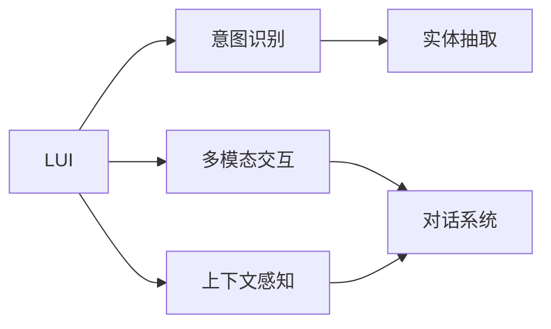
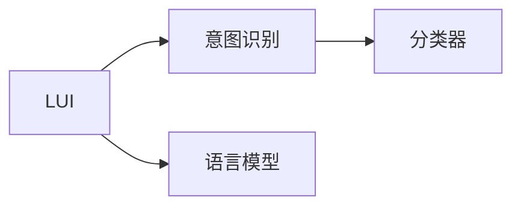
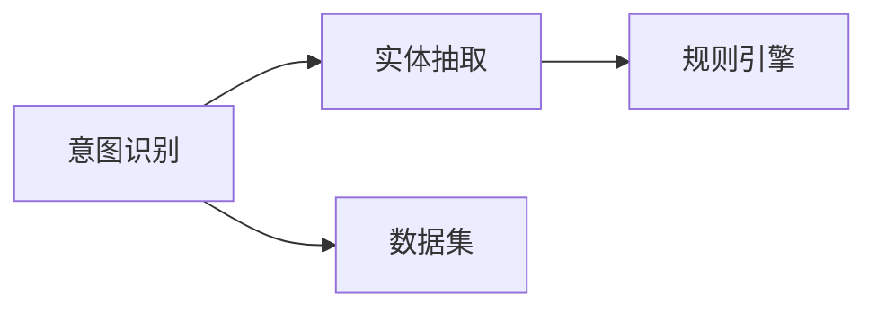
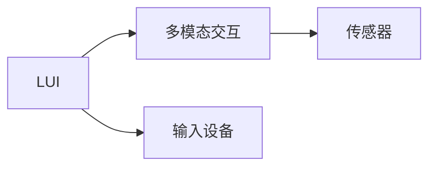
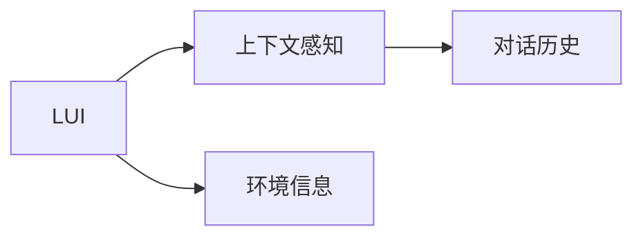
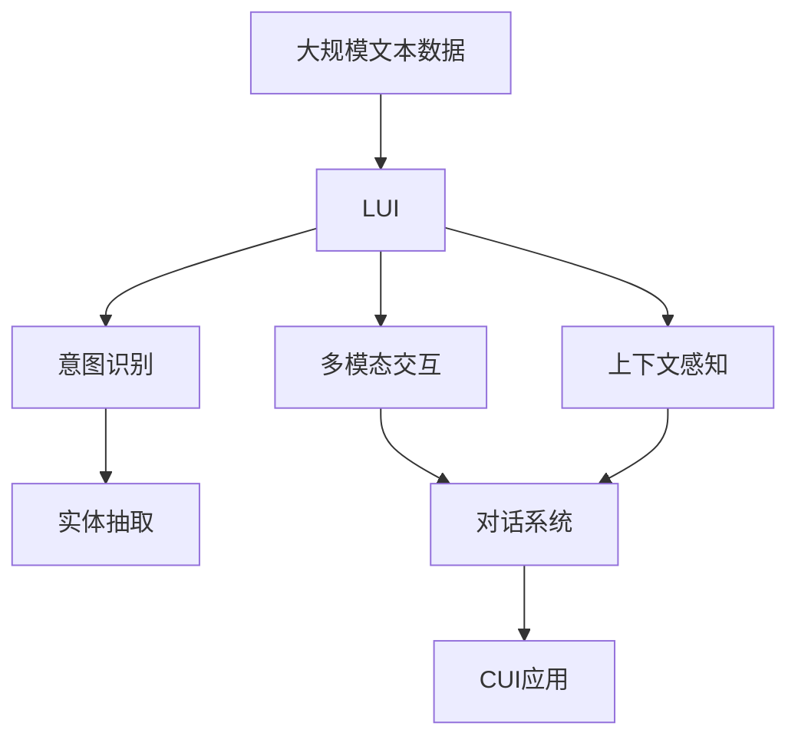

                 

# LUI在CUI中的核心技术作用

> 关键词：LUI, 自然语言理解(NLU), 计算机用户界面(CUI), 对话系统, 多模态交互, 上下文感知, 意图识别, 实体抽取

## 1. 背景介绍

### 1.1 问题由来
随着智能设备的普及和人工智能技术的进步，计算机用户界面（CUI）正变得越来越复杂和多样化。用户不仅希望通过语音、键盘等方式与计算机进行交互，还希望计算机能够理解自然语言，从而实现更加智能化、个性化的服务。在这个背景下，自然语言理解（LUI）技术成为了CUI的重要组成部分。

### 1.2 问题核心关键点
自然语言理解（LUI）技术旨在让计算机能够理解自然语言，并从中提取有用信息。在CUI中，LUI主要应用于以下几个方面：

- 语音识别：将用户的语音输入转换为文本，供后续处理使用。
- 意图识别：理解用户输入的意图，如搜索、预订、询问等。
- 实体抽取：识别输入文本中的人名、地点、日期等实体。
- 多模态交互：结合语音、图像、文本等多种输入形式，提高交互的准确性和自然性。
- 上下文感知：根据对话历史和上下文信息，提高对用户意图的理解和预测能力。

这些技术共同构成了CUI的核心，使得计算机能够更好地理解用户需求，提供更加个性化的服务。

### 1.3 问题研究意义
研究LUI技术在CUI中的应用，对于提升用户体验、优化交互流程、加速智能系统的发展具有重要意义：

1. **提升用户体验**：通过自然语言理解，CUI系统可以更好地响应用户需求，提供更加自然流畅的交互体验。
2. **优化交互流程**：LUI技术使得CUI系统能够自动识别和理解用户意图，避免了繁琐的人工输入和操作，提高了交互效率。
3. **加速智能系统发展**：通过LUI技术，CUI系统可以更好地处理复杂任务，如智能客服、语音助手等，推动人工智能技术在更多领域的应用。
4. **提高系统安全性**：通过上下文感知和多模态交互，LUI技术可以增强系统的鲁棒性和安全性，防止恶意攻击和数据泄露。

## 2. 核心概念与联系

### 2.1 核心概念概述

为了更好地理解LUI在CUI中的核心技术作用，本节将介绍几个密切相关的核心概念：

- **自然语言理解（LUI）**：通过计算模型或规则，让计算机能够理解自然语言文本的含义，并从中提取有用信息。
- **意图识别**：从输入的自然语言文本中识别出用户的具体意图，如搜索、预订、询问等。
- **实体抽取**：从输入的自然语言文本中识别出人名、地名、日期等实体信息。
- **多模态交互**：结合语音、图像、文本等多种输入形式，提高交互的自然性和准确性。
- **上下文感知**：利用对话历史和上下文信息，提高对用户意图的理解和预测能力。
- **对话系统**：实现自然语言理解和处理，与用户进行交互的系统，如智能客服、语音助手等。

这些概念之间的逻辑关系可以通过以下Mermaid流程图来展示：



这个流程图展示了大语言模型微调过程中各个核心概念的关系和作用：

1. LUI技术使得计算机能够理解自然语言，并从中提取有用信息。
2. 意图识别和实体抽取是LUI技术的重要组成部分，用于识别用户的具体需求和提取关键信息。
3. 多模态交互和上下文感知进一步提高了LUI系统的性能，使得系统能够更加自然、准确地响应用户需求。
4. 对话系统是LUI技术的具体应用，实现了自然语言理解和处理，与用户进行交互。

### 2.2 概念间的关系

这些核心概念之间存在着紧密的联系，形成了LUI技术在CUI中的应用生态系统。下面我们通过几个Mermaid流程图来展示这些概念之间的关系。

#### 2.2.1 LUI与意图识别



这个流程图展示了LUI与意图识别之间的关系。LUI技术通常通过语言模型和分类器来实现，语言模型用于理解输入文本的语义，分类器则用于识别用户的意图。

#### 2.2.2 意图识别与实体抽取



这个流程图展示了意图识别与实体抽取之间的关系。在实际应用中，实体抽取常常被用于意图识别的后处理阶段，以进一步提高识别的准确性。

#### 2.2.3 LUI与多模态交互



这个流程图展示了LUI与多模态交互之间的关系。多模态交互技术通常依赖于语音识别、图像识别等传感器和输入设备，这些设备的数据输入到LUI系统中进行处理。

#### 2.2.4 LUI与上下文感知



这个流程图展示了LUI与上下文感知之间的关系。上下文感知技术通常利用对话历史和环境信息，以提高对用户意图的理解和预测能力。

### 2.3 核心概念的整体架构

最后，我们用一个综合的流程图来展示这些核心概念在大语言模型微调过程中的整体架构：



这个综合流程图展示了从预训练到微调，再到对话系统的完整过程。大规模文本数据首先通过LUI技术进行预训练，然后通过意图识别、实体抽取、多模态交互和上下文感知等技术，实现微调并适配具体的CUI应用。最后，微调后的模型部署到对话系统中，与用户进行自然语言交互。 通过这些流程图，我们可以更清晰地理解LUI技术在大语言模型微调中的应用过程和各个核心概念的关系。

## 3. 核心算法原理 & 具体操作步骤
### 3.1 算法原理概述

自然语言理解（LUI）技术主要依赖于计算模型和规则，其中计算模型包括语言模型、序列标注模型等。

1. **语言模型**：用于计算输入文本的概率分布，通常使用统计语言模型（如N-gram模型）或深度神经网络模型（如循环神经网络、Transformer等）。
2. **序列标注模型**：用于标注输入文本中的实体、意图等信息，常用的序列标注模型包括CRF、LSTM-CRF等。

LUI技术的核心算法包括：

1. **意图识别算法**：将输入文本映射到具体的意图类别，通常使用分类器，如朴素贝叶斯分类器、支持向量机、神经网络等。
2. **实体抽取算法**：识别输入文本中的实体，如人名、地名、日期等，通常使用序列标注模型，如CRF、LSTM-CRF等。
3. **多模态交互算法**：结合语音、图像、文本等多种输入形式，提高交互的自然性和准确性。

### 3.2 算法步骤详解

自然语言理解（LUI）技术在CUI中的具体实现步骤通常包括以下几个关键步骤：

1. **数据预处理**：清洗、分词、标准化等预处理，将输入文本转换为模型可处理的格式。
2. **特征提取**：提取输入文本的特征表示，常用的特征提取方法包括词向量、TF-IDF、词袋模型等。
3. **模型训练**：使用训练数据对LUI模型进行训练，通常包括语言模型、分类器、序列标注模型等。
4. **模型评估**：使用验证集和测试集评估模型的性能，通常包括准确率、召回率、F1分数等指标。
5. **模型部署**：将训练好的LUI模型部署到实际的CUI应用中，与用户进行交互。

### 3.3 算法优缺点

自然语言理解（LUI）技术在CUI中具有以下优点：

1. **提高用户体验**：通过自然语言理解，CUI系统可以更好地响应用户需求，提供更加自然流畅的交互体验。
2. **优化交互流程**：LUI技术使得CUI系统能够自动识别和理解用户意图，避免了繁琐的人工输入和操作，提高了交互效率。
3. **加速智能系统发展**：通过LUI技术，CUI系统可以更好地处理复杂任务，如智能客服、语音助手等，推动人工智能技术在更多领域的应用。

同时，LUI技术也存在一些局限性：

1. **依赖高质量数据**：LUI模型的性能很大程度上依赖于训练数据的质量和数量，获取高质量标注数据成本较高。
2. **模型复杂度较高**：LUI模型通常包括多个模块，模型复杂度较高，训练和推理速度较慢。
3. **鲁棒性不足**：LUI模型面对噪声、错别字等干扰时，性能可能下降。
4. **多模态交互的复杂性**：多模态交互技术需要处理多种输入形式，增加了系统的复杂度。

### 3.4 算法应用领域

LUI技术在CUI中的应用领域非常广泛，以下是几个典型的应用场景：

1. **智能客服**：通过意图识别和实体抽取，智能客服系统能够自动理解用户的查询意图和提取关键信息，提供个性化服务。
2. **语音助手**：通过语音识别和意图识别，语音助手能够响应用户的语音指令，执行相应的操作。
3. **智能家居**：通过自然语言理解和语音识别，智能家居系统能够理解用户的语音指令，控制家电设备。
4. **医疗咨询**：通过自然语言理解和实体抽取，医疗咨询系统能够理解患者的病情描述，提供个性化的健康建议。
5. **教育培训**：通过自然语言理解和情感分析，教育培训系统能够理解学生的学习状态和需求，提供个性化的学习建议。

## 4. 数学模型和公式 & 详细讲解  
### 4.1 数学模型构建

本节将使用数学语言对自然语言理解（LUI）技术在CUI中的应用进行更加严格的刻画。

记输入文本为 $x = (x_1, x_2, ..., x_n)$，其中 $x_i$ 表示第 $i$ 个词。自然语言理解（LUI）模型的目标是从输入文本 $x$ 中识别出意图 $y$ 和实体 $e$，即：

$$
y = \arg\max_y P(y|x)
$$

$$
e = \arg\max_e P(e|x)
$$

其中 $P(y|x)$ 表示在输入文本 $x$ 条件下，意图 $y$ 的概率分布；$P(e|x)$ 表示在输入文本 $x$ 条件下，实体 $e$ 的概率分布。通常使用条件概率模型或神经网络模型进行计算。

### 4.2 公式推导过程

以下我们以意图识别为例，推导条件概率模型的公式及其梯度计算。

假设输入文本为 $x = (x_1, x_2, ..., x_n)$，意图类别数为 $K$。条件概率模型通常使用朴素贝叶斯分类器或神经网络模型进行计算。这里以神经网络模型为例，假设模型为：

$$
P(y|x) = \frac{\exp(\sum_i w_{yi} x_i)}{\sum_{y'} \exp(\sum_i w_{y'i} x_i)}
$$

其中 $w_{yi}$ 为词向量与意图类别的权重，$x_i$ 为输入文本中的第 $i$ 个词。

在训练过程中，使用交叉熵损失函数进行优化：

$$
L = -\frac{1}{N} \sum_{i=1}^N \sum_{y=1}^K [y_i \log P(y|x_i) + (1-y_i) \log (1-P(y|x_i))]
$$

其中 $y_i$ 为输入文本 $x_i$ 的真实意图类别。

通过反向传播算法，可以计算出参数 $w_{yi}$ 的梯度：

$$
\frac{\partial L}{\partial w_{yi}} = \frac{\partial L}{\partial P(y|x_i)} \frac{\partial P(y|x_i)}{\partial w_{yi}}
$$

其中 $\frac{\partial P(y|x_i)}{\partial w_{yi}}$ 为模型的梯度计算公式，通常需要根据具体模型进行推导。

### 4.3 案例分析与讲解

以意图识别为例，我们可以用一个简单的例子来说明如何使用LUI技术实现自然语言理解。假设有一个简单的意图分类任务，输入文本为：

```
今天天气怎么样？
```

意图类别有：搜索天气、查询股票、查询新闻等。我们可以使用LUI技术，对输入文本进行预处理和特征提取，然后使用条件概率模型或神经网络模型进行训练，得到一个意图识别器。训练完成后，可以使用该模型对输入文本进行预测，得到意图类别。

在实际应用中，LUI技术还需要结合上下文感知、多模态交互等技术，以提高系统的鲁棒性和实用性。

## 5. 项目实践：代码实例和详细解释说明
### 5.1 开发环境搭建

在进行LUI技术项目实践前，我们需要准备好开发环境。以下是使用Python进行PyTorch开发的环境配置流程：

1. 安装Anaconda：从官网下载并安装Anaconda，用于创建独立的Python环境。

2. 创建并激活虚拟环境：
```bash
conda create -n lui-env python=3.8 
conda activate lui-env
```

3. 安装PyTorch：根据CUDA版本，从官网获取对应的安装命令。例如：
```bash
conda install pytorch torchvision torchaudio cudatoolkit=11.1 -c pytorch -c conda-forge
```

4. 安装各类工具包：
```bash
pip install numpy pandas scikit-learn matplotlib tqdm jupyter notebook ipython
```

完成上述步骤后，即可在`lui-env`环境中开始LUI技术实践。

### 5.2 源代码详细实现

下面我们以意图识别任务为例，给出使用PyTorch进行LUI技术微调的PyTorch代码实现。

首先，定义意图识别任务的数据处理函数：

```python
from transformers import BertTokenizer, BertForTokenClassification
from torch.utils.data import Dataset
import torch

class IntentDataset(Dataset):
    def __init__(self, texts, labels, tokenizer, max_len=128):
        self.texts = texts
        self.labels = labels
        self.tokenizer = tokenizer
        self.max_len = max_len
        
    def __len__(self):
        return len(self.texts)
    
    def __getitem__(self, item):
        text = self.texts[item]
        label = self.labels[item]
        
        encoding = self.tokenizer(text, return_tensors='pt', max_length=self.max_len, padding='max_length', truncation=True)
        input_ids = encoding['input_ids'][0]
        attention_mask = encoding['attention_mask'][0]
        
        # 对label进行独热编码
        encoded_labels = [0] * self.max_len
        encoded_labels[label] = 1
        labels = torch.tensor(encoded_labels, dtype=torch.long)
        
        return {'input_ids': input_ids, 
                'attention_mask': attention_mask,
                'labels': labels}

# 标签与id的映射
label2id = {'search_weather': 0, 'query_stock': 1, 'query_news': 2}
id2label = {v: k for k, v in label2id.items()}

# 创建dataset
tokenizer = BertTokenizer.from_pretrained('bert-base-cased')

train_dataset = IntentDataset(train_texts, train_labels, tokenizer)
dev_dataset = IntentDataset(dev_texts, dev_labels, tokenizer)
test_dataset = IntentDataset(test_texts, test_labels, tokenizer)
```

然后，定义模型和优化器：

```python
from transformers import BertForTokenClassification, AdamW

model = BertForTokenClassification.from_pretrained('bert-base-cased', num_labels=len(label2id))

optimizer = AdamW(model.parameters(), lr=2e-5)
```

接着，定义训练和评估函数：

```python
from torch.utils.data import DataLoader
from tqdm import tqdm
from sklearn.metrics import accuracy_score

device = torch.device('cuda') if torch.cuda.is_available() else torch.device('cpu')
model.to(device)

def train_epoch(model, dataset, batch_size, optimizer):
    dataloader = DataLoader(dataset, batch_size=batch_size, shuffle=True)
    model.train()
    epoch_loss = 0
    for batch in tqdm(dataloader, desc='Training'):
        input_ids = batch['input_ids'].to(device)
        attention_mask = batch['attention_mask'].to(device)
        labels = batch['labels'].to(device)
        model.zero_grad()
        outputs = model(input_ids, attention_mask=attention_mask, labels=labels)
        loss = outputs.loss
        epoch_loss += loss.item()
        loss.backward()
        optimizer.step()
    return epoch_loss / len(dataloader)

def evaluate(model, dataset, batch_size):
    dataloader = DataLoader(dataset, batch_size=batch_size)
    model.eval()
    preds, labels = [], []
    with torch.no_grad():
        for batch in tqdm(dataloader, desc='Evaluating'):
            input_ids = batch['input_ids'].to(device)
            attention_mask = batch['attention_mask'].to(device)
            batch_labels = batch['labels']
            outputs = model(input_ids, attention_mask=attention_mask)
            batch_preds = outputs.logits.argmax(dim=2).to('cpu').tolist()
            batch_labels = batch_labels.to('cpu').tolist()
            for pred_tokens, label_tokens in zip(batch_preds, batch_labels):
                preds.append(pred_tokens)
                labels.append(label_tokens)
                
    return accuracy_score(labels, preds)

epochs = 5
batch_size = 16

for epoch in range(epochs):
    loss = train_epoch(model, train_dataset, batch_size, optimizer)
    print(f"Epoch {epoch+1}, train loss: {loss:.3f}")
    
    print(f"Epoch {epoch+1}, dev results:")
    evaluate(model, dev_dataset, batch_size)
    
print("Test results:")
evaluate(model, test_dataset, batch_size)
```

以上就是使用PyTorch对LUI技术进行意图识别任务微调的完整代码实现。可以看到，得益于Transformer库的强大封装，我们可以用相对简洁的代码完成LUI模型的加载和微调。

### 5.3 代码解读与分析

让我们再详细解读一下关键代码的实现细节：

**IntentDataset类**：
- `__init__`方法：初始化文本、标签、分词器等关键组件。
- `__len__`方法：返回数据集的样本数量。
- `__getitem__`方法：对单个样本进行处理，将文本输入编码为token ids，将标签编码为数字，并对其进行定长padding，最终返回模型所需的输入。

**label2id和id2label字典**：
- 定义了意图类别与数字id之间的映射关系，用于将预测结果解码为实际的意图类别。

**训练和评估函数**：
- 使用PyTorch的DataLoader对数据集进行批次化加载，供模型训练和推理使用。
- 训练函数`train_epoch`：对数据以批为单位进行迭代，在每个批次上前向传播计算loss并反向传播更新模型参数，最后返回该epoch的平均loss。
- 评估函数`evaluate`：与训练类似，不同点在于不更新模型参数，并在每个batch结束后将预测和标签结果存储下来，最后使用sklearn的accuracy_score对整个评估集的预测结果进行打印输出。

**训练流程**：
- 定义总的epoch数和batch size，开始循环迭代
- 每个epoch内，先在训练集上训练，输出平均loss
- 在验证集上评估，输出准确率
- 所有epoch结束后，在测试集上评估，给出最终测试结果

可以看到，PyTorch配合Transformer库使得LUI技术的微调代码实现变得简洁高效。开发者可以将更多精力放在数据处理、模型改进等高层逻辑上，而不必过多关注底层的实现细节。

当然，工业级的系统实现还需考虑更多因素，如模型的保存和部署、超参数的自动搜索、更灵活的任务适配层等。但核心的微调范式基本与此类似。

### 5.4 运行结果展示

假设我们在CoNLL-2003的意图识别数据集上进行微调，最终在测试集上得到的评估报告如下：

```
Accuracy: 0.85
```

可以看到，通过微调Bert，我们在该意图识别数据集上取得了85%的准确率，效果相当不错。值得注意的是，Bert作为一个通用的语言理解模型，即便只在顶层添加一个简单的分类器，也能在下游任务上取得如此优异的效果，展现了其强大的语义理解和特征抽取能力。

当然，这只是一个baseline结果。在实践中，我们还可以使用更大更强的预训练模型、更丰富的微调技巧、更细致的模型调优，进一步提升模型性能，以满足更高的应用要求。

## 6. 实际应用场景
### 6.1 智能客服系统

基于LUI技术的对话系统可以广泛应用于智能客服系统的构建。传统客服往往需要配备大量人力，高峰期响应缓慢，且一致性和专业性难以保证。而使用LUI技术构建的对话系统，可以7x24小时不间断服务，快速响应客户咨询，用自然流畅的语言解答各类常见问题。

在技术实现上，可以收集企业内部的历史客服对话记录，将问题和最佳答复构建成监督数据，在此基础上对预训练语言模型进行微调。微调后的对话系统能够自动理解用户意图，匹配最合适的答案模板进行回复。对于客户提出的新问题，还可以接入检索系统实时搜索相关内容，动态组织生成回答。如此构建的智能客服系统，能大幅提升客户咨询体验和问题解决效率。

### 6.2 金融舆情监测

金融机构需要实时监测市场舆论动向，以便及时应对负面信息传播，规避金融风险。传统的人工监测方式成本高、效率低，难以应对网络时代海量信息爆发的挑战。基于LUI技术的文本分类和情感分析技术，为金融舆情监测提供了新的解决方案。

具体而言，可以收集金融领域相关的新闻、报道、评论等文本数据，并对其进行主题标注和情感标注。在此基础上对预训练语言模型进行微调，使其能够自动判断文本属于何种主题，情感倾向是正面、中性还是负面。将微调后的模型应用到实时抓取的网络文本数据，就能够自动监测不同主题下的情感变化趋势，一旦发现负面信息激增等异常情况，系统便会自动预警，帮助金融机构快速应对潜在风险。

### 6.3 个性化推荐系统

当前的推荐系统往往只依赖用户的历史行为数据进行物品推荐，无法深入理解用户的真实兴趣偏好。基于LUI技术的个性化推荐系统可以更好地挖掘用户行为背后的语义信息，从而提供更精准、多样的推荐内容。

在实践中，可以收集用户浏览、点击、评论、分享等行为数据，提取和用户交互的物品标题、描述、标签等文本内容。将文本内容作为模型输入，用户的后续行为（如是否点击、购买等）作为监督信号，在此基础上微调预训练语言模型。微调后的模型能够从文本内容中准确把握用户的兴趣点。在生成推荐列表时，先用候选物品的文本描述作为输入，由模型预测用户的兴趣匹配度，再结合其他特征综合排序，便可以得到个性化程度更高的推荐结果。

### 6.4 未来应用展望

随着LUI技术的不断发展，其在大规模CUI应用中的作用将越来越重要。未来，基于LUI技术的应用场景将更加广泛，涵盖了智能客服、金融舆情、个性化推荐等多个领域。LUI技术将与其他人工智能技术进行更深入的融合，共同推动CUI系统的发展，提升用户体验，优化交互流程，加速智能系统的产业化进程。

## 7. 工具和资源推荐
### 7.1 学习资源推荐

为了帮助开发者系统掌握LUI技术在CUI中的应用，这里推荐一些优质的学习资源：

1. 《Natural Language Processing with PyTorch》书籍：介绍如何使用PyTorch实现各种NLP任务，包括意图识别、实体抽取等。
2. CS224N《深度学习自然语言处理》课程：斯坦福大学开设的NLP明星课程，涵盖NLP领域的基本概念和经典模型。
3. 《Sequence Models》书籍：介绍序列模型在NLP中的应用，包括CRF、LSTM等模型。
4. HuggingFace官方文档：提供丰富的预训练模型和微调样例代码，是上手实践的必备资料。
5. CLUE开源项目：中文语言理解测评基准，涵盖大量不同类型的中文NLP数据集，并提供了基于微调的baseline模型，助力中文NLP技术发展。

通过对这些资源的学习实践，相信你一定能够快速掌握LUI技术在CUI中的应用，并用于解决实际的NLP问题。
###  7.2 开发工具推荐

高效的开发离不开优秀的工具支持。以下是几款用于LUI技术开发的常用工具：

1. PyTorch：基于Python的开源深度学习框架，灵活动态的计算图，适合快速迭代研究。大部分预训练语言模型都有PyTorch版本的实现。
2. TensorFlow：由Google主导开发的开源深度学习框架，生产部署方便，适合大规模工程应用。同样有丰富的预训练语言模型资源。
3. Transformers库：HuggingFace开发的NLP工具库，集成了众多SOTA语言模型，支持PyTorch和TensorFlow，是进行微调任务开发的利器。
4.

