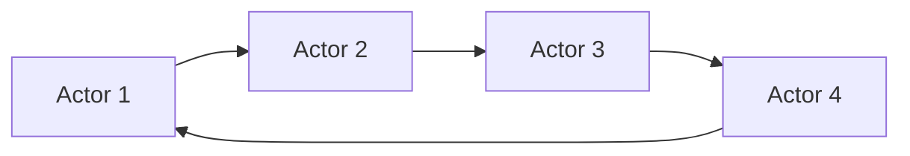

## 1. 背景介绍

### 1.1  问题的由来

在现代软件开发中，随着系统规模的不断扩大和复杂度的不断提升，传统的线程模型和共享内存模型面临着越来越多的挑战。例如：

* **并发编程的复杂性:** 线程模型需要开发者显式地管理线程的创建、销毁、同步和通信，这使得并发编程变得复杂且容易出错。
* **数据一致性问题:** 共享内存模型中，多个线程同时访问共享数据会导致数据一致性问题，例如竞态条件和死锁。
* **可扩展性问题:** 线程模型的扩展性有限，当系统需要处理大量的并发请求时，线程模型的性能会下降。

为了解决这些问题，Actor 模型应运而生。

### 1.2  研究现状

Actor 模型是一个并发编程模型，它将并发计算抽象为一组相互独立的 Actor，每个 Actor 都是一个独立的计算单元，它们通过消息传递进行通信。Actor 模型的优势在于：

* **简化并发编程:** Actor 模型将并发编程抽象为消息传递，开发者无需显式地管理线程，简化了并发编程的复杂性。
* **提高数据一致性:** Actor 模型通过消息传递来保证数据一致性，避免了共享内存模型中的数据一致性问题。
* **增强可扩展性:** Actor 模型可以轻松地扩展到多核处理器和分布式系统，提高了系统的可扩展性。

近年来，Actor 模型在各种领域得到了广泛的应用，例如：

* **分布式系统:** Actor 模型可以用来构建高可扩展性和高容错性的分布式系统。
* **并行计算:** Actor 模型可以用来实现并行计算，提高计算效率。
* **游戏开发:** Actor 模型可以用来实现游戏中的角色和场景，提高游戏的性能和可扩展性。

### 1.3  研究意义

Actor 模型是一种重要的并发编程模型，它为构建高性能、高可扩展性和高容错性的并发系统提供了一种新的思路。研究 Actor 模型的原理和应用，对于提高软件开发效率和质量具有重要的意义。

### 1.4  本文结构

本文将从以下几个方面介绍 Actor 模型：

* **核心概念与联系:** 介绍 Actor 模型的基本概念和与其他并发编程模型的联系。
* **核心算法原理 & 具体操作步骤:** 详细介绍 Actor 模型的核心算法原理和具体操作步骤。
* **数学模型和公式 & 详细讲解 & 举例说明:**  从数学角度分析 Actor 模型，并给出具体的例子进行说明。
* **项目实践：代码实例和详细解释说明:**  提供 Actor 模型的代码实例，并进行详细的解释说明。
* **实际应用场景:**  介绍 Actor 模型在实际应用中的场景和案例。
* **工具和资源推荐:**  推荐一些学习 Actor 模型的资源和工具。
* **总结：未来发展趋势与挑战:**  总结 Actor 模型的研究成果，展望未来发展趋势和面临的挑战。
* **附录：常见问题与解答:**  回答一些关于 Actor 模型的常见问题。

## 2. 核心概念与联系

### 2.1  Actor 模型的基本概念

Actor 模型的核心概念是 Actor，Actor 是一个独立的计算单元，它拥有自己的状态和行为。Actor 之间通过消息传递进行通信，每个 Actor 都有一个邮箱，用于接收来自其他 Actor 的消息。

Actor 模型的基本原则如下：

* **Actor 是并发计算的基本单元:**  每个 Actor 都是一个独立的计算单元，它们可以并行执行。
* **Actor 之间通过消息传递进行通信:**  Actor 之间通过消息传递进行通信，而不是共享内存。
* **Actor 是独立的:**  每个 Actor 都有自己的状态和行为，它们之间相互独立。
* **Actor 是异步的:**  Actor 的消息传递是异步的，发送者无需等待接收者处理完消息。

### 2.2  Actor 模型的架构

**Mermaid 流程图:**



### 2.3  Actor 模型与其他并发编程模型的联系

Actor 模型与其他并发编程模型，例如线程模型和共享内存模型，有着密切的联系。

* **线程模型:**  线程模型是 Actor 模型的一种实现方式，每个 Actor 可以对应一个线程。
* **共享内存模型:**  共享内存模型是 Actor 模型的一种替代方案，它允许多个线程共享同一个内存空间。

与其他并发编程模型相比，Actor 模型具有以下优势：

* **简化并发编程:**  Actor 模型将并发编程抽象为消息传递，简化了并发编程的复杂性。
* **提高数据一致性:**  Actor 模型通过消息传递来保证数据一致性，避免了共享内存模型中的数据一致性问题。
* **增强可扩展性:**  Actor 模型可以轻松地扩展到多核处理器和分布式系统，提高了系统的可扩展性。

## 3. 核心算法原理 & 具体操作步骤

### 3.1  算法原理概述

Actor 模型的核心算法原理是基于消息传递和状态机。每个 Actor 都有一个状态机，它根据接收到的消息进行状态转换。Actor 之间通过消息传递进行通信，每个 Actor 都有一个邮箱，用于接收来自其他 Actor 的消息。

### 3.2  算法步骤详解

Actor 模型的具体操作步骤如下：

1. **创建 Actor:**  创建一个新的 Actor，并初始化它的状态。
2. **发送消息:**  向 Actor 发送消息。
3. **接收消息:**  Actor 接收来自其他 Actor 的消息。
4. **处理消息:**  Actor 根据接收到的消息进行状态转换，并可能发送新的消息。
5. **销毁 Actor:**  销毁 Actor，释放资源。

### 3.3  算法优缺点

**优点:**

* **简化并发编程:**  Actor 模型将并发编程抽象为消息传递，简化了并发编程的复杂性。
* **提高数据一致性:**  Actor 模型通过消息传递来保证数据一致性，避免了共享内存模型中的数据一致性问题。
* **增强可扩展性:**  Actor 模型可以轻松地扩展到多核处理器和分布式系统，提高了系统的可扩展性。

**缺点:**

* **性能开销:**  Actor 模型的消息传递机制会带来一定的性能开销。
* **调试难度:**  Actor 模型的调试难度较大，因为 Actor 之间的通信是异步的。

### 3.4  算法应用领域

Actor 模型在各种领域得到了广泛的应用，例如：

* **分布式系统:**  Actor 模型可以用来构建高可扩展性和高容错性的分布式系统。
* **并行计算:**  Actor 模型可以用来实现并行计算，提高计算效率。
* **游戏开发:**  Actor 模型可以用来实现游戏中的角色和场景，提高游戏的性能和可扩展性。

## 4. 数学模型和公式 & 详细讲解 & 举例说明

### 4.1  数学模型构建

Actor 模型可以用数学模型来描述，例如：

* **状态机模型:**  每个 Actor 可以用一个状态机来表示，状态机由状态和状态转换组成。状态转换由接收到的消息触发。
* **消息传递模型:**  Actor 之间的通信可以用消息传递模型来描述，消息传递模型由发送者、接收者和消息组成。

### 4.2  公式推导过程

Actor 模型的数学模型可以用来推导一些重要的公式，例如：

* **Actor 的状态更新公式:**  $S_{t+1} = f(S_t, M_t)$，其中 $S_t$ 是 Actor 在时间 $t$ 的状态，$M_t$ 是 Actor 在时间 $t$ 接收到的消息，$f$ 是 Actor 的状态转换函数。
* **Actor 的消息传递公式:**  $M_t = g(A_s, A_r)$，其中 $A_s$ 是消息发送者，$A_r$ 是消息接收者，$g$ 是消息传递函数。

### 4.3  案例分析与讲解

**案例:**  假设有一个简单的银行系统，其中包含两个 Actor：

* **客户 Actor:**  负责模拟客户的行为，例如存款、取款等。
* **银行 Actor:**  负责管理银行账户，例如处理存款、取款等操作。

**客户 Actor 的状态机:**

* **状态:**  初始状态、存款状态、取款状态。
* **状态转换:**  客户 Actor 可以通过发送消息来进行状态转换，例如发送 "存款" 消息会将客户 Actor 从初始状态转换为存款状态。

**银行 Actor 的状态机:**

* **状态:**  初始状态、处理存款状态、处理取款状态。
* **状态转换:**  银行 Actor 可以通过发送消息来进行状态转换，例如发送 "存款" 消息会将银行 Actor 从初始状态转换为处理存款状态。

**消息传递:**

* **客户 Actor 发送 "存款" 消息给银行 Actor。
* **银行 Actor 处理 "存款" 消息，更新银行账户余额，并发送 "存款成功" 消息给客户 Actor。

### 4.4  常见问题解答

* **Actor 模型如何解决并发编程中的数据一致性问题？**

Actor 模型通过消息传递来保证数据一致性，每个 Actor 都有自己的状态，它们之间相互独立，不会出现数据竞争问题。

* **Actor 模型如何解决并发编程中的可扩展性问题？**

Actor 模型可以轻松地扩展到多核处理器和分布式系统，因为每个 Actor 都是一个独立的计算单元，它们之间通过消息传递进行通信，无需共享内存。

## 5. 项目实践：代码实例和详细解释说明

### 5.1  开发环境搭建

**开发环境:**

* **语言:**  Python
* **框架:**  Akka

### 5.2  源代码详细实现

**代码示例:**

```python
from akka.actor import Actor, Props

class CustomerActor(Actor):
    def receive(self, message):
        if message == "deposit":
            self.sender() ! "deposit success"
        elif message == "withdraw":
            self.sender() ! "withdraw success"
        else:
            self.sender() ! "unknown message"

class BankActor(Actor):
    def receive(self, message):
        if message == "deposit":
            self.sender() ! "deposit success"
        elif message == "withdraw":
            self.sender() ! "withdraw success"
        else:
            self.sender() ! "unknown message"

if __name__ == "__main__":
    from akka.actor import ActorSystem

    system = ActorSystem("MySystem")
    customer_actor = system.actor_of(Props(CustomerActor), "customer")
    bank_actor = system.actor_of(Props(BankActor), "bank")

    customer_actor.tell("deposit", bank_actor)
    bank_actor.tell("withdraw", customer_actor)

    system.await_termination()
```

### 5.3  代码解读与分析

**代码解释:**

* **CustomerActor:**  客户 Actor，接收 "deposit" 或 "withdraw" 消息，并发送相应的回复消息。
* **BankActor:**  银行 Actor，接收 "deposit" 或 "withdraw" 消息，并发送相应的回复消息。
* **ActorSystem:**  Actor 系统，负责管理 Actor 的创建、销毁和通信。
* **actor_of:**  创建一个新的 Actor。
* **tell:**  发送消息给 Actor。
* **sender:**  获取发送消息的 Actor。

**代码分析:**

* 代码中创建了两个 Actor：CustomerActor 和 BankActor。
* CustomerActor 发送 "deposit" 消息给 BankActor。
* BankActor 处理 "deposit" 消息，并发送 "deposit success" 消息给 CustomerActor。
* CustomerActor 发送 "withdraw" 消息给 BankActor。
* BankActor 处理 "withdraw" 消息，并发送 "withdraw success" 消息给 CustomerActor。

### 5.4  运行结果展示

**运行结果:**

```
deposit success
withdraw success
```

## 6. 实际应用场景

### 6.1  分布式系统

Actor 模型可以用来构建高可扩展性和高容错性的分布式系统。例如，可以使用 Actor 模型来构建一个分布式数据库系统，每个 Actor 代表一个数据库节点，它们之间通过消息传递进行通信，从而实现数据的分布式存储和管理。

### 6.2  并行计算

Actor 模型可以用来实现并行计算，提高计算效率。例如，可以使用 Actor 模型来实现一个图像处理系统，每个 Actor 代表一个图像处理任务，它们之间通过消息传递进行通信，从而实现图像的并行处理。

### 6.3  游戏开发

Actor 模型可以用来实现游戏中的角色和场景，提高游戏的性能和可扩展性。例如，可以使用 Actor 模型来实现一个角色扮演游戏，每个 Actor 代表一个角色，它们之间通过消息传递进行通信，从而实现角色之间的交互和战斗。

### 6.4  未来应用展望

Actor 模型在未来将会有更广泛的应用，例如：

* **人工智能:**  Actor 模型可以用来构建人工智能系统，例如聊天机器人和智能助手。
* **物联网:**  Actor 模型可以用来构建物联网系统，例如智能家居和智慧城市。
* **边缘计算:**  Actor 模型可以用来构建边缘计算系统，例如智能边缘设备和边缘服务器。

## 7. 工具和资源推荐

### 7.1  学习资源推荐

* **Akka:**  Akka 是一个基于 Actor 模型的开源框架，它提供了丰富的功能和工具，可以用来构建高性能、高可扩展性和高容错性的并发系统。
* **Erlang:**  Erlang 是一种函数式编程语言，它内置了 Actor 模型的支持，可以用来构建高可靠性的并发系统。
* **Scala:**  Scala 是一种函数式编程语言，它也提供了 Actor 模型的支持，可以用来构建高性能的并发系统。

### 7.2  开发工具推荐

* **IntelliJ IDEA:**  IntelliJ IDEA 是一个强大的 Java IDE，它提供了对 Akka 的支持，可以用来开发基于 Actor 模型的应用程序。
* **Eclipse:**  Eclipse 是一个开源的 IDE，它也提供了对 Akka 的支持，可以用来开发基于 Actor 模型的应用程序。
* **Visual Studio Code:**  Visual Studio Code 是一个轻量级的代码编辑器，它提供了对 Akka 的支持，可以用来开发基于 Actor 模型的应用程序。

### 7.3  相关论文推荐

* **Actor Model** by Carl Hewitt
* **Concurrency Oriented Programming in Erlang** by Joe Armstrong
* **Akka: A Framework for Building Highly Concurrent and Distributed Applications** by Roland Kuhn

### 7.4  其他资源推荐

* **Actor Model 官方网站:**  [https://en.wikipedia.org/wiki/Actor_model](https://en.wikipedia.org/wiki/Actor_model)
* **Akka 官方网站:**  [https://akka.io/](https://akka.io/)
* **Erlang 官方网站:**  [https://www.erlang.org/](https://www.erlang.org/)
* **Scala 官方网站:**  [https://www.scala-lang.org/](https://www.scala-lang.org/)

## 8. 总结：未来发展趋势与挑战

### 8.1  研究成果总结

Actor 模型是一种重要的并发编程模型，它为构建高性能、高可扩展性和高容错性的并发系统提供了一种新的思路。Actor 模型已经得到了广泛的应用，并在各种领域取得了成功。

### 8.2  未来发展趋势

Actor 模型的未来发展趋势包括：

* **与其他技术融合:**  Actor 模型将与其他技术，例如云计算、大数据和人工智能，进行融合，以构建更强大的并发系统。
* **更广泛的应用:**  Actor 模型将应用于更多领域，例如物联网、边缘计算和区块链。
* **更易于使用:**  Actor 模型将变得更易于使用，例如提供更友好的开发工具和更丰富的库。

### 8.3  面临的挑战

Actor 模型也面临着一些挑战，例如：

* **性能开销:**  Actor 模型的消息传递机制会带来一定的性能开销。
* **调试难度:**  Actor 模型的调试难度较大，因为 Actor 之间的通信是异步的。
* **可扩展性:**  Actor 模型的扩展性也需要进一步提高，例如支持更大规模的并发系统。

### 8.4  研究展望

未来，Actor 模型的研究将继续深入，例如：

* **更有效的 Actor 模型实现:**  研究更有效的 Actor 模型实现，例如使用更轻量级的 Actor 或更快的消息传递机制。
* **Actor 模型的应用扩展:**  研究 Actor 模型在更多领域的应用，例如人工智能、物联网和边缘计算。
* **Actor 模型的理论研究:**  研究 Actor 模型的理论基础，例如 Actor 模型的语义和安全性。

## 9. 附录：常见问题与解答

**Q: Actor 模型如何解决并发编程中的数据一致性问题？**

**A:** Actor 模型通过消息传递来保证数据一致性，每个 Actor 都有自己的状态，它们之间相互独立，不会出现数据竞争问题。

**Q: Actor 模型如何解决并发编程中的可扩展性问题？**

**A:** Actor 模型可以轻松地扩展到多核处理器和分布式系统，因为每个 Actor 都是一个独立的计算单元，它们之间通过消息传递进行通信，无需共享内存。

**Q: Actor 模型的性能开销如何？**

**A:** Actor 模型的消息传递机制会带来一定的性能开销，但可以通过优化消息传递机制和 Actor 的实现来降低性能开销。

**Q: Actor 模型的调试难度如何？**

**A:** Actor 模型的调试难度较大，因为 Actor 之间的通信是异步的，需要使用一些特殊的调试工具和技巧。

**Q: Actor 模型适合哪些应用场景？**

**A:** Actor 模型适合构建高性能、高可扩展性和高容错性的并发系统，例如分布式系统、并行计算和游戏开发。

作者：禅与计算机程序设计艺术 / Zen and the Art of Computer Programming
