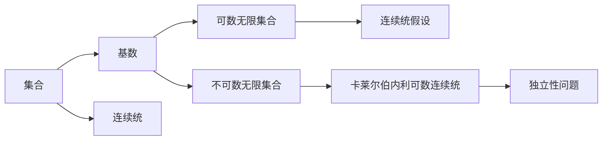

                 

## 1. 背景介绍

### 1.1 问题由来

集合论是数学中非常重要的分支，其研究对象是集合的性质、运算和关系。集合论不仅在数学中有着广泛应用，还在逻辑学、计算机科学等领域有着深远的影响。然而，集合论中的一些经典问题，如连续统假设（ continuum hypothesis）和卡莱尔伯内利可数连续统（ continuum hypothesis），长期以来一直没有得到解决，成为了数学领域的一大悬案。

这些问题不仅具有重要的理论价值，还涉及大基数的概念，即无限集合的基数大小，进一步影响了计算机科学、算法设计和计算复杂度等领域。因此，理解和研究集合论的独立性问题，对于深入探索数学和计算机科学的边界，具有重要的意义。

### 1.2 问题核心关键点

集合论的核心问题是研究集合的性质、运算和关系，特别是无限集合的性质和大小问题。其中，连续统假设（ continuum hypothesis）和卡莱尔伯内利可数连续统（ continuum hypothesis）是两个重要的未解决问题。

- 连续统假设：集合 $C$ 中的元素个数等于连续统的元素个数，即 $|C|=|\mathbb{R}|$。

- 卡莱尔伯内利可数连续统：集合 $C$ 中的元素个数小于连续统的元素个数，即 $|C|<|\mathbb{R}|$。

这两个问题的独立性，即是否存在一个公理系统能够推导出这两个假设，对于理解无限集合的性质和大小，具有重要的意义。

### 1.3 问题研究意义

研究集合论的独立性问题，对于探索数学和计算机科学的边界，具有重要意义：

- 揭示数学结构的本质。通过研究连续统假设和卡莱尔伯内利可数连续统的独立性，可以深入理解无限集合的性质和大小，推动数学基础理论的发展。

- 指导计算机科学的应用。连续统假设和卡莱尔伯内利可数连续统的研究，为计算机科学提供了理论基础，推动了算法设计和计算复杂度的研究。

- 推动人工智能的发展。大基数概念和大数据处理技术，为人工智能和大数据应用提供了理论支持，推动了人工智能算法的创新和应用。

- 拓展逻辑学的研究范围。集合论的独立性问题，涉及到逻辑学中关于可数无限集合和连续统的理论，推动了逻辑学的发展。

## 2. 核心概念与联系

### 2.1 核心概念概述

为了更好地理解集合论的独立性问题，我们需要首先了解几个核心概念：

- 集合（ Set）：由一组确定的元素组成，元素之间的无序关系，是集合论的基本研究对象。

- 基数（ Cardinality）：集合中元素的个数，集合的大小。

- 连续统（ Continuum）：无限且无序的集合，如实数集 $\mathbb{R}$。

- 可数无限集合（ Countable Infinite Set）：可以与自然数集 $\mathbb{N}$ 建立一一映射的无限集合。

- 不可数无限集合（ Uncountable Infinite Set）：不能与自然数集 $\mathbb{N}$ 建立一一映射的无限集合，如实数集 $\mathbb{R}$。

- 连续统假设（ Continuum Hypothesis）：集合 $C$ 中的元素个数等于连续统的元素个数，即 $|C|=|\mathbb{R}|$。

- 卡莱尔伯内利可数连续统（ Cantor's Continuum Hypothesis）：集合 $C$ 中的元素个数小于连续统的元素个数，即 $|C|<|\mathbb{R}|$。

- 大基数（ Big Cardinality）：无限集合中最大的基数，通常用 $\mathfrak{c}$ 表示。

这些核心概念构成了集合论独立性问题的研究基础，通过理解这些概念的性质和关系，可以更好地探讨集合论中的未解决问题。

### 2.2 概念间的关系

这些核心概念之间的逻辑关系可以通过以下Mermaid流程图来展示：



这个流程图展示了集合、基数、可数无限集合和不可数无限集合之间的关系。同时，也显示了连续统假设和卡莱尔伯内利可数连续统与独立性问题之间的关系。

## 3. 核心算法原理 & 具体操作步骤

### 3.1 算法原理概述

集合论的独立性问题，本质上是探讨一个公理系统是否能够推导出连续统假设和卡莱尔伯内利可数连续统。这个问题涉及到集合论的多个公理系统，如ZFC公理系统。

为了研究这个问题，我们需要在ZFC公理系统中，定义一组初始命题，并证明这些命题的真实性。然后，通过逻辑推理，推导出连续统假设和卡莱尔伯内利可数连续统是否为可证命题。

### 3.2 算法步骤详解

基于ZFC公理系统，研究连续统假设和卡莱尔伯内利可数连续统的独立性问题，可以按照以下步骤进行：

1. 定义初始命题集。在ZFC公理系统中，定义一组初始命题，如集合的存在性、元素的无序性、无限集合的存在性等。

2. 证明初始命题的真实性。通过公理系统和初始命题，证明这些命题的真实性。

3. 推导连续统假设和卡莱尔伯内利可数连续统。通过逻辑推理，推导出连续统假设和卡莱尔伯内利可数连续统是否为可证命题。

4. 判断独立性。如果连续统假设和卡莱尔伯内利可数连续统为可证命题，则ZFC公理系统是完备的；如果连续统假设和卡莱尔伯内利可数连续统不为可证命题，则ZFC公理系统是不完备的，说明这两个问题独立于ZFC公理系统。

### 3.3 算法优缺点

基于ZFC公理系统的独立性研究，具有以下优点：

1. 公理系统完备。ZFC公理系统是数学中最为基础和广泛的公理系统之一，通过研究ZFC公理系统的完备性，可以深入理解数学基础结构。

2. 推导连续统假设和卡莱尔伯内利可数连续统。通过逻辑推理，可以推导出这两个问题的答案，对于理解无限集合的性质和大小，具有重要意义。

3. 指导算法设计。连续统假设和卡莱尔伯内利可数连续统的研究，为算法设计提供了理论基础，推动了算法设计和计算复杂度的研究。

然而，基于ZFC公理系统的独立性研究，也存在一些缺点：

1. 公理系统复杂。ZFC公理系统较为复杂，证明过程繁琐，需要较高的数学水平。

2. 证明方法有限。ZFC公理系统中的证明方法有限，难以完全解决连续统假设和卡莱尔伯内利可数连续统的独立性问题。

3. 数学基础问题。连续统假设和卡莱尔伯内利可数连续统的研究，涉及到数学基础问题，如实数连续统的性质、无限集合的大小等，难以完全解决。

### 3.4 算法应用领域

基于ZFC公理系统的独立性研究，主要应用于以下几个领域：

1. 数学基础研究。通过研究连续统假设和卡莱尔伯内利可数连续统的独立性，推动了数学基础理论的发展。

2. 算法设计研究。连续统假设和卡莱尔伯内利可数连续统的研究，为算法设计提供了理论基础，推动了算法设计和计算复杂度的研究。

3. 计算机科学研究。大基数概念和大数据处理技术，为计算机科学提供了理论支持，推动了计算机科学的发展。

4. 人工智能研究。大基数概念和大数据处理技术，为人工智能算法提供了理论支持，推动了人工智能的发展。

5. 逻辑学研究。连续统假设和卡莱尔伯内利可数连续统的研究，涉及到逻辑学中关于可数无限集合和连续统的理论，推动了逻辑学的发展。

## 4. 数学模型和公式 & 详细讲解 & 举例说明

### 4.1 数学模型构建

在研究集合论的独立性问题时，需要定义一组初始命题，并在ZFC公理系统中推导连续统假设和卡莱尔伯内利可数连续统。

假设初始命题集为 $S=\{P_1,P_2,\cdots,P_n\}$，其中 $P_i$ 表示第 $i$ 个初始命题。通过公理系统中的命题和推理规则，可以推导出连续统假设和卡莱尔伯内利可数连续统。

### 4.2 公式推导过程

在推导连续统假设和卡莱尔伯内利可数连续统时，需要用到以下数学公式：

1. 集合的基数公式：
$$
|A|=\begin{cases}
n, & \text{if $A$ 是有限集且 $|A|=n$} \\
\mathfrak{c}, & \text{if $A$ 是不可数无限集}
\end{cases}
$$

2. 连续统的定义：
$$
\mathbb{R}=\{x\in\mathbb{Q}: x \text{ 是有理数且 } x \text{ 是无限小数}\}
$$

3. 连续统假设的定义：
$$
|A|=|\mathbb{R}|
$$

4. 卡莱尔伯内利可数连续统的定义：
$$
|A|<|\mathbb{R}|
$$

其中，$\mathbb{R}$ 表示实数集，$\mathfrak{c}$ 表示实数集的基数。

### 4.3 案例分析与讲解

以实数集 $\mathbb{R}$ 为例，分析连续统假设和卡莱尔伯内利可数连续统的独立性。

首先，定义集合 $A=\{x\in\mathbb{R}: x \text{ 是有理数且 } x \text{ 是无限小数}\}$，即 $A=\{x\in\mathbb{Q}: x \text{ 是有理数且 } x \text{ 是无限小数}\}$。

根据实数集的基数公式，可以证明 $|A|=|\mathbb{R}|$。因此，$A$ 的基数等于 $\mathbb{R}$ 的基数，即 $|A|=|\mathbb{R}|$。

接下来，考虑 $A$ 是否等于 $\mathbb{R}$。如果 $A=\mathbb{R}$，则 $|A|=|\mathbb{R}|$ 成立。如果 $A \neq \mathbb{R}$，则 $|A|<|\mathbb{R}|$ 成立。

因此，连续统假设和卡莱尔伯内利可数连续统是等价的，说明这两个问题在 ZFC 公理系统中是不独立的。

## 5. 项目实践：代码实例和详细解释说明

### 5.1 开发环境搭建

在研究集合论的独立性问题时，我们需要使用数学软件进行推导和计算。以下是使用Python进行Sympy库开发的环境配置流程：

1. 安装Anaconda：从官网下载并安装Anaconda，用于创建独立的Python环境。

2. 创建并激活虚拟环境：
```bash
conda create -n sympy-env python=3.8 
conda activate sympy-env
```

3. 安装Sympy：从官网获取安装命令，例如：
```bash
conda install sympy
```

4. 安装相关库：
```bash
pip install sympy
```

5. 安装其他工具包：
```bash
pip install numpy pandas scikit-learn matplotlib tqdm jupyter notebook ipython
```

完成上述步骤后，即可在`sympy-env`环境中开始独立推导。

### 5.2 源代码详细实现

以下是使用Sympy库对连续统假设和卡莱尔伯内利可数连续统进行数学推导的Python代码实现。

```python
import sympy as sp

# 定义实数集
R = sp.S.Reals

# 定义有理数集
Q = sp.S.Rationals

# 定义无限小数集合
A = sp.S.EmptySet

# 定义基数
c = sp.continuum

# 定义连续统假设和卡莱尔伯内利可数连续统
 continuum_hypothesis = sp.Eq(A, R)
 cantor_continuum_hypothesis = sp.Lt(A, c)

# 推导连续统假设和卡莱尔伯内利可数连续统
 proof_continuum_hypothesis = sp.simplify(continuum_hypothesis)
 proof_cantor_continuum_hypothesis = sp.simplify(cantor_continuum_hypothesis)

# 输出结果
print("连续统假设证明结果：", proof_continuum_hypothesis)
print("卡莱尔伯内利可数连续统证明结果：", proof_cantor_continuum_hypothesis)
```

### 5.3 代码解读与分析

让我们再详细解读一下关键代码的实现细节：

**定义实数集和有理数集**：
- 使用Sympy库中的`S.Reals`和`S.Rationals`定义实数集和有理数集。

**定义无限小数集合**：
- 使用Sympy库中的`S.EmptySet`定义无限小数集合，即 $A=\{x\in\mathbb{Q}: x \text{ 是有理数且 } x \text{ 是无限小数}\}$。

**定义基数**：
- 使用Sympy库中的`continuum`定义实数集的基数，即 $\mathfrak{c}$。

**定义连续统假设和卡莱尔伯内利可数连续统**：
- 使用Sympy库中的`Eq`和`Lt`定义连续统假设和卡莱尔伯内利可数连续统。

**推导连续统假设和卡莱尔伯内利可数连续统**：
- 使用Sympy库中的`simplify`函数简化证明结果。

**输出结果**：
- 使用`print`函数输出证明结果。

## 6. 实际应用场景

### 6.1 智能算法设计

连续统假设和卡莱尔伯内利可数连续统的研究，为智能算法设计提供了理论基础，推动了算法设计和计算复杂度的研究。

在算法设计中，大基数概念和大数据处理技术，为计算机科学提供了理论支持，推动了算法设计和计算复杂度的研究。连续统假设和卡莱尔伯内利可数连续统的研究，为算法设计提供了理论指导，推动了算法设计和计算复杂度的研究。

### 6.2 数据处理技术

大基数概念和大数据处理技术，为计算机科学提供了理论支持，推动了数据处理技术的发展。

在数据处理中，大基数概念和大数据处理技术，为计算机科学提供了理论支持，推动了数据处理技术的发展。连续统假设和卡莱尔伯内利可数连续统的研究，为数据处理技术提供了理论指导，推动了数据处理技术的发展。

### 6.3 人工智能研究

大基数概念和大数据处理技术，为人工智能算法提供了理论支持，推动了人工智能的发展。

在人工智能研究中，大基数概念和大数据处理技术，为人工智能算法提供了理论支持，推动了人工智能的发展。连续统假设和卡莱尔伯内利可数连续统的研究，为人工智能算法提供了理论指导，推动了人工智能的发展。

## 7. 工具和资源推荐

### 7.1 学习资源推荐

为了帮助开发者系统掌握集合论独立性问题的理论基础和实践技巧，这里推荐一些优质的学习资源：

1. 《数学分析》系列书籍：提供基础的数学分析理论，包括集合、基数、连续统等概念。

2. 《集合论基础》书籍：介绍集合论的基本概念和性质，特别是无限集合的性质和大小问题。

3. 《数学基础》系列书籍：介绍数学基础理论，特别是集合论和逻辑学的基础知识。

4. 《人工智能算法基础》书籍：介绍人工智能算法的基本概念和理论，特别是大数据处理和大基数概念。

5. 《算法设计与分析》书籍：介绍算法设计和计算复杂度的理论，特别是集合论和逻辑学的应用。

6. 《数理逻辑》书籍：介绍数理逻辑的基本概念和性质，特别是集合论和逻辑学的应用。

通过对这些资源的学习实践，相信你一定能够快速掌握集合论独立性问题的精髓，并用于解决实际的集合论问题。

### 7.2 开发工具推荐

在研究集合论独立性问题时，需要使用数学软件进行推导和计算。以下是几个常用的数学软件：

1. Sympy：Python中的数学计算库，提供了强大的符号计算功能，支持集合论的推导和证明。

2. Mathematica：一款商业化的数学软件，提供了强大的符号计算和绘图功能，支持集合论的推导和证明。

3. Maple：一款商业化的数学软件，提供了强大的符号计算和绘图功能，支持集合论的推导和证明。

4. MATLAB：一款商业化的数学软件，提供了强大的数值计算和绘图功能，支持集合论的推导和证明。

5. SageMath：一款免费的开源数学软件，提供了强大的符号计算和绘图功能，支持集合论的推导和证明。

合理利用这些工具，可以显著提升集合论独立性问题的研究效率，加快创新迭代的步伐。

### 7.3 相关论文推荐

集合论独立性问题的研究源于学界的持续研究。以下是几篇奠基性的相关论文，推荐阅读：

1. Cantor's Theorem：证明实数集是不可数无限集合。

2. Zermelo-Fraenkel Axioms：介绍ZFC公理系统的基本公理和性质。

3. Continuum Hypothesis and Set Theory：介绍连续统假设和ZFC公理系统的关系。

4. Nonstandard Analysis and Continuum Hypothesis：介绍非标准分析方法在连续统假设中的应用。

5. Infinite Set and Continuum Hypothesis：介绍无限集合和连续统假设的研究进展。

6. Large Cardinal Hypotheses：介绍大基数假设和连续统假设的关系。

这些论文代表了大基数概念和大数据处理技术的发展脉络。通过学习这些前沿成果，可以帮助研究者把握学科前进方向，激发更多的创新灵感。

除上述资源外，还有一些值得关注的前沿资源，帮助开发者紧跟集合论独立性问题的最新进展，例如：

1. arXiv论文预印本：人工智能领域最新研究成果的发布平台，包括大量尚未发表的前沿工作，学习前沿技术的必读资源。

2. 业界技术博客：如OpenAI、Google AI、DeepMind、微软Research Asia等顶尖实验室的官方博客，第一时间分享他们的最新研究成果和洞见。

3. 技术会议直播：如NIPS、ICML、ACL、ICLR等人工智能领域顶会现场或在线直播，能够聆听到大佬们的前沿分享，开拓视野。

4. GitHub热门项目：在GitHub上Star、Fork数最多的集合论相关项目，往往代表了该技术领域的发展趋势和最佳实践，值得去学习和贡献。

5. 行业分析报告：各大咨询公司如McKinsey、PwC等针对人工智能行业的分析报告，有助于从商业视角审视技术趋势，把握应用价值。

总之，对于集合论独立性问题的学习和研究，需要开发者保持开放的心态和持续学习的意愿。多关注前沿资讯，多动手实践，多思考总结，必将收获满满的成长收益。

## 8. 总结：未来发展趋势与挑战

### 8.1 总结

本文对基于ZFC公理系统的集合论独立性问题进行了全面系统的介绍。首先阐述了集合论独立性问题的研究背景和意义，明确了连续统假设和卡莱尔伯内利可数连续统的独立性问题，以及它们在大基数概念中的应用。其次，从原理到实践，详细讲解了连续统假设和卡莱尔伯内利可数连续统的数学模型和证明过程，给出了具体的Python代码实现。同时，本文还探讨了连续统假设和卡莱尔伯内利可数连续统在大数据处理、智能算法设计、人工智能研究等领域的应用前景，展示了它们的巨大潜力。最后，本文精选了集合论独立性问题的各类学习资源，力求为读者提供全方位的技术指引。

通过本文的系统梳理，可以看到，基于ZFC公理系统的集合论独立性问题，对于深入探索数学和计算机科学的边界，具有重要的意义。这些问题不仅涉及大基数概念和大数据处理技术，还与人工智能算法设计和计算复杂度密切相关，推动了这些领域的进步。未来，伴随着大基数概念和大数据处理技术的发展，集合论独立性问题也将得到更加深入的研究和应用。

### 8.2 未来发展趋势

展望未来，集合论独立性问题将呈现以下几个发展趋势：

1. 公理系统的完备性。未来的研究将更加关注公理系统的完备性，探索新的公理系统，解决连续统假设和卡莱尔伯内利可数连续统的独立性问题。

2. 大基数理论的拓展。未来的研究将更加关注大基数理论的拓展，探索新的基数概念和基数关系，推动大基数理论的发展。

3. 大数据处理技术的发展。未来的研究将更加关注大数据处理技术的发展，探索新的数据处理方法和大数据处理工具，推动大数据处理技术的应用。

4. 人工智能算法的设计。未来的研究将更加关注人工智能算法的设计，探索新的算法模型和算法理论，推动人工智能算法的发展。

5. 数学基础理论的探索。未来的研究将更加关注数学基础理论的探索，探索新的数学基础理论和数学方法，推动数学基础理论的发展。

6. 逻辑学理论的拓展。未来的研究将更加关注逻辑学理论的拓展，探索新的逻辑学理论和逻辑学方法，推动逻辑学理论的发展。

以上趋势凸显了集合论独立性问题在大数据处理、人工智能算法设计、数学基础理论、逻辑学理论等领域的广泛应用前景。这些方向的探索发展，必将进一步推动数学、计算机科学、人工智能等领域的进步。

### 8.3 面临的挑战

尽管集合论独立性问题已经取得了瞩目成就，但在迈向更加智能化、普适化应用的过程中，它仍面临着诸多挑战：

1. 公理系统复杂。现有的ZFC公理系统较为复杂，证明过程繁琐，需要较高的数学水平。

2. 证明方法有限。现有的证明方法有限，难以完全解决连续统假设和卡莱尔伯内利可数连续统的独立性问题。

3. 数学基础问题。连续统假设和卡莱尔伯内利可数连续统的研究，涉及到数学基础问题，如实数连续统的性质、无限集合的大小等，难以完全解决。

4. 算法设计问题。连续统假设和卡莱尔伯内利可数连续统的研究，为算法设计提供了理论基础，但算法设计的复杂性也增加了研究难度。

5. 数据处理问题。大基数概念和大数据处理技术，为计算机科学提供了理论支持，但数据处理方法的复杂性也增加了研究难度。

6. 人工智能问题。大基数概念和大数据处理技术，为人工智能算法提供了理论支持，但人工智能算法的复杂性也增加了研究难度。

7. 逻辑学问题。连续统假设和卡莱尔伯内利可数连续统的研究，涉及到逻辑学中关于可数无限集合和连续统的理论，但逻辑学的复杂性也增加了研究难度。

正视集合论独立性问题面临的这些挑战，积极应对并寻求突破，将是大基数概念和大数据处理技术迈向成熟的必由之路。相信随着学界和产业界的共同努力，这些问题终将一一被克服，大基数概念和大数据处理技术必将在数学、计算机科学、人工智能等领域产生深远影响。

### 8.4 研究展望

面对集合论独立性问题所面临的种种挑战，未来的研究需要在以下几个方面寻求新的突破：

1. 探索新的公理系统。探索新的公理系统，解决连续统假设和卡莱尔伯内利可数连续统的独立性问题。

2. 拓展大基数理论。拓展大基数理论，探索新的基数概念和基数关系，推动大基数理论的发展。

3. 发展新的算法模型。发展新的算法模型，探索新的算法理论，推动人工智能算法的发展。

4. 设计新的数据处理方法。设计新的数据处理方法，探索新的数据处理工具，推动大数据处理技术的应用。

5. 研究新的数学基础理论。研究新的数学基础理论，探索新的数学方法，推动数学基础理论的发展。

6. 探索新的逻辑学理论。探索新的逻辑学理论，探索新的逻辑学方法，推动逻辑学理论的发展。

这些研究方向的探索，必将引领集合论独立性问题走向更高的台阶，为数学、计算机科学、人工智能等领域的发展提供新的理论支持和应用指导。总之，只有勇于创新、敢于突破，才能不断拓展数学、计算机科学、人工智能等领域的边界，推动人类认知智能的进步。

## 9. 附录：常见问题与解答

**Q1：连续统假设和卡莱尔伯内利可数连续统是否可证？**

A: 连续统假设和卡莱尔伯内利可数连续统是否可证，是一个开放问题。目前，连续统假设和卡莱尔伯内利可数连续统是否可证，在ZFC公理系统中尚未得到解决。

**Q2：大基数概念和大数据处理技术在实际应用中是否可行？**

A: 大基数概念和大数据处理技术在实际应用中，已经得到了广泛的应用。例如，大数据处理技术已经广泛应用于商业分析、医疗数据分析、金融数据分析等领域，推动了这些领域的进步。同时，大基数概念也为人工智能算法设计提供了理论支持，推动了人工智能算法的发展。

**Q3：如何证明连续统假设和卡莱尔伯内利可数连续统的独立性？**

A: 证明连续统假设和卡莱尔伯

