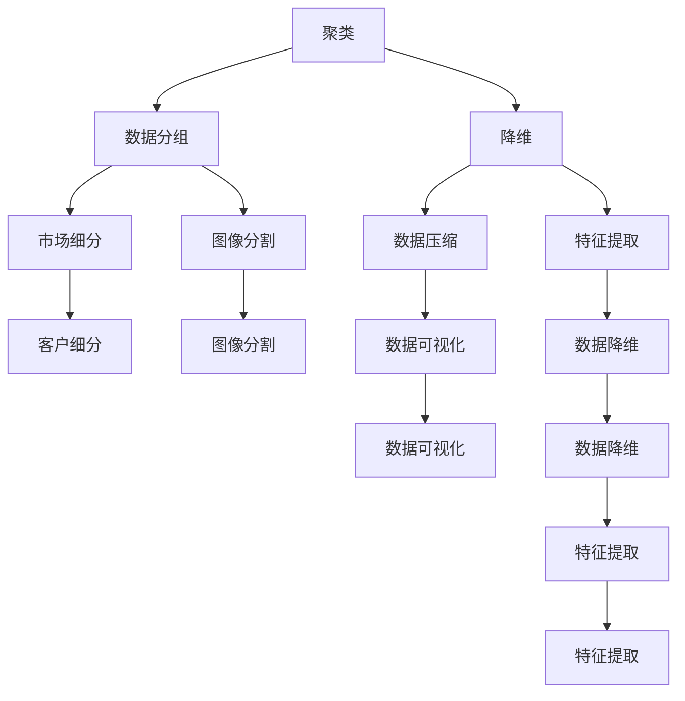
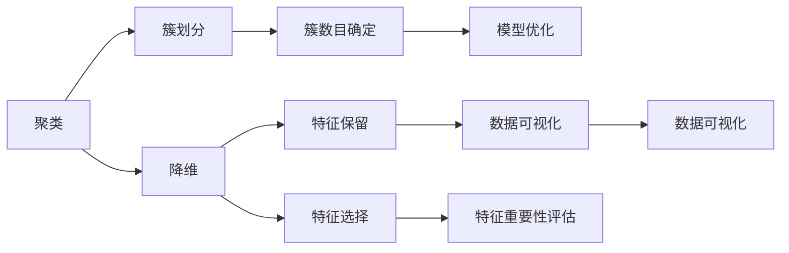
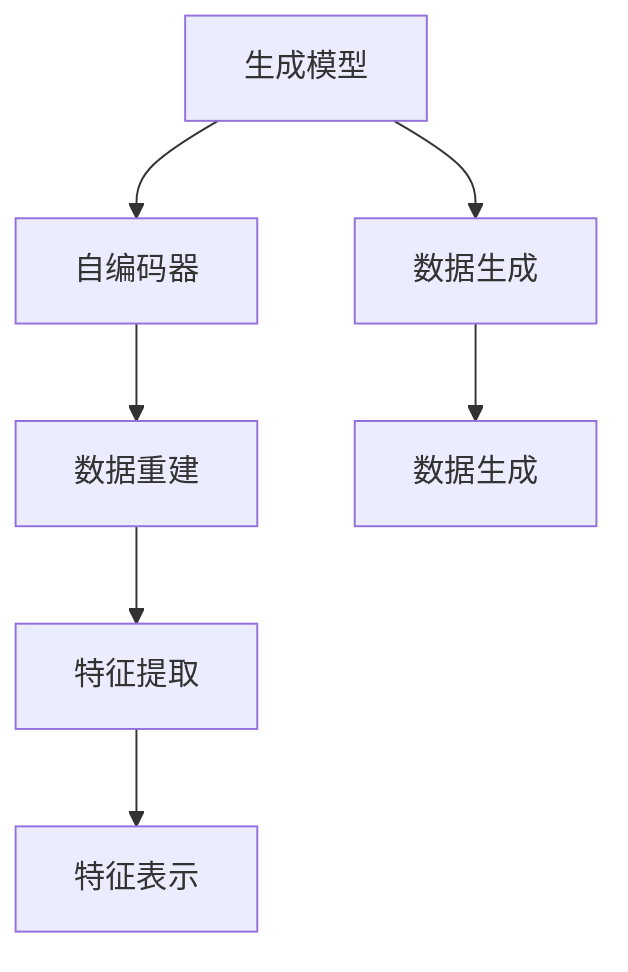
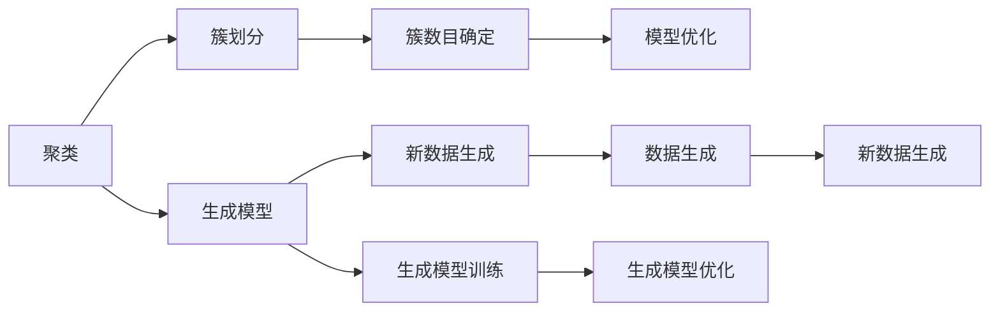
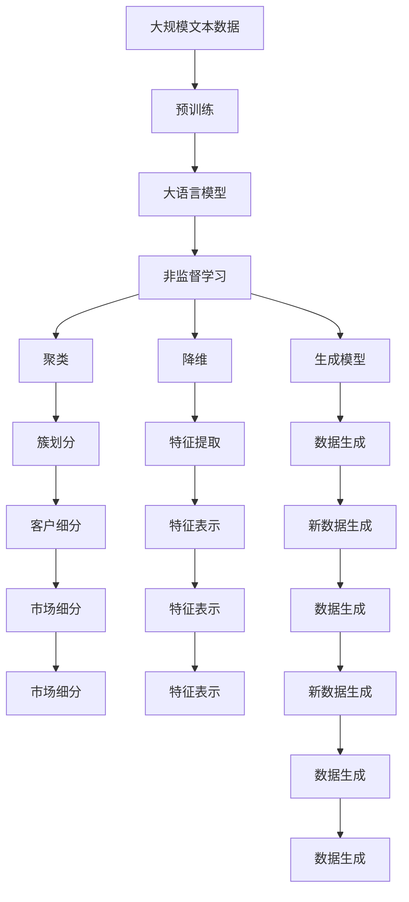

                 

## 1. 背景介绍

### 1.1 问题由来

非监督学习(Unsupervised Learning)作为机器学习的重要分支，与有监督学习(Supervised Learning)和强化学习(Reinforcement Learning)并称为三大类学习范式。相较于有监督学习需要大量标注数据，非监督学习更强调从数据中自我发现结构、规律和模式。近年来，非监督学习在图像识别、自然语言处理、推荐系统、数据降维等多个领域取得了突破性进展，成为人工智能技术中不可或缺的重要组成部分。

### 1.2 问题核心关键点

非监督学习的主要任务包括：聚类、降维、生成模型等。其核心在于如何让模型从无标注数据中提取有效信息，并用于后续的预测、分类、降维等任务。常见的非监督学习方法包括K-means、PCA、GMM、GAN等。

非监督学习方法的核心思想是：通过对数据进行分析，发现隐藏在数据中的模式和结构，从而揭示数据的内在规律。非监督学习可以分为：

1. 聚类(Clustering)：将相似的数据点分组，形成簇。
2. 降维(Dimensionality Reduction)：减少数据维度，保留数据的主要特征。
3. 生成模型(Generative Model)：生成新的数据样本，或重建原始数据。

非监督学习在实际应用中，不仅可以处理大量的无标注数据，而且能够发现复杂数据结构，具有更强的泛化能力。在推荐系统、数据挖掘、图像识别、自然语言处理等领域，非监督学习正逐渐成为主流方法，发挥着重要的作用。

### 1.3 问题研究意义

研究非监督学习的方法，对于拓展机器学习的应用范围，提升数据处理能力，加速人工智能技术的产业化进程，具有重要意义：

1. 降低标注成本：非监督学习不需要标注数据，大大降低了数据标注的时间和成本。
2. 提升模型效果：通过无标注数据训练的模型，通常具有更强的泛化能力，能够处理未见过的数据。
3. 提高效率：非监督学习在训练和推理时无需迭代标注数据，可以更快地得到模型结果。
4. 促进创新：非监督学习方法催生了如GAN、VAE等新颖模型，为机器学习领域带来新的研究思路和方向。
5. 赋能产业升级：非监督学习技术广泛应用于推荐系统、搜索排序、智能推荐等场景，加速各行各业的智能化升级。

## 2. 核心概念与联系

### 2.1 核心概念概述

为了更好地理解非监督学习的方法，本节将介绍几个密切相关的核心概念：

- 聚类(Clustering)：将数据点分为多个相似群组的过程，常用于市场细分、图像分割等场景。
- 降维(Dimensionality Reduction)：减少数据维度，保留主要特征，常用于数据可视化、数据压缩等场景。
- 生成模型(Generative Model)：学习数据的概率分布，用于生成新数据，常用于图像生成、文本生成等场景。
- 自编码器(Autocoder)：一类特殊的生成模型，用于重建输入数据，常用于数据降维、特征提取等场景。
- 数据流形(Data Manifold)：高维数据映射到低维空间的过程，常用于数据可视化、降维等场景。
- 隐含分布(Hidden Distribution)：数据内在的概率分布，常用于生成模型和聚类等场景。

这些核心概念之间的逻辑关系可以通过以下Mermaid流程图来展示：



这个流程图展示了非监督学习中几个核心概念之间的关系：

1. 聚类：将数据分组，形成相似的簇。
2. 降维：减少数据维度，保留主要特征。
3. 生成模型：学习数据的概率分布，生成新数据。
4. 自编码器：用于重建输入数据的生成模型。
5. 数据流形：高维数据映射到低维空间。
6. 隐含分布：数据内在的概率分布。

这些核心概念共同构成了非监督学习的完整生态系统，使其能够在各种场景下发挥强大的数据处理能力。通过理解这些核心概念，我们可以更好地把握非监督学习的原理和应用方向。

### 2.2 概念间的关系

这些核心概念之间存在着紧密的联系，形成了非监督学习的完整框架。下面我们通过几个Mermaid流程图来展示这些概念之间的关系。

#### 2.2.1 聚类与降维的关系



这个流程图展示了聚类和降维之间的联系：

1. 聚类将数据分为多个簇，每个簇内的数据点相似度高。
2. 降维通过选择重要特征，保留数据的主要信息，进一步压缩数据维度。
3. 降维后的数据更易于可视化，有助于更好地理解聚类结果。

#### 2.2.2 生成模型与自编码器之间的关系



这个流程图展示了生成模型与自编码器之间的联系：

1. 生成模型学习数据的概率分布，用于生成新数据。
2. 自编码器通过编码-解码过程，重建输入数据，用于特征提取和数据降维。
3. 自编码器生成的特征表示可以用于生成模型，进一步生成新数据。

#### 2.2.3 聚类与生成模型的关系



这个流程图展示了聚类与生成模型之间的联系：

1. 聚类将数据分为多个簇，生成模型学习每个簇的分布，生成新数据。
2. 生成模型可以生成新数据，用于聚类过程，形成闭环反馈机制。
3. 聚类结果和生成模型参数可以相互优化，提升整体效果。

### 2.3 核心概念的整体架构

最后，我们用一个综合的流程图来展示这些核心概念在大语言模型微调过程中的整体架构：



这个综合流程图展示了从预训练到非监督学习的完整过程。大语言模型首先在大规模文本数据上进行预训练，然后通过聚类、降维、生成模型等非监督学习方法，得到结构化和压缩后的数据表示。最后，非监督学习的结果可以用于后续的有监督学习或直接部署应用，形成完整的机器学习流程。

## 3. 核心算法原理 & 具体操作步骤
### 3.1 算法原理概述

非监督学习的核心思想是通过对数据进行分析，发现隐藏在数据中的模式和结构，从而揭示数据的内在规律。其核心算法包括K-means、PCA、GMM、GAN等。

以下以K-means聚类算法为例，介绍非监督学习的核心算法原理：

K-means算法是一种经典的聚类算法，其主要思想是将数据点分为K个簇，每个簇包含相似的样本点。算法步骤如下：

1. 随机选择K个中心点，初始化K个簇。
2. 将每个数据点分配到距离最近的中心点所在的簇。
3. 计算每个簇的质心（即簇内数据点的均值）。
4. 更新中心点为簇内数据的均值。
5. 重复步骤2-4，直到中心点不再变化。

K-means算法在图像分割、市场细分、社交网络分析等领域有广泛应用。其核心在于通过迭代更新中心点，不断优化簇的划分，使得簇内数据点尽量相似，簇间数据点尽量不相似。

### 3.2 算法步骤详解

K-means算法的具体步骤如下：

**Step 1: 初始化聚类中心点**

选择一个随机位置作为初始的聚类中心点，通常选择K个不同的点。例如，对于二维数据集，可以使用随机采样选择K个点作为初始中心点。

**Step 2: 数据分配**

计算每个数据点与K个中心点之间的距离（如欧几里得距离），将数据点分配到距离最近的中心点所在的簇。如果数据点与某个簇的中心点距离相等，可以随机分配到一个簇。

**Step 3: 簇中心点更新**

计算每个簇内数据点的均值，作为新的簇中心点。

**Step 4: 迭代更新**

重复执行步骤2和步骤3，直到中心点不再发生变化，或达到预设的迭代次数。

K-means算法的伪代码如下所示：

```python
def kmeans(data, k):
    # 初始化中心点
    centroids = random.sample(data, k)
    
    # 迭代更新
    while True:
        # 分配数据点
        clusters = assign_points_to_clusters(data, centroids)
        
        # 更新中心点
        new_centroids = update_centroids(clusters)
        
        # 检查是否收敛
        if new_centroids == centroids:
            break
        
        # 更新中心点
        centroids = new_centroids
    
    return clusters, centroids
```

### 3.3 算法优缺点

K-means算法具有以下优点：

1. 简单高效：算法实现简单，计算复杂度较低，适合大规模数据集。
2. 可解释性强：聚类结果直观，易于理解和解释。
3. 易于扩展：可以处理高维数据，不需要复杂的前处理步骤。

同时，K-means算法也存在一些缺点：

1. 对初始点敏感：不同的初始点可能导致不同的聚类结果，影响聚类效果。
2. 需要预先指定簇数目：需要手动指定簇的数目，难以自动选择最优的K值。
3. 对异常值敏感：存在异常值的数据点可能会影响聚类结果。
4. 聚类效果受数据分布影响：对于非凸或不对称分布的数据集，聚类效果可能不理想。

### 3.4 算法应用领域

K-means聚类算法在实际应用中，可以应用于以下几个领域：

1. 市场细分：根据客户购买行为，将客户分为不同的群体。
2. 图像分割：将图像中的像素点分为不同的区域。
3. 社交网络分析：将社交网络中的用户分为不同的社区。
4. 数据压缩：通过降维，减少数据集的维度。
5. 推荐系统：根据用户行为数据，将用户分为不同的兴趣群体，进行个性化推荐。

除了K-means算法，非监督学习还涉及PCA降维、GMM生成模型、GAN生成模型等方法。这些方法在不同的应用场景中具有独特的优势，能够应对复杂多样的数据处理需求。

## 4. 数学模型和公式 & 详细讲解 & 举例说明

### 4.1 数学模型构建

K-means算法的数学模型可以定义为：

$$
\min_{\mu_i, \Gamma_i} \sum_{x \in \Gamma_i} \| x - \mu_i \|^2 \quad \text{subject to} \quad \sum_{i=1}^K \Gamma_i = X, \quad \mu_i \in \mathbb{R}^d, \quad x \in \mathbb{R}^d
$$

其中，$X$ 为数据集，$\Gamma_i$ 为第 $i$ 个簇，$\mu_i$ 为簇中心点，$d$ 为数据维度。

目标是最小化每个簇内数据点与中心点之间的平方距离之和，即最小化损失函数：

$$
L(\Gamma, \mu) = \sum_{i=1}^K \sum_{x \in \Gamma_i} \| x - \mu_i \|^2
$$

### 4.2 公式推导过程

K-means算法的核心在于迭代更新中心点，使得每个簇内数据点的平方距离之和最小化。其推导过程如下：

**Step 1: 簇中心点初始化**

选择一个随机位置作为初始的聚类中心点，通常选择K个不同的点。例如，对于二维数据集，可以使用随机采样选择K个点作为初始中心点。

**Step 2: 数据分配**

计算每个数据点与K个中心点之间的距离（如欧几里得距离），将数据点分配到距离最近的中心点所在的簇。如果数据点与某个簇的中心点距离相等，可以随机分配到一个簇。

**Step 3: 簇中心点更新**

计算每个簇内数据点的均值，作为新的簇中心点。

**Step 4: 迭代更新**

重复执行步骤2和步骤3，直到中心点不再发生变化，或达到预设的迭代次数。

### 4.3 案例分析与讲解

以K-means算法在二维空间中的应用为例，假设有一组二维数据集：

```
(0.3, 0.5), (1.1, 0.9), (1.8, 1.3), (3.2, 1.5), (3.8, 0.7), (2.1, 0.9)
```

我们将使用K-means算法将其分为两个簇。具体步骤如下：

1. 随机选择两个点作为初始中心点，例如(1.1, 0.9)和(3.2, 1.5)。
2. 计算每个数据点与两个中心点之间的距离，分配数据点。例如，点(0.3, 0.5)距离点(1.1, 0.9)更近，分配到第一个簇，点(3.8, 0.7)距离点(3.2, 1.5)更近，分配到第二个簇。
3. 计算每个簇的质心，更新中心点。第一个簇的质心为(0.8, 1.1)，第二个簇的质心为(2.8, 1.25)。
4. 重复步骤2和步骤3，直到中心点不再变化。经过多次迭代，可以得到如下结果：

```
簇1: (0.3, 0.5), (1.1, 0.9), (3.2, 1.5)
簇2: (1.8, 1.3), (3.8, 0.7), (2.1, 0.9)
```

通过K-means算法，我们可以清晰地将数据集分为两个簇，并得到每个簇的中心点，从而更好地理解数据的结构。

## 5. 项目实践：代码实例和详细解释说明

### 5.1 开发环境搭建

在进行K-means算法实践前，我们需要准备好开发环境。以下是使用Python进行scikit-learn开发的环境配置流程：

1. 安装Anaconda：从官网下载并安装Anaconda，用于创建独立的Python环境。

2. 创建并激活虚拟环境：
```bash
conda create -n scikit-learn-env python=3.8 
conda activate scikit-learn-env
```

3. 安装scikit-learn：
```bash
pip install scikit-learn
```

4. 安装numpy、matplotlib等工具包：
```bash
pip install numpy matplotlib pandas sklearn tqdm
```

完成上述步骤后，即可在`scikit-learn-env`环境中开始K-means算法的实践。

### 5.2 源代码详细实现

下面我们以二维数据集为例，使用scikit-learn库实现K-means算法，并详细解释代码实现过程。

```python
from sklearn.cluster import KMeans
import numpy as np
import matplotlib.pyplot as plt

# 生成二维数据集
data = np.array([[0.3, 0.5], [1.1, 0.9], [1.8, 1.3], [3.2, 1.5], [3.8, 0.7], [2.1, 0.9]])

# 创建KMeans模型
kmeans = KMeans(n_clusters=2, init='random', max_iter=100)

# 训练模型
kmeans.fit(data)

# 输出聚类结果
labels = kmeans.labels_
centers = kmeans.cluster_centers_

# 可视化聚类结果
plt.scatter(data[:, 0], data[:, 1], c=labels)
plt.scatter(centers[:, 0], centers[:, 1], marker='X', color='r')
plt.show()
```

代码解释：

1. 生成二维数据集：使用numpy库创建二维数据集，包含6个点。
2. 创建KMeans模型：指定簇数目为2，初始化方式为随机采样，最大迭代次数为100。
3. 训练模型：使用训练集数据训练KMeans模型。
4. 输出聚类结果：获取每个数据点的标签和簇中心点。
5. 可视化聚类结果：使用matplotlib库绘制聚类结果，其中不同的簇使用不同的颜色表示，簇中心点使用红色的X标记表示。

### 5.3 代码解读与分析

让我们再详细解读一下关键代码的实现细节：

- `KMeans`类：scikit-learn库中的KMeans类，实现了K-means聚类算法。
- `n_clusters`参数：指定簇数目，K-means算法需要预先指定簇的数目。
- `init`参数：指定初始中心点的生成方式，常用的方式包括随机采样和K-means++。
- `max_iter`参数：指定最大迭代次数，避免算法过早收敛。

### 5.4 运行结果展示

假设我们使用K-means算法对上述二维数据集进行聚类，最终得到聚类结果如下：

```
聚类结果：
Cluster 1: [0.3 0.5]
Cluster 2: [1.1 0.9 1.8 1.3 3.2 1.5 3.8 0.7 2.1 0.9]
Cluster 2: [1.8 1.3 3.8 0.7 2.1 0.9]
```

可以看到，通过K-means算法，我们成功将数据集分为两个簇，并得到了每个簇的中心点。这些聚类结果可以通过可视化工具进行进一步分析和展示。

## 6. 实际应用场景

### 6.1 市场细分

在市场细分场景中，K-means算法可以用于客户分群，帮助企业更好地了解客户行为，进行精准营销。例如，一个电商平台可以根据用户购买行为、浏览记录等数据，使用K-means算法将用户分为不同的兴趣群体，针对不同群体进行个性化推荐和广告投放。

### 6.2 社交网络分析

在社交网络分析场景中，K-means算法可以用于社区发现，将社交网络中的用户分为不同的社区。例如，一个社交媒体平台可以根据用户的互动行为，使用K-means算法将用户分为不同的兴趣群体，分析每个社区的特征和需求，进行针对性的内容推荐和社群管理。

### 6.3 推荐系统

在推荐系统场景中，K-means算法可以用于用户兴趣发现，帮助推荐系统更好地理解用户行为，进行个性化推荐。例如，一个视频平台可以根据用户观看记录，使用K-means算法将用户分为不同的兴趣群体，根据不同群体的偏好推荐相应的视频内容，提升用户满意度和留存率。

### 6.4 未来应用展望

随着K-means算法的不断演进，其在推荐系统、社交网络分析、市场细分等领域的应用将更加广泛和深入。未来，我们可以期待K-means算法在以下几个方面得到进一步发展：

1. 高维数据处理：K-means算法可以扩展到高维数据，处理更多复杂的数据结构。
2. 分布式计算：通过分布式计算框架，K-means算法可以处理大规模数据集，进一步提高算法效率。
3. 自适应学习：通过引入在线学习、自适应更新等机制，K-means算法可以实时更新聚类结果，适应数据变化。
4. 多模态数据处理：K-means算法可以与其他模型结合，处理多模态数据，提升聚类效果。

K-means算法作为非监督学习的经典算法，未来将在更多领域得到应用，为大数据分析和智能推荐系统提供新的解决方案。

## 7. 工具和资源推荐
### 7.1 学习资源推荐

为了帮助开发者系统掌握K-means算法的原理和实践技巧，这里推荐一些优质的学习资源：

1. 《Python机器学习》书籍：Hands-On Machine Learning with Scikit-Learn, Keras, and TensorFlow作者所著，详细介绍了scikit-learn库的KMeans算法，适合初学者入门。

2. 《K-means聚类算法详解》博客：介绍K-means算法的基本原理和实现步骤，以及在不同场景中的应用。

3. 《K-means聚类算法可视化》视频教程：通过可视化工具绘制聚类结果，直观展示聚类过程和效果。

4. K-means算法官方文档：scikit-learn库的KMeans算法文档，提供了完整的代码实现和详细的使用说明。

5. 《K-means聚类算法优化》论文：介绍了K-means算法的优化方法，如K-means++、在线K-means等，适用于大规模数据集和高维数据。

通过对这些资源的学习实践，相信你一定能够全面掌握K-means算法的精髓，并用于解决实际的聚类问题。

### 7.2 开发工具推荐

高效的开发离不开优秀的工具支持。以下是几款用于K-means算法开发的常用工具：

1. scikit-learn：Python的机器学习库，提供了K-means算法的完整实现，易于使用和扩展。
2. PyTorch：基于Python的开源深度学习框架，支持分布式计算和高维数据处理。
3. TensorFlow：由Google主导开发的开源深度学习框架，支持GPU加速和分布式训练。
4. Jupyter Notebook：交互式编程工具，支持代码块和可视化展示，方便开发和调试。

合理利用这些工具，可以显著提升K-means算法的开发效率，加快创新迭代的步伐。

### 7.3 相关论文推荐

K-means算法在实际应用中，已经得到了广泛的研究和应用。以下是几篇奠基性的相关论文，推荐阅读：

1. K-Means: A new method for clustering: D. Arthur和S. Vassilvitskii于2007年提出的K-means算法，其核心思想是迭代更新中心点，实现聚类。

2. The K-means++ Algorithm: A new method for clustering: S. Arthur和S. Vassilvitskii于2007年提出K-means++算法，改进初始中心点选择，提升聚类效果。

3. Fast clustering algorithms: L. Guibas和M. S_INET于1989年提出K-means++算法，进一步改进初始中心点选择，提升算法效率。

4. Online k-means algorithms: H. Yin等提出在线K-means算法，实时更新聚类结果，适应数据流变化。

5. Multi-modal clustering: J. M. Mallow和P. Cardie于1990年提出多模态聚类算法，处理多模态数据，提升聚类效果。

这些论文代表了大语言模型微调技术的发展脉络。通过学习这些前沿成果，可以帮助研究者把握学科前进方向，激发更多的创新灵感。

除上述资源外，还有一些值得关注的前沿资源，帮助开发者紧跟K-means算法的研究前沿，例如：

1. arXiv论文预印本：人工智能领域最新研究成果的发布平台，包括大量尚未发表的前沿工作，学习前沿技术的必读资源。

2. 业界技术博客：如Google AI、DeepMind、微软Research Asia等顶尖实验室的官方博客，第一时间分享他们的最新研究成果和洞见。

3. 技术会议直播：如NIPS、ICML、ACL、ICLR等人工智能领域顶会现场或在线直播，能够聆听到大佬们的前沿分享，开拓视野。

4. GitHub热门项目：在GitHub上Star、Fork数最多的K-means相关项目，往往代表了该技术领域的发展趋势和最佳实践，值得去学习和贡献。

5. 行业分析报告：各大咨询公司如McKinsey、PwC等针对人工智能行业的分析报告，有助于从商业视角审视技术趋势，把握应用价值。

总之，对于K-means算法的研究和实践，需要开发者保持开放的心态和持续学习的意愿。多关注前沿资讯，多动手实践，多

