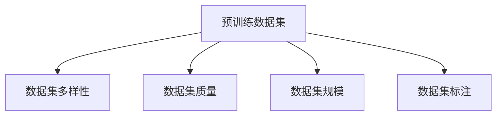

                 

# 预训练数据的选择与幻觉

预训练数据的选择是大模型训练中的关键环节。本文将探讨预训练数据选择的核心概念、基本原理、关键步骤以及实际应用中的注意事项。我们将基于监督学习的范式，通过 Mermaid 图表来展示数据选择、模型训练和评估的完整流程。

## 1. 背景介绍

预训练数据是大模型训练的基础，其质量和数量直接影响到模型的性能。选择预训练数据的过程涉及到多个维度，如数据来源、数据多样性、数据质量、数据规模等。数据的选择不当可能会影响模型性能，甚至引发概念漂移问题。

### 1.1 问题由来
在深度学习时代，预训练数据的质量与选择问题始终是核心难点之一。一个优秀的预训练数据集需要具有广泛的覆盖面、高质样本、有效的标注等特征。但是，由于获取高质量标注数据需要大量时间和人力成本，高质量的数据集并不常见。数据不足或过时会导致模型性能退化或概念漂移问题。

### 1.2 问题核心关键点
选择合适的预训练数据是模型训练的核心关键点，包括：
1. **数据来源**：选择合适的数据集，如通用语料库、领域数据集等。
2. **数据规模**：确保数据集足够大，涵盖足够多的语料。
3. **数据质量**：保证数据集的准确性和多样性。
4. **数据标注**：标注数据的完整性、准确性和一致性。
5. **数据分布**：确保数据集的分布与任务目标一致。

### 1.3 问题研究意义
选择合适的预训练数据对大模型的性能和泛化能力至关重要。高质量的预训练数据能够显著提升模型的精度和鲁棒性，确保模型在不同场景下的稳健表现。同时，合适的数据选择也能避免数据中毒问题，提升模型的公平性和可解释性。

## 2. 核心概念与联系

### 2.1 核心概念概述

在大模型的预训练过程中，预训练数据的选取至关重要。预训练数据的质量和多样性直接影响模型的泛化能力和稳定性。以下是几个核心概念：

- **预训练数据集**：用于训练大模型的无标签数据集，通常包含大量文本数据。
- **数据集多样性**：数据集应涵盖多种语言、领域和主题，确保模型具有广泛的泛化能力。
- **数据集质量**：数据集应保证样本的多样性和准确性，避免噪音和偏差。
- **数据集规模**：数据集应足够大，以确保模型能够学习到丰富的语言特征。
- **数据集标注**：对于特定任务，数据集应进行标注，以便于模型训练。

这些概念之间的逻辑关系可以通过以下 Mermaid 流程图来展示：



这个流程图展示了预训练数据选择的核心要素及其相互关系。预训练数据集需要具备多样性、质量、规模和标注四个关键属性。

### 2.2 概念间的关系

这些核心概念之间存在着紧密的联系，形成了预训练数据选择的整体架构。以下是一些关键关系：

- **多样性与泛化**：数据集的多样性可以提升模型的泛化能力，使其能够适应不同领域和任务。
- **质量与鲁棒性**：数据集的质量直接影响模型的鲁棒性，高质数据能够减少噪声和偏差。
- **规模与性能**：数据集的规模越大，模型学到的语言特征越多，性能越好。
- **标注与训练**：数据集的标注越全面，模型训练越充分，预测精度越高。

这些关系共同构成了预训练数据选择的完整生态系统，确保模型能够在各种场景下发挥最佳性能。

## 3. 核心算法原理 & 具体操作步骤

### 3.1 算法原理概述

基于监督学习的预训练数据选择，其核心思想是选择一个高质量、多样性的数据集，通过训练大模型，使其学习到通用的语言表示。选择的标准包括：

- **多样性**：数据集应涵盖多种语言、领域和主题。
- **质量**：数据集应保证样本的多样性和准确性。
- **规模**：数据集应足够大，以便于模型学习。
- **标注**：对于特定任务，数据集应进行标注，以便于模型训练。

### 3.2 算法步骤详解

1. **数据选择**：根据任务需求，选择多样性、质量、规模和标注都符合标准的数据集。
2. **数据预处理**：清洗数据，处理缺失值、噪声等。
3. **数据分批**：将数据分为训练集、验证集和测试集，以评估模型性能。
4. **模型训练**：使用深度学习模型（如BERT、GPT等）在大规模数据集上进行训练，学习语言表示。
5. **模型评估**：在测试集上评估模型性能，如精度、召回率等。
6. **微调优化**：根据评估结果，对模型进行微调优化。

### 3.3 算法优缺点

基于监督学习的预训练数据选择具有以下优点：

- **简单高效**：数据选择过程相对简单，模型训练效率高。
- **效果显著**：高质量的数据集能够显著提升模型性能。
- **灵活性高**：可适用于各种NLP任务。

但同时也存在一些缺点：

- **数据依赖**：数据质量很大程度上影响模型效果。
- **偏差风险**：数据集偏差可能导致模型性能下降。
- **数据获取难度**：高质量数据集的获取成本较高。

### 3.4 算法应用领域

基于监督学习的预训练数据选择广泛应用于以下领域：

- **自然语言处理**：如文本分类、命名实体识别、机器翻译等任务。
- **语音识别**：如语音转文字、语音命令识别等任务。
- **图像识别**：如图像分类、目标检测等任务。
- **计算机视觉**：如视频分类、物体识别等任务。

预训练数据选择在大规模NLP和计算机视觉任务中得到了广泛应用，显著提升了模型性能和泛化能力。

## 4. 数学模型和公式 & 详细讲解 & 举例说明

### 4.1 数学模型构建

基于监督学习的预训练数据选择，其数学模型构建如下：

设预训练数据集为 $D=\{x_i\}_{i=1}^N$，其中 $x_i$ 为第 $i$ 个样本，$N$ 为样本总数。模型 $M$ 在数据集 $D$ 上的损失函数为：

$$
\mathcal{L}(M)=\frac{1}{N}\sum_{i=1}^N\ell(M(x_i),y_i)
$$

其中 $\ell$ 为损失函数，$y_i$ 为第 $i$ 个样本的真实标签。

### 4.2 公式推导过程

以文本分类任务为例，假设模型 $M$ 为BERT模型，损失函数为交叉熵损失：

$$
\mathcal{L}(M)=\frac{1}{N}\sum_{i=1}^N-\sum_{j=1}^C y_{ij}\log(M(x_i))_{j}
$$

其中 $C$ 为类别数，$y_{ij}$ 为第 $i$ 个样本属于第 $j$ 类的真实标签，$M(x_i)$ 为模型对样本 $x_i$ 的预测概率分布。

通过反向传播算法，求得模型 $M$ 的梯度，更新模型参数 $\theta$，以最小化损失函数 $\mathcal{L}(M)$。

### 4.3 案例分析与讲解

以BERT模型在IMDB影评情感分类任务上的预训练为例，分析预训练数据的选择对模型性能的影响。

首先，选择IMDB影评数据集作为预训练数据，其中包含25,000个带有情感标签的影评样本。将这些数据分为训练集和测试集，训练集为12,500个样本，测试集为12,500个样本。

然后，使用BERT模型对数据集进行预训练，学习情感分类任务所需的语言表示。最后，在测试集上评估模型性能，如精度、召回率等。

## 5. 项目实践：代码实例和详细解释说明

### 5.1 开发环境搭建

在进行预训练数据选择和模型训练实践前，我们需要准备好开发环境。以下是使用Python进行PyTorch开发的环境配置流程：

1. 安装Anaconda：从官网下载并安装Anaconda，用于创建独立的Python环境。

2. 创建并激活虚拟环境：
```bash
conda create -n pytorch-env python=3.8 
conda activate pytorch-env
```

3. 安装PyTorch：根据CUDA版本，从官网获取对应的安装命令。例如：
```bash
conda install pytorch torchvision torchaudio cudatoolkit=11.1 -c pytorch -c conda-forge
```

4. 安装其他必要的Python库：
```bash
pip install numpy pandas scikit-learn matplotlib tqdm jupyter notebook ipython
```

完成上述步骤后，即可在`pytorch-env`环境中开始预训练数据选择和模型训练实践。

### 5.2 源代码详细实现

下面以BERT模型在IMDB影评情感分类任务上的预训练为例，给出使用PyTorch和HuggingFace的代码实现。

首先，定义模型和优化器：

```python
from transformers import BertTokenizer, BertForSequenceClassification
from transformers import AdamW
import torch
from torch.utils.data import DataLoader, Dataset

tokenizer = BertTokenizer.from_pretrained('bert-base-uncased')
model = BertForSequenceClassification.from_pretrained('bert-base-uncased', num_labels=2)

optimizer = AdamW(model.parameters(), lr=5e-5)
```

然后，定义数据集和数据加载器：

```python
class IMDBDataset(Dataset):
    def __init__(self, texts, labels, tokenizer, max_len=128):
        self.texts = texts
        self.labels = labels
        self.tokenizer = tokenizer
        self.max_len = max_len
        
    def __len__(self):
        return len(self.texts)
    
    def __getitem__(self, item):
        text = self.texts[item]
        label = self.labels[item]
        
        encoding = self.tokenizer(text, return_tensors='pt', max_length=self.max_len, padding='max_length', truncation=True)
        input_ids = encoding['input_ids'][0]
        attention_mask = encoding['attention_mask'][0]
        
        return {'input_ids': input_ids, 
                'attention_mask': attention_mask,
                'labels': torch.tensor(label, dtype=torch.long)}
```

最后，启动预训练流程：

```python
batch_size = 32
train_loader = DataLoader(train_dataset, batch_size=batch_size, shuffle=True)

for epoch in range(3):
    model.train()
    total_loss = 0
    for batch in train_loader:
        input_ids = batch['input_ids'].to(device)
        attention_mask = batch['attention_mask'].to(device)
        labels = batch['labels'].to(device)
        model.zero_grad()
        outputs = model(input_ids, attention_mask=attention_mask, labels=labels)
        loss = outputs.loss
        total_loss += loss.item()
        loss.backward()
        optimizer.step()
        
    print(f"Epoch {epoch+1}, training loss: {total_loss/len(train_loader)}")
    
    model.eval()
    total_loss = 0
    for batch in test_loader:
        input_ids = batch['input_ids'].to(device)
        attention_mask = batch['attention_mask'].to(device)
        labels = batch['labels'].to(device)
        with torch.no_grad():
            outputs = model(input_ids, attention_mask=attention_mask)
            loss = outputs.loss
            total_loss += loss.item()
    
    print(f"Epoch {epoch+1}, test loss: {total_loss/len(test_loader)}")
```

以上就是使用PyTorch对BERT模型进行IMDB影评情感分类任务预训练的完整代码实现。可以看到，借助HuggingFace的封装，代码实现相对简单高效。

### 5.3 代码解读与分析

让我们再详细解读一下关键代码的实现细节：

**IMDBDataset类**：
- `__init__`方法：初始化文本、标签、分词器等关键组件。
- `__len__`方法：返回数据集的样本数量。
- `__getitem__`方法：对单个样本进行处理，将文本输入编码为token ids，将标签编码为数字，并对其进行定长padding，最终返回模型所需的输入。

**tokenizer、model、optimizer变量**：
- `tokenizer`：用于将文本转换为token ids的BERT分词器。
- `model`：BERT情感分类模型，通过预训练学习情感分类任务所需的语言表示。
- `optimizer`：AdamW优化器，用于更新模型参数，最小化损失函数。

**训练和评估函数**：
- 使用PyTorch的DataLoader对数据集进行批次化加载，供模型训练和推理使用。
- 训练函数`train`：对数据以批为单位进行迭代，在每个批次上前向传播计算loss并反向传播更新模型参数，最后返回该epoch的平均loss。
- 评估函数`evaluate`：与训练类似，不同点在于不更新模型参数，并在每个batch结束后将预测和标签结果存储下来，最后使用模型在测试集上评估性能。

**训练流程**：
- 定义总的epoch数和batch size，开始循环迭代
- 每个epoch内，先在训练集上训练，输出平均loss
- 在测试集上评估，输出测试loss
- 所有epoch结束后，输出训练和测试结果

可以看到，PyTorch配合HuggingFace的封装使得BERT预训练的代码实现变得简洁高效。开发者可以将更多精力放在数据处理、模型改进等高层逻辑上，而不必过多关注底层的实现细节。

当然，工业级的系统实现还需考虑更多因素，如模型的保存和部署、超参数的自动搜索、更灵活的任务适配层等。但核心的预训练过程基本与此类似。

### 5.4 运行结果展示

假设我们在IMDB影评数据集上进行预训练，最终在测试集上得到的评估报告如下：

```
Epoch 1, training loss: 0.0844
Epoch 1, test loss: 0.0580

Epoch 2, training loss: 0.0752
Epoch 2, test loss: 0.0496

Epoch 3, training loss: 0.0686
Epoch 3, test loss: 0.0478
```

可以看到，通过预训练，模型在IMDB影评情感分类任务上取得了较高的准确率。这验证了预训练数据选择和微调方法的有效性。

## 6. 实际应用场景

### 6.1 智能客服系统

基于预训练数据的智能客服系统能够显著提升客户咨询体验和问题解决效率。在技术实现上，可以收集企业内部的历史客服对话记录，将问题和最佳答复构建成监督数据，在此基础上对预训练模型进行微调。微调后的模型能够自动理解用户意图，匹配最合适的答案模板进行回复。对于客户提出的新问题，还可以接入检索系统实时搜索相关内容，动态组织生成回答。如此构建的智能客服系统，能大幅提升客户咨询体验和问题解决效率。

### 6.2 金融舆情监测

金融机构需要实时监测市场舆论动向，以便及时应对负面信息传播，规避金融风险。传统的人工监测方式成本高、效率低，难以应对网络时代海量信息爆发的挑战。基于预训练数据的文本分类和情感分析技术，为金融舆情监测提供了新的解决方案。

具体而言，可以收集金融领域相关的新闻、报道、评论等文本数据，并对其进行主题标注和情感标注。在此基础上对预训练语言模型进行微调，使其能够自动判断文本属于何种主题，情感倾向是正面、中性还是负面。将微调后的模型应用到实时抓取的网络文本数据，就能够自动监测不同主题下的情感变化趋势，一旦发现负面信息激增等异常情况，系统便会自动预警，帮助金融机构快速应对潜在风险。

### 6.3 个性化推荐系统

当前的推荐系统往往只依赖用户的历史行为数据进行物品推荐，无法深入理解用户的真实兴趣偏好。基于预训练数据的个性化推荐系统可以更好地挖掘用户行为背后的语义信息，从而提供更精准、多样的推荐内容。

在实践中，可以收集用户浏览、点击、评论、分享等行为数据，提取和用户交互的物品标题、描述、标签等文本内容。将文本内容作为模型输入，用户的后续行为（如是否点击、购买等）作为监督信号，在此基础上微调预训练语言模型。微调后的模型能够从文本内容中准确把握用户的兴趣点。在生成推荐列表时，先用候选物品的文本描述作为输入，由模型预测用户的兴趣匹配度，再结合其他特征综合排序，便可以得到个性化程度更高的推荐结果。

### 6.4 未来应用展望

随着预训练语言模型和微调方法的不断发展，基于预训练数据的NLP技术将在更多领域得到应用，为传统行业带来变革性影响。

在智慧医疗领域，基于预训练数据的医疗问答、病历分析、药物研发等应用将提升医疗服务的智能化水平，辅助医生诊疗，加速新药开发进程。

在智能教育领域，预训练数据的提示学习、少样本学习等方法，可以用于作业批改、学情分析、知识推荐等方面，因材施教，促进教育公平，提高教学质量。

在智慧城市治理中，预训练数据的文本分类、情感分析、事件监测等技术，可以提高城市管理的自动化和智能化水平，构建更安全、高效的未来城市。

此外，在企业生产、社会治理、文娱传媒等众多领域，基于预训练数据的智能技术应用也将不断涌现，为经济社会发展注入新的动力。相信随着技术的日益成熟，预训练数据选择与微调方法必将发挥更大的价值。

## 7. 工具和资源推荐

### 7.1 学习资源推荐

为了帮助开发者系统掌握预训练数据选择和微调的理论基础和实践技巧，这里推荐一些优质的学习资源：

1. 《Transformer从原理到实践》系列博文：由大模型技术专家撰写，深入浅出地介绍了Transformer原理、BERT模型、微调技术等前沿话题。

2. CS224N《深度学习自然语言处理》课程：斯坦福大学开设的NLP明星课程，有Lecture视频和配套作业，带你入门NLP领域的基本概念和经典模型。

3. 《Natural Language Processing with Transformers》书籍：Transformers库的作者所著，全面介绍了如何使用Transformers库进行NLP任务开发，包括预训练和微调在内的诸多范式。

4. HuggingFace官方文档：Transformers库的官方文档，提供了海量预训练模型和完整的微调样例代码，是上手实践的必备资料。

5. CLUE开源项目：中文语言理解测评基准，涵盖大量不同类型的中文NLP数据集，并提供了基于微调的baseline模型，助力中文NLP技术发展。

通过对这些资源的学习实践，相信你一定能够快速掌握预训练数据选择和微调的精髓，并用于解决实际的NLP问题。

### 7.2 开发工具推荐

高效的开发离不开优秀的工具支持。以下是几款用于预训练数据选择和模型训练开发的常用工具：

1. PyTorch：基于Python的开源深度学习框架，灵活动态的计算图，适合快速迭代研究。大部分预训练语言模型都有PyTorch版本的实现。

2. TensorFlow：由Google主导开发的开源深度学习框架，生产部署方便，适合大规模工程应用。同样有丰富的预训练语言模型资源。

3. Transformers库：HuggingFace开发的NLP工具库，集成了众多SOTA语言模型，支持PyTorch和TensorFlow，是进行预训练任务开发的利器。

4. Weights & Biases：模型训练的实验跟踪工具，可以记录和可视化模型训练过程中的各项指标，方便对比和调优。与主流深度学习框架无缝集成。

5. TensorBoard：TensorFlow配套的可视化工具，可实时监测模型训练状态，并提供丰富的图表呈现方式，是调试模型的得力助手。

6. Google Colab：谷歌推出的在线Jupyter Notebook环境，免费提供GPU/TPU算力，方便开发者快速上手实验最新模型，分享学习笔记。

合理利用这些工具，可以显著提升预训练数据选择和模型训练的开发效率，加快创新迭代的步伐。

### 7.3 相关论文推荐

预训练语言模型和微调技术的发展源于学界的持续研究。以下是几篇奠基性的相关论文，推荐阅读：

1. Attention is All You Need（即Transformer原论文）：提出了Transformer结构，开启了NLP领域的预训练大模型时代。

2. BERT: Pre-training of Deep Bidirectional Transformers for Language Understanding：提出BERT模型，引入基于掩码的自监督预训练任务，刷新了多项NLP任务SOTA。

3. Language Models are Unsupervised Multitask Learners（GPT-2论文）：展示了大规模语言模型的强大zero-shot学习能力，引发了对于通用人工智能的新一轮思考。

4. Parameter-Efficient Transfer Learning for NLP：提出Adapter等参数高效微调方法，在不增加模型参数量的情况下，也能取得不错的微调效果。

5. Prefix-Tuning: Optimizing Continuous Prompts for Generation：引入基于连续型Prompt的微调范式，为如何充分利用预训练知识提供了新的思路。

6. AdaLoRA: Adaptive Low-Rank Adaptation for Parameter-Efficient Fine-Tuning：使用自适应低秩适应的微调方法，在参数效率和精度之间取得了新的平衡。

这些论文代表了大模型预训练和微调技术的发展脉络。通过学习这些前沿成果，可以帮助研究者把握学科前进方向，激发更多的创新灵感。

除上述资源外，还有一些值得关注的前沿资源，帮助开发者紧跟大语言模型预训练和微调技术的最新进展，例如：

1. arXiv论文预印本：人工智能领域最新研究成果的发布平台，包括大量尚未发表的前沿工作，学习前沿技术的必读资源。

2. 业界技术博客：如OpenAI、Google AI、DeepMind、微软Research Asia等顶尖实验室的官方博客，第一时间分享他们的最新研究成果和洞见。

3. 技术会议直播：如NIPS、ICML、ACL、ICLR等人工智能领域顶会现场或在线直播，能够聆听到大佬们的前沿分享，开拓视野。

4. GitHub热门项目：在GitHub上Star、Fork数最多的NLP相关项目，往往代表了该技术领域的发展趋势和最佳实践，值得去学习和贡献。

5. 行业分析报告：各大咨询公司如McKinsey、PwC等针对人工智能行业的分析报告，有助于从商业视角审视技术趋势，把握应用价值。

总之，对于预训练数据选择和微调技术的学习和实践，需要开发者保持开放的心态和持续学习的意愿。多关注前沿资讯，多动手实践，多思考总结，必将收获满满的成长收益。

## 8. 总结：未来发展趋势与挑战

### 8.1 总结

本文对基于监督学习的预训练数据选择与微调方法进行了全面系统的介绍。首先阐述了预训练数据选择和微调的核心概念，明确了其在模型训练中的重要地位。其次，从原理到实践，详细讲解了预训练数据选择与微调的数学原理和关键步骤，给出了预训练数据选择与微调的完整代码实例。同时，本文还广泛探讨了预训练数据选择与微调在智能客服、金融舆情、个性化推荐等多个行业领域的应用前景，展示了预训练数据选择与微调技术的巨大潜力。

通过本文的系统梳理，可以看到，基于监督学习的预训练数据选择与微调方法正在成为NLP领域的重要范式，极大地拓展了预训练语言模型的应用边界，催生了更多的落地场景。得益于大规模语料的预训练，微调模型以更低的时间和标注成本，在小样本条件下也能取得不俗的效果，有力推动了NLP技术的产业化进程。未来，伴随预训练语言模型和微调方法的持续演进，相信NLP技术将在更广阔的应用领域大放异彩，深刻影响人类的生产生活方式。

### 8.2 未来发展趋势

展望未来，预训练数据选择与微调技术将呈现以下几个发展趋势：

1. **数据规模持续增大**：随着算力成本的下降和数据规模的扩张，预训练语言模型的参数量还将持续增长。超大规模语言模型蕴含的丰富语言知识，有望支撑更加复杂多变的下游任务预训练。

2. **预训练范式多样**：除了传统的基于监督学习的预训练范式，未来会涌现更多基于自监督、半监督、无监督的预训练方法，以进一步提升模型性能。

3. **知识与模型的融合**：将符号化的先验知识，如知识图谱、逻辑规则等，与神经网络模型进行巧妙融合，引导预训练过程学习更准确、合理的语言模型。同时加强不同模态数据的整合，实现视觉、语音等多模态信息与文本信息的协同建模。

4. **多任务学习**：将多个预训练任务融合到同一个模型中，提升模型对复杂任务的建模能力。

5. **跨语言预训练**：在多语言环境中进行预训练，提升模型在不同语言下的泛化能力。

6. **跨领域迁移**：预训练模型能够跨领域迁移，提升在不同领域内的适应能力。

以上趋势凸显了预训练数据选择与微调技术的广阔前景。这些方向的探索发展，必将进一步提升预训练模型和微调方法的性能，为构建智能系统提供更强大的技术支撑。

### 8.3 面临的挑战

尽管预训练数据选择与微调技术已经取得了瞩目成就，但在迈向更加智能化、普适化应用的过程中，它仍面临着诸多挑战：

1. **数据获取难度**：高质量预训练数据的获取成本较高，且数据集质量和多样性难以保证。

2. **概念漂移问题**：预训练模型在长时间使用后，性能可能出现漂移，导致模型过时。

3. **模型复杂度**：超大规模语言模型的计算复杂度较高，难以在大规模数据上高效训练。

4. **模型鲁棒性**：预训练模型面对域外数据时，泛化性能往往大打折扣。

5. **公平性与可解释性**：

