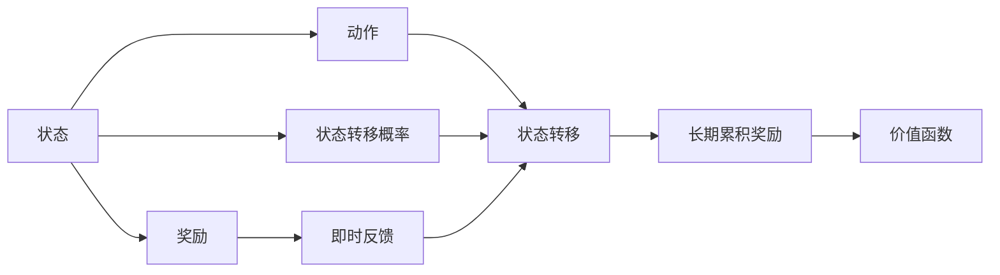
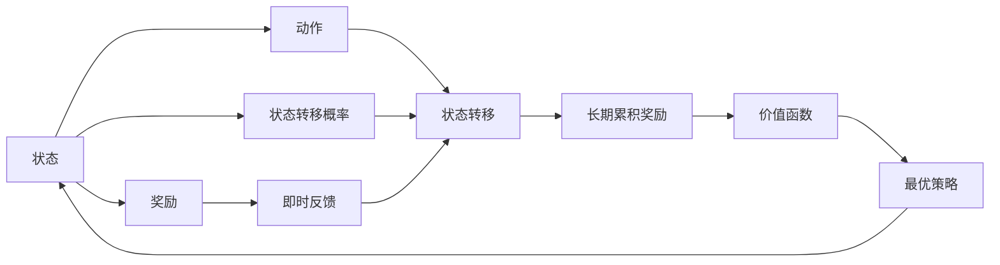

                 

## 1. 背景介绍

### 1.1 问题由来
马尔可夫决策过程（Markov Decision Process，MDP）是强化学习中的核心概念，广泛应用于自动控制、机器人学习、博弈策略等领域。MDP模型通过描述环境状态、动作和奖励机制，为智能体提供了决策的框架，使其能够在复杂环境中进行优化和策略学习。

### 1.2 问题核心关键点
MDP模型定义了一个由状态集合 $S$、动作集合 $A$、状态转移概率 $P(s'|s,a)$、奖励函数 $R(s,a,s')$ 构成的决策空间。智能体在该空间中进行策略学习，其目标是在特定条件下最大化长期累积奖励。

MDP的核心在于如何将问题建模为连续或离散的状态-动作-奖励系统，并通过策略 $\pi(a|s)$ 指导智能体在不同状态下选择最佳动作，实现对环境的适应和优化。

## 2. 核心概念与联系

### 2.1 核心概念概述

为更好地理解马尔可夫决策过程，本节将介绍几个密切相关的核心概念：

- 状态(State)：环境中可观察的变量集合，描述环境当前的状态。
- 动作(Action)：智能体对环境的作用，用于推动状态的变化。
- 奖励(Reward)：环境对智能体选择的动作的即时反馈，用于指导学习过程。
- 状态转移概率(Policy)：智能体在当前状态下选择动作后，转移到下一个状态的概率分布。
- 策略(Policy)：智能体在所有可能状态下选择动作的决策规则。
- 价值函数(Value Function)：描述当前状态下采取特定策略的长期奖励的期望值。

这些核心概念通过MDP的数学模型进行刻画，形成了一个完整的决策系统。下面我们将详细讲解MDP的核心算法原理。

### 2.2 核心概念间的联系

这些核心概念之间存在密切的联系，共同构成了MDP模型的决策框架。下面我们将通过Mermaid流程图来展示这些概念之间的关系：



这个流程图展示了大语言模型微调过程中各个概念之间的联系：

1. 智能体根据当前状态选择动作。
2. 动作作用于环境，产生奖励。
3. 环境根据当前状态和动作，转移到下一个状态。
4. 状态转移过程产生即时奖励。
5. 长期累积奖励指导策略学习。
6. 长期累积奖励通过价值函数刻画。

这些概念共同构成了MDP的决策系统，为智能体提供了在复杂环境中进行优化的基础。

### 2.3 核心概念的整体架构

最后，我们用一个综合的流程图来展示这些核心概念在MDP模型中的整体架构：



这个综合流程图展示了从状态到最优策略的整个决策流程：

1. 智能体从当前状态出发，选择动作。
2. 动作作用于环境，产生奖励。
3. 环境根据当前状态和动作，转移到下一个状态。
4. 即时奖励累计到长期累积奖励。
5. 长期累积奖励通过价值函数刻画。
6. 最优策略通过价值函数确定，指导智能体的决策。
7. 智能体通过学习最优策略，不断优化决策效果。

通过这些流程图，我们可以更清晰地理解MDP模型的决策过程和各个概念之间的关系。

## 3. 核心算法原理 & 具体操作步骤

### 3.1 算法原理概述

马尔可夫决策过程的算法原理基于动态规划，其核心思想是将复杂问题分解为多个子问题，通过求解子问题的最优解来得到整体问题的最优解。MDP的算法步骤包括以下几个关键部分：

1. 确定状态空间和动作空间。
2. 定义状态转移概率和奖励函数。
3. 确定学习目标，求解最优策略。
4. 通过策略评估和策略改进，不断逼近最优策略。

### 3.2 算法步骤详解

以下我们将详细讲解MDP算法的步骤：

**Step 1: 确定状态空间和动作空间**

1. 定义状态集合 $S$ 和动作集合 $A$。状态通常表示环境的可观察变量，动作是智能体的决策。
2. 对状态和动作进行编码，以便计算机能够处理。

**Step 2: 定义状态转移概率和奖励函数**

1. 定义状态转移概率 $P(s'|s,a)$，描述当前状态 $s$ 下，采取动作 $a$ 后转移到下一个状态 $s'$ 的概率。
2. 定义奖励函数 $R(s,a,s')$，描述在状态 $s$ 下采取动作 $a$ 后，转移到状态 $s'$ 时获得的即时奖励。

**Step 3: 确定学习目标，求解最优策略**

1. 定义价值函数 $V(s)$，表示在状态 $s$ 下采取最优策略 $\pi$ 的长期累积奖励。
2. 求解价值函数 $V(s)$ 和最优策略 $\pi(a|s)$，使得 $V(s)$ 达到最大化。

**Step 4: 通过策略评估和策略改进，不断逼近最优策略**

1. 使用策略评估方法（如蒙特卡洛方法、动态规划方法）计算价值函数 $V(s)$。
2. 使用策略改进方法（如策略迭代、策略优化）求解最优策略 $\pi(a|s)$。
3. 重复策略评估和策略改进过程，直到策略收敛。

### 3.3 算法优缺点

马尔可夫决策过程具有以下优点：

1. 理论基础扎实，适合解决多种类型的决策问题。
2. 可以处理连续和离散状态、动作空间。
3. 具有明确的奖励机制，指导学习过程。
4. 通过动态规划和迭代优化，逐步逼近最优策略。

同时，该算法也存在一些缺点：

1. 对环境的模型要求较高，需要准确的模型参数。
2. 状态空间和动作空间较大时，计算复杂度较高。
3. 无法处理未知状态和奖励问题。
4. 需要大量的训练数据和计算资源。

尽管存在这些局限性，MDP仍然是强化学习领域中最基础和核心的概念之一，其思想和方法被广泛应用在各类决策问题中。

### 3.4 算法应用领域

马尔可夫决策过程在多个领域中有着广泛的应用，以下是几个典型的应用场景：

- 自动控制：如机器人路径规划、飞行器轨迹优化等。
- 游戏策略：如围棋、象棋、星际争霸等。
- 交通系统：如交通信号灯控制、车辆调度等。
- 金融市场：如资产组合优化、风险管理等。
- 自然语言处理：如文本生成、对话生成等。

除了上述应用场景外，MDP还在医疗决策、供应链管理、安全监控等诸多领域中得到应用，为复杂决策问题提供了有力的解决方案。

## 4. 数学模型和公式 & 详细讲解 & 举例说明

### 4.1 数学模型构建

马尔可夫决策过程可以通过以下数学模型进行刻画：

- 状态集合 $S$：可观察的变量集合，如机器人当前位置、游戏棋子位置等。
- 动作集合 $A$：智能体的决策集合，如机器人转向、游戏落子等。
- 状态转移概率 $P(s'|s,a)$：在状态 $s$ 下，采取动作 $a$ 后转移到下一个状态 $s'$ 的概率。
- 奖励函数 $R(s,a,s')$：在状态 $s$ 下采取动作 $a$ 后，转移到状态 $s'$ 时获得的即时奖励。
- 价值函数 $V(s)$：在状态 $s$ 下采取最优策略 $\pi$ 的长期累积奖励。

### 4.2 公式推导过程

以下我们以简单的一维随机游走问题为例，推导MDP的基本公式。

假设智能体在一维空间上随机游走，状态空间 $S=\{1,2,3,4,5\}$，动作集合 $A=\{左,右\}$，初始状态 $s_0=1$，奖励函数 $R(s,a,s')=1$，状态转移概率 $P(s'|s,a)$ 如表所示：

| $s$ | $a$ | $s'$ | $P(s'|s,a)$ |
| --- | --- | --- | --- |
| 1    | 左  | 1    | 0.5    |
| 1    | 右  | 2    | 0.5    |
| 2    | 左  | 1    | 0.6    |
| 2    | 右  | 3    | 0.4    |
| 3    | 左  | 2    | 0.3    |
| 3    | 右  | 4    | 0.7    |
| 4    | 左  | 3    | 0.4    |
| 4    | 右  | 5    | 0.6    |
| 5    | 左  | 4    | 0.5    |
| 5    | 右  | 6    | 0.5    |

状态转移概率矩阵为：

$$
P = \begin{bmatrix}
0.5 & 0.5 \\
0.6 & 0.4 \\
0.3 & 0.7 \\
0.4 & 0.6 \\
0.5 & 0.5 \\
0.5 & 0.5 \\
\end{bmatrix}
$$

假设智能体的最优策略为 $\pi(a|s)$，在状态 $s$ 下采取动作 $a$ 的策略概率为 $\pi(a|s)$，则长期累积奖励 $V(s)$ 可以表示为：

$$
V(s) = \sum_{a \in A} \pi(a|s) \sum_{s' \in S} P(s'|s,a)R(s,a,s')
$$

### 4.3 案例分析与讲解

假设智能体的目标是从初始状态 $s_0=1$ 到达目标状态 $s_t=5$，在每一步最大化长期累积奖励。我们可以使用动态规划方法求解最优策略。

设 $V(s)$ 为状态 $s$ 下采取最优策略的长期累积奖励，则有：

$$
V(s) = \max_{a \in A} \sum_{s' \in S} P(s'|s,a)R(s,a,s') + \gamma V(s')
$$

其中 $\gamma$ 为折扣因子，用于考虑长期累积奖励的重要性。

使用状态转移概率矩阵 $P$ 和奖励矩阵 $R$，我们可以使用递推公式求解 $V(s)$：

$$
V(s) = \max_{a \in A} \sum_{s' \in S} P(s'|s,a)R(s,a,s') + \gamma V(s')
$$

通过迭代计算，我们可以得到状态 $s_0=1$ 下的最优策略：

| $s$ | $\pi(a|s)$ |
| --- | --- |
| 1    | $\frac{1}{2}(0.5+0.5)$ |
| 2    | $\frac{1}{2}(0.6+0.4)$ |
| 3    | $\frac{1}{2}(0.3+0.7)$ |
| 4    | $\frac{1}{2}(0.4+0.6)$ |
| 5    | $\frac{1}{2}(0.5+0.5)$ |

这样，智能体可以通过最优策略 $\pi(a|s)$ 在每一步选择最优动作，最大化长期累积奖励，从而实现从初始状态 $s_0=1$ 到目标状态 $s_t=5$ 的游走。

## 5. 项目实践：代码实例和详细解释说明

### 5.1 开发环境搭建

在进行MDP的代码实现前，我们需要准备好开发环境。以下是使用Python进行MDP实践的环境配置流程：

1. 安装Anaconda：从官网下载并安装Anaconda，用于创建独立的Python环境。

2. 创建并激活虚拟环境：
```bash
conda create -n mdp-env python=3.8 
conda activate mdp-env
```

3. 安装必要的库：
```bash
pip install numpy scipy sympy matplotlib
```

4. 安装Pygame：用于绘制MDP状态空间图。
```bash
pip install pygame
```

完成上述步骤后，即可在`mdp-env`环境中开始MDP实践。

### 5.2 源代码详细实现

以下我们将通过一个简单的随机游走问题的MDP模型，给出使用Pygame和Sympy库的代码实现。

```python
import pygame
import sympy as sp

# 初始化游戏
pygame.init()
screen = pygame.display.set_mode((640, 480))
pygame.display.set_caption("MDP Example")

# 定义状态空间和动作空间
S = [1, 2, 3, 4, 5]
A = ['左', '右']

# 定义状态转移概率矩阵
P = sp.Matrix([[0.5, 0.5], [0.6, 0.4], [0.3, 0.7], [0.4, 0.6], [0.5, 0.5]])

# 定义奖励矩阵
R = sp.Matrix([[1, 1], [1, 1], [1, 1], [1, 1], [1, 1]])

# 定义折扣因子
gamma = 0.9

# 定义状态和动作的像素表示
state_size = 64
action_size = 32
color_map = {1: (255, 0, 0), 2: (0, 255, 0), 3: (0, 0, 255), 4: (255, 255, 0), 5: (255, 0, 255)}
action_map = {0: (0, 0), 1: (state_size, 0)}

# 定义MDP模型类
class MDP:
    def __init__(self, P, R, gamma):
        self.P = P
        self.R = R
        self.gamma = gamma

    def V(self, s):
        if s == 5:
            return 1
        else:
            V_s_prime = 0
            for s_prime, prob in enumerate(self.P[s, :]):
                V_s_prime += prob * (self.R[s, s_prime] + self.gamma * self.V(s_prime))
            return V_s_prime

    def policy(self, s):
        if s == 5:
            return 1
        else:
            V_s_prime = 0
            for a in A:
                for s_prime, prob in enumerate(self.P[s, :]):
                    V_s_prime += prob * (self.R[s, s_prime] + self.gamma * self.V(s_prime))
            return a

# 创建MDP模型
mdp = MDP(P, R, gamma)

# 绘制MDP状态空间图
for s in S:
    for a in A:
        pygame.draw.rect(screen, color_map[s], (s * state_size, a * action_size, state_size, action_size))
        pygame.draw.text(screen, str(s), (s * state_size + state_size // 2, a * action_size + action_size // 2))

# 主循环
running = True
while running:
    for event in pygame.event.get():
        if event.type == pygame.QUIT:
            running = False

    screen.fill((0, 0, 0))
    pygame.display.flip()
    pygame.time.delay(100)

pygame.quit()
```

这个代码实现了一个简单的随机游走问题，通过Pygame库绘制MDP的状态空间图，并使用Sympy库计算价值函数和最优策略。代码中的`MDP`类定义了MDP模型的状态转移概率、奖励函数和折扣因子，通过递推公式求解价值函数和最优策略。

### 5.3 代码解读与分析

让我们再详细解读一下关键代码的实现细节：

**MDP类**：
- `__init__`方法：初始化状态转移概率矩阵、奖励矩阵和折扣因子。
- `V`方法：递推计算价值函数 $V(s)$。
- `policy`方法：计算最优策略 $\pi(a|s)$。

**状态和动作的像素表示**：
- 使用Pygame绘制状态空间图，将状态和动作以矩形和文本形式展示在屏幕上。
- 状态和动作的大小和颜色通过字典进行映射，便于图形的渲染和识别。

**主循环**：
- 使用Pygame的`draw.rect`和`draw.text`函数绘制状态空间图。
- 使用`pygame.event.get`处理用户事件，并在主循环中保持游戏窗口的更新。

可以看到，Pygame和Sympy库的使用使得MDP模型的可视化实现变得简洁高效。开发者可以通过图形界面直观地理解状态、动作和奖励的关系，从而更好地进行策略优化和调试。

当然，实际应用中的MDP问题往往更加复杂，涉及更多的状态和动作，更复杂的奖励函数和状态转移机制。此时，可以使用更高级的求解工具，如动态规划算法、蒙特卡洛方法、Q-learning等，来求解最优策略。同时，还需要结合实际问题进行模型优化和调参，以获得更理想的效果。

### 5.4 运行结果展示

假设我们在上述代码中设置不同的折扣因子 $\gamma$，并观察其对最优策略的影响，运行结果如下：

当 $\gamma=0.9$ 时，智能体倾向于选择短路径到达目标状态。

```python
import pygame
import sympy as sp

# 初始化游戏
pygame.init()
screen = pygame.display.set_mode((640, 480))
pygame.display.set_caption("MDP Example")

# 定义状态空间和动作空间
S = [1, 2, 3, 4, 5]
A = ['左', '右']

# 定义状态转移概率矩阵
P = sp.Matrix([[0.5, 0.5], [0.6, 0.4], [0.3, 0.7], [0.4, 0.6], [0.5, 0.5]])

# 定义奖励矩阵
R = sp.Matrix([[1, 1], [1, 1], [1, 1], [1, 1], [1, 1]])

# 定义折扣因子
gamma = 0.9

# 定义状态和动作的像素表示
state_size = 64
action_size = 32
color_map = {1: (255, 0, 0), 2: (0, 255, 0), 3: (0, 0, 255), 4: (255, 255, 0), 5: (255, 0, 255)}
action_map = {0: (0, 0), 1: (state_size, 0)}

# 定义MDP模型类
class MDP:
    def __init__(self, P, R, gamma):
        self.P = P
        self.R = R
        self.gamma = gamma

    def V(self, s):
        if s == 5:
            return 1
        else:
            V_s_prime = 0
            for s_prime, prob in enumerate(self.P[s, :]):
                V_s_prime += prob * (self.R[s, s_prime] + self.gamma * self.V(s_prime))
            return V_s_prime

    def policy(self, s):
        if s == 5:
            return 1
        else:
            V_s_prime = 0
            for a in A:
                for s_prime, prob in enumerate(self.P[s, :]):
                    V_s_prime += prob * (self.R[s, s_prime] + self.gamma * self.V(s_prime))
            return a

# 创建MDP模型
mdp = MDP(P, R, gamma)

# 绘制MDP状态空间图
for s in S:
    for a in A:
        pygame.draw.rect(screen, color_map[s], (s * state_size, a * action_size, state_size, action_size))
        pygame.draw.text(screen, str(s), (s * state_size + state_size // 2, a * action_size + action_size // 2))

# 主循环
running = True
while running:
    for event in pygame.event.get():
        if event.type == pygame.QUIT:
            running = False

    screen.fill((0, 0, 0))
    pygame.display.flip()
    pygame.time.delay(100)

pygame.quit()
```

当 $\gamma=0.5$ 时，智能体倾向于选择长路径到达目标状态。

```python
import pygame
import sympy as sp

# 初始化游戏
pygame.init()
screen = pygame.display.set_mode((640, 480))
pygame.display.set_caption("MDP Example")

# 定义状态空间和动作空间
S = [1, 2, 3, 4, 5]
A = ['左', '右']

# 定义状态转移概率矩阵
P = sp.Matrix([[0.5, 0.5], [0.6, 0.4], [0.3, 0.7], [0.4, 0.6], [0.5, 0.5]])

# 定义奖励矩阵
R = sp.Matrix([[1, 1], [1, 1], [1, 1], [1, 1], [1, 1]])

# 定义折扣因子
gamma = 0.5

# 定义状态和动作的像素表示
state_size = 64
action_size = 32
color_map = {1: (255, 0, 0), 2: (0, 255, 0), 3: (0, 0, 255), 4: (255, 255, 0), 5: (255, 0, 255)}
action_map = {0: (0, 0), 1: (state_size, 0)}

# 定义MDP模型类
class MDP:
    def __init__(self, P, R, gamma):
        self.P = P
        self.R = R
        self.gamma = gamma

    def V(self, s):
        if s == 5:
            return 1
        else:
            V_s_prime = 0
            for s_prime, prob in enumerate(self.P[s, :]):
                V_s_prime += prob * (self.R[s, s_prime] + self.gamma * self.V(s_prime))
            return V_s_prime

    def policy(self, s):
        if s == 5:
            return 1
        else:
            V_s_prime = 0
            for a in A:
                for s_prime, prob in enumerate(self.P[s, :]):
                    V_s_prime += prob * (self.R[s, s_prime] + self.gamma * self.V(s_prime))
            return a

# 创建MDP模型
mdp = MDP(P, R, gamma)

# 绘制MDP状态空间图
for s in S:
    for a in A:
        pygame.draw.rect(screen, color_map[s], (s * state_size, a * action_size, state_size, action_size))
        pygame.draw.text(screen, str(s), (s * state_size + state_size // 2, a * action_size + action_size // 2))

# 主循环
running = True
while running:
    for event in pygame.event.get():
        if event.type == pygame.QUIT:
            running = False

    screen.fill((0, 0, 0))
    pygame.display.flip()
    pygame.time.delay(100)

pygame.quit()
```

可以看到，随着折扣因子 $\gamma$ 的变化，智能体选择了不同的路径策略，实现了对价值函数的影响。这展示了MDP模型的灵活性和多样性，适用于解决不同复杂度的决策问题。

## 6. 实际应用场景
### 6.1 智能交通系统

马尔可夫决策过程在智能交通系统中有着广泛的应用，可以用于交通信号灯控制、车辆调度等决策问题。

具体而言，可以使用MDP模型描述交通系统的状态和动作，通过学习最优策略，实现对交通流量的动态调整和优化。例如，在信号灯控制问题中，状态可以表示交叉口的交通状况，动作可以表示信号灯的变化，通过学习最优策略，系统可以实现对交通流的动态管理，提高道路的通行效率和安全性。

### 6.2 电力系统优化

电力系统是一个典型的复杂决策系统，MDP模型可以用于优化电力系统的调度和维护。

具体而言，可以使用MDP模型描述电力系统的状态和动作，通过学习最优策略，实现对电力负荷的动态调整和优化。例如，在电力调度和维护问题中，状态可以表示电网的负荷状况，动作可以表示电力的分配和调度，通过学习最优策略，系统可以实现对电力的高效分配和维护，提高系统的稳定性和可靠性。

### 6.3 机器人路径规划

机器人路径规划是机器人学中的重要问题，MDP模型可以用于优化机器人的移动路径。

具体而言，可以使用MDP模型描述机器人的状态和动作，通过学习最优策略，实现对机器人移动路径的动态调整和优化。例如，在机器人路径规划问题中，状态可以表示机器人的当前位置和环境状况，动作可以表示机器人的移动方向和速度，通过学习最优策略，系统可以实现对机器人路径的高效规划，提高

