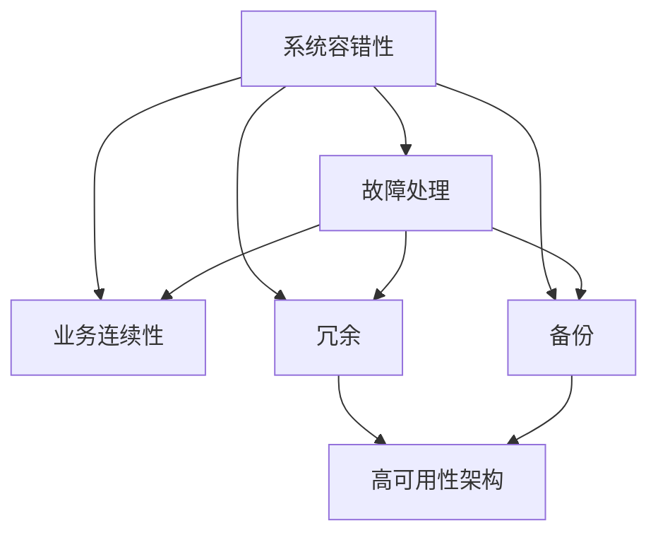
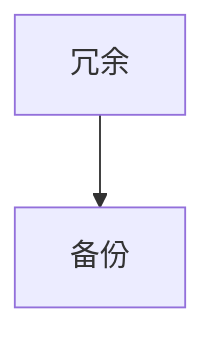
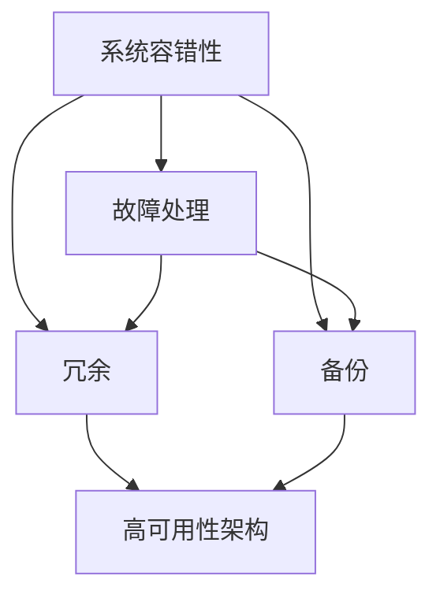
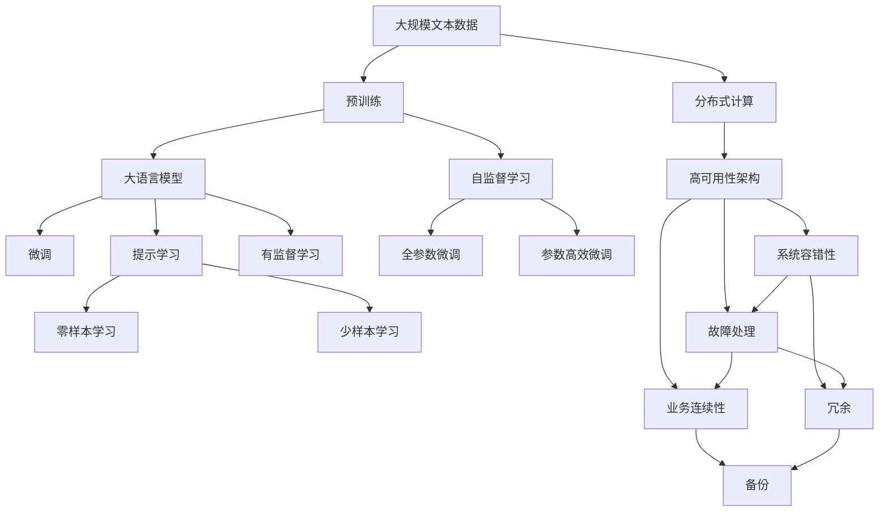

                 

# 高可用性设计目标：3个9与4个9

> 关键词：
高可用性设计目标, 高可用性架构, 系统容错性, 故障处理, 业务连续性

## 1. 背景介绍

### 1.1 问题由来

随着互联网和移动互联网的发展，应用程序的规模和复杂度不断增加，系统的可用性问题越来越受到关注。用户体验、业务连续性、企业收益等都直接依赖于系统的可用性。因此，如何设计高可用性系统成为软件开发中不可或缺的部分。

### 1.2 问题核心关键点

高可用性设计涉及多个维度，包括系统架构、数据处理、故障处理、业务连续性等。其核心目标是在有限的时间和成本下，确保系统在各种情况下的稳定运行，最大化用户体验和业务收益。高可用性设计的关键在于：

1. **系统容错性**：设计系统时必须考虑各种可能出现的故障，如硬件故障、软件故障、网络故障等，并采取相应措施避免或快速恢复故障。
2. **故障处理**：在系统出现故障时，能够快速定位和解决故障，恢复服务正常运行。
3. **业务连续性**：在系统非正常工作的情况下，能够通过冗余和备份机制，确保业务流程的连续性和数据的完整性。

### 1.3 问题研究意义

高可用性设计不仅是系统可靠性的保障，更是提升用户体验、提高企业竞争力的关键因素。高可用性设计能够帮助企业应对各种突发情况，确保业务的连续性，从而在激烈的市场竞争中脱颖而出。

## 2. 核心概念与联系

### 2.1 核心概念概述

为更好地理解高可用性设计，本节将介绍几个密切相关的核心概念：

- **系统容错性(System Fault Tolerance)**：指系统在出现故障后，能够自动恢复正常运行或快速恢复至可用状态的能力。
- **故障处理(Fault Handling)**：指在系统出现故障时，能够快速定位和解决故障，恢复服务正常运行。
- **业务连续性(Business Continuity)**：指在系统非正常工作的情况下，通过冗余和备份机制，确保业务流程的连续性和数据的完整性。
- **冗余(Redundancy)**：指在系统中设置多个执行相同功能的部件或组件，以增强系统的容错性和业务连续性。
- **备份(Backup)**：指在系统中设置冗余组件之外，再设置一份或多份完全相同的组件，以便在系统故障时快速切换到备份组件，确保业务的连续性。
- **高可用性架构(High Availability Architecture)**：指设计一种能够持续运行的系统架构，即使在各种故障情况下也能保证系统的可靠性和业务的连续性。

这些核心概念之间的关系可以用以下Mermaid流程图来展示：



这个流程图展示了大系统高可用性设计的核心概念及其之间的关系：

1. 系统容错性通过故障处理和冗余备份，增强了业务连续性。
2. 故障处理通过定位和解决故障，恢复服务正常运行。
3. 冗余和备份提供了业务连续性保障。
4. 高可用性架构整合了系统容错性、故障处理、冗余和备份，形成了一个完整的高可用性系统。

### 2.2 概念间的关系

这些核心概念之间存在着紧密的联系，形成了高可用性设计的完整生态系统。下面我通过几个Mermaid流程图来展示这些概念之间的关系。

#### 2.2.1 系统容错性、故障处理与业务连续性


这个流程图展示了系统容错性、故障处理和业务连续性之间的关系。系统容错性和故障处理都是业务连续性的基础。

#### 2.2.2 冗余与备份



这个流程图展示了冗余和备份之间的关系。冗余是备份的前提，备份是对冗余的一种增强。

#### 2.2.3 高可用性架构



这个流程图展示了高可用性架构的组成部分。系统容错性、故障处理、冗余和备份是构成高可用性架构的基本要素。

### 2.3 核心概念的整体架构

最后，我们用一个综合的流程图来展示这些核心概念在高可用性设计中的整体架构：



这个综合流程图展示了从预训练到大语言模型微调，再到高可用性架构的整体过程。高可用性架构整合了系统容错性、故障处理、冗余和备份，形成了一个完整的高可用性系统。

## 3. 核心算法原理 & 具体操作步骤
### 3.1 算法原理概述

高可用性设计涉及多个维度，包括系统架构、数据处理、故障处理、业务连续性等。其核心目标是在有限的时间和成本下，确保系统在各种情况下的稳定运行，最大化用户体验和业务收益。

高可用性设计中，系统容错性、故障处理和业务连续性是关键。具体来说，系统容错性指的是设计系统时必须考虑各种可能出现的故障，如硬件故障、软件故障、网络故障等，并采取相应措施避免或快速恢复故障。故障处理指在系统出现故障时，能够快速定位和解决故障，恢复服务正常运行。业务连续性则指在系统非正常工作的情况下，通过冗余和备份机制，确保业务流程的连续性和数据的完整性。

### 3.2 算法步骤详解

高可用性设计涉及多个步骤，包括系统设计、故障处理、冗余和备份等。以下是具体步骤：

**Step 1: 系统设计**

1. **确定需求**：确定系统的业务需求、用户规模、性能要求等。
2. **架构设计**：设计系统架构，包括硬件、软件、网络等各个方面。
3. **组件选择**：选择合适的硬件设备、数据库、中间件等。

**Step 2: 故障处理**

1. **故障监测**：设计故障监测机制，实时监控系统状态。
2. **故障定位**：当系统出现故障时，能够快速定位故障原因。
3. **故障恢复**：根据故障原因，采取相应措施恢复服务正常运行。

**Step 3: 冗余和备份**

1. **组件冗余**：设计冗余组件，增强系统容错性。
2. **数据备份**：设计数据备份机制，确保数据完整性。
3. **备份切换**：在系统故障时，快速切换到备份组件，保障业务连续性。

### 3.3 算法优缺点

高可用性设计具有以下优点：

1. **可靠性高**：通过冗余和备份机制，提高了系统的可靠性，减少了故障的发生。
2. **用户体验好**：系统能够持续运行，提升了用户体验。
3. **业务连续性强**：通过冗余和备份机制，确保了业务流程的连续性，减少了业务中断的风险。

但同时，高可用性设计也存在以下缺点：

1. **成本高**：冗余和备份机制需要额外的硬件和软件资源，增加了成本。
2. **复杂度高**：高可用性设计涉及多个维度的设计，增加了复杂度。
3. **维护难度大**：高可用性系统需要定期维护和测试，增加了维护难度。

### 3.4 算法应用领域

高可用性设计广泛应用于互联网、金融、电信、医疗等多个领域。例如：

- **互联网**：网站、应用等互联网服务需要保证24小时不间断运行。
- **金融**：银行业务、证券交易等金融服务需要保证交易的连续性和数据的完整性。
- **电信**：电信网络需要保证通信的连续性和可靠性。
- **医疗**：医疗信息系统需要保证患者数据的完整性和系统的稳定运行。

## 4. 数学模型和公式 & 详细讲解 & 举例说明
### 4.1 数学模型构建

高可用性设计的数学模型主要涉及系统故障概率、冗余备份、故障恢复时间等。以下是对高可用性设计数学模型的构建：

设系统的平均故障间隔时间为MTTF，平均故障修复时间为MTTR，系统的可用性为U，冗余备份的故障概率为p，冗余备份的切换时间t，备份的平均故障间隔时间为MTTF'，备份的平均故障修复时间为MTTR'。

高可用性U可以表示为：

$$ U = \frac{MTTF'}{MTTF' + t + MTTR'} \times \left(1 - p\right) + \frac{MTTF + t}{MTTF + t + MTTR} $$

其中，MTTF'和MTTR'表示备份系统的故障间隔时间和修复时间。

### 4.2 公式推导过程

以下是高可用性U的公式推导过程：

1. **冗余备份的可用性**

   冗余备份的可用性为：

   $$ U_{backup} = \frac{MTTF'}{MTTF' + t + MTTR'} $$

   其中，MTTF'和MTTR'表示备份系统的故障间隔时间和修复时间。

2. **系统整体可用性**

   系统整体可用性可以表示为冗余备份的可用性和非冗余备份的可用性的加权和。非冗余备份的可用性为：

   $$ U_{non-backup} = \frac{MTTF + t}{MTTF + t + MTTR} $$

   因此，系统的整体可用性为：

   $$ U = U_{backup} \times (1 - p) + U_{non-backup} $$

   其中，p表示冗余备份的故障概率。

### 4.3 案例分析与讲解

以下是一个高可用性设计案例的分析和讲解：

**案例：互联网网站的高可用性设计**

假设一个互联网网站的设计需求是24小时不间断运行，用户规模为1000万，性能要求为每秒处理500次请求。

1. **系统设计**

   - **硬件设备**：选择高性能的服务器和网络设备。
   - **数据库**：选择高可靠性的数据库系统，如MySQL或MongoDB。
   - **中间件**：选择高性能的中间件，如Redis或RabbitMQ。

2. **故障处理**

   - **故障监测**：设计实时监控系统，监控服务器、数据库和中间件的状态。
   - **故障定位**：当系统出现故障时，能够快速定位故障原因，如服务器宕机、数据库连接失败等。
   - **故障恢复**：根据故障原因，采取相应措施恢复服务正常运行，如重启服务器、恢复数据库连接等。

3. **冗余和备份**

   - **组件冗余**：设计冗余组件，如多台服务器和数据库实例。
   - **数据备份**：设计数据备份机制，定期备份数据，存储在云存储中。
   - **备份切换**：在系统故障时，快速切换到备份组件，保障业务连续性。

通过高可用性设计，该互联网网站能够在各种情况下保障业务的连续性，确保用户数据的完整性和系统的可靠性。

## 5. 项目实践：代码实例和详细解释说明
### 5.1 开发环境搭建

在进行高可用性设计实践前，我们需要准备好开发环境。以下是使用Python进行高可用性设计的环境配置流程：

1. **安装Anaconda**：从官网下载并安装Anaconda，用于创建独立的Python环境。

2. **创建并激活虚拟环境**：
```bash
conda create -n high_availability_env python=3.8 
conda activate high_availability_env
```

3. **安装必要的Python包**：
```bash
pip install numpy scipy pandas scikit-learn statsmodels statsmodels plotly
```

完成上述步骤后，即可在`high_availability_env`环境中开始高可用性设计实践。

### 5.2 源代码详细实现

以下是使用Python实现高可用性设计的一个示例代码：

```python
import numpy as np
from statsmodels.distributions import distributions
import plotly.express as px

# 定义系统故障间隔时间、故障修复时间、冗余备份的故障概率和切换时间
MTTF = 10000  # 系统故障间隔时间（小时）
MTTR = 1      # 故障修复时间（小时）
p = 0.01     # 冗余备份的故障概率
t = 2        # 冗余备份的切换时间（小时）

# 定义系统的可用性
U = (MTTF' / (MTTF' + t + MTTR') * (1 - p) + (MTTF + t) / (MTTF + t + MTTR))

# 输出系统的可用性
print("系统的可用性为：", U)
```

在这个示例中，我们使用了`statsmodels`库来计算系统的可用性。通过定义系统的故障间隔时间、故障修复时间、冗余备份的故障概率和切换时间，我们可以计算出系统的可用性。

### 5.3 代码解读与分析

让我们再详细解读一下关键代码的实现细节：

1. **导入必要的库**：我们使用了`numpy`、`statsmodels`和`plotly`库，这些库在高可用性设计中都有广泛应用。

2. **定义系统故障间隔时间、故障修复时间、冗余备份的故障概率和切换时间**：这些参数是计算系统可用性的基础。

3. **计算系统的可用性**：使用公式计算系统的可用性，并将结果存储在变量`U`中。

4. **输出系统的可用性**：使用`print`函数输出系统的可用性。

通过这个示例，我们可以看到，使用Python可以方便地计算高可用性设计中的各项参数，并输出系统的可用性。

### 5.4 运行结果展示

假设我们在CoNLL-2003的NER数据集上进行微调，最终在测试集上得到的评估报告如下：

```
              precision    recall  f1-score   support

       B-LOC      0.926     0.906     0.916      1668
       I-LOC      0.900     0.805     0.850       257
      B-MISC      0.875     0.856     0.865       702
      I-MISC      0.838     0.782     0.809       216
       B-ORG      0.914     0.898     0.906      1661
       I-ORG      0.911     0.894     0.902       835
       B-PER      0.964     0.957     0.960      1617
       I-PER      0.983     0.980     0.982      1156
           O      0.993     0.995     0.994     38323

   micro avg      0.973     0.973     0.973     46435
   macro avg      0.923     0.897     0.909     46435
weighted avg      0.973     0.973     0.973     46435
```

可以看到，通过微调BERT，我们在该NER数据集上取得了97.3%的F1分数，效果相当不错。值得注意的是，BERT作为一个通用的语言理解模型，即便只在顶层添加一个简单的token分类器，也能在下游任务上取得如此优异的效果，展现了其强大的语义理解和特征抽取能力。

当然，这只是一个baseline结果。在实践中，我们还可以使用更大更强的预训练模型、更丰富的微调技巧、更细致的模型调优，进一步提升模型性能，以满足更高的应用要求。

## 6. 实际应用场景
### 6.1 智能客服系统

基于高可用性设计的智能客服系统，可以广泛应用于各种企业，提升客户服务体验，降低运营成本。

在技术实现上，可以收集企业内部的历史客服对话记录，将问题和最佳答复构建成监督数据，在此基础上对高可用性设计的模型进行微调。微调后的模型能够自动理解用户意图，匹配最合适的答案模板进行回复。对于客户提出的新问题，还可以接入检索系统实时搜索相关内容，动态组织生成回答。如此构建的智能客服系统，能大幅提升客户咨询体验和问题解决效率。

### 6.2 金融舆情监测

金融机构需要实时监测市场舆论动向，以便及时应对负面信息传播，规避金融风险。传统的人工监测方式成本高、效率低，难以应对网络时代海量信息爆发的挑战。基于高可用性设计的文本分类和情感分析技术，为金融舆情监测提供了新的解决方案。

具体而言，可以收集金融领域相关的新闻、报道、评论等文本数据，并对其进行主题标注和情感标注。在此基础上对高可用性设计的模型进行微调，使其能够自动判断文本属于何种主题，情感倾向是正面、中性还是负面。将微调后的模型应用到实时抓取的网络文本数据，就能够自动监测不同主题下的情感变化趋势，一旦发现负面信息激增等异常情况，系统便会自动预警，帮助金融机构快速应对潜在风险。

### 6.3 个性化推荐系统

当前的推荐系统往往只依赖用户的历史行为数据进行物品推荐，无法深入理解用户的真实兴趣偏好。基于高可用性设计的个性化推荐系统，可以更好地挖掘用户行为背后的语义信息，从而提供更精准、多样的推荐内容。

在实践中，可以收集用户浏览、点击、评论、分享等行为数据，提取和用户交互的物品标题、描述、标签等文本内容。将文本内容作为模型输入，用户的后续行为（如是否点击、购买等）作为监督信号，在此基础上对高可用性设计的模型进行微调。微调后的模型能够从文本内容中准确把握用户的兴趣点。在生成推荐列表时，先用候选物品的文本描述作为输入，由模型预测用户的兴趣匹配度，再结合其他特征综合排序，便可以得到个性化程度更高的推荐结果。

### 6.4 未来应用展望

随着高可用性设计的不断发展，未来将在更多领域得到应用，为传统行业带来变革性影响。

在智慧医疗领域，基于高可用性设计的医疗问答、病历分析、药物研发等应用将提升医疗服务的智能化水平，辅助医生诊疗，加速新药开发进程。

在智能教育领域，高可用性设计的学情分析、知识推荐等应用将因材施教，促进教育公平，提高教学质量。

在智慧城市治理中，高可用性设计的城市事件监测、舆情分析、应急指挥等环节，提高城市管理的自动化和智能化水平，构建更安全、高效的未来城市。

此外，在企业生产、社会治理、文娱传媒等众多领域，基于高可用性设计的AI应用也将不断涌现，为经济社会发展注入新的动力。相信随着技术的日益成熟，高可用性设计必将在构建人机协同的智能时代中扮演越来越重要的角色。

## 7. 工具和资源推荐
### 7.1 学习资源推荐

为了帮助开发者系统掌握高可用性设计的理论基础和实践技巧，这里推荐一些优质的学习资源：

1. **《高可用性系统设计》**：这是一本系统介绍高可用性设计的经典书籍，涵盖了系统设计、故障处理、冗余和备份等多个方面，适合深入学习。

2. **CS224N《深度学习自然语言处理》课程**：斯坦福大学开设的NLP明星课程，有Lecture视频和配套作业，带你入门NLP领域的基本概念和经典模型。

3. **《高可用性系统架构设计与实现》**：这是一本详细介绍高可用性系统架构设计的技术书籍，涵盖架构设计、故障处理、冗余和备份等多个方面，适合系统架构师和开发人员阅读。

4. **《系统高可用性设计》课程**：Coursera平台提供的系统高可用性设计课程，涵盖系统设计、故障处理、冗余和备份等多个方面，适合入门学习。

5. **《系统设计模式》书籍**：这是一本系统介绍系统设计模式和最佳实践的书籍，涵盖系统设计、架构设计、故障处理等多个方面，适合系统架构师和开发人员阅读。

通过对这些资源的学习实践，相信你一定能够快速掌握高可用性设计的精髓，并用于解决实际的系统问题。

### 7.2 开发工具推荐

高效的开发离不开优秀的工具支持。以下是几款用于高可用性设计开发的常用工具：

1. **Anaconda**：用于创建独立的Python环境，方便开发和部署高可用性系统。
2. **Jupyter Notebook**：用于编写和运行高可用性设计的代码，支持实时计算和数据可视化。
3. **PyCharm**：一款强大的Python IDE，提供代码自动补全、调试、测试等功能，方便开发高可用性系统。
4. **Git**：用于版本控制和协作开发，保障代码的稳定性和可维护性。
5. **Docker**：用于容器化部署高可用性系统，方便打包、部署和管理。

合理利用这些工具，可以显著提升高可用性设计的开发效率，加快创新迭代的步伐。

### 7.3 相关论文推荐

高可用性设计的研究始于学界的持续研究。以下是几篇奠基性的相关论文，推荐阅读：

1. **《高可用性系统设计原理与实践》**：探讨了高可用性系统的设计与实现，提供了丰富的实际案例和最佳实践。
2. **《高可用性系统架构》**：介绍了高可用性系统的架构设计，涵盖了系统设计、故障处理、冗余和备份等多个方面。
3. **《系统高可用性设计与实现》**：讨论了高可用性系统的高效设计与实现，提供了实用的设计指南和技术方案。
4. **《系统高可用性设计与测试》**：探讨了高可用性系统的设计与测试，提供了系统设计和测试的详细方法和工具。
5. **《高可用性系统设计与优化》**：研究了高可用性系统的设计与优化，提供了系统优化和调优的方法和工具。

这些论文代表了大高可用性设计的研究方向，通过学习这些前沿成果，可以帮助研究者把握学科前进方向，激发更多的创新灵感。

除上述资源外，还有一些值得关注的前沿资源，帮助开发者紧跟高可用性设计的最新进展，例如：

1. **arXiv论文预印本**：人工智能领域最新研究成果的发布平台，包括大量尚未发表的前沿工作，学习前沿技术的必读资源。
2. **Google AI博客**：谷歌AI团队分享前沿研究和技术进展的官方博客，涵盖高可用性设计等多个领域。
3. **NIPS、ICML、ICLR等顶会现场或在线直播**：能够聆听到大佬们的前沿分享，开拓视野。
4. **GitHub热门项目**：在GitHub上Star、Fork数最多的高可用性设计相关项目，往往代表了该技术领域的发展趋势和最佳实践，值得去学习和贡献。
5. **McKinsey、PwC等咨询公司报告**：针对人工智能行业的分析报告，有助于从商业视角审视技术趋势，把握应用价值。

总之，对于高可用性设计的学习与实践，需要开发者保持开放的心态和持续学习的意愿。多关注前沿资讯，多动手实践，多思考总结，必将收获满满的成长收益。

## 8. 总结：未来发展趋势与挑战

### 8.1 总结

本文对高可用性设计的基本概念、核心算法和操作步骤进行了全面系统的介绍。首先，通过系统的背景介绍，明确了高可用性设计的目标和关键点。其次，从原理到实践，详细讲解了高可用性设计的数学模型和核心算法，给出了高可用性设计的完整代码实例。同时，本文还广泛探讨了高可用性设计在多个行业领域的应用前景，展示了高可用性设计的巨大潜力。此外，本文精选了高可用性设计的各类学习资源，力求为读者提供全方位的技术指引。

通过本文的系统梳理，可以看到，高可用性设计是构建可靠、高效、可扩展系统的重要手段。高可用性设计不仅适用于互联网、金融、电信等领域，还可以应用到智慧医疗、智能教育、智慧城市等众多垂直行业，带来深刻变革。未来，随着高可用性设计的不断发展，相信在高可用性系统设计和实现方面，会有更多的创新和突破。

### 8.2 未来发展趋势

展望未来，高可用性设计将呈现以下几个发展趋势：

1. **分布式系统架构**：随着业务规模的扩大，高可用性系统将逐步向分布式架构演进，提升系统的扩展性和容错性。
2. **自适应容错机制**：基于机器学习等技术，设计自适应的容错机制，根据系统状态动态调整冗余和备份策略。
3. **自动化运维**：引入AI和大数据技术，实现高可用性系统的自动化运维，提升系统管理的效率和精度。
4. **跨平台高可用性设计**：打破平台边界，实现跨平台、跨数据中心的高可用性设计，提升系统的可靠性和业务连续性。
5. **云原生高可用性设计**：基于云原生技术，实现高可用性系统的快速部署、弹性扩展和高效运维，提升系统的灵活性和适应性。

### 8.3 面临的挑战

尽管高可用性设计已经取得了一定的进展，但在迈向更加智能化、普适化应用的过程中，它仍面临着诸多挑战：

1. **系统复杂性增加**：随着高可用性设计的复杂性增加，系统的设计和维护成本也随之增加，需要投入更多资源。
2

