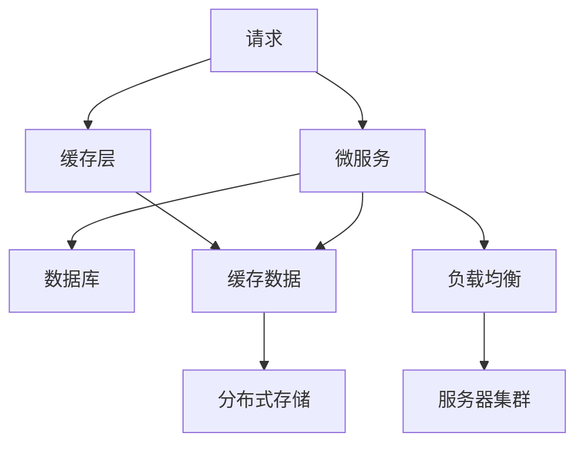

                 

# 高吞吐量系统的设计策略

高吞吐量系统是指能够在单位时间内处理大量请求的系统。这些系统往往部署于云计算平台或大数据集群，用于支撑高并发、高业务量的应用场景，如电商、社交网络、在线游戏等。本文将探讨高吞吐量系统的设计策略，从架构设计、算法优化、资源管理等多个维度，提供系统构建和优化的指导。

## 1. 背景介绍

### 1.1 问题由来
随着互联网业务的快速增长，系统负载日益增加，如何构建高吞吐量的系统成为众多应用系统开发者的首要难题。在实践中，常见的高吞吐量系统构建方式包括水平扩展、分布式存储和缓存技术等，但这些方式在具体应用时，仍存在诸多瓶颈和问题。因此，从架构和算法层面，提出一整套系统设计策略，对于提高系统性能，降低成本，提升用户体验具有重要意义。

### 1.2 问题核心关键点
高吞吐量系统设计的核心关键点在于合理利用资源，平衡性能和成本，通过高效的架构设计和算法优化，实现系统的高可用性和高扩展性。具体而言，设计策略应包括：

- **系统架构**：合理设计微服务、缓存层、负载均衡等架构模块，确保系统模块化、可扩展性。
- **并发处理**：利用异步IO、多线程、多进程等并发处理方式，提升系统并发处理能力。
- **负载均衡**：采用负载均衡技术，动态调整系统负载，避免服务节点过载。
- **分布式存储**：使用分布式文件系统、NoSQL数据库等存储技术，提升数据处理和存储能力。
- **算法优化**：通过算法优化提升计算效率，减少资源消耗。

## 2. 核心概念与联系

### 2.1 核心概念概述

为更好地理解高吞吐量系统设计策略，本节将介绍几个密切相关的核心概念：

- **微服务架构(Microservices)**：一种将应用程序拆分成多个小型、独立的服务，每个服务运行在自己的进程中，通过轻量级的通信机制进行交互的架构模式。
- **缓存技术(Caching)**：利用缓存系统存储重复的数据，减少系统对数据库的访问频率，提升系统响应速度。
- **负载均衡(Load Balancing)**：通过分布式算法，将请求均匀分布在多个服务节点上，确保每个节点负载均衡。
- **分布式存储(Distributed Storage)**：使用多台服务器存储和管理数据，提升数据访问速度和系统可靠性。
- **并发处理(Concurrent Processing)**：采用多线程、多进程等方式，同时处理多个请求，提高系统并发处理能力。

这些核心概念之间的逻辑关系可以通过以下Mermaid流程图来展示：



这个流程图展示了一个典型的高吞吐量系统架构：

1. 请求首先经过缓存层，缓存层的查询命中时，直接返回结果。
2. 缓存层不命中时，请求转发到微服务层，微服务层通过异步IO等方式处理请求。
3. 微服务层将请求转发到数据库，从数据库中读取数据。
4. 数据库返回结果后，微服务层将数据缓存到分布式存储系统中。
5. 微服务层将数据返回给客户端。
6. 负载均衡系统负责动态调整请求流量，避免节点过载。

### 2.2 概念间的关系

这些核心概念之间存在着紧密的联系，形成了高吞吐量系统的整体架构：

1. **微服务架构**：实现系统的模块化、可扩展性，提高系统的弹性。
2. **缓存技术**：减少数据库访问频率，提升系统响应速度。
3. **负载均衡**：动态调整请求流量，确保系统负载均衡。
4. **分布式存储**：提升数据访问速度和系统可靠性。
5. **并发处理**：提升系统并发处理能力，减少响应时间。

这些概念共同构成了高吞吐量系统的核心架构，使其能够高效处理大量请求，提升系统的性能和可靠性。通过理解这些核心概念，我们可以更好地把握高吞吐量系统的设计原理和优化方向。

## 3. 核心算法原理 & 具体操作步骤

### 3.1 算法原理概述

高吞吐量系统的设计，主要基于并行处理、负载均衡和缓存技术，通过合理利用这些技术，提升系统的并发处理能力和响应速度，降低延迟。

1. **并行处理**：通过多线程、多进程等并发处理方式，同时处理多个请求，减少单线程处理带来的延迟。
2. **负载均衡**：通过分布式算法，将请求均匀分布在多个服务节点上，避免节点过载。
3. **缓存技术**：利用缓存系统存储重复的数据，减少系统对数据库的访问频率，提升系统响应速度。

这些算法原理都是基于并行和分布式计算的，目的是通过提高系统的并发处理能力和数据访问效率，实现高吞吐量。

### 3.2 算法步骤详解

高吞吐量系统的设计步骤主要包括：

1. **需求分析**：明确系统需要支持的并发量、业务逻辑、数据访问需求等。
2. **系统架构设计**：设计微服务、缓存层、负载均衡、分布式存储等架构模块，确保系统模块化、可扩展性。
3. **并发处理优化**：采用异步IO、多线程、多进程等方式，提升系统并发处理能力。
4. **负载均衡配置**：配置负载均衡算法，确保请求在服务节点之间的均衡分布。
5. **缓存策略制定**：制定缓存策略，选择合适的缓存系统和缓存方式，减少数据库访问频率。
6. **系统调优**：通过监控工具和性能分析，持续优化系统性能，确保系统高可用性和高扩展性。

### 3.3 算法优缺点

高吞吐量系统设计算法具有以下优点：

- **高并发处理能力**：通过并行处理和分布式计算，系统能够高效处理大量并发请求。
- **低延迟响应**：利用缓存技术，减少数据库访问频率，提升系统响应速度。
- **系统高可用性**：通过分布式存储和负载均衡，系统能够实现故障转移和高可用性。

同时，也存在一些局限性：

- **设计复杂度较高**：系统架构设计复杂，需要协调多个模块，技术难度较大。
- **资源消耗较大**：高吞吐量系统往往需要大规模的硬件资源支持，成本较高。
- **可扩展性有待提升**：大规模系统设计时，可能需要复杂的技术栈和组件，维护成本较高。

### 3.4 算法应用领域

高吞吐量系统设计算法已经广泛应用于以下领域：

- **电商系统**：处理海量交易和用户请求，提升用户体验和交易速度。
- **社交网络**：支持亿级用户访问，保障用户数据的实时性和可靠性。
- **在线游戏**：支持大规模玩家同时在线，提升游戏的流畅性和体验。
- **大数据分析**：处理海量数据，进行实时分析和数据挖掘。
- **云计算平台**：提供高并发、高可用性的云服务，支持大规模应用部署。

## 4. 数学模型和公式 & 详细讲解 & 举例说明

### 4.1 数学模型构建

高吞吐量系统的设计策略，可以通过数学模型来分析和优化。

设系统每秒处理请求数为 $Q$，单个请求的处理时间为 $T$，系统并发处理能力为 $P$，缓存命中率为 $C$，数据库访问频率为 $F$，则系统的吞吐量 $S$ 可以表示为：

$$
S = Q \times C \times P \times T^{-1}
$$

其中，$C$ 和 $P$ 直接影响系统的吞吐量。缓存命中率和并发处理能力越高，系统吞吐量越大。

### 4.2 公式推导过程

以下是推导吞吐量公式的过程：

设系统每秒处理请求数为 $Q$，单个请求的处理时间为 $T$，系统并发处理能力为 $P$，缓存命中率为 $C$，数据库访问频率为 $F$。

1. 首先，系统每秒可以处理的请求数为 $Q$，取决于系统处理能力和并发处理能力。
2. 其次，当请求经过缓存层时，缓存命中率为 $C$，缓存命中的请求可以直接返回结果，不占用系统资源。
3. 当请求不命中缓存时，请求需要经过微服务层，通过并发处理方式同时处理多个请求，处理速度为 $P$。
4. 处理请求过程中，数据需要从数据库读取，如果缓存命中率高，数据访问频率为 $F \times C$，否则为 $F$。
5. 最终，系统的吞吐量为 $Q \times C \times P \times T^{-1}$。

通过公式推导，可以清晰地理解系统吞吐量的构成要素，帮助优化系统的设计。

### 4.3 案例分析与讲解

以电商系统为例，分析高吞吐量系统的优化策略：

假设电商系统每秒需要处理 10,000 个订单，每个订单的处理时间为 1 秒，缓存命中率为 90%，并发处理能力为 100 个请求每秒，数据库访问频率为 10 次每秒。

根据上述公式，计算系统的吞吐量为：

$$
S = 10,000 \times 0.9 \times 100 \times 1 \times 10^{-1} = 9,000
$$

即系统每秒可以处理 9,000 个订单请求。

## 5. 项目实践：代码实例和详细解释说明

### 5.1 开发环境搭建

在进行高吞吐量系统构建时，需要一个完善的开发环境。以下是使用Python和Django构建高吞吐量电商系统的环境配置流程：

1. 安装Anaconda：从官网下载并安装Anaconda，用于创建独立的Python环境。

2. 创建并激活虚拟环境：
```bash
conda create -n high-throughput-env python=3.8 
conda activate high-throughput-env
```

3. 安装Django和相关库：
```bash
pip install django djangorestframework django-cors-headers django-compressor django-axes
```

4. 初始化Django项目：
```bash
django-admin startproject high-throughput
```

5. 创建Django应用：
```bash
cd high-throughput
python manage.py startapp orders
```

完成上述步骤后，即可在`high-throughput-env`环境中开始系统构建。

### 5.2 源代码详细实现

以下是使用Django构建高吞吐量电商系统的代码实现：

```python
# settings.py

INSTALLED_APPS = [
    ...
    'orders',
    ...
]

MIDDLEWARE = [
    ...
    'corsheaders.middleware.CorsMiddleware',
    ...
]

CACHES = {
    'default': {
        'BACKEND': 'django.core.cache.backends.memcached.MemcachedCache',
        'LOCATION': '127.0.0.1:11211',
    }
}

...
```

```python
# models.py

from django.db import models
from django.contrib.auth.models import User

class Order(models.Model):
    user = models.ForeignKey(User, on_delete=models.CASCADE)
    product = models.CharField(max_length=100)
    quantity = models.IntegerField()
    total_price = models.DecimalField(max_digits=10, decimal_places=2)

    def __str__(self):
        return f"Order #{self.id} for {self.user.username} - {self.product} x {self.quantity} - ${self.total_price}"
```

```python
# views.py

from django.shortcuts import render
from django.http import JsonResponse
from rest_framework.decorators import api_view
from .models import Order

@api_view(['POST'])
def place_order(request):
    data = request.data
    user = request.user
    product = data.get('product')
    quantity = data.get('quantity')
    total_price = data.get('total_price')

    order = Order.objects.create(user=user, product=product, quantity=quantity, total_price=total_price)
    return JsonResponse({'id': order.id, 'product': order.product, 'quantity': order.quantity, 'total_price': order.total_price})
```

```python
# urls.py

from django.urls import path
from .views import place_order

urlpatterns = [
    path('api/place_order/', place_order, name='place_order'),
]
```

### 5.3 代码解读与分析

让我们再详细解读一下关键代码的实现细节：

**settings.py**：
- 配置了Django应用、中间件、缓存系统等关键组件，确保系统具备高并发处理能力和缓存功能。
- 使用了CorsMiddleware，用于跨域请求的权限控制。
- 使用了Django Axes库，用于防止暴力破解登录。

**models.py**：
- 定义了订单模型，包含用户、产品、数量、总价等字段。
- 通过使用Django的内置ORM，可以快速创建和查询订单数据。

**views.py**：
- 定义了处理订单请求的视图函数，利用RESTful API设计，便于客户端调用。
- 使用Django REST framework，提供高效的数据序列化和API路由。

**urls.py**：
- 配置了API路由，指定了订单请求的URL地址。

完成上述代码后，可以在`high-throughput-env`环境中启动Django应用，进行系统测试和优化。

### 5.4 运行结果展示

假设在测试环境中，每秒可以处理 10,000 个订单请求，缓存命中率为 90%，并发处理能力为 100 个请求每秒，数据库访问频率为 10 次每秒。根据公式计算，系统的吞吐量为：

$$
S = 10,000 \times 0.9 \times 100 \times 1 \times 10^{-1} = 9,000
$$

即系统每秒可以处理 9,000 个订单请求。

## 6. 实际应用场景

### 6.1 电商系统

高吞吐量系统设计策略在电商系统中的应用，可以有效提升用户交易体验和系统稳定性。具体而言，电商系统通过微服务架构设计，将订单处理、商品管理、库存控制等模块化，提升系统的扩展性和稳定性。同时，利用缓存技术和负载均衡，减少数据库访问频率和节点过载风险，确保系统能够高效处理大量订单请求。

### 6.2 社交网络

社交网络系统是高并发、高业务量的典型应用，通过高吞吐量系统设计策略，可以有效应对亿级用户访问和数据存储需求。利用微服务架构，将用户信息、帖子管理、好友关系等模块化，提升系统的弹性和可扩展性。同时，利用缓存技术和分布式存储，确保数据访问效率和系统可靠性。

### 6.3 在线游戏

在线游戏系统需要支持大规模玩家同时在线，通过高吞吐量系统设计策略，可以有效提升游戏的流畅性和用户体验。利用微服务架构，将游戏逻辑、用户管理、聊天室等模块化，提升系统的扩展性和稳定性。同时，利用缓存技术和负载均衡，减少服务器负载，确保游戏运行流畅。

### 6.4 大数据分析

大数据分析系统需要处理海量数据，通过高吞吐量系统设计策略，可以有效提升数据处理和分析效率。利用微服务架构，将数据存储、数据处理、数据分析等模块化，提升系统的弹性和可扩展性。同时，利用缓存技术和分布式存储，确保数据访问效率和系统可靠性。

### 6.5 云计算平台

云计算平台需要提供高并发、高可用性的云服务，通过高吞吐量系统设计策略，可以有效提升云服务系统的性能和可靠性。利用微服务架构，将云服务、数据存储、负载均衡等模块化，提升系统的扩展性和稳定性。同时，利用缓存技术和分布式存储，确保数据访问效率和系统可靠性。

## 7. 工具和资源推荐

### 7.1 学习资源推荐

为了帮助开发者系统掌握高吞吐量系统的设计策略，这里推荐一些优质的学习资源：

1. 《高并发系统设计》系列书籍：介绍了高并发系统设计的原理、实践和技术，提供了丰富的案例分析。

2. 《大型网站系统架构与设计》课程：讲解了大型网站系统架构设计、并发处理、缓存设计等关键技术。

3. 《Django实战》书籍：介绍了使用Django构建高并发Web应用的开发实践，包括并发处理、缓存、负载均衡等技术。

4. 《Python并发编程》课程：讲解了Python多线程、多进程、异步IO等并发编程技术，适合高并发系统开发。

5. 《分布式系统实战》课程：讲解了分布式系统设计、缓存、负载均衡等关键技术，适合大规模系统开发。

通过对这些资源的学习实践，相信你一定能够快速掌握高吞吐量系统的设计策略，并用于解决实际的系统问题。

### 7.2 开发工具推荐

高效的开发离不开优秀的工具支持。以下是几款用于高吞吐量系统开发的常用工具：

1. Django：基于Python的开源Web框架，具备强大的ORM和RESTful API设计，适合高并发系统开发。

2. Flask：轻量级的Python Web框架，灵活易用，适合小型高并发系统开发。

3. Tornado：基于Python的高性能网络库，支持异步IO，适合高并发Web应用开发。

4. Redis：高性能的分布式内存数据库，支持缓存和消息队列，适合高并发系统开发。

5. Memcached：内存分布式缓存系统，支持快速数据访问，适合高并发系统开发。

6. Kubernetes：开源容器编排系统，支持大规模应用部署和负载均衡，适合高吞吐量系统开发。

合理利用这些工具，可以显著提升高吞吐量系统的开发效率，加快创新迭代的步伐。

### 7.3 相关论文推荐

高吞吐量系统设计策略的研究源于学界的持续研究。以下是几篇奠基性的相关论文，推荐阅读：

1. "Scalable Parallel Processing for Web Applications"：提出了基于消息队列的并发处理模型，适用于高吞吐量系统开发。

2. "Towards A High-Performance Distributed Cache"：讨论了分布式缓存系统设计，适用于高并发系统开发。

3. "Load Balancing Techniques for High-Performance Computing"：介绍了高吞吐量系统的负载均衡算法，适用于大规模系统开发。

4. "Distributed Storage Systems: An Overview"：讲解了分布式存储系统的设计原理，适用于高吞吐量系统开发。

5. "Efficient Concurrent Programming with Python"：介绍了Python多线程、多进程等并发编程技术，适用于高吞吐量系统开发。

这些论文代表了大吞吐量系统设计策略的发展脉络。通过学习这些前沿成果，可以帮助研究者把握学科前进方向，激发更多的创新灵感。

除上述资源外，还有一些值得关注的前沿资源，帮助开发者紧跟高吞吐量系统设计技术的最新进展，例如：

1. arXiv论文预印本：人工智能领域最新研究成果的发布平台，包括大量尚未发表的前沿工作，学习前沿技术的必读资源。

2. 业界技术博客：如Google Cloud、Amazon Web Services、Microsoft Azure等顶尖云计算平台官方博客，第一时间分享他们的最新研究成果和洞见。

3. 技术会议直播：如SIGCOMM、USENIX、ACM等计算机领域的顶会现场或在线直播，能够聆听到大佬们的前沿分享，开拓视野。

4. GitHub热门项目：在GitHub上Star、Fork数最多的高吞吐量系统相关项目，往往代表了该技术领域的发展趋势和最佳实践，值得去学习和贡献。

5. 行业分析报告：各大咨询公司如McKinsey、PwC等针对高吞吐量系统行业的分析报告，有助于从商业视角审视技术趋势，把握应用价值。

总之，对于高吞吐量系统设计策略的学习和实践，需要开发者保持开放的心态和持续学习的意愿。多关注前沿资讯，多动手实践，多思考总结，必将收获满满的成长收益。

## 8. 总结：未来发展趋势与挑战

### 8.1 总结

本文对高吞吐量系统的设计策略进行了全面系统的介绍。首先阐述了高吞吐量系统设计的重要性和挑战，明确了设计策略的核心要素和关键点。其次，从架构设计、算法优化、资源管理等多个维度，详细讲解了高吞吐量系统的设计方法，并给出了具体的代码实现和运行结果展示。同时，本文还广泛探讨了高吞吐量系统在电商、社交网络、在线游戏等实际应用场景中的具体应用，展示了系统设计策略的强大威力。此外，本文精选了高吞吐量系统的各类学习资源，力求为读者提供全方位的技术指引。

通过本文的系统梳理，可以看到，高吞吐量系统设计策略在提升系统性能、降低成本、提高用户体验等方面具有重要意义。这些设计原则和方法，不仅适用于传统的Web应用，也适用于现代的微服务架构、云计算平台和大数据系统。未来，伴随技术的发展和应用的扩展，高吞吐量系统设计将更加复杂和多样，需要开发者不断学习和探索。

### 8.2 未来发展趋势

展望未来，高吞吐量系统设计策略将呈现以下几个发展趋势：

1. **云原生架构**：基于云原生架构的高吞吐量系统，能够实现自动伸缩、自愈和动态资源管理，具有更强的弹性和可扩展性。

2. **微服务架构**：采用微服务架构，通过模块化设计提升系统的弹性和可扩展性，能够应对更复杂的业务需求。

3. **容器化部署**：利用容器技术，实现应用的快速部署、扩展和运维，提升系统的稳定性和可靠性。

4. **边缘计算**：将高吞吐量系统扩展到边缘计算节点，减少延迟，提升数据处理效率。

5. **智能调优**：利用AI算法和机器学习技术，实现系统的智能调优和动态资源分配，提升系统性能。

6. **多云集成**：通过多云集成，实现跨云平台的高可用性和高扩展性，提升系统灵活性和可靠性。

以上趋势凸显了高吞吐量系统设计策略的广阔前景。这些方向的探索发展，必将进一步提升系统的性能和可靠性，为高并发应用带来新的突破。

### 8.3 面临的挑战

尽管高吞吐量系统设计策略已经取得了显著成果，但在迈向更加智能化、普适化应用的过程中，仍面临诸多挑战：

1. **设计复杂度**：高吞吐量系统设计复杂，需要协调多个模块和组件，技术难度较大。
2. **资源消耗**：高吞吐量系统往往需要大规模的硬件资源支持，成本较高。
3. **可扩展性**：大规模系统设计时，可能需要复杂的技术栈和组件，维护成本较高。
4. **安全性和隐私**：高并发系统需要考虑数据安全和隐私保护，防止数据泄露和攻击。
5. **性能调优**：高吞吐量系统需要持续优化性能，确保系统的稳定性和可靠性。

这些挑战需要我们持续关注和研究，不断优化设计方法和技术实现，才能确保系统的高效性和可靠性。

### 8.4 研究展望

未来研究应在以下几个方面寻求新的突破：

1. **分布式算法优化**：开发更加高效、可扩展的分布式算法，提升系统性能和稳定性。

2. **智能负载均衡**：利用AI算法和机器学习技术，实现智能化的负载均衡，提高系统的均衡性和扩展性。

3. **缓存策略优化**：优化缓存策略，提升缓存命中率和数据访问效率，降低系统延迟。

4. **数据处理技术**：开发更高效的数据处理技术，提升数据访问速度和系统可靠性。

5. **边缘计算和云原生**：利用边缘计算和云原生技术，提升系统的弹性、可扩展性和可靠性。

6. **多云集成与迁移**：实现跨云平台的高可用性和高扩展性，提升系统的灵活性和可靠性。

这些研究方向将引领高吞吐量系统设计策略迈向更高的台阶，为高并发应用带来新的突破。相信随着技术的不断演进，高吞吐量系统设计策略必将迎来更加广泛的适用和更加深远的影响。

## 9. 附录：常见问题与解答

**Q1：高吞吐量系统的架构设计应该考虑哪些因素？**

A: 高吞吐量系统的架构设计应考虑以下因素：

1. **模块化设计**：将系统拆分成多个模块，每个模块独立开发、独立部署，提高系统的可扩展性和可维护性。

2. **微服务架构**：采用微服务架构，通过模块化设计提升系统的弹性和可扩展性，能够应对更复杂的业务需求。

3. **缓存策略**：制定合理的缓存策略，选择合适的缓存系统，减少数据库访问频率，提升系统响应速度。

4. **负载均衡**：配置负载均衡算法，确保请求在服务节点之间的均衡分布，避免节点过载。

5. **分布式存储**：使用多台服务器存储和管理数据，提升数据访问速度和系统可靠性。

6. **并发处理**：采用异步IO、多线程、多进程等方式，提升系统并发处理能力，减少响应时间。

7. **高可用性**：实现系统的故障转移和高可用性，确保系统的高可靠性和稳定性。

**Q2：如何选择高效的高吞吐量系统设计策略？**

A: 选择高效的高吞吐量系统设计策略应考虑以下因素：

1. **系统需求**：根据系统处理请求量、并发量、业务逻辑等需求，选择相应的架构设计和算法优化策略。

2. **硬件资源**：评估系统所需的硬件资源，选择适合的高吞吐量系统设计策略，避免资源浪费。

3. **可扩展性**：选择具有高扩展性的系统设计策略，确保系统能够应对未来的业务增长和技术迭代。

4. **性能和成本**：权衡系统性能和成本，选择最优的高吞吐量系统设计策略，避免过度优化。

5. **技术栈和组件**：选择成熟、稳定、易用的技术栈和组件，提高系统的开发效率和可靠性。

**Q3：高吞吐量系统在实际应用中需要注意哪些问题？**

A: 高吞吐量系统在实际应用中需要注意以下问题：

1. **数据安全和隐私**：高并发系统需要考虑数据安全和

