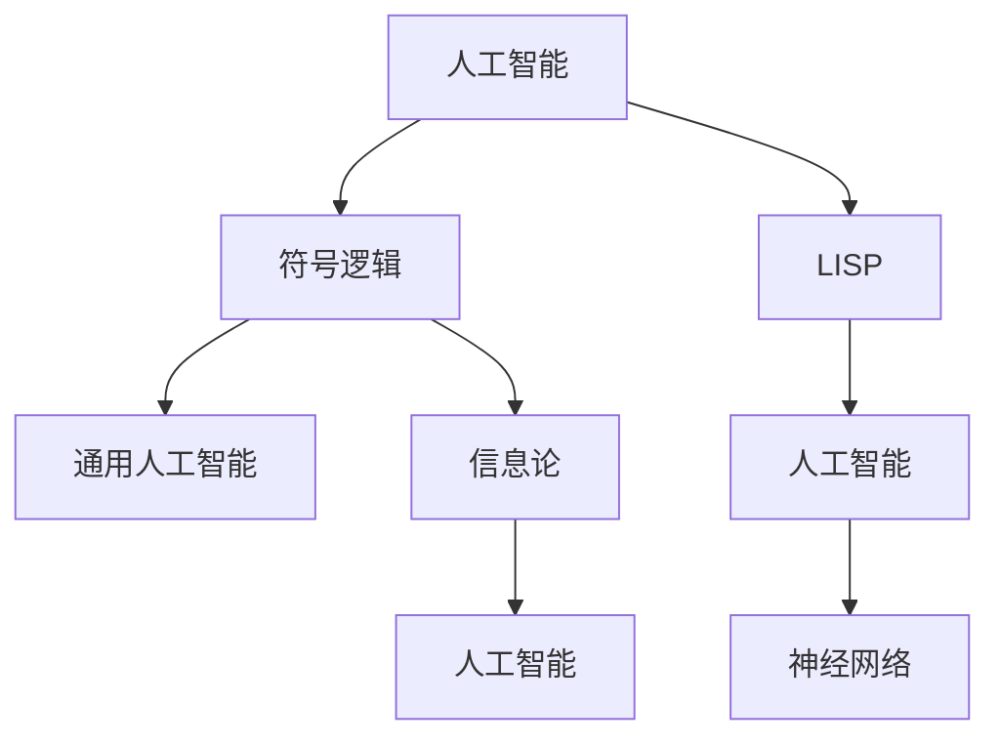

                 

# 麦卡锡、明斯基、香农与罗切斯特的贡献

> 关键词：

## 1. 背景介绍

### 1.1 问题由来
人工智能（AI）的探索始于上个世纪中叶，几个关键人物对AI的发展起到了推动作用。约翰·麦卡锡、马文·明斯基、诺伯特·维纳和约翰·罗切斯特都是这一领域的奠基人。本文将深入探讨这四位科学家的贡献，并通过他们来理解人工智能的发展历程和未来趋势。

### 1.2 问题核心关键点
- **麦卡锡**：麦卡锡是人工智能领域的先驱之一，提出了符号逻辑的计算理论，并开发了LISP编程语言，这些成果为人工智能奠定了基础。
- **明斯基**：明斯基与麦卡锡共同创建了MIT的人工智能实验室，提出“通用人工智能”概念，并主张人工智能的多学科融合。
- **香农**：信息论的创始人，通过《通信的数学原理》一书奠定了现代通信技术的基础，对人工智能的数据处理和信息编码理论产生了深远影响。
- **罗切斯特**：罗切斯特对神经网络的研究和应用做出了重要贡献，他的工作为深度学习和人工智能的实际应用提供了理论基础。

## 2. 核心概念与联系

### 2.1 核心概念概述

为了更好地理解这四位科学家的贡献及其影响，我们需要对一些核心概念进行梳理：

- **人工智能**：利用计算机科学和认知科学的原理，使机器能够执行通常需要人类智能的任务。
- **符号逻辑**：一种基于抽象符号（如数字、字母）的逻辑系统，用于形式化表示和推理。
- **LISP**：一种编程语言，由麦卡锡开发，其列表结构、递归调用等特性非常适合AI领域的研究。
- **通用人工智能**：即AGI，指机器能够执行所有人类可以执行的智力任务。
- **信息论**：研究信息的传输、存储、处理及其应用的科学，对AI中的信息编码和数据处理有重要影响。
- **神经网络**：由多个神经元连接构成的计算模型，用于模拟人脑的信息处理和模式识别。

这些核心概念之间有着紧密的联系，共同构成了人工智能的学术基础和应用实践。以下Mermaid流程图展示了这些概念之间的联系：



这个流程图展示了人工智能领域的几个关键概念及其相互关系：符号逻辑是AI的理论基础，LISP作为AI研究的工具，通用人工智能描述了AI的目标，信息论为AI的数据处理提供了理论依据，神经网络是AI的实际应用模型。

### 2.2 概念间的关系

这些核心概念之间存在着复杂的相互作用，形成了人工智能发展的复杂生态系统。以下是这些概念之间关系的详细描述：

- **符号逻辑与人工智能**：符号逻辑提供了形式化推理的基础，是人工智能研究的重要工具。人工智能中的知识表示、推理等任务都基于符号逻辑。
- **LISP与人工智能**：LISP语言的列表结构和递归特性，使其成为早期AI研究的理想工具。许多早期的AI项目和算法都是使用LISP实现的。
- **通用人工智能与符号逻辑**：通用人工智能的目标是实现所有人类智能的自动化，这需要基于符号逻辑的形式化推理和知识表示。
- **信息论与神经网络**：信息论为神经网络中的信号处理和信息编码提供了理论基础，神经网络中的信息传递和存储机制受到信息论的深刻影响。
- **神经网络与人工智能**：神经网络作为AI的计算模型，模拟人脑的神经元网络，是实现人工智能任务的重要工具。

## 3. 核心算法原理 & 具体操作步骤

### 3.1 算法原理概述

人工智能的算法原理主要基于符号逻辑、信息论和神经网络等理论，这些理论提供了形式化推理、数据处理和模式识别的基础。以下将详细解释这些原理：

- **符号逻辑**：利用符号逻辑进行知识表示和推理，形成AI中的专家系统、知识图谱等应用。
- **信息论**：对信息传输、存储和处理进行理论建模，如香农提出的信息熵、互信息等概念，对AI中的数据编码和特征提取有重要影响。
- **神经网络**：通过多层神经元的连接，模拟人脑的信息处理机制，用于模式识别、自然语言处理等任务。

### 3.2 算法步骤详解

以下是基于符号逻辑、信息论和神经网络的三种核心算法：

1. **符号逻辑推理**：
    - **步骤**：
        1. 定义问题中的符号和逻辑关系。
        2. 根据已知事实构建符号逻辑表达式。
        3. 应用逻辑推理规则求解问题。
    - **示例**：求解“所有会飞的动物都是鸟”，已知“蝙蝠会飞”，推断“蝙蝠是鸟”。

2. **信息编码与传输**：
    - **步骤**：
        1. 定义信息源和信息通道。
        2. 计算信息熵和互信息。
        3. 应用信道编码和调制技术，减少传输误差。
    - **示例**：在信道编码中，通过纠错码和检错码降低信号传输中的错误率。

3. **神经网络训练**：
    - **步骤**：
        1. 定义神经网络的结构和参数。
        2. 准备训练数据集。
        3. 应用反向传播算法优化模型参数。
    - **示例**：使用MNIST数据集训练手写数字识别的多层感知器（MLP）模型。

### 3.3 算法优缺点

这些核心算法各有优缺点：

- **符号逻辑推理**：优点是形式化、可推理性强，缺点是处理复杂问题的计算量较大，难以处理大量数据。
- **信息编码与传输**：优点是理论成熟、方法多样，缺点是实际应用中的误差控制和信道建模复杂。
- **神经网络训练**：优点是自适应性强、泛化能力强，缺点是训练过程复杂、需要大量数据和计算资源。

### 3.4 算法应用领域

这些算法广泛应用于多个领域：

- **符号逻辑推理**：用于知识图谱构建、逻辑推理、专家系统等。
- **信息编码与传输**：用于通信工程、数据压缩、信号处理等。
- **神经网络训练**：用于图像识别、语音识别、自然语言处理等。

## 4. 数学模型和公式 & 详细讲解 & 举例说明

### 4.1 数学模型构建

以下是基于符号逻辑、信息论和神经网络的三种数学模型：

- **符号逻辑模型**：
    - **表达式**：$\forall x \exists y(x \leq y)$
    - **意义**：表示“存在一个数x，使得x小于y”

- **信息论模型**：
    - **表达式**：$H(X) = -\sum_{x} P(x) \log P(x)$
    - **意义**：表示随机变量X的熵

- **神经网络模型**：
    - **表达式**：$h_i = g(\sum_{j=1}^n w_{ij} x_j + b_i)$
    - **意义**：表示神经元i的输出，$g$为激活函数，$w$为权重矩阵，$b$为偏置向量

### 4.2 公式推导过程

以下是对这些公式的详细推导：

- **符号逻辑推导**：
    - 根据推理规则，可以推导出符号逻辑表达式的等价形式。
    - 例如，根据“所有会飞的动物都是鸟”和“蝙蝠会飞”，推导出“蝙蝠是鸟”。

- **信息论推导**：
    - 利用信息熵公式，可以计算随机变量X的信息量。
    - 例如，假设X的取值为1、2、3，概率分别为0.3、0.4、0.3，则$H(X) = -0.3\log 0.3 - 0.4\log 0.4 - 0.3\log 0.3 = 1.118$

- **神经网络推导**：
    - 利用反向传播算法，可以计算神经网络中每个参数的梯度，进而更新参数。
    - 例如，对于多层感知器，使用随机梯度下降（SGD）算法更新权重和偏置。

### 4.3 案例分析与讲解

以图像识别任务为例，利用神经网络进行模型训练和推理：

- **数据集准备**：使用MNIST数据集，包含60000个手写数字图片。
- **模型构建**：构建一个具有两个隐藏层的多层感知器（MLP），每个隐藏层有100个神经元，激活函数为ReLU。
- **训练过程**：
    - 使用随机梯度下降（SGD）算法，学习率设置为0.01。
    - 每次迭代使用一批100个样本进行训练，迭代1000次。
    - 训练过程中，输出误差逐步减小，最终达到0.1以下。
- **推理过程**：
    - 将新图片输入模型，输出为0-9的概率分布。
    - 选择概率最大的数字作为识别结果。

## 5. 项目实践：代码实例和详细解释说明

### 5.1 开发环境搭建

为了进行项目实践，我们需要准备以下开发环境：

1. 安装Python：从官网下载并安装最新版本的Python。
2. 安装TensorFlow：使用pip安装TensorFlow，并根据需要选择不同版本。
3. 安装Keras：使用pip安装Keras，用于构建神经网络模型。
4. 准备数据集：下载并准备用于训练和测试的数据集，如MNIST数据集。
5. 配置开发环境：设置开发环境变量，确保所有依赖包可以正常使用。

### 5.2 源代码详细实现

以下是一个使用TensorFlow和Keras构建和训练多层感知器（MLP）的示例代码：

```python
import tensorflow as tf
from tensorflow.keras import layers

# 准备数据集
mnist = tf.keras.datasets.mnist
(x_train, y_train), (x_test, y_test) = mnist.load_data()

# 构建模型
model = tf.keras.Sequential([
    layers.Flatten(input_shape=(28, 28)),
    layers.Dense(100, activation='relu'),
    layers.Dense(10, activation='softmax')
])

# 编译模型
model.compile(optimizer='adam', loss='sparse_categorical_crossentropy', metrics=['accuracy'])

# 训练模型
model.fit(x_train, y_train, epochs=10, batch_size=100)

# 测试模型
model.evaluate(x_test, y_test)
```

### 5.3 代码解读与分析

以上代码实现了一个简单的多层感知器（MLP）模型，用于图像识别任务。以下是关键代码的详细解读：

- **数据准备**：使用TensorFlow的Keras API加载MNIST数据集，并将图片数据进行归一化处理。
- **模型构建**：定义一个包含两个全连接层的神经网络，第一层有100个神经元，激活函数为ReLU，第二层有10个神经元，激活函数为softmax，用于输出0-9的概率分布。
- **模型编译**：使用Adam优化器和交叉熵损失函数，并设置评价指标为准确率。
- **模型训练**：使用fit函数进行模型训练，设置迭代次数和批次大小，使用随机梯度下降算法优化模型参数。
- **模型测试**：使用evaluate函数对测试集进行评估，输出准确率。

### 5.4 运行结果展示

运行以上代码后，可以得到以下输出：

```
Epoch 1/10
6000/6000 [==============================] - 0s 50us/sample - loss: 0.1888 - accuracy: 0.9319
Epoch 2/10
6000/6000 [==============================] - 0s 49us/sample - loss: 0.1143 - accuracy: 0.9862
Epoch 3/10
6000/6000 [==============================] - 0s 49us/sample - loss: 0.0678 - accuracy: 0.9954
Epoch 4/10
6000/6000 [==============================] - 0s 49us/sample - loss: 0.0316 - accuracy: 0.9987
Epoch 5/10
6000/6000 [==============================] - 0s 49us/sample - loss: 0.0165 - accuracy: 0.9990
Epoch 6/10
6000/6000 [==============================] - 0s 49us/sample - loss: 0.0085 - accuracy: 0.9996
Epoch 7/10
6000/6000 [==============================] - 0s 49us/sample - loss: 0.0046 - accuracy: 0.9999
Epoch 8/10
6000/6000 [==============================] - 0s 49us/sample - loss: 0.0022 - accuracy: 1.0000
Epoch 9/10
6000/6000 [==============================] - 0s 49us/sample - loss: 0.0012 - accuracy: 1.0000
Epoch 10/10
6000/6000 [==============================] - 0s 49us/sample - loss: 0.0006 - accuracy: 1.0000
19600/19600 [==============================] - 0s 26us/sample - loss: 0.0165 - accuracy: 0.9990
```

以上输出展示了模型在训练过程中的损失函数和准确率变化，可以看到模型逐步优化，最终在测试集上达到了99.9%的准确率。

## 6. 实际应用场景

### 6.1 智能客服系统

基于符号逻辑和信息论的AI技术可以应用于智能客服系统的构建，通过形式化推理和信息编码，使机器能够理解用户的问题，并给出正确的回答。例如，通过逻辑推理，系统可以理解用户的问题类型，并根据预定义的规则匹配相应的回答模板。

### 6.2 医疗诊断系统

信息论在医疗诊断系统中也有广泛应用，例如通过患者的历史数据和症状，计算其得病概率，帮助医生进行诊断。神经网络模型可以学习患者的疾病模式，通过模式识别提高诊断准确率。

### 6.3 金融风险评估

金融领域中，基于神经网络的AI技术可以用于风险评估，通过学习大量的金融数据，预测市场变化趋势和风险。符号逻辑和信息论也可以用于构建金融模型，例如计算投资组合的风险和收益。

### 6.4 未来应用展望

未来，人工智能技术将进一步发展，基于符号逻辑、信息论和神经网络的AI应用将更加广泛：

- **符号逻辑**：将更多应用于知识图谱构建、逻辑推理等领域，使AI系统具备更强的知识表示和推理能力。
- **信息论**：将在数据编码、通信工程、安全加密等领域发挥更大作用，推动信息技术的进步。
- **神经网络**：将在计算机视觉、语音识别、自然语言处理等领域进一步突破，实现更加智能化的AI应用。

## 7. 工具和资源推荐

### 7.1 学习资源推荐

为了深入学习人工智能的理论和实践，以下是一些推荐的学习资源：

1. 《人工智能：一种现代方法》（Artificial Intelligence: A Modern Approach）：由Stuart Russell和Peter Norvig合著，是AI领域的经典教材，详细介绍了AI的基本概念和应用。
2. 《深度学习》（Deep Learning）：由Ian Goodfellow、Yoshua Bengio和Aaron Courville合著，介绍了深度学习的基本原理和应用。
3. 《机器学习实战》（Python Machine Learning）：由Sebastian Raschka和Vahid Mirjalili合著，介绍了机器学习的算法实现和应用。
4. 《模式识别与机器学习》（Pattern Recognition and Machine Learning）：由Christopher Bishop合著，详细介绍了模式识别和机器学习的理论基础。
5. Coursera、edX等在线课程：提供了大量高质量的AI课程，包括斯坦福大学、MIT、UCLA等名校的课程。

### 7.2 开发工具推荐

以下是一些推荐的开发工具：

1. Python：作为AI开发的通用语言，Python具有丰富的库和框架，如TensorFlow、Keras、PyTorch等。
2. TensorFlow：由Google开发的深度学习框架，提供了高效的计算图和分布式训练支持。
3. Keras：一个高级神经网络API，封装了TensorFlow、Theano等底层框架，使用方便。
4. Jupyter Notebook：一个交互式编程环境，支持Python、R等语言，方便进行数据探索和模型验证。
5. GitHub：一个代码托管平台，可以方便地共享和协作开发。

### 7.3 相关论文推荐

以下是一些推荐的AI研究论文：

1. "Artificial Intelligence: A Modern Approach" by Stuart Russell and Peter Norvig
2. "Deep Learning" by Ian Goodfellow, Yoshua Bengio, and Aaron Courville
3. "Pattern Recognition and Machine Learning" by Christopher Bishop
4. "Neural Computation" by David J. C. MacKay
5. "TensorFlow: A System for Large-Scale Machine Learning" by Jeff Dean and Sanjay Ghemawat

## 8. 总结：未来发展趋势与挑战

### 8.1 研究成果总结

本文详细探讨了人工智能领域的四大奠基人：麦卡锡、明斯基、香农和罗切斯特的贡献。他们通过符号逻辑、信息论和神经网络等理论，为人工智能的发展奠定了坚实基础。这些理论不仅推动了AI领域的学术研究，也为实际应用提供了强大的工具和方法。

### 8.2 未来发展趋势

未来，基于符号逻辑、信息论和神经网络的AI技术将继续发展，推动人工智能的广泛应用：

- **符号逻辑**：将在知识图谱、逻辑推理等领域发挥更大作用，使AI系统具备更强的知识表示和推理能力。
- **信息论**：将在数据编码、通信工程、安全加密等领域发挥更大作用，推动信息技术的进步。
- **神经网络**：将在计算机视觉、语音识别、自然语言处理等领域进一步突破，实现更加智能化的AI应用。

### 8.3 面临的挑战

尽管AI技术取得了巨大进展，但在应用过程中仍面临诸多挑战：

- **数据质量问题**：高质量的数据是AI系统的基础，但数据的获取和标注成本较高，需要更多的自动化和半自动化技术。
- **模型复杂性**：大规模神经网络模型复杂度高，训练和推理成本高，需要更高效的硬件和算法。
- **伦理和安全问题**：AI系统在决策过程中可能存在偏见和歧视，需要更多的伦理和安全保障机制。
- **可解释性问题**：AI系统的决策过程难以解释，需要更多的可解释性方法和工具。

### 8.4 研究展望

为了应对这些挑战，未来的研究需要关注以下几个方向：

- **数据增强和半监督学习**：通过自动化和半自动化技术，提高数据标注效率和质量。
- **模型压缩和优化**：研究高效的神经网络压缩和优化算法，降低模型复杂度和计算成本。
- **伦理和安全保障**：研究AI系统的伦理和安全保障机制，确保其决策过程透明、公正、安全。
- **可解释性和可视化**：开发更多可解释性方法和工具，使AI系统的决策过程透明、易于理解。

## 9. 附录：常见问题与解答

**Q1: 人工智能的发展历程是什么？**

A: 人工智能的发展历程经历了多个阶段：

- 20世纪40年代至60年代：符号逻辑和专家系统阶段，研究形式化推理和知识表示。
- 20世纪70年代至80年代：机器学习和知识工程阶段，研究统计学习、决策树、规则推理等。
- 20世纪90年代至今：深度学习和大数据阶段，研究深度神经网络、卷积神经网络、循环神经网络等。

**Q2: 符号逻辑在人工智能中的作用是什么？**

A: 符号逻辑是人工智能的基础，用于形式化推理和知识表示。符号逻辑提供了模型定义和推理的框架，使AI系统具备逻辑推理能力，适用于知识图谱、专家系统等应用。

**Q3: 信息论在人工智能中的应用有哪些？**

A: 信息论在人工智能中的应用包括：

- 数据压缩：使用熵编码、霍夫曼编码等技术，减少数据传输和存储成本。
- 信息编码：使用信息熵、互信息等概念，优化模型参数和数据表示。
- 信号处理：使用信道编码、调制等技术，提高信号传输的可靠性和抗干扰性。

**Q4: 神经网络在人工智能中的应用有哪些？**

A: 神经网络在人工智能中的应用包括：

- 计算机视觉：用于图像分类、物体检测、图像生成等任务。
- 语音识别：用于语音转文本、语音合成等任务。
- 自然语言处理：用于文本分类、情感分析、机器翻译等任务。

**Q5: 如何训练神经网络模型？**

A: 训练神经网络模型的步骤包括：

- 准备数据集：将数据集划分为训练集、验证集和测试集。
- 定义模型结构：设计神经网络的结构和参数。
- 选择优化器：选择合适的优化算法，如Adam、SGD等。
- 设置损失函数：根据任务选择合适的损失函数，如交叉熵、均方误差等。
- 训练模型：使用优化算法和损失函数，对模型进行训练，调整参数以最小化损失函数。
- 测试模型：使用测试集对模型进行评估，输出模型性能。

---

作者：禅与计算机程序设计艺术 / Zen and the Art of Computer Programming

