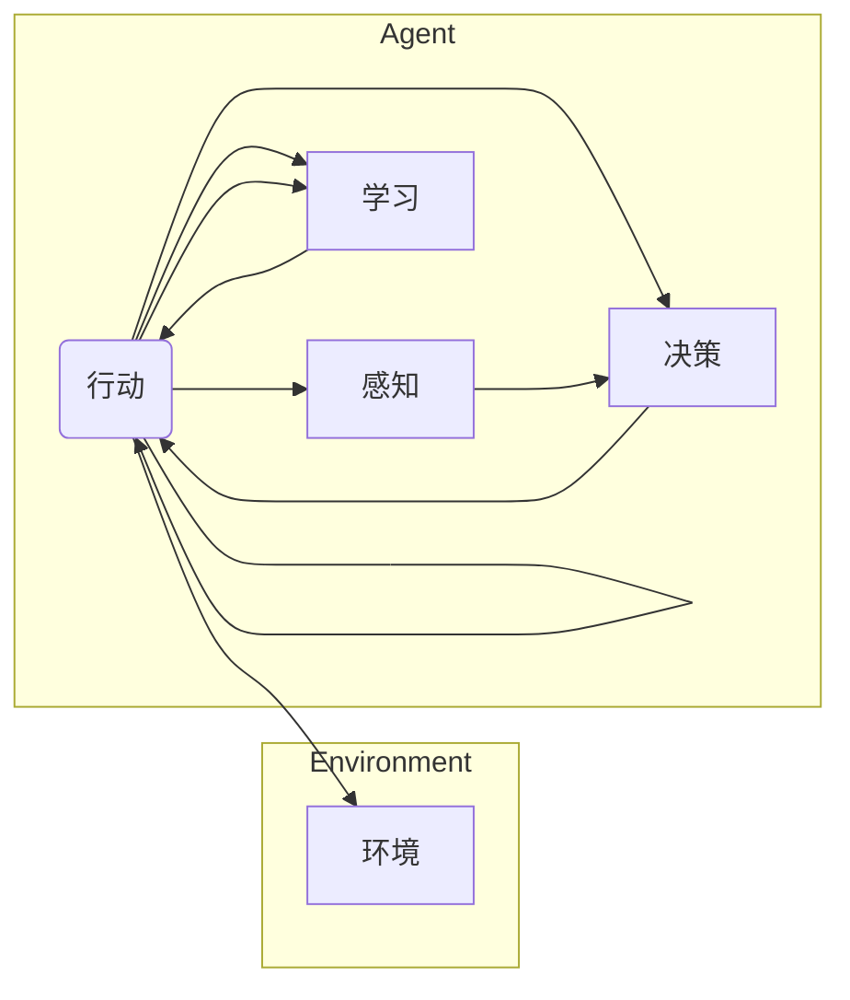

> AI Agent, 强化学习, 机器学习, 交互式系统, 智能决策, 机器人技术

# AI Agent: AI的下一个风口 技术的发展趋势

在人工智能的演进道路上，从符号主义到连接主义，再到深度学习的崛起，我们见证了技术的飞速发展。如今，AI Agent正逐渐成为AI领域的下一个风口，它将引领我们进入一个更加智能和自动化的未来。本文将深入探讨AI Agent的核心概念、发展趋势、应用场景以及面临的挑战，旨在为读者提供一个全面的技术视角。

## 1. 背景介绍

### 1.1 问题的由来

随着人工智能技术的不断进步，机器的能力已经超越了人类在许多领域的极限。然而，尽管我们在图像识别、语音识别和自然语言处理等方面取得了显著成果，但机器仍然缺乏自主决策和适应复杂环境的能力。AI Agent的出现正是为了解决这一问题。

AI Agent是一种能够感知环境、制定决策并采取行动的智能实体。它能够在没有人类直接干预的情况下，自主地完成特定任务，并不断学习和优化其行为。这种自主性和适应性使得AI Agent在各个领域都有巨大的应用潜力。

### 1.2 研究现状

AI Agent的研究始于20世纪50年代，随着强化学习、深度学习等技术的发展，AI Agent的研究取得了突破性的进展。目前，AI Agent已经广泛应用于机器人、游戏、自动驾驶、智能推荐等领域。

### 1.3 研究意义

AI Agent的研究对于推动人工智能技术的发展具有重要意义：

- **提高自动化水平**：AI Agent能够自动执行任务，减少人力成本，提高生产效率。
- **增强智能系统适应性**：AI Agent能够适应复杂多变的环境，提高系统的鲁棒性和可靠性。
- **促进跨学科发展**：AI Agent的研究涉及机器学习、控制理论、认知科学等多个学科，推动跨学科交叉融合。

### 1.4 本文结构

本文将围绕AI Agent展开，首先介绍其核心概念与联系，然后深入探讨其算法原理和应用场景，最后展望其未来发展趋势和挑战。

## 2. 核心概念与联系

### 2.1 AI Agent的核心概念

AI Agent的核心概念包括：

- **环境（Environment）**：Agent所感知和交互的世界。
- **感知（Perception）**：Agent从环境中获取信息的能力。
- **行为（Action）**：Agent对环境的响应。
- **决策（Decision）**：Agent在行动前的决策过程。
- **学习（Learning）**：Agent从经验中学习并改进其行为的能力。

### 2.2 Mermaid流程图

以下是一个简单的Mermaid流程图，展示了AI Agent的核心概念和它们之间的联系：



### 2.3 AI Agent的架构

AI Agent的架构通常包括以下几个部分：

- **感知模块**：用于获取环境信息，如传感器数据、图像、文本等。
- **决策模块**：根据感知到的信息，使用算法（如强化学习）做出决策。
- **行动模块**：根据决策结果，执行相应的动作。
- **学习模块**：从经验和结果中学习，不断优化决策和行为。

## 3. 核心算法原理 & 具体操作步骤

### 3.1 算法原理概述

AI Agent的核心算法是强化学习。强化学习是一种通过试错来学习如何在给定环境中做出最优决策的机器学习方法。它通过以下步骤实现：

1. **环境初始化**：设置初始环境状态。
2. **行动选择**：根据当前状态，选择一个动作。
3. **环境反馈**：执行动作后，环境返回一个新的状态和奖励。
4. **学习更新**：根据奖励和历史动作，更新Agent的策略。

### 3.2 算法步骤详解

强化学习的具体步骤如下：

1. **定义状态空间**：确定Agent可能遇到的所有状态。
2. **定义动作空间**：确定Agent可能执行的所有动作。
3. **定义奖励函数**：定义一个函数，用于评估Agent在特定状态下的表现。
4. **选择强化学习算法**：选择一种强化学习算法，如Q-Learning、Sarsa、DQN、DDPG等。
5. **训练Agent**：使用训练数据训练Agent，使其学习如何从给定状态选择最佳动作。
6. **评估Agent**：使用测试数据评估Agent的性能。

### 3.3 算法优缺点

强化学习的优点：

- **自适应性强**：Agent能够根据环境的变化调整其行为。
- **无需大量标注数据**：与监督学习相比，强化学习通常需要更少的数据。
- **适用于动态环境**：强化学习适用于那些状态空间和动作空间非常大的动态环境。

强化学习的缺点：

- **收敛速度慢**：强化学习需要大量的训练时间。
- **样本效率低**：需要大量样本才能学习到有效的策略。
- **难以解释**：强化学习模型的决策过程通常难以解释。

### 3.4 算法应用领域

强化学习在以下领域有广泛的应用：

- **游戏**：例如，DeepMind的AlphaGo就是使用强化学习算法击败了世界围棋冠军。
- **机器人**：例如，机器人可以学习如何导航、抓取物体等。
- **自动驾驶**：例如，自动驾驶汽车可以使用强化学习来学习如何在复杂的交通环境中驾驶。
- **智能推荐系统**：例如，Netflix和Amazon等公司使用强化学习来推荐电影和商品。

## 4. 数学模型和公式 & 详细讲解 & 举例说明

### 4.1 数学模型构建

强化学习的数学模型通常包括以下部分：

- **状态空间（State Space）**：$S = \{s_1, s_2, ..., s_n\}$
- **动作空间（Action Space）**：$A = \{a_1, a_2, ..., a_m\}$
- **奖励函数（Reward Function）**：$R(s, a)$
- **策略（Policy）**：$\pi(a|s)$
- **价值函数（Value Function）**：$V(s)$
- **状态-动作值函数（State-Action Value Function）**：$Q(s, a)$

### 4.2 公式推导过程

以下是一个简单的Q-Learning算法的公式推导过程：

$$
Q(s, a) \leftarrow Q(s, a) + \alpha [R(s, a) + \gamma \max_{a'} Q(s', a') - Q(s, a)]
$$

其中，$\alpha$ 是学习率，$\gamma$ 是折扣因子。

### 4.3 案例分析与讲解

以下是一个简单的强化学习案例：机器人清洁工。

**状态空间**：机器人的位置、清洁区域的清洁程度。

**动作空间**：向左移动、向右移动、向上移动、向下移动、清理区域。

**奖励函数**：如果机器人成功清理了一个区域，则奖励为1；否则，奖励为-1。

**策略**：使用Q-Learning算法训练机器人。

通过训练，机器人学会在清洁区域中高效地移动和清洁，以获得最大的奖励。

## 5. 项目实践：代码实例和详细解释说明

### 5.1 开发环境搭建

为了实现上述案例，我们需要搭建以下开发环境：

- Python 3.6+
- OpenAI Gym：用于构建和测试强化学习算法的框架。
- PyTorch：用于训练强化学习模型。

### 5.2 源代码详细实现

以下是一个简单的Q-Learning算法的PyTorch实现：

```python
import gym
import torch
import numpy as np

# 创建环境
env = gym.make('CartPole-v1')

# 初始化Q表
Q = np.zeros([env.observation_space.n, env.action_space.n])

# 设置学习率、折扣因子
alpha = 0.1
gamma = 0.99

# 训练模型
for episode in range(1000):
    state = env.reset()
    done = False
    total_reward = 0
    while not done:
        # 选择动作
        with torch.no_grad():
            action = np.argmax(Q[state])

        # 执行动作
        state, reward, done, _ = env.step(action)

        # 更新Q表
        next_state = state
        Q[state, action] = Q[state, action] + alpha * (reward + gamma * np.max(Q[next_state]) - Q[state, action])

        total_reward += reward

    print(f"Episode {episode}, Total Reward: {total_reward}")

# 关闭环境
env.close()
```

### 5.3 代码解读与分析

上述代码实现了一个简单的Q-Learning算法，用于训练一个机器人清洁工在CartPole环境中生存。

- `gym.make('CartPole-v1')` 创建了一个CartPole环境的实例。
- `np.zeros([env.observation_space.n, env.action_space.n])` 初始化了一个Q表，用于存储状态-动作值。
- `alpha` 和 `gamma` 分别是学习率和折扣因子。
- 循环迭代 episodes，每次迭代中，机器人从初始状态开始，通过选择动作来与环境交互，并不断更新Q表。
- `np.argmax(Q[state])` 选择当前状态下最优的动作。
- `env.step(action)` 执行选择的动作，并获得新的状态、奖励和是否结束的标志。
- 更新Q表，使得Q值更加接近真实值。
- 打印每个epoch的总奖励。

### 5.4 运行结果展示

在运行上述代码后，我们可以看到机器人在CartPole环境中的生存时间逐渐增加，最终能够稳定地生存下来。

## 6. 实际应用场景

### 6.1 自动驾驶

自动驾驶是AI Agent的一个重要应用场景。通过在复杂交通环境中学习，自动驾驶汽车可以自主导航、避障和停车。

### 6.2 机器人

机器人可以用于工业自动化、家政服务、医疗护理等领域。它们可以自主感知环境、执行任务，并根据需要调整其行为。

### 6.3 智能游戏

AI Agent可以用于开发更加智能和有趣的电子游戏。例如，AI对手可以模拟人类玩家的行为，使游戏更加具有挑战性。

## 7. 工具和资源推荐

### 7.1 学习资源推荐

- 《Reinforcement Learning: An Introduction》
- 《Deep Reinforcement Learning》
- OpenAI Gym
- PyTorch

### 7.2 开发工具推荐

- OpenAI Gym
- PyTorch
- TensorFlow
- Unity

### 7.3 相关论文推荐

- "Human-Level Control through Deep Reinforcement Learning" by DeepMind
- "Playing Atari with Deep Reinforcement Learning" by DeepMind
- "DeepMind's AlphaZero: Mastering Chess and Shogi by Self-Play" by DeepMind

## 8. 总结：未来发展趋势与挑战

### 8.1 研究成果总结

AI Agent作为一种能够在复杂环境中自主决策和采取行动的智能实体，已经成为AI领域的下一个风口。强化学习等算法的快速发展，使得AI Agent在各个领域都取得了显著的成果。然而，AI Agent的研究仍然面临着诸多挑战。

### 8.2 未来发展趋势

- **更加智能的感知能力**：AI Agent将具备更加先进的感知能力，能够更好地理解和适应复杂环境。
- **更加高效的决策算法**：开发更加高效的决策算法，使得AI Agent能够更快地学习和适应新环境。
- **更加鲁棒的执行能力**：AI Agent将具备更加鲁棒的执行能力，能够在恶劣环境下稳定运行。

### 8.3 面临的挑战

- **数据获取**：AI Agent需要大量真实世界的数据来训练，但获取高质量的数据往往成本高昂。
- **算法复杂性**：强化学习等算法的计算复杂度高，需要大量的计算资源。
- **伦理和安全问题**：AI Agent的决策过程可能存在偏见和误导，需要确保其安全性。

### 8.4 研究展望

随着技术的不断发展，AI Agent将在未来发挥越来越重要的作用。未来，AI Agent将与其他AI技术（如自然语言处理、计算机视觉等）相结合，构建更加智能和自动化的系统，为人类创造更加美好的未来。

## 9. 附录：常见问题与解答

**Q1：什么是AI Agent？**

A：AI Agent是一种能够感知环境、制定决策并采取行动的智能实体。

**Q2：AI Agent的算法有哪些？**

A：AI Agent的算法主要包括强化学习、深度学习等。

**Q3：AI Agent有哪些应用场景？**

A：AI Agent可以应用于自动驾驶、机器人、游戏、智能推荐等领域。

**Q4：AI Agent的研究面临哪些挑战？**

A：AI Agent的研究面临数据获取、算法复杂性、伦理和安全问题等挑战。

**Q5：AI Agent的未来发展趋势是什么？**

A：AI Agent的未来发展趋势包括更加智能的感知能力、更加高效的决策算法和更加鲁棒的执行能力。

作者：禅与计算机程序设计艺术 / Zen and the Art of Computer Programming