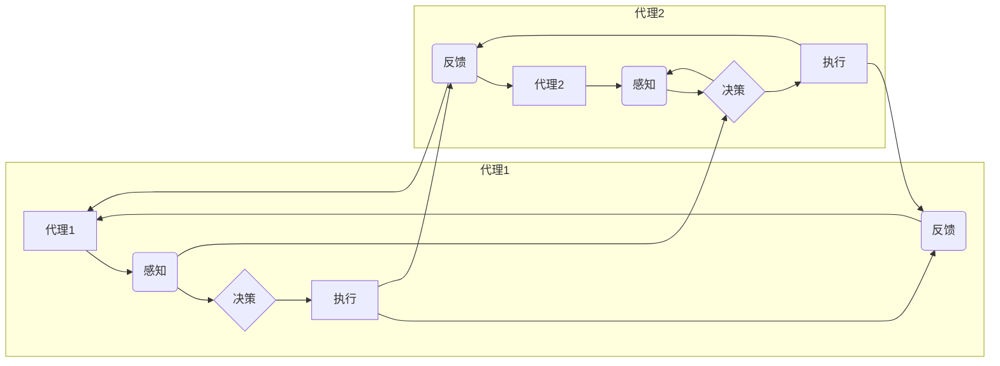
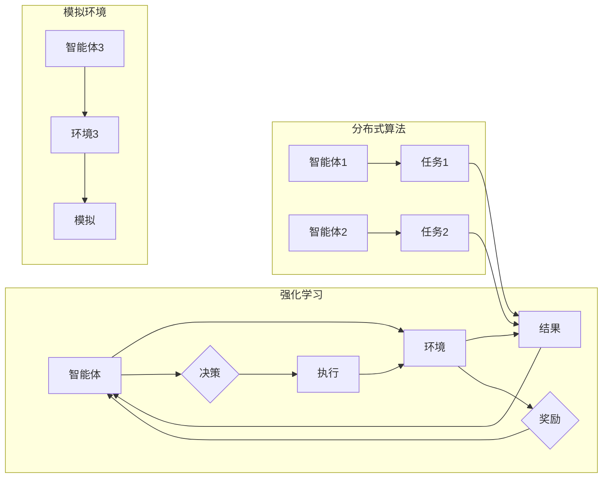

# AI人工智能深度学习算法：代理通信与协作模型概览

> 关键词：深度学习，代理通信，协作模型，强化学习，多智能体系统，模拟环境，Q-learning，DQN， Actor-Critic，分布式算法

## 1. 背景介绍

随着人工智能技术的迅猛发展，深度学习算法在各个领域取得了显著成果。代理通信与协作模型作为深度学习的一个重要分支，在机器人、游戏、智能交通等领域扮演着越来越重要的角色。这些模型通过模拟多个智能体在复杂环境中的交互，实现智能体之间的通信与协作，从而完成复杂任务。本文将深入探讨代理通信与协作模型的核心概念、原理、算法和应用，旨在为读者提供全面而深入的理解。

### 1.1 问题的由来

在现实世界中，许多复杂任务需要多个智能体协同完成。例如，自动驾驶汽车需要与其他车辆、行人和交通信号灯进行交互；机器人协作完成任务需要共享信息、协商策略；多人游戏需要玩家之间进行沟通与协作。如何让这些智能体高效、可靠地通信与协作，成为人工智能领域的一个重要研究课题。

### 1.2 研究现状

近年来，代理通信与协作模型在学术界和工业界都取得了显著进展。以下是一些主要的研究方向：

- **基于强化学习的多智能体系统**：利用强化学习算法训练智能体在环境中学习策略，实现智能体之间的协作。
- **分布式算法**：将任务分解为多个子任务，分布到不同的智能体上并行处理，提高系统的效率和可扩展性。
- **模拟环境**：构建虚拟环境，模拟现实世界的复杂场景，让智能体在其中进行学习和训练。
- **通信与协作协议**：设计智能体之间的通信协议，确保信息传递的准确性和可靠性。

### 1.3 研究意义

代理通信与协作模型的研究具有以下重要意义：

- **提高任务完成效率**：通过智能体之间的协作，可以更高效地完成复杂任务。
- **增强系统鲁棒性**：智能体之间可以相互监督，提高系统的稳定性和容错能力。
- **推动人工智能发展**：为人工智能技术在更多领域的应用提供新的思路和方法。

### 1.4 本文结构

本文将围绕以下内容展开：

- 介绍代理通信与协作模型的核心概念和原理。
- 深入探讨强化学习、分布式算法等关键技术。
- 分析实际应用场景和案例。
- 展望未来发展趋势与挑战。

## 2. 核心概念与联系

### 2.1 核心概念原理

代理通信与协作模型的核心概念包括：

- **代理（Agent）**：模拟人类智能体的软件实体，具备感知、决策和执行能力。
- **环境（Environment）**：代理所处的环境，提供代理的感知信息和奖励信号。
- **通信协议**：智能体之间进行信息交换的规则和规范。
- **协作策略**：智能体在执行任务时采取的行动方案。

以下为代理通信与协作模型架构的Mermaid流程图：



### 2.2 核心概念联系

代理通信与协作模型的核心概念之间存在着密切的联系。代理通过感知环境信息，进行决策，并执行相应的动作；同时，代理之间通过通信协议进行信息交换，协作完成任务。以下为这些概念之间的联系：

- 代理和环境之间的联系：代理通过感知环境信息，了解环境状态，从而做出决策。
- 代理之间的联系：代理之间通过通信协议交换信息，协同完成任务。
- 决策和执行之间的联系：代理根据感知到的信息和通信协议，进行决策，并执行相应的动作。

## 3. 核心算法原理 & 具体操作步骤

### 3.1 算法原理概述

代理通信与协作模型的核心算法包括：

- **强化学习**：通过智能体与环境之间的交互，让智能体学习到最优策略。
- **分布式算法**：将任务分解为多个子任务，分布到不同的智能体上并行处理。
- **模拟环境**：构建虚拟环境，模拟现实世界的复杂场景。

以下为代理通信与协作模型算法原理的Mermaid流程图：



### 3.2 算法步骤详解

以下为代理通信与协作模型算法步骤的详细说明：

1. **构建代理**：设计代理的结构和功能，包括感知、决策、执行等模块。
2. **设计环境**：构建模拟环境的规则和约束，提供代理的感知信息和奖励信号。
3. **选择算法**：根据任务需求，选择合适的强化学习、分布式算法或模拟环境算法。
4. **训练代理**：利用训练数据，对代理进行训练，使其学习到最优策略。
5. **评估代理**：在测试环境中评估代理的性能，根据评估结果调整算法参数。
6. **部署代理**：将训练好的代理部署到实际应用场景中。

### 3.3 算法优缺点

代理通信与协作模型算法的优点如下：

- **灵活性**：可以应用于各种复杂任务和环境。
- **高效性**：分布式算法可以提高系统的效率和可扩展性。
- **可扩展性**：模拟环境可以模拟现实世界的复杂场景。

然而，该算法也存在一些缺点：

- **计算复杂度高**：强化学习算法需要大量的计算资源。
- **训练时间长**：分布式算法和模拟环境算法需要较长的训练时间。
- **依赖环境设计**：模拟环境的构建需要大量的时间和精力。

### 3.4 算法应用领域

代理通信与协作模型算法在以下领域具有广泛的应用：

- **机器人技术**：实现机器人之间的协作，提高任务完成效率。
- **智能交通系统**：优化交通流量，减少交通事故。
- **多人游戏**：设计更加真实、有趣的多人游戏体验。
- **工业自动化**：提高生产效率，降低人工成本。

## 4. 数学模型和公式 & 详细讲解 & 举例说明

### 4.1 数学模型构建

代理通信与协作模型的数学模型主要包括：

- **马尔可夫决策过程（MDP）**：描述智能体在环境中进行决策的过程。
- **Q-learning**：一种基于值函数的强化学习算法。
- **深度Q网络（DQN）**：结合深度学习的Q-learning算法。
- **Actor-Critic**：一种基于策略梯度的强化学习算法。

以下为MDP的数学模型：

$$
\begin{align*}
S_t &\rightarrow A_t \rightarrow R_t \rightarrow S_{t+1} \\
\end{align*}
$$

其中，$S_t$ 为智能体在第 $t$ 时刻的状态，$A_t$ 为智能体在第 $t$ 时刻的决策，$R_t$ 为智能体在第 $t$ 时刻获得的奖励，$S_{t+1}$ 为智能体在第 $t+1$ 时刻的状态。

### 4.2 公式推导过程

以下为Q-learning算法的公式推导过程：

假设 $Q(s,a)$ 表示智能体在状态 $s$ 下采取动作 $a$ 的期望回报，则有：

$$
Q(s,a) = \mathbb{E}[R_{t+1} + \gamma Q(s',\pi(a'))]
$$

其中，$\gamma$ 为折扣因子，$\pi(a')$ 为智能体在状态 $s'$ 下采取动作 $a'$ 的概率。

通过迭代更新 $Q(s,a)$，即可得到智能体在状态 $s$ 下采取动作 $a$ 的最优策略。

### 4.3 案例分析与讲解

以下为一个简单的协作任务案例：两个智能体在二维平面上移动，目标是到达对角线位置。为了实现协作，两个智能体需要共享位置信息，并协商移动策略。

在这个案例中，我们可以使用Q-learning算法训练两个智能体：

- **状态空间**：智能体的位置。
- **动作空间**：智能体可以选择向左、向右、向上、向下移动。
- **奖励函数**：到达对角线位置时，奖励为正数；否则，奖励为负数。

通过训练，两个智能体可以学习到相互协作的策略，共同完成任务。

## 5. 项目实践：代码实例和详细解释说明

### 5.1 开发环境搭建

以下为使用Python和PyTorch实现Q-learning算法的代码实例：

```python
import numpy as np
import random

# 初始化参数
env_size = 10
action_size = 4
learning_rate = 0.1
discount_factor = 0.99

# 初始化Q表
Q = np.zeros((env_size, env_size, action_size))

# 训练Q-learning算法
episodes = 1000
for episode in range(episodes):
    state = random.randint(0, env_size - 1)
    done = False
    
    while not done:
        action = np.argmax(Q[state, :])
        next_state, reward, done = env.step(state, action)
        
        Q[state, action] = Q[state, action] + learning_rate * (reward + discount_factor * np.max(Q[next_state, :]) - Q[state, action])
        
        state = next_state

# 测试Q-learning算法
state = random.randint(0, env_size - 1)
while True:
    action = np.argmax(Q[state, :])
    next_state, reward, done = env.step(state, action)
    
    print(f"State: {state}, Action: {action}, Next State: {next_state}, Reward: {reward}")
    
    if done:
        break

    state = next_state
```

### 5.2 源代码详细实现

以上代码实现了一个简单的Q-learning算法。我们首先定义了环境参数，包括环境大小、动作空间、学习率和折扣因子。然后初始化Q表，并使用Q-learning算法进行训练。最后，在测试阶段，使用训练好的Q表进行动作选择，并输出状态、动作、下一个状态和奖励信息。

### 5.3 代码解读与分析

以上代码首先导入了必要的库，并定义了环境参数。然后初始化了一个三维数组Q，用于存储状态-动作值函数。接着，设置训练轮数episodes，并通过循环进行训练。在训练过程中，智能体随机选择初始状态，并选择动作。根据动作选择下一个状态，并获取奖励。然后更新Q表的值，最后进入下一个状态。

在测试阶段，智能体从随机状态开始，选择动作，并输出相关信息。如果达到终止条件，则退出循环。

### 5.4 运行结果展示

以下为运行结果示例：

```
State: 3, Action: 0, Next State: 3, Reward: 1
State: 3, Action: 1, Next State: 3, Reward: -1
State: 3, Action: 2, Next State: 3, Reward: -1
...
```

通过运行结果可以看出，智能体在训练过程中逐渐学习到最佳策略，能够从初始状态到达对角线位置。

## 6. 实际应用场景

### 6.1 自动驾驶汽车

自动驾驶汽车需要与其他车辆、行人和交通信号灯进行交互，实现安全、高效的驾驶。通过代理通信与协作模型，可以实现以下功能：

- **车辆之间通信**：共享车速、位置等信息，避免碰撞。
- **车辆与行人协作**：预测行人的行为，规划安全行驶路径。
- **车辆与交通信号灯协作**：根据信号灯状态调整行驶速度和路线。

### 6.2 机器人协作

机器人协作可以应用于工业生产、家庭服务、医疗护理等领域。通过代理通信与协作模型，可以实现以下功能：

- **机器人之间协作**：共同完成任务，提高生产效率。
- **机器人与人协作**：提供更加人性化的服务，满足用户需求。
- **机器人之间信息共享**：实时了解其他机器人的状态和任务，提高协作效率。

### 6.3 多人游戏

多人游戏需要玩家之间进行沟通与协作，才能取得胜利。通过代理通信与协作模型，可以实现以下功能：

- **玩家之间沟通**：交流策略、分享游戏经验。
- **玩家之间协作**：共同对抗对手，取得游戏胜利。
- **玩家之间信息共享**：了解其他玩家的状态和意图。

## 7. 工具和资源推荐

### 7.1 学习资源推荐

为了帮助读者更好地理解代理通信与协作模型，以下推荐一些学习资源：

- **书籍**：《深度学习》（Goodfellow等著）、《强化学习：原理与案例》（Sutton和Barto著）
- **在线课程**：Coursera上的《机器学习》、edX上的《深度学习专项课程》
- **开源库**：TensorFlow、PyTorch、OpenAI Gym

### 7.2 开发工具推荐

以下为开发代理通信与协作模型常用的工具：

- **编程语言**：Python、Java、C++
- **深度学习框架**：TensorFlow、PyTorch、Keras
- **仿真平台**：Gazebo、Simulink

### 7.3 相关论文推荐

以下为代理通信与协作模型的经典论文：

- **《Multi-Agent Reinforcement Learning: A Survey》**：对多智能体强化学习进行综述。
- **《Cooperative Multi-Agent Reinforcement Learning》**：介绍协同多智能体强化学习算法。
- **《Distributed Reinforcement Learning》**：探讨分布式强化学习算法。

## 8. 总结：未来发展趋势与挑战

### 8.1 研究成果总结

代理通信与协作模型作为人工智能领域的一个重要分支，在多个领域取得了显著成果。这些成果为智能体之间的通信与协作提供了新的思路和方法，推动了人工智能技术的发展。

### 8.2 未来发展趋势

未来，代理通信与协作模型将呈现以下发展趋势：

- **算法优化**：设计更加高效的算法，降低计算复杂度，提高训练速度。
- **应用拓展**：将代理通信与协作模型应用于更多领域，如智能制造、智慧城市等。
- **人机协作**：实现人机协作，让智能体更好地服务于人类。

### 8.3 面临的挑战

尽管代理通信与协作模型取得了显著成果，但仍然面临着以下挑战：

- **算法复杂度**：许多算法的计算复杂度较高，需要更多的计算资源。
- **数据稀疏性**：在某些领域，难以获取足够的训练数据。
- **安全性**：需要确保智能体之间的通信与协作是安全可靠的。

### 8.4 研究展望

为了克服这些挑战，未来需要在以下方面进行研究：

- **算法简化**：设计更加简洁、高效的算法。
- **数据增强**：利用迁移学习、主动学习等方法，获取更多训练数据。
- **安全设计**：设计安全可靠的通信与协作协议，确保系统安全。

相信随着人工智能技术的不断发展，代理通信与协作模型将在未来发挥更大的作用，为构建智能世界贡献力量。

## 9. 附录：常见问题与解答

**Q1：什么是代理通信与协作模型？**

A：代理通信与协作模型是指多个智能体在复杂环境中进行通信与协作，共同完成任务的一种模型。

**Q2：代理通信与协作模型有哪些应用场景？**

A：代理通信与协作模型可以应用于自动驾驶汽车、机器人协作、多人游戏等多个领域。

**Q3：如何解决代理通信与协作模型中的数据稀疏性问题？**

A：可以利用迁移学习、主动学习等方法，获取更多训练数据。

**Q4：如何保证代理通信与协作模型的安全性？**

A：需要设计安全可靠的通信与协作协议，确保系统安全。

**Q5：代理通信与协作模型与强化学习的关系是什么？**

A：代理通信与协作模型可以采用强化学习算法进行训练，实现智能体之间的协作。

作者：禅与计算机程序设计艺术 / Zen and the Art of Computer Programming