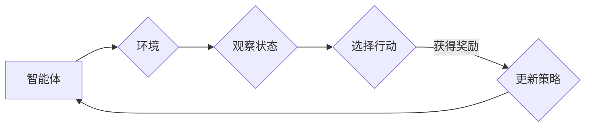

> AI, 深度学习，强化学习，智能代理，优化决策，深度强化学习，多智能体系统，Q-learning，深度Q网络，策略梯度

# AI人工智能深度学习算法：智能深度学习代理的使用强化学习优化决策

> 关键词：AI, 深度学习，强化学习，智能代理，优化决策，深度强化学习，多智能体系统，Q-learning，深度Q网络，策略梯度

## 1. 背景介绍

在人工智能领域，深度学习作为一种强大的机器学习技术，已经在图像识别、语音识别、自然语言处理等领域取得了显著成果。然而，对于复杂决策问题，传统的深度学习模型往往难以直接应用。近年来，强化学习（Reinforcement Learning，RL）作为一种通过与环境交互学习决策策略的方法，逐渐成为解决复杂决策问题的有力工具。本文将探讨如何利用智能深度学习代理（Intelligent Deep Learning Agent）结合强化学习来优化决策。

### 1.1 问题的由来

随着人工智能技术的不断发展，越来越多的应用场景需要智能体在复杂环境中进行决策。例如，自动驾驶、机器人控制、游戏AI等。这些场景通常涉及复杂的非线性关系和动态环境，传统的深度学习模型难以直接处理。强化学习通过让智能体与环境交互，不断学习最优策略，从而在复杂环境中进行有效的决策。

### 1.2 研究现状

目前，深度强化学习（Deep Reinforcement Learning，DRL）已成为研究热点。DRL结合了深度学习和强化学习的优势，使得智能体能够学习到更加复杂的决策策略。然而，DRL也面临一些挑战，如样本效率低、不稳定收敛、缺乏可解释性等。

### 1.3 研究意义

研究如何利用智能深度学习代理结合强化学习优化决策，对于推动人工智能技术的发展具有重要意义。这不仅可以提升智能体在复杂环境中的决策能力，还可以拓展深度学习的应用范围。

### 1.4 本文结构

本文将首先介绍智能深度学习代理和强化学习的基本概念，然后详细阐述深度强化学习算法的原理和具体操作步骤，接着分析数学模型和公式，并通过案例进行分析。最后，我们将探讨智能深度学习代理在优化决策中的应用场景，并展望未来的发展趋势和挑战。

## 2. 核心概念与联系

### 2.1 智能深度学习代理

智能深度学习代理是指具有深度学习能力的智能体，能够通过学习从环境中获取奖励，并采取行动以最大化长期累积奖励。

### 2.2 强化学习

强化学习是一种通过与环境交互学习决策策略的方法。智能体通过观察环境状态、选择行动、获得奖励，并不断优化策略以最大化长期累积奖励。

### 2.3 Mermaid 流程图

以下是一个简化的智能深度学习代理与强化学习联系的Mermaid流程图：



### 2.4 核心概念原理和架构的 Mermaid 流程图

```mermaid
graph LR
    A[输入层] --> B{激活函数}
    B --> C[隐藏层]
    C --> D[激活函数}
    D --> E[输出层]
    E --> F{策略选择}
    F -->|选择行动| G{环境}
    G --> H{状态}
    H --> I{反馈}
    I --> J{策略更新}
    J --> A
```

## 3. 核心算法原理 & 具体操作步骤

### 3.1 算法原理概述

深度强化学习算法的核心是深度神经网络，用于学习状态-动作价值函数或策略。智能体通过与环境交互，不断更新策略以最大化长期累积奖励。

### 3.2 算法步骤详解

1. 初始化深度神经网络模型。
2. 将智能体置于环境中的初始状态。
3. 模型预测当前状态下的最佳行动。
4. 智能体执行选择的行动。
5. 环境反馈新的状态和奖励。
6. 使用梯度下降等优化算法更新模型参数。
7. 重复步骤2-6，直到达到预设的终止条件。

### 3.3 算法优缺点

#### 优点：

- 能够学习到复杂的决策策略。
- 在复杂环境中表现优于传统算法。
- 可用于解决各种决策问题。

#### 缺点：

- 样本效率低。
- 收敛速度慢。
- 缺乏可解释性。

### 3.4 算法应用领域

深度强化学习算法在以下领域具有广泛的应用：

- 自动驾驶
- 机器人控制
- 游戏AI
- 金融交易
- 能源管理

## 4. 数学模型和公式 & 详细讲解 & 举例说明

### 4.1 数学模型构建

深度强化学习算法的数学模型主要包括：

- 状态空间 $S$：智能体所处的环境状态。
- 行动空间 $A$：智能体可以采取的行动集合。
- 策略 $\pi(s)$：给定状态 $s$，智能体采取的行动概率分布。
- 奖励函数 $R(s, a)$：智能体采取行动 $a$ 在状态 $s$ 时的即时奖励。
- 状态转移函数 $P(s', s, a)$：智能体从状态 $s$ 采取行动 $a$ 转移到状态 $s'$ 的概率。
- 值函数 $V(s)$：在状态 $s$ 的期望累积奖励。

### 4.2 公式推导过程

以下是Q-learning算法的公式推导过程：

- Q-learning的目标是学习Q值函数 $Q(s, a)$，表示在状态 $s$ 采取行动 $a$ 的预期累积奖励。
- Q值函数的更新公式为：

  $$
Q(s, a) = Q(s, a) + \alpha [R(s, a) + \gamma \max_{a'} Q(s', a') - Q(s, a)]
$$

  其中，$\alpha$ 为学习率，$\gamma$ 为折扣因子。

### 4.3 案例分析与讲解

以下是一个简单的Q-learning算法应用案例：

假设智能体在一个网格世界中，目标是从左上角移动到右下角。每个单元格都有不同的奖励值，奖励值取决于智能体所在位置。

- 初始状态：$(0,0)$，奖励值为0。
- 目标状态：$(m-1, n-1)$，奖励值为100。
- 每次移动消耗一个时间步长，奖励值减少1。
- 状态转移概率为1/4，智能体可以向上、下、左、右移动。

通过Q-learning算法，智能体可以学习到从初始状态到目标状态的最优路径。

## 5. 项目实践：代码实例和详细解释说明

### 5.1 开发环境搭建

为了实现深度强化学习算法，我们需要以下开发环境：

- Python 3.5+
- TensorFlow或PyTorch
- OpenAI Gym

### 5.2 源代码详细实现

以下是一个使用PyTorch实现的Q-learning算法示例：

```python
import torch
import numpy as np
import gym

# 创建环境
env = gym.make('CartPole-v1')

# 初始化Q表
q_table = np.zeros([env.observation_space.n, env.action_space.n])

# Q-learning参数
alpha = 0.1  # 学习率
gamma = 0.99 # 折扣因子
epsilon = 0.1 # 探索率

# 训练过程
for episode in range(1000):
    state = env.reset()
    done = False
    
    while not done:
        # 随机选择探索或贪婪策略
        if np.random.rand() < epsilon:
            action = env.action_space.sample()
        else:
            action = np.argmax(q_table[state])
        
        # 执行行动并获取新的状态和奖励
        next_state, reward, done, _ = env.step(action)
        
        # 更新Q表
        q_table[state, action] = (1 - alpha) * q_table[state, action] + alpha * (reward + gamma * np.max(q_table[next_state]))
        
        state = next_state

# 关闭环境
env.close()

# 打印Q表
print(q_table)
```

### 5.3 代码解读与分析

上述代码首先创建了一个CartPole环境，并初始化了一个Q表。然后，通过Q-learning算法不断更新Q表，直到达到训练次数。最后，关闭环境并打印Q表。

### 5.4 运行结果展示

运行上述代码，可以看到Q表逐渐收敛，最终智能体可以稳定地在CartPole环境中完成任务。

## 6. 实际应用场景

### 6.1 自动驾驶

深度强化学习在自动驾驶领域具有广泛的应用前景。通过让智能驾驶汽车与环境交互，学习到安全的驾驶策略，实现无人驾驶。

### 6.2 机器人控制

深度强化学习可以应用于机器人控制领域，让机器人能够在复杂环境中进行导航、抓取、搬运等任务。

### 6.3 游戏AI

深度强化学习可以用于开发更加智能的游戏AI，提高游戏的趣味性和挑战性。

### 6.4 金融交易

深度强化学习可以用于分析市场数据，预测股票价格走势，实现智能投资。

### 6.5 能源管理

深度强化学习可以用于优化能源管理系统，提高能源利用效率。

## 7. 工具和资源推荐

### 7.1 学习资源推荐

- 《Reinforcement Learning: An Introduction》
- 《Deep Reinforcement Learning》
- 《Deep Learning with Python》

### 7.2 开发工具推荐

- TensorFlow
- PyTorch
- OpenAI Gym

### 7.3 相关论文推荐

- Deep Q-Networks
- Asynchronous Methods for Deep Reinforcement Learning
- Soft Actor-Critic: Off-Policy Maximum Entropy Deep Reinforcement Learning

## 8. 总结：未来发展趋势与挑战

### 8.1 研究成果总结

本文介绍了智能深度学习代理结合强化学习优化决策的基本原理、算法、应用场景以及未来发展趋势。深度强化学习作为一种强大的机器学习技术，在解决复杂决策问题方面具有巨大的潜力。

### 8.2 未来发展趋势

- 深度强化学习算法将更加高效、稳定和可解释。
- 深度强化学习将与其他人工智能技术（如知识表示、因果推理）进行融合，构建更加智能的智能体。
- 深度强化学习将应用于更多领域，推动人工智能技术的发展。

### 8.3 面临的挑战

- 深度强化学习算法的样本效率较低，需要大量的训练数据。
- 深度强化学习算法的收敛速度较慢，需要较长的训练时间。
- 深度强化学习算法的可解释性较差，难以理解其决策过程。

### 8.4 研究展望

为了应对深度强化学习面临的挑战，未来的研究将重点关注以下几个方面：

- 提高深度强化学习算法的样本效率，降低训练数据需求。
- 提高深度强化学习算法的收敛速度，缩短训练时间。
- 提高深度强化学习算法的可解释性，增强人们对算法的信任度。
- 探索深度强化学习与其他人工智能技术的融合，构建更加智能的智能体。

## 9. 附录：常见问题与解答

**Q1：深度强化学习算法与监督学习算法有什么区别？**

A：深度强化学习算法通过与环境交互学习决策策略，而监督学习算法通过学习输入数据与标签之间的关系进行预测。深度强化学习算法适用于动态环境中的决策问题，而监督学习算法适用于静态数据中的预测问题。

**Q2：如何解决深度强化学习算法的样本效率问题？**

A：为了解决深度强化学习算法的样本效率问题，可以采用以下方法：

- 使用迁移学习，利用已有模型的经验知识。
- 使用模拟环境进行数据增强。
- 使用基于模型的强化学习算法，如模型辅助强化学习。

**Q3：如何提高深度强化学习算法的可解释性？**

A：为了提高深度强化学习算法的可解释性，可以采用以下方法：

- 使用可解释的神经网络结构，如决策树、规则基模型等。
- 使用注意力机制，突出模型关注的特征。
- 使用可视化技术，展示模型的学习过程和决策过程。

**Q4：深度强化学习算法在实际应用中面临哪些挑战？**

A：深度强化学习算法在实际应用中面临以下挑战：

- 数据稀疏：实际应用中往往难以获得足够的数据。
- 环境复杂：实际应用中的环境往往具有复杂的动态变化。
- 难以评估：难以评估深度强化学习算法的性能。

**Q5：如何解决深度强化学习算法的收敛速度问题？**

A：为了解决深度强化学习算法的收敛速度问题，可以采用以下方法：

- 使用更有效的优化算法，如Adam、SGD等。
- 使用经验回放技术，减少样本的随机性。
- 使用并行计算，提高计算效率。

---

作者：禅与计算机程序设计艺术 / Zen and the Art of Computer Programming