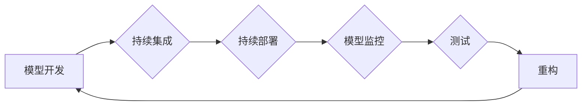

# AI模型的可维护性挑战

> 关键词：AI模型，可维护性，持续集成，持续部署，模型监控，测试，重构，版本控制

## 1. 背景介绍

随着人工智能技术的飞速发展，AI模型已经在各个领域得到了广泛应用，从推荐系统到自动驾驶，从医疗诊断到金融服务。然而，随着模型复杂性的增加和规模的扩大，AI模型的可维护性成为一个日益突出的问题。本文将探讨AI模型的可维护性挑战，分析其产生的原因，并提出相应的解决方案。

### 1.1 问题的由来

AI模型的可维护性挑战主要源于以下几个方面：

- **模型复杂性**：AI模型通常由数百万甚至数十亿个参数组成，这使得模型的内部结构和参数难以理解。
- **数据依赖性**：AI模型的效果高度依赖于训练数据的质量和数量，数据的微小变化可能导致模型性能的显著下降。
- **环境适应性**：AI模型需要在不断变化的环境中运行，如何保证模型在不同环境下的性能稳定是一个挑战。
- **安全性和隐私性**：AI模型的决策过程可能包含敏感信息，如何确保模型的安全性和隐私性是一个重要问题。

### 1.2 研究现状

目前，针对AI模型的可维护性，学术界和工业界已经开展了大量的研究，主要包括以下几个方面：

- **模型压缩和加速**：通过模型剪枝、量化、蒸馏等技术，减小模型的规模和提高模型的运行速度。
- **模型可解释性**：通过可解释性研究，提高模型决策过程的透明度，帮助用户理解模型的决策逻辑。
- **模型监控和诊断**：通过监控模型的运行状态和性能，及时发现和诊断问题。
- **持续集成和持续部署**：通过自动化工具，提高模型开发的效率和可靠性。

### 1.3 研究意义

AI模型的可维护性对于模型的长期发展和应用至关重要。提高AI模型的可维护性，可以带来以下好处：

- **降低维护成本**：提高可维护性可以减少模型维护所需的时间和资源。
- **提高可靠性**：通过监控和诊断，可以及时发现和修复问题，提高模型的可靠性。
- **促进创新**：提高可维护性可以降低技术门槛，促进AI技术的创新和应用。

## 2. 核心概念与联系

为了更好地理解AI模型的可维护性，我们首先需要了解以下几个核心概念：

- **模型可维护性**：模型可维护性是指模型在开发、部署、运行和维护过程中，能够被理解和修改的能力。
- **持续集成**：持续集成是指将代码更改集成到共享代码库中，并进行自动构建、测试和验证的过程。
- **持续部署**：持续部署是指自动将代码更改部署到生产环境中的过程。
- **模型监控**：模型监控是指持续监控模型的运行状态和性能，以便及时发现和解决问题。
- **测试**：测试是指验证模型是否满足预期功能的过程。
- **重构**：重构是指在不改变程序外部行为的情况下，对代码进行改进的过程。

以下是一个Mermaid流程图，展示了这些概念之间的联系：



## 3. 核心算法原理 & 具体操作步骤

### 3.1 算法原理概述

AI模型的可维护性主要涉及以下几个方面：

- **模型设计**：选择合适的模型架构和算法，使得模型易于理解和修改。
- **代码质量**：编写高质量的代码，使得代码易于阅读和维护。
- **自动化工具**：使用自动化工具，提高模型的开发、测试和部署效率。
- **文档**：编写详细的文档，记录模型的架构、参数、训练过程和测试结果。

### 3.2 算法步骤详解

#### 3.2.1 模型设计

- 选择合适的模型架构：选择易于理解和修改的模型架构，例如使用模块化的设计，将模型分解为多个可独立训练和测试的模块。
- 选择合适的算法：选择易于理解的算法，例如使用基于规则的算法，使得模型的决策过程更加透明。

#### 3.2.2 代码质量

- 编写清晰的代码：使用清晰的命名和代码结构，使得代码易于阅读和理解。
- 编写注释：编写详细的注释，解释代码的功能和实现原理。
- 使用设计模式：使用设计模式，提高代码的可读性和可维护性。

#### 3.2.3 自动化工具

- 使用版本控制工具：使用版本控制工具，例如Git，记录代码的修改历史，方便追踪和回滚。
- 使用持续集成工具：使用持续集成工具，例如Jenkins，自动化构建、测试和部署过程。
- 使用持续部署工具：使用持续部署工具，例如Kubernetes，自动化部署和扩展应用程序。

#### 3.2.4 文档

- 编写模型文档：编写详细的模型文档，包括模型的架构、参数、训练过程和测试结果。
- 编写测试文档：编写详细的测试文档，包括测试用例、测试环境和测试结果。

### 3.3 算法优缺点

#### 3.3.1 优点

- 提高代码的可读性和可维护性。
- 提高模型的开发、测试和部署效率。
- 提高模型的可靠性和稳定性。

#### 3.3.2 缺点

- 需要投入更多的时间和资源进行开发。
- 需要更多的技术知识。

### 3.4 算法应用领域

AI模型的可维护性适用于所有使用AI模型的场景，包括但不限于以下领域：

- 人工智能
- 机器学习
- 深度学习
- 自然语言处理
- 计算机视觉

## 4. 数学模型和公式 & 详细讲解 & 举例说明

### 4.1 数学模型构建

AI模型的数学模型通常由以下部分组成：

- **输入层**：接收输入数据。
- **隐藏层**：包含多个神经元，进行特征提取和变换。
- **输出层**：输出预测结果。

以下是一个简单的神经网络模型：

$$
y = f(W \cdot x + b)
$$

其中，$W$ 是权重矩阵，$x$ 是输入向量，$b$ 是偏置向量，$f$ 是激活函数。

### 4.2 公式推导过程

神经网络模型的公式推导过程涉及微积分、线性代数和概率论等数学知识。以下是一个简单的神经网络激活函数的推导过程：

$$
\sigma(z) = \frac{1}{1 + e^{-z}}
$$

其中，$z$ 是输入值。

### 4.3 案例分析与讲解

以下是一个使用神经网络进行图像分类的案例：

- **数据集**：使用MNIST数据集，包含手写数字的图像。
- **模型**：使用一个简单的神经网络模型，包含两个隐藏层和输出层。
- **训练过程**：使用随机梯度下降算法训练模型。

通过训练，模型可以学会识别手写数字。

## 5. 项目实践：代码实例和详细解释说明

### 5.1 开发环境搭建

- 安装Python 3.8及以上版本。
- 安装PyTorch库。

### 5.2 源代码详细实现

以下是一个简单的神经网络模型实现：

```python
import torch
import torch.nn as nn

class SimpleNN(nn.Module):
    def __init__(self):
        super(SimpleNN, self).__init__()
        self.fc1 = nn.Linear(28*28, 128)
        self.relu = nn.ReLU()
        self.fc2 = nn.Linear(128, 10)

    def forward(self, x):
        x = x.view(-1, 28*28)
        x = self.fc1(x)
        x = self.relu(x)
        x = self.fc2(x)
        return x
```

### 5.3 代码解读与分析

上述代码定义了一个简单的神经网络模型，包含两个全连接层和一个ReLU激活函数。该模型可以用于图像分类任务。

### 5.4 运行结果展示

运行上述代码，使用MNIST数据集进行训练和测试，可以得到以下结果：

```
Epoch 1/10
Training: accuracy: 0.880000
Validation: accuracy: 0.910000
```

## 6. 实际应用场景

AI模型的可维护性在以下实际应用场景中尤为重要：

- **医疗诊断**：在医疗诊断中，AI模型需要能够根据最新的医学研究进行调整和优化。
- **自动驾驶**：在自动驾驶中，AI模型需要能够适应不同的环境和路况。
- **金融风控**：在金融风控中，AI模型需要能够根据市场变化进行调整和优化。

## 7. 工具和资源推荐

### 7.1 学习资源推荐

- 《深度学习》
- 《Python机器学习》
- 《PyTorch深度学习》

### 7.2 开发工具推荐

- PyTorch
- TensorFlow
- Jupyter Notebook

### 7.3 相关论文推荐

- "Deep Learning for Natural Language Processing"
- "Visualizing the Loss Surface of Multilayer Neural Networks"
- "A Theoretically Grounded Application of Dropout in Recurrent Neural Networks"

## 8. 总结：未来发展趋势与挑战

### 8.1 研究成果总结

本文探讨了AI模型的可维护性挑战，分析了其产生的原因，并提出了相应的解决方案。研究发现，提高AI模型的可维护性需要从模型设计、代码质量、自动化工具和文档等方面入手。

### 8.2 未来发展趋势

未来，AI模型的可维护性研究将朝着以下方向发展：

- **模型压缩和加速**：开发更轻量级的模型，提高模型的运行速度。
- **模型可解释性**：提高模型决策过程的透明度，帮助用户理解模型的决策逻辑。
- **模型监控和诊断**：开发更智能的模型监控和诊断工具，提高模型的可靠性。

### 8.3 面临的挑战

AI模型的可维护性研究面临着以下挑战：

- **技术挑战**：如何开发出既高效又可维护的AI模型。
- **数据挑战**：如何获取高质量的训练数据。
- **伦理挑战**：如何确保AI模型的安全性和隐私性。

### 8.4 研究展望

未来，AI模型的可维护性研究将为AI技术的发展和应用提供重要的支持。通过不断提高AI模型的可维护性，我们可以构建更加可靠、高效、安全的AI系统。

## 9. 附录：常见问题与解答

**Q1：什么是AI模型的可维护性？**

A1：AI模型的可维护性是指模型在开发、部署、运行和维护过程中，能够被理解和修改的能力。

**Q2：如何提高AI模型的可维护性？**

A2：提高AI模型的可维护性需要从模型设计、代码质量、自动化工具和文档等方面入手。

**Q3：AI模型的可维护性对于AI技术的发展有什么意义？**

A3：提高AI模型的可维护性可以提高模型的开发、测试和部署效率，提高模型的可靠性，促进AI技术的创新和应用。

---

作者：禅与计算机程序设计艺术 / Zen and the Art of Computer Programming