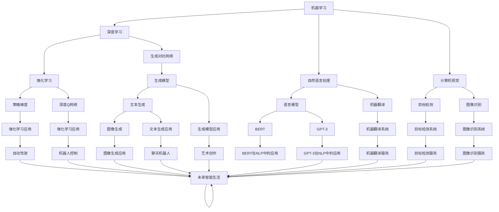

# Andrej Karpathy：人工智能的未来发展规划

> 关键词：人工智能，未来发展规划，机器学习，深度学习，自动驾驶，自然语言处理，人机交互，伦理道德

## 1. 背景介绍

人工智能（AI）作为21世纪最具变革性的技术之一，正在深刻地改变着我们的生活方式和工业生产方式。Andrej Karpathy，作为一位在人工智能领域具有深远影响力的专家，他的观点对于理解人工智能的未来发展方向具有重要意义。本文将基于Karpathy的观点，探讨人工智能的未来发展规划。

## 2. 核心概念与联系

### 2.1 人工智能的核心概念

人工智能的核心概念包括：

- **机器学习（Machine Learning）**：让机器通过数据学习并做出决策或预测。
- **深度学习（Deep Learning）**：一种特殊的机器学习方法，使用层次化的神经网络来学习和表示数据。
- **自然语言处理（Natural Language Processing，NLP）**：使计算机能够理解、解释和生成人类语言。
- **计算机视觉（Computer Vision）**：使计算机能够从图像或视频中理解和提取信息。
- **人机交互（Human-Computer Interaction，HCI）**：研究人与计算机之间的交互方式。
- **伦理道德（Ethics）**：在人工智能设计和应用过程中，确保其符合伦理道德标准。

### 2.2 Mermaid流程图

以下是基于上述核心概念的Mermaid流程图：



## 3. 核心算法原理 & 具体操作步骤

### 3.1 算法原理概述

人工智能的核心算法原理包括：

- **监督学习（Supervised Learning）**：通过大量已标记的训练数据来训练模型。
- **无监督学习（Unsupervised Learning）**：通过未标记的数据来发现数据中的模式。
- **强化学习（Reinforcement Learning）**：通过与环境交互来学习最佳策略。

### 3.2 算法步骤详解

以下是人工智能算法的基本步骤：

1. **数据收集**：收集相关的数据，包括训练数据和测试数据。
2. **数据预处理**：清洗数据，去除噪声，并将其转换为模型可以处理的格式。
3. **模型选择**：选择合适的模型，如神经网络、决策树等。
4. **模型训练**：使用训练数据来训练模型。
5. **模型评估**：使用测试数据来评估模型的性能。
6. **模型优化**：根据评估结果来调整模型参数，以提升性能。

### 3.3 算法优缺点

每种算法都有其优缺点：

- **监督学习**：优点是性能稳定，缺点是需要大量已标记的数据。
- **无监督学习**：优点是不需要标记的数据，缺点是模型性能可能不如监督学习。
- **强化学习**：优点是能够处理复杂环境，缺点是训练过程可能非常耗时。

### 3.4 算法应用领域

人工智能算法在各个领域都有广泛应用：

- **金融**：风险评估、欺诈检测、算法交易等。
- **医疗**：疾病诊断、药物研发、健康管理等。
- **交通**：自动驾驶、交通流量控制、智能导航等。
- **教育**：个性化学习、自动评分、智能辅导等。

## 4. 数学模型和公式 & 详细讲解 & 举例说明

### 4.1 数学模型构建

人工智能的数学模型通常基于概率论和统计学。

### 4.2 公式推导过程

以下是一个简单的线性回归模型的公式：

$$
y = wx + b
$$

其中，$y$ 是预测值，$x$ 是输入值，$w$ 是权重，$b$ 是偏置。

### 4.3 案例分析与讲解

以一个简单的房价预测为例，我们可以使用线性回归模型来预测房屋价格。

## 5. 项目实践：代码实例和详细解释说明

### 5.1 开发环境搭建

以下是使用Python进行线性回归项目实践的开发环境搭建步骤：

1. 安装Python：从官网下载并安装Python。
2. 安装NumPy：使用pip安装NumPy库。

### 5.2 源代码详细实现

以下是线性回归的Python代码实现：

```python
import numpy as np

# 训练数据
X = np.array([[1, 2], [2, 3], [3, 4], [4, 5]])
y = np.array([2, 3, 4, 5])

# 模型参数
w = np.zeros((2, 1))
b = 0

# 训练模型
for i in range(1000):
    y_pred = X.dot(w) + b
    error = y - y_pred
    gradient_w = 2/X.shape[0] * X.T.dot(error)
    gradient_b = 2/X.shape[0] * np.sum(error)
    w -= gradient_w
    b -= gradient_b

# 预测
X_test = np.array([[1, 3]])
y_pred = X_test.dot(w) + b
print("Predicted value:", y_pred)
```

### 5.3 代码解读与分析

上述代码首先定义了训练数据和模型参数，然后通过梯度下降算法更新模型参数，最后使用更新后的模型进行预测。

## 6. 实际应用场景

### 6.1 自动驾驶

自动驾驶是人工智能技术应用的重要场景。通过深度学习和计算机视觉技术，自动驾驶汽车能够识别道路上的障碍物、行人、车辆等，并做出相应的驾驶决策。

### 6.2 自然语言处理

自然语言处理技术在智能客服、机器翻译、情感分析等领域得到广泛应用。通过深度学习和自然语言处理技术，计算机能够理解和生成人类语言。

### 6.3 个性化推荐

个性化推荐系统能够根据用户的历史行为和兴趣，为用户提供个性化的内容推荐。通过机器学习和推荐算法，推荐系统能够提升用户体验。

## 7. 工具和资源推荐

### 7.1 学习资源推荐

- 《深度学习》（Ian Goodfellow等著）
- 《机器学习》（Tom M. Mitchell著）
- 《自然语言处理综论》（Daniel Jurafsky等著）

### 7.2 开发工具推荐

- TensorFlow
- PyTorch
- scikit-learn

### 7.3 相关论文推荐

- "ImageNet Classification with Deep Convolutional Neural Networks"（Alex Krizhevsky等著）
- "A Neural Probabilistic Language Model"（Geoffrey Hinton等著）
- "Sequence to Sequence Learning with Neural Networks"（Ilya Sutskever等著）

## 8. 总结：未来发展趋势与挑战

### 8.1 研究成果总结

人工智能在过去几十年取得了巨大的进步，已经从理论走向实践，并开始改变我们的生活方式。

### 8.2 未来发展趋势

- 人工智能将更加普及，成为各个行业的核心技术。
- 人工智能将更加智能化，具备更强的学习和推理能力。
- 人工智能将更加人性化，更好地适应人类的需求。

### 8.3 面临的挑战

- 人工智能的伦理道德问题。
- 人工智能的安全性问题。
- 人工智能的公平性问题。

### 8.4 研究展望

未来，人工智能将朝着更加智能、高效、安全、公平的方向发展，为人类社会带来更多福祉。

## 9. 附录：常见问题与解答

### 9.1 人工智能的定义是什么？

人工智能是指让机器能够模拟人类的智能行为，如学习、推理、感知、理解等。

### 9.2 人工智能的目的是什么？

人工智能的目的是帮助人类解决复杂问题，提高生产效率，改善生活质量。

### 9.3 人工智能是否会取代人类？

人工智能可以替代人类完成一些重复性、危险或繁琐的工作，但无法完全取代人类的创造力和情感。

### 9.4 人工智能的伦理道德问题有哪些？

人工智能的伦理道德问题包括数据隐私、算法偏见、自动化失业等。

### 9.5 如何解决人工智能的伦理道德问题？

通过立法、技术手段和道德教育等措施来解决人工智能的伦理道德问题。

---

作者：禅与计算机程序设计艺术 / Zen and the Art of Computer Programming