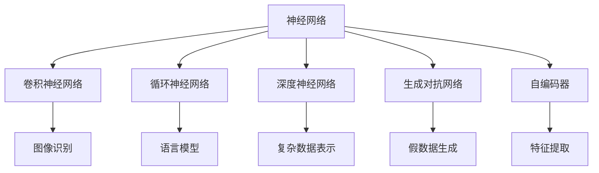
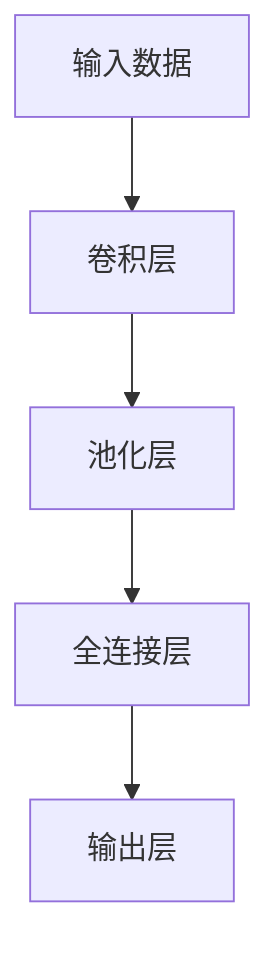
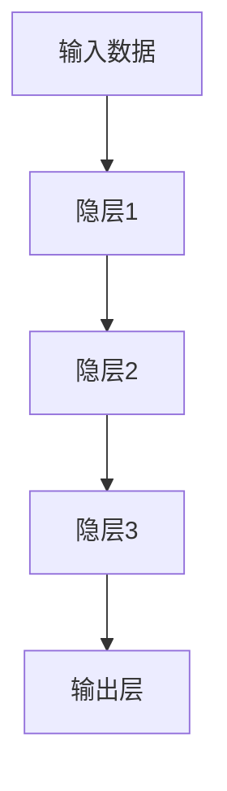
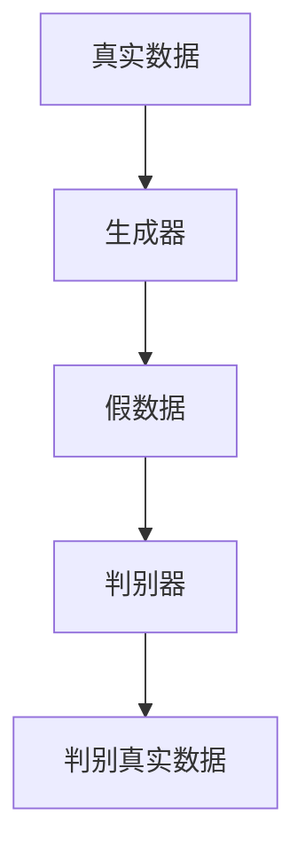
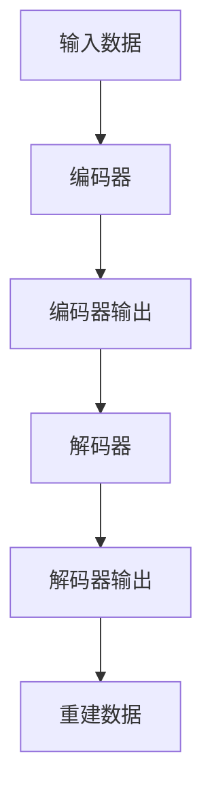

                 

# Deep Learning

## 1. 背景介绍

深度学习是人工智能领域的一个重要分支，自从2006年Hinton等人提出深度神经网络以来，该技术已广泛应用于图像识别、语音识别、自然语言处理、智能推荐等多个领域，并在许多应用中取得了突破性成果。深度学习通过多层神经网络学习数据的内在结构，从大量数据中自动提取特征，实现端到端的自动化学习和智能决策，是实现人工智能的强大工具。

### 1.1 深度学习的发展历程

深度学习的早期发展可以追溯到1980年代，当时的研究主要集中于前馈神经网络和卷积神经网络。然而，由于缺乏强大的计算资源和训练数据，早期深度学习的研究进展缓慢。直到2010年代，随着计算硬件的发展和数据的爆炸增长，深度学习开始重新获得广泛关注。特别是2012年AlexNet在ImageNet图像识别竞赛中获胜，标志着深度学习技术进入实用阶段。此后，深度学习在语音识别、自然语言处理、图像识别等多个领域取得突破，AI技术得以加速发展。

### 1.2 深度学习的核心思想

深度学习的核心思想是通过多层非线性变换学习数据表示。具体而言，深度学习模型包含多个隐层，每个隐层通过一系列线性变换和非线性激活函数提取更抽象的特征。在训练过程中，模型通过反向传播算法不断调整权重，最小化损失函数，逐步逼近理想的数据表示。最终，模型能够自动发现数据中隐藏的模式和规律，实现高效、准确的数据处理和智能决策。

## 2. 核心概念与联系

### 2.1 核心概念概述

为更好地理解深度学习的原理和架构，本节将介绍几个关键概念：

- **神经网络**：由多个神经元（节点）组成的层次化网络，用于处理和学习数据。
- **卷积神经网络（CNN）**：一种特殊的神经网络，常用于图像识别、视频分析等任务。
- **循环神经网络（RNN）**：一种能够处理序列数据的神经网络，常用于语言模型、时间序列预测等任务。
- **深度神经网络（DNN）**：包含多个隐层的神经网络，用于学习复杂数据表示。
- **生成对抗网络（GAN）**：一种由生成器和判别器构成的神经网络，用于生成逼真的假数据。
- **自编码器（AE）**：一种能够学习数据压缩和解压缩的神经网络，用于特征提取和数据降维。

这些概念之间的关系可以通过以下Mermaid流程图来展示：



这个流程图展示了深度学习中常用网络结构及其主要应用场景。

### 2.2 概念间的关系

这些核心概念之间存在紧密的联系，共同构成了深度学习的完整生态系统。下面通过几个Mermaid流程图来展示这些概念之间的关系：

#### 2.2.1 深度学习的网络结构



这个流程图展示了卷积神经网络的基本结构，输入数据经过卷积层和池化层的特征提取，再经过全连接层和输出层的预测输出。

#### 2.2.2 深度神经网络的结构



这个流程图展示了深度神经网络的基本结构，包含多个隐层，每个隐层对数据进行一次特征提取和变换。

#### 2.2.3 生成对抗网络的结构



这个流程图展示了生成对抗网络的基本结构，包含生成器和判别器两个网络，通过对抗训练学习生成逼真的假数据。

#### 2.2.4 自编码器的结构



这个流程图展示了自编码器的基本结构，包含编码器和解码器两个网络，用于数据压缩和解压缩。

## 3. 核心算法原理 & 具体操作步骤

### 3.1 算法原理概述

深度学习算法通常包括以下几个关键步骤：

1. **数据预处理**：包括数据清洗、归一化、分批次加载等操作，保证数据的质量和训练的效率。
2. **模型定义**：使用神经网络框架定义模型结构，设置网络参数和激活函数。
3. **损失函数设计**：根据任务类型设计合适的损失函数，衡量模型预测与真实标签的差距。
4. **优化算法选择**：选择适当的优化算法（如SGD、Adam等）和超参数（如学习率、批大小等）。
5. **模型训练**：使用训练数据进行前向传播和反向传播，不断调整模型参数。
6. **模型评估**：在验证集和测试集上评估模型性能，确保模型泛化能力强。

深度学习的核心在于模型参数的优化，通常通过梯度下降算法（包括随机梯度下降、动量梯度下降等）不断调整模型参数，最小化损失函数。深度学习模型的复杂性增加了优化难度，常见的方法包括反向传播算法、随机梯度下降算法（SGD）、Adam优化器等。

### 3.2 算法步骤详解

深度学习的训练过程可以分为以下几个步骤：

1. **数据准备**：将原始数据进行清洗、预处理和分批次加载，构建训练集、验证集和测试集。
2. **模型初始化**：使用随机初始化或预训练模型初始化网络参数。
3. **前向传播**：将训练数据输入模型，计算模型输出。
4. **损失计算**：根据任务类型计算损失函数值。
5. **反向传播**：计算损失函数对模型参数的梯度，更新网络参数。
6. **参数更新**：使用优化算法更新模型参数。
7. **模型评估**：在验证集和测试集上评估模型性能，防止过拟合。
8. **模型保存**：保存训练好的模型，用于部署和推理。

下面以手写数字识别任务为例，详细描述深度学习模型的训练过程：

1. **数据准备**：使用MNIST数据集，将原始像素数据转换为模型可处理的格式。
2. **模型初始化**：定义一个包含两个隐层的全连接神经网络，使用随机初始化参数。
3. **前向传播**：将训练集数据输入模型，计算模型输出。
4. **损失计算**：使用交叉熵损失函数计算模型输出与真实标签的差距。
5. **反向传播**：计算损失函数对模型参数的梯度，更新网络参数。
6. **参数更新**：使用Adam优化器更新模型参数。
7. **模型评估**：在验证集上评估模型性能，避免过拟合。
8. **模型保存**：保存训练好的模型，用于部署和推理。

### 3.3 算法优缺点

深度学习算法具有以下优点：

1. **自动特征提取**：能够自动发现数据中的复杂模式和规律，无需手动设计特征提取器。
2. **端到端学习**：能够直接从原始数据学习数据表示，无需中间过程。
3. **泛化能力强**：在大规模数据上进行训练，通常能够获得较好的泛化性能。
4. **应用广泛**：深度学习已经在图像识别、语音识别、自然语言处理等领域取得了突破性成果。

深度学习算法也存在一些缺点：

1. **模型复杂度高**：参数数量庞大，计算量高，需要大量的计算资源。
2. **过拟合风险高**：在大规模数据上训练深度模型，容易过拟合，需要复杂的数据增强和正则化技术。
3. **解释性差**：深度学习模型通常被视为“黑盒”系统，难以解释其内部工作机制。
4. **训练时间长**：深度模型训练时间长，需要消耗大量的计算资源和时间。

### 3.4 算法应用领域

深度学习算法在多个领域中得到了广泛应用：

- **计算机视觉**：图像分类、物体检测、图像生成、视频分析等任务。
- **自然语言处理**：机器翻译、文本分类、情感分析、问答系统等任务。
- **语音识别**：自动语音识别、语音合成、情感识别等任务。
- **智能推荐**：商品推荐、内容推荐、广告推荐等任务。
- **智能控制**：自动驾驶、机器人控制、能源管理等任务。

## 4. 数学模型和公式 & 详细讲解  
### 4.1 数学模型构建

深度学习模型的核心是神经网络，其数学模型可以描述为：

$$
y = W^{(L)} \sigma(z^{(L)}) + b^{(L)}
$$

其中，$y$表示模型输出，$W^{(L)}$和$b^{(L)}$为最后一层的权重和偏置，$z^{(L)}$为该层的输入，$\sigma$为激活函数。类似地，对于中间层，我们有：

$$
z^{(l)} = W^{(l)} \sigma(z^{(l-1)}) + b^{(l)}
$$

其中，$z^{(l)}$为该层的输入，$W^{(l)}$和$b^{(l)}$为该层的权重和偏置，$z^{(l-1)}$为该层的输入。

### 4.2 公式推导过程

深度学习模型的前向传播和反向传播过程可以使用梯度下降算法进行优化。假设我们有$n$个样本数据，每个样本包含$m$个特征，深度学习模型的损失函数为$J$，则梯度下降算法的优化目标是：

$$
\min_{\theta} J(\theta)
$$

其中$\theta$为所有可训练参数，包括权重$W$和偏置$b$。梯度下降算法的迭代公式为：

$$
\theta = \theta - \eta \nabla_{\theta} J(\theta)
$$

其中$\eta$为学习率，$\nabla_{\theta} J(\theta)$为损失函数对可训练参数的梯度。

以线性回归为例，假设我们有一个线性模型$y = Wx + b$，其中$x$为输入，$y$为输出，$W$和$b$为可训练参数。我们的目标是最小化平方误差损失函数$J$：

$$
J = \frac{1}{2m} \sum_{i=1}^{m}(y_i - Wx_i - b)^2
$$

使用梯度下降算法，我们有：

$$
\frac{\partial J}{\partial W} = \frac{1}{m} \sum_{i=1}^{m}(y_i - Wx_i - b)x_i
$$

$$
\frac{\partial J}{\partial b} = \frac{1}{m} \sum_{i=1}^{m}(y_i - Wx_i - b)
$$

因此，我们可以使用梯度下降算法更新$W$和$b$：

$$
W = W - \eta \frac{1}{m} \sum_{i=1}^{m}(y_i - Wx_i - b)x_i
$$

$$
b = b - \eta \frac{1}{m} \sum_{i=1}^{m}(y_i - Wx_i - b)
$$

### 4.3 案例分析与讲解

以深度神经网络在图像识别中的应用为例。假设我们有一个包含两个隐层的深度神经网络，其数学模型为：

$$
z^{(1)} = W^{(1)} x + b^{(1)}
$$

$$
z^{(2)} = W^{(2)} z^{(1)} + b^{(2)}
$$

$$
y = W^{(3)} z^{(2)} + b^{(3)}
$$

其中$z^{(1)}$为第一层的输出，$z^{(2)}$为第二层的输出，$z^{(2)}$为输入到第三层的输出。我们使用交叉熵损失函数$J$：

$$
J = -\frac{1}{m} \sum_{i=1}^{m}(y_i \log \hat{y_i} + (1 - y_i) \log (1 - \hat{y_i}))
$$

其中$y_i$为真实标签，$\hat{y_i}$为模型输出。使用梯度下降算法更新参数$W^{(1)}$、$W^{(2)}$和$W^{(3)}$，我们得到：

$$
\frac{\partial J}{\partial W^{(1)}} = -\frac{1}{m} \sum_{i=1}^{m}(z_i^{(1)} - y_i) x_i
$$

$$
\frac{\partial J}{\partial W^{(2)}} = -\frac{1}{m} \sum_{i=1}^{m}(z_i^{(2)} - y_i) z_i^{(1)}
$$

$$
\frac{\partial J}{\partial W^{(3)}} = -\frac{1}{m} \sum_{i=1}^{m}(z_i^{(2)} - y_i) z_i^{(2)}
$$

使用梯度下降算法更新参数，我们得到：

$$
W^{(1)} = W^{(1)} - \eta \frac{1}{m} \sum_{i=1}^{m}(z_i^{(1)} - y_i) x_i
$$

$$
W^{(2)} = W^{(2)} - \eta \frac{1}{m} \sum_{i=1}^{m}(z_i^{(2)} - y_i) z_i^{(1)}
$$

$$
W^{(3)} = W^{(3)} - \eta \frac{1}{m} \sum_{i=1}^{m}(z_i^{(2)} - y_i) z_i^{(2)}
$$

## 5. 项目实践：代码实例和详细解释说明

### 5.1 开发环境搭建

在Python环境中，我们可以使用TensorFlow或PyTorch等深度学习框架进行深度学习模型的开发和训练。以下以TensorFlow为例，介绍深度学习模型的开发环境搭建：

1. 安装Anaconda和Python环境：从官网下载并安装Anaconda，并创建虚拟环境。

2. 安装TensorFlow和相关依赖：使用pip或conda安装TensorFlow和相关依赖包。

3. 安装TensorBoard和Weights & Biases：TensorBoard和Weights & Biases是用于模型监控和实验跟踪的工具，可以可视化模型的训练过程和性能指标。

4. 安装GitHub和Jupyter Notebook：GitHub用于管理代码和项目，Jupyter Notebook用于开发和调试代码。

5. 安装CUDA和GPU驱动：如果计算机配置有GPU，需要安装CUDA和GPU驱动。

### 5.2 源代码详细实现

以下是一个使用TensorFlow实现手写数字识别的代码示例：

```python
import tensorflow as tf
from tensorflow.keras import layers

# 定义模型
model = tf.keras.Sequential([
    layers.Dense(256, activation='relu'),
    layers.Dense(256, activation='relu'),
    layers.Dense(10, activation='softmax')
])

# 编译模型
model.compile(optimizer='adam', loss='sparse_categorical_crossentropy', metrics=['accuracy'])

# 训练模型
model.fit(train_dataset, epochs=10, validation_data=val_dataset)

# 评估模型
model.evaluate(test_dataset)
```

### 5.3 代码解读与分析

以上代码展示了使用TensorFlow实现手写数字识别的完整流程。下面对代码进行详细解读和分析：

1. **模型定义**：使用`tf.keras.Sequential`定义深度神经网络模型，包含两个隐层和一个输出层。

2. **模型编译**：使用`model.compile`方法编译模型，设置优化器、损失函数和评估指标。

3. **模型训练**：使用`model.fit`方法训练模型，设置训练集、验证集和训练轮数。

4. **模型评估**：使用`model.evaluate`方法评估模型性能，设置测试集。

5. **输出结果**：模型训练完成后，输出训练和评估结果。

在实际应用中，我们还需要注意以下几点：

1. **数据准备**：将原始数据进行清洗、预处理和分批次加载，构建训练集、验证集和测试集。

2. **超参数调优**：调整模型参数和学习率等超参数，进行模型调优。

3. **模型保存**：保存训练好的模型，用于部署和推理。

4. **模型部署**：将模型部署到实际应用环境中，进行推理和预测。

## 6. 实际应用场景

### 6.1 计算机视觉

计算机视觉领域是深度学习的重要应用场景之一。深度学习模型在图像分类、物体检测、图像生成、视频分析等任务中取得了显著成果。例如，ResNet、Inception、VGG等模型在图像分类任务中取得了优异性能。YOLV、Faster R-CNN等模型在物体检测任务中也取得了突破性成果。

### 6.2 自然语言处理

自然语言处理是深度学习的另一个重要应用领域。深度学习模型在机器翻译、文本分类、情感分析、问答系统等任务中表现出色。例如，Transformer模型在机器翻译任务中取得了领先性能，BERT模型在文本分类和情感分析任务中表现优异。

### 6.3 语音识别

语音识别是深度学习的重要应用领域之一。深度学习模型在自动语音识别、语音合成、情感识别等任务中取得了显著成果。例如，DeepSpeech模型在自动语音识别任务中表现优异，WaveNet模型在语音合成任务中取得了突破性进展。

### 6.4 智能推荐

智能推荐是深度学习的重要应用领域之一。深度学习模型在商品推荐、内容推荐、广告推荐等任务中取得了显著成果。例如，基于协同过滤和深度学习的推荐系统在电商和视频平台上表现优异。

## 7. 工具和资源推荐

### 7.1 学习资源推荐

为帮助开发者系统掌握深度学习的理论基础和实践技巧，这里推荐一些优质的学习资源：

1. **《深度学习》（Ian Goodfellow、Yoshua Bengio、Aaron Courville）**：深度学习领域的经典教材，涵盖了深度学习的各个方面，从原理到应用均有详细讲解。

2. **Deep Learning Specialization课程（Andrew Ng）**：斯坦福大学开设的深度学习在线课程，包含五个部分，涵盖深度学习的基础和应用。

3. **CS231n课程（Fei-Fei Li、Justin Johnson）**：斯坦福大学计算机视觉课程，涵盖了计算机视觉的各个方面，包括深度学习在图像识别中的应用。

4. **自然语言处理课程（EMNLP 2013）**：EMNLP 2013会议上的自然语言处理课程，涵盖了自然语言处理的各个方面，包括深度学习在文本处理中的应用。

5. **机器学习课程（Yaser Abu-Mostafa、Miroslav Kubat、Ross C. Moore）**：斯坦福大学开设的机器学习课程，涵盖了机器学习的各个方面，包括深度学习的基础和应用。

### 7.2 开发工具推荐

为帮助开发者高效地开发深度学习模型，这里推荐一些常用的开发工具：

1. **TensorFlow**：由Google开发的深度学习框架，支持分布式计算和GPU加速，易于使用。

2. **PyTorch**：由Facebook开发的深度学习框架，支持动态计算图和GPU加速，易于调试和部署。

3. **Keras**：基于TensorFlow和Theano的高级深度学习框架，易于使用和理解。

4. **MXNet**：由亚马逊开发的深度学习框架，支持分布式计算和GPU加速，易于扩展和优化。

5. **Caffe**：由Berkeley Vision and Learning Center开发的深度学习框架，适用于计算机视觉任务。

### 7.3 相关论文推荐

为帮助开发者深入了解深度学习的前沿研究，这里推荐一些重要的相关论文：

1. **ImageNet Classification with Deep Convolutional Neural Networks（AlexNet）**：AlexNet模型在2012年ImageNet图像识别竞赛中获胜，标志着深度学习技术进入实用阶段。

2. **Long Short-Term Memory（LSTM）Networks for Language Modeling**：LSTM模型在机器翻译和语言建模任务中表现出色，奠定了长序列处理的基础。

3. **Attention is All You Need（Transformer）**：Transformer模型在机器翻译和语言建模任务中取得了领先性能，推动了深度学习的快速发展。

4. **BERT: Pre-training of Deep Bidirectional Transformers for Language Understanding**：BERT模型在文本分类和情感分析任务中表现优异，推动了深度学习在自然语言处理中的应用。

5. **Generative Adversarial Nets（GAN）**：GAN模型在图像生成和图像修复任务中取得了突破性进展，推动了生成式深度学习的发展。

## 8. 总结：未来发展趋势与挑战

### 8.1 研究成果总结

深度学习技术自2006年问世以来，已经在计算机视觉、自然语言处理、语音识别、智能推荐等多个领域取得了突破性成果。当前深度学习的研究热点包括：

1. **自监督学习**：利用无标签数据进行模型预训练，提高模型泛化性能。

2. **迁移学习**：通过在多个任务上进行微调，提高模型在不同任务上的性能。

3. **模型压缩**：通过模型压缩和优化，提高模型效率和可解释性。

4. **联邦学习**：通过分布式训练，提高模型训练速度和数据隐私保护。

### 8.2 未来发展趋势

深度学习技术将继续朝着以下几个方向发展：

1. **模型规模更大**：深度学习模型将继续朝着更大规模和更深层次方向发展，以提高模型的泛化性能和表达能力。

2. **应用场景更广**：深度学习技术将继续在计算机视觉、自然语言处理、语音识别、智能推荐等多个领域得到广泛应用，并拓展到更多新领域。

3. **融合技术更多**：深度学习技术将与其他技术（如自然语言处理、强化学习、知识图谱等）进行更深入的融合，推动人工智能技术的发展。

4. **训练速度更快**：深度学习模型的训练将朝着更快速、更高效的方向发展，以提高模型的训练效率和响应速度。

5. **可解释性更强**：深度学习模型将朝着更可解释、更透明的方向发展，以提高模型的可信度和应用安全性。

### 8.3 面临的挑战

尽管深度学习技术取得了显著进展，但在应用和发展过程中仍面临诸多挑战：

1. **计算资源需求高**：深度学习模型通常需要大量的计算资源，如GPU、TPU等高性能设备。

2. **数据需求量大**：深度学习模型需要大量高质量的数据进行训练，数据获取和标注成本高。

3. **模型复杂度高**：深度学习模型结构复杂，参数数量庞大，训练和推理效率低。

4. **模型泛化能力不足**：深度学习模型在训练数据上的表现通常较好，但在新数据上的泛化性能有待提高。

5. **模型可解释性差**：深度学习模型通常被视为“黑盒”系统，难以解释其内部工作机制。

### 8.4 研究展望

为应对深度学习面临的挑战，未来的研究需要在以下几个方面寻求新的突破：

1. **模型压缩和优化**：开发更高效的模型压缩和优化算法，提高模型的训练和推理效率。

2. **自监督学习和迁移学习**：研究更高效的自监督学习和迁移学习方法，提高模型的泛化性能和数据利用率。

3. **联邦学习和分布式训练**：研究更高效的联邦学习和分布式训练方法，提高模型的训练速度和数据隐私保护。

4. **模型可解释性和透明性**：研究更可解释、更透明的深度学习模型，提高模型的可信度和应用安全性。

5. **跨领域应用**：研究跨领域的深度学习应用，推动人工智能技术在更多领域的落地应用。

通过这些研究方向和突破，深度学习技术将迈向更加智能化、普适化和可解释的方向，为人工智能技术的发展提供更坚实的基础。

## 9. 附录：常见问题与解答

**Q1：深度学习与传统机器学习有何不同？**

A: 深度学习与传统机器学习的区别主要体现在以下几个方面：

1. **特征提取**：深度学习能够自动提取数据特征，无需手动设计特征提取器。而传统机器学习需要手动设计特征提取器。

2. **模型结构**：深度学习模型包含多个隐层，能够学习更加复杂的特征表示。而传统机器学习模型通常只有一层或几层。

3. **训练方法**：深度学习使用反向传播算法进行训练，能够自动调整模型参数。而传统机器学习使用手动调整的参数。

4. **数据需求**：深度学习需要大量标注数据进行训练，而传统机器学习可以仅使用少量数据进行训练。

5. **应用领域**：深度学习在图像识别、自然语言处理、语音识别等领域表现优异，而传统机器学习在分类、回归、聚类等领域仍有广泛应用。

**Q2：深度学习模型如何避免过拟合？**

A: 深度学习模型避免过拟合的方法包括：

1. **数据增强**：通过数据增强技术，扩充训练集，提高模型的泛化性能。

2. **正则化**：使用L2正则化、Dropout等方法，防止模型过拟合。

3. **模型复杂度控制**：通过调整模型结构，控制模型的复杂度，避免过拟

