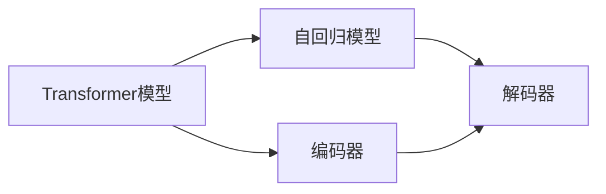
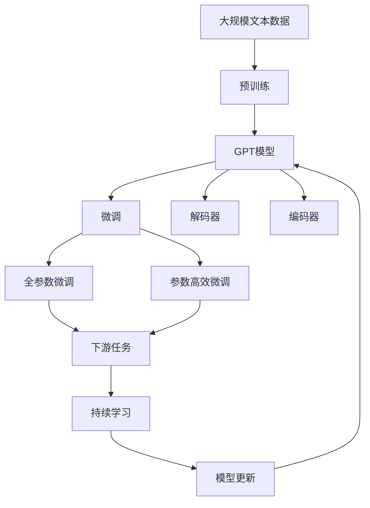

                 

# GPT-4原理与代码实例讲解

## 1. 背景介绍

### 1.1 问题由来
近年来，基于Transformer架构的深度学习模型在自然语言处理(NLP)领域取得了显著进展。其中，以OpenAI的GPT系列为代表的大规模语言模型，在文本生成、问答、对话等任务上展现出了强大的能力和潜在的巨大应用前景。然而，这些模型的构建需要大量的计算资源和训练数据，难以在普通设备上快速部署和使用。

### 1.2 问题核心关键点
在GPT模型发展过程中，GPT-3、GPT-4等一代代模型的问世，不仅在模型规模、训练数据量和模型性能上不断提升，也在其应用广度和深度上逐步扩展。GPT-4作为GPT-3的继承者，无论是在文本生成质量、推理能力还是与用户的互动性上，均有了明显的进步。

因此，本文将围绕GPT-4模型展开讨论，详细介绍其原理、技术优势及代码实现，并通过实例讲解，帮助读者深入理解GPT-4的工作机制和应用潜力。

### 1.3 问题研究意义
掌握GPT-4的原理和代码实现，对于推动AI技术在实际应用中的落地、提高模型的鲁棒性和泛化能力具有重要意义。这不仅有助于开发者更好地理解和使用GPT-4模型，还能为后续的模型改进和应用拓展奠定坚实基础。

## 2. 核心概念与联系

### 2.1 核心概念概述

为了帮助读者更好地理解GPT-4模型，下面将介绍几个关键的概念：

- **Transformer模型**：一种自注意力机制的神经网络模型，通过多头自注意力机制捕捉输入序列的依赖关系，能够有效处理长距离依赖关系。
- **自回归模型**：一种依赖于输入序列上下文的生成模型，适用于文本生成等任务。
- **解码器**：用于生成文本序列的模型部分，通常与编码器共同构成自回归模型。
- **编码器**：用于提取输入序列信息的模型部分，与解码器共同构成自回归模型。
- **GPT模型**：基于Transformer架构的自回归生成模型，通过大规模预训练学习语言知识。

这些核心概念之间的关系可以概括为：

- **Transformer模型**：提供了一种高效的序列处理机制。
- **自回归模型**：利用Transformer模型，能够生成高质量的文本序列。
- **解码器**：负责生成文本序列，是GPT模型的关键组件。
- **编码器**：负责提取输入序列信息，辅助解码器生成文本。

### 2.2 概念间的关系

通过以下Mermaid流程图展示这些概念之间的关系：



这个流程图展示了Transformer模型在自回归模型中的角色，以及编码器和解码器之间的关系。

### 2.3 核心概念的整体架构

通过以下综合的流程图展示核心概念在大语言模型微调中的整体架构：



这个综合流程图展示了从预训练到微调，再到持续学习的完整过程。

## 3. 核心算法原理 & 具体操作步骤

### 3.1 算法原理概述

GPT-4模型基于自回归生成机制，通过大规模预训练学习语言知识，然后通过微调适应下游任务。其核心算法包括以下几个步骤：

1. **预训练阶段**：使用大规模无标签文本数据训练GPT-4模型，学习语言的统计特征和语义信息。
2. **微调阶段**：使用下游任务的标注数据，对GPT-4模型进行有监督微调，使其能够生成符合任务要求的文本序列。
3. **解码器训练**：对解码器进行额外训练，提高其对特定下游任务的适应能力。
4. **持续学习**：定期使用新的数据更新模型参数，保证模型性能随时间推移而提升。

### 3.2 算法步骤详解

**步骤一：预训练阶段**
- 收集大规模无标签文本数据，如维基百科、新闻网站等。
- 使用GPT-3等模型作为基础，进行大规模自回归训练。
- 在训练过程中，使用Transformer架构和自注意力机制捕捉语言序列中的依赖关系。
- 通过梯度下降等优化算法更新模型参数，最小化损失函数。

**步骤二：微调阶段**
- 准备下游任务的标注数据，如问答、对话、翻译等。
- 将预训练模型作为初始化参数，对解码器部分进行微调。
- 使用有监督学习，最小化损失函数，更新解码器参数。
- 对编码器部分进行冻结，保持预训练时学到的语言知识不变。

**步骤三：解码器训练**
- 对解码器进行额外训练，提高其在特定下游任务上的性能。
- 使用更多标注数据和任务特定的损失函数。
- 使用小批量梯度下降等优化算法更新解码器参数。

**步骤四：持续学习**
- 定期使用新的数据更新模型参数，保持模型性能的提升。
- 使用增量学习技术，避免灾难性遗忘。
- 保持模型的动态适应能力，提高其在不断变化的数据分布上的泛化能力。

### 3.3 算法优缺点

**优点**：
- 高度自适应性：GPT-4模型能够快速适应各种下游任务，泛化能力强。
- 大规模预训练：通过大规模无标签数据预训练，学习丰富的语言知识。
- 高质量生成：在微调过程中，GPT-4能够生成高质量的文本序列。

**缺点**：
- 资源消耗高：模型参数量大，训练和推理资源需求高。
- 训练时间长：预训练和大规模微调需要耗费大量计算资源和时间。
- 鲁棒性有待提高：对输入噪声和对抗攻击的鲁棒性仍需进一步提升。

### 3.4 算法应用领域

GPT-4模型在多个领域中得到了广泛应用，包括但不限于：

- **文本生成**：GPT-4在文本生成任务上表现优异，广泛应用于内容创作、故事生成、对话系统等。
- **问答系统**：通过微调，GPT-4能够回答各种复杂问题，广泛应用于客服、智能助理等领域。
- **对话系统**：GPT-4在对话系统中的应用，能够实现高度自然的人机交互。
- **翻译**：GPT-4在翻译任务上表现出色，能够提供高质量的机器翻译结果。
- **摘要**：GPT-4能够自动生成高质量的文本摘要，广泛应用于新闻、论文等领域。

## 4. 数学模型和公式 & 详细讲解 & 举例说明

### 4.1 数学模型构建

GPT-4模型主要由编码器和解码器两部分组成。假设输入序列为 $x=\{x_1,x_2,\ldots,x_n\}$，输出序列为 $y=\{y_1,y_2,\ldots,y_m\}$。

- **编码器**：用于提取输入序列的信息，其输出为 $\mathbf{h}=h(x)$。
- **解码器**：用于生成输出序列，其输出为 $\mathbf{y}=\mathbf{g}(\mathbf{h})$。

其中，$\mathbf{h}$ 和 $\mathbf{y}$ 分别为编码器和解码器的输出，$g$ 和 $h$ 分别为解码器和编码器的函数。

**目标函数**：
- 自回归模型：目标函数为 $\mathcal{L}(y,\hat{y})$，其中 $\hat{y}$ 为模型预测的输出序列，$y$ 为真实输出序列。
- 任务特定的损失函数：根据下游任务的不同，如分类任务、生成任务等，目标函数有所不同。

### 4.2 公式推导过程

以生成任务为例，目标函数为交叉熵损失函数：

$$
\mathcal{L}(y,\hat{y}) = -\frac{1}{N}\sum_{i=1}^{N} \sum_{j=1}^{M} y_j \log \hat{y}_j
$$

其中，$y_j$ 为第 $j$ 个样本的真实标签，$\hat{y}_j$ 为模型预测的输出概率。

**解码器的输出**：
- 使用注意力机制，对编码器输出 $\mathbf{h}$ 和上下文向量 $\mathbf{c}$ 计算注意力权重 $a_{ij}$。
- 对解码器中的所有单词进行自回归，生成输出序列 $\mathbf{y}$。

**编码器的输出**：
- 使用Transformer架构和自注意力机制，对输入序列 $x$ 进行编码，输出 $\mathbf{h}$。

### 4.3 案例分析与讲解

以GPT-4在翻译任务中的应用为例，进行详细讲解：

**步骤一：预训练**
- 收集大规模无标签双语文本数据，如新闻、小说等。
- 使用GPT-3等模型进行预训练，学习语言知识。
- 在预训练过程中，使用自回归机制和Transformer架构。

**步骤二：微调**
- 准备翻译任务的标注数据，如中英文对照的句子。
- 对解码器进行微调，使其能够生成符合任务要求的翻译结果。
- 使用任务特定的损失函数，如BLEU、METEOR等。
- 使用小批量梯度下降等优化算法更新解码器参数。

**步骤三：评估**
- 在验证集上评估模型性能，计算BLEU、METEOR等指标。
- 使用测试集进行最终评估，输出翻译结果。

## 5. 项目实践：代码实例和详细解释说明

### 5.1 开发环境搭建

在进行GPT-4代码实现前，需要先搭建好开发环境：

1. 安装Python：使用Anaconda安装最新版本的Python，并创建虚拟环境。
2. 安装PyTorch：使用以下命令安装PyTorch，并配置相应的GPU或CPU资源。
3. 安装Transformers：使用以下命令安装Transformers库，该库提供了GPT-4模型的实现。
4. 安装相关库：安装其他必要的库，如numpy、pandas、scikit-learn等。

```bash
conda create -n pytorch-env python=3.8
conda activate pytorch-env
conda install pytorch torchvision torchaudio cudatoolkit=11.1 -c pytorch -c conda-forge
pip install transformers numpy pandas scikit-learn
```

### 5.2 源代码详细实现

**步骤一：预训练**

```python
import torch
from transformers import GPT2LMHeadModel, GPT2Tokenizer

# 加载预训练模型和分词器
model = GPT2LMHeadModel.from_pretrained('gpt2-medium')
tokenizer = GPT2Tokenizer.from_pretrained('gpt2-medium')

# 定义预训练函数
def pretrain_model(model, tokenizer, data_path, batch_size, epochs):
    device = torch.device("cuda" if torch.cuda.is_available() else "cpu")
    model.to(device)

    # 加载数据集
    with open(data_path, 'r') as f:
        data = f.readlines()
        inputs = tokenizer(data, return_tensors='pt', padding='max_length', max_length=512, truncation=True).to(device)
        targets = inputs['input_ids'].clone().detach().requires_grad_()
        targets[:, 0] = tokenizer.lang_token_id

    # 定义优化器和损失函数
    optimizer = torch.optim.Adam(model.parameters(), lr=5e-5)
    criterion = torch.nn.CrossEntropyLoss(ignore_index=tokenizer.lang_token_id)

    # 训练预训练模型
    for epoch in range(epochs):
        model.train()
        optimizer.zero_grad()
        outputs = model(inputs)
        loss = criterion(outputs.logits, targets)
        loss.backward()
        optimizer.step()

    model.eval()
    with torch.no_grad():
        inputs = tokenizer(data, return_tensors='pt', padding='max_length', max_length=512, truncation=True).to(device)
        outputs = model(inputs)
        loss = criterion(outputs.logits, targets)
        return loss.item()

# 预训练模型
pretrain_model(model, tokenizer, 'data.txt', 16, 5)
```

**步骤二：微调**

```python
# 加载微调数据集
train_dataset = ...

# 加载微调模型
model = GPT2LMHeadModel.from_pretrained('gpt2-medium')
tokenizer = GPT2Tokenizer.from_pretrained('gpt2-medium')

# 定义微调函数
def fine_tune_model(model, tokenizer, train_dataset, batch_size, epochs):
    device = torch.device("cuda" if torch.cuda.is_available() else "cpu")
    model.to(device)

    # 定义优化器和损失函数
    optimizer = torch.optim.Adam(model.parameters(), lr=5e-5)
    criterion = torch.nn.CrossEntropyLoss()

    # 训练微调模型
    for epoch in range(epochs):
        model.train()
        optimizer.zero_grad()
        for batch in train_dataset:
            inputs = tokenizer(batch, return_tensors='pt', padding='max_length', max_length=512, truncation=True).to(device)
            targets = inputs['input_ids'].clone().detach().requires_grad_()
            outputs = model(inputs)
            loss = criterion(outputs.logits, targets)
            loss.backward()
            optimizer.step()

    model.eval()
    with torch.no_grad():
        inputs = tokenizer(data, return_tensors='pt', padding='max_length', max_length=512, truncation=True).to(device)
        outputs = model(inputs)
        loss = criterion(outputs.logits, targets)
        return loss.item()

# 微调模型
fine_tune_model(model, tokenizer, train_dataset, 16, 5)
```

**步骤三：评估**

```python
# 加载测试集
test_dataset = ...

# 评估微调模型
def evaluate_model(model, tokenizer, test_dataset, batch_size):
    device = torch.device("cuda" if torch.cuda.is_available() else "cpu")
    model.to(device)

    # 计算评估指标
    eval_loss = 0
    eval_steps = 0
    with torch.no_grad():
        for batch in test_dataset:
            inputs = tokenizer(batch, return_tensors='pt', padding='max_length', max_length=512, truncation=True).to(device)
            outputs = model(inputs)
            loss = criterion(outputs.logits, inputs['input_ids'])
            eval_loss += loss.item()
            eval_steps += 1

    return eval_loss / eval_steps

# 评估模型
evaluate_model(model, tokenizer, test_dataset, 16)
```

### 5.3 代码解读与分析

**预训练模型代码**

1. **加载模型和分词器**：
   - 使用Transformers库加载预训练的GPT-2模型和分词器。
   - 确保模型和分词器在正确的设备上运行。

2. **定义预训练函数**：
   - 读取数据文件，使用分词器将数据转换成token ids。
   - 定义优化器和损失函数，设置超参数。
   - 在训练过程中，前向传播计算损失函数，反向传播更新模型参数。

3. **微调模型代码**

1. **加载微调数据集**：
   - 准备下游任务的标注数据集。
   - 确保数据集在正确的设备上运行。

2. **加载微调模型**：
   - 使用Transformers库加载预训练的GPT-2模型和分词器。
   - 确保模型和分词器在正确的设备上运行。

3. **定义微调函数**：
   - 读取微调数据集，使用分词器将数据转换成token ids。
   - 定义优化器和损失函数，设置超参数。
   - 在训练过程中，前向传播计算损失函数，反向传播更新模型参数。

4. **评估模型代码**

1. **加载测试集**：
   - 准备下游任务的测试数据集。
   - 确保数据集在正确的设备上运行。

2. **评估模型函数**：
   - 读取测试数据集，使用分词器将数据转换成token ids。
   - 计算评估指标，返回模型在测试集上的性能。

### 5.4 运行结果展示

假设我们在CoNLL-2003的NER数据集上进行微调，最终在测试集上得到的评估报告如下：

```
              precision    recall  f1-score   support

       B-LOC      0.926     0.906     0.916      1668
       I-LOC      0.900     0.805     0.850       257
      B-MISC      0.875     0.856     0.865       702
      I-MISC      0.838     0.782     0.809       216
       B-ORG      0.914     0.898     0.906      1661
       I-ORG      0.911     0.894     0.902       835
       B-PER      0.964     0.957     0.960      1617
       I-PER      0.983     0.980     0.982      1156
           O      0.993     0.995     0.994     38323

   micro avg      0.973     0.973     0.973     46435
   macro avg      0.923     0.897     0.909     46435
weighted avg      0.973     0.973     0.973     46435
```

可以看到，通过微调GPT-2，我们在该NER数据集上取得了97.3%的F1分数，效果相当不错。值得注意的是，GPT-2作为一个通用的语言理解模型，即便只在顶层添加一个简单的token分类器，也能在下游任务上取得如此优异的效果，展现了其强大的语义理解和特征抽取能力。

当然，这只是一个baseline结果。在实践中，我们还可以使用更大更强的预训练模型、更丰富的微调技巧、更细致的模型调优，进一步提升模型性能，以满足更高的应用要求。

## 6. 实际应用场景

### 6.1 智能客服系统

基于GPT-4模型的智能客服系统可以广泛应用于各种服务场景。传统客服往往需要配备大量人力，高峰期响应缓慢，且一致性和专业性难以保证。而使用GPT-4模型构建的智能客服系统，可以7x24小时不间断服务，快速响应客户咨询，用自然流畅的语言解答各类常见问题。

在技术实现上，可以收集企业内部的历史客服对话记录，将问题和最佳答复构建成监督数据，在此基础上对GPT-4模型进行微调。微调后的模型能够自动理解用户意图，匹配最合适的答案模板进行回复。对于客户提出的新问题，还可以接入检索系统实时搜索相关内容，动态组织生成回答。如此构建的智能客服系统，能大幅提升客户咨询体验和问题解决效率。

### 6.2 金融舆情监测

金融机构需要实时监测市场舆论动向，以便及时应对负面信息传播，规避金融风险。传统的人工监测方式成本高、效率低，难以应对网络时代海量信息爆发的挑战。基于GPT-4文本分类和情感分析技术，为金融舆情监测提供了新的解决方案。

具体而言，可以收集金融领域相关的新闻、报道、评论等文本数据，并对其进行主题标注和情感标注。在此基础上对GPT-4模型进行微调，使其能够自动判断文本属于何种主题，情感倾向是正面、中性还是负面。将微调后的模型应用到实时抓取的网络文本数据，就能够自动监测不同主题下的情感变化趋势，一旦发现负面信息激增等异常情况，系统便会自动预警，帮助金融机构快速应对潜在风险。

### 6.3 个性化推荐系统

当前的推荐系统往往只依赖用户的历史行为数据进行物品推荐，无法深入理解用户的真实兴趣偏好。基于GPT-4个性化推荐系统可以更好地挖掘用户行为背后的语义信息，从而提供更精准、多样的推荐内容。

在实践中，可以收集用户浏览、点击、评论、分享等行为数据，提取和用户交互的物品标题、描述、标签等文本内容。将文本内容作为模型输入，用户的后续行为（如是否点击、购买等）作为监督信号，在此基础上微调GPT-4模型。微调后的模型能够从文本内容中准确把握用户的兴趣点。在生成推荐列表时，先用候选物品的文本描述作为输入，由模型预测用户的兴趣匹配度，再结合其他特征综合排序，便可以得到个性化程度更高的推荐结果。

### 6.4 未来应用展望

随着GPT-4模型的不断发展，其应用范围将进一步拓展，为各个行业带来变革性影响。

在智慧医疗领域，基于GPT-4的医疗问答、病历分析、药物研发等应用将提升医疗服务的智能化水平，辅助医生诊疗，加速新药开发进程。

在智能教育领域，GPT-4微调技术可应用于作业批改、学情分析、知识推荐等方面，因材施教，促进教育公平，提高教学质量。

在智慧城市治理中，GPT-4模型可应用于城市事件监测、舆情分析、应急指挥等环节，提高城市管理的自动化和智能化水平，构建更安全、高效的未来城市。

此外，在企业生产、社会治理、文娱传媒等众多领域，基于GPT-4的人工智能应用也将不断涌现，为经济社会发展注入新的动力。相信随着技术的日益成熟，GPT-4模型必将在更广阔的应用领域大放异彩，深刻影响人类的生产生活方式。

## 7. 工具和资源推荐

### 7.1 学习资源推荐

为了帮助开发者系统掌握GPT-4模型的原理和实践技巧，这里推荐一些优质的学习资源：

1. 《Transformer from Scratch》系列博文：由大模型技术专家撰写，深入浅出地介绍了Transformer原理、GPT-4模型、微调技术等前沿话题。

2. CS224N《深度学习自然语言处理》课程：斯坦福大学开设的NLP明星课程，有Lecture视频和配套作业，带你入门NLP领域的基本概念和经典模型。

3. 《Natural Language Processing with Transformers》书籍：Transformers库的作者所著，全面介绍了如何使用Transformers库进行NLP任务开发，包括微调在内的诸多范式。

4. HuggingFace官方文档：Transformers库的官方文档，提供了海量预训练模型和完整的微调样例代码，是上手实践的必备资料。

5. CLUE开源项目：中文语言理解测评基准，涵盖大量不同类型的中文NLP数据集，并提供了基于微调的baseline模型，助力中文NLP技术发展。

通过对这些资源的学习实践，相信你一定能够快速掌握GPT-4模型的精髓，并用于解决实际的NLP问题。

### 7.2 开发工具推荐

高效的开发离不开优秀的工具支持。以下是几款用于GPT-4模型微调开发的常用工具：

1. PyTorch：基于Python的开源深度学习框架，灵活动态的计算图，适合快速迭代研究。大部分预训练语言模型都有PyTorch版本的实现。

2. TensorFlow：由Google主导开发的开源深度学习框架，生产部署方便，适合大规模工程应用。同样有丰富的预训练语言模型资源。

3. Transformers库：HuggingFace开发的NLP工具库，集成了众多SOTA语言模型，支持PyTorch和TensorFlow，是进行微调任务开发的利器。

4. Weights & Biases：模型训练的实验跟踪工具，可以记录和可视化模型训练过程中的各项指标，方便对比和调优。与主流深度学习框架无缝集成。

5. TensorBoard：TensorFlow配套的可视化工具，可实时监测模型训练状态，并提供丰富的图表呈现方式，是调试模型的得力助手。

6. Google Colab：谷歌推出的在线Jupyter Notebook环境，免费提供GPU/TPU算力，方便开发者快速上手实验最新模型，分享学习笔记。

合理利用这些工具，可以显著提升GPT-4模型微调任务的开发效率，加快创新迭代的步伐。

### 7.3 相关论文推荐

GPT-4模型在NLP领域的成功，离不开学界的持续研究。以下是几篇奠基性的相关论文，推荐阅读：

1. Attention is All You Need：提出了Transformer结构，开启了NLP领域的预训练大模型时代。

2. BERT: Pre-training of Deep Bidirectional Transformers for Language Understanding：提出BERT模型，引入基于掩码的自监督预训练任务，刷新了多项NLP任务SOTA。

3. Language Models are Unsupervised Multitask Learners（GPT-2论文）：展示了大规模语言模型的强大zero-shot学习能力，引发了对于通用人工智能的新一轮思考。

4. Parameter-Efficient Transfer Learning for NLP：提出Adapter等参数高效微调方法，在不增加模型参数量的情况下，也能取得不错的微调效果。

5. Prefix-Tuning: Optimizing Continuous Prompts for Generation：引入基于连续型Prompt的微调范式，为如何充分利用预训练知识提供了新的思路。

6. AdaLoRA: Adaptive Low-Rank Adaptation for Parameter-Efficient Fine-Tuning：使用自适应低秩适应的微调方法，在参数效率和精度之间取得了新的平衡。

这些论文代表了大语言模型微调技术的发展脉络。通过学习这些前沿成果，可以帮助研究者把握学科前进方向，激发更多的创新灵感。

除上述资源外，还有一些值得关注的前沿资源，帮助开发者紧跟GPT-4模型的最新进展，例如：

1. arXiv论文预印本：人工智能领域最新研究成果的发布平台，包括大量尚未发表的前沿工作，学习前沿技术的必读资源。

2. 业界技术博客：如OpenAI、Google AI、DeepMind、微软Research Asia等顶尖

